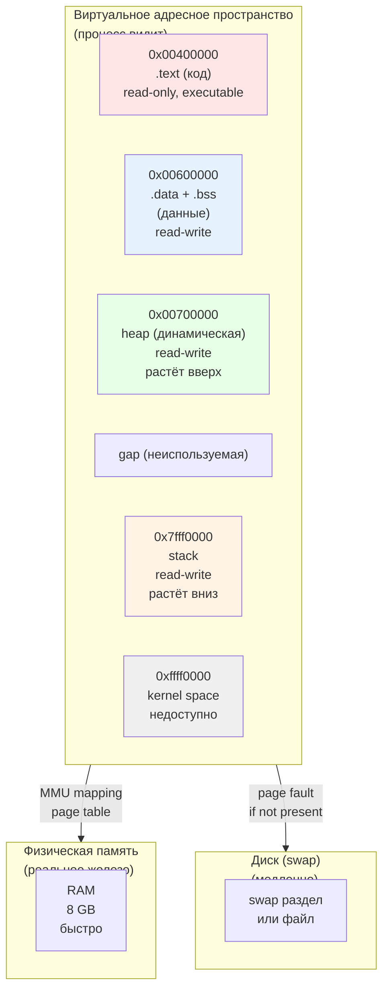
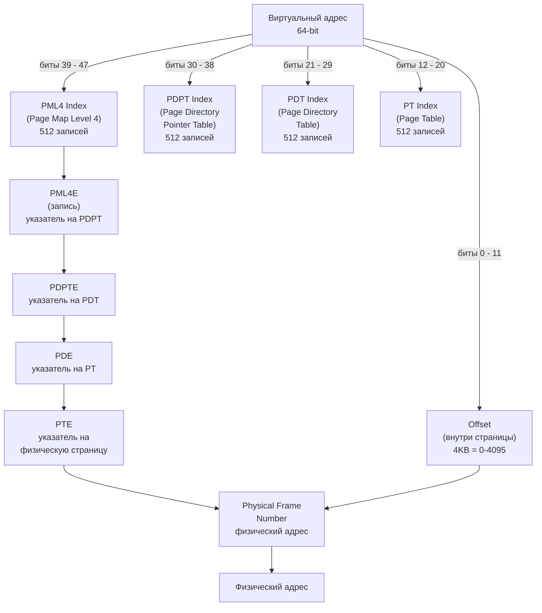
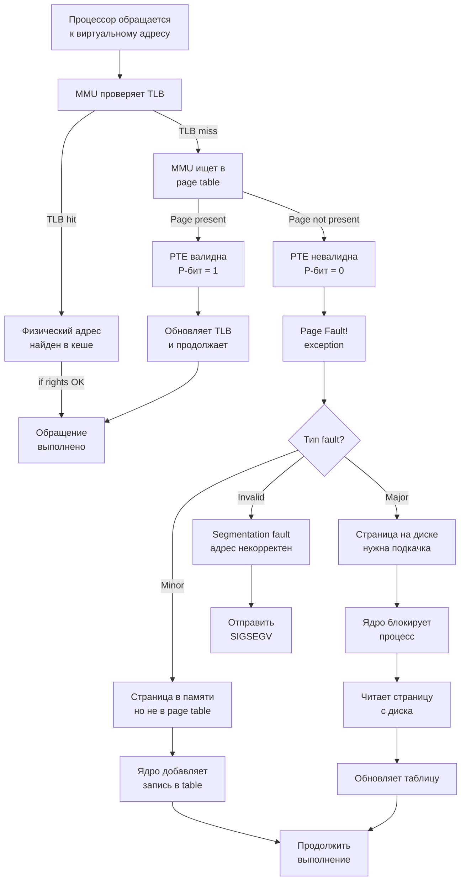
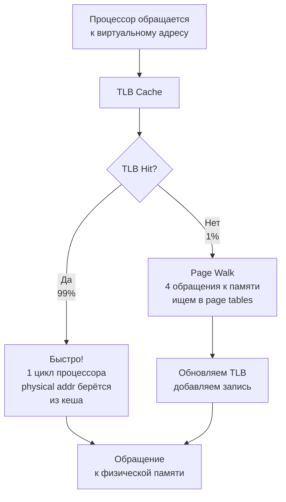
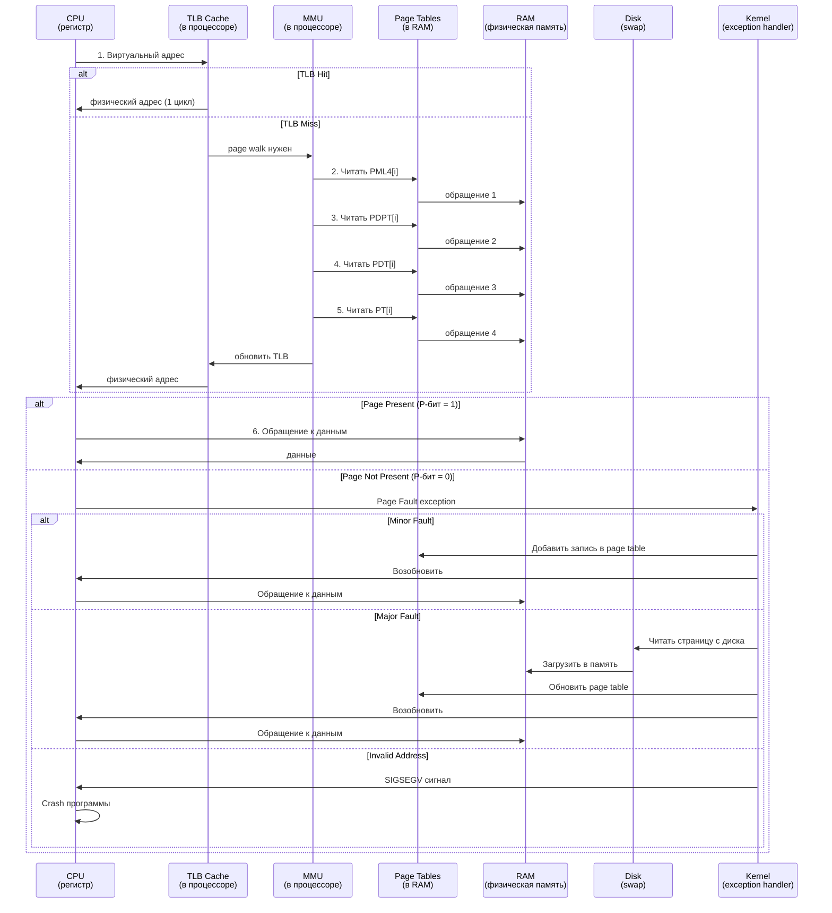
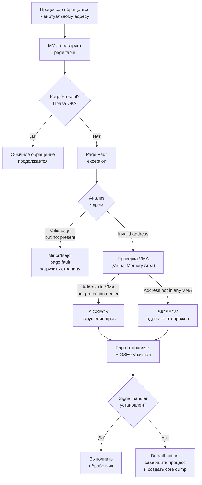

##### Виртуальная память. Что это такое и зачем нужно?

**Виртуальная память** — это механизм, при котором каждый процесс видит своё **виртуальное адресное пространство**,
логически непрерывное и изолированное от других процессов, в то время как реальные данные лежат в физической памяти
и/или на диске.

**Зачем это нужно:**

- **Изоляция процессов** - процессы не видят и не трогают памятью друг друга
- **Удобство программирования** - каждый процесс думает что у него есть память с адреса 0x0
- **Возможность использовать больше памяти, чем есть физически** - за счёт подкачки (swap)
- **Защита памяти** - разные права доступа на разные области (.text read-only, heap read-write)
- **Эффективное разделение памяти** - общие библиотеки загружаются один раз

**Архитектура виртуальной памяти:**



**Типичное расположение в памяти:**

```
Высокие адреса (0xffff...)
    ┌─────────────────────────────┐
    │   Kernel Space (ядро)       │  недоступно для пользовательских процессов
    ├─────────────────────────────┤
    │   Stack (стек)              │  растёт вниз ↓
    │   (локальные переменные,    │
    │    параметры функций)       │
    ├─ ─ ─ ─ ─ ─ ─ ─ ─ ─ ─ ─ ─ ─ ┤
    │                             │
    │   Unused (свободное место)  │  этот gap растёт при необходимости
    │                             │
    ├─ ─ ─ ─ ─ ─ ─ ─ ─ ─ ─ ─ ─ ─ ┤
    │   Heap (куча)               │  растёт вверх ↑
    │   (malloc, new,             │
    │    динамическая память)     │
    ├─────────────────────────────┤
    │   .bss (инициализированное  │
    │   нулями, глобальные vars)  │
    ├─────────────────────────────┤
    │   .data (инициализированные │
    │   глобальные данные)        │
    ├─────────────────────────────┤
    │   .text (код программы)     │  read-only, executable
    ├─────────────────────────────┤
    │   ELF header, segments      │
Низкие адреса (0x00000...)
```

---

##### Что такое страничная организация памяти, таблицы страниц, как они устроены и где хранятся?

**Страничная организация памяти** — это разделение памяти на фиксированные блоки (страницы), обычно по 4 KB на x86-64.

**Почему страницы:**

- Проще управлять памятью малыми блоками
- Упрощает защиту и разделение памяти между процессами
- Позволяет отображать виртуальные адреса на физические динамически

**Таблицы страниц (Page Tables)** — это структура данных, которая отображает виртуальные адреса на физические:

```
Виртуальный адрес: 0x12345678
    ↓ (разбор)
    Страница (Page Number):  0x12345 (индекс в таблице)
    Смещение в странице:     0x678    (смещение внутри страницы)
    ↓ (поиск в page table)
    Физический адрес: 0xAABBB678
```

**Структура таблицы страниц на x86-64 (4-уровневая иерархия):**



**Структура записи в таблице страниц (Page Table Entry - PTE):**

```
PTE: 64-bit значение

[63:52] Reserved (зарезервировано для использования в будущем)
[51:12] Physical Page Frame Number (40 бит) - физический адрес страницы
[11:9]  Available (доступно для ОС)
[8]     G - Global (не сбрасывать из TLB при смене контекста)
[7]     PAT - Page Attribute Table (кеширование)
[6]     D - Dirty (страница была изменена)
[5]     A - Accessed (страница была доступна)
[4]     PCD - Cache Disabled (отключить кеш)
[3]     PWT - Page Write-Through (режим записи)
[2]     U/S - User/Supervisor (0=kernel, 1=user)
[1]     W/R - Read/Write (0=read-only, 1=read-write)
[0]     P - Present (1=страница в памяти, 0=на диске/отсутствует)
```

**Где хранятся таблицы страниц:**

- **В оперативной памяти** - для быстрого доступа
- **Каждый процесс имеет свой набор таблиц** - указатель на PML4 хранится в регистре CR3
- **Ядро поддерживает иерархию** - каждый процесс, при переключении контекста, переключает CR3

**Пример иерархии для одного процесса:**

```
Process (Linux task_struct)
    |
    +-- mm_struct (управление памятью)
            |
            +-- pgd (Page Global Directory)
                    |
                    +-- физический адрес PML4 (в памяти)
                            |
                            +-- PML4E[0] -> адрес PDPT
                            +-- PML4E[1] -> адрес PDPT
                            +-- PML4E[511] -> адрес PDPT (для kernel)
```

**Просмотр таблиц страниц процесса:**

```bash
# Просмотр информации о памяти процесса
cat /proc/<pid>/maps
# Output:
# 7f3a8a000000-7f3a8a021000 rw-p 00000000 00:00 0  [heap]
# 7fff84600000-7fff84621000 rw-p 00000000 00:00 0  [stack]

# Более подробная статистика
cat /proc/<pid>/status | grep -E "VmPeak|VmSize|VmRSS"
# VmPeak: максимальный размер памяти
# VmSize: текущий размер виртуальной памяти  
# VmRSS:  количество страниц в оперативной памяти
```

---

##### Что такое page fault, в чем отличие minor от major page fault?

**Page fault** — это исключение, которое генерирует MMU (Memory Management Unit) процессора, когда:

- Обращение к странице, для которой нет валидной записи в таблице страниц
- Нарушены права доступа (запись в read-only страницу)
- Страница не отображена на память

**Процесс обработки page fault:**



**Minor Page Fault:**

```c
// Когда происходит minor fault:
// 1. Разделяемая библиотека, отображённая в память несколько процессов
// 2. Copy-on-Write (CoW) после fork
// 3. Zero-filled pages (bss сегмент, malloc)

// Пример: fork() создаёт копию страниц (CoW)
if (fork() == 0) {
    // Child process
    x = 10;  // minor page fault -> копирует страницу
} else {
    // Parent continues
}
```

**Major Page Fault:**

```c
// Когда происходит major fault:
// 1. Доступ к swap (память вытеснена на диск)
// 2. Первый доступ к странице mmap'ленного файла
// 3. Первый доступ к странице demand-loaded программы

int *large_array = malloc(1000000 * sizeof(int));
large_array[0] = 1;      // minor fault (zeroed page)
large_array[999999] = 1; // major fault если на диске
```

**Различия:**

| Аспект         | Minor               | Major             |
|----------------|---------------------|-------------------|
| **Источник**   | Memory              | Disk/Swap         |
| **Время**      | < 1 микросекунда    | 10+ миллисекунд   |
| **Блокировка** | Нет                 | Да (I/O ожидание) |
| **Причины**    | CoW, новые страницы | Swap, mmap файлы  |
| **Частота**    | Высокая             | Низкая (проблема) |

**Просмотр статистики:**

```bash
# Посмотреть page faults процесса
ps aux
# Fields: ... MINFLT MAJFLT ...

# Более подробно через /proc
cat /proc/<pid>/stat | awk '{print "MinFlt:", $9, "MajFlt:", $11}'

# В реальном времени с perf
perf stat -e page-faults ./program
perf stat -e page-faults:u ./program  # user space only
perf stat -e major-faults ./program  # только major

# Трассировка через strace
strace -c ./program  # покажет количество page faults
```

---

##### Что такое TLB cache?

**TLB (Translation Lookaside Buffer)** — это кеш преобразований виртуальных адресов в физические, встроенный в
процессор.

**Почему нужен TLB:**

Просмотр 4-уровневой таблицы страниц требует 4 обращений к памяти:

- 1 обращение к PML4
- 1 обращение к PDPT
- 1 обращение к PDT
- 1 обращение к PT
- затем + обращение к самым данным = **5 обращений в памяти!**

Это очень медленно. TLB кеширует результаты преобразований.

**Структура TLB:**



**Виды TLB:**

| Тип            | Назначение                                                   |
|----------------|--------------------------------------------------------------|
| **dTLB**       | Data TLB - кеширует преобразования адресов данных            |
| **iTLB**       | Instruction TLB - кеширует преобразования адресов инструкций |
| **Shared TLB** | Некоторые процессоры имеют общий TLB L2                      |

**Типичные размеры TLB:**

```
Intel Skylake (x86-64):
  L1 dTLB: 64 entries (4KB pages)
  L1 iTLB: 128 entries (4KB pages)
  L2 dTLB: 1024 entries (4KB pages)
  L2 iTLB: 1024 entries (4KB pages)

Можно использовать большие страницы (2MB, 1GB) для меньшего количества записей:
  Large page TLB: несколько сотен entries
```

**TLB Miss и производительность:**

```c
// TLB Miss пример
#include <string.h>
#include <stdio.h>
#include <time.h>

#define SIZE (10 * 1024 * 1024)  // 10 MB

int main() {
    int *arr = malloc(SIZE);
    
    // Хороший доступ - локальность (TLB hits)
    for (int i = 0; i < SIZE / sizeof(int); i++) {
        arr[i] += 1;
    }
    // Большинство обращений попадают в TLB
    
    // Плохой доступ - ломаем TLB
    for (int i = 0; i < SIZE / sizeof(int); i += 1024) {
        arr[i] += 1;  // большие прыжки
    }
    // Много TLB misses
    
    free(arr);
    return 0;
}
```

**Оптимизация TLB:**

```bash
# Просмотр TLB статистики
perf stat -e dTLB-loads,dTLB-load-misses ./program
perf stat -e iTLB-loads,iTLB-load-misses ./program

# Пример вывода:
# 100,000,000  dTLB-loads
# 10,000,000   dTLB-load-misses  (10% miss rate)
```

**Большие страницы (Huge Pages):**

```bash
# Использование больших страниц (2MB) вместо 4KB уменьшает TLB pressure
cat /proc/meminfo | grep Huge

# Выделить большие страницы
echo 1024 > /proc/sys/vm/nr_hugepages

# Использовать в приложении
#include <sys/mman.h>
mmap(..., MAP_HUGETLB, ...)  // выделить 2MB страницы
```

---

##### Как происходит обращение процессора по адресу к памяти с учетом всего вышеназванного?

**Полная цепочка обращения к памяти:**



**Пошаговый процесс:**

1. **Процессор генерирует адрес**
   ```
   mov rax, [0x12345678]  // виртуальный адрес
   ```

2. **Проверка TLB** (< 1 ns)
   ```
   TLB содержит: VA=0x12345000 -> PA=0xAABBB000
   Успешно! (обычно 99% случаев)
   ```

3. **Физический адрес вычислен**
   ```
   VA: 0x12345678
   VA_page:   0x12345000
   VA_offset: 0x678
   
   PA_page (из TLB): 0xAABBB000
   PA: 0xAABBB000 + 0x678 = 0xAABBB678
   ```

4. **Обращение к памяти**
   ```
   Загрузить данные из физического адреса 0xAABBB678
   Время: ~100 ns (если L1 cache), ~300 ns (L2), ~40 ns (L3), ~200 ns (RAM)
   ```

5. **Если TLB miss** (~1%)
   ```
   MMU выполняет page walk:
   - Читать PML4[бит 39-47 адреса] из физической памяти CR3
   - Читать PDPT[бит 30-38] из адреса из PML4 записи
   - Читать PDT[бит 21-29] из адреса из PDPT записи
   - Читать PT[бит 12-20] из адреса из PDT записи
   - Получить физический адрес из PT записи
   
   Всё это ~200+ ns дополнительно
   ```

6. **Если page fault** (очень редко)
   ```
   P-бит в PTE == 0
   → исключение в процессор
   → контроль передан ядру (kernel exception handler)
   
   - Определить причину fault (minor/major/segfault)
   - Если major: загрузить страницу с диска (~10 ms!)
   - Обновить page table
   - Возобновить процесс
   ```

---

##### В какой ситуации возникает ошибка Segmentation fault и что в этой ситуации происходит на уровне ОС и процессора?

**Segmentation fault (SIGSEGV)** — это сигнал, который ядро посылает процессу при нарушении прав доступа к памяти.

**Причины Segmentation fault:**

```c
// 1. Разыменование NULL указателя
int *ptr = NULL;
*ptr = 42;  // ❌ SIGSEGV - обращение к адресу 0x0

// 2. Разыменование невалидного указателя
char *p = (char *)0xDEADBEEF;
printf("%c", *p);  // ❌ SIGSEGV - адрес не отображён

// 3. Запись в read-only память
const int *ptr = &some_const;
*(int *)ptr = 42;  // ❌ SIGSEGV - нарушение W-бита

// 4. Выполнение кода из data сегмента (DEP/W^X)
void (*func)() = (void (*)())&data_array;
func();  // ❌ SIGSEGV - нарушение X-бита

// 5. Выход за пределы стека
void recursive_bad(int depth) {
    int large_array[10000];
    recursive_bad(depth + 1);  // ❌ SIGSEGV - переполнение стека
}

// 6. Выход за пределы кучи (при использовании mmap)
void *ptr = mmap(..., 4096, ...);  // 1 страница
*((char *)ptr + 8192) = 1;  // ❌ SIGSEGV - за пределами mmap'ленной области
```

**Что происходит при Segmentation fault:**



**На уровне процессора:**

```
1. CPU обращается к адресу 0xDEADBEEF
2. MMU ищет PTE для этого адреса
3. PTE не найдена (P-бит = 0, адрес не в таблице страниц)
4. MMU генерирует исключение #PF (Page Fault)
5. Процессор переходит в режим kernel
6. Ядро вызывает обработчик исключения page_fault_handler()
```

**На уровне ОС (Linux):**

```c
// Упрощённый обработчик page fault
static void page_fault_handler(struct pt_regs *regs, unsigned long error_code) {
    unsigned long address = read_cr2();  // Адрес, вызвавший fault
    
    // 1. Проверить если это valid fault
    struct vm_area_struct *vma = find_vma(current, address);
    
    if (!vma) {
        // 2. Адрес не в никакой VMA
        send_signal(SIGSEGV);
        return;
    }
    
    // 3. Проверить права доступа
    if ((error_code & PF_WRITE) && !(vma->vm_flags & VM_WRITE)) {
        // Попытка записи в read-only область
        send_signal(SIGSEGV);
        return;
    }
    
    // 4. Если valid - загрузить страницу
    if (vma->vm_file) {
        // Из файла (mmap)
        page = read_page_from_file(vma->vm_file, address);
    } else {
        // Из памяти (heap, stack, etc)
        page = alloc_page();
    }
    
    // 5. Добавить в page table
    install_page(vma, address, page);
}
```

**Пример с обработчиком сигнала:**

```c
#include <signal.h>
#include <stdio.h>
#include <setjmp.h>

jmp_buf jump_buffer;

void segfault_handler(int sig) {
    printf("Caught SIGSEGV!\n");
    longjmp(jump_buffer, 1);  // Прыгнуть в заранее сохранённую точку
}

int main() {
    signal(SIGSEGV, segfault_handler);
    
    if (setjmp(jump_buffer) == 0) {
        // Опасная операция
        int *ptr = NULL;
        printf("Accessing NULL pointer...\n");
        //*ptr = 42;  // Это вызовет SIGSEGV
        printf("This won't print\n");
    } else {
        // Мы здесь если был SIGSEGV
        printf("Recovered from segfault!\n");
    }
    
    return 0;
}
```

**Просмотр информации о crash:**

```bash
# При crash программы без обработчика
./my_program
# Output: Segmentation fault (core dumped)

# Просмотр core dump
gdb ./my_program core
(gdb) where
#0  0x00000000 in ?? ()
#1  0x00400523 in main () at program.c:10

# Или использовать dmesg для системных ошибок
dmesg | tail
# my_program[1234]: segfault at 0 ip 00400000 sp 7fff0000 error 4 in my_program[400000+1000]
```
