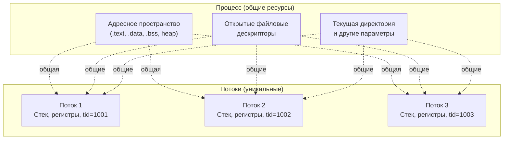
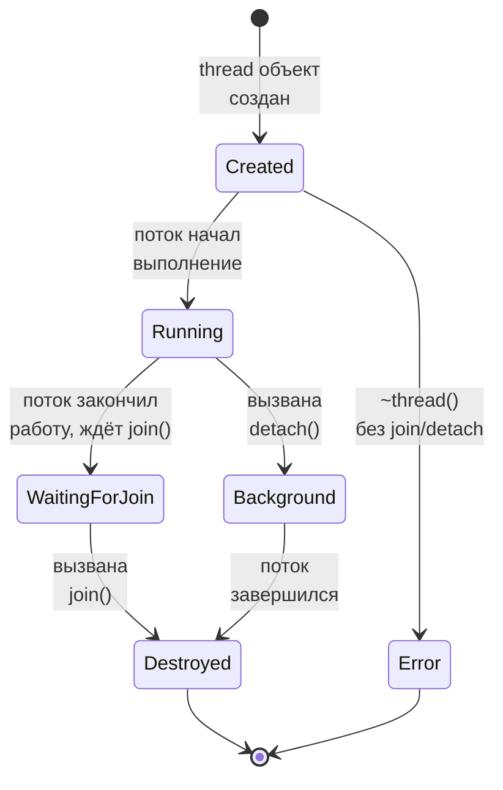
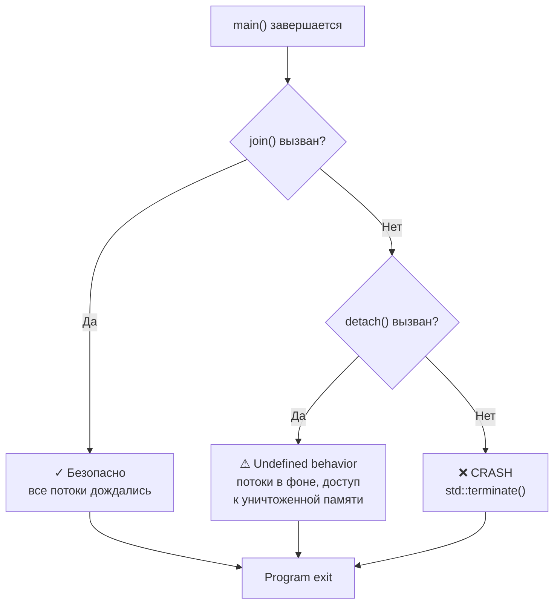
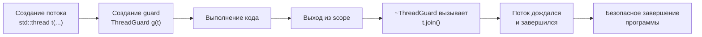

##### Что такое потоки выполнения (треды, threads, нити)?

**Поток выполнения (thread)** -- это легковесный процесс в контексте одного процесса. В отличие от процессов, потоки 
**одного процесса** делят:

- одно адресное пространство (обычную память, .data, .bss, heap)
- открытые файловые дескрипторы
- текущую директорию, umask, сигнал-маски (в некоторых случаях)

Но каждый поток имеет свой:

- стек (TLS, thread-local storage)
- счётчик инструкций (program counter)
- регистры процессора
- ID потока (tid)

Потоки используются для:

- параллельной обработки данных на многоядерных системах
- пока один поток ждёт (I/O), другой может выполнять работу
- более лёгкие переключения контекста, чем между процессами

**Архитектура процесса с потоками:**



##### Покажите пример создания и использования thread на С++.

В C++11 и выше используется `<thread>`:

```cpp
#include <thread>
#include <iostream>

void worker(int id) {
    for (int i = 0; i < 5; ++i) {
        std::cout << "Thread " << id << ": iteration " << i << "\n";
    }
}

int main() {
    // Создаём поток, который выполняет функцию worker(1)
    std::thread t1(worker, 1);
    
    // Создаём второй поток
    std::thread t2(worker, 2);
    
    // Основной поток может продолжить свою работу
    std::cout << "Main thread continues...\n";
    
    // Дожидаемся завершения обоих потоков
    t1.join();
    t2.join();
    
    std::cout << "All threads finished\n";
    return 0;
}
```

Компиляция:

```bash
g++ -std=c++11 -pthread thread_example.cpp -o thread_example
./thread_example
```

##### Покажите пример параллельной обработки из двух тредов каких-либо данных.

Пример: два потока обрабатывают элементы вектора и суммируют их:

```cpp
#include <thread>
#include <vector>
#include <iostream>
#include <mutex>

std::mutex result_mutex;
long long total = 0;

void sum_range(const std::vector<int>& data, int start, int end) {
    long long partial_sum = 0;
    
    // Каждый поток считает свою часть БЕЗ блокировок (быстро)
    for (int i = start; i < end; ++i) {
        partial_sum += data[i];
    }
    
    // Только для добавления результата нужен мьютекс
    {
        std::lock_guard<std::mutex> lock(result_mutex);
        total += partial_sum;
    }
}

int main() {
    std::vector<int> data(1000);
    for (int i = 0; i < 1000; ++i) {
        data[i] = i + 1;
    }
    
    // Первый поток обрабатывает элементы 0-499
    std::thread t1(sum_range, std::ref(data), 0, 500);
    
    // Второй поток обрабатывает элементы 500-999
    std::thread t2(sum_range, std::ref(data), 500, 1000);
    
    t1.join();
    t2.join();
    
    std::cout << "Total sum: " << total << "\n";  // 500500
    return 0;
}
```

Здесь оба потока работают параллельно, каждый обрабатывает свою половину данных.

##### Что делают методы join и detach?

**`join()`:**

- Блокирует вызывающий поток до тех пор, пока целевой поток **не завершится**
- Ожидает всех наработок целевого потока
- После `join` можно проверить результаты работы потока
- Эта операция может быть вызвана только один раз

```cpp
std::thread t(worker);
t.join();  // Ждём завершения потока
std::cout << "Thread finished\n";
```

**`detach()`:**

- Отсоединяет поток от объекта `std::thread`
- Поток продолжает выполняться в фоне
- Вызывающий поток **не ждёт** завершения целевого потока
- После `detach()` объект `std::thread` больше нельзя контролировать

```cpp
std::thread t(worker);
t.detach();  // Отпускаем поток
std::cout << "Thread is running in background\n";
// Основной поток может завершиться, но фоновый поток продолжит работу
```

**Жизненный цикл потока - диаграмма:**



**Сравнение:**

| Операция                     | join       | detach                     |
|------------------------------|------------|----------------------------|
| Ожидание завершения          | Да         | Нет                        |
| Контроль потока              | Есть       | Нет                        |
| Возможность повторно вызвать | Нет        | Нет                        |
| Когда очищаются ресурсы      | После join | Когда поток сам завершится |

##### Что происходит, если main завершается, но при этом еще не все треды завершили свою работу?

Если вы вызвали `detach()`:

- Поток продолжает работать, но часто ведёт себя непредсказуемо
- Поток может обращаться к памяти, которая уже была освобождена (деструкторы глобальных объектов)
- Приводит к **undefined behavior** и часто крашам

Если вы забыли `join()`:

- Объект `std::thread` вызовет `std::terminate()` при своём уничтожении (в деструкторе)
- Программа **упадёт** с сообщением об ошибке

**Сценарии завершения программы:**



**Пример плохого кода:**

```cpp
int main() {
    std::thread t(worker);
    // Забыли join или detach!
    return 0;  // Крах: деструктор ~thread вызовет std::terminate()
}
```

**Правильный код:**

```cpp
int main() {
    std::thread t(worker);
    t.join();  // Или t.detach()
    return 0;
}
```

Для гарантии можно использовать RAII-паттерн:

```cpp
class ThreadGuard {
    std::thread& t;
public:
    explicit ThreadGuard(std::thread& t_) : t(t_) {}
    ~ThreadGuard() {
        if (t.joinable()) {
            t.join();
        }
    }
};

int main() {
    std::thread t(worker);
    ThreadGuard guard(t);  // Гарантирует join при выходе
    // ... код ...
    return 0;  // guard вызовет join в деструкторе
}
```

**Правильный RAII паттерн - диаграмма:**


