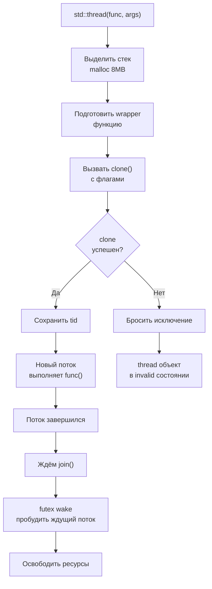
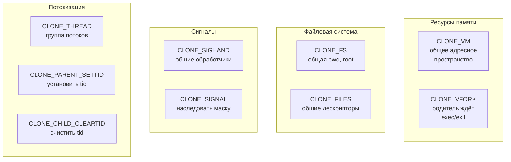
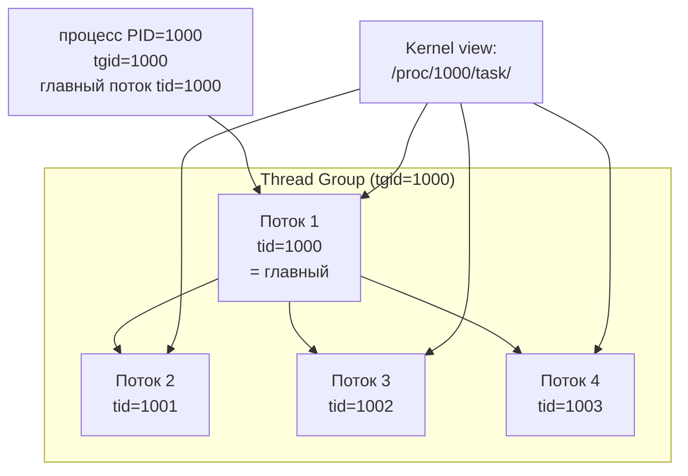
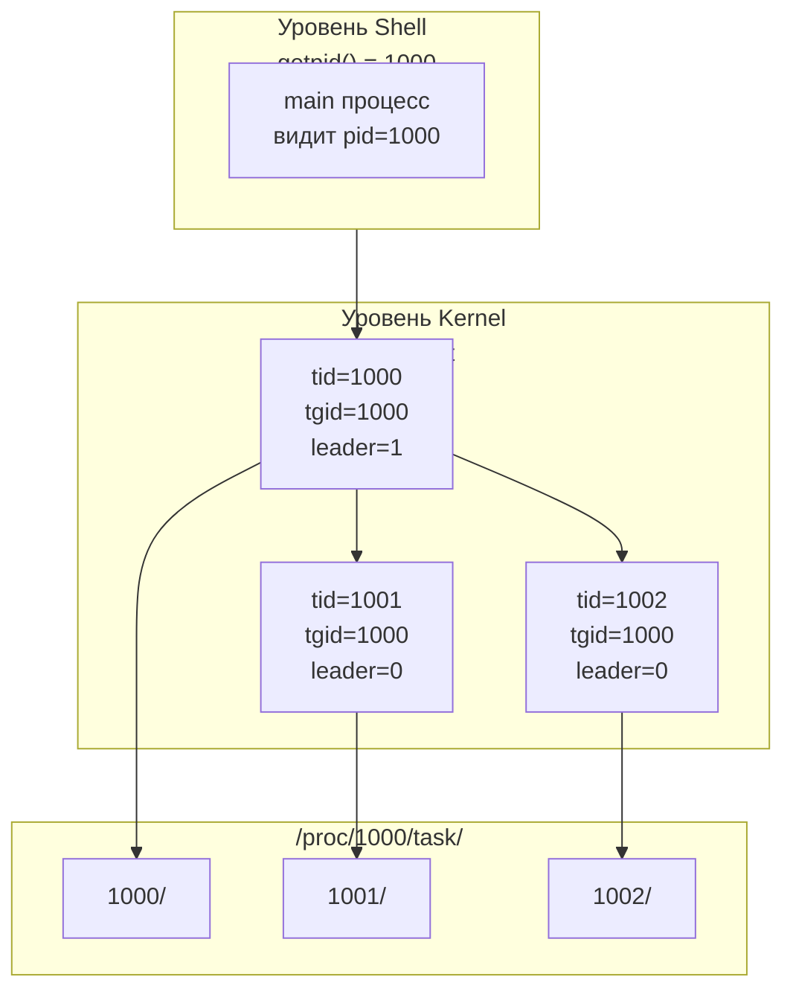
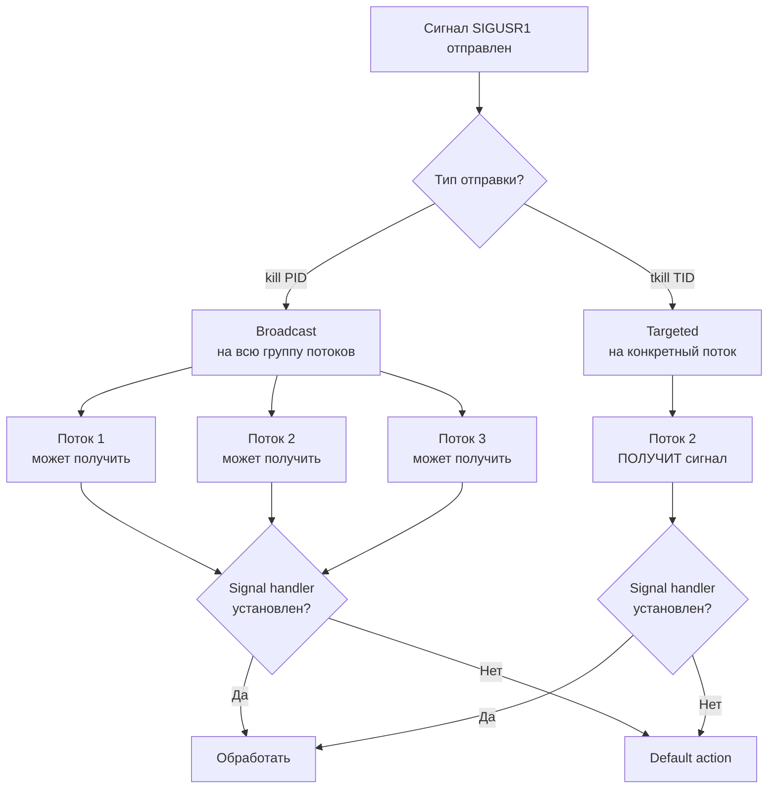

##### Как реализовать std::thread, используя сисколлы?

**std::thread** на уровне ОС реализуется через системный вызов `clone()` (или аналогично на других ОС - `pthread_create`
вызывает `clone` или `fork+exec`).

Основные этапы:

1. Выделить стек для нового потока
2. Вызвать `clone()` с нужными флагами для создания потока
3. Новый поток начнёт выполнять функцию рабочего потока
4. Сохранить tid (thread ID) для дальнейшего управления
5. Реализовать `join()` через `futex` или другой механизм синхронизации

**Схема реализации std::thread:**



Упрощённая схема:

```cpp
class SimpleThread {
    pid_t tid = -1;
    
public:
    template<typename Func>
    SimpleThread(Func f) {
        // Выделяем стек для потока (8MB по умолчанию)
        const size_t stack_size = 8 * 1024 * 1024;
        char* stack = new char[stack_size];
        
        // Функция, которую будет выполнять новый поток
        auto wrapper = [](void* arg) -> int {
            auto* func = static_cast<Func*>(arg);
            (*func)();
            delete func;
            return 0;
        };
        
        // Вызываем clone с флагами для создания потока
        pid_t child_tid;
        tid = clone(
            wrapper,
            stack + stack_size,  // Указатель на верх стека (растёт вниз)
            CLONE_THREAD | CLONE_VM | CLONE_FS | CLONE_FILES |
            CLONE_SIGHAND | CLONE_PARENT_SETTID,
            new Func(f),
            nullptr,
            nullptr,
            &child_tid
        );
        
        if (tid == -1) {
            perror("clone");
        }
    }
    
    void join() {
        // Ждём завершения потока
        if (tid != -1) {
            // Можно использовать futex для ожидания
            // Либо просто ждём сигнала завершения
        }
    }
};
```

##### Как пользоваться сисколлом clone и какие у него есть параметры?

```c
#define _GNU_SOURCE
#include <sched.h>

int clone(int (*fn)(void *arg), void *child_stack,
          int flags, void *arg, pid_t *ptid,
          struct user_desc *tls, pid_t *ctid);
```

**Параметры:**

- `fn` -- функция, которую будет выполнять новый процесс/поток
- `child_stack` -- указатель на стек (растёт вверх или вниз в зависимости от архитектуры; обычно указываем верхний адрес
  для x86)
- `flags` -- битовая маска, определяющая, какие ресурсы будут общими/отдельными:
    - `CLONE_THREAD` -- новый поток (в той же группе потоков)
    - `CLONE_VM` -- общее адресное пространство
    - `CLONE_FS` -- общие корневая директория и текущая директория
    - `CLONE_FILES` -- общие файловые дескрипторы
    - `CLONE_SIGHAND` -- общие обработчики сигналов
    - `CLONE_PARENT_SETTID` -- установить tid родителю
    - `CLONE_CHILD_CLEARTID` -- очистить tid при выходе
    - и другие...
- `arg` -- аргумент, передаваемый в функцию `fn`
- `ptid` -- указатель для записи tid родительского процесса (при `CLONE_PARENT_SETTID`)
- `tls` -- описание локального хранилища потока (TLS)
- `ctid` -- указатель для очистки tid при выходе (при `CLONE_CHILD_CLEARTID`)

**Возвращаемое значение:**

- Родителю: `tid` (идентификатор нового потока/процесса)
- Новому потоку: `0`
- При ошибке: `-1`

**Таблица CLONE_* флагов:**



##### Покажите, как надо вызывать сисколл clone, чтобы создать полноценный std::thread.

Для полноценного потока нужна комбинация флагов для максимального разделения:

```c
#define _GNU_SOURCE
#include <sched.h>
#include <unistd.h>
#include <stdlib.h>
#include <string.h>

int thread_fn(void *arg) {
    // Это выполняется в контексте нового потока
    int *data = (int *)arg;
    printf("New thread: data = %d\n", *data);
    free(data);
    return 0;
}

int main() {
    // Выделяем стек для потока (обычно 8MB)
    char *stack = malloc(8 * 1024 * 1024);
    if (!stack) {
        perror("malloc");
        return 1;
    }
    
    char *stack_top = stack + (8 * 1024 * 1024);
    
    // Подготавливаем аргумент
    int *arg = malloc(sizeof(int));
    *arg = 42;
    
    // Флаги для создания потока
    int flags = CLONE_THREAD      // Новый поток в той же группе
              | CLONE_VM          // Общее адресное пространство
              | CLONE_FS          // Общая файловая система
              | CLONE_FILES       // Общие FD
              | CLONE_SIGHAND     // Общие обработчики сигналов
              | CLONE_PARENT_SETTID  // Установить tid родителю
              | CLONE_CHILD_CLEARTID; // Очистить tid при выходе
    
    pid_t child_tid;
    pid_t tid = clone(thread_fn, stack_top, flags, arg, &child_tid, NULL, NULL);
    
    if (tid == -1) {
        perror("clone");
        return 1;
    }
    
    printf("Main: created thread with tid = %d\n", tid);
    
    // Для правильной синхронизации обычно используют futex
    // Здесь просто ждём немного
    sleep(1);
    
    free(stack);
    return 0;
}
```

Компиляция:

```bash
gcc -D_GNU_SOURCE clone_thread.c -o clone_thread
./clone_thread
```

##### Что из себя представляют треды с точки зрения ОС? Что такое тред-группа?

**С точки зрения ОС (Linux):**

Потоки -- это легковесные процессы, у которых общее:

- адресное пространство (VM)
- файловые дескрипторы
- обработчики сигналов

Но каждый поток имеет свой:

- tid (thread ID)
- стек
- набор регистров
- некоторые флаги (signal mask может быть свой)

**Тред-группа (thread group):**

Все потоки, созданные в контексте одного процесса, образуют **группу потоков (thread group)**:

- имеют общий `tgid` (thread group ID) = `pid` исходного процесса
- первый созданный поток имеет `tid == tgid`
- остальные потоки имеют `tid != tgid`, но `tgid` у всех одинаков

В `/proc` видны как отдельные записи:

```bash
ls -la /proc/<pid>/task/
# Там будут директории для каждого tid в группе
```

**Иерархия process/thread group:**



##### Что такое tid, tgid, как их узнать, в чем разница с pid?

**Терминология:**

| Аббревиатура | Значение        | Описание                                     |
|--------------|-----------------|----------------------------------------------|
| **PID**      | Process ID      | ID процесса (на уровне shell, jobs, системы) |
| **TID**      | Thread ID       | ID потока внутри процесса (видно в ядре)     |
| **TGID**     | Thread Group ID | ID группы потоков = PID исходного процесса   |

**Примеры:**

Если создан основной процесс с PID=1000:

- main поток: tid=1000, tgid=1000
- второй поток: tid=1001, tgid=1000
- третий поток: tid=1002, tgid=1000

**Как узнать свой tid/tgid:**

```c
#define _GNU_SOURCE
#include <unistd.h>

pid_t tid = gettid();      // Мой tid
pid_t tgid = getpid();     // tgid (= pid основного процесса)
```

**Или через /proc:**

```bash
cat /proc/self/status | grep -E "^Pid|^Tgid"
# Pid:  1000        # Это на самом деле TID
# Tgid: 1000        # Это TGID
```

**Разница:**

- **pid** (видимо в shell) -- всегда одинаков для всех потоков в процессе
- **tid** -- уникален для каждого потока (видно только в ядре/strace/proc)
- **tgid** -- общий для всех потоков в процессе, равен pid первого потока

**Диаграмма: как система видит pid/tid/tgid:**



##### Как послать сигнал отдельному треду?

Сигналы в Linux имеют **частично асинхронную** доставку:

- Если сигнал отправлен на весь процесс (через `kill(pid, sig)` где `pid` = tgid), любой поток может его обработать
- Если отправлен на конкретный поток (через `tkill(tid, sig)` или `tgkill(tgid, tid, sig)`), обрабатывает конкретный
  поток

**Системные вызовы для отправки сигналов:**

```c
#include <signal.h>
#include <sys/syscall.h>

// Убить конкретный поток
int tkill(pid_t tid, int sig);

// Более безопасный вариант (требует TGID для проверки)
int tgkill(pid_t tgid, pid_t tid, int sig);
```

**Доставка сигналов - диаграмма:**



**Пример:**

```cpp
#include <thread>
#include <iostream>
#include <csignal>
#include <syscall.h>
#include <unistd.h>

void signal_handler(int sig) {
    std::cout << "Signal " << sig << " received in thread " << gettid() << "\n";
}

void worker() {
    std::cout << "Worker thread tid: " << syscall(SYS_gettid) << "\n";
    sleep(10);
}

int main() {
    signal(SIGUSR1, signal_handler);
    
    std::thread t(worker);
    
    // Получаем tid нового потока (нужно сохранить где-то)
    // ... нужно передать tid из потока в main ...
    
    // Отправляем сигнал на конкретный поток
    pid_t main_tid = syscall(SYS_gettid);
    tgkill(getpid(), main_tid, SIGUSR1);
    
    t.join();
    return 0;
}
```

**Как получить tid потока:**

К сожалению, `std::thread` не предоставляет прямого доступа к tid. Нужно либо:

1. Использовать `syscall(SYS_gettid)` внутри потока
2. Использовать `pthread_t` и `pthread_getthreadid_np()` (если используете pthreads)
3. Создать механизм передачи tid из потока в главный поток:

```cpp
#include <thread>
#include <iostream>
#include <atomic>
#include <syscall.h>

std::atomic<pid_t> thread_tid(0);

void worker() {
    thread_tid = syscall(SYS_gettid);
    // ...
}

int main() {
    std::thread t(worker);
    
    // Ждём, пока поток запишет свой tid
    while (thread_tid == 0) {
        sched_yield();
    }
    
    // Теперь можем отправить сигнал
    tgkill(getpid(), thread_tid, SIGUSR1);
    
    t.join();
    return 0;
}
```
