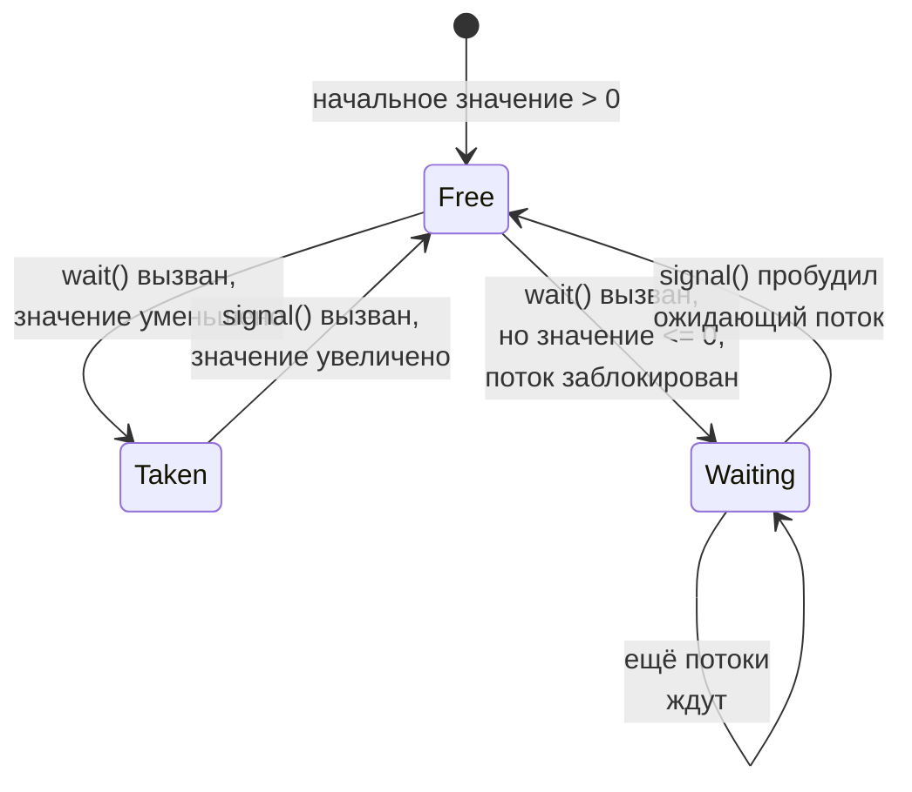
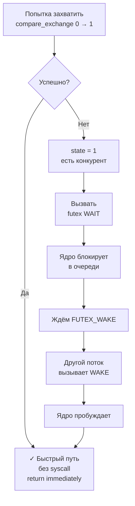
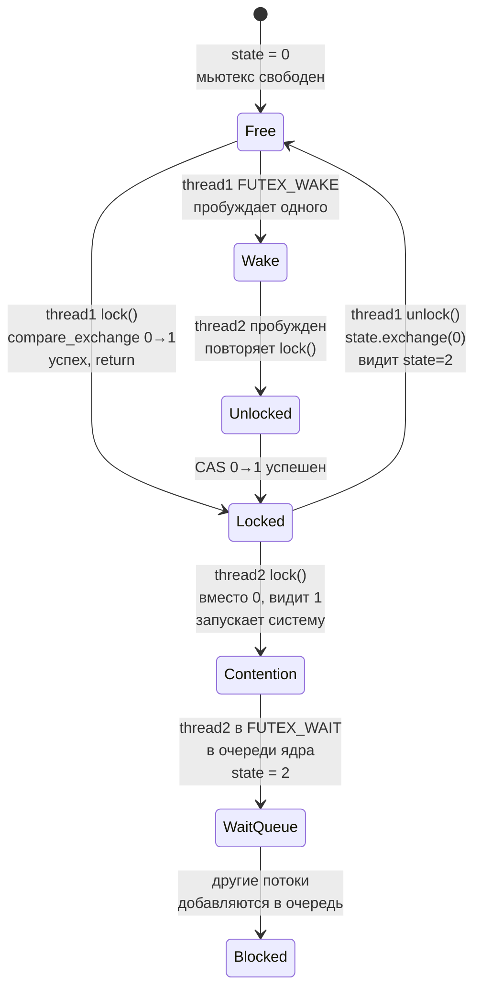

##### Что такое семафоры в Linux, для чего они нужны?

**Семафор** -- это объект синхронизации, который содержит целое значение и поддерживает две операции:

- **wait (P, proberen)** -- уменьшить значение на 1; если оно < 0, заблокировать вызывающий поток до момента, когда
  другой поток увеличит значение
- **signal (V, verhogen)** -- увеличить значение на 1; пробудить один или несколько ожидающих потоков

**Виды семафоров:**

1. **POSIX семафоры (именованные и безымянные)**
    - именованные: `/dev/shm/sem.name` (могут использоваться между процессами)
    - безымянные: хранятся в памяти

2. **System V семафоры** (более старый подход, между процессами)

3. **futex (fast userspace mutex)** - современный подход на Linux

**Типичные применения:**

- Защита критических секций (вместо mutex)
- Ограничение количества одновременно работающих потоков (счётный семафор, например, максимум 3 одновременных
  соединения)
- Сигнализирование между потоками (двоичный семафор = 0 или 1)

**Состояния семафора - диаграмма:**



**Пример: контроль доступа к ресурсам**

```cpp
#include <semaphore.h>
#include <thread>
#include <iostream>

sem_t resource_sem;  // Максимум 3 потока одновременно

void worker(int id) {
    std::cout << "Thread " << id << " waiting...\n";
    sem_wait(&resource_sem);    // Wait (P операция)
    
    std::cout << "Thread " << id << " using resource\n";
    sleep(1);
    
    std::cout << "Thread " << id << " releasing resource\n";
    sem_post(&resource_sem);    // Signal (V операция)
}

int main() {
    sem_init(&resource_sem, 0, 3);  // Инициализировать с начальным значением 3
    
    std::thread threads[5];
    for (int i = 0; i < 5; ++i) {
        threads[i] = std::thread(worker, i);
    }
    
    for (int i = 0; i < 5; ++i) {
        threads[i].join();
    }
    
    sem_destroy(&resource_sem);
    return 0;
}
```

**Основные POSIX функции:**

```c
#include <semaphore.h>

// Инициализировать безымянный семафор
int sem_init(sem_t *sem, int pshared, unsigned int value);

// Wait (уменьшить на 1, если ≤ 0 - заблокировать)
int sem_wait(sem_t *sem);
int sem_trywait(sem_t *sem);    // Неблокирующая версия
int sem_timedwait(sem_t *sem, const struct timespec *abs_timeout);

// Signal (увеличить на 1, пробудить одного ожидающего)
int sem_post(sem_t *sem);

// Уничтожить
int sem_destroy(sem_t *sem);

// Получить текущее значение
int sem_getvalue(sem_t *sem, int *sval);
```

##### Что позволяет делать сисколл futex?

**futex (fast userspace mutex)** -- это системный вызов для эффективной реализации примитивов синхронизации в
пользовательском пространстве с минимальным участием ядра.

```c
#include <linux/futex.h>
#include <sys/syscall.h>
#include <unistd.h>

long syscall(SYS_futex, uint32_t *uaddr, int futex_op,
             uint32_t val, const struct timespec *timeout,
             uint32_t *uaddr2, uint32_t val3);
```

**Основные операции:**

1. **FUTEX_WAIT** -- поток блокируется на адресе `uaddr` если его значение == `val`
    - Ядро добавляет поток в очередь ожидающих на этом адресе
    - Нужна парная операция FUTEX_WAKE

2. **FUTEX_WAKE** -- пробудить до `val` потоков, ожидающих на адресе `uaddr`
    - Поток скопируется быстро, без переключения контекста, если нет конкуренции
    - Ядро вмешивается только в случае конфликта

3. **FUTEX_WAKE_OP** -- условное пробуждение с операцией

**Ключевая идея:** Если нет конкуренции (обычный случай), futex работает **без системного вызова** -- просто меняется
значение переменной в памяти. Системный вызов нужен только если требуется блокировка/пробуждение.

**Жизненный цикл futex операций:**



**Пример простого mutex на базе futex:**

```c
#include <linux/futex.h>
#include <sys/syscall.h>
#include <unistd.h>
#include <stdint.h>

typedef struct {
    uint32_t val;  // 0 = свободно, 1 = занято
} simple_mutex_t;

int futex(uint32_t *uaddr, int op, uint32_t val,
          const struct timespec *timeout) {
    return syscall(SYS_futex, uaddr, op, val, timeout, NULL, 0);
}

void simple_mutex_lock(simple_mutex_t *m) {
    while (1) {
        // Пытаемся захватить: если val == 0, присваиваем 1
        uint32_t old = __atomic_compare_exchange_n(&m->val, &(uint32_t){0}, 1,
                                                     0, __ATOMIC_ACQUIRE, __ATOMIC_ACQUIRE);
        if (old == 0) {
            return;  // Захватили!
        }
        
        // Если не смогли, ждём FUTEX_WAIT
        futex(&m->val, FUTEX_WAIT, 1, NULL);
    }
}

void simple_mutex_unlock(simple_mutex_t *m) {
    // Освобождаем (присваиваем 0)
    __atomic_store_n(&m->val, 0, __ATOMIC_RELEASE);
    
    // Пробуждаем одного ожидающего потока
    futex(&m->val, FUTEX_WAKE, 1, NULL);
}
```

**Преимущества futex:**

- Минимальные системные вызовы в отсутствие конкуренции
- Адреса переменных могут быть в памяти процесса (не нужна общая память)
- Основа для реализации mutex, condition variables, семафоров в libc/libpthread

##### Покажите набросок реализации std::mutex с использованием сисколла futex. (Можно использовать std::atomic без объяснения.)

**Полная реализация простого mutex на базе futex:**

```cpp
#include <atomic>
#include <linux/futex.h>
#include <sys/syscall.h>
#include <unistd.h>
#include <cassert>
#include <cstring>

class FutexMutex {
private:
    // 0 = свободно, 1 = занято (и может быть ожидающие)
    std::atomic<uint32_t> state{0};
    
    // Обёртка над сисколлом futex
    static int futex_wait(std::atomic<uint32_t>* addr, uint32_t expected) {
        return syscall(SYS_futex, addr, FUTEX_WAIT_PRIVATE, expected, 
                       nullptr, nullptr, 0);
    }
    
    static int futex_wake(std::atomic<uint32_t>* addr, int num_threads) {
        return syscall(SYS_futex, addr, FUTEX_WAKE_PRIVATE, num_threads,
                       nullptr, nullptr, 0);
    }
    
public:
    void lock() {
        // Пытаемся захватить без системного вызова
        while (true) {
            // Быстрый путь: захватить напрямую
            uint32_t expected = 0;
            if (state.compare_exchange_strong(
                    expected, 1,
                    std::memory_order_acquire,
                    std::memory_order_relaxed)) {
                return;  // Захватили!
            }
            
            // Медленный путь: нужен системный вызов
            // expected теперь == 1, ждём пока не изменится
            if (state.compare_exchange_strong(
                    expected, 2,  // 2 = занято И есть ожидающие
                    std::memory_order_relaxed,
                    std::memory_order_relaxed)) {
                // Нам удалось установить флаг "есть ожидающие"
                // Теперь блокируемся
                futex_wait(&state, 2);
            }
        }
    }
    
    bool try_lock() {
        uint32_t expected = 0;
        return state.compare_exchange_strong(
            expected, 1,
            std::memory_order_acquire,
            std::memory_order_relaxed);
    }
    
    void unlock() {
        // Быстро проверяем, нет ли ожидающих
        uint32_t old = state.exchange(0, std::memory_order_release);
        
        if (old == 2) {
            // Были ожидающие потоки, пробуждаем одного
            futex_wake(&state, 1);
        }
    }
};

// Пример использования
#include <thread>
#include <iostream>
#include <vector>

FutexMutex mtx;
int counter = 0;

void increment_counter() {
    for (int i = 0; i < 10000; ++i) {
        {
            std::lock_guard<FutexMutex> lock(mtx);
            counter++;
        }
    }
}

int main() {
    std::vector<std::thread> threads;
    for (int i = 0; i < 4; ++i) {
        threads.emplace_back(increment_counter);
    }
    
    for (auto& t : threads) {
        t.join();
    }
    
    std::cout << "Counter: " << counter << " (expected 40000)\n";
    assert(counter == 40000);
    
    return 0;
}
```

Компиляция:

```bash
g++ -std=c++17 -pthread futex_mutex.cpp -o futex_mutex
./futex_mutex
```

**Как это работает - диаграмма состояний:**



**State machine семафора:**

| State | Значение           | Смысл                        | Действие                     |
|-------|--------------------|------------------------------|------------------------------|
| **0** | Свободно           | Никто не держит мьютекс      | lock() захватывает сразу     |
| **1** | Занято             | Мьютекс занят, нет ожидающих | lock() запускает CAS и ждёт  |
| **2** | Занято + ожидающие | Занят + потоки в очереди     | unlock() вызывает FUTEX_WAKE |

**Оптимизация:**

- При **отсутствии конкуренции** (обычный случай):
    - lock() = 1 CAS операция без syscall ✅ быстро
    - unlock() = 1 exchange без syscall ✅ быстро

- При **наличии конкуренции** (редкий случай):
    - lock() = syscall FUTEX_WAIT в ядро
    - unlock() = syscall FUTEX_WAKE в ядро

Таким образом достигается минимум overhead в отсутствие конкуренции!

**Примечание:** Реальная реализация (в libc) намного сложнее и учитывает:

- Приоритеты потоков
- Priority inversion
- Recursive locks
- Condition variables
- Сложные случаи race conditions

Но базовая идея exactly такая: использовать atomics для быстрого пути и futex только для медленного.
