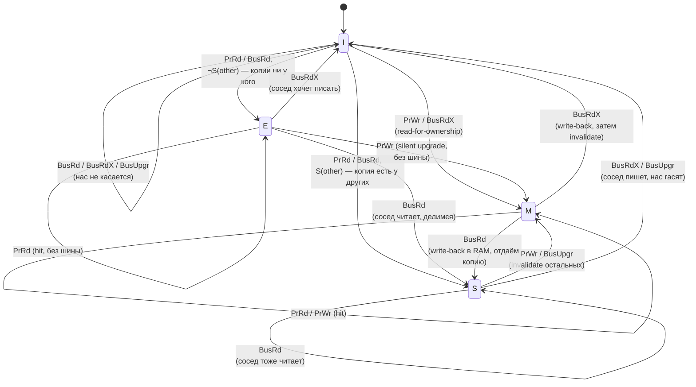

# Кэши процессора

Оперативная память (RAM) работает медленно по сравнению с процессором: при тактовой частоте 3–4 ГГц процессор выполняет
инструкцию за один такт (~0,3 нс), тогда как задержка обращения к RAM составляет 60–100 нс — в сотни раз больше. Без
кэшей процессор большую часть времени простаивал бы в ожидании данных из памяти.

## Иерархия памяти

Кэши располагаются между регистрами и RAM и образуют иерархию: чем ближе к процессору, тем быстрее, но меньше.

```
   ┌──────────────────────────────────────────────────────────────┐
   │   CPU Chip                                                   │
   │                                                              │
   │   ┌──────────────────────┐   ┌──────────────────────┐  ...   │
   │   │  Core 0              │   │  Core 1              │        │
   │   │  ┌────────────────┐  │   │  ┌────────────────┐  │        │
   │   │  │   Registers    │  │   │  │   Registers    │  │        │
   │   │  │   ~1 такт      │  │   │  │   ~1 такт      │  │        │
   │   │  └───────┬────────┘  │   │  └───────┬────────┘  │        │
   │   │          │           │   │          │           │        │
   │   │  ┌───────▼────────┐  │   │  ┌───────▼────────┐  │        │
   │   │  │  L1d  │  L1i   │  │   │  │  L1d  │  L1i   │  │        │
   │   │  │ 32 КБ │ 32 КБ  │  │   │  │ 32 КБ │ 32 КБ  │  │        │
   │   │  │~1-4 нс│~1-4 нс │  │   │  │~1-4 нс│~1-4 нс │  │        │
   │   │  └───────┴───┬────┘  │   │  └───────┴───┬────┘  │        │
   │   │              │       │   │              │       │        │
   │   │  ┌───────────▼────┐  │   │  ┌───────────▼────┐  │        │
   │   │  │  L2 Cache      │  │   │  │  L2 Cache      │  │        │
   │   │  │  256 КБ–1 МБ   │  │   │  │  256 КБ–1 МБ   │  │        │
   │   │  │  ~5-12 нс      │  │   │  │  ~5-12 нс      │  │        │
   │   │  └───────────┬────┘  │   │  └───────────┬────┘  │        │
   │   └──────────────┼───────┘   └──────────────┼───────┘        │
   │                  └──────────────┬───────────┘                │
   │                  ┌──────────────▼────────────┐               │
   │                  │   L3 Cache (shared)       │               │
   │                  │   8–32 МБ,  ~30–40 нс     │               │
   │                  └──────────────┬────────────┘               │
   └─────────────────────────────────┼────────────────────────────┘
                                     │
                     ┌───────────────▼───────────────┐
                     │   RAM (DRAM)                  │
                     │   8–128 ГБ,  ~60–100 нс       │
                     └───────────────────────────────┘
```

При промахе кэша (cache miss) процессор ждёт загрузки данных с более медленного уровня. При попадании (cache hit) данные
берутся из быстрого кэша без обращения к RAM.

Сводная таблица характеристик:

| Уровень   | Размер      | Латентность | Область видимости                       |
|-----------|-------------|-------------|-----------------------------------------|
| L1d / L1i | 32–64 КБ    | ~1–4 нс     | одно ядро (раздельно данные/инструкции) |
| L2        | 256 КБ–1 МБ | ~5–12 нс    | одно ядро                               |
| L3        | 8–32 МБ     | ~20–40 нс   | все ядра чипа                           |
| RAM       | 8–128 ГБ    | ~60–100 нс  | весь процесс                            |

## Как узнать параметры кэшей своего процессора

```bash
lscpu | grep -i cache           # сводная информация
getconf LEVEL1_DCACHE_SIZE      # размер L1 data cache в байтах
getconf LEVEL2_CACHE_SIZE       # L2
getconf LEVEL3_CACHE_SIZE       # L3
getconf LEVEL1_DCACHE_LINESIZE  # размер кэш-линии (обычно 64)
```

Пример вывода `lscpu`:

```
L1d cache:    192 KiB (6 instances)
L1i cache:    192 KiB (6 instances)
L2 cache:     1.5 MiB (6 instances)
L3 cache:     12 MiB (1 instance)
```

## Кэш-линия

Кэш-линия (cache line) — минимальный блок данных, который передаётся между уровнями иерархии памяти. На современных
процессорах Intel и AMD размер кэш-линии равен **64 байта**.

Когда процессор обращается к одному байту в памяти, в кэш загружается вся кэш-линия (64 байта), содержащая этот байт.
Последующие обращения к тем же или соседним байтам (в пределах той же линии) обслуживаются из кэша без обращения к RAM.

```
RAM (адреса выровнены по 64 байта)
┌────────────────────────────────────┬─────────────────────────────────────┐
│ cache line N   (байты 0x40–0x7F)   │ cache line N+1 (байты 0x80–0xBF)    │
│  [0][1][2]...[63]                  │ [0][1][2]...[63]                    │
└────────────────────┬───────────────┴─────────────────────────────────────┘
                     │ процессор читает byte[0x55] ──▶ cache miss
                     │ в кэш загружается вся линия (64 байта)
                     ▼
┌────────────────────────────────────┐
│ L1 cache line                      │
│  [0][1][2]...[21] [22]...[63]      │
│                    ▲               │
│              byte[0x55-0x40=21]    │
│              следующие обращения   │
│              0x40..0x7F — hit      │
└────────────────────────────────────┘
```

Именно поэтому **пространственная локальность** (обращение к соседним адресам) так важна для производительности.

## Логическая организация кэша

Кэш — это таблица. Чтобы по адресу найти кэш-линию, аппаратура разбивает адрес на три поля: **tag**, **index**, **offset
**. Способ, которым это разбиение и поиск устроены, определяет три ключевые характеристики кэша: **ассоциативность**, *
*политику замещения** и **политику записи**.

### Разбиение адреса

```
                  адрес (виртуальный или физический)
  ┌──────────────────────────┬──────────────────┬──────────────────┐
  │           tag            │      index       │     offset       │
  └──────────────────────────┴──────────────────┴──────────────────┘
   старшие биты               биты выбора set    биты в линии (6 для 64 байт)

  Пример: L1d Intel = 48 KB, 12-way, 64-byte line
    линий всего:  48 KB / 64 B = 768
    sets:         768 / 12 = 64
    offset:       log2(64)  = 6 бит
    index:        log2(64)  = 6 бит
    tag:          48 - 6 - 6 = 36 бит (для 48-битного физического адреса)
```

`offset` указывает байт внутри линии, `index` выбирает **set** (строку таблицы), `tag` сравнивается с тегами всех линий
в этом set параллельно, чтобы определить hit или miss.

### Ассоциативность

```
  Direct-mapped (1-way)         Set-associative (N-way)        Fully associative
  ─────────────────────         ──────────────────────         ───────────────────
  одна линия на адрес           N линий на адрес               линия может лежать
                                                               где угодно

  ┌────────┐                    ┌────────┬────────┐            ┌────┬────┬────┬┄┄┐
  │ set 0  │ ◀── tag, data      │ way 0  │ way 1  │ ... way N  │    │    │    │  │
  ├────────┤                    ├────────┼────────┤            ├────┼────┼────┼┄┄┤
  │ set 1  │                    │ way 0  │ way 1  │            │    │    │    │  │
  ├────────┤                    ├────────┼────────┤            └────┴────┴────┴┄┄┘
  │ set 2  │                    │ way 0  │ way 1  │
  │  ...   │                    │  ...   │  ...   │            параллельно сравниваются
  └────────┘                    └────────┴────────┘            теги ВСЕХ линий

  Просто. Много конфликтов:     Компромисс: сложнее             Идеально для нагрузки.
  два адреса с одним index      hardware, но конфликтов         Дорого: N компараторов
  выкидывают друг друга         в N раз меньше                  на каждое обращение.
  поочерёдно.                                                   Применяется только в
                                                                маленьких структурах
                                                                (TLB, victim cache).
```

Современные CPU используют **set-associative** как разумный компромисс:

| Кэш                            | Размер         | Ассоциативность | Sets |
|--------------------------------|----------------|-----------------|------|
| Intel L1d (Golden Cove, 2021+) | 48 KB          | 12-way          | 64   |
| Intel L1i                      | 32 KB          | 8-way           | 64   |
| Intel L2 (Raptor Cove)         | 2 MB           | 16-way          | 2048 |
| Intel L3 (Sapphire Rapids)     | ~1.875 MB/core | 12-way          | ...  |
| AMD Zen 4 L1d                  | 32 KB          | 8-way           | 64   |
| AMD Zen 4 L2                   | 1 MB           | 8-way           | 2048 |

Из формул выше видно, что **L1d 12-way 64 sets даёт всего 64 уникальных значения index** — два массива по 4 KB (64
sets × 64 байта) при одинаковом alignment попадут в один set. Этот эффект — **conflict misses** — заметен при
power-of-two strides (типичная антипатеррн в наивном GEMM на матрицах размера 4096).

### Политика замещения

Когда set заполнен и приходит новая линия — нужно кого-то вытолкнуть. В теории оптимальна **OPT** (вытолкнуть линию,
которая будет использована позже всех), но она требует знания будущего. Практические аппроксимации:

| Политика                                    | Описание                                                  | Где применяется                            |
|---------------------------------------------|-----------------------------------------------------------|--------------------------------------------|
| **LRU (Least Recently Used)**               | Метаданные о порядке доступа; точно вытолкнуть давнее     | Маленькие кэши (4-way), TLB                |
| **Pseudo-LRU (tree-PLRU)**                  | Бинарное дерево бит — приближение LRU за O(log N) бит/way | L1, L2 на современных Intel                |
| **NRU (Not Recently Used)**                 | Один бит на линию + периодическая очистка                 | Простой aproximation для больших кэшей     |
| **RRIP (Re-Reference Interval Prediction)** | Предсказание дистанции до следующего доступа              | Intel L3, AMD L3                           |
| **Random**                                  | Случайная замена                                          | ARM (просто и предсказуемо при бенчмарках) |
| **FIFO**                                    | По порядку прихода                                        | Старые CPU                                 |

**RRIP** заметно лучше LRU на типичной нагрузке: LRU плохо работает с linear scan большой коллекции (выталкивает всё
нужное), RRIP помечает «только что пришёл, скорее всего одноразовый» с длинной дистанцией и выталкивает их в первую
очередь.

### Политика записи

При **write hit** (запись в линию, уже в кэше):

| Политика          | Поведение                                                                     | Trade-off                                      |
|-------------------|-------------------------------------------------------------------------------|------------------------------------------------|
| **Write-through** | Запись и в кэш, и в нижний уровень                                            | Простота, всегда coherent; bandwidth           |
| **Write-back**    | Запись только в кэш + установка dirty bit; на eviction пишет в нижний уровень | Меньше bandwidth; сложнее coherency (см. MESI) |

Современные CPU используют **write-back** для L1/L2/L3 — экономит bandwidth между уровнями. Write-through иногда
применяется для L1d→L2 если L2 inclusive (Intel до Skylake), чтобы не тащить dirty проверку.

При **write miss** (запись по адресу, которого нет в кэше):

| Политика                            | Поведение                                           |
|-------------------------------------|-----------------------------------------------------|
| **Write-allocate** (fetch-on-write) | Загрузить линию в кэш, затем сделать write hit      |
| **No-write-allocate**               | Записать сразу в нижний уровень, в кэш не загружать |

x86 использует write-allocate в combination с write-back. Исключение — **write-combining** буферы для уничтожаемых
данных (например, framebuffer); вычитка не нужна, накапливаются записи, периодически flush.

### Иерархия: inclusive, exclusive, NINE

Когда L2 кэшируется поверх L1, есть три варианта отношения:

| Тип                                    | Свойство                                                | Стоимость                                    | Где                               |
|----------------------------------------|---------------------------------------------------------|----------------------------------------------|-----------------------------------|
| **Inclusive**                          | Всё что в L1 — также в L2                               | Дублирование, но проще snoop                 | Intel до Skylake                  |
| **Exclusive**                          | Линия только в одном из L1/L2                           | Эффективное использование, сложнее coherency | AMD Athlon, K8                    |
| **Non-Inclusive Non-Exclusive (NINE)** | Линия может быть в L1, или в L2, или в обоих, или нигде | Компромисс                                   | Intel с Skylake (server), AMD Zen |

Inclusive упрощает snoop (другому ядру достаточно проверить L2 — если линии там нет, её точно нет в L1), но требует L2 ≫
L1 (иначе eviction из L2 будет постоянно выкидывать из L1 — называется **back-invalidation**). Skylake-X перешёл к NINE
именно потому, что увеличенный L2 (1 MB) перестал быть значительно больше суммарного L1.

### Virtually-indexed vs physically-indexed

Cache lookup начинается с **index'а** — но какой адрес использовать, виртуальный или физический? Это вопрос архитектуры:

| Схема                                            | Index       | Tag         | Свойство                                              |
|--------------------------------------------------|-------------|-------------|-------------------------------------------------------|
| **PIPT** (Physically-Indexed, Physically-Tagged) | физический  | физический  | Простой coherency, но нужен TLB lookup до индексации  |
| **VIPT** (Virtually-Indexed, Physically-Tagged)  | виртуальный | физический  | Параллельный TLB + index lookup, но возможен aliasing |
| **VIVT** (Virtually-Indexed, Virtually-Tagged)   | виртуальный | виртуальный | Самый быстрый, но homonym/synonym проблемы            |

Современные x86-64 L1d используют **VIPT с ограничением**: размер way ≤ page size (4 KB). Это гарантирует, что биты
index лежат в page offset, который одинаков для виртуального и физического адреса → aliasing невозможен. Именно поэтому
L1d Intel = 48 KB / 12-way = 4 KB на way — ровно page size. L2 и L3 — PIPT (TLB уже разрешён к моменту попадания на L2).

### MSHR и non-blocking caches

При cache miss современные CPU не блокируются: запрос помещается в **MSHR (Miss Status Holding Register)**, ядро
продолжает выполнять другие инструкции, а когда данные вернутся — заполняет ожидавший load. Параллельно может быть в
полёте 10-20 misses (Intel Skylake — 12 на L1d). Это базис **memory-level parallelism**: компилятор расставляет load'ы
заранее, чтобы miss'ы перекрывались друг с другом и с computation.

## Кэш-дружественный доступ к памяти

### Обход матрицы по строкам vs. по столбцам

В языке C двумерный массив хранится в памяти **по строкам** (row-major order): `matrix[0][0]`, `matrix[0][1]`, ...,
`matrix[0][N-1]`, `matrix[1][0]`, ...

**По строкам (cache-friendly):**

```c
int matrix[1000][1000];
long sum = 0;

for (int i = 0; i < 1000; i++)
    for (int j = 0; j < 1000; j++)
        sum += matrix[i][j];   /* соседние элементы в памяти */
```

При обращении к `matrix[i][0]` в кэш загружается вся кэш-линия — первые 16 элементов строки `i` (64 байт / 4 байт на
int). Следующие 15 итераций внутреннего цикла попадают в кэш: почти 100% попаданий.

**По столбцам (cache-unfriendly):**

```c
for (int j = 0; j < 1000; j++)
    for (int i = 0; i < 1000; i++)
        sum += matrix[i][j];   /* элементы разнесены на 4000 байт */
```

Каждое обращение `matrix[i][j]` находится в отдельной кэш-линии. При каждом обращении происходит cache miss. Разница в
скорости может составлять **10–50 раз**.

## Эксперимент: доказательство существования кэш-линий

Следующий код обходит массив с разным шагом и измеряет время на одно обращение:

```cpp
#include <iostream>
#include <vector>
#include <chrono>

int main() {
    constexpr size_t ARRAY_SIZE = 100'000'000;

    for (int64_t step = 1; step < 1024; step *= 2) {
        std::vector<int> array(ARRAY_SIZE, 0);

        auto start = std::chrono::steady_clock::now();

        int sum = 0;
        for (size_t i = 0; i < ARRAY_SIZE; i += step)
            sum += array[i];

        auto end = std::chrono::steady_clock::now();
        auto elapsed = std::chrono::duration_cast<std::chrono::milliseconds>(end - start);

        double per_iter = std::chrono::duration_cast<std::chrono::nanoseconds>(elapsed).count()
                          / static_cast<double>(ARRAY_SIZE / step);

        std::cout << "step=" << step
                  << "  time=" << elapsed.count() << " ms"
                  << "  per_iter=" << per_iter << " ns\n";
    }
}
```

Ожидаемые результаты (шаг в элементах `int`, т.е. по 4 байта):

```
step=1    per_iter~0.1 ns   (всё в L1, кэш-линия покрывает 16 элементов)
step=8    per_iter~0.5 ns   (приближается к границе)
step=16   per_iter~1.0 ns   (каждый элемент в отдельной кэш-линии: miss каждый раз)
step=64   per_iter~5.0 ns   (шаг 256 байт — 4 кэш-линии на итерацию)
```

Ключевое наблюдение: при шаге 16 (ровно одна кэш-линия) время на итерацию резко возрастает.

## Эксперимент: измерение задержки разных уровней кэша

Для измерения задержки конкретного уровня нужно убедиться, что рабочий набор данных помещается именно в этот уровень, и
использовать случайный порядок обхода (чтобы аппаратный prefetcher не угадывал следующий адрес):

```cpp
#include <iostream>
#include <vector>
#include <random>
#include <chrono>
#include <algorithm>

using Clock = std::chrono::steady_clock;

int main() {
    const std::vector<std::pair<size_t, const char*>> levels = {
        {32  * 1024,        "L1 (32 KB)"},
        {256 * 1024,        "L2 (256 KB)"},
        {12  * 1024 * 1024, "L3 (12 MB)"},
        {64  * 1024 * 1024, "RAM (64 MB)"},
    };

    constexpr size_t ACCESSES = 100'000;
    constexpr size_t STRIDE   = 4096 / sizeof(int);
    std::mt19937_64 rng{std::random_device{}()};

    for (const auto& [size_bytes, name] : levels) {
        const size_t elem_count = size_bytes / sizeof(int);
        std::vector<int> array(elem_count, 1);

        std::vector<size_t> indices;
        for (size_t i = 0; i < elem_count; i += STRIDE)
            indices.push_back(i);
        std::shuffle(indices.begin(), indices.end(), rng);

        volatile int sink = 0;
        auto start = Clock::now();
        for (size_t n = 0; n < ACCESSES; ++n)
            sink += array[indices[n % indices.size()]];
        auto end = Clock::now();

        double ns = std::chrono::duration_cast<std::chrono::nanoseconds>(end - start).count()
                    / static_cast<double>(ACCESSES);
        std::cout << name << ":  " << ns << " ns per access\n";
    }
}
```

Ожидаемый результат — отчётливые скачки задержки на границах уровней:

```
L1 (32 KB):    ~1–4 ns
L2 (256 KB):   ~5–12 ns
L3 (12 MB):    ~20–40 ns
RAM (64 MB):   ~60–120 ns
```

## Когерентность кэшей: протокол MESI

L1 и L2 — приватные для каждого ядра. Если бы каждое ядро держало свою копию одной и той же области памяти без
согласования, запись одного ядра не была бы видна другому — пришлось бы вручную сбрасывать всё в L3/RAM. Чтобы это
работало прозрачно, ядра обмениваются сообщениями через **interconnect** (Intel ring/mesh, AMD Infinity Fabric) по
протоколу **MESI**.

Каждая cache line в L1/L2 помечается одним из четырёх состояний:

| State          | Description                                      | Чистая? | Эксклюзивная? |
|----------------|--------------------------------------------------|---------|---------------|
| **M** odified  | Грязная копия, только в этом кэше. RAM устарела. | Нет     | Да            |
| **E** xclusive | Чистая копия, только в этом кэше. RAM актуальна. | Да      | Да            |
| **S** hared    | Чистая копия, есть и в других кэшах.             | Да      | Нет           |
| **I** nvalid   | Линия пуста или устарела, использовать нельзя.   | —       | —             |

FSM работает на двух классах событий. **Процессорные** — операции своего ядра; **шинные (snoop)** — сообщения, которые ядро видит на interconnect от других ядер:

| Событие     | Класс        | Значение                                                           |
|-------------|--------------|--------------------------------------------------------------------|
| **PrRd**    | процессорное | своё ядро читает линию                                             |
| **PrWr**    | процессорное | своё ядро пишет в линию                                            |
| **BusRd**   | snoop        | другое ядро читает эту линию (read miss у соседа)                  |
| **BusRdX**  | snoop        | другое ядро делает read-for-ownership (хочет писать, копии нет)    |
| **BusUpgr** | snoop        | другое ядро апгрейдит свою `S`-копию в `M` (invalidate без чтения) |

`S(other)` ниже означает «при чтении из `I` сигнал shared на шине поднят — линия есть у кого-то ещё»; `¬S(other)` — линию не держит никто, можно перейти сразу в `E`.



Та же таблица переходов в явном виде (строка — текущее состояние, столбец — событие):

| Из \ событие | PrRd                                      | PrWr             | BusRd (snoop)      | BusRdX (snoop)     | BusUpgr (snoop) |
|--------------|-------------------------------------------|------------------|--------------------|--------------------|-----------------|
| **I**        | → `E` если ¬S(other), иначе → `S` (BusRd) | → `M` (BusRdX)   | → `I`              | → `I`              | → `I`           |
| **E**        | → `E` (hit)                               | → `M` (без шины) | → `S`              | → `I`              | —¹              |
| **S**        | → `S` (hit)                               | → `M` (BusUpgr)  | → `S`              | → `I`              | → `I`           |
| **M**        | → `M` (hit)                               | → `M` (hit)      | → `S` (write-back) | → `I` (write-back) | —¹              |

¹ `BusUpgr` исходит только от ядра, держащего линию в `S`; пока кто-то в `E`/`M`, у других нет `S`-копии, поэтому эта пара состояние/событие не возникает.

Ключевые инварианты, которые FSM поддерживает: в `M` или `E` линия ровно в одном кэше (эксклюзивность), `M` означает «RAM устарела» (нужен write-back перед отдачей соседу), а переход в `M` из `S` всегда требует `BusUpgr`/`BusRdX` — погасить чужие копии.

Стоимость основных переходов:

| Переход                                        | Что происходит                                     | Цена                     |
|------------------------------------------------|----------------------------------------------------|--------------------------|
| `I → E` (local read miss, line ни у кого)      | подтянуть из L3/RAM                                | 40–100 ns                |
| `I → S` (local read miss, линия есть у других) | копия из соседнего L1/L2 (cache-to-cache transfer) | 20–60 ns                 |
| `E → M` (local write)                          | бесплатно, никому сообщать не надо                 | ~0                       |
| `S → M` (local write при shared)               | **invalidate** во все остальные L1                 | 30–100 ns на каждом ядре |
| `M → I` (remote write при modified)            | write-back в RAM, потом invalidate                 | 100+ ns                  |
| `M → S` (remote read при modified)             | write-back, переход в S у обоих                    | 60–100 ns                |

Что происходит в L1 двух ядер при чтении/записи общей переменной:

```
Шаг 1: Core 0 читает X (X нигде нет в кэше)
       ┌─ Core 0 L1 ─┐    ┌─ Core 1 L1 ─┐
       │  X = 5  [E] │    │   (нет X)   │
       └─────────────┘    └─────────────┘
       Snoop: никто не ответил → state = Exclusive

Шаг 2: Core 1 читает тот же X
       ┌─ Core 0 L1 ─┐    ┌─ Core 1 L1 ─┐
       │  X = 5  [S] │    │  X = 5  [S] │
       └─────────────┘    └─────────────┘
       Core 0 snoop hit → отдаёт линию, оба переходят в Shared

Шаг 3: Core 0 пишет X = 7
       ┌─ Core 0 L1 ─┐    ┌─ Core 1 L1 ─┐
       │  X = 7  [M] │    │  X = -- [I] │  ← Core 0 послал invalidate
       └─────────────┘    └─────────────┘
       Шина: BusRdX (read-for-ownership), Core 1 откидывает копию

Шаг 4: Core 1 читает X
       ┌─ Core 0 L1 ─┐    ┌─ Core 1 L1 ─┐
       │  X = 7  [S] │    │  X = 7  [S] │
       └─────────────┘    └─────────────┘
       Core 1 snoop miss → Core 0 видит запрос на грязную линию,
       делает write-back в RAM и переходит в Shared
```

Каждый шаг между ядрами — сотни тактов. На горячих shared-данных это сжигает 50–90% производительности.

### MOESI — расширение AMD

AMD добавляет пятое состояние **O** wned: грязная копия, при этом другие кэши имеют чистые Shared-копии. Позволяет
владельцу отвечать на snoop без write-back в RAM — соседние ядра получают данные прямо от него. На записях экономия
write-back до момента вытеснения. Архитектурно: владелец = «source of truth», RAM устарела, но никто не пытается её
читать, пока линия в O. Intel начиная с Sandy Bridge использует похожее по эффекту расширение **MESIF** (Forward).

## False sharing

False sharing — следствие протокола когерентности: два потока пишут в **разные** переменные, попавшие в **одну cache
line**. На уровне MESI ядро не различает «логически разные байты» — оно видит, что линия модифицирована соседом, и
инвалидирует свою копию целиком. Возникает **cache ping-pong**: линия мечется между L1 ядер без реальной race condition
на данных.

```c
/* Плохо: два счётчика помещаются в одну 64-байтную cache line */
struct Counters {
    long c0;   /* 8 байт, offset 0 */
    long c1;   /* 8 байт, offset 8 — та же line! */
};

struct Counters cnt;

void *thread0(void *arg) {
    for (long i = 0; i < 100'000'000L; i++) cnt.c0++;
    return NULL;
}
void *thread1(void *arg) {
    for (long i = 0; i < 100'000'000L; i++) cnt.c1++;
    return NULL;
}
```

По шагам, что делают два ядра:

```
Time   Core 0 (cnt.c0++)             Core 1 (cnt.c1++)              L1[Core 0]  L1[Core 1]
────────────────────────────────────────────────────────────────────────────────────────────
t0     read  cnt.c0   miss                                            [E]         [I]
t1     write cnt.c0           [E→M]                                   [M]         [I]
t2                                    read  cnt.c1   miss             [M→S]       [I→S]
                                      ← Core 0 write-back + share
t3                                    write cnt.c1           [S→M]    [S→I]       [M]
                                      ← invalidate Core 0
t4     read  cnt.c0   miss                                            [I→S]       [M→S]
       ← Core 1 write-back + share
t5     write cnt.c0           [S→M]                                   [M]         [S→I]
       ← invalidate Core 1
...    (бесконечный пинг-понг линии между L1 двух ядер)
```

Каждая итерация цикла, которая в одном потоке заняла бы ~1 такт, превращается в ~100 тактов inter-core transfer.
Замедление в 10–100 раз.

Диагностика через `perf`:

```bash
# Считаем misses на L1 и факты переходов M→I/S→I (HITM events)
perf stat -e cache-misses,cache-references,\
mem_load_l3_hit_retired.xsnp_hitm \
./false_sharing_bin

# Pre-canned анализ false sharing (perf c2c) — Linux 4.10+
perf c2c record ./false_sharing_bin
perf c2c report
```

Высокий счётчик `HITM` (hit modified — snoop попал в линию в состоянии M у другого ядра) — характерный отпечаток false
sharing.

Фикс — padding до полной cache line, чтобы переменные оказались в разных линиях:

```c
/* Хорошо: каждое поле занимает отдельную cache line */
struct Counters {
    alignas(64) long c0;
    alignas(64) long c1;
};
```

В C++17 предпочтительнее `std::hardware_destructive_interference_size` — компилятор знает размер cache line целевой
платформы:

```cpp
#include <new>

struct Counters {
    alignas(std::hardware_destructive_interference_size) long c0;
    alignas(std::hardware_destructive_interference_size) long c1;
};
```

Парный `std::hardware_constructive_interference_size` — для случая, когда наоборот хочется уложить две связанные
переменные в одну line.

False sharing — частая причина того, что многопоточный код масштабируется хуже однопоточного.

!!! example "Рабочий пример"
    Полная компилируемая демонстрация false sharing: замер времени до и после padding'а полей до отдельных cache line: `examples/q17_false_sharing/false_sharing.cpp` — собрать и запустить: `cd examples && make q17 && ./bin/q17_false_sharing`.

## Программные подсказки prefetch

`prefetch` — инструкция-намёк процессору заранее подтянуть cache line в кэш указанного уровня. К моменту, когда код
реально дойдёт до load'а, данные уже будут рядом — load не блокирует pipeline.

Семейство инструкций x86 (через intrinsic `_mm_prefetch` из `<xmmintrin.h>`):

| Instruction   | Hint | Куда тянуть                | Когда использовать                              |
|---------------|------|----------------------------|-------------------------------------------------|
| `prefetcht0`  | T0   | L1, L2, L3                 | данные нужны очень скоро и многократно          |
| `prefetcht1`  | T1   | L2, L3                     | данные нужны скоро, но не критично попасть в L1 |
| `prefetcht2`  | T2   | L3                         | данные понадобятся не сразу                     |
| `prefetchnta` | NTA  | non-temporal (минуя L2/L3) | streaming — данные прочитаются один раз         |

Пример: обход linked list, где сам список — pointer chasing с плохой prefetch-эффективностью аппаратного prefetcher'а:

```c
#include <xmmintrin.h>

void sum_list(struct node *head) {
    long sum = 0;
    while (head) {
        if (head->next)
            _mm_prefetch((const char*)head->next, _MM_HINT_T0);
        sum += head->value;                  /* пока считаем — next подтягивается */
        head = head->next;
    }
}
```

Тонкости:

- Prefetch — **подсказка**, не команда. CPU может проигнорировать (например, при перегрузке load buffer'ов или TLB
  miss).
- Слишком ранний prefetch → линия вытесняется до использования. Слишком поздний → не успевает прийти. Полезно держать
  «дистанцию» в ~50–200 циклов перед load.
- Prefetch на спекулятивный адрес безопасен (page fault не возникает — `prefetch` его подавляет). Но prefetch по
  мусорному указателю забивает TLB.
- На современных Intel/AMD аппаратный prefetcher настолько умён, что для последовательного доступа явный prefetch не
  даёт выигрыша — выручает только на нерегулярных паттернах.

### Hardware prefetchers

Параллельно работают аппаратные предсказатели обращений к памяти. На Intel их несколько:

- **L1 Streamer (DCU)** — детектирует последовательные обращения вперёд по cache lines и подтягивает следующую line.
- **L1 IP-based (IPP)** — отслеживает паттерн доступа от каждой `load`-инструкции по PC: если адреса идут с постоянным
  шагом (stride), подтягивает следующий по тому же шагу.
- **L2 Streamer** — то же, но крупнее: тянет в L2 до 20 линий вперёд при обнаружении потока.
- **L2 Adjacent Line** — при miss подтягивает не одну, а пару соседних 64-байтных линий (128 байт total).

Когда работают: последовательный обход массива, регулярные strided-обращения, повторяющиеся pattern'ы. Когда не
справляются: pointer chasing (linked list, tree), random access, indirection через индексные массивы. Для таких случаев
и нужен явный `prefetcht0`.

Включение/отключение prefetcher'ов на Intel — через MSR 0x1A4 (для kernel-режима, в production это редко нужно).

## Практические рекомендации

- Обходите массивы последовательно, а не с произвольным доступом.
- При работе с матрицами используйте row-major порядок (внешний цикл — по строкам в C).
- Группируйте часто используемые поля структур рядом, чтобы они попадали в одну кэш-линию.
- В многопоточном коде разделяйте данные разных потоков по разным кэш-линиям (padding до 64 байт).
- Выравнивайте критические структуры по размеру кэш-линии (64 байта):

```c
struct alignas(64) HotData {
    int a, b, c;
    /* ... */
};
```

## Связанные темы

- [Предсказание ветвлений](branch_prediction.md) — спекулятивное выполнение, Spectre, retpoline, cache-timing атаки
- [Параллелизм на уровне инструкций](instruction_level_parallelism.md) — out-of-order execution и взаимодействие с
  кэшами
- [Векторные инструкции (SIMD)](vector_instructions_simd.md) — выравнивание данных для SIMD-загрузок

## Источники

- `man 1 lscpu` — информация о процессоре и кэшах
- `man 3 getconf` — чтение параметров системы
- Ulrich Drepper, "What Every Programmer Should Know About Memory": https://www.akkadia.org/drepper/cpumemory.pdf
- Agner Fog, "Optimizing software in C++": https://agner.org/optimize/
- Intel 64 and IA-32 Architectures Optimization Reference Manual — Chapter 7: Optimizing Cache Usage
- David Kanter, "Cache Coherence Made Easy" (RWT): https://www.realworldtech.com/common-system-interface/5/
- Linux `perf-c2c(1)` — анализ false sharing и cache-line contention
- Intel intrinsics guide — `_mm_prefetch`: https://www.intel.com/content/www/us/en/docs/intrinsics-guide/
