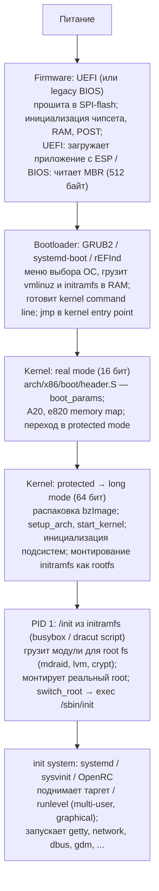
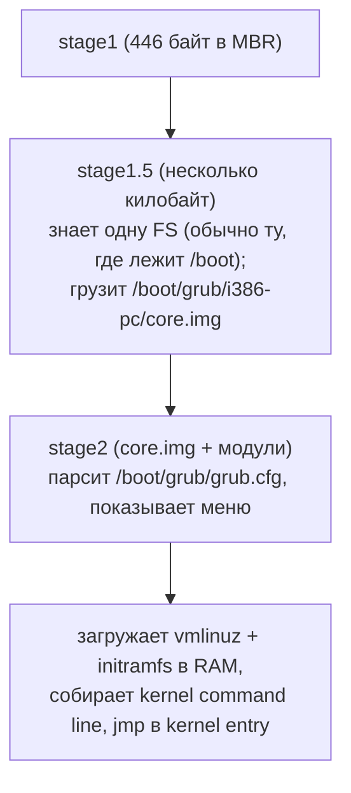
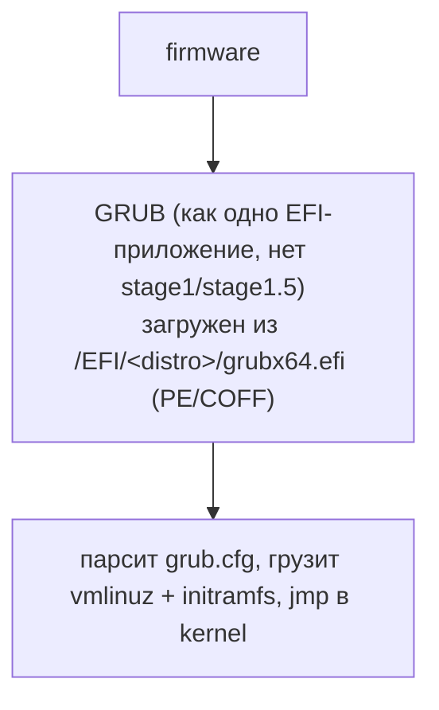
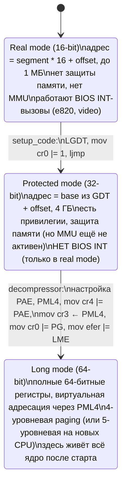
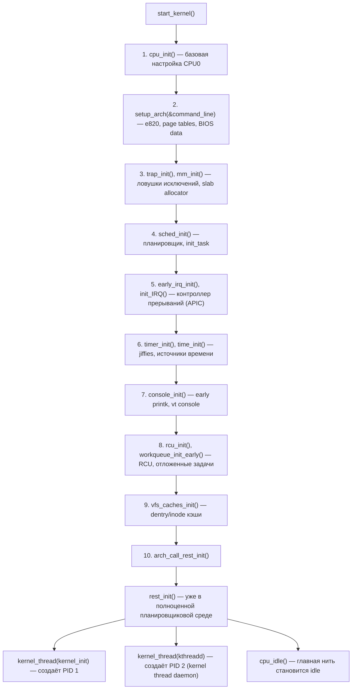
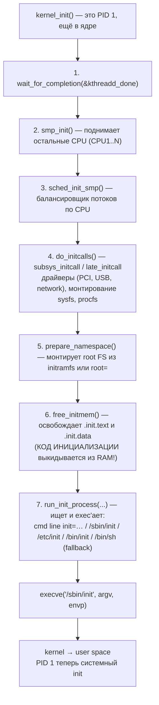
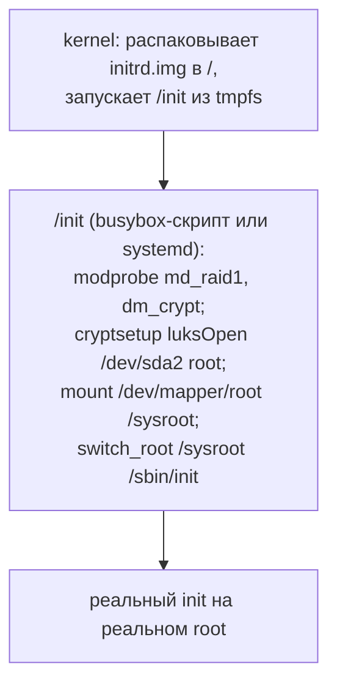

# Загрузка системы: от UEFI до init

Когда вы нажимаете кнопку питания, до запуска `/sbin/init` происходит примерно пять смен контекста
выполнения: firmware → bootloader → kernel real mode → kernel protected/long mode → user space.
На каждом из этих шагов код, который только что отработал, либо полностью выгружается из памяти, либо
становится недоступным — следующая стадия фактически начинает с нуля, опираясь только на структуры
данных, которые ей оставили.

Это разделение вынуждено: на разных шагах процессор работает в разных режимах (16/32/64 бита),
доступна разная память, разные права доступа к железу. Понимание этой цепочки нужно для отладки сбоев
загрузки, кастомизации initramfs, написания EFI-приложений и просто чтения логов `dmesg`.

## Общая схема



## BIOS vs UEFI

| Свойство             | Legacy BIOS                        | UEFI                                        |
|----------------------|------------------------------------|---------------------------------------------|
| Год появления        | ~1981 (IBM PC)                     | EFI 1.x — 2000, UEFI 2.0 — 2006             |
| Режим CPU при старте | 16-битный real mode                | 64-битный long mode (на современных x86-64) |
| Boot-схема диска     | MBR (Master Boot Record, 512 байт) | GPT (GUID Partition Table)                  |
| Лимит диска          | 2 ТБ (LBA28/32)                    | 9.4 ZB                                      |
| Лимит разделов       | 4 primary (или 3+extended)         | 128 (по умолчанию)                          |
| Загрузка происходит  | из первых 512 байт диска           | из файла на FAT32-разделе (ESP)             |
| Драйверы устройств   | INT-вызовы (только из real mode)   | Boot Services + Runtime Services API        |
| Secure Boot          | нет                                | проверка подписи EFI-приложений             |

UEFI вытеснил BIOS из-за двух фундаментальных проблем: 2-терабайтного лимита MBR и невозможности
вызывать BIOS-сервисы из 64-битного кода (INT работают только в real mode). Современные системы могут
эмулировать BIOS через **CSM** (Compatibility Support Module), но эта возможность постепенно
отключается.

### Legacy BIOS: MBR

Первый сектор boot-диска (512 байт) разбит так:

```
 MBR (Master Boot Record), 512 байт

 ┌─────────────────────────────────────────────────┬────────────┐
 │  Bootstrap code (446 байт)                      │ Partition  │
 │  16-битный код, запускается BIOS'ом по          │ table      │
 │  адресу 0x7C00                                  │ (64 байт)  │
 │                                                 │ 4 записи   │
 │                                                 │ по 16 байт │
 ├─────────────────────────────────────────────────┼─────┬──────┤
 │                                                 │     │ 0x55 │
 │                                                 │     │ 0xAA │
 │                                                 │     │ sign │
 └─────────────────────────────────────────────────┴─────┴──────┘
```

В 446 байт большого bootloader'а не помещается, поэтому stage1 GRUB занимается только тем, что грузит
**stage1.5** из «embedding area» (промежуток между MBR и первым разделом), а уже тот — полноценный
**stage2** с поддержкой файловой системы.

### UEFI: ESP и EFI-приложения

UEFI ищет загрузчики на **EFI System Partition** (ESP) — отдельном FAT32-разделе с GPT-идентификатором
`C12A7328-F81F-11D2-BA4B-00A0C93EC93B`. Внутри — обычные PE/COFF-файлы (тот же формат, что у .exe в
Windows):

```
 /boot/efi/EFI/
 ├── BOOT/
 │   └── BOOTX64.EFI         ← default, если в NVRAM нет boot entry
 ├── ubuntu/
 │   ├── grubx64.efi
 │   ├── shimx64.efi         ← подписан Microsoft, грузит grubx64
 │   └── grub.cfg
 └── systemd/
     └── systemd-bootx64.efi
```

Какой именно EFI-файл запускать, определяется записями в NVRAM материнской платы. Просмотреть и
изменить можно из работающего Linux:

```bash
efibootmgr -v
# BootCurrent: 0000
# BootOrder: 0000,0001,2001
# Boot0000* ubuntu  HD(1,GPT,...)/File(\EFI\ubuntu\shimx64.efi)
# Boot0001* Windows Boot Manager  HD(1,...)/File(\EFI\Microsoft\Boot\bootmgfw.efi)
```

Secure Boot проверяет цифровую подпись каждого загружаемого EFI-приложения по ключам из БД UEFI. Linux
обходит это через **shim** — маленький загрузчик, подписанный Microsoft, который сам уже проверяет
подпись GRUB по дистрибутивным ключам.

## Bootloaders: GRUB2, systemd-boot, rEFInd

| Загрузчик                           | Особенность                                                                                                                                    |
|-------------------------------------|------------------------------------------------------------------------------------------------------------------------------------------------|
| **GRUB2**                           | Универсальный: BIOS + UEFI, любая FS, скриптовый язык. По умолчанию в большинстве дистрибутивов                                                |
| **systemd-boot** (бывший gummiboot) | Только UEFI. Минимальный конфиг, ищет ядра в ESP по `loader/entries/*.conf`. Не умеет читать ext4 — отсюда требование держать `vmlinuz` на ESP |
| **rEFInd**                          | Только UEFI. Автодетект установленных ОС, красивое графическое меню                                                                            |
| **Limine**                          | Современный лёгкий: BIOS + UEFI, протокол для своего хобби-OS                                                                                  |
| **systemd-stub**                    | Не отдельный загрузчик, а способ упаковать kernel+initramfs+cmdline в один подписанный EFI-файл (UKI — Unified Kernel Image)                   |

### Стадии GRUB

**BIOS-режим:**



**UEFI-режим:**



Конфиг `grub.cfg` обычно генерируется автоматически из шаблонов в `/etc/grub.d/` командой
`grub-mkconfig`/`update-grub` — править его руками не рекомендуется (изменения затрутся).

## vmlinuz: что это такое

`vmlinuz` — сжатое ядро в формате **bzImage** ("big zImage", не имеет отношения к bzip2). Внутри —
не просто gzip/xz-архив ядра, а маленький самораспаковывающийся бутстреп плюс компрессированный
основной payload:

```
 bzImage layout

 ┌────────────────────────────────────────────────────┐
 │  Setup code  (~16 KB, real mode 16-bit)            │
 │  arch/x86/boot/header.S → main.c                   │
 │  • boot_params (zero-page) structure               │
 │  • заголовок с magic "HdrS", версия protocol       │
 │  • A20, BIOS calls для e820 memory map             │
 │  • переход в protected mode, jmp на decompressor   │
 ├────────────────────────────────────────────────────┤
 │  Decompressor  (protected mode 32-bit)             │
 │  arch/x86/boot/compressed/                         │
 │  • переключение в long mode (64-bit)               │
 │  • распаковка vmlinux (xz/zstd/gzip) на финальный  │
 │    физический адрес                                │
 │  • jmp в startup_64 распакованного ядра            │
 ├────────────────────────────────────────────────────┤
 │  Compressed vmlinux                                │
 │  (ELF-ядро, сжатый: vmlinux.bin.xz / .zst / .gz)   │
 │  • после распаковки — обычный ELF64 с .text,       │
 │    .data, .bss, .init.text, .init.data             │
 └────────────────────────────────────────────────────┘
```

Bootloader (GRUB/systemd-boot) грузит **весь bzImage целиком** по фиксированному адресу (обычно
0x100000) и прыгает в начало setup-кода. Заголовок setup-кода заранее знает, какой protocol version
он поддерживает, и какие поля `boot_params` загрузчик должен заполнить.

## Real mode → protected mode → long mode

Современный x86-64 процессор после reset стартует в 16-битном real mode для обратной совместимости с

8086. Чтобы получить доступ ко всей памяти и 64-битным регистрам, ядро должно последовательно
      переключиться через три режима:



Запросы к BIOS (e820, поиск ACPI-таблиц, чтение video info) делаются **до** перехода в protected mode,
потому что после уже некому. Результаты сохраняются в структуру `boot_params` (зэро-страница, физ.
адрес 0), которую видят все последующие стадии.

## Setup data: boot_params, e820, ACPI

В одной структуре `boot_params` (она же zero page) bootloader и setup code оставляют ядру всё, что
понадобится для дальнейшей работы:

```
 boot_params (struct в arch/x86/include/uapi/asm/bootparam.h)

 ┌──────────────────────────────────────────────────────────┐
 │  setup_header                                            │
 │  • cmd_line_ptr   ── kernel command line ("root=… ro …") │
 │  • ramdisk_image  ── физ. адрес initramfs                │
 │  • ramdisk_size                                          │
 │  • vid_mode, video_card                                  │
 ├──────────────────────────────────────────────────────────┤
 │  e820_table[E820_MAX_ENTRIES_ZEROPAGE]                   │
 │  • массив { addr, size, type } для каждого региона RAM   │
 │  • типы: RAM, RESERVED, ACPI, NVS, UNUSABLE, ...         │
 ├──────────────────────────────────────────────────────────┤
 │  efi_info                                                │
 │  • указатели на EFI runtime services и memory map        │
 ├──────────────────────────────────────────────────────────┤
 │  acpi_rsdp_addr                                          │
 │  • физ. адрес RSDP (Root System Description Pointer),    │
 │    с которого ядро находит ACPI таблицы (MADT, FADT)     │
 └──────────────────────────────────────────────────────────┘
```

**e820** — формат описания памяти, унаследованный от BIOS-вызова INT 15h, AX=E820. До запроса этой
карты ядро не знает, какая физическая память реально RAM, а какая отдана под устройства, ACPI или
зарезервирована firmware. Без e820 невозможно правильно построить page tables.

Посмотреть свою e820:

```bash
dmesg | grep -E 'BIOS-e820|memory map'
# [    0.000000] BIOS-e820: [mem 0x0000000000000000-0x000000000009fbff] usable
# [    0.000000] BIOS-e820: [mem 0x000000000009fc00-0x000000000009ffff] reserved
# [    0.000000] BIOS-e820: [mem 0x0000000000100000-0x00000000bffd9fff] usable
# [    0.000000] BIOS-e820: [mem 0x00000000bffda000-0x00000000bfffffff] reserved
# [    0.000000] BIOS-e820: [mem 0x0000000100000000-0x000000023fffffff] usable
```

## start_kernel и инициализация подсистем

Когда decompressor распаковал ядро и прыгнул в `startup_64`, выполнение продолжается уже в
полноценном long-mode ELF-ядре. Точка входа архитектурно-зависимой части — `start_kernel()` в
`init/main.c`. Это огромная функция (~200 строк), которая вызывает подсистемы в строго определённом
порядке:



В этот момент весь основной init-код **уже отработал**. Дальше всё параллельно: kthread'ы и user space.

### kernel_init и /sbin/init



После `free_initmem` секции `.init.text` и `.init.data` (всё, помеченное макросами `__init`, `__initdata`)
освобождаются. Это обычно несколько мегабайт — типичный пример «одноразового кода», который больше не
нужен после старта. В `dmesg` это видно как:

```
[    X.XXXXXX] Freeing unused kernel image (initmem) memory: 2440K
```

## initramfs

Современное ядро Linux не умеет монтировать «реальный» root напрямую — корневая FS может лежать на LVM,
mdraid, LUKS, NFS, любом железе, требующем драйверов, которых нет в ядре. Поэтому используется
**initramfs**: cpio-архив с минимальной userspace-средой, который ядро распаковывает в tmpfs и
монтирует как временный root.

**Без initramfs (раньше):**


**С initramfs (сейчас):**



`initramfs` отличается от старого `initrd` тем, что:

- `initrd` — образ блочного устройства (вроде ramdisk), монтируется как FS;
- `initramfs` — cpio-архив, распаковывается прямо в tmpfs; нет фиксированного размера.

Современные дистрибутивы используют `initramfs`, но имена файлов остались историческими:
`/boot/initrd.img-*` или `/boot/initramfs-*.img`.

Утилиты для генерации:

- **dracut** (RHEL, Fedora, SUSE) — анализирует текущую систему и собирает только нужные модули;
- **mkinitcpio** (Arch) — конфигурируется через `/etc/mkinitcpio.conf`;
- **initramfs-tools** (Debian, Ubuntu) — пакеты `update-initramfs`.

Посмотреть содержимое:

```bash
zcat /boot/initramfs-6.6.0.img | cpio -t | head
# или для современных образов с magic-detection:
lsinitrd /boot/initramfs-6.6.0.img
```

## switch_root

Переключение с initramfs на реальный root делается специальной системной операцией, а не обычным
`chroot`. Cхема `switch_root`:

```
 До switch_root:                      После switch_root:

   /             ── tmpfs (initramfs)   /             ── ext4 (реальный root)
   ├─ init                              ├─ sbin/init
   ├─ bin/                              ├─ usr/
   ├─ sysroot/   ── ext4                ├─ etc/
   │  ├─ sbin/init                      └─ ...
   │  └─ ...
   │
 PID 1 = /init (busybox)              PID 1 = /sbin/init (systemd)

 switch_root делает три вещи:
   1. удаляет ВСЁ из старого /  (initramfs больше не нужен)
   2. перемещает /sysroot в /   (mount --move)
   3. execve("/sbin/init", ...)  — PID 1 заменяется реальным init
```

После `switch_root` память от initramfs освобождается (это иногда десятки мегабайт). Если что-то
пошло не так — например, реальный root не нашёлся — ядро падает в **kernel panic** «not syncing:
VFS: Unable to mount root fs on unknown-block(0,0)».

## init systems: systemd, sysvinit, OpenRC

После `switch_root` PID 1 — это уже user-space процесс, и от него зависит вся дальнейшая загрузка. Три
основных варианта:

| Init system   | Подход                                                                                                                                                   |
|---------------|----------------------------------------------------------------------------------------------------------------------------------------------------------|
| **systemd**   | Параллельный запуск через unit-файлы и зависимости; cgroups для процессов; интеграция с logging, networking, login. Стандарт в большинстве дистрибутивов |
| **sysvinit**  | Классика Unix: `/etc/inittab`, скрипты `/etc/rc.d/rcN.d/*` в нумерованном порядке. Полностью последовательный                                            |
| **OpenRC**    | Параллельный, но без monolithic-функциональности systemd. Используется в Gentoo, Alpine                                                                  |
| **runit, s6** | Минималистичные supervisor-системы; PID 1 запускает скрипт `/etc/runit/N` или дерево из `/service/`                                                      |

(systemd подробнее будет описан в отдельной статье.)

## Kernel command line

Цепочка передачи параметров от bootloader к user space:

```mermaid
flowchart TB
    GR["grub.cfg:<br/>linux /vmlinuz root=UUID=... ro"]
    SB["systemd-boot loader/entries/*.conf:<br/>options root=UUID=... ro quiet"]
    GR --> KP["kernel parses /proc/cmdline"]
    SB --> KP
    GR -. через boot_params.cmd_line_ptr .-> KP
    SB -. через EFI LoadOptions .-> KP
    KP --> SK["start_kernel → setup_arch → parse_early_param"]
    SK --> R1["root= — путь/UUID к корневой FS"]
    SK --> R2["init= — кастомный init"]
    SK --> R3["console= — куда выводить kernel printk"]
    SK --> R4["quiet, debug — уровень verbose"]
    SK --> R5["mem=, nomodeset, panic=, ..."]
    SK --> R6["SLUB/SLAB параметры, IOMMU настройки"]
    SK --> ENV["Всё, что не распознано как kernel-параметр,<br/>передаётся как environment в init процесс"]
```

Посмотреть командную строку текущего ядра:

```bash
cat /proc/cmdline
# BOOT_IMAGE=/vmlinuz-6.6.0 root=UUID=abcd-1234 ro quiet splash
```

Изменить можно через `/etc/default/grub` (переменная `GRUB_CMDLINE_LINUX`), затем `update-grub`.

## Начальное распределение памяти при boot

```
 Физическая память сразу после старта kernel (упрощённо)

 0x0000_0000 ┌───────────────────────────────────────────┐
             │  real-mode IVT, BIOS data area, EBDA      │  ← reserved (e820)
 0x0010_0000 ├───────────────────────────────────────────┤  (1 MB)
             │  bzImage загружен сюда                    │  ← kernel image
             │  setup_code → decompressor → vmlinux      │
             ├───────────────────────────────────────────┤
             │  распакованный vmlinux:                   │
             │    .text  (код ядра)                      │
             │    .rodata                                │
             │    .data                                  │
             │    .init.text, .init.data (потом free)    │
             │    .bss                                   │
             ├───────────────────────────────────────────┤
             │  initramfs (cpio)                         │  ← по адресу
             │                                           │    ramdisk_image
             ├───────────────────────────────────────────┤
             │  free RAM (использует buddy allocator     │
             │  ядра для всех аллокаций)                 │
             │                                           │
             ├───────────────────────────────────────────┤
             │  ACPI tables, NVS                         │  ← reserved
             ├───────────────────────────────────────────┤
             │  MMIO для PCI устройств                   │  ← reserved
             ├───────────────────────────────────────────┤
             │  ... до конца физической RAM              │
 high addr   └───────────────────────────────────────────┘
```

После `start_kernel` управление памятью переходит к `memblock` (ранний bootmem allocator), затем к
полноценному buddy allocator. Initramfs после распаковки больше не нужен и тоже освобождается.

## Связанные темы

- [Запуск и завершение программы](../linking_and_libraries/program_startup_shutdown.md) — что происходит после того, как init запустит первую
  обычную программу
- [Динамический линковщик (ld.so) изнутри](../linking_and_libraries/dynamic_linker.md) — какие шаги пройдёт первый запущенный из init бинарь
- [Виртуальная память](../memory/virtual_memory.md) — page tables и MMU, которые настраиваются в decompressor +
  start_kernel
- [Процессы: основы](../processes/processes_basics.md) — PID 1, fork/exec, namespace
- [Системные вызовы (введение)](../assembler_and_processor/system_calls_introduction.md) — интерфейс между user space
  init и ядром

## Источники

- [Documentation/x86/boot.rst](https://www.kernel.org/doc/html/latest/arch/x86/boot.html) — boot protocol, формат
  bzImage, поля setup_header
- [Documentation/admin-guide/kernel-parameters.txt](https://www.kernel.org/doc/html/latest/admin-guide/kernel-parameters.html) —
  полный список параметров командной строки
- [Linux Inside (GitBook): Booting](https://0xax.gitbooks.io/linux-insides/content/Booting/) — построчный разбор
  `arch/x86/boot/`
- [UEFI Specification 2.10](https://uefi.org/specifications) — официальный стандарт UEFI
- [GRUB Manual](https://www.gnu.org/software/grub/manual/grub/grub.html) — конфигурация и архитектура GRUB
- [systemd-boot man page](https://www.freedesktop.org/software/systemd/man/systemd-boot.html)
- `man 7 boot`, `man 8 initrd`, `man 8 dracut`, `man 8 mkinitcpio`
- Daniel Bovet, Marco Cesati, *Understanding the Linux Kernel*, глава 19 и приложение A «System Startup»
