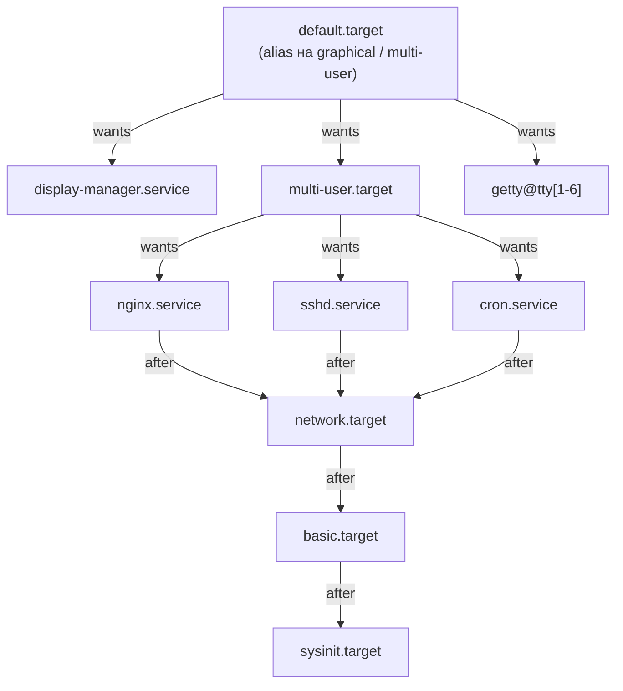
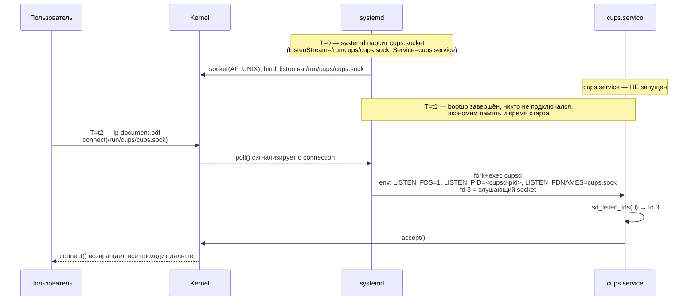
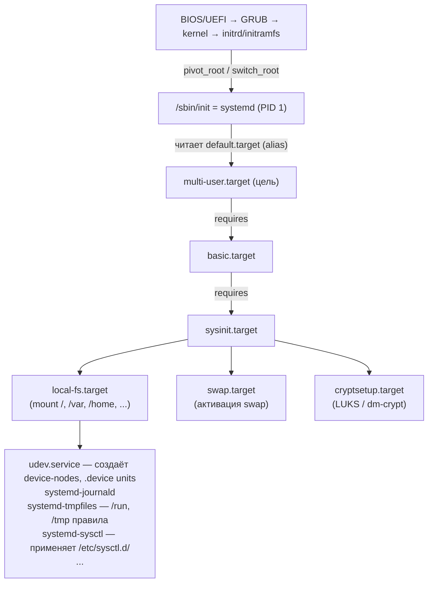

# systemd: init и process manager

systemd — PID 1 на большинстве современных Linux-дистрибутивов. Его задача — запустить, остановить и поддерживать
жизнь всех сервисов в системе, от первой инициализации железа до выключения. От старого sysvinit его отличает не
только реализация (написан на C, не на shell-скриптах), но и сама модель: вместо последовательного выполнения
скриптов в `/etc/init.d/` он строит **граф зависимостей** unit-файлов и параллельно поднимает всё, что не блокирует
друг друга.

«systemd» — это не один бинарь, а семейство демонов: собственно `systemd` (PID 1), `systemd-journald` (логи),
`systemd-logind` (сессии), `systemd-resolved` (DNS), `systemd-networkd` (сеть), `systemd-timesyncd` (NTP),
`systemd-oomd` (OOM-killer на PSI), `systemd-nspawn` (контейнеры). Это и есть главный источник споров: одни видят
в этом «всё в одном» цельный пакет управления системой, другие — нарушение Unix-философии. Технически systemd —
просто эволюция, которую без переписывания init из C сделать было нельзя.

## Зачем

```
   sysvinit (1992)                          systemd (2010)
┌────────────────────────────┐         ┌────────────────────────────┐
│  /etc/init.d/* — shell     │         │  unit-файлы (декларативные)│
│  /etc/rc<N>.d/SXX → KXX    │         │  граф зависимостей         │
│  последовательный запуск:  │         │  параллельный запуск:      │
│                            │         │                            │
│    rcS (single)            │         │      sysinit.target        │
│    └─▶ rc2 (multi)         │         │     ╱   │    │    ╲        │
│         ├─ S10sysklog      │         │   srv  srv  srv  srv       │
│         ├─ S20networking   │         │    ╲    │    │    ╱        │
│         ├─ S30sshd         │         │      basic.target          │
│         └─ S99crond        │         │       │     │              │
│                            │         │     srv   srv              │
│  boot 30..60 сек           │         │       ╲   ╱                │
│                            │         │   multi-user.target        │
│                            │         │                            │
│  ad-hoc backgrounding,     │         │  boot 2..10 сек            │
│  никакого socket act.      │         │                            │
│                            │         │  socket activation,        │
│                            │         │  on-demand mount,          │
│                            │         │  journald, cgroups, ...    │
└────────────────────────────┘         └────────────────────────────┘
```

Главные новшества по сравнению с sysvinit:

- **Параллельная загрузка**. Зависимости описываются явно (`After=`, `Requires=`), всё остальное стартует
  параллельно. Boot за 2–5 секунд против 30–60.
- **Socket activation**. systemd сам слушает сокет, поднимает сервис при первом подключении и передаёт ему
  готовый fd. Сервисы могут зависеть от сокетов друг друга без знания «кто стартует первым».
- **cgroup tracking**. Каждый сервис автоматически попадает в свою cgroup, что даёт точный учёт процессов и
  потомков (никаких потерянных daemon'ов, которые «отвязались через fork»).
- **journald**. Бинарный лог с индексами и метаданными (UID, PID, unit, cgroup) — фильтр `journalctl -u nginx
  --since today` работает без `grep` по терабайтам.
- **on-demand mount, timers, paths, devices** — единая модель для разнотипных событий.

## Unit types

Unit — базовая единица systemd. Каждый файл `*.<type>` описывает один объект. Все unit-файлы лежат в стандартных
путях: `/usr/lib/systemd/system/` (от пакетов), `/etc/systemd/system/` (от админа, override), `~/.config/systemd/user/`
(для user instance).

| Тип       | Файл          | Что описывает                                          |
|-----------|---------------|--------------------------------------------------------|
| service   | `*.service`   | сервис: daemon, oneshot-команда, forking-сервер        |
| socket    | `*.socket`    | listener для socket activation                         |
| timer     | `*.timer`     | расписание запуска (cron-replacement)                  |
| mount     | `*.mount`     | точка монтирования (генерится из `/etc/fstab`)         |
| automount | `*.automount` | lazy mount: монтировать при первом доступе             |
| path      | `*.path`      | watcher: реагировать на изменения файла/директории     |
| swap      | `*.swap`      | swap-устройство                                        |
| device    | `*.device`    | udev-устройство (генерится автоматически)              |
| target    | `*.target`    | группа units (аналог runlevel)                         |
| slice     | `*.slice`     | узел иерархии cgroup для группировки services/scopes   |
| scope     | `*.scope`     | группа внешних процессов в cgroup (создаётся через API)|

```bash
systemctl list-unit-files --type=service       # все service-файлы в системе
systemctl list-units --type=service --state=running
systemctl list-units --type=timer
```

## Unit-файл: устройство

Unit-файл — INI-подобный текст с тремя стандартными секциями:

```ini
# /etc/systemd/system/myapp.service

[Unit]
Description=My application server
Documentation=https://example.com/docs
After=network-online.target postgresql.service
Wants=network-online.target
Requires=postgresql.service
ConditionPathExists=/etc/myapp/config.yaml

[Service]
Type=notify                          # сервис сам говорит "готов" через sd_notify()
ExecStartPre=/usr/bin/myapp --check-config
ExecStart=/usr/bin/myapp --config /etc/myapp/config.yaml
ExecReload=/bin/kill -HUP $MAINPID
ExecStop=/usr/bin/myapp --graceful-shutdown
Restart=on-failure
RestartSec=5s
User=myapp
Group=myapp
WorkingDirectory=/var/lib/myapp
Environment="LOG_LEVEL=info" "WORKERS=4"
EnvironmentFile=/etc/myapp/env

# Ресурсы (cgroup)
MemoryMax=2G
MemoryHigh=1.5G
CPUWeight=200
TasksMax=512

# Безопасность
NoNewPrivileges=true
ProtectSystem=strict                 # / read-only, кроме перечисленных путей
ProtectHome=true                     # /home, /root, /run/user — недоступны
PrivateTmp=true                      # свой /tmp, /var/tmp (mount ns)
PrivateDevices=true                  # урезанный /dev
CapabilityBoundingSet=CAP_NET_BIND_SERVICE
SystemCallFilter=@system-service     # seccomp-фильтр (whitelist)
SystemCallArchitectures=native

[Install]
WantedBy=multi-user.target
```

### Секции

| Секция       | Что задаёт                                                                |
|--------------|---------------------------------------------------------------------------|
| `[Unit]`     | метаданные, зависимости, условия запуска                                  |
| `[Service]`  | как запускать процесс (Type, ExecStart, User, лимиты, sandbox)            |
| `[Install]`  | как unit включается через `systemctl enable` (symlinks в `.wants`)        |
| `[Socket]`   | для `.socket`: что слушать (ListenStream, ListenDatagram), сколько fd     |
| `[Timer]`    | для `.timer`: `OnCalendar`, `OnBootSec`, `OnUnitActiveSec`                |
| `[Path]`     | для `.path`: `PathChanged`, `PathExists`                                  |
| `[Mount]`    | для `.mount`: `What`, `Where`, `Type`, `Options`                          |

### Service Type

Этот параметр определяет, **когда systemd считает сервис «запущенным»**:

| Type       | Когда «started»                                                          |
|------------|--------------------------------------------------------------------------|
| `simple`   | сразу после fork+exec (default; для большинства не подходит)             |
| `exec`     | сразу после успешного `execve` (точнее, чем simple)                      |
| `forking`  | когда parent-процесс exit'нул (классический Unix daemon с fork+detach)   |
| `oneshot`  | когда процесс exit'нул успешно (для скриптов и init-команд)              |
| `notify`   | когда сервис послал `sd_notify("READY=1")`                               |
| `dbus`     | когда сервис захватил указанное D-Bus имя                                |
| `idle`     | как simple, но запуск откладывается до завершения active jobs            |

`notify` — рекомендуемый тип для долгоживущих сервисов: даёт точный момент готовности и поддерживает `WATCHDOG=1`
для health-check'ов. Современные сервисы (systemd-resolved, NetworkManager, sshd с подходящим патчем) делают
sd_notify напрямую.

## Зависимости и порядок

Главное запутывание systemd для новичков — разделение **наличия зависимости** и **порядка запуска**. Это разные
свойства.

| Директива      | Означает                                                                       |
|----------------|--------------------------------------------------------------------------------|
| `Requires=B`   | A зависит от B. Если B не запустился — A не запустится. B остановлен → A тоже  |
| `Wants=B`      | A хочет B, но переживёт его отсутствие (мягкое требование)                     |
| `Requisite=B`  | A требует, чтобы B **уже был** запущен; не запускает B сам                     |
| `BindsTo=B`    | как Requires, но: B упал → A тоже немедленно остановлен                        |
| `Conflicts=B`  | A и B взаимоисключают друг друга                                               |
| `After=B`      | если оба запускаются — A после B (только порядок, не зависимость)              |
| `Before=B`     | если оба запускаются — A раньше B                                              |

Типичная ошибка — указать `Requires=network.target`, но забыть `After=network.target`. systemd запустит оба
параллельно, и приложение полетит до того, как сеть готова.

```
правильно:                                  типичная ошибка:

  [Unit]                                      [Unit]
  Requires=postgresql.service                 Requires=postgresql.service
  After=postgresql.service                    (нет After!)

  [Service]                                   [Service]
  ExecStart=/usr/bin/myapp                    ExecStart=/usr/bin/myapp

  ↓ запуск:                                   ↓ запуск:
  postgresql → myapp                          postgresql и myapp параллельно
                                              myapp падает: connection refused
```

### Граф зависимостей



```bash
# Вывести граф в Graphviz dot-формате
systemd-analyze dot multi-user.target | dot -Tpng > graph.png

# Список After/Before для unit'а
systemctl list-dependencies nginx.service
systemctl list-dependencies --before nginx.service
```

## Targets vs runlevels

Target — это unit без процессов, единственная цель которого — группировать другие units через `Wants=` /
`Requires=`. Это замена runlevels sysvinit:

| sysvinit runlevel | systemd target              | Что означает                            |
|-------------------|-----------------------------|-----------------------------------------|
| 0                 | `poweroff.target`           | выключение                              |
| 1, S              | `rescue.target`             | single-user, root shell без сети        |
| 2, 3, 4           | `multi-user.target`         | multi-user, no GUI                      |
| 5                 | `graphical.target`          | multi-user + display manager            |
| 6                 | `reboot.target`             | перезагрузка                            |
| —                 | `emergency.target`          | минимум: только initrd-like среда       |

```bash
# Переключиться в режим (без перезагрузки)
systemctl isolate multi-user.target          # выйти из GUI
systemctl isolate graphical.target           # обратно

# Установить default
systemctl set-default multi-user.target

# Specialty targets
systemctl rescue                              # rescue mode
systemctl emergency                           # emergency shell
```

## Socket activation

Один из ключевых дизайн-выборов systemd: позволить ему слушать сокет от имени сервиса. Когда приходит соединение,
systemd поднимает сервис и передаёт ему уже открытый fd через переменные окружения `LISTEN_FDS`, `LISTEN_PID`,
`LISTEN_FDNAMES`.



### Что это даёт

1. **Параллельный boot без явного порядка**. Сервисы могут зависеть от сокетов друг друга, не указывая `After=`.
   Например, syslog.socket доступен с самого начала; logger в любом сервисе подключается, даже если syslog.service
   ещё не успел стартовать (kernel-side queue хранит соединения).

2. **Lazy startup**. Сервис не запускается, пока не нужен. cups, atd, multipathd могут спокойно ждать первого
   запроса.

3. **Rolling restart**. При обновлении сервиса соединения не теряются — systemd держит сокет открытым, новые
   подключения буферизуются в kernel queue.

### Пример unit'а с socket activation

```ini
# /etc/systemd/system/echo.socket
[Unit]
Description=Echo socket
[Socket]
ListenStream=12345
Accept=no                       # один экземпляр сервиса на все соединения
                                # (Accept=yes — отдельный процесс на каждое)
[Install]
WantedBy=sockets.target
```

```ini
# /etc/systemd/system/echo.service
[Unit]
Requires=echo.socket
[Service]
ExecStart=/usr/local/bin/echod
StandardInput=socket            # systemd подключит socket к stdin сервиса
```

Сервис может вообще не знать о сокетах: systemd подключает socket к stdin (как делает inetd). Современные демоны
используют API библиотеки **sd_notify**: `sd_listen_fds()` для перечисления переданных fd, `sd_notify()` для
сигналов о готовности и health-check.

## journald

Логи в systemd — отдельная подсистема. `journald` собирает stdout/stderr всех unit'ов, плюс данные из syslog API
(`syslog(3)`), kernel-log (`/dev/kmsg`), audit, и хранит их в бинарном формате `*.journal` в
`/var/log/journal/` (persistent) или `/run/log/journal/` (только в RAM, до перезагрузки).

Каждая запись — это структура с произвольным набором полей:

```
MESSAGE="Started session 5 of user endor"
PRIORITY=6
SYSLOG_FACILITY=3
SYSLOG_IDENTIFIER=systemd
_SYSTEMD_UNIT=systemd-logind.service
_SYSTEMD_CGROUP=/system.slice/systemd-logind.service
_UID=0
_GID=0
_PID=812
_COMM=systemd-logind
_HOSTNAME=workstation
_BOOT_ID=4c5e...
_MACHINE_ID=abc...
_TRANSPORT=stdout
__REALTIME_TIMESTAMP=1737367800123456
__MONOTONIC_TIMESTAMP=234567890123
```

Поля с префиксом `_` (один underscore) ставит journald автоматически, доверять им можно. Поля с `__` (два) —
служебные. Произвольные поля от приложения — без подчёркивания.

### journalctl

```bash
journalctl                                  # весь лог, от старого к новому
journalctl -f                               # tail -f
journalctl -r                               # обратный порядок
journalctl -n 100                           # последние 100 строк
journalctl -u nginx.service                 # только nginx
journalctl -u nginx -u postgresql           # несколько unit'ов
journalctl -u nginx --since "2 hours ago"
journalctl -u nginx --since today --until "1 hour ago"
journalctl -p err                           # priority >= err
journalctl -k                               # только kernel (dmesg replacement)
journalctl _PID=1234                        # по любому полю
journalctl _COMM=ssh _UID=1000              # пересечение условий
journalctl _SYSTEMD_UNIT=nginx.service + _SYSTEMD_UNIT=php-fpm.service
                                            # объединение (плюс — OR)
journalctl --boot                           # текущая загрузка
journalctl --boot -1                        # предыдущая загрузка
journalctl --list-boots                     # список загрузок
journalctl --disk-usage                     # сколько места занято
journalctl --vacuum-time=7d                 # удалить старше 7 дней
journalctl --vacuum-size=500M               # удалить до достижения размера
```

### Хранение

```
/var/log/journal/<machine-id>/
├── system.journal              ← активный, в него идёт запись
├── system@xxxx-yyyy.journal    ← архивный (после rotate)
├── system@xxxx-zzzz.journal
└── user-1000.journal           ← логи user@1000.service
```

Persistent storage включается созданием `/var/log/journal/` (если директории нет — journald пишет только в RAM).
По умолчанию journald держит лимит: 10% от размера диска или 4 GB (что меньше). Настраивается в
`/etc/systemd/journald.conf` (`SystemMaxUse=`, `SystemKeepFree=`, `SystemMaxFileSize=`, `MaxRetentionSec=`).

### Forwarding

journald может дублировать логи: `ForwardToSyslog=yes` отправляет в rsyslog, `ForwardToKMsg=yes` — в `/dev/kmsg`,
`ForwardToConsole=yes` — на консоль. Это нужно для интеграции с внешними сборщиками (Loki, Elasticsearch,
Splunk) — обычно стоит **rsyslog-омнибас** на host'е, который форвардит куда нужно.

## cgroup integration

Каждый unit систем автоматически получает свой cgroup в иерархии (см. подробно [cgroups: углублённо](../isolation/cgroups.md)).
Дерево строится по принципу «слайсы группируют, сервисы и скоупы содержат процессы»:

```
/sys/fs/cgroup/
├── init.scope/             ← сам systemd (PID 1)
├── system.slice/           ← system-сервисы
│   ├── nginx.service/      ← все процессы nginx
│   ├── postgresql.service/
│   └── ...
├── user.slice/             ← пользовательские сессии
│   └── user-1000.slice/
│       ├── user@1000.service/  ← user systemd instance
│       │   ├── app.slice/
│       │   └── ...
│       └── session-3.scope/    ← TTY/SSH сессия
└── machine.slice/          ← systemd-nspawn контейнеры, VMs
```

### systemd-cgls / systemd-cgtop

```bash
systemd-cgls                  # дерево cgroup как ps-tree
# Control group /:
# ├─user.slice
# │ └─user-1000.slice
# │   └─session-3.scope
# │     ├─2103 sshd: endor [priv]
# │     ├─2118 sshd: endor@pts/0
# │     ├─2119 -bash
# │     └─2435 bpftrace -e ...
# └─system.slice
#   ├─nginx.service
#   │ ├─1234 nginx: master process
#   │ ├─1235 nginx: worker process
#   │ └─1236 nginx: worker process
#   └─...

systemd-cgtop                 # top по cgroups
# Control Group          Tasks  %CPU  Memory  Input/s  Output/s
# /                       412   12.3   3.2G   1.5M     800K
# user.slice               87    8.1   1.8G   ...      ...
# system.slice            325    4.2   1.4G   ...      ...
```

### Resource limits через unit-файл

```ini
[Service]
MemoryMax=2G                   # → /sys/fs/cgroup/<unit>/memory.max
MemoryHigh=1.5G                # → memory.high
CPUWeight=200                  # → cpu.weight
CPUQuota=50%                   # → cpu.max (50000 100000)
IOWeight=200                   # → io.weight
TasksMax=512                   # → pids.max
IOReadBandwidthMax=/dev/sda 50M
```

```bash
# Изменить лимит на лету
systemctl set-property nginx.service MemoryMax=4G
systemctl set-property nginx.service MemoryMax=4G --runtime=false  # и в drop-in

# Запустить процесс в transient scope с лимитом
systemd-run --scope -p MemoryMax=512M -p CPUWeight=50 ./myscript.sh

# Создать transient service (с автоматической cgroup, рестартом и логами)
systemd-run --unit=myjob --slice=batch.slice ./long_running_task
```

## systemd-oomd

Когда `memory.pressure` (PSI) внутри slice'а превышает порог, systemd-oomd выбирает самую тяжёлую cgroup в этом
slice и убивает её **до** того, как сработает kernel OOM-killer. Это превентивный механизм для интерактивных
систем, где kernel-OOM реагирует слишком поздно — когда уже всё тормозит из-за swap-storm'а.

Конфиг в slice'е:

```ini
# /etc/systemd/system/user-1000.slice.d/oomd.conf
[Slice]
ManagedOOMMemoryPressure=kill
ManagedOOMMemoryPressureLimit=50%
ManagedOOMSwap=kill
```

«Если memory pressure some avg10 в этом slice превышает 50% — выбрать и убить cgroup внутри». Подробно — см.
[cgroups](../isolation/cgroups.md), раздел PSI.

## systemd-nspawn

`systemd-nspawn` — минимальный container runtime от systemd. Под капотом — `chroot` + полный набор namespaces +
своя cgroup. Используется как «легковесный VM» для тестов, как контейнерная замена `chroot` для сборок, и как
основа для образов в [machinectl](https://www.freedesktop.org/software/systemd/man/machinectl.html).

```bash
# Создать chroot директорию с минимальной системой
debootstrap --include=systemd,dbus stable /var/lib/machines/debian

# Запустить как контейнер с интерактивной оболочкой
sudo systemd-nspawn -D /var/lib/machines/debian

# Запустить как боксированную систему (со своим systemd внутри)
sudo systemd-nspawn -bD /var/lib/machines/debian
# внутри: запускается systemd-PID-1, виден полный multi-user.target

# С сетью (bridge на host, veth внутри)
sudo systemd-nspawn -bD /var/lib/machines/debian --network-bridge=br0

# Управление через machinectl
machinectl list
machinectl shell debian
machinectl poweroff debian
```

systemd-nspawn ближе всего к philosophy «контейнер = full OS», в отличие от Docker'а с philosophy «один процесс
на контейнер». Для долгоживущих сред разработки и для тестирования systemd-сервисов — идеален.

## Boot sequence: что делает systemd



После `sysinit.target` — `basic.target` (sockets, timers, paths).
После `basic.target` — sequence `Wants=` для `multi-user.target`:
sshd, cron, network manager, dbus, getty@tty1, ...

### Анализ загрузки

```bash
systemd-analyze                                # время загрузки
# Startup finished in 3.124s (kernel) + 4.821s (userspace) = 7.945s
# multi-user.target reached after 4.819s in userspace

systemd-analyze blame                          # самые медленные unit'ы
# 2.142s NetworkManager-wait-online.service
# 1.234s docker.service
# 0.456s systemd-journal-flush.service
# 0.321s snapd.service
# 0.198s lvm2-monitor.service

systemd-analyze critical-chain                 # критический путь зависимостей
# multi-user.target @4.819s
# └─NetworkManager-wait-online.service @2.677s +2.142s
#   └─NetworkManager.service @1.234s +1.443s
#     └─basic.target @1.231s
#       └─sysinit.target @1.218s +12ms
#         └─...

systemd-analyze plot > boot.svg                # визуализация в SVG
```

`NetworkManager-wait-online.service` — классический виновник медленной загрузки на ноутбуках: он ждёт реального
соединения с сетью, и если WiFi не сразу подключается, sleep'ит до 30 секунд.

## systemctl: основные команды

```bash
# Управление unit'ом
systemctl start nginx              # запустить (этот раз)
systemctl stop nginx               # остановить
systemctl restart nginx            # рестарт
systemctl reload nginx             # SIGHUP (если ExecReload= задан)
systemctl reload-or-restart nginx  # reload если возможно, иначе restart
systemctl status nginx             # состояние + последние логи + cgroup

# Автозапуск
systemctl enable nginx             # symlink в .wants — запуск при boot
systemctl disable nginx            # удалить symlink
systemctl enable --now nginx       # enable + start сразу
systemctl is-enabled nginx         # enabled / disabled / static / masked
systemctl is-active nginx          # active / inactive / failed
systemctl mask nginx               # symlink на /dev/null — невозможно
                                   # запустить даже руками
systemctl unmask nginx

# Конфигурация
systemctl daemon-reload            # после правки unit-файлов
systemctl edit nginx               # создать drop-in (override.conf)
systemctl edit --full nginx        # редактировать копию unit-файла
systemctl cat nginx                # показать актуальный unit-файл + drop-ins
systemctl show nginx               # все свойства unit'а с дефолтами

# Информация
systemctl list-units --type=service --state=running
systemctl list-units --failed      # упавшие
systemctl list-dependencies nginx  # дерево зависимостей
systemctl list-jobs                # незавершённые операции
systemctl get-default              # default target
systemctl set-default multi-user.target
```

## Другие компоненты systemd

### systemd-timesyncd

Минимальный SNTP-клиент. Заменяет ntpd/chrony, когда не нужна высокая точность (например, на ноутбуке). Простая
конфигурация в `/etc/systemd/timesyncd.conf`. Для серверов и точности < 1 ms — лучше chrony.

### systemd-resolved

Caching DNS resolver. Слушает `127.0.0.53:53`, конфигурируется через `/etc/systemd/resolved.conf` или per-interface
через `resolvectl`. Поддерживает DNSSEC, DNS-over-TLS, mDNS, LLMNR. Один из самых спорных компонентов: ломает
конфигурации, привыкшие к простому `/etc/resolv.conf`. Может быть полностью отключён без последствий.

### systemd-networkd

Network manager в духе systemd — декларативные `.network`, `.netdev`, `.link` файлы. Хорош для серверов, где
конфигурация фиксирована. Не для laptop'ов (там — NetworkManager).

### systemd-logind

Управляет user-сессиями: учёт login'ов, lock/unlock screen, suspend по закрытию крышки, polkit-проверка доступа
к hardware. Каждая сессия — это `session-N.scope` в cgroup иерархии.

### systemd-tmpfiles

Создаёт и удаляет файлы и директории по правилам в `/etc/tmpfiles.d/`, `/usr/lib/tmpfiles.d/`. Применяется при
boot (создание `/run`-структуры), периодически по таймеру (очистка `/tmp` старше N дней).

### systemd-coredumpctl

Перехватывает coredump'ы через `kernel.core_pattern = |/usr/lib/systemd/systemd-coredump`, складывает в
`/var/lib/systemd/coredump/`. Просмотр через `coredumpctl list`, `coredumpctl debug <PID>` (открывает gdb с
core'ом).

## User instance

`systemd --user` — отдельный экземпляр systemd, работающий от имени каждого пользователя. Запускается через
`user@<UID>.service` в system instance. Управляет пользовательскими unit'ами:

```bash
systemctl --user start myapp.service
systemctl --user enable --now myapp.timer
journalctl --user -u myapp.service
```

Unit-файлы лежат в:
- `~/.config/systemd/user/` (пользовательские)
- `/etc/systemd/user/` (от админа)
- `/usr/lib/systemd/user/` (от пакетов)

User instance запускается при первом login'е пользователя. Если нужно, чтобы сервис работал и без login'а
(например, на сервере): `loginctl enable-linger <user>` — это даёт user instance lifetime «с boot до shutdown».

## Подводные камни

**Service Type=simple. ExecStart-процесс отвязывается через fork+exec child + parent exit.** systemd считает
сервис «started» сразу после fork, видит parent exit и думает, что сервис умер. Решение: `Type=forking` с
указанием `PIDFile=` или, лучше, переписать без forking — современные daemon'ы должны быть foreground (`Type=notify`
или `Type=simple`).

**daemon-reload после правки unit-файла обязателен.** systemd кэширует распарсенные units. `systemctl edit` сам
делает reload, но прямое редактирование файла в `/etc/systemd/system/` — нет. Признак — поведение не соответствует
изменённому файлу.

**`After=` без `Requires=` — только порядок.** Если зависимый сервис упал или не сконфигурирован, ваш всё равно
запустится (и упадёт). Для жёсткой связи нужен и `Requires=`, и `After=`.

**ProtectHome=true ломает Docker bind-mounts из /home.** Sandbox-директивы создают свой mount namespace — host
mounts становятся недоступны. Для сервисов с volume'ами из `/home` нужно явно отключить `ProtectHome=` или
использовать `ReadOnlyPaths=` для тонкой настройки.

**EnvironmentFile с многострочными значениями.** systemd parser простой: `KEY=value`, без shell-семантики. Никаких
`$(command)`, многострочных значений, escape-quoting. Сложные конфиги — через ExecStartPre скрипт или
`Environment="KEY=value"` напрямую.

**Timer'ы и накопление missed runs.** Если timer был остановлен (suspended laptop), при возобновлении systemd по
умолчанию **не** запускает все пропущенные runs — только следующий. `Persistent=true` в `[Timer]` сохраняет
last-trigger и запускает один пропущенный run при boot.

**journald теряет сообщения под нагрузкой.** При rate >10000 msg/s journald начинает дропать с warning «Suppressed
N messages from <unit>». Настройка `RateLimitBurst=` и `RateLimitIntervalSec=` в journald.conf.

**Restart=always с быстро падающим сервисом.** systemd рестартует, сервис падает, рестартует, падает — start-rate
limiter (`StartLimitBurst=`, `StartLimitIntervalSec=`) после 5 рестартов за 10 секунд переводит unit в
`failed (start-limit-hit)`. Чтобы убрать ограничение — `StartLimitBurst=0` или `StartLimitIntervalSec=0`.

**`systemctl stop` ждёт `TimeoutStopSec=` (по умолчанию 90s).** Если сервис игнорирует SIGTERM, systemd ждёт
полтора минуты, потом шлёт SIGKILL. Для медленных shutdown-процедур — `TimeoutStopSec=10min`. Для быстрого
прерывания — `KillMode=mixed` или `SendSIGKILL=no`.

## Связанные темы

- [Основы процессов](../processes/processes_basics.md) — systemd как PID 1, дерево процессов, дочерние сессии
- [Сигналы](../processes/signals.md) — `KillSignal=`, `ExecStop=`, `SIGTERM` → `SIGKILL` timeout
- [cgroups: углублённо](../isolation/cgroups.md) — каждый unit получает свою cgroup; лимиты через unit-файл
- [Linux namespaces](../isolation/namespaces.md) — `PrivateTmp`, `ProtectHome` создают mount ns
- [seccomp](../isolation/seccomp.md) — `SystemCallFilter=` применяет seccomp-bpf
- [Внутреннее устройство контейнеров](../isolation/containers_internals.md) — systemd-nspawn как
  минимальный container runtime; интеграция с containerd через scope

## Источники

- [systemd documentation — freedesktop.org](https://www.freedesktop.org/wiki/Software/systemd/)
- `man systemd`, `man systemd.unit`, `man systemd.service`, `man systemd.socket`, `man systemd.exec`,
  `man systemd.resource-control`, `man journalctl`, `man systemctl`
- Lennart Poettering, [«systemd for Administrators»](http://0pointer.de/blog/projects/systemd-for-admins-1.html) —
  серия из 21 поста, эталонная документация дизайна
- [systemd by example](https://systemd-by-example.com/) — интерактивные примеры
- [The Biggest Myths](http://0pointer.de/blog/projects/the-biggest-myths.html) — Poettering об основных
  заблуждениях
- [Rethinking PID 1](http://0pointer.de/blog/projects/systemd.html) — оригинальный анонс проекта (2010)
- [systemd source](https://github.com/systemd/systemd) — `src/core/`, `src/journal/`
