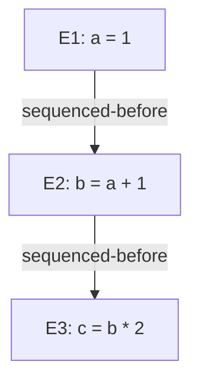
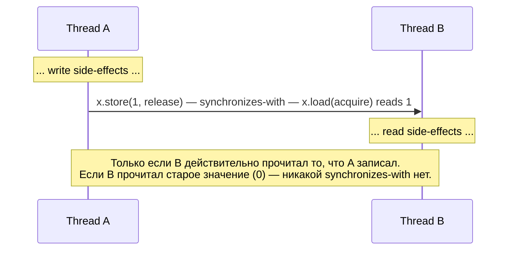
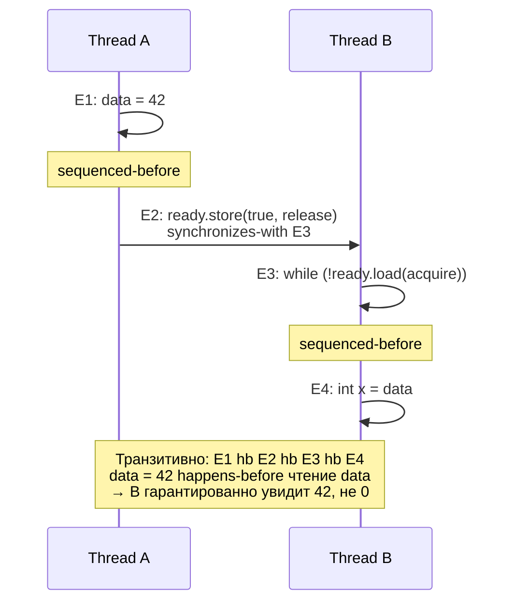
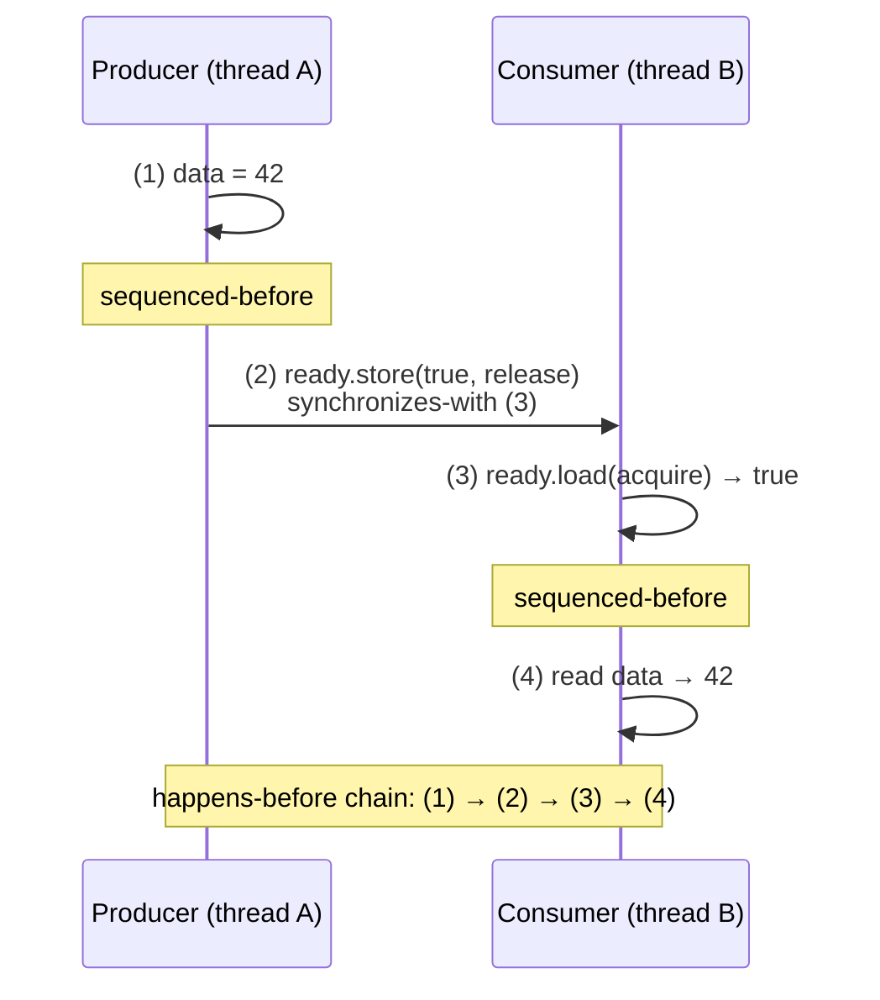
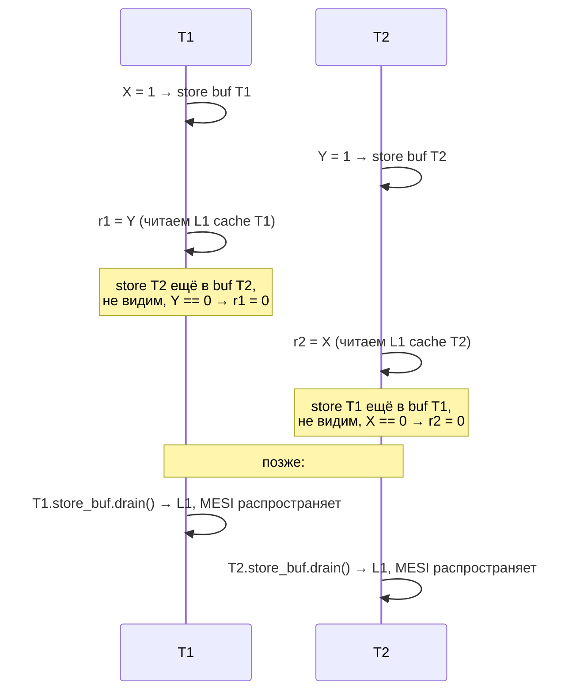
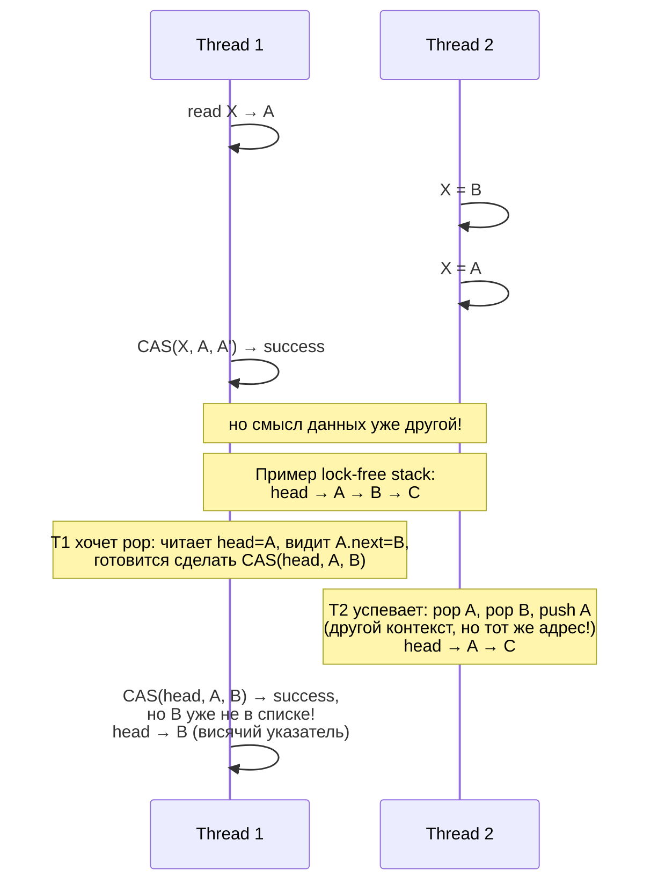

# Atomic operations и memory model

Lock-free код опирается не на mutex'ы, а на две вещи: **atomicity** (операция либо произошла целиком, либо не произошла
вовсе — без промежуточных состояний, видимых другим потокам) и **ordering** (правила, по которым записи одного потока
становятся видны другому). Без явного контроля над обоими аспектами многопоточная программа работает «как повезёт»: на
x86 кажется корректной, на ARM рассыпается.

Даже `x++` на одной разделяемой переменной — это **read-modify-write** (RMW): загрузка значения в регистр, инкремент,
запись обратно. На multi-core два потока могут одновременно прочитать одно и то же значение и записать одно и то же
+1 — итог потеряет одну инкрементацию. Атомарность инструкции `INC [mem]` на x86 без префикса `LOCK` не гарантируется.

C11 и C++11 ввели формальную модель памяти и `_Atomic`/`std::atomic`, которые компилятор отображает в правильные
машинные инструкции и memory barriers для каждой архитектуры. До этого приходилось писать inline assembly или
полагаться на платформенные интринсики (`__sync_*` в GCC).

## Atomicity на железе

x86-64 гарантирует атомарность для **aligned naturally-sized** загрузок и хранений:

| Размер  | Адрес выровнен по   | Атомарно без LOCK?     |
|---------|---------------------|------------------------|
| 1 байт  | любой               | да                     |
| 2 байта | 2                   | да                     |
| 4 байта | 4                   | да                     |
| 8 байт  | 8                   | да (на 64-bit CPU)     |
| 16 байт | 16, только `MOVDQA` | implementation-defined |

Невыровненный (`unaligned`) доступ, пересекающий cache line (64 байта), может разорваться на две транзакции к памяти.
Промежуточное состояние станет видно другому потоку — это **tearing**.

```
Aligned 8-byte load (атомарно)         Unaligned 8-byte load across cache lines
                                       (НЕ атомарно)
cache line N                           cache line N      cache line N+1
┌─────────────────────────────┐        ┌─────────────────┬─────────────────┐
│ . . . [ 8 bytes value ] . . │        │ . . . . [ 4 b ] │ [ 4 b ] . . . . │
└─────────────────────────────┘        └─────────────────┴─────────────────┘
        ▲                                       ▲                  ▲
        │ один MOV ─ одна транзакция            │ две транзакции — между ними
        │                                       │ другой поток может записать
```

### RMW и LOCK prefix

Инструкции read-modify-write (`INC`, `DEC`, `ADD`, `XADD`, `CMPXCHG`) **не** атомарны без `LOCK`:

```asm
inc dword [counter]      ; не атомарно: load, +1, store — три шага
lock inc dword [counter] ; атомарно: cache line заблокирована
```

Префикс `LOCK` блокирует cache line, содержащую операнд, на время выполнения инструкции. Раньше (Pentium и старше) это
была буквально блокировка системной шины — все остальные ядра останавливались. Современные процессоры используют
**cache coherency protocol** (MESI, см. [Кэши процессора](../assembler_and_processor/cpu_caches.md)): ядро переводит
cache line в состояние Modified и блокирует когерентность только для этой линии.

```
LOCK INC [addr] на двух ядрах одновременно

           Core 0                                    Core 1
           ┌─────────────────────────┐               ┌─────────────────────────┐
           │ LOCK INC [counter]      │               │ LOCK INC [counter]      │
           └────────────┬────────────┘               └────────────┬────────────┘
                        │                                         │
                        ▼                                         ▼
                ┌────────────────┐                       ┌────────────────┐
                │  L1 cache C0   │                       │  L1 cache C1   │
                │  [counter] = ? │                       │  [counter] = ? │
                └───────┬────────┘                       └───────┬────────┘
                        │                                        │
                        └───────────┬────────────────────────────┘
                                    │
                                    ▼
                  ┌─────────────────────────────────────┐
                  │   Cache coherency (MESI)            │
                  │                                     │
                  │   1. C0 запрашивает M-состояние     │
                  │   2. C1 инвалидирует свою копию     │
                  │   3. C0 выполняет INC, выпускает    │
                  │   4. C1 запрашивает M-состояние     │
                  │   5. C0 инвалидирует свою копию     │
                  │   6. C1 выполняет INC               │
                  └─────────────────────────────────────┘

Результат: counter += 2 (две атомарные инкрементации сериализованы)
```

Стоимость:

| Операция                    | Латентность (порядок) |
|-----------------------------|-----------------------|
| Обычная инструкция в L1     | ~0.5 нс               |
| `LOCK`-операция uncontended | ~5–15 нс              |
| `LOCK` под contention       | 100+ нс на операцию   |

Инструкция `XCHG` с памятью имеет неявный `LOCK` — на x86 это исторически и есть самая дешёвая атомарная RMW для
реализации spinlock'а.

## Tearing на 32-битных платформах

На 32-битной x86 нет атомарного 64-bit RMW без `LOCK`; для чистого load/store на современных x86 8-байтовый
доступ через `MOVQ` с xmm/mmx-регистром атомарен (гарантия с P5/Pentium). Но при обычном 64-битном чтении
через два 32-битных GP-регистра получаются два отдельных чтения подряд:

```
Поток A пишет 64-bit значение:                Поток B читает 64-bit значение:
  store low  = 0xCAFEBABE                       load  low  ──▶ 0xCAFEBABE
  store high = 0xDEADBEEF                       load  high ──▶ 0x00000000 (старое!)
                                                итог: 0x00000000CAFEBABE — мусор
```

Для корректного 64-битного atomic на 32-битах компилятор использует `CMPXCHG8B` или SSE-инструкции. Декларация
`_Atomic uint64_t` / `std::atomic<uint64_t>` это обеспечит, обычная переменная — нет.

Структуры `atomic<T>` выравнивают своё хранилище через `alignas(sizeof(T))`, чтобы исключить tearing. Свою атомарную
переменную всегда объявляйте через `_Atomic`/`std::atomic`, не полагайтесь на «у меня же оно выровнено».

## C11 и C++11 atomics API

| C11 (`<stdatomic.h>`)                       | C++11 (`<atomic>`)                    | Назначение                               |
|---------------------------------------------|---------------------------------------|------------------------------------------|
| `_Atomic int x;`                            | `std::atomic<int> x;`                 | объявление atomic переменной             |
| `atomic_load_explicit(&x, mo)`              | `x.load(mo)`                          | атомарное чтение                         |
| `atomic_store_explicit(&x, v, mo)`          | `x.store(v, mo)`                      | атомарная запись                         |
| `atomic_exchange_explicit(&x, v, mo)`       | `x.exchange(v, mo)`                   | записать, вернуть старое                 |
| `atomic_compare_exchange_strong(&x, &e, d)` | `x.compare_exchange_strong(e, d, mo)` | CAS, не допускает spurious fail          |
| `atomic_compare_exchange_weak(&x, &e, d)`   | `x.compare_exchange_weak(e, d, mo)`   | CAS, допускает spurious fail (LL/SC)     |
| `atomic_fetch_add_explicit(&x, v, mo)`      | `x.fetch_add(v, mo)`                  | атомарное `+=`, вернуть старое           |
| `atomic_fetch_sub/and/or/xor_explicit`      | `x.fetch_sub/and/or/xor(v, mo)`       | другие арифм./логические RMW             |
| `atomic_flag_test_and_set_explicit`         | `std::atomic_flag::test_and_set(mo)`  | atomic boolean для spinlock              |
| `atomic_thread_fence(mo)`                   | `std::atomic_thread_fence(mo)`        | standalone memory barrier                |
| `atomic_signal_fence(mo)`                   | `std::atomic_signal_fence(mo)`        | барьер только против compiler reordering |

Версии **без** суффикса `_explicit` (C) или **без** аргумента ordering (C++) используют `memory_order_seq_cst` — самый
сильный режим. Это безопасный дефолт, но самый дорогой.

`atomic<T>` для произвольного `T` компилируется в lock-based реализацию, если `T` слишком большой или его размер не
соответствует hardware-поддерживаемой атомарности. Проверка:

```cpp
std::atomic<MyStruct> a;
static_assert(std::atomic<MyStruct>::is_always_lock_free);  // compile-time
assert(a.is_lock_free());                                   // run-time
```

## Memory ordering

Источники переупорядочивания, против которых работает memory ordering:

1. **Компилятор** при оптимизации может переставить независимые операции для register allocation, dead store
   elimination, common subexpression elimination.
2. **CPU out-of-order execution** запускает инструкции не в program order, ориентируясь на готовность операндов.
3. **Cache memory subsystem** через store buffer и invalidation queue может задержать запись до того, как другие ядра
   её увидят.

C++ memory model описывает гарантии абстрактно — компилятор для каждой архитектуры подставит нужные fence-инструкции.

### memory_order_relaxed

Гарантирует только **atomicity**. Никаких ограничений на переупорядочение операций вокруг этой atomic-операции
относительно других операций (atomic или нет).

Применение: счётчики статистики, где важно не потерять инкременты, но порядок их «появления» не нужен.

```c
// относительно безвредно, можно relaxed
atomic_fetch_add_explicit(&request_count, 1, memory_order_relaxed);
```

### memory_order_acquire

Применяется к **load** (и acquire-части RMW). Никакая операция, **следующая** в program order за этой acquire-load, не
может быть переупорядочена **до** неё. Образует «нижнюю границу» барьера.

```
       любые операции              ◀── могут переехать сюда вниз
   ─────────────────────────
       acquire load            ◀── граница
   ─────────────────────────
       любые операции              ◀── НЕ могут переехать вверх через границу
```

### memory_order_release

Применяется к **store** (и release-части RMW). Никакая операция, **предшествующая** в program order этому
release-store, не может быть переупорядочена **после** него. «Верхняя граница» барьера.

```
       любые операции              ◀── НЕ могут переехать вниз через границу
   ─────────────────────────
       release store           ◀── граница
   ─────────────────────────
       любые операции              ◀── могут переехать сюда вверх
```

### memory_order_acq_rel

Только для RMW (например, `fetch_add`). Одновременно acquire по отношению к чтению и release по отношению к записи —
двусторонний барьер.

### memory_order_seq_cst

Acquire + release **плюс** единый глобальный total order для всех seq_cst операций во всей программе. Любой поток
видит seq_cst операции в одном и том же порядке. Это самая интуитивная модель — программа ведёт себя как чередование
инструкций потоков.

На x86 seq_cst для load — обычный `MOV`, для store — `MOV` + `MFENCE` (либо `XCHG`). На ARM/POWER seq_cst требует
полных барьеров с обеих сторон, поэтому заметно дороже acquire/release.

### memory_order_consume

Изначально задумывался как «более слабая версия acquire»: гарантировал ordering только для операций, **зависящих по
данным** от загруженного значения. На практике формальная спецификация оказалась неработоспособной — все компиляторы
сейчас апгрейдят `consume` до `acquire`. Стандарт C++17 пометил его «временно не рекомендуется».

### Таблица: что можно/нельзя переупорядочивать

```
┌──────────────────┬──────────────┬──────────────┬──────────────┬──────────────┐
│                  │   relaxed    │   acquire    │   release    │   seq_cst    │
├──────────────────┼──────────────┼──────────────┼──────────────┼──────────────┤
│ load → load      │   можно      │   нельзя*    │   можно      │   нельзя     │
│ load → store     │   можно      │   нельзя*    │   можно      │   нельзя     │
│ store → load     │   можно      │   можно      │   нельзя**   │   нельзя     │
│ store → store    │   можно      │   можно      │   нельзя**   │   нельзя     │
│ глобальный TO    │      нет     │      нет     │      нет     │      да      │
└──────────────────┴──────────────┴──────────────┴──────────────┴──────────────┘

*  для последующих (program order) операций относительно acquire-load
** для предшествующих (program order) операций относительно release-store
TO  = total order
```

## Формальная модель: sequenced-before, happens-before, synchronizes-with

Memory ordering — это не «барьеры в памяти», это **отношения между операциями**. Стандарт C++ определяет несколько частичных порядков на множестве всех memory operations программы. Если две операции связаны нужным отношением — компилятор и CPU обязаны сохранить их порядок и видимость; если не связаны — могут переупорядочивать.

Формальная модель нужна по двум причинам:
- **Дать определение data race**: операция X и операция Y одновременно — это не определено как-нибудь («одновременно» в распределённой системе бессмысленно). Определение через отсутствие happens-before связи делает понятие точным.
- **Доказать корректность lock-free кода**: вместо «попробуем — кажется работает» можно построить цепочку отношений и убедиться, что чтение увидит нужное значение.

### sequenced-before

Отношение **внутри одного потока**, задаёт порядок выполнения отдельных операций (evaluations).



Связи задаются точкой с запятой, full expressions, sequence points, операторами `&&` / `||` / `,` / `?:`. Внутри одного выражения порядок может быть не определён: `f(g(), h())` — g и h могут быть вычислены в любом порядке (C++17 это уточнил для function arguments).

Sequenced-before — **программный порядок**, как читается код. Это не означает что компилятор не может переупорядочить инструкции — может, если результат программы не изменится (as-if rule).

### synchronizes-with

Отношение **между разными потоками** через atomic операции. Базовое правило: **release-store** в одном потоке `synchronizes-with` **acquire-load** в другом потоке, если acquire-load прочитал значение, записанное этим release-store (или последующим release в той же release sequence).



Другие способы установить synchronizes-with:
- `mutex.unlock()` synchronizes-with следующий `mutex.lock()` на том же mutex'е;
- `thread.join()` synchronizes-with все операции присоединяемого потока;
- `promise.set_value(v)` synchronizes-with `future.get()` который вернул `v`;
- atomic_thread_fence(release) синхронизируется с atomic_thread_fence(acquire) через atomic операцию между ними.

Если acquire прочитал из relaxed-store — связи нет. Если release был, но acquire прочитал ДРУГОЕ значение — связи нет.

### happens-before

Транзитивное замыкание `sequenced-before` ∪ `synchronizes-with`. Если A happens-before B, то все side-effects A видны при выполнении B.

```
                  ┌──────────────────────────────────────────────┐
                  │            happens-before (hb)               │
                  │                                              │
                  │      ┌──────────────┐  ┌──────────────────┐  │
                  │      │ sequenced-   │  │ synchronizes-    │  │
                  │      │   before     │  │      with        │  │
                  │      │  (внутри     │  │ (между потоками  │  │
                  │      │   потока)    │  │ через atomics)   │  │
                  │      └──────────────┘  └──────────────────┘  │
                  │              │                  │            │
                  │              └────── ∪ ─────────┘            │
                  │              + транзитивное замыкание        │
                  └──────────────────────────────────────────────┘
```

Канонический пример:



### Inter-thread happens-before

Для seq_cst добавляется ещё одно отношение — **single total order S** для всех seq_cst операций. Все потоки видят один и тот же глобальный порядок seq_cst loads/stores. Это сильнее чем acquire/release: даже без явной synchronizes-with пары, seq_cst операции упорядочены друг с другом.

```
Thread A: x.store(1, seq_cst);    (Ax)
Thread B: y.store(1, seq_cst);    (By)
Thread C: r1 = x.load(seq_cst);   (Cx)
          r2 = y.load(seq_cst);   (Cy)
Thread D: r3 = y.load(seq_cst);   (Dy)
          r4 = x.load(seq_cst);   (Dx)

  С seq_cst: невозможно (r1=1, r2=0, r3=1, r4=0) — это
  означало бы что C видит Ax-перед-By, а D видит By-перед-Ax.
  Глобальный порядок S запрещает такое расхождение.

  С acquire/release этот пример сломан — IRIW (Independent
  Reads of Independent Writes) на ARM/POWER может проявиться.
```

### Data race — формальное определение

**Data race** — две операции в разных потоках, обе обращаются к одной memory location, хотя бы одна из них write, и они **не упорядочены отношением happens-before**.

Это ровно та ситуация, на которую стандарт говорит **undefined behavior** — никаких гарантий, компилятор может выкинуть весь код, оптимизация на основе предположения «UB не происходит» может скрутить программу необычным образом.

```
Корректная программа:
  Все конфликтующие пары упорядочены happens-before
  ⇒ либо атомарная операция, либо защищены mutex'ом / fence'ом

Программа с data race:
  Существует пара (X, Y) которая:
    - оба обращения к одной memory location
    - хотя бы одно — write
    - не упорядочены через happens-before
  ⇒ UB. Tools: ThreadSanitizer ловит во время выполнения.
```

`std::atomic<T>` операции **никогда не образуют data race** друг с другом, даже relaxed — это сделано специально, чтобы стандарт можно было использовать как фундамент для lock-free кода.

### SC-DRF guarantee

**Sequential Consistency for Data-Race-Free programs** — главная теорема memory model:

> Если программа не содержит data race и все её atomic операции — seq_cst, она ведёт себя как если бы инструкции всех потоков были чередованы в один глобальный порядок.

Это даёт «интуитивную» модель которую новички ожидают. Цена — seq_cst дороже acquire/release: на x86 любая seq_cst store компилируется в `LOCK XCHG` или mfence-after-store, на ARM требует `dmb ish` барьер.

Если все atomics — seq_cst, и программа DRF, можно рассуждать как о sequentially consistent системе. Если используется relaxed/acquire/release — нужно явно строить happens-before цепочки.

### carries-a-dependency и memory_order_consume

Отдельная категория для `consume`. **carries-a-dependency-to** — отношение внутри потока, где значение операции используется (через value/data dependency, не через control dependency) в следующей операции:

```
auto* p = ptr.load(consume);   // value: указатель
int x = p->data;                // p используется в адресной арифметике
                                // → load p->data «carries-a-dependency-from» load ptr
```

Гарантия `consume`: только те операции, которые carries-a-dependency от consume-load, упорядочены. Это слабее acquire (которое упорядочивает все последующие операции).

На практике все компиляторы апгрейдят consume до acquire — формализация оказалась сломанной (через любое сравнение `if (p)` теряется dependency tracking), а оптимизация на старых ARM-системах не оправдала сложность. C++17 пометил consume как «temporarily discouraged».

### Использование на практике

Если код использует только seq_cst — рассуждать просто через interleaving. Если acquire/release — строить happens-before цепочки явно, проверять что чтение действительно прочитало нужный release-store. ThreadSanitizer проверит во время выполнения; формальная модель даёт уверенность что код корректен на ВСЕХ платформах, не только на x86.

## Аппаратные memory models

C++ memory model — это абстракция поверх реальных hardware-моделей. Каждая ISA имеет собственную формализацию: какие переупорядочивания разрешены, какие барьеры существуют, что значит «store стал виден». Зная формальную hardware-модель, можно понять, во что компилятор обязан отображать C++ acquire/release/seq_cst и почему один и тот же lock-free код имеет разную стоимость на разных архитектурах.

### x86-TSO (Sewell, Sarkar et al., 2010)

До 2009 года формальной спецификации x86 memory model не существовало — Intel и AMD публиковали prose-описания в SDM, противоречащие друг другу и не покрывающие edge-case'ы. Peter Sewell и Susmit Sarkar в Кембридже формализовали реальное поведение Intel/AMD как операционную модель **x86-TSO** (Total Store Order). После публикации Intel переписала SDM так, чтобы соответствовать этой модели — формализация задним числом стала референсом.

Модель состоит из глобальной shared memory и **per-CPU FIFO store buffer'ов**. Все loads ходят сначала в свой store buffer (store-to-load forwarding), потом в shared memory. Все stores сначала попадают в свой store buffer и оттуда **в FIFO-порядке** дренируются в shared memory:

```
x86-TSO operational model

┌─────────────┐  ┌─────────────┐  ┌─────────────┐  ┌─────────────┐
│   CPU 0     │  │   CPU 1     │  │   CPU 2     │  │   CPU 3     │
│             │  │             │  │             │  │             │
│ IRR (re-    │  │ IRR (re-    │  │ IRR (re-    │  │ IRR (re-    │
│ order buf)  │  │ order buf)  │  │ order buf)  │  │ order buf)  │
│  uop uop ── │  │  uop uop ── │  │  uop uop ── │  │  uop uop ── │
└──────┬──────┘  └──────┬──────┘  └──────┬──────┘  └──────┬──────┘
       │                │                │                │
       ▼                ▼                ▼                ▼
┌─────────────┐  ┌─────────────┐  ┌─────────────┐  ┌─────────────┐
│ Store buf 0 │  │ Store buf 1 │  │ Store buf 2 │  │ Store buf 3 │
│  FIFO       │  │  FIFO       │  │  FIFO       │  │  FIFO       │
│  [X=1]      │  │  [Y=1]      │  │   ...       │  │   ...       │
│  [Z=7]      │  │             │  │             │  │             │
└──────┬──────┘  └──────┬──────┘  └──────┬──────┘  └──────┬──────┘
       │                │                │                │
       │ drain (FIFO,   │ drain          │ drain          │ drain
       │ async)         │                │                │
       ▼                ▼                ▼                ▼
┌─────────────────────────────────────────────────────────────────┐
│                  Shared memory (atomic w.r.t. stores)           │
└─────────────────────────────────────────────────────────────────┘
```

Что разрешено и что нет:

- **Store→Store ordering сохраняется**: store buffer — это FIFO, stores выходят в shared memory в program order. Поэтому переупорядочивание двух последовательных store'ов невозможно.
- **Load→Load и Load→Store ordering сохраняется**: IRR (instruction reorder buffer) может пускать инструкции out-of-order **внутри** ядра, но коммитит результаты так, чтобы наружу выглядело как program order. Это следствие precise exceptions архитектуры.
- **Store→Load reordering РАЗРЕШЁН**: load может выйти в shared memory раньше, чем предшествующий store успеет дренироваться. Это и есть единственная свобода TSO — но достаточная для Dekker/Peterson, чтобы сломаться.
- **MFENCE** опустошает store buffer текущего ядра до того, как продолжать. `LOCK`-префиксная инструкция имеет неявный MFENCE как побочный эффект.
- **IRIW (Independent Reads of Independent Writes)**: на x86-TSO **запрещён**. Все ядра видят stores в одном глобальном порядке (это и есть «Total» в TSO). На ARM/POWER IRIW возможен — это слабее multi-copy atomic.

Mapping C++ → x86 при таком hardware:

| C++ memory order                | x86 generation                                             |
|---------------------------------|------------------------------------------------------------|
| `load(relaxed/acquire/seq_cst)` | `MOV`                                                      |
| `store(relaxed/release)`        | `MOV`                                                      |
| `store(seq_cst)`                | `MOV; MFENCE` или `XCHG mem,reg` (Clang/GCC выбирают XCHG) |
| `fence(acquire/release)`        | no-op                                                      |
| `fence(seq_cst)`                | `MFENCE`                                                   |

Acquire/release **бесплатны** на x86 ровно потому, что TSO их семантику уже даёт hardware. Платить приходится только за seq_cst.

### ARMv8 memory model

ARMv8 — **multi-copy atomic, weakly ordered**. Без явных барьеров hardware может переупорядочить **любую** пару:

- Load → Load
- Load → Store
- Store → Store
- Store → Load (как и x86)

Причины — глубже и разнообразнее: per-CPU store buffer, **invalidate queue** (отложенная обработка invalidation messages), speculative loads, hardware prefetch. До ARMv8 не было даже multi-copy atomicity: на ARMv7 два разных observer'а могли видеть две независимые записи в разном порядке. ARMv8 это починил — теперь stores имеют global visibility order.

Барьеры:

| Инструкция  | Семантика                                                           |
|-------------|---------------------------------------------------------------------|
| `DMB ISH`   | full data memory barrier, inner shareable domain                    |
| `DMB ISHLD` | барьер на loads (Load→anything порядок)                             |
| `DMB ISHST` | барьер на stores (Store→Store порядок)                              |
| `DSB ISH`   | data synchronization barrier, ждёт завершения, не только видимости  |
| `ISB`       | instruction synchronization barrier (используется после самомодиф.) |

С ARMv8 появились **hardware acquire/release** инструкции, которые делают барьеры частью загрузки/сохранения, а не отдельной инструкцией:

- **`LDAR Xt, [Xn]`** — Load-Acquire Register. Acquire-semantics встроена в load.
- **`STLR Xt, [Xn]`** — Store-Release Register. Release-semantics встроена в store.
- **`LDAXR`/`STLXR`** — exclusive варианты для LL/SC (CAS-loop'ов).

Это reduces latency vs separate fence: процессор знает, что load — acquire, и может оптимизировать, не блокируя весь pipeline как при `DMB`. seq_cst на ARMv8 — это `LDAR`/`STLR` пара, без полного `DMB`. До ARMv8 (ARMv7) — `LDR; DMB` для acquire и `DMB; STR` для release.

Mapping C++ → ARMv8:

| C++ memory order              | AArch64 generation                                        |
|-------------------------------|-----------------------------------------------------------|
| `load(relaxed)`               | `LDR`                                                     |
| `load(acquire)`               | `LDAR`                                                    |
| `load(seq_cst)`               | `LDAR`                                                    |
| `store(relaxed)`              | `STR`                                                     |
| `store(release)`              | `STLR`                                                    |
| `store(seq_cst)`              | `STLR` (на ARMv8.0; ARMv8.3+ оптимизирует)                |
| `fence(acquire)`              | `DMB ISHLD`                                               |
| `fence(release)`              | `DMB ISH`                                                 |
| `fence(seq_cst)`              | `DMB ISH`                                                 |

ARM Architecture Reference Manual формализует это в секции **B2 «The AArch64 Application Level Memory Model»**, опираясь на herd-style операционную модель.

### Out-of-Thin-Air values

OOTA — формальный артефакт **relaxed atomics** в C++/C11 memory model. Канонический пример:

```cpp
std::atomic<int> x{0}, y{0};

// Thread 1
int r1 = x.load(relaxed);
y.store(r1, relaxed);

// Thread 2
int r2 = y.load(relaxed);
x.store(r2, relaxed);
```

Очевидное правильное поведение: и `r1`, и `r2` должны быть `0` — никаких записей кроме нулевых не было. Но **буквальное чтение стандарта C++17** допускает execution, в котором `r1 == r2 == 42`: предположить, что `x.store(42)` произошёл, обосновав это тем, что `r2 == 42`, который пришёл из `y.load`, в который записал `y.store(r1)`, где `r1 == 42` пришёл из `x.load`, который прочитал ту самую запись `x.store(42)`. Самосогласованный цикл, формально не запрещённый.

На практике **ни один компилятор не генерирует код, способный вытащить такое значение из воздуха**: чтобы это случилось, нужно, чтобы CPU спекулятивно записал произвольное значение и потом подтвердил его на основе чтения, образующего circular dependency. Hardware этого не делает.

C++20 proposal **P1875** («OOTA values are not actually a problem») и связанные работы (Boehm, McKenney) пытались формально запретить OOTA без потери производительности — задача оказалась нетривиальной: любое усиление модели либо запрещает легитимные compiler optimizations, либо требует hardware-барьеров на каждый relaxed-RMW. В C++20 формального запрета OOTA нет; есть **non-normative note**, что компиляторы не должны генерировать такого кода.

### Cppmem, herd7, Litmus

Формальные модели нужны не «для красоты» — их прогоняют через симуляторы:

- **Cppmem** (Cambridge, Mark Batty, Peter Sewell) — реализует C++11/14 memory model. Принимает на вход short snippet с atomic операциями и выдаёт **все допустимые executions** с их связями happens-before, synchronizes-with, modification order. Используется для проверки конкретных litmus-тестов и для исследования самой модели. https://www.cl.cam.ac.uk/~pes20/cppmem/
- **herd7** (часть herdtools7, ARM) — симулирует hardware memory models. Поддерживает x86-TSO, ARMv7/v8, POWER, RISC-V, Linux Kernel Memory Model. Принимает litmus-тест и `.cat`-файл с формальной моделью.
- **Litmus** — companion tool: тот же litmus-тест запускается **на реальном железе** миллион раз, статистика наблюдаемых результатов сравнивается с предсказанием herd7. Так была откалибрована x86-TSO модель.

Канонический Store Buffering litmus-тест:

```
SB litmus test (Dekker variant)

X = 0, Y = 0

P0          | P1
x.store(1)  | y.store(1)
r1 = y.load | r2 = x.load

Allowed observed states:
  TSO     herd7 для x86 говорит: { r1=0; r2=0 } ALLOWED
  SC      cppmem на seq_cst:     { r1=0; r2=0 } FORBIDDEN
  ARM     herd7 для AArch64:     { r1=0; r2=0 } ALLOWED (без DMB)

Литмус на железе:
  x86 без mfence: r1=r2=0 наблюдается ~1 раз из 10⁵–10⁶
  ARM без DMB:    r1=r2=0 наблюдается единицы процентов
```

Такие тесты — единственный надёжный способ убедиться, что lock-free алгоритм правильно работает **на всех целевых архитектурах**, а не только на x86, где модель прощает большую часть ошибок.

### Linux Kernel Memory Model (LKMM)

Ядро Linux использует **собственную** memory model, более слабую чем C++. Формализована Paul McKenney и Alan Stern в 2017–2018, входит в исходники ядра как `tools/memory-model/`:

```
linux/tools/memory-model/
├── linux-kernel.cat       # формальная модель в .cat-синтаксисе
├── linux-kernel.bell      # описание событий и барьеров
├── litmus-tests/          # сотни тестов
└── README                 # как запускать herd7
```

LKMM отличается от C++:

- Не различает `consume` и `acquire` — `READ_ONCE` имеет более тонкую семантику.
- Разрешает **control dependencies** как ordering: `if (READ_ONCE(x)) WRITE_ONCE(y, 1)` — store на y упорядочен после load на x благодаря branch.
- `smp_mb()`, `smp_rmb()`, `smp_wmb()`, `smp_load_acquire()`, `smp_store_release()` — kernel-only примитивы с более явной семантикой.
- Address dependencies через указатели — упорядочивают (как C++11 consume должен был).
- **RCU primitives** (`rcu_read_lock`, `synchronize_rcu`) формализованы как часть LKMM — это уникально для kernel.

Запуск:

```bash
cd tools/memory-model
herd7 -conf linux-kernel.cfg litmus-tests/SB+fencembonceonces.litmus
```

Зачем своя модель: kernel выполняется в режимах (interrupt context, NMI), где часть C++-абстракций не применима; нужны более тонкие гарантии и более явный контроль над reorder'ом. LKMM позволяет формально **доказать** корректность каждого нового lock-free алгоритма перед merge — это требование процесса review для патчей в `kernel/locking/` и `kernel/rcu/`.

### Литература по hardware models

- **Sewell, Sarkar et al.**, «x86-TSO: A Rigorous and Usable Programmer's Model for x86 Multiprocessors», CACM 2010 — https://www.cl.cam.ac.uk/~pes20/weakmemory/cacm.pdf
- **Flur, Gray, Pulte, Sarkar, Sezgin, Maranget, Deacon, Sewell**, «Modelling the ARMv8 Architecture, Operationally», POPL 2016
- **Batty, Owens, Sarkar, Sewell, Weber**, «Mathematizing C++ Concurrency», POPL 2011 — формализация C++11 memory model
- **McKenney, Stern, Alglave, Maranget**, «A formal kernel memory-ordering model», LWN 2017 — серия из четырёх статей о LKMM
- **Boehm, Demsky**, «Outlawing Ghosts: Avoiding Out-of-Thin-Air Results», 2014

## Канонический acquire/release pattern

Producer пишет данные, затем выставляет флаг готовности release-store'ом. Consumer читает флаг acquire-load'ом и, если
он установлен, читает данные.

```c
#include <stdatomic.h>
#include <threads.h>
#include <stdio.h>

int data;                       // обычная переменная
atomic_bool ready = false;

int producer(void *arg) {
    data = 42;                                                  // (1) обычная запись
    atomic_store_explicit(&ready, true, memory_order_release);  // (2) release
    return 0;
}

int consumer(void *arg) {
    while (!atomic_load_explicit(&ready, memory_order_acquire)) // (3) acquire
        ; /* spin */
    printf("data = %d\n", data);                                // (4) гарантированно 42
    return 0;
}
```

Гарантия acquire/release: если consumer на шаге (3) увидел `true`, то **все** записи, сделанные producer'ом до
release-store (включая `data = 42`), видны consumer'у. Это **happens-before** отношение.



Без acquire/release компилятор или CPU могут:

- переставить (1) после (2) → consumer увидит `ready=true` и `data=0`;
- переставить (4) перед (3) → consumer прочтёт `data` ещё до проверки флага.

## Compiler reordering и почему volatile не помогает

`volatile` придумали для **memory-mapped I/O**: чтобы компилятор не выкидывал «бесполезные» чтения регистра устройства
и не сливал записи. Это его единственное назначение.

Что `volatile` **делает**:

- Запрещает компилятору устранять или переставлять обращения **к одной и той же** volatile переменной.

Что `volatile` **не делает**:

- Не запрещает CPU переупорядочивать операции.
- Не делает RMW атомарным (`volatile int x; x++;` — три инструкции).
- Не упорядочивает доступ к **разным** переменным относительно друг друга.

```c
volatile int data;
volatile bool ready;

// producer
data = 42;
ready = true;
// (компилятор не переставит, но CPU на ARM/POWER — может!)

// consumer
if (ready)            // CPU может выполнить эту проверку позже чтения data
    use(data);        // ← может прочесть data до того, как реально установился флаг
```

В Java и C# `volatile` имеет другую семантику (acquire/release). В C/C++ — нет. Использование `volatile` для
многопоточности — один из самых распространённых багов в legacy-коде.

### x86 TSO vs слабые модели

| Архитектура | Модель                      | Что переупорядочивается без барьеров      |
|-------------|-----------------------------|-------------------------------------------|
| x86, x86-64 | **TSO** (Total Store Order) | только Store → Load (из-за store buffer)  |
| SPARC TSO   | TSO                         | то же                                     |
| ARMv7/v8    | weak                        | почти всё: L→L, L→S, S→L, S→S             |
| POWER       | weak                        | почти всё, плюс «cumulativity» странности |
| RISC-V      | weak (RVWMO)                | почти всё                                 |
| Alpha       | exceptionally weak          | даже dependent loads (легендарно)         |

Код, протестированный только на x86, может содержать неявные баги, которые проявятся на ARM. ThreadSanitizer
обнаруживает data races независимо от платформы — это его главная польза.

## Store buffering: почему x86 — не sequentially consistent

Часто можно услышать «на x86 всё и так seq_cst, барьеры не нужны». Это полуправда. TSO разрешает **ровно одно**
переупорядочивание — `Store → Load` — и оно достаточно, чтобы программа, идеально работающая на бумажной SC-модели,
наблюдала «невозможный» результат на железе.

Источник — **store buffer**: маленькая FIFO-структура между ядром и L1, куда попадают записи перед commit'ом в кэш.
Размер у современных Intel — ~50–60 записей, у AMD Zen — около того же порядка.

```
один core, путь записи

                    ┌─────────────────┐
  store r1, [X] ──▶ │ store buffer    │     ← запись попадает сюда мгновенно
                    │ [X=1] [Y=3] ... │     (не блокирует pipeline)
                    └────────┬────────┘
                             │ drain в порядке FIFO
                             ▼
                    ┌─────────────────┐
                    │  L1 d-cache     │     ← здесь её увидят другие ядра
                    └─────────────────┘
                             │
                       coherency (MESI)
                             │
                             ▼
                    другие ядра через свои L1
```

Поток-владелец видит свои собственные записи **сразу** через **store-to-load forwarding** — load из адреса, уже
лежащего в store buffer'е, читает значение оттуда напрямую, минуя кэш. Но **другие ядра** увидят запись только после
её drain'а в L1 и распространения через cache coherency.

Между моментом «store попал в buffer» и «store виден всем» — окно, в течение которого свой load по чужому адресу
может прочитать **старое** значение. Это и есть Store → Load reordering, который TSO разрешает.

### Dekker's algorithm — классический пример

```
shared:  X = 0, Y = 0

Thread 1:                    Thread 2:
   X = 1                        Y = 1
   r1 = Y                       r2 = X
```

На sequentially consistent машине разбор по случаям:

- Если T1 выполнился весь до T2: r1 = 0, r2 = 1.
- Если T2 весь до T1: r1 = 1, r2 = 0.
- Если interleaving — хотя бы один из них прочитает уже единицу.

**Никогда** не должно получиться `r1 = 0 && r2 = 0`: одна из записей всегда успевает быть видимой до соответствующего
чтения.

На x86 со store buffer'ом такая пара наблюдается, причём регулярно:



Запустить `litmus`-тест Sb (Store buffering) на любом x86 — получите единицы из миллиона прогонов с `r1 = r2 = 0`. На
ARM — десятки процентов.

### Решение: mfence или RMW

Чтобы получить SC-семантику, нужно дренировать store buffer **до** load'а. На x86 это делает:

- **`mfence`** — full memory barrier; ждёт, пока все pending stores не commit'нутся в кэш, и только тогда продолжает.
- **`lock`-префиксная RMW** — `lock add $0, (%rsp)`, `xchg %eax, mem`, `lock cmpxchg`, etc. Любая `lock`-инструкция
  имеет неявный full fence как побочный эффект.

```
Thread 1:                    Thread 2:
   X = 1                        Y = 1
   mfence                       mfence       ← здесь drain буфера
   r1 = Y                       r2 = X       ← теперь load видит актуальные данные
```

С `mfence` хотя бы один поток сначала commit'нет свою запись и только потом прочитает чужую — пара `r1 = r2 = 0`
становится невозможной.

### Связь с memory_order_seq_cst

C++ `memory_order_seq_cst` обещает поведение Dekker'а — пара одновременных нулей запрещена. Чтобы это обеспечить на
x86, компилятор обязан вставить fence: какой именно — зависит от компилятора и года, но обычно одна из двух стратегий.

```
Store seq_cst:                        Load seq_cst:
   mov  %rax, X                          mov  Y, %rax        ← обычный load
   mfence                                                    (барьер уже стоял
                                                              на парной store)
   ────────── или ──────────
   xchg %rax, X    ; неявный lock,
                  ; full fence
                  ; и store
```

GCC и Clang исторически используют вторую схему (xchg для store, обычный mov для load): один полный fence на сторону
писателя и нулевая стоимость на стороне читателя. Это рациональный выбор: чтения дешевле и обычно их больше.

`memory_order_release`/`acquire` на x86 действительно бесплатны (см. таблицу barriers выше) — потому что TSO **уже**
запрещает Load→Load, Load→Store и Store→Store. А вот SC требует именно Store→Load barrier, и от него никуда не деться
даже на x86.

### Сводно

| Что разрешено reorder'ить               | x86 TSO | ARM weak |
|-----------------------------------------|---------|----------|
| Load → Load                             | нет     | да       |
| Load → Store                            | нет     | да       |
| Store → Store                           | нет     | да       |
| **Store → Load (через store buffer)**   | **да**  | да       |
| Reorder через `mfence` / `lock`-prefix  | нет     | нет      |

Store buffer — единственная причина, по которой `seq_cst` на x86 не бесплатен. Если в lock-free алгоритме можно
обойтись `release`/`acquire`, на x86 это даст ровно ноль дополнительных инструкций; переход на `seq_cst` добавит
`mfence`/`xchg` и ~10–20 нс на операцию.

!!! example "Рабочий пример"
    Демонстрация store buffering (Dekker / SB litmus): наблюдаемая пара `r1 == r2 == 0` на relaxed-store и её исчезновение при seq_cst — `examples/q21_store_buffering/store_buffering.cpp` — собрать и запустить: `cd examples && make q21 && ./bin/q21_store_buffering`.

## Memory barriers на железе

Атомарные операции в C/C++ компилируются в нужные инструкции с подходящими барьерами. Standalone `atomic_thread_fence`
требуется редко: например, для синхронизации между потоком и signal handler (`atomic_signal_fence`), либо когда нужен
барьер без связанной атомарной операции.

| Архитектура | Полный барьер | Acquire fence | Release fence |
|-------------|---------------|---------------|---------------|
| x86-64      | `MFENCE`      | (no-op в TSO) | (no-op в TSO) |
| ARMv8       | `DMB ISH`     | `DMB ISHLD`   | `DMB ISH`     |
| POWER       | `sync`        | `lwsync`      | `lwsync`      |
| RISC-V      | `fence rw,rw` | `fence r,rw`  | `fence rw,w`  |

На x86 acquire/release fence — пустые инструкции, потому что TSO уже гарантирует их семантику аппаратно. Это и есть
причина, почему «плохо написанный» lock-free код часто проходит тесты на x86 — модель прощает многое.

`atomic_signal_fence(memory_order_seq_cst)` запрещает только компилятору переупорядочивать через эту точку — никаких
машинных инструкций не генерируется. Используется внутри signal handler'а, который выполняется в том же потоке.

## Compare-and-swap

`compare_exchange` атомарно делает: «если текущее значение равно `expected`, заменить на `desired` и вернуть `true`;
иначе записать в `expected` текущее значение и вернуть `false`».

```c
bool atomic_compare_exchange_strong_explicit(
    _Atomic(T) *obj,
    T *expected,
    T desired,
    memory_order success,    // ordering при успехе
    memory_order failure     // ordering при провале (не сильнее success)
);
```

На x86 компилируется в `LOCK CMPXCHG`. На ARM/POWER реализуется через LL/SC (load-linked / store-conditional) — пара
инструкций, где SC может «не сработать» по причинам, не связанным со значением (контекст переключился, cache line
украли). Поэтому есть два варианта:

- **`compare_exchange_strong`** — внутренне крутит цикл, никогда не возвращает false без причины.
- **`compare_exchange_weak`** — может «spuriously fail» даже при равенстве. Дешевле в LL/SC цикле, потому что
  внешний цикл всё равно нужен.

На x86 разницы нет — обе компилируются в одну инструкцию.

### CAS-loop для атомарного maximum

В стандартной библиотеке нет `fetch_max` (до C++26). Реализуем через CAS-loop:

```c
#include <stdatomic.h>

int atomic_fetch_max(_Atomic int *x, int newval) {
    int old = atomic_load_explicit(x, memory_order_relaxed);
    while (newval > old &&
           !atomic_compare_exchange_weak_explicit(
               x, &old, newval,
               memory_order_release,    // при успехе
               memory_order_relaxed)) { // при провале — просто перечитываем
        /* old обновлён внутри compare_exchange_weak */
    }
    return old;
}
```

Шаблон классический: загрузить, посчитать новое значение из старого, CAS, повторить при провале. Если CAS провалился,
`old` уже содержит свежее значение — не нужен новый `load`.

### ABA problem

CAS проверяет **равенство значений**, не идентичность. Между чтением и CAS значение могло измениться на B и
вернуться к A:



Лечения:

- **Tagged pointers**: вместе с указателем меняется счётчик ABA-tag, CAS делается через 128-битную CMPXCHG16B.
- **Hazard pointers** (Michael & Scott): поток объявляет, какой указатель он сейчас читает; никто не освобождает
  узел, пока он в hazard list.
- **RCU** (read-copy-update): отложенное освобождение до окончания «grace period».
- **Garbage collection**: в managed-языках ABA менее опасна, потому что узел не переиспользуется, пока есть ссылка.

## Полные примеры lock-free

### Relaxed-счётчик статистики

Если важен только итоговый счёт, а не порядок и не «happens-before» с другими данными:

```c
#include <stdatomic.h>
#include <threads.h>

atomic_uint requests_handled = 0;

void on_request(void) {
    atomic_fetch_add_explicit(&requests_handled, 1, memory_order_relaxed);
}

unsigned read_stats(void) {
    return atomic_load_explicit(&requests_handled, memory_order_relaxed);
}
```

На x86 это `LOCK XADD` — атомарно, но без MFENCE-обёртки, как было бы у seq_cst store. На ARM — экономит DMB.

### Spinlock через atomic_flag

`atomic_flag` — единственный тип в C11, который гарантированно lock-free на всех платформах.

```c
#include <stdatomic.h>

typedef struct {
    atomic_flag locked;
} spinlock_t;

#define SPINLOCK_INIT { ATOMIC_FLAG_INIT }

void spin_lock(spinlock_t *s) {
    while (atomic_flag_test_and_set_explicit(&s->locked, memory_order_acquire))
        ; /* busy-wait */
}

void spin_unlock(spinlock_t *s) {
    atomic_flag_clear_explicit(&s->locked, memory_order_release);
}
```

Acquire на захвате — чтобы записи в защищаемые данные не «утекли» в критическую секцию вперёд захвата. Release на
освобождении — чтобы записи внутри секции стали видны до того, как другой поток захватит lock.

В продакшне такой spinlock плох: под contention выжигает CPU. Минимальное улучшение — `pause` (x86) /`yield` (ARM) в
цикле ожидания. Серьёзный spinlock — ticket lock, MCS lock, либо futex-based mutex из glibc.

!!! example "Рабочий пример"
    Полная компилируемая реализация atomic-спинлока (`atomic_flag` / `atomic<bool>` с acquire/release и `pause`) и проверка корректности счётчика: `examples/q06_atomic_spinlock/spinlock.cpp` — собрать и запустить: `cd examples && make q06 && ./bin/q06_atomic_spinlock`.

### Виды спинлоков под высоким contention

Простейший `test-and-set` spinlock масштабируется катастрофически плохо: каждый ожидающий поток в цикле выполняет атомарный RMW по разделяемой cache line, ловит её в M-состоянии у себя, тем самым **инвалидируя** копии у всех остальных. Каждое неудачное взятие — это полный round-trip по MESI с переходом cache line между ядрами. При N waiter'ах на одну переменную трафик когерентности растёт как O(N) на каждое освобождение lock'а — bus и interconnect перегружаются ещё до того, как держатель отпустит lock.

Все продакшн-spinlock'и борются с этим по одной и той же схеме: либо waiter крутится **в read-mode** на разделяемой переменной (тогда cache line живёт в S-состоянии у всех и не дёргается), либо каждый waiter крутится **на своей** локальной переменной, в которую predecessor запишет ровно один раз при передаче lock'а.

#### TTAS (Test-and-Test-and-Set)

Минимальная оптимизация над naive TAS: перед каждой попыткой `test_and_set` сначала пассивно читать значение в цикле, и только когда видно `unlocked` — пробовать атомарный CAS:

```c
void ttas_lock(_Atomic bool *l) {
    for (;;) {
        while (atomic_load_explicit(l, memory_order_relaxed))
            cpu_relax();                            // PAUSE / YIELD — без RMW
        if (!atomic_exchange_explicit(l, true, memory_order_acquire))
            return;                                 // успешно захватили
    }                                               // race с другим — ещё круг
}
```

`load(relaxed)` читает cache line в Shared-state и **не вызывает invalidation** у остальных waiter'ов и у держателя. Все waiter'ы держат cache line в S одновременно, бесплатно крутясь в L1. Когда держатель выполняет release-store, MESI один раз переводит копии в Invalid; все waiter'ы за один промах в L1 перечитывают свежее значение и пытаются `exchange`. Выиграет один — остальные снова уходят в read-only spin.

Что осталось плохо: на момент release одновременно просыпаются все N waiter'ов и устраивают thundering herd на CAS. Поэтому TTAS уменьшает baseline-трафик, но всплеск при unlock остаётся O(N). Fairness нет вообще — кому повезло с timing, тот и взял.

#### Ticket lock

Аналог номерков в очереди: каждый поток атомарно забирает `next` и ждёт, пока глобальный `now_serving` не сравняется с его билетом. Освобождение — инкремент `now_serving`:

```c
typedef struct {
    _Atomic unsigned next;
    _Atomic unsigned now_serving;
} ticket_lock_t;

void ticket_lock(ticket_lock_t *t) {
    unsigned my = atomic_fetch_add_explicit(&t->next, 1, memory_order_relaxed);
    while (atomic_load_explicit(&t->now_serving, memory_order_acquire) != my)
        cpu_relax();
}

void ticket_unlock(ticket_lock_t *t) {
    unsigned cur = atomic_load_explicit(&t->now_serving, memory_order_relaxed);
    atomic_store_explicit(&t->now_serving, cur + 1, memory_order_release);
}
```

Свойства:

- **FIFO fairness**: порядок взятия = порядок получения билета. Никакой starvation.
- **Один RMW на захват** (на `next`), один store на освобождение — без CAS-цикла.
- **Cache line с `now_serving` всё равно шарится** между всеми waiter'ами. На каждое освобождение её M-копия летит к следующему счастливчику, а остальные snoop'ят впустую. Под высоким contention трафик когерентности остаётся O(N) на освобождение.

Linux до 2008 использовал ticket spinlock'и в kernel. Их вытеснил `qspinlock` именно из-за O(N) cache traffic.

#### MCS lock (Mellor-Crummey, Scott, 1991)

Каждый waiter заранее аллоцирует свой узел очереди и **spinит на нём**. Predecessor при освобождении один раз пишет `false` в `locked`-поле своего successor'а — это и есть signal о передаче lock'а. Cache line узла принадлежит ровно двум ядрам: владельцу узла и предыдущему держателю в момент unlock'а.

```c
typedef struct mcs_node {
    _Atomic struct mcs_node *next;
    _Atomic bool locked;       // spin локально на этом поле
} mcs_node_t;

typedef struct {
    _Atomic mcs_node_t *tail;  // последний в очереди (или NULL)
} mcs_lock_t;

void mcs_lock(mcs_lock_t *L, mcs_node_t *I) {
    atomic_store_explicit(&I->next, NULL, memory_order_relaxed);
    mcs_node_t *pred = atomic_exchange_explicit(
        &L->tail, I, memory_order_acq_rel);
    if (pred == NULL) return;                   // очередь была пуста — мы держатель

    atomic_store_explicit(&I->locked, true, memory_order_relaxed);
    atomic_store_explicit(&pred->next, I, memory_order_release);
    while (atomic_load_explicit(&I->locked, memory_order_acquire))
        cpu_relax();                            // spin на СВОЕЙ cache line
}

void mcs_unlock(mcs_lock_t *L, mcs_node_t *I) {
    mcs_node_t *succ = atomic_load_explicit(&I->next, memory_order_acquire);
    if (succ == NULL) {
        mcs_node_t *expected = I;
        if (atomic_compare_exchange_strong_explicit(
                &L->tail, &expected, NULL,
                memory_order_release, memory_order_relaxed))
            return;                             // очередь пуста, успешно сняли tail
        while ((succ = atomic_load_explicit(
                   &I->next, memory_order_acquire)) == NULL)
            cpu_relax();                        // successor уже взял tail, но ещё не записал ->next
    }
    atomic_store_explicit(&succ->locked, false, memory_order_release);
}
```

Очередь в действии:

```
MCS queue: lock держит A, ждут B, C, D

L.tail ──────────────────────────────────┐
                                         ▼
  ┌─────────────┐   ┌─────────────┐   ┌─────────────┐   ┌─────────────┐
  │ Node A      │   │ Node B      │   │ Node C      │   │ Node D      │
  │ owner: CPU0 │   │ owner: CPU1 │   │ owner: CPU2 │   │ owner: CPU3 │
  │ next ──────▶│   │ next ──────▶│   │ next ──────▶│   │ next = NULL │
  │ locked: ─   │   │ locked: tru │   │ locked: tru │   │ locked: tru │
  └─────────────┘   └──────▲──────┘   └──────▲──────┘   └──────▲──────┘
       (holder)            │spin             │spin             │spin
                           │локально         │локально         │локально
                           │на своём узле    │на своём узле    │на своём узле

A.unlock(): пишет B.locked = false ─────────┘
  B читает свой locked в L1, видит false, выходит из spin,
  становится holder'ом. Cache line узла B трогали ровно
  два CPU (CPU0 и CPU1) — никаких broadcast invalidation.
```

Свойства:

- **O(1) cache traffic на освобождение**: predecessor пишет ровно в одну cache line — successor'а.
- **FIFO fairness** через `xchg(tail, I)` который атомарно становится в очередь.
- **Требует storage**: waiter обязан передать свой `mcs_node_t` в lock/unlock. В kernel-коде это решается аллокацией на стеке текущей задачи; в user-space — через thread-local. Размер узла — две машинных слова, 16 байт.
- **Усложнённый unlock** из-за race: `xchg(tail)` мог уже выполнить новый waiter, но он ещё не успел записать `pred->next`. Приходится крутиться до появления successor'а.

Linux `qspinlock` (Waiman Long, 2014, merged в 3.18) — это MCS, упакованный в 4 байта: tail хранится как `(CPU index, MCS-node index)`, что позволяет уместить весь lock в word и сохранить ABI старого ticket spinlock'а. Для случая одного-двух waiter'ов есть быстрая ветка вообще без MCS-очереди.

#### CLH lock (Craig; Landin & Hagersten, 1993–94)

То же самое, что MCS, но waiter **spinит на узле своего predecessor'а**, а не на собственном. Очередь хранится неявно: каждый поток держит указатель только на свой узел и на узел того, кого он ждёт.

```c
typedef struct clh_node {
    _Atomic bool locked;
} clh_node_t;

typedef struct {
    _Atomic clh_node_t *tail;
} clh_lock_t;

// per-thread state: текущий узел + наблюдаемый predecessor
__thread clh_node_t *my_node;
__thread clh_node_t *my_pred;

void clh_lock(clh_lock_t *L) {
    atomic_store_explicit(&my_node->locked, true, memory_order_relaxed);
    clh_node_t *pred = atomic_exchange_explicit(
        &L->tail, my_node, memory_order_acq_rel);
    my_pred = pred;
    while (atomic_load_explicit(&pred->locked, memory_order_acquire))
        cpu_relax();                            // spin на PREDECESSOR's узле
}

void clh_unlock(clh_lock_t *L) {
    atomic_store_explicit(&my_node->locked, false, memory_order_release);
    my_node = my_pred;                          // переиспользуем узел predecessor'а
}
```

```
CLH queue: lock держит A, ждут B, C, D

L.tail ──────────────────────────────────┐
                                         ▼
  ┌─────────────┐   ┌─────────────┐   ┌─────────────┐   ┌─────────────┐
  │ Node A      │   │ Node B      │   │ Node C      │   │ Node D      │
  │ locked: fal │   │ locked: tru │   │ locked: tru │   │ locked: tru │
  └──────▲──────┘   └──────▲──────┘   └──────▲──────┘   └──────▲──────┘
         │                 │                 │                 │
         │read by B        │read by C        │read by D        │(нет наблюдателя
         │ ◀── B ждёт      │ ◀── C ждёт      │ ◀── D ждёт      │  кроме самого D)
         │ A.locked        │ B.locked        │ C.locked        │
         │                 │                 │                 │

  unlock A: A.locked = false → B видит и становится holder'ом.
  Cache line A.locked: пишет CPU0, читает CPU1 → один remote read.
```

Отличия от MCS:

- **Spin-direction**: CLH делает remote-read (waiter читает чужой узел), MCS делает remote-write (predecessor пишет в чужой узел).
- На **cache-coherent NUMA**, где remote-read дешевле remote-write (запись требует exclusive ownership, чтение — share), CLH быстрее. На системах без cache-coherency между узлами (старые NUMA, distributed shared memory) MCS лучше — там вообще не получится «крутиться» на удалённой переменной.
- **Unlock у CLH тривиальный**: один store, никаких race с successor'ом. Это потому что CLH не нуждается в явном связывании узлов через `next`.
- **Меняется владение узлами**: после unlock поток забирает узел predecessor'а себе для следующего lock — поэтому CLH «крутит» узлы по очереди.

Java `AbstractQueuedSynchronizer` (фундамент `ReentrantLock`, `Semaphore`, `CountDownLatch`) построен на CLH-подобной очереди.

#### Anderson array-based queue lock (1990)

Самый ранний из scalable spinlock'ов. Заранее аллоцируется массив `slots[N]` длиной = числу CPU (или потоков), waiter атомарно забирает следующий индекс и spinит на `slots[idx % N]`:

```c
typedef struct {
    _Atomic bool slots[N];
    _Atomic unsigned tail;
} anderson_lock_t;

__thread unsigned my_slot;

void anderson_init(anderson_lock_t *L) {
    atomic_store(&L->slots[0], false);          // первый «свободен» — кто пришёл, тот держит
    for (unsigned i = 1; i < N; i++)
        atomic_store(&L->slots[i], true);
    atomic_store(&L->tail, 0);
}

void anderson_lock(anderson_lock_t *L) {
    my_slot = atomic_fetch_add_explicit(&L->tail, 1, memory_order_relaxed) % N;
    while (atomic_load_explicit(&L->slots[my_slot], memory_order_acquire))
        cpu_relax();
}

void anderson_unlock(anderson_lock_t *L) {
    atomic_store_explicit(&L->slots[my_slot], true, memory_order_relaxed);
    atomic_store_explicit(&L->slots[(my_slot + 1) % N], false, memory_order_release);
}
```

Свойства:

- **Простота реализации**: никаких связных списков, никакой race в unlock.
- **N известно заранее**: массив фиксированной длины, при N waiter'ов больше доступных слотов — корректность ломается. На практике берётся `N = max threads`.
- **Каждый слот — отдельная cache line** (через `alignas(64)` или padding), иначе false sharing полностью убьёт идею. Memory footprint = N × 64 байт на каждый lock — может быть значительным для систем с тысячами потоков.
- **FIFO fairness** через `fetch_add` на tail.

#### Сравнительная таблица

```
┌─────────────────────┬──────────────────┬───────────┬─────────────┬───────────────┬──────────────────┐
│  Spinlock           │ cache traffic    │ fairness  │ storage     │ unlock cost   │ применимость     │
├─────────────────────┼──────────────────┼───────────┼─────────────┼───────────────┼──────────────────┤
│  TAS (test_and_set) │ O(N) baseline    │   нет     │   1 слово   │   1 store     │   только теория  │
│  TTAS               │ O(N) при unlock  │   нет     │   1 слово   │   1 store     │   быстрые fast-  │
│                     │ дешёв при spin   │           │             │               │   path mutex'ы   │
│  Ticket lock        │ O(N) при unlock  │   FIFO    │   2 слова   │   1 store     │   уст. kernel    │
│  MCS                │ O(1) при unlock  │   FIFO    │   N×16 байт │ store + race  │   Linux qspin    │
│                     │                  │           │ (per-waiter)│ resolution    │                  │
│  CLH                │ O(1) при unlock  │   FIFO    │   N×8 байт  │   1 store     │   Java AQS, NUMA │
│  Anderson array     │ O(1) при unlock  │   FIFO    │ N×cacheline │   2 stores    │   embedded, RTOS │
└─────────────────────┴──────────────────┴───────────┴─────────────┴───────────────┴──────────────────┘
```

Где какой используется в реальности:

- **Linux kernel** — `qspinlock` (вариант MCS) с 3.18 (2014). До этого был ticket lock; до 2008 — TTAS. Переход на MCS дал заметный рост throughput на серверах с десятками ядер.
- **Java** — `ReentrantLock`, `Semaphore`, `CountDownLatch` через `AbstractQueuedSynchronizer` (CLH-like). HotSpot JVM internal monitor использует ATM-spin → inflation в fat lock.
- **glibc pthread_mutex_t** — TTAS быстрая ветка + futex-блокировка под contention, не чистый spinlock.
- **DPDK rte_spinlock** — обычный TTAS с pause, потому что в DPDK contention минимизируется архитектурно (per-core очереди).
- **Windows kernel** — `KSPIN_LOCK` это TAS с queued вариантом (`KeAcquireInStackQueuedSpinLock`) — MCS-подобная семантика.

Общее правило: **TTAS** хватает, если waiter'ов 2–4 и contention редок (fast-path mutex). **MCS/CLH** обязательны на 16+ ядрах под постоянной нагрузкой, где каждый дополнительный broadcast invalidation крадёт мегагерцы у всех остальных.

### SPSC очередь (single producer / single consumer)

Кольцевой буфер с двумя индексами. Один поток только пишет, другой только читает:

```c
#include <stdatomic.h>
#include <stdbool.h>

#define CAP 1024  // степень двойки

typedef struct {
    int buf[CAP];
    _Atomic size_t head;   // producer пишет сюда
    _Atomic size_t tail;   // consumer читает отсюда
} spsc_queue;

bool spsc_push(spsc_queue *q, int v) {
    size_t h = atomic_load_explicit(&q->head, memory_order_relaxed);
    size_t t = atomic_load_explicit(&q->tail, memory_order_acquire);
    if (h - t == CAP) return false;     // full
    q->buf[h & (CAP - 1)] = v;
    atomic_store_explicit(&q->head, h + 1, memory_order_release);
    return true;
}

bool spsc_pop(spsc_queue *q, int *out) {
    size_t t = atomic_load_explicit(&q->tail, memory_order_relaxed);
    size_t h = atomic_load_explicit(&q->head, memory_order_acquire);
    if (h == t) return false;           // empty
    *out = q->buf[t & (CAP - 1)];
    atomic_store_explicit(&q->tail, t + 1, memory_order_release);
    return true;
}
```

```
SPSC queue (CAP = 8)

           tail                              head
            │                                 │
            ▼                                 ▼
         ┌────┬────┬────┬────┬────┬────┬────┬────┐
   buf:  │ -- │ -- │ A  │ B  │ C  │ -- │ -- │ -- │
         └────┴────┴────┴────┴────┴────┴────┴────┘
                     consumer ────▶  ◀──── producer

   consumer pop: читает buf[tail], tail++       ─ acquire load head ─ release store tail
   producer push: пишет buf[head], head++       ─ acquire load tail ─ release store head
```

Каждая сторона использует свой индекс relaxed (она единственный писатель), а противоположный — acquire (видеть
актуальное
положение оппонента и его записи в буфер). Release при обновлении своего индекса публикует запись в `buf`.

Тонкость: индексы `head`/`tail` лучше разместить на разных cache line через `alignas(64)`, иначе **false sharing**
сожжёт производительность (см. [Кэши процессора](../assembler_and_processor/cpu_caches.md)).

### Атомарный refcount (как в shared_ptr)

```cpp
#include <atomic>

struct control_block {
    std::atomic<int> ref{1};
    void *data;
};

void retain(control_block *cb) {
    cb->ref.fetch_add(1, std::memory_order_relaxed);
}

void release(control_block *cb) {
    if (cb->ref.fetch_sub(1, std::memory_order_acq_rel) == 1) {
        // последний owner — освобождаем
        delete cb;
    }
}
```

Почему `relaxed` на `retain`? Увеличение счётчика не публикует и не наблюдает никакие данные — оно лишь говорит «есть
ещё один владелец». Никакой синхронизации с другими переменными не требуется.

Почему `acq_rel` на `release`? У `fetch_sub` две роли:

- **Release** часть: записи в объект, сделанные этим владельцем **до** освобождения, должны быть видны тому, кто
  выполнит финальный `delete`. Если их не публиковать, последний поток освободит объект, не «увидев» последних
  изменений.
- **Acquire** часть: тот, кто увидел refcount == 1 и идёт удалять, должен наблюдать все release-записи **всех
  предыдущих** владельцев.

Альтернатива из libc++/libstdc++ для производительности: `fetch_sub(1, release)` + `atomic_thread_fence(acquire)`
только в ветке `if (==1)`. Это исключает acquire-fence на каждом decrement.

## Стоимость на multi-core

```
Contended atomic counter — cache line bouncing

  4 потока, каждый дёргает atomic_fetch_add(&counter, 1)

           Core 0          Core 1          Core 2          Core 3
              │               │               │               │
              ▼               ▼               ▼               ▼
        ┌──────────┐    ┌──────────┐    ┌──────────┐    ┌──────────┐
        │  L1 C0   │    │  L1 C1   │    │  L1 C2   │    │  L1 C3   │
        │ counter? │    │ counter? │    │ counter? │    │ counter? │
        └────┬─────┘    └────┬─────┘    └────┬─────┘    └────┬─────┘
             │               │               │               │
             └───────┬───────┴───────┬───────┴───────┬───────┘
                     │               │               │
                     ▼               ▼               ▼
              Cache line с counter «летает» между ядрами:
              Modified в C0 → Invalid в C1,C2,C3 → запрос от C1 →
              Modified в C1 → ... и так по кругу.

   Латентность одной инкрементации: 100–500 нс (cross-socket — ещё хуже)
   Throughput с одного потока  : ~100M ops/s
   Throughput с четырёх потоков: ~10M ops/s суммарно (хуже одного!)
```

Решения для high-contention счётчиков:

- **Per-CPU counters**: каждое ядро инкрементирует свой счётчик, чтение суммирует всё. В Linux kernel —
  `percpu_counter`. В user space — массив длиной `num_cpus`, индекс через `sched_getcpu()` или `getcpu()`.
- **Striped counters**: массив счётчиков, индекс по hash от thread id или адреса. Меньше точности «на лету», но не
  требует системного вызова. Часто хватает 16–64 stripe'ов.
- **Sharded statistics**: одна метрика на поток, агрегация при flush.

Главное правило: атомарность дёшева **per-instruction**, но дорога **per-cache-line** из-за coherency. Если можно
разнести по разным cache line — нужно это сделать.

## C++20 atomic_wait / atomic_notify

С C++20 у `std::atomic` появились методы `wait`, `notify_one`, `notify_all`:

```cpp
std::atomic<int> state{0};

// поток A
state.wait(0);              // блокируется, пока state == 0
do_work();

// поток B
state.store(1);
state.notify_one();         // будит одного waiter'а
```

Под капотом — `futex(FUTEX_WAIT/FUTEX_WAKE)` на Linux, `WaitOnAddress`/`WakeByAddressSingle` на Windows. Это полноценная
замена condition variable для простых случаев «жди, пока atomic примет нужное значение» — без отдельного `mutex` и
`condition_variable`. Подробнее про futex — в [Синхронизация потоков](thread_synchronization.md).

## Tooling для отладки

```bash
# ThreadSanitizer — runtime детектор data race, главный инструмент
gcc -fsanitize=thread -g -O1 prog.c -o prog
./prog
# Сообщает место конфликтующего доступа со stack trace обоих потоков.

# Helgrind — Valgrind tool, не требует пересборки, но медленнее
valgrind --tool=helgrind ./prog

# DRD — альтернативный Valgrind tool, чуть другие алгоритмы
valgrind --tool=drd ./prog
```

Для верификации lock-free алгоритмов:

- **cppmem** (онлайн): https://www.cl.cam.ac.uk/~pes20/cppmem/ — формальная модель C++ memory model, перебирает
  все допустимые исходы для короткого фрагмента.
- **herd7** из herdtools7: тестирует litmus-тесты против моделей x86 TSO, ARM, POWER, RISC-V.
- **Loom** (Rust), **Shuttle** (Rust/C++) — model checking, систематически проверяет все возможные interleaving'и.

ThreadSanitizer не находит баги, которые проявляются только при определённом memory ordering — он находит data race.
Корректность memory ordering проверяется только формальными методами или code review.

## Gotchas

- **`volatile` ≠ atomic.** Используйте `_Atomic`/`std::atomic`. `volatile` нужен только для MMIO и для setjmp/longjmp.
- **Default `seq_cst` — нормальный выбор.** Не оптимизируйте до acquire/release, не построив сначала рабочий
  seq_cst-вариант и не убедившись, что выигрыш значим.
- **SC-DRF теорема**: если программа data-race-free и использует только seq_cst, она ведёт себя как последовательная
  композиция шагов потоков (sequential consistency). Это та модель, которую интуитивно ожидают новички.
- **64-битные операции на 32-битной системе** без `_Atomic` могут разрываться. Не предполагайте атомарность по размеру.
- **`atomic<T>` для больших `T`** молча использует mutex. Проверяйте `is_always_lock_free` если важна lock-freedom.
- **Mixed-size атомарные операции** на одном адресе — UB. Не читайте 1 байт из 4-байтового atomic.
- **`compare_exchange_weak` без цикла** — баг. Spurious fail возможен на ARM/POWER даже без contention.
- **CAS-loop без `pause`/`yield`** под contention сжигает branch predictor и тратит энергию. В x86 — `_mm_pause()`.

## Связанные темы

- [Синхронизация потоков](thread_synchronization.md) — mutex, condvar, semaphore, futex под капотом
- [Кэши процессора](../assembler_and_processor/cpu_caches.md) — MESI, false sharing, стоимость contention
- [Параллелизм на уровне инструкций](../assembler_and_processor/instruction_level_parallelism.md) — почему CPU
  переупорядочивает
- [Inline-ассемблер](../assembler_and_processor/inline_assembler.md) — как написать atomic вручную через LOCK/CMPXCHG
- [Реализация потоков и clone](thread_implementation_clone.md) — как ядро создаёт потоки

## Источники

- Herb Sutter, «atomic<> Weapons» (видео, 2
  части) — https://herbsutter.com/2013/02/11/atomic-weapons-the-c-memory-model-and-modern-hardware/
- Preshing on Programming — https://preshing.com/ (особенно серия о memory ordering)
- C++ Memory Order, cppreference — https://en.cppreference.com/w/cpp/atomic/memory_order
- Anthony Williams, «C++ Concurrency in Action», 2nd ed., главы 5–7
- Paul McKenney, «Is Parallel Programming Hard, And, If So, What Can You Do About
  It?» — https://mirrors.edge.kernel.org/pub/linux/kernel/people/paulmck/perfbook/perfbook.html
- Intel SDM, Vol. 3A, глава 8 «Multiple-Processor Management»
- ARM ARM, секция B2 «The AArch64 Application Level Memory Model»
- `man 7 futex`, исходники glibc `nptl/`
