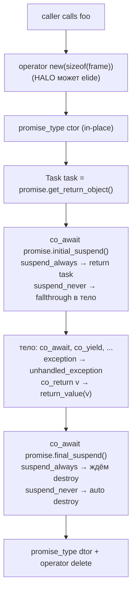
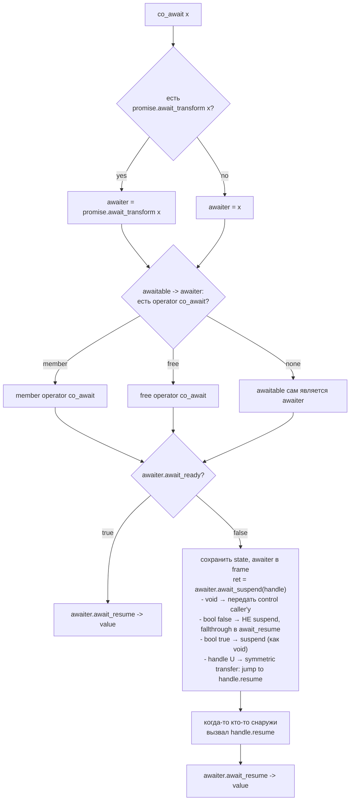
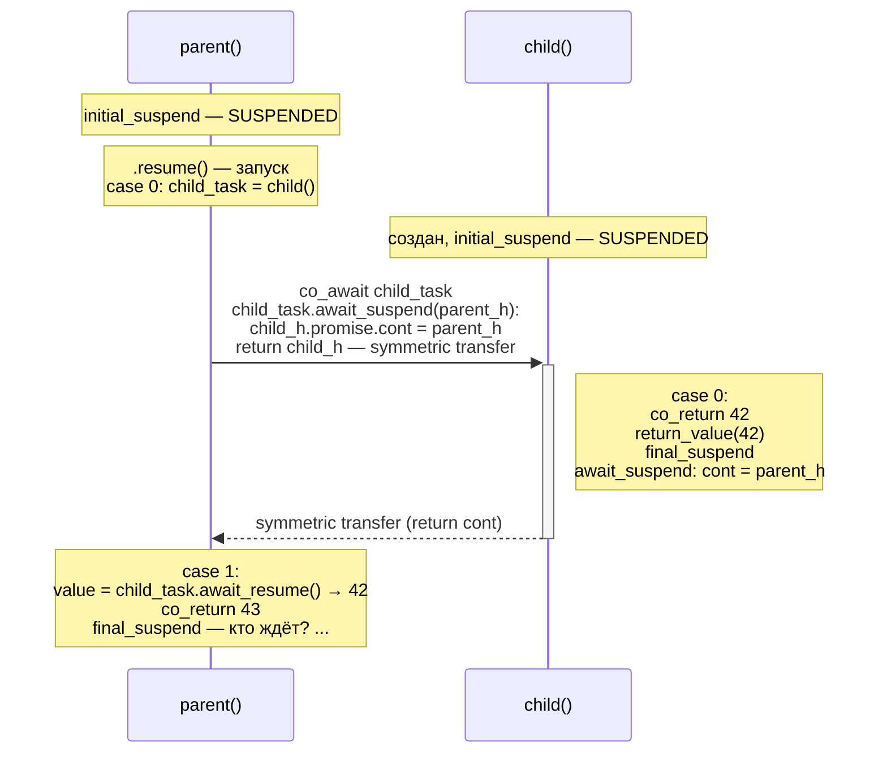
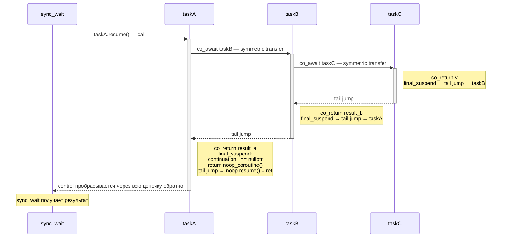
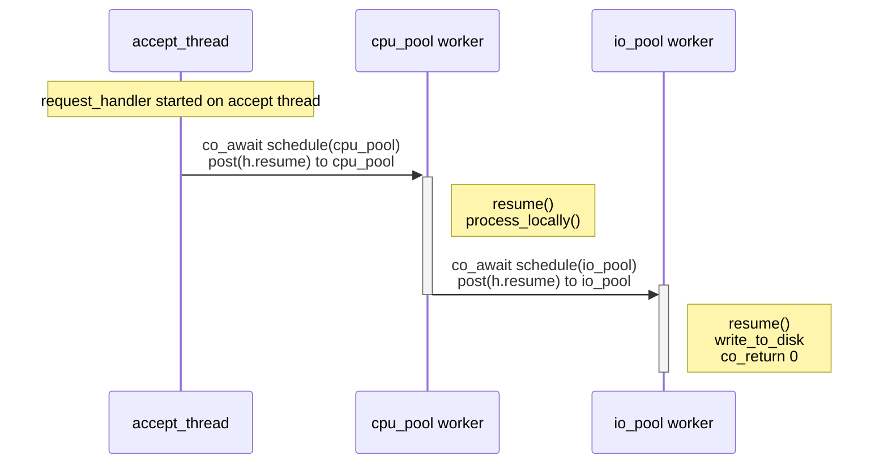
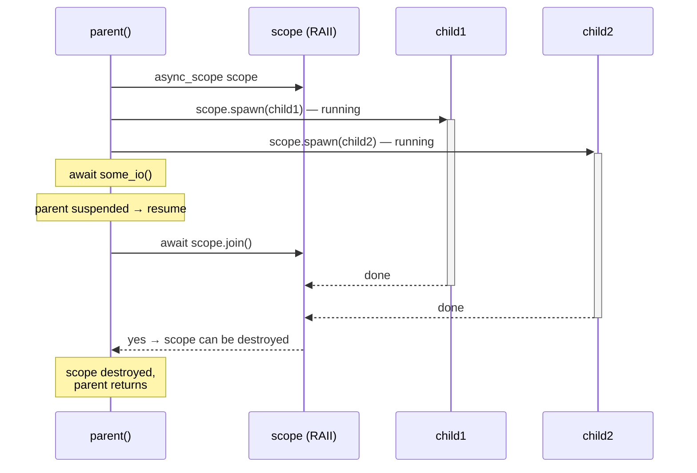
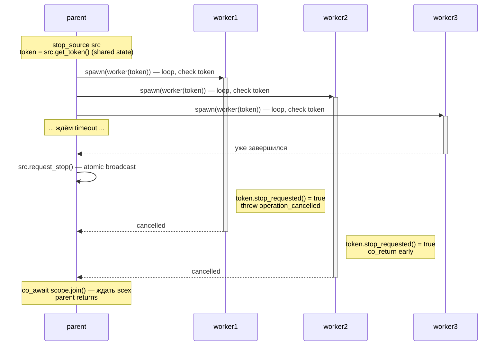

# C++20 stackless coroutines: state machine на месте функции

C++20 принёс в язык **stackless coroutines** — функции, которые умеют приостанавливаться и возобновляться без своего
стека. Все локальные переменные, которые должны пережить точку приостановки, компилятор укладывает в **coroutine frame**
на куче, а само тело функции превращается в state machine: между точками `co_await`/`co_yield` стоит `switch` по полю
состояния, и `resume` — это обычный function call с переходом в нужный `case`.

Альтернатива — **stackful** coroutines (fibers, ucontext): свой стек 4–64 KB на каждую, переключение через смену `rsp`
ассемблерной вставкой (см. [Userspace context switching](userspace_context_switching.md)). Stackful универсальнее —
`yield` можно из любой глубины вложенности обычных функций, — но дороже по памяти и переключение через `swap` стоит
~20 нс против ~5 нс у stackless.

```
┌────────────────────────────┬──────────────────┬─────────────────────────────┐
│ Механизм                   │ Память на coro   │ Switch cost                 │
├────────────────────────────┼──────────────────┼─────────────────────────────┤
│ stackful (Boost.Context)   │ ≥ 4 KB на стек   │ ~20 нс (asm jump_fcontext)  │
│ C++20 stackless coroutine  │ sizeof(frame)    │ ~5 нс (обычный call)        │
└────────────────────────────┴──────────────────┴─────────────────────────────┘
```

Цена дешевизны — **виральность** (function colouring): чтобы `co_await` в функции `foo` поднялся наверх, caller'у нужно
быть coroutine'ой тоже. Это известное ограничение Rust async, Python async, C# async/await и C++20 — все по тем же
причинам. Stackless дешевле, когда awaitable редко реально приостанавливается (cache hit, ready future) — потому что в
этом случае никакого переключения не происходит вовсе, просто вызов функции.

C++ выбрал stackless из принципа **zero-overhead**: вы не платите за то, чем не пользуетесь. Если все awaitable'ы готовы
сразу, тело coroutine'ы исполняется как обычная функция — без выделения стека, без переключения регистров.

## Одна трансформация, два разреза

Stackful и stackless — это **две реализации одной идеи**, и увидеть её полезно до любых деталей API. Идея повторяется
везде, где вычисление надо приостанавливать: in-order итератор по дереву, асинхронный I/O, сам файбер. Каждый раз
происходит одно и то же — **чистая программа (цикл или рекурсия) разрезается в автомат**, подчинённый какому-то внешнему
циклу (обходу дерева, event loop, планировщику). Состояния автомата — это позиции исполнения в точках приостановки
(фактически `instruction pointer`), а локальные переменные и аргументы выносятся в поля. Разрезать руками (как
in-order-итератор: путь = стек вызовов, метка «откуда пришли» = IP) — мучительно; и stackful, и stackless просто
**прячут эти разрезы**, но режут на разных слоях:

- **stackful (fibers)** — режет **рантайм**: `jump_fcontext` замораживает **весь стек** целиком. Бесшовно (`yield` из
  любой глубины вложенных обычных функций), но ценой стека на каждую coroutine'у и ~20 нс на switch.
- **stackless** — режет **компилятор**: видит функцию, строит из неё конечный автомат, выносит «живущие через
  приостановку» локальные в поля фрейма. Ему нужна лишь **подсказка, где резать** — и эту подсказку даёт маркер
  `co_await`. Остаются «швы» в коде, зато достижим zero-overhead.

Важнейшее следствие этого взгляда: **семантика `co_await` — не про ожидание**. Это просто маркер точки, где coroutine'у
можно остановить и потом возобновить; что за ним стоит (кооперативная многозадачность, generator, асинхронный I/O),
решаете вы в awaiter'е. Сами названия — тоже **следствие**, а не лучший ракурс: замороженное состояние stackful-coroutine
— целый стек вызовов, а stackless — один-единственный кадр-автомат, потому она и «без стека».

## Три ключевых слова

`co_await`, `co_yield`, `co_return` — компилятор смотрит на тело функции; стоит хоть одному из них появиться внутри —
функция перестаёт быть обычной и становится coroutine'ой. Возвращаемый тип должен следовать **coroutine contract**:
у него должен быть `promise_type` с набором обязательных методов.

| Ключевое слово      | Что делает                                                                       |
|---------------------|----------------------------------------------------------------------------------|
| `co_await expr`     | приостанавливает coroutine'у, ждёт результата awaitable, возвращает значение     |
| `co_yield value`    | приостанавливает, передаёт `value` наружу (для generators)                       |
| `co_return [value]` | завершает coroutine'у, опционально с возвращаемым значением                      |

`return` в coroutine'е запрещён — только `co_return`. Это синтаксический маркер для compiler frontend'а: «эта функция
точно state machine».

## Что компилятор делает с coroutine

Возьмём чуть более реалистичный пример с двумя последовательными `co_await` и проследим, во что он трансформируется.

```cpp
Task<int> fetch_and_log(int id) {
    int data = co_await async_read(id);     // (A) suspend point #1
    log("got value");                       // обычный код между await'ами
    int doubled = data * 2;
    co_await async_write(doubled);          // (B) suspend point #2
    co_return doubled;
}
```

Компилятор разбирает функцию на три части:

- **Coroutine frame** — struct в куче, который переживает все suspend'ы. Содержит promise, параметры, все локальные переменные что нужны после ближайшего suspend, текущее состояние FSM, и storage для каждого awaiter'а.
- **Ramp** — синхронная часть, что выполняется при прямом вызове `fetch_and_log(42)`. Аллоцирует frame, инициализирует promise, обрабатывает initial_suspend и возвращает Task caller'у.
- **Resume function** — собственно FSM. Вызывается изначально из ramp'а (если initial_suspend не приостановил), и затем каждый раз когда `handle.resume()` дергается извне.

### Coroutine frame

```cpp
struct fetch_and_log_frame {
    promise_type promise;          // обязательно: возврат Task'а, обработка исключений

    int id;                        // параметр, скопирован при ramp'е

    // локальные переменные, ЖИВУЩИЕ через co_await:
    int data;                      // нужно после (A) → попадает в frame
    int doubled;                   // нужно после (B) → попадает в frame

    // временные awaiter'ы (один за раз, могут лежать в union'е):
    union {
        async_read_awaiter  read_aw;
        async_write_awaiter write_aw;
    };

    fsm_state state;               // текущая точка FSM (см. ниже)
    void (*resume_fn)(void*);      // указатель на resume (для handle.resume())
    void (*destroy_fn)(void*);     // указатель на destroy (для handle.destroy())
};
```

Заметная деталь: переменные, которые компилятор может *не* протащить через suspend (например, чистый scratch внутри блока без `co_await`), хранятся в обычном стеке resume-функции, а не в frame. Это уменьшает размер frame'а.

### Состояния FSM в человекочитаемом виде

Компилятор номерует точки, но семантически они называются так:

```
  enum class fsm_state {
      INITIAL_SUSPEND,         // только что создан, ждёт promise.initial_suspend()
      BEFORE_READ,             // тело до первого co_await; вычисляем await_ready()
      SUSPENDED_ON_READ,       // ушли в caller из (A), ждём resume()
      AFTER_READ,              // вернулись, забираем результат через await_resume()
      BEFORE_WRITE,            // тело между (A) и (B): log, doubled = data*2
      SUSPENDED_ON_WRITE,      // ушли в caller из (B), ждём resume()
      AFTER_WRITE,             // вернулись, забираем результат write_aw
      FINAL_SUSPEND,           // co_return сделан, ждём promise.final_suspend()
      DONE                     // готова к destroy()
  };
```

Каждой паре `co_await x` соответствуют три состояния: `BEFORE_x` (вычисляется `await_ready`), `SUSPENDED_ON_x` (вернули control в caller, ждём `resume()`), `AFTER_x` (получили результат через `await_resume`).

### Ramp — синхронная часть вызова

```cpp
Task<int> fetch_and_log(int id) {
    // ── allocation ──
    auto* frame = (fetch_and_log_frame*) operator new(sizeof(fetch_and_log_frame));
    frame->resume_fn  = &fetch_and_log_resume;
    frame->destroy_fn = &fetch_and_log_destroy;
    frame->id         = id;                       // копируем параметры
    new (&frame->promise) promise_type{};         // construct promise

    // ── return object ──
    Task<int> ret = frame->promise.get_return_object();

    // ── initial_suspend ──
    frame->state = fsm_state::INITIAL_SUSPEND;
    auto init_aw = frame->promise.initial_suspend();
    if (!init_aw.await_ready()) {
        init_aw.await_suspend(coroutine_handle<promise_type>::from_promise(frame->promise));
        return ret;                            // приостановились перед телом — отдаём Task
    }
    init_aw.await_resume();

    // ── не приостановились — запускаем resume один раз ──
    fetch_and_log_resume(frame);
    return ret;
}
```

### Resume function — switch по состояниям

```cpp
void fetch_and_log_resume(void* opaque) {
    auto* frame = static_cast<fetch_and_log_frame*>(opaque);

    switch (frame->state) {

    case fsm_state::BEFORE_READ: {
        // эквивалент:  data = co_await async_read(id);
        new (&frame->read_aw) async_read_awaiter(frame->id);

        if (!frame->read_aw.await_ready()) {
            frame->state = fsm_state::SUSPENDED_ON_READ;
            frame->read_aw.await_suspend(
                coroutine_handle<promise_type>::from_promise(frame->promise));
            return;                            // ↩ return to caller of resume()
        }
        [[fallthrough]];                       // ready сразу — продолжаем без suspend
    }

    case fsm_state::AFTER_READ: {
        frame->data = frame->read_aw.await_resume();
        frame->read_aw.~async_read_awaiter();

        // прямой код между двумя co_await — выполняется здесь, не пересекая suspend
        log("got value");
        frame->doubled = frame->data * 2;
        [[fallthrough]];
    }

    case fsm_state::BEFORE_WRITE: {
        // эквивалент:  co_await async_write(doubled);
        new (&frame->write_aw) async_write_awaiter(frame->doubled);

        if (!frame->write_aw.await_ready()) {
            frame->state = fsm_state::SUSPENDED_ON_WRITE;
            frame->write_aw.await_suspend(
                coroutine_handle<promise_type>::from_promise(frame->promise));
            return;
        }
        [[fallthrough]];
    }

    case fsm_state::AFTER_WRITE: {
        frame->write_aw.await_resume();
        frame->write_aw.~async_write_awaiter();

        // эквивалент:  co_return doubled;
        frame->promise.return_value(frame->doubled);
        [[fallthrough]];
    }

    case fsm_state::FINAL_SUSPEND: {
        auto final_aw = frame->promise.final_suspend();
        if (!final_aw.await_ready()) {
            frame->state = fsm_state::FINAL_SUSPEND;
            final_aw.await_suspend(
                coroutine_handle<promise_type>::from_promise(frame->promise));
            return;                            // обычно final_suspend = suspend_always
        }
        frame->state = fsm_state::DONE;
        return;
    }

    default:
        __builtin_unreachable();
    }
}
```

После suspend компилятор НЕ возвращается «из середины switch» — он выходит обычным `return`, контроль попадает в caller функции `resume()`. Когда awaiter позже зовёт `handle.resume()`, происходит **повторный вход** в `fetch_and_log_resume(frame)`, и `switch` прыгает на нужное состояние.

### Жизненный цикл по состояниям

```mermaid
stateDiagram-v2
    [*] --> INITIAL_SUSPEND: Task task = fetch_and_log(42)
    INITIAL_SUSPEND --> BEFORE_READ: ramp вызвал resume_fn(frame)<br/>(init_aw = suspend_never)
    BEFORE_READ --> SUSPENDED_ON_READ: await_ready() = false
    SUSPENDED_ON_READ --> AFTER_READ: I/O completes,<br/>runtime вызывает handle.resume()
    AFTER_READ --> BEFORE_WRITE: log + умножение
    BEFORE_WRITE --> SUSPENDED_ON_WRITE: await_ready() = false
    SUSPENDED_ON_WRITE --> AFTER_WRITE: I/O completes again,<br/>runtime вызывает handle.resume()
    AFTER_WRITE --> FINAL_SUSPEND: co_return doubled
    FINAL_SUSPEND --> DONE: обычно suspend_always
    DONE --> [*]: Task&#58;&#58;~Task() → handle.destroy(),<br/>frame освобождён
```



### Исключения

Тело coroutine компилятор оборачивает в неявный `try/catch`:

```cpp
    try {
        // ... весь switch выше ...
    } catch (...) {
        frame->promise.unhandled_exception();      // сохраняет current_exception()
        frame->state = fsm_state::FINAL_SUSPEND;   // перепрыгиваем к final_suspend
        goto final_suspend_label;
    }
```

Поэтому coroutine, выкинувшая исключение, всё равно завершается через `final_suspend` (а не «утекает» как обычная функция). Исключение хранится в promise и перебрасывается из `await_resume` Task'а, когда кто-то await'ит результат.

### Что в реальной IR

То что выше — псевдо-C++ форма, удобная для чтения. Реально clang/gcc генерируют это уже на уровне LLVM/GIMPLE IR через builtins: `__builtin_coro_size`, `__builtin_coro_begin`, `__builtin_coro_suspend`, `__builtin_coro_end`. LLVM Coroutine Passes (`coro-early`, `coro-split`, `coro-cleanup`) разделяют исходную функцию на ramp и resume, выделяют frame через `__builtin_coro_alloc` и применяют HALO-оптимизацию когда могут доказать что frame не переживёт обёртку. Дизассемблировать готовую coroutine можно через `objdump -d`, но удобнее смотреть промежуточный IR через `clang -fcoroutines-ts -S -emit-llvm`.

## promise_type — interface coroutine'ы

`promise_type` — это struct, который compiler ищет внутри возвращаемого типа coroutine'ы (через `std::coroutine_traits`).
Он координирует жизненный цикл: что вернуть caller'у, suspend ли начинать, что делать с исключением, куда положить
результат `co_return`. Coroutine'у можно представить как «оболочку из ключевых слов вокруг promise_type».

| Метод (обязательный)                | Когда вызывается / для чего                                     |
|-------------------------------------|-----------------------------------------------------------------|
| `get_return_object()`               | в ramp'е; результат становится возвращаемым значением функции   |
| `initial_suspend()`                 | сразу после ramp'а; awaitable — suspend сразу или начать тело?  |
| `final_suspend() noexcept`          | после `co_return`; suspend перед destroy или сразу освободить?  |
| `return_void()` / `return_value(T)` | при `co_return [v]`; складывает результат в promise             |
| `unhandled_exception()`             | если из тела вырвалось исключение; обычно `current_exception()` |

Опциональные:

| Метод                                       | Для чего                                                        |
|---------------------------------------------|-----------------------------------------------------------------|
| `await_transform(T)`                        | трансформирует аргумент `co_await` (запретить голые await, ...) |
| `yield_value(T)`                            | для `co_yield`; принимает значение, возвращает awaitable        |
| `operator new` / `operator delete`          | кастомный allocator для frame                                   |
| `get_return_object_on_allocation_failure()` | если frame allocation вернул `nullptr`                          |

Минимальный `Task<T>` promise:

```cpp
#include <coroutine>
#include <exception>
#include <utility>

template <typename T>
struct Task {
    struct promise_type {
        T value_{};
        std::exception_ptr eptr_;

        Task get_return_object() {
            return Task{std::coroutine_handle<promise_type>::from_promise(*this)};
        }
        std::suspend_always initial_suspend() noexcept { return {}; }
        std::suspend_always final_suspend()   noexcept { return {}; }
        void return_value(T v) { value_ = std::move(v); }
        void unhandled_exception() { eptr_ = std::current_exception(); }
    };

    std::coroutine_handle<promise_type> handle_;

    explicit Task(std::coroutine_handle<promise_type> h) : handle_(h) {}
    ~Task() { if (handle_) handle_.destroy(); }
    Task(Task&& other) noexcept : handle_(std::exchange(other.handle_, {})) {}

    T get() {
        handle_.resume();                              // выполнит тело до конца
        if (handle_.promise().eptr_)
            std::rethrow_exception(handle_.promise().eptr_);
        return std::move(handle_.promise().value_);
    }
};
```



`final_suspend` обязан быть `noexcept` — потому что эту точку вызывает compiler-сгенерированный код, который не умеет
ловить исключения после `co_return`. Если `final_suspend` бросит, программа упадёт на `std::terminate`.

## Awaitable / awaiter contract

`co_await expr` — это синтаксический сахар над тремя вызовами на **awaiter**'е:

1. `await_ready()` → `bool` — можно ли пропустить suspend (значение уже готово)?
2. `await_suspend(handle)` — выполняется при suspend'е; получает handle на текущую coroutine'у, чтобы потом её
   возобновить.
3. `await_resume()` → `T` — возвращает результат, который станет значением выражения `co_await`.

**Awaitable** ≠ awaiter. Awaitable — это «что-то, что можно await'ить»; компилятор сам ищет, как из него получить
awaiter:

1. если у promise есть `await_transform(T)` — сначала вызывается он;
2. потом ищется `operator co_await` (member или free);
3. если ничего не нашлось — компилятор использует сам объект как awaiter.



Три варианта возврата `await_suspend` критичны:

- **`void`** — coroutine приостановлена, control возвращается в caller'а `handle.resume()`.
- **`bool`** — `false` отменяет suspend (как если `await_ready()` вернул `true`); `true` — равносильно `void`.
- **`std::coroutine_handle<>`** — **symmetric transfer** (см. ниже): control сразу переходит к указанной coroutine'е без
  раскрутки стека.

## await_transform: type-safe executor coupling

`promise.await_transform(expr)` — последний шанс promise'а вмешаться в `co_await`. Если метод есть, компилятор вызывает
`promise.await_transform(expr)` и берёт результат как awaitable (дальше — `operator co_await` или сам объект). Если нет —
`expr` идёт напрямую. Это даёт promise'у полный контроль над тем, что можно await'ить в его coroutine'е, и как именно.

Типичный сценарий — **type-safe executor coupling**: запретить случайный `co_await` foreign Task, который не знает про
наш executor. Без `await_transform` любой Task<T> можно `co_await`'ить из любой coroutine'ы, и continuation окажется в
произвольном thread'е, где await_suspend планировал; control перетекает между executor'ами незаметно.

```cpp
// Без защиты — control перетекает между executor'ами невидимо
ForeignTask<int> ft = some_lib_function();
co_await ft;             // continuation теперь на foreign executor'е,
                         // а мы в IO loop'е!
```

Решение — `await_transform`: разрешить только «свой» тип awaitable'а, всё остальное `= delete`.

```cpp
struct MyPromise {
    Executor *exec_;                                  // наш executor

    // запретить co_await на чужих Task
    template <typename T>
    auto await_transform(Task<T>&&) = delete;

    // разрешить наш ExecutorTask, прокинуть executor в awaiter
    template <typename T>
    auto await_transform(ExecutorTask<T>&& task) noexcept {
        return std::move(task).bind(exec_);           // awaiter знает наш executor
    }

    // пропускать примитивные awaitable'ы (suspend_never и пр.)
    template <typename Awaitable_>
        requires Awaitable<Awaitable_> && !std::is_same_v<Awaitable_, Task<...>>
    auto await_transform(Awaitable_&& awaitable) noexcept {
        return std::forward<Awaitable_>(awaitable);
    }
    // ...
};
```

Любая попытка `co_await foreign_task` в coroutine'е с `MyPromise` падает на этапе компиляции — `await_transform` для
этого типа удалён. Компилятор не находит fallback, потому что `await_transform`, будучи найденным, отменяет общий путь.

### Полная реализация executor-aware Task

Принцип: promise хранит указатель на executor; при `co_await childTask` parent передаёт свой executor в awaiter; awaiter
resume'ит continuation через executor (не напрямую). Это гарантирует, что после await parent оказывается на том же
executor'е, на котором он был до.

```cpp
#include <coroutine>
#include <exception>
#include <functional>
#include <utility>

class Executor {
public:
    virtual void post(std::function<void()>) = 0;
    virtual ~Executor() = default;
};

template <typename T>
struct ExecutorTask {
    struct promise_type;

    struct final_awaiter {
        bool await_ready() noexcept { return false; }
        std::coroutine_handle<> await_suspend(
            std::coroutine_handle<promise_type> h) noexcept {
            // вернуть continuation для symmetric transfer;
            // resume пойдёт через executor, который continuation захватил
            if (auto cont = h.promise().continuation_)
                return cont;
            return std::noop_coroutine();
        }
        void await_resume() noexcept {}
    };

    struct promise_type {
        T value_;
        std::exception_ptr eptr_;
        std::coroutine_handle<> continuation_;
        Executor *exec_ = nullptr;                    // на каком executor'е resume'ить

        ExecutorTask get_return_object() {
            return ExecutorTask{
                std::coroutine_handle<promise_type>::from_promise(*this)};
        }
        std::suspend_always initial_suspend() noexcept { return {}; }
        final_awaiter final_suspend() noexcept { return {}; }
        void return_value(T v) { value_ = std::move(v); }
        void unhandled_exception() { eptr_ = std::current_exception(); }

        // запретить голый co_await на foreign awaitable
        template <typename A>
        auto await_transform(A&&) = delete;

        // разрешить наши ExecutorTask, прокинуть executor
        template <typename U>
        auto await_transform(ExecutorTask<U>&& child_task) noexcept {
            child_task.handle_.promise().exec_ = exec_;   // передать executor child'у
            return std::move(child_task).awaiter();
        }
    };

    std::coroutine_handle<promise_type> handle_;
    explicit ExecutorTask(std::coroutine_handle<promise_type> handle) : handle_(handle) {}
    ExecutorTask(ExecutorTask&& other) noexcept : handle_(std::exchange(other.handle_, {})) {}
    ~ExecutorTask() { if (handle_) handle_.destroy(); }

    struct awaiter {
        std::coroutine_handle<promise_type> child_;
        bool await_ready() noexcept { return false; }
        std::coroutine_handle<> await_suspend(
            std::coroutine_handle<> caller) noexcept {
            child_.promise().continuation_ = caller;
            return child_;                            // symmetric transfer в child
        }
        T await_resume() {
            if (child_.promise().eptr_)
                std::rethrow_exception(child_.promise().eptr_);
            return std::move(child_.promise().value_);
        }
    };

    awaiter operator co_await() && { return awaiter{handle_}; }

    // entry-point: bind executor и запустить
    void start_on(Executor *e) {
        handle_.promise().exec_ = e;
        e->post([h = handle_]{ h.resume(); });
    }
};
```



```mermaid
sequenceDiagram
    participant C as cpu_pool
    participant P as parent
    participant Ch as child
    participant I as io_pool
    Note over P: parent.start_on(cpu_pool)
    C->>P: post([h]{ h.resume()&#59; }) — parent runs on cpu_pool
    P->>+Ch: co_await child<br/>(await_transform проверяет тип,<br/>передаёт exec_ = cpu_pool child'у)<br/>symmetric transfer
    Note right of Ch: child runs на том же executor'е<br/>co_return v
    Ch-->>-P: final_suspend → symmetric transfer back
    Note over P: parent resumes, всё ещё на cpu_pool
    Note over P,I: попытка co_await foreign Task → compile error (= delete)
```

Любая попытка случайно вытащить parent на чужой executor блокируется на этапе компиляции. Code review больше не нуждается в проверке «а этот await не перетащит нас в IO thread?» — это инвариант, гарантированный типом.

## suspend_always и suspend_never

Стандартная библиотека предоставляет два готовых awaitable'а — это всё, что нужно для `initial_suspend` /
`final_suspend` / `yield_value` в большинстве случаев.

```cpp
struct suspend_always {
    bool await_ready() const noexcept { return false; }     // всегда suspend
    void await_suspend(std::coroutine_handle<>) const noexcept {}
    void await_resume() const noexcept {}
};

struct suspend_never {
    bool await_ready() const noexcept { return true; }      // никогда не suspend
    void await_suspend(std::coroutine_handle<>) const noexcept {}
    void await_resume() const noexcept {}
};
```

Решение `suspend_always` vs `suspend_never` для `initial_suspend` определяет, **lazy** или **eager** ваша coroutine'а
(см. ниже). Для `final_suspend` — кто отвечает за destroy frame'а: `suspend_never` означает auto-destroy сразу после
`co_return`; `suspend_always` оставляет frame живым, чтобы кто-то снаружи (Task'а, scheduler) мог забрать результат.

## coroutine_handle

`std::coroutine_handle<Promise>` — type-erased ручка на frame. Минимальный API:

| Метод                        | Что делает                                                 |
|------------------------------|------------------------------------------------------------|
| `resume()` / `operator()`    | продолжает выполнение coroutine'ы со следующего состояния  |
| `destroy()`                  | освобождает frame; не зовите на работающую coroutine'у     |
| `done()`                     | true, если coroutine на `final_suspend` (готова к destroy) |
| `promise()`                  | ссылка на promise внутри frame                             |
| `address()` / `from_address` | конвертация в/из `void*` — для type-erasure                |
| `from_promise(p)`            | получить handle из promise (внутри `get_return_object`)    |

`coroutine_handle<>` — это `coroutine_handle<void>`, type-erased версия без доступа к `promise()`. Полезна, когда
scheduler хранит heterogeneous coroutine'ы в одной очереди.

Размер handle — один pointer (на frame). Дёшево копировать, дёшево хранить.

## suspend_always vs suspend_never в initial_suspend

Это фундаментальное design-решение для любого custom Task-типа.

```
                  Lazy vs Eager: initial_suspend
                  ────────────────────────────────────────────────

  Lazy (suspend_always):                  Eager (suspend_never):

   foo() {                                 foo() {
     frame = new ...;                        frame = new ...;
     Task task = get_return_object();        Task task = get_return_object();
     SUSPEND здесь.                          fallthrough в тело.
     return task;                               ... тело работает до первого
   }                                            реального await ...
                                             return task;
   тело НЕ запускается, пока кто-то         тело уже частично выполнено,
   не сделает handle.resume()               к моменту, когда caller получил task
```

**Lazy** (Lazy<T>, cppcoro::task) — тело не работает до первого `co_await`. Удобно для composability: можно соединять
цепочки coroutine'ов, не запуская их преждевременно. Большинство «правильных» библиотек делают именно так.

**Eager** (`std::async`-стиль, asio::awaitable) — тело начинает работать сразу. Проще понять (поведение ближе к
синхронному вызову), но хуже композируется: если вы вернёте eager Task из функции, которая его не await'ит, тело уже
успеет что-то сделать.

В большинстве production-кода (cppcoro, folly::coro, stdexec) выбран lazy.

## Generator: простейший паттерн

Самый понятный use case для coroutine'ы — **lazy infinite sequence**. Тело coroutine'ы исполняется по чуть-чуть, на
каждом `co_yield` приостанавливается и отдаёт значение наружу. Никаких потоков, никакого I/O — чисто синтаксическая
вкусность.

```cpp
#include <coroutine>
#include <utility>

template <typename T>
struct Generator {
    struct promise_type {
        T value_;

        Generator get_return_object() {
            return Generator{std::coroutine_handle<promise_type>::from_promise(*this)};
        }
        std::suspend_always initial_suspend() noexcept { return {}; }
        std::suspend_always final_suspend()   noexcept { return {}; }
        std::suspend_always yield_value(T v) noexcept {
            value_ = std::move(v);
            return {};
        }
        void return_void() noexcept {}
        void unhandled_exception() { std::terminate(); }
    };

    std::coroutine_handle<promise_type> handle_;

    explicit Generator(std::coroutine_handle<promise_type> h) : handle_(h) {}
    ~Generator() { if (handle_) handle_.destroy(); }
    Generator(Generator&& other) noexcept : handle_(std::exchange(other.handle_, {})) {}

    bool next()    { handle_.resume(); return !handle_.done(); }
    T    value()   { return handle_.promise().value_; }
};

Generator<int> fibonacci() {
    int a = 0, b = 1;
    while (true) {
        co_yield a;
        int next = a + b;
        a = b;
        b = next;
    }
}

int main() {
    auto fib = fibonacci();
    for (int i = 0; i < 10 && fib.next(); ++i)
        std::cout << fib.value() << ' ';      // 0 1 1 2 3 5 8 13 21 34
}
```



C++23 добавил `std::generator<T>` в стандартную библиотеку — ровно такой же паттерн, но реализованный «правильно»: со

```mermaid
sequenceDiagram
    participant M as main
    participant F as fibonacci() coroutine
    Note over M: auto fib = fibonacci()
    Note right of F: initial_suspend — SUSPENDED
    M->>+F: fib.next() / h.resume()
    Note right of F: case 0: a=0, b=1<br/>co_yield 0<br/>yield_value(0): value_ = 0<br/>return suspend_always
    F-->>-M: control returns — SUSPENDED at yield
    Note over M: fib.value() → 0
    M->>+F: fib.next() / h.resume()
    Note right of F: next = 1&#59; a = 1&#59; b = 1<br/>co_yield 1
    F-->>-M: control returns — SUSPENDED at yield
    Note over M: fib.value() → 1
    Note over M,F: ... и так далее ...
```

`std::ranges::view`, поддержкой `co_yield range`, allocator support. Если у вас C++23 и нужен generator — берите его.

## Task<T>: awaitable result

Generator отдаёт значения наружу. Task — это coroutine, которая что-то вычисляет и возвращает результат через
`co_return`, и сама является awaitable: одна coroutine может `co_await` другую.

```cpp
#include <coroutine>
#include <exception>
#include <utility>

template <typename T>
struct Task {
    struct promise_type {
        T value_;
        std::exception_ptr eptr_;
        std::coroutine_handle<> continuation_;       // кто нас ждёт

        Task get_return_object() {
            return Task{std::coroutine_handle<promise_type>::from_promise(*this)};
        }
        std::suspend_always initial_suspend() noexcept { return {}; }

        struct final_awaiter {
            bool await_ready() noexcept { return false; }
            std::coroutine_handle<> await_suspend(
                std::coroutine_handle<promise_type> h) noexcept {
                // symmetric transfer: jump to the continuation if any
                if (auto cont = h.promise().continuation_)
                    return cont;
                return std::noop_coroutine();
            }
            void await_resume() noexcept {}
        };
        final_awaiter final_suspend() noexcept { return {}; }

        void return_value(T v) { value_ = std::move(v); }
        void unhandled_exception() { eptr_ = std::current_exception(); }
    };

    std::coroutine_handle<promise_type> handle_;

    explicit Task(std::coroutine_handle<promise_type> h) : handle_(h) {}
    ~Task() { if (handle_) handle_.destroy(); }
    Task(Task&& other) noexcept : handle_(std::exchange(other.handle_, {})) {}

    // делаем Task awaitable: co_await task
    bool await_ready() noexcept { return false; }

    std::coroutine_handle<> await_suspend(
        std::coroutine_handle<> caller) noexcept {
        handle_.promise().continuation_ = caller;       // запомнить, кто нас ждёт
        return handle_;                                  // symmetric transfer: запустить нас
    }

    T await_resume() {
        if (handle_.promise().eptr_)
            std::rethrow_exception(handle_.promise().eptr_);
        return std::move(handle_.promise().value_);
    }
};
```

Использование:

```cpp
Task<int> child() {
    co_return 42;
}

Task<int> parent() {
    int value = co_await child();       // запускает child, ждёт результат
    co_return value + 1;
}
```



Здесь два места `symmetric transfer` (см. следующий раздел): `parent` запускает `child` без рекурсивного вызова, и
`child.final_suspend` возвращает control в `parent` тем же способом. Без symmetric transfer цепочка `await`'ов росла бы
по обычному C++ стеку.

!!! example "Рабочий пример"
    Полная компилируемая реализация `Generator<T>` (через `co_yield`) и `Task<T>` (awaitable result с `co_await`/`co_return`): `examples/q16_coroutines/generator_task.cpp` — собрать и запустить: `cd examples && make q16 && ./bin/q16_coroutines`.

## Symmetric transfer (P0913)

Это критическая deep-engineering-фича C++20 coroutine'ов. Без неё реализация Task'и была бы непригодной для production:
любая длинная цепочка await'ов переполнила бы стек.

**Проблема naive resume**:

```cpp
// Внутри final_awaiter::await_suspend (naive):
void await_suspend(std::coroutine_handle<promise_type> h) {
    if (auto cont = h.promise().continuation_)
        cont.resume();                          // ← обычный вызов
    // возврат сюда после полного выполнения continuation
}
```

`cont.resume()` — это обычный function call. Внутри `continuation` может оказаться ещё один `await`, который сделает
`cont2.resume()` и так далее. Стек растёт на каждом await'е:

```
                  Naive resume: stack growth
                  ────────────────────────────────────────────────

   ┌────────────────────────────────────────┐  ← high addr
   │  parent.await_resume()                 │
   ├────────────────────────────────────────┤
   │  child.final_suspend::await_suspend()  │
   │    calls parent.resume()               │
   ├────────────────────────────────────────┤
   │  parent.resume()                       │
   │    co_await grandchild                 │
   │      calls grandchild.resume()         │
   ├────────────────────────────────────────┤
   │  grandchild.resume()                   │
   │    ...                                 │
   ├────────────────────────────────────────┤
   │  grandchild.final_suspend::            │
   │    calls great_grandchild.resume()     │
   ├────────────────────────────────────────┤
   │  ...                                   │
   └────────────────────────────────────────┘  ← stack overflow
```

Каждое звено цепочки добавляет фрейм. Длинная chain `co_await`'ов в pipeline (`a → b → c → d → e → ...`) убьёт
любое типичное окно стека за тысячу шагов.

**Решение** — компилятор гарантирует **tail-call** оптимизацию для возврата `coroutine_handle` из `await_suspend`:

```cpp
std::coroutine_handle<> await_suspend(
    std::coroutine_handle<promise_type> h) noexcept {
    if (auto cont = h.promise().continuation_)
        return cont;                            // ← compiler делает tail jump
    return std::noop_coroutine();
}
```

Компилятор обязан **не** делать обычный call: после `return cont` он переходит в `cont.resume()` через
`jmp`, не `call`. Stack frame текущей coroutine'ы переиспользуется.

```
                  Symmetric transfer: stack стабилен
                  ────────────────────────────────────────────────

   ┌────────────────────────────────────────┐
   │  active resume frame (один на всех)    │
   │  ────────────────────────────────────  │
   │  case X:                               │
   │    ...                                 │
   │  ◀─── jmp на handle.resume() ───       │  ← tail-call
   │  ▲                                     │
   │  └─ frame заменяется, не растёт        │
   └────────────────────────────────────────┘
```

`std::noop_coroutine()` — sentinel-handle, чей `resume()` ничего не делает; используется, чтобы избежать `nullptr`-
проверки на конце цепочки.

### noop_coroutine как terminator цепочки

Контракт `await_suspend`, возвращающего handle, — компилятор обязан выполнить tail jump на `handle.resume()`. Что делать
на конце цепочки, когда continuation'а нет? Возврат `nullptr` или невалидного handle = UB (компилятор сделает
`handle.resume()` на nullptr). Возврат `coroutine_handle<>{}` тоже не годится — это default-constructed handle, его
`resume()` тоже UB.

Стандарт даёт `std::noop_coroutine()` — singleton-handle на «coroutine», чья resume — `ret` (на ассемблере), а `done()`
всегда `false`. Это легальный target для tail jump'а, который просто возвращает control в самый верхний `resume()` или в
`sync_wait` — туда, откуда цепочка стартовала.

```cpp
struct final_awaiter {
    bool await_ready() noexcept { return false; }
    std::coroutine_handle<> await_suspend(
        std::coroutine_handle<promise_type> h) noexcept {
        if (auto cont = h.promise().continuation_)
            return cont;                              // tail jump в parent
        return std::noop_coroutine();                 // tail jump в "ничего"
                                                      // control возвращается в caller of resume()
    }
    void await_resume() noexcept {}
};
```



Без `noop_coroutine` final_suspend на «самом верхнем» Task'е был бы вынужден сделать обычный `cont.resume()` или
проверять nullptr с разным управляющим потоком — а это рушит compiler invariant о том, что путь через `await_suspend`
всегда tail-call. На N вложенных await'ах без symmetric transfer мы получили бы stack overflow при N ≈ 2000–10 000 (
зависит от размера frame'а и размера stack'а).

С symmetric transfer + `noop_coroutine` глубина цепочки **ограничена только heap'ом** (где живут frame'ы) — стек
переиспользуется. Production-серверы делают цепочки длиной в миллионы await'ов на одной chain'е (например, recursive
parsing async grammar) без проблем со стеком.

Без symmetric transfer C++20 coroutines были бы demo-фичей. Все production-библиотеки (cppcoro, folly::coro, asio
awaitable) построены вокруг него.

## Executor integration

Сами по себе coroutines не делают I/O и не общаются с потоками. Чтобы coroutine приостановилась и через какое-то время
возобновилась — нужен **executor**: thread pool, io_uring loop, GUI message queue.

Контракт прост: awaitable хранит указатель на executor и в `await_suspend` ставит continuation в его очередь.

```cpp
struct ScheduleAwaiter {
    ThreadPool* pool;
    bool await_ready() noexcept { return false; }
    void await_suspend(std::coroutine_handle<> h) {
        pool->post([h]{ h.resume(); });          // resume на каком-то worker'е
    }
    void await_resume() noexcept {}
};

inline ScheduleAwaiter schedule(ThreadPool& p) { return {&p}; }

Task<int> request_handler() {
    co_await schedule(cpu_pool);                  // переехали на CPU pool
    auto data = process_locally();
    co_await schedule(io_pool);                   // переехали на I/O pool
    co_await write_to_disk(data);
    co_return 0;
}
```



Это тот же паттерн, что у `future.then(executor)` (см. [Future/Promise](future_promise.md)), просто синтаксически
вывернутый наизнанку: вместо «передать continuation в `.then`» — «`await` точку, в которой произойдёт переключение». Связь
прямая: внутри coroutine'ы `co_await future` — это suspend + `future.then([h]{ h.resume(); })`.

Полноценные библиотеки (stdexec / P2300, asio, cppcoro::static_thread_pool) формализуют это в **schedulers** —
объекты, через которые получаются awaitable'ы.

## Structured concurrency

Базовый contract Task<T>'ы из предыдущих разделов — *unstructured*: можно создать Task, не await'ить его, отпустить —
ничего не произойдёт (lazy), либо тело начнёт работать в фоне (eager), а владелец не узнает, когда оно закончится.
Frame утечёт. Это та же проблема, что fire-and-forget `std::thread` без `join` — `std::terminate`.

```cpp
// unstructured: ничего не мешает потерять child
Task<int> parent() {
    Task<int> child = spawn_eager(...);            // child уже работает
    if (some_condition) {
        co_return 0;                                // child осиротел, frame утёк
    }
    co_return co_await child;
}
```

**Structured concurrency** — дисциплина, в которой:

1. **Lifetime ребёнка ≤ lifetime родителя.** Все child'ы либо завершаются, либо отменяются до того, как parent выходит
   из своей функции.
2. **Cancellation propagates.** Если parent отменяется (или его scope разрушается из-за исключения), это распространяется
   на всех его children.
3. **Errors propagate up.** Исключение из child'а ловится в scope, где он spawned, не теряется и не убивает программу
   через `std::terminate`.

Идея пришла из Python Trio (Nathaniel Smith, 2018) — "nursery" pattern — и стала стандартом для async-программирования.
В C++20 нет встроенной поддержки, но cppcoro, folly::coro, stdexec предоставляют helper'ы.

### async_scope как RAII container

Канонический примитив — `async_scope` (cppcoro, folly::coro, stdexec). Это RAII-объект, в который spawn'ятся child
task'и; при `co_await scope.join()` parent ждёт всех. Если scope разрушится до `co_await scope.join()` — `std::terminate`
(как `std::thread` без `join`).

```cpp
#include <cppcoro/async_scope.hpp>
#include <cppcoro/task.hpp>

cppcoro::task<void> parent() {
    cppcoro::async_scope scope;
    try {
        scope.spawn(child1());                       // запустить child1
        scope.spawn(child2());                       // запустить child2
        // ... parent делает свою работу ...
        co_await some_io();
    } catch (...) {
        co_await scope.join();                       // дождаться всех перед re-throw
        throw;
    }
    co_await scope.join();                            // обязательный await
}
```



Контракт жёсткий: пока scope существует, у всех child task'ов «работа за parent'ом». Когда `join()` возвращает control,
все child'ы либо завершены, либо отменены. Никакой работы в фоне после выхода из scope не остаётся.

### nursery pattern

Альтернативный, более явный API — `nursery` (по аналогии с Trio). Helper, который запускается scope-guard'ом:

```cpp
co_await nursery::run([](nursery& n) -> task<void> {
    n.spawn(worker_a());
    n.spawn(worker_b());
    co_await n.spawn_with_result(worker_c());        // dependency на result
});  // ← все child'ы здесь join'нуты, любая exception propagated
```

Тело lambda — coroutine, которая внутри spawn'ит. На выходе из lambda `nursery::run` неявно делает `join()` всех children
и rethrow'ит первое исключение (или агрегирует через `aggregate_exception`, в зависимости от библиотеки).

### Cancellation через stop_token

C++20 принёс `std::stop_token` / `std::stop_source` (изначально для `std::jthread`). Это cooperative cancellation:
parent имеет `stop_source`, child'ам передаётся `stop_token`, они периодически проверяют `token.stop_requested()` и
выходят досрочно.

```cpp
cppcoro::task<int> worker(std::stop_token token) {
    for (int i = 0; i < 1'000'000; ++i) {
        if (token.stop_requested())
            throw cppcoro::operation_cancelled{};     // cooperative exit
        co_await process_chunk(i);
    }
    co_return 42;
}

cppcoro::task<void> parent() {
    cppcoro::async_scope scope;
    std::stop_source src;
    scope.spawn(worker(src.get_token()));
    co_await some_timeout(std::chrono::seconds(5));
    src.request_stop();                               // cancel worker
    co_await scope.join();                            // ждать завершения cancellation
}
```



**Cooperative** — это важно. Cancellation не прерывает worker'а сразу: token проверяется только на yield-точках (на
`co_await`'е в библиотечном коде) или явно в worker'е. Если worker делает CPU-bound цикл без `co_await` и без проверки
token'а, cancellation не сработает до конца цикла. Это сознательный trade-off: `pthread_cancel`-style async cancellation
небезопасен (рвёт RAII), structured concurrency требует disciplined cancellation points.

### Сравнение с unstructured

```
┌──────────────────────────┬────────────────────────┬───────────────────────────┐
│ Аспект                   │ Unstructured           │ Structured                │
├──────────────────────────┼────────────────────────┼───────────────────────────┤
│ Lifetime отношения       │ implicit, ручные       │ scope-based, гарантирован │
│ Forgotten child          │ frame leak, no warning │ std::terminate (loud fail)│
│ Cancellation             │ ручной API на child    │ автоматическая через scope│
│ Error propagation        │ теряется или crash     │ rethrow на parent         │
│ Composability            │ ломается на await      │ полная, scope = function  │
│ Debug                    │ "откуда этот task?"    │ stack ~ async parent      │
└──────────────────────────┴────────────────────────┴───────────────────────────┘
```

`std::execution` (P2300, ожидаемый в C++26) формализует это: `sender` представляет работу, `scheduler` — где она
выполнится, а `let_value` / `when_all` / `stop_when` строят structured concurrency граф напрямую, без отдельного
`async_scope`. До C++26 — берите cppcoro или folly::coro.

## Memory management: кто владеет frame'ом

Frame аллоцируется в `operator new` (по умолчанию `::operator new`) при ramp'е. Освобождает его — `coroutine_handle::
destroy()` (явный destroy) или auto-destroy после `final_suspend()`, если `final_suspend` вернула `suspend_never`.

Контракт:

- **suspend_always в final_suspend** — frame живёт до явного `destroy()`. Owner (Task wrapper) обязан в деструкторе
  вызвать `h.destroy()`.
- **suspend_never в final_suspend** — frame уничтожается сразу. Если вы держите `coroutine_handle` после этого момента —
  он dangling.

После `co_return` и до `final_suspend.await_resume` (которая не существует — frame уже destroyed) frame считается
«готовым к destroy»; `handle.done()` возвращает `true`.

```
                  Frame ownership timeline
                  ────────────────────────────────────────────────

  caller calls foo():                  state:    handle.done():
   operator new(frame)                  alloc'd   false
   ramp                                 running   false
   initial_suspend (suspend_always)     suspended false
   resume(): execute body               running   false
   co_return                            running   false
   final_suspend awaiter constructed    running   false
     suspend_always:                    suspended true     ◀── ждём destroy
       handle.destroy() →               freed     (UB чтоб трогать)
     suspend_never:
       operator delete →                freed     (UB чтоб трогать)
```

**HALO** (Heap Allocation eLision Optimization) — компилятор может убрать `operator new` совсем, если докажет, что
lifetime frame'а полностью содержится внутри caller'а. В этом случае frame аллоцируется на стеке caller'а как обычная
структура. Условия HALO:

- frame не уходит за пределы caller'а (никто не сохраняет `handle`);
- caller сам не coroutine, или его frame тоже HALO'нут;
- compiler видит код обеих сторон (LTO помогает).

Если HALO срабатывает, stackless coroutine стоит ровно ноль наносекунд накладных расходов — это inline'нутая state
machine. Если не срабатывает — heap allocation ~50–100 нс плюс возможный cache miss.

**Custom allocator**: чтобы frame аллоцировался не в `malloc`, а в pool / arena / специальный аллокатор, у
`promise_type` определяется `operator new` (и парный `operator delete`):

```cpp
struct promise_type {
    static void* operator new(std::size_t size) {
        return my_pool.allocate(size);
    }
    static void operator delete(void* p, std::size_t size) noexcept {
        my_pool.deallocate(p, size);
    }
    // ... остальное
};
```

Это типичная техника для high-frequency-trading систем и embedded — никаких неожиданных `malloc` на critical path.

## Exception handling

Если из тела coroutine'ы вырывается исключение, оно ловится compiler-сгенерированным `try`/`catch`, окружающим тело:
вызывается `promise.unhandled_exception()`. Что с ним делать дальше — забота promise. Канонический паттерн —
запомнить `std::current_exception()` и перебросить из `await_resume()`:

```cpp
struct promise_type {
    std::exception_ptr eptr_;
    void unhandled_exception() { eptr_ = std::current_exception(); }
    // ...
};

// в Task::await_resume:
T await_resume() {
    if (handle_.promise().eptr_)
        std::rethrow_exception(handle_.promise().eptr_);
    return std::move(handle_.promise().value_);
}
```

Получается **deferred propagation**: исключение, брошенное в `child()`, ловится её promise'ом, материализуется в
`exception_ptr` и перебрасывается в `parent`'е в точке `co_await child()`. Caller получает обычный `try`/`catch` на
выражении await. Семантически — как синхронный exception, без специальной поддержки.

Тонкость: исключение из `initial_suspend()` и `final_suspend()` обрабатывается **по-разному**. Из `initial_suspend()` —
выходит наружу в caller'а (через `get_return_object`). Из `final_suspend()` — нельзя; именно поэтому `final_suspend`
должна быть `noexcept`.

## Реальные библиотеки

| Библиотека                     | Что внутри                                                                                                                |
|--------------------------------|---------------------------------------------------------------------------------------------------------------------------|
| **cppcoro**                    | Lewis Baker, оригинальный proposal C++20 coroutines. Task, AsyncGenerator, when_all, async_mutex, async_scope, networking |
| **stdexec (P2300)**            | будущий стандарт; senders/receivers, integration с coroutines через `as_awaitable`                                        |
| **folly::coro**                | Facebook production. Cancellation, structured concurrency, integration с folly::Future                                    |
| **concurrencpp**               | лёгкая standalone-библиотека; executors + result type + coroutines                                                        |
| **uringpp** / **liburing4cpp** | io_uring + C++20 coroutines; высокопроизводительный async I/O                                                             |
| **Boost.Asio**                 | `boost::asio::awaitable<T>` + `co_spawn` + `use_awaitable` completion token. Production-grade, проверено в Boost.Beast    |
| **QCoro**                      | adapter для Qt event loop; `co_await QFuture`, `co_await QNetworkReply`                                                   |

cppcoro и folly::coro — самые полные общего назначения. Asio — фактический стандарт для networking. stdexec — то, что
скорее всего будет частью C++26.

## Сравнение с другими языками

| Язык                         | Stackful/Stackless         | Виральность | Executor                                   |
|------------------------------|----------------------------|-------------|--------------------------------------------|
| **C# `async/await`**         | stackless                  | да          | TaskScheduler / SynchronizationContext     |
| **Python `async/await`**     | stackless                  | да          | asyncio event loop                         |
| **JavaScript `async/await`** | stackless                  | да          | microtask queue в event loop               |
| **Rust `async/await`**       | stackless                  | да          | executor-agnostic (Tokio, async-std, smol) |
| **Go goroutines**            | stackful (growable)        | нет         | M:N scheduler в runtime                    |
| **Java Project Loom**        | stackful (virtual threads) | нет         | JVM scheduler                              |
| **C++20 coroutines**         | stackless                  | да          | вы пишете сами (или библиотека)            |

C++ — самый низкоуровневый: язык даёт только syntax (`co_await`, `co_yield`, `co_return`) и compiler transformation;
весь runtime — promise_type, awaiter, scheduler — пишется руками или берётся из библиотеки. Это даёт гибкость (custom
scheduler, custom allocator, integration с любым event loop), но boilerplate'а у других языков нет — там есть готовый
`Task<T>` и runtime.

Go и Loom — единственные в этом списке, у которых нет виральности: обычная синхронная функция может «yield» (через
блокирующий I/O), потому что под капотом — stackful coroutine с собственным стеком.

## Производительность

```
          Реальные цифры на современном x86-64 (i9-13900K)
         ──────────────────────────────────────────────────

   ┌──────────────────────────────────┬────────────────────────────┐
   │ Операция                         │ Стоимость                  │
   ├──────────────────────────────────┼────────────────────────────┤
   │ coroutine_handle::resume()       │ ~5 нс (обычный call+switch)│
   │ co_await ready awaitable         │ ~2 нс (await_ready true)   │
   │ co_await suspending awaitable    │ ~10 нс (suspend + resume)  │
   │ heap allocation для frame        │ ~50–100 нс                 │
   │ HALO-elided frame (на стеке)     │ 0 нс                       │
   │ symmetric transfer (tail-jmp)    │ ~2 нс                      │
   │ Boost.Context jump_fcontext      │ ~20 нс                     │
   │ kernel context switch            │ ~1–5 мкс                   │
   └──────────────────────────────────┴────────────────────────────┘
```

Stackless дешевле stackful в типичном случае «awaitable обычно ready, suspend происходит редко»: для ready пути это
просто `if (true) return value`. Stackful всегда платит за `jump_fcontext`, даже если результат был готов.

Перекос меняется, если suspend на каждом await: тогда stackful (`jump_fcontext` ~20 нс) сопоставим по стоимости с
stackless suspend + heap allocation, но без виральности.

## Подводные камни

- **Dangling reference to local в continuation**. Если до `co_await` сохранили ссылку на локал coroutine'ы — она
  валидна (локал в frame'е). Если сохранили ссылку на локал **caller'а** (через capture lambda) и `co_await` уходит за
  пределы caller'а — UB.

  ```cpp
  Task<int> bad(int& ref) {           // ref — каллеровский local
      co_await something();           // caller может вернуться сюда
      co_return ref;                  // UB если caller уже выходил
  }
  ```

- **co_await temporary**. Аргумент `co_await some_function()` — временный объект; его lifetime — до конца full-expression
  `co_await`. Если awaiter хранит ссылку на этот temporary, и `await_suspend` уходит планировать continuation —
  temporary уже разрушен к моменту resume.

  Лечится тем, что awaitable владеет ресурсом (a value, not a reference), либо явным переименованием:

  ```cpp
  auto aw = some_function();
  co_await aw;                         // aw живёт до конца enclosing scope
  ```

- **co_await в деструкторе** — UB. Деструкторы не могут быть coroutine'ами, потому что они должны вернуться
  синхронно.

- **Забыли handle.destroy()** — leak frame. Owner (Task wrapper) должен в деструкторе уничтожать handle. Канонический
  паттерн — RAII-обёртка с `~Task() { if (handle_) handle_.destroy(); }`. Не забыть move-конструктор, обнуляющий `handle_`.

- **HALO не гарантирована**. Компилятор имеет право убрать heap allocation, но не обязан. Бенчмарки с `-O0` будут
  показывать аллокации; с `-O2` — может быть, нет. Полагаться на HALO в hot path — рискованно; для гарантий
  используйте custom allocator с pool'ом.

- **Виральность**. Невозможно сделать `co_await` в обычной функции; чтобы вынести await на уровень выше, всю иерархию
  caller'ов нужно сделать coroutine'ами. Это известное архитектурное ограничение; «sync island» обкладывается
  `task.get()` / `sync_wait` (что снова блокирует поток).

- **Verbose boilerplate**. Минимальный Task<T> — ~80 строк (promise, awaiter, RAII). Generator<T> — ~50. Если пишете
  свою библиотеку — приготовьтесь к этому; в production почти всегда берут готовое (cppcoro / folly / asio).

- **Resume на discarded coroutine**. Если кто-то сохранил `coroutine_handle` (например, в очереди awaiter'а) и
  потом Task разрушился вместе с frame'ом — `resume()` по dangling handle = UB. Структурная concurrency
  (cancellation, scope) в folly::coro / stdexec решает это контрактом времени жизни.

## Что в C++23 и C++26

- **C++23: `std::generator<T>`** — стандартизованный generator с поддержкой ranges. Можно `co_yield range`, можно
  использовать как view. Заменяет ручной Generator<T>.
- **C++23: `std::move_only_function`** — небольшая, но удобная: type-erased one-shot callable, удобно для continuation
  storage.
- **C++26 (планируется): `std::execution` (P2300)** — senders/receivers как единая модель async. Coroutines
  integrируются через `as_awaitable`: любой sender становится awaitable, любой Task становится sender. Цель — заменить
  `std::future`/`std::promise` и стандартизовать executor framework.
- **C++26 (предложение): improved coroutine ergonomics** — `co_await` на range'ах, structured concurrency primitives,
  cancellation tokens.

Direction развития ясен: coroutines остаются ядром (syntax + frame), а вокруг них растёт стандартный runtime
(executors, senders, structured concurrency).

## Связанные темы

- [Userspace context switching](userspace_context_switching.md) — `setjmp`/`longjmp`, `ucontext`, fibers (stackful);
  низкоуровневое сравнение
- [Stackful fibers (deep dive)](userspace_context_switching.md) — альтернатива stackless; когда выбирать
  stackful (yield из глубины, no virality) против stackless (cheap memory, fast resume)
- [Future и Promise](future_promise.md) — coroutines умеют await'ить future; внутри `co_await future` — это
  suspend + `future.then(resume)`
- [Sync primitives (C++)](sync_primitives_cpp.md) — `condition_variable`, `latch`, `semaphore`; awaitable-варианты в
  cppcoro / folly::coro
- [Thread pool](thread_pool.md) — типичный executor для resume coroutine'ов
- [Atomics и memory model](atomics_and_memory_model.md) — synchronizes-with при передаче continuation между потоками

## Источники

- [Lewis Baker — серия статей о C++ coroutines](https://lewissbaker.github.io/) — самый детальный разбор семантики
  promise_type, awaiter, symmetric transfer
- [cppcoro на GitHub](https://github.com/lewissbaker/cppcoro) — reference-реализация Task, Generator, AsyncGenerator,
  async_mutex
- [P0912R5 — Coroutines](https://www.open-std.org/jtc1/sc22/wg21/docs/papers/2018/p0912r5.html) — финальный proposal,
  на котором основан C++20
- [P0913R0 — Symmetric coroutine transfer](https://www.open-std.org/jtc1/sc22/wg21/docs/papers/2018/p0913r0.html) —
  обоснование tail-call оптимизации
- [P2300R10 — std::execution](https://www.open-std.org/jtc1/sc22/wg21/docs/papers/2024/p2300r10.html) — senders/
  receivers + coroutine integration
- [cppreference: Coroutines (C++20)](https://en.cppreference.com/w/cpp/language/coroutines) — формальная семантика
  ключевых слов и compiler transformation
- "C++ Coroutines: Understanding operator co_await" — Lewis Baker
- "C++ Coroutines: Under the covers" — CppCon talks (Gor Nishanov)
- [folly::coro documentation](https://github.com/facebook/folly/tree/main/folly/coro) — production-уровень structured
  concurrency на C++20 coroutines
