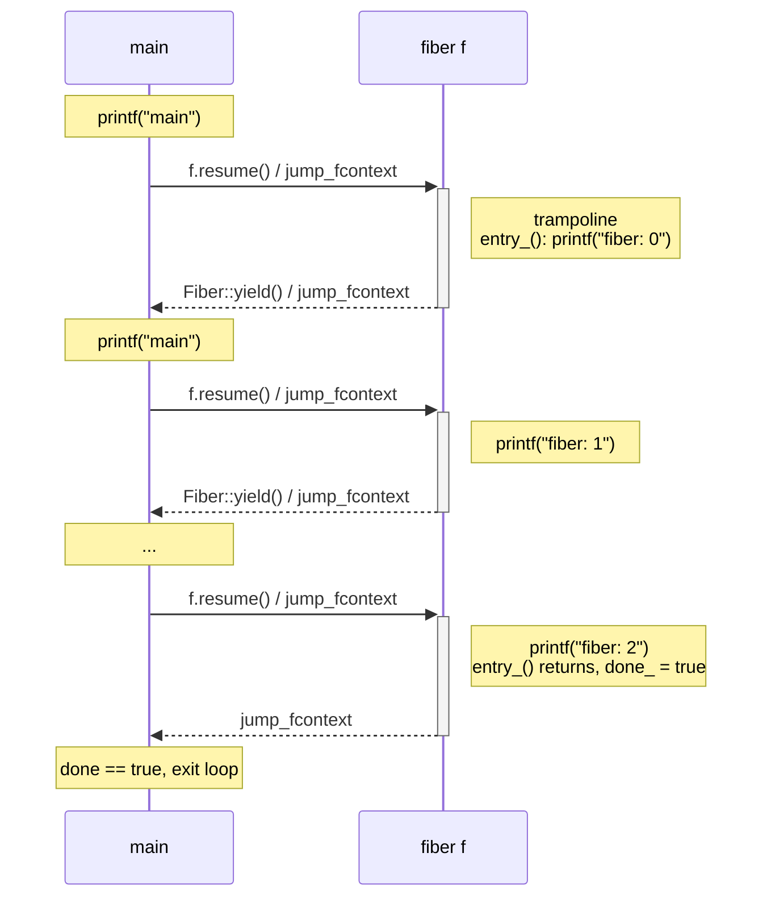
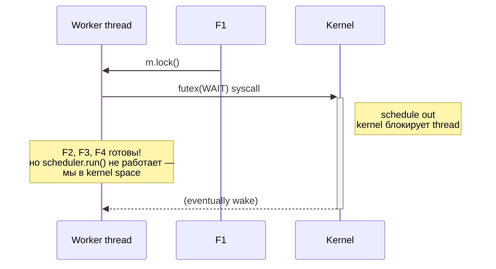
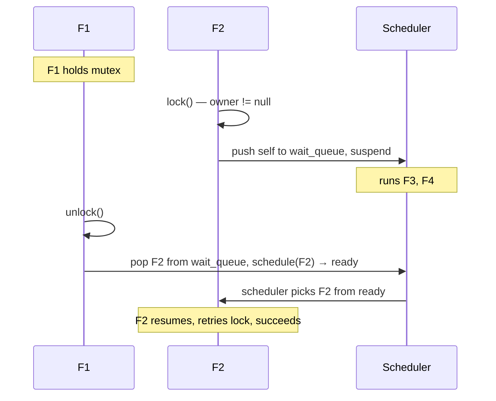
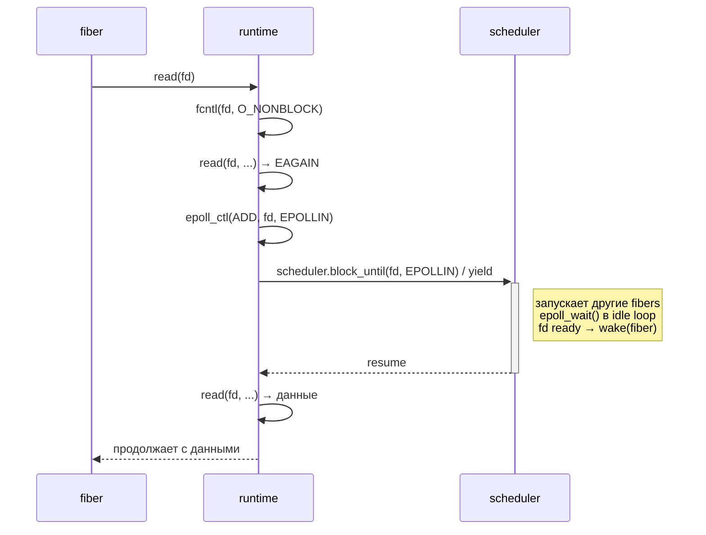

# Stackful fibers: jump_fcontext, scheduler, work-stealing

[Userspace context switching](userspace_context_switching.md) показал примитив — `swapcontext` или `jump_fcontext`, который меняет «нить исполнения» за десятки наносекунд. На том же фундаменте строится индустриальный fiber-runtime: миллионы кооперативных задач на горстке OS-потоков, work-stealing scheduler, integration с асинхронным I/O. Go goroutines, Java virtual threads (Project Loom), Boost.Fiber, libfork — все они вариации одной архитектуры.

Эта статья — про то, как stackful fibers устроены глубже одного `swapcontext`. Что такое fiber и почему он не pthread, как Boost.Context реализует `jump_fcontext` на голом ассемблере, как сделать work-stealing scheduler с per-worker deque, как защитить стек guard page'ой, как M:N runtime интегрируется с async I/O без блокирующих syscall'ов.

## Fiber vs thread vs coroutine

**Coroutine** — функция, которую можно приостановить (`yield`) и возобновить (`resume`) позже, сохранив локальное состояние. **Stackful** означает, что у coroutine'ы свой собственный стек: yield делается из любой глубины вложенных вызовов. **Fiber** — это stackful coroutine, управляемая scheduler'ом: вместо ручного `yield → target` (прямая передача управления) есть единый `yield` в scheduler, который сам выбирает следующего.

```
                  cooperative                       preemptive
                  ───────────                       ──────────
                                                    │
   pthread                                          │  ← OS scheduler, timer IRQ
   (1 на kernel thread)                             │  переключает принудительно
                                                    │
   ucontext fiber          ← swapcontext(),         │
                             программа сама yield'ит│
                                                    │
   Boost.Context fiber     ← jump_fcontext(),       │
                             на голом asm           │
                                                    │
   Boost.Fiber             ← scheduler + sync       │
                             primitives             │
                                                    │
   Go goroutine            ← M:N runtime, async I/O,│
                             stack growth, частично │
                             preemptive (safe pts)  │
```

Ключевая разница с pthread — **cooperative multitasking**. Fiber отдаёт CPU только когда сам решит. Преимущества:

- Переключение в десятки раз дешевле (нет syscall, нет TLB-flush, нет signal-mask).
- Между двумя yield'ами никакой другой fiber на этом OS-потоке не выполнится — это даёт автоматическую mutual exclusion для shared state без mutex'ов.
- Тысячи fiber'ов помещаются в один поток (стеки по 8–64 KB вместо 8 MB у pthread по умолчанию).

Недостатки:

- Зависший fiber (бесконечный цикл, blocking syscall) монополизирует поток — остальные fiber'ы на нём встанут.
- Нужна интеграция с асинхронным I/O: обычный `read()` блокирует весь поток, а не только fiber.
- Sanitizer'ы (TSAN, MSAN) обычно не понимают fiber-based concurrency.

```
Сравнение стоимости (примерно, на x86-64 современного железа):

┌──────────────────────────────┬───────────────┬────────────────────────────────┐
│ Что переключается            │ Стоимость, нс │ Что сохраняется                │
├──────────────────────────────┼───────────────┼────────────────────────────────┤
│ pthread (kernel context)     │   1 000–5 000 │ всё: regs, FPU, CR3, TSS, TLB  │
│ ucontext swapcontext (glibc) │       ~1 000  │ regs + FPU + signal mask       │
│ Boost.Context jump_fcontext  │         ~20   │ callee-saved + MXCSR + x87 CW  │
│ libaco                       │       ~7–10   │ callee-saved (FPU опционально) │
│ C++20 stackless resume       │          ~5   │ ничего (обычный function call) │
└──────────────────────────────┴───────────────┴────────────────────────────────┘
```

Два-три порядка разницы между pthread и fiber. Именно поэтому современный async-runtime — Go, Tokio, Loom — делает миллионы переключений в секунду без участия ядра.

## Эволюция реализаций

```
┌──────────────────┬──────────────┬─────────────────────────────────────────────┐
│ Реализация       │ Switch cost  │ Особенности                                 │
├──────────────────┼──────────────┼─────────────────────────────────────────────┤
│ setjmp/longjmp   │     ~10 нс   │ только non-local goto, не для coroutine'ов  │
│ POSIX ucontext   │   ~1 000 нс  │ есть в glibc, 2 syscall на signal mask      │
│ Boost.Context    │     ~20 нс   │ pure asm на платформу, де-факто стандарт    │
│ libco (Higepon)  │     ~15 нс   │ pure C + минимум asm, для embedded          │
│ libco (byuu)     │     ~15 нс   │ ~30 строк asm, нет dependencies             │
│ libaco           │    ~7–10 нс  │ современная, save-on-demand FPU, x86-64     │
│ libmill / libdill│     ~20 нс   │ Martin Sústrik, structured concurrency для C│
└──────────────────┴──────────────┴─────────────────────────────────────────────┘
```

`setjmp`/`longjmp` теоретически достаточно для двух fiber'ов (с подменой `rsp` руками), но стандарт C запрещает `longjmp` в функцию, которая уже вернулась — а у coroutine'ы именно это и нужно. Использовать `longjmp` для coroutine'ов — UB, хоть и часто «работающее».

POSIX `ucontext` корректен, но медленный из-за `rt_sigprocmask(2)` внутри `swapcontext`. Стандарт пометил его obsolescent в POSIX.1-2008.

Boost.Context — стандарт де-факто. API из двух функций (`make_fcontext` + `jump_fcontext`), ассемблер на каждую платформу написан вручную. На нём строятся Boost.Fiber, Boost.Coroutine2, многие другие runtime'ы.

`libaco` — современная переработка идеи с агрессивной оптимизацией: не сохраняет FPU, если приложение не использует SIMD, амортизирует TLS-доступы. На бенчмарках обходит Boost.Context в 2–3 раза.

## API Boost.Context

```cpp
namespace boost::context::detail {
    using fcontext_t = void*;                  // непрозрачный указатель на стек

    struct transfer_t {
        fcontext_t fctx;                        // прежний контекст (откуда пришли)
        void*      data;                        // передаваемые данные
    };

    fcontext_t make_fcontext(void *sp, size_t size,
                             void (*fn)(transfer_t));
    transfer_t jump_fcontext(fcontext_t to, void *data);
    transfer_t ontop_fcontext(fcontext_t to, void *data,
                              transfer_t (*fn)(transfer_t));
}
```

`fcontext_t` — указатель на вершину чужого стека, где сложены callee-saved регистры и адрес возврата. `transfer_t` несёт двусторонний обмен: при возврате из `jump_fcontext` мы получаем `fctx` того, кто нас «разбудил» (чтобы потом было куда прыгнуть обратно), и `data` от него.

`ontop_fcontext` — редкая, но полезная: прыгает на `to`, но перед тем как восстановить его контекст, выполняет `fn(transfer)` на стеке `to`. Используется для cancellation и stack unwinding (поднять exception на чужой стек).

## Сам switch — на asm

`jump_fcontext` — это и есть переключение контекста на голом ассемблере: сохранить callee-saved (`rbx`, `rbp`, `r12`–`r15`) уходящего fiber'а на его стек, подменить `rsp`, восстановить чужие callee-saved, прыгнуть по сохранённому адресу возврата. Ни syscall'а, ни барьера — единицы наносекунд. Полный разбор ассемблера (`fiber_switch`/`jump_fcontext`, MXCSR/x87, почему `ret`, а не `jmp`) — в статье [Userspace context switching](userspace_context_switching.md#собственный-context-switch-на-asm). Здесь нас интересует, что строится **поверх** switch'а: подготовка стека новой fiber'ы, trampoline, scheduler.

## make_fcontext: подготовка нового стека

```cpp
fcontext_t make_fcontext(void *sp, size_t size, void (*fn)(transfer_t));
```

`sp` — указатель на **верх** стека (high address; стек растёт вниз). `size` — его размер. `fn` — entry point, который получит `transfer_t` от первого `jump_fcontext` к этому контексту.

Задача `make_fcontext` — подготовить стек так, чтобы первый `jump_fcontext` на возвращённый указатель «выглядел изнутри» как обычный возврат: callee-saved регистры лежат на стеке, return address указывает на trampoline, который вызовет `fn`.

```asm
; fcontext_t make_fcontext(void *sp, size_t size, void (*fn)(transfer_t));
;   %rdi = sp, %rsi = size, %rdx = fn
make_fcontext:
    movq  %rdi, %rax                ; rax = sp (вершина стека)
    leaq  -0x40(%rax), %rax         ; зарезервировать save area + trampoline slot
    andq  $-16, %rax                ; выровнять по 16 байт (SysV ABI)
    leaq  trampoline(%rip), %rcx
    movq  %rcx, 0x38(%rax)          ; "return address" — указывает на trampoline
    movq  %rdx, 0x30(%rax)          ; будущий fn (сохраняем во временном слоте)
    stmxcsr  (%rax)                 ; текущий MXCSR
    fnstcw   0x4(%rax)              ; текущий x87 CW
    ; callee-saved slots не инициализированы — при первом jump они будут "загружены"
    ; но используются только после первого возврата в jump_fcontext через trampoline
    ret

trampoline:
    ; сюда попадаем из jmp *%r8 в jump_fcontext, когда target = новый контекст.
    ; transfer_t {fctx, data} уже в %rax, %rdx (см. конец jump_fcontext).
    ; В верхнем слоте лежит указатель на fn.
    movq  (%rsp), %r12              ; fn (загружали в 0x30 от save area, теперь = top)
    movq  %rax, %rdi                ; transfer_t.fctx → fn's argument
    movq  %rdx, %rsi                ; transfer_t.data
    ; ... вызов fn(transfer_t) ...
    callq *%r12
    ; если fn вернулся, ничего хорошего не будет — стек fiber'а пуст
    ud2                             ; abort: fiber вернулся из своей entry-функции
```

Реальный Boost.Context чуть сложнее (есть варианты с unwinding info, отдельный slot под `boost::context::fiber` метаданные), но принцип тот же.

```
Стек после make_fcontext(sp, size, fn):

           ┌──────────────────────────┐
   sp ──▶  │ . . .                    │   (high addr)
           │ alignment padding        │
           ├──────────────────────────┤
           │ pointer to fn  (0x30)    │
           ├──────────────────────────┤
           │ trampoline addr (0x38)   │
           ├──────────────────────────┤
           │ saved rbp (uninit)       │
           │ saved rbx (uninit)       │
           │ saved r15..r12 (uninit)  │
           │ MXCSR + x87 CW (текущ.)  │
           └──────────────────────────┘
                                          (low addr — свободное пространство)

   возвращаемый fcontext_t = адрес save area (MXCSR slot)
   trampoline addr будет загружен в %r8 при первом jump_fcontext
```

При первом `jump_fcontext(new_ctx, data)`:

1. Сохраняющая часть как обычно складывает наши callee-saved.
2. `movq %rdi, %rsp` — переключаемся на новый стек.
3. Восстановление загружает uninitialized callee-saved (ничего не делая, у нас нет полезных значений), MXCSR, x87 CW.
4. `leaq 0x38(%rsp), %rsp` — оказываемся на слоте с указателем на trampoline.
5. `jmp *%r8` (загруженный из 0x38) — прыжок на trampoline.
6. Trampoline вызывает `fn(transfer_t)`. На входе `%rax` = наш сохранённый context, `%rdx` = data.

### Зачем нужен trampoline

Сам `jump_fcontext` умеет только одно: восстановить состояние со стека и сделать `ret`/`jmp` по лежащему там адресу
возврата. Он рассчитан на контекст, который **уже когда-то** уходил через switch и оставил после себя валидный кадр.
У новой fiber'ы такого кадра нет — её стек пустой. Trampoline закрывает ровно три разрыва между «пустым стеком» и
«нормально работающей fiber'ой».

**Разрыв 1: switch умеет только «вернуться», а нам нужно «вызвать».** Чтобы первый `jump_fcontext` на новую fiber'у
не упал, `make_fcontext` подкладывает на дно её стека **фейковый кадр**: адрес возврата = trampoline + слот с
указателем на `fn`. Для switch'а это выглядит как обычный возврат, он прыгает на trampoline — а тот уже делает то, чего
switch не умеет: настоящий `call fn`. Без этого переходника пришлось бы учить `jump_fcontext` двум разным режимам
(«возобновить» и «запустить впервые») — trampoline выносит «запуск» из горячего switch'а в одноразовый код.

**Разрыв 2: ABI-требования к точке входа.** `fn` — обычная функция, она ожидает выровненный по 16 байт стек (SysV) и
аргумент в `rdi`. После switch'а в `rax`/`rdx` лежит `transfer_t`, а стек выровнен под switch, не под `call`. Trampoline
перекладывает `transfer_t.fctx` в `rdi`, `transfer_t.data` в `rsi` и выполняет именно `call` (а не `jmp`), чтобы стек
встал как положено и заработали `-fstack-protector`, unwinding, отладчик.

**Разрыв 3: возврат из `fn` ведёт в никуда.** Когда тело fiber'ы досчитает до конца и сделает `ret`, под ним нет
вызывающего фрейма — стек fiber'ы пуст. «Выпасть» из `fn` означало бы исполнять мусор. Trampoline — это рамка вокруг
`fn`: точка, куда возврат попадёт гарантированно. В Boost это `ud2` (намеренный abort: «fiber обязан уходить через
`jump_fcontext`, а не возвращаться»); в нормальном runtime вместо `ud2` стоит код завершения — пометить fiber как
`finished` и `jump_fcontext` обратно в scheduler. Trampoline даёт единственное место, где живёт логика «fiber
завершилась»: уборка, снятие с очереди, переключение на следующего.

Коротко: trampoline — это **синтетический кадр на дне стека**, который превращает «голый прыжок» switch'а в корректный
вызов entry-функции и перехватывает её возврат, не давая управлению свалиться с пустого стека.

## Минимальный fiber-runtime на C++

Соберём примитивную обёртку над Boost.Context — `Fiber` с `resume()`/`yield()`, без scheduler'а.

```cpp
#include <cstdlib>
#include <cstring>
#include <functional>
#include <sys/mman.h>

namespace bctx = boost::context::detail;

class Fiber {
public:
    Fiber(std::function<void()> fn, size_t stack_size = 64 * 1024)
        : entry_(std::move(fn)), stack_size_(stack_size)
    {
        stack_ = mmap(nullptr, stack_size_ + 4096,
                      PROT_READ | PROT_WRITE,
                      MAP_PRIVATE | MAP_ANON, -1, 0);
        mprotect(stack_, 4096, PROT_NONE);              // guard page
        void *top = (char*)stack_ + 4096 + stack_size_; // high addr
        ctx_ = bctx::make_fcontext(top, stack_size_, &Fiber::trampoline);
    }

    ~Fiber() {
        munmap(stack_, stack_size_ + 4096);
    }

    bool done() const { return done_; }

    void resume() {
        if (done_) return;
        auto t = bctx::jump_fcontext(ctx_, this);
        ctx_ = t.fctx;                                  // сохранить, куда yield'нул
    }

    // вызывается изнутри fiber'а
    static void yield() {
        Fiber *self = current_;
        auto t = bctx::jump_fcontext(self->caller_, nullptr);
        self->caller_ = t.fctx;
    }

private:
    static void trampoline(bctx::transfer_t t) {
        Fiber *self = static_cast<Fiber*>(t.data);
        self->caller_ = t.fctx;
        current_ = self;
        self->entry_();
        self->done_ = true;
        bctx::jump_fcontext(self->caller_, nullptr);    // возврат в caller
    }

    std::function<void()> entry_;
    bctx::fcontext_t ctx_     = nullptr;
    bctx::fcontext_t caller_  = nullptr;
    void  *stack_             = nullptr;
    size_t stack_size_        = 0;
    bool   done_              = false;
    static thread_local Fiber *current_;
};

thread_local Fiber *Fiber::current_ = nullptr;
```

Использование:

```cpp
int main() {
    Fiber f([] {
        for (int i = 0; i < 3; ++i) {
            std::printf("fiber: %d\n", i);
            Fiber::yield();
        }
    });

    while (!f.done()) {
        std::printf("main\n");
        f.resume();
    }
}
```

Вывод:

```
main
fiber: 0
main
fiber: 1
main
fiber: 2
main
```

Поток управления:



Менее 80 строк кода, и у нас есть рабочий stackful fiber с guard page'ой против stack overflow.

!!! example "Рабочий пример"
    Полная компилируемая реализация stackful fiber: собственный asm-switch (`context_switch.S` + `fiber_asm.cpp`) и вариант на POSIX `ucontext` (`fiber_ucontext.cpp`), с guard page и `resume`/`yield`. Собрать: `cd examples && make q15` (цели `q15_asm`, `q15_ucontext`).

## Scheduler-based runtime

Прямая передача управления через `Fiber::resume`/`Fiber::yield` не масштабируется. На N fiber'ах каждый должен знать, кому уступить. Решение — единственный диспетчер с ready queue.

```cpp
#include <deque>
#include <functional>
#include <memory>
#include <unordered_map>

class Scheduler {
public:
    void spawn(std::function<void()> fn) {
        auto f = std::make_unique<Fiber>(std::move(fn));
        ready_.push_back(std::move(f));
    }

    void run() {
        while (!ready_.empty() || !blocked_.empty()) {
            if (ready_.empty()) {
                poll_io();                              // если нечего делать — ждать I/O
                continue;
            }
            auto f = std::move(ready_.front());
            ready_.pop_front();
            current_ = f.get();
            f->resume();
            if (!f->done()) {
                if (current_state_ == BLOCKED)
                    blocked_.push_back(std::move(f));
                else
                    ready_.push_back(std::move(f));     // back of queue → fairness
            }
            current_ = nullptr;
        }
    }

    static void yield() {
        instance().current_state_ = READY;
        Fiber::yield();
    }

    static void block_until(int fd, short events) {
        auto &s = instance();
        s.current_state_ = BLOCKED;
        s.io_waits_[fd] = s.current_;
        Fiber::yield();
    }

    void wake(Fiber *f) {                               // вызывается извне (I/O ready)
        for (auto it = blocked_.begin(); it != blocked_.end(); ++it) {
            if (it->get() == f) {
                ready_.push_back(std::move(*it));
                blocked_.erase(it);
                return;
            }
        }
    }

private:
    enum State { READY, BLOCKED };
    std::deque<std::unique_ptr<Fiber>> ready_;
    std::deque<std::unique_ptr<Fiber>> blocked_;
    Fiber *current_                  = nullptr;
    State  current_state_            = READY;
    std::unordered_map<int, Fiber*> io_waits_;

    void poll_io() {
        // epoll_wait(...) → для каждого ready fd: wake(io_waits_[fd])
    }

    static Scheduler& instance() { static thread_local Scheduler s; return s; }
};
```

Round-robin: после yield fiber попадает в **конец** ready queue, обеспечивая fairness. Priority scheduling — добавляется отдельная high-priority queue, проверяется первой. Deadline scheduling — sorted heap по deadline.

```
ready queue (FIFO)
┌────┬────┬────┬────┬────┐
│ F1 │ F2 │ F3 │ F4 │ F5 │ ──▶ resume() забирает с фронта
└────┴────┴────┴────┴────┘
   ▲                  ▲
   │                  │
   yield пушит сюда   resume берёт отсюда


blocked set
┌────────┬────────────┐
│ fiber  │ wait cond  │       ├── timer expired ──▶ перенос в ready
├────────┼────────────┤       ├── fd readable  ──▶ перенос в ready
│  F6    │ read(fd=4) │       └── mutex unlocked──▶ перенос в ready
│  F7    │ sleep(2s)  │
│  F8    │ mutex.lock │
└────────┴────────────┘
```

У этой мощи есть цена: **`yield` ломает структурное программирование**. Когда-то отказались от `goto` ради структурного кода (Дейкстра): вызовы образуют аккуратную систему вложенных отрезков, об исполнении легко рассуждать. `yield` это ломает — вход в один вызов, выход из другого; чтобы промоделировать программу в уме, приходится держать в голове ready queue планировщика. Ту же «лапшу» позже «чинят» [stackless-корутины](coroutines_cpp20.md): тот же разрез вычисления на автомат, но делает его **компилятор**, а не рантайм — и структура восстанавливается, потому что разрез виден в коде маркером `co_await`. Fiber и stackless-coroutine решают одну задачу на разных слоях (см. «Одна трансформация, два разреза» в статье про корутины).

## Boost.Fiber scheduler classes

Boost.Fiber выносит scheduling policy в отдельный класс — наследник `boost::fibers::algo::algorithm`. Runtime обращается к нему через четыре virtual method'а: `awakened(context*)` (fiber стал ready), `pick_next()` (выбрать следующего), `has_ready_fibers()`, `suspend_until(time_point)` / `notify()` (park/unpark worker'а). Меняя класс, можно полностью переписать политику без правки самого runtime'а.

```
┌──────────────────────────────┬───────────────────────────────────────────────┐
│ Класс                        │ Что делает                                    │
├──────────────────────────────┼───────────────────────────────────────────────┤
│ algo::round_robin            │ один FIFO queue, default policy               │
│ algo::shared_work            │ общая очередь на весь thread pool, mutex      │
│ algo::work_stealing          │ per-worker deque + Chase-Lev steal            │
│ algo::numa::work_stealing    │ NUMA-aware steal: сначала local, потом remote │
└──────────────────────────────┴───────────────────────────────────────────────┘
```

### round_robin

Default policy, ставится автоматически, если приложение не вызывало `use_scheduling_algorithm`. Один FIFO ready queue, без блокировок (single-thread runtime). `awakened` пушит в конец, `pick_next` берёт с фронта. При `this_fiber::yield()` — push self в хвост, pop head, переключение на head.

```
algo::round_robin (per OS thread, single ready queue)

    awakened(ctx)    pick_next()
         │               ▲
         ▼               │
       ┌───┬───┬───┬───┬───┐
       │ F5│ F4│ F3│ F2│ F1│  ◀── head pop'ится first
       └───┴───┴───┴───┴───┘
         ▲
         └─ yield/wake push сюда
```

Не масштабируется на многоядерные машины — все worker'ы дерутся за единственную очередь, mutex contention растёт линейно по числу ядер. Подходит для single-threaded server'а, где нужен предсказуемый порядок исполнения fiber'ов.

### shared_work

Промежуточный вариант: общая queue на все worker'ы, но runtime поднимает thread pool сам. Конструктор `shared_work(thread_count)` запускает N worker'ов, каждый берёт `pick_next` из общего deque под mutex'ом. Проще, чем work-stealing, но contention point остаётся.

```cpp
#include <boost/fiber/algo/shared_work.hpp>

int main() {
    boost::fibers::use_scheduling_algorithm<
        boost::fibers::algo::shared_work>();          // на одном thread'е
    // ...spawn fibers...
}
```

### work_stealing

Production-grade scheduler: per-worker deque + Chase-Lev steal protocol. Конструктор берёт `thread_count`, организует пул из N worker'ов, каждый держит свой `context_spinlock_queue`. Локальный push/pop через head (LIFO для cache locality), steal с tail (FIFO). Когда worker'у нечего делать — пробует random victim, при неуспехе park'ится на `condition_variable`.

```cpp
#include <boost/fiber/algo/work_stealing.hpp>

void worker(unsigned thread_count) {
    boost::fibers::use_scheduling_algorithm<
        boost::fibers::algo::work_stealing>(thread_count);
    // ... main loop ...
}

int main() {
    unsigned n = std::thread::hardware_concurrency();
    std::vector<std::thread> threads;
    for (unsigned i = 1; i < n; ++i)
        threads.emplace_back(worker, n);
    worker(n);                                        // главный поток тоже worker
    for (auto& t : threads) t.join();
}
```

```
work_stealing scheduler (N workers)

  Worker 0           Worker 1           Worker 2           Worker 3
  ┌────────┐         ┌────────┐         ┌────────┐         ┌────────┐
  │ deque  │         │ deque  │         │ deque  │         │ deque  │
  │ F1 F2  │         │ (empty)│         │ F7 F8  │         │ F9 ... │
  │ F3 F4  │         │        │         │        │         │        │
  └────────┘         └────────┘         └────────┘         └────────┘
       │                  ▲                  │                  │
       ▼                  └── steal от хвоста┘                  ▼
   ┌──────┐           ┌──────┐           ┌──────┐            ┌──────┐
   │ CPU0 │           │ CPU1 │           │ CPU2 │            │ CPU3 │
   └──────┘           └──────┘           └──────┘            └──────┘

  Worker 1 опустошил свою deque → крадёт фибру с хвоста deque Worker 2
  (свои берёт с головы LIFO, у жертвы — с хвоста FIFO).
```

### Custom scheduler

Минимальный custom scheduler — priority-aware round robin. Если фибра помечена high-priority (через property), всегда исполнять её первой.

```cpp
#include <boost/fiber/algo/algorithm.hpp>
#include <boost/fiber/context.hpp>
#include <boost/fiber/properties.hpp>
#include <boost/fiber/scheduler.hpp>

class priority_props : public boost::fibers::fiber_properties {
public:
    priority_props(boost::fibers::context *ctx)
        : fiber_properties(ctx), priority_(0) {}
    int priority() const { return priority_; }
    void priority(int p) { priority_ = p; notify(); }
private:
    int priority_;
};

class priority_scheduler
    : public boost::fibers::algo::algorithm_with_properties<priority_props> {
public:
    void awakened(boost::fibers::context *ctx, priority_props &props) noexcept override {
        int p = props.priority();
        auto it = ready_.begin();
        while (it != ready_.end() && properties(&*it).priority() >= p) ++it;
        ready_.insert(it, *ctx);                      // sorted insert по priority
    }

    boost::fibers::context* pick_next() noexcept override {
        if (ready_.empty()) return nullptr;
        auto *ctx = &ready_.front();
        ready_.pop_front();
        return ctx;
    }

    bool has_ready_fibers() const noexcept override { return !ready_.empty(); }

    void suspend_until(std::chrono::steady_clock::time_point const& tp) noexcept override {
        std::unique_lock<std::mutex> lk(mtx_);
        if (tp == (std::chrono::steady_clock::time_point::max)())
            cv_.wait(lk, [this]{ return flag_; });
        else
            cv_.wait_until(lk, tp, [this]{ return flag_; });
        flag_ = false;
    }

    void notify() noexcept override {
        std::unique_lock<std::mutex> lk(mtx_);
        flag_ = true;
        cv_.notify_one();
    }

private:
    boost::fibers::scheduler::ready_queue_type ready_;
    std::mutex mtx_;
    std::condition_variable cv_;
    bool flag_ = false;
};
```

Установка: `boost::fibers::use_scheduling_algorithm<priority_scheduler>()`. Fiber выставляет приоритет через `this_fiber::properties<priority_props>().priority(5)`.

## fiber-aware sync primitives

Главный камень преткновения для cooperative runtime'а — синхронизация. Если fiber берёт `std::mutex` и контест разрешается через kernel'овский `futex(SYS_FUTEX_WAIT)`, блокируется **весь OS-поток**: scheduler не сможет переключиться на другой ready fiber. На M:N runtime'е это лочит worker, остальные fiber'ы на нём встают, а work-stealing сможет вытащить их только через timeout.



Решение — fiber-aware mutex, который вместо `futex` делает `yield` в scheduler.

### boost::fibers::mutex

API совпадает с `std::mutex` (`lock`, `try_lock`, `unlock`), но реализация под капотом — state machine + waiter queue из `context*`. При `lock` на занятом mutex'е fiber кладёт свой context в waiter queue и yield'ит в scheduler. При `unlock` — pop первого waiter'а и push его в ready queue.

```cpp
namespace boost::fibers {

class mutex {
    std::atomic<context*>       owner_{nullptr};
    detail::spinlock            wait_queue_splk_;
    detail::wait_queue          wait_queue_;

public:
    void lock() {
        context *active = context::active();
        for (;;) {
            context *expected = nullptr;
            if (owner_.compare_exchange_strong(expected, active))
                return;                                // got it
            if (expected == active)
                throw lock_error(...);                 // recursive

            detail::spinlock_lock lk(wait_queue_splk_);
            if (owner_.load() == nullptr) continue;    // retry
            active->wait_link(wait_queue_);            // в waiter queue
            active->suspend(lk);                       // yield + release splk
            // resume сюда — снова пытаемся захватить
        }
    }

    void unlock() {
        context *active = context::active();
        if (owner_.load() != active) throw lock_error(...);
        detail::spinlock_lock lk(wait_queue_splk_);
        context *waiter = nullptr;
        if (!wait_queue_.empty()) {
            waiter = &wait_queue_.front();
            wait_queue_.pop_front();
        }
        owner_.store(nullptr);
        lk.unlock();
        if (waiter) context::active()->schedule(waiter);
    }
};

}  // namespace
```



Аналогично устроены `boost::fibers::condition_variable` (waiter queue + notify пушит в ready) и `boost::fibers::future` (continuation вызывается через `schedule` после `set_value`). API ровно как у `std::` — поэтому код переносится с pthread на fiber заменой namespace'а.

### Что нельзя смешивать

`std::mutex`, удерживаемый fiber'ом, при контесте с fiber'ом на том же worker'е приводит к deadlock'у: holder ждёт, что его разбудит scheduler, но scheduler не запустится — kernel блокирует thread. Правило: внутри fiber-кода — только fiber-aware primitives. `std::atomic` безопасен (это lock-free), `std::mutex`/`std::condition_variable`/`std::future` — нет.

## Управление стеком

Самая большая trade-off в fiber-runtime — стек. Pthread по умолчанию даёт 8 MB на поток (виртуально, commit-on-touch), но для миллиона fiber'ов это 8 TB виртуальной памяти — даже на 64-битке это перебор для одного процесса.

```
              Fixed                    Segmented                  Movable
              ─────                    ─────────                  ───────

         ┌─────────────┐            ┌──────┐                  ┌──────┐
         │             │            │ seg3 │ ── linked list   │ 8 KB │
   high  │   stack     │            └──────┘                  └──────┘
         │  (single    │            ┌──────┐                     │
         │   fixed     │            │ seg2 │                     │ stack overflow
         │   region)   │            └──────┘                     ▼
         │             │            ┌──────┐                  ┌─────────┐
   low   │             │            │ seg1 │                  │  16 KB  │
         └─────────────┘            └──────┘                  │ (copy)  │
                ▲                      ▲                      └─────────┘
                │                      │                         ▲
           guard page              current top                   │
                                   растёт прыжком             Go runtime
                                   по сегментам               знает все
                                                              stack ptrs
```

**Fixed stacks** (Boost.Context, libco, libaco, Boost.Fiber по умолчанию) — выделить N KB на fiber один раз, не расти. Просто, дёшево по CPU, дорого по памяти: либо стек избыточен (тратим зря), либо мал (риск overflow). Типичный размер — 64 KB; при guard page снизу overflow приводит к SIGSEGV.

**Segmented stacks** (split-stack, gccgo до 1.3, libco split-stack) — список chunks по 8–32 KB. При prologue каждой функции — проверка `rsp` против границы; если выходим за границу, allocate новый segment. Дёшево по памяти, но дорого по CPU: prologue check в каждой функции, плюс «hot/cold» segment switch (вызов из частой функции в редкую) платит ~100 ns. Go отказался от segmented stacks в 1.3 из-за «hot split» патологии: цикл, прыгающий между сегментами, страдает.

**Movable stacks** (Go goroutines с 1.3, Erlang BEAM process heaps) — начать с 2 KB, при stack overflow allocate новый стек вдвое больше, **скопировать** всё содержимое, обновить все указатели на старый стек. Дёшево по памяти, дёшево по горячему пути (только prologue check), но требует знания компилятором всех stack-указателей. Go runtime/compiler знает, потому что генерирует metadata для каждой функции (stack map). В C/C++ это невозможно без полного pointer tracking — поэтому Boost.Context остаётся fixed.

**Linked stacks** — гибрид: связанный список chunks без копирования. Используется в очень старых runtime'ах.

**Stack pooling** — на завершении fiber'а его стек не освобождается, а возвращается в pool. Следующий `spawn` берёт стек оттуда. Экономит mmap/munmap (~1 мкс), переиспользует hot TLB-entries. Все индустриальные runtime'ы делают pool — Boost.Fiber, Go (за счёт goroutine reuse), Tokio.

## Guard page и stack overflow

Голый `malloc(STACK_SIZE)` не даёт никакой защиты от stack overflow. Если fiber переполнит свой стек, он молча запишет в соседнюю аллокацию (heap chunk) или в другой fiber'ов стек. Отладка такой коррупции — пытка.

Решение — **guard page** через `mmap` + `mprotect`:

```c
size_t stack_size = 64 * 1024;
size_t total = stack_size + 4096;
void *region = mmap(NULL, total,
                    PROT_READ | PROT_WRITE,
                    MAP_PRIVATE | MAP_ANON, -1, 0);
mprotect(region, 4096, PROT_NONE);                     // нижняя страница — no access
void *stack_top = (char*)region + total;               // вершина (стек растёт вниз)
```

Любая запись в нижнюю страницу вызовет `SIGSEGV` — программа упадёт детерминированно, со стеком, указывающим прямо на функцию, переполнившую стек. Production-runtime'ы (Boost.Fiber, Go, libuv) делают guard page по умолчанию.

Альтернатива — **stack canary**: записать magic bytes в конец стека, на каждом yield проверять, не перезаписан ли. Дешевле, чем mmap (нет syscall), но детектирует overflow только в момент проверки, а не сразу.

```
Расположение в виртуальной памяти:

   high addr (stack_top) ┌─────────────────────────┐
                         │  usable stack           │
                         │  (64 KB)                │
                         │  rsp растёт вниз        │
                         │                         │
                         │                         │
                         ├─────────────────────────┤
                         │  GUARD PAGE             │
                         │  PROT_NONE              │
   low  addr (region)    └─────────────────────────┘

   запись в guard page → SIGSEGV (а не silent corruption)
```

На Linux с `MAP_GROWSDOWN` можно автоматически расти, но эта функция deprecated и небезопасна. Production-fiber'ы её не используют.

## Как сделать runtime многопоточным

Показанный выше scheduler — однопоточный: один OS-поток, одна ready-очередь, переключения внутри него. Он утилизирует
ровно одно ядро. Чтобы занять все ядра, запускают **N worker-потоков** (по одному на ядро), и каждый крутит свою копию
такого scheduler-цикла. Сам по себе switch при этом не меняется — меняется то, что fiber теперь может оказаться на
любом из потоков. Безопасность держится на нескольких инвариантах.

**Fiber самодостаточен — его можно поднять на любом потоке.** Всё состояние приостановленной fiber'ы лежит на её
**собственном стеке**, а ссылка на него — это один указатель `sp`. `fiber_switch` грузит `sp` и продолжает исполнение;
ему всё равно, какой OS-поток это делает. Поэтому worker B может возобновить fiber'у, которую усыпил worker A, — нужно
лишь передать указатель. Это и есть миграция.

**Но никогда — на двух потоках одновременно.** Два worker'а, запустившие один `sp`, затрут друг другу стек — мгновенная
коррупция. Значит fiber в любой момент должен быть ровно в одном месте: либо исполняется на одном worker'е, либо лежит
**в одной** очереди. Это инвариант владения, и его обеспечивает структура очередей:

- **per-worker deque + work-stealing** (Chase-Lev, см. ниже): свой worker берёт с head, вор — с tail, через атомарный
  CAS. CAS гарантирует, что fiber'у заберёт ровно один — два потока не унесут одну задачу.
- кража **изымает** fiber из чужой deque, а не копирует: после успешного `steal` исходная ячейка больше не отдаст эту
  fiber'у никому.

**Порядок при yield: сначала уйти, потом опубликовать.** Опасное окно — между «fiber сохранила свой `sp`» и «scheduler
вернул её в ready-очередь». Если положить fiber'у в очередь **до** того, как switch записал её `sp`, чужой worker украдёт
её и запустит по ещё не сохранённому (мусорному) `sp`. Поэтому `yield` всегда сначала делает `fiber_switch` в scheduler
(тот дописывает `sp`), и лишь scheduler, уже владея валидным указателем, кладёт fiber'у обратно. До этого момента fiber
никому не видна.

**TLS перестаёт быть надёжным.** `thread_local` привязан к OS-потоку, а не к fiber'е. После миграции:

- `current_fiber` нужно переустановить на новом worker'е (его держат в TLS воркера, обновляют на каждом resume).
- всё, что fiber закэшировала из TLS до yield — `errno`, арена аллокатора, `gettid()`, указатель на текущий worker —
  после возобновления на другом потоке **протухло**. Нельзя проносить такие значения через точку yield.
- отсюда практическое правило рантаймов: код, критично завязанный на конкретный поток (например, GPU-контекст, который
  валиден только в своём потоке), либо **пиннят** к worker'у (запрещают миграцию), либо перечитывают TLS после каждого
  resume. Go помечает такие участки `runtime.LockOSThread`.

**Блокирующий syscall блокирует весь worker, а не fiber'у.** На одном потоке зависшая fiber'а вешала «всех на этом
потоке»; в M:N она вешает целое ядро. Это отдельная большая тема — async I/O через event loop, hand-off в I/O-пул,
детект длинных syscall'ов — разобрана ниже в [«Блокирующие syscalls vs fiber-friendly I/O»](#блокирующие-syscalls-vs-fiber-friendly-io).

Дальше — конкретная архитектура (per-worker runqueue + steal) и lock-free deque, на которых это всё держится.

## M:N threading: hybrid runtime

Один OS-поток с fiber'ами утилизирует одно ядро. Для нескольких ядер — несколько OS-потоков (workers), каждый со своей очередью fiber'ов. **M:N threading**: M fiber'ов исполняются на N OS-потоках, fiber может мигрировать между потоками.

```
                  M:N runtime (M fibers, N OS threads)

  ┌─────────────────────────────────────────────────────────────────┐
  │                       Process address space                     │
  │                                                                 │
  │  Worker 1            Worker 2            Worker 3      Worker 4 │
  │  (kernel thread)     (kernel thread)     ...                    │
  │                                                                 │
  │  ┌──────────┐        ┌──────────┐        ┌──────────┐ ┌──────┐  │
  │  │ runqueue │        │ runqueue │        │ runqueue │ │ rq   │  │
  │  ├──────────┤        ├──────────┤        ├──────────┤ ├──────┤  │
  │  │  F1      │        │  F4      │        │  F7      │ │ F10  │  │
  │  │  F2      │        │  F5      │        │  F8      │ │ F11  │  │
  │  │  F3      │        │  F6      │        │  F9      │ │ F12  │  │
  │  └──────────┘        └──────────┘        └──────────┘ └──────┘  │
  │      │                   │                   │           │      │
  │      ▼                   ▼                   ▼           ▼      │
  │  ┌─────────┐         ┌─────────┐         ┌─────────┐ ┌───────┐  │
  │  │  CPU 0  │         │  CPU 1  │         │  CPU 2  │ │ CPU 3 │  │
  │  └─────────┘         └─────────┘         └─────────┘ └───────┘  │
  │                                                                 │
  │  Когда runqueue worker'а пуста, он крадёт fiber из чужой        │
  │  очереди (work-stealing) или паркуется на condvar               │
  └─────────────────────────────────────────────────────────────────┘
```

Базовая модель Go (P-runtime'ы), Erlang BEAM (scheduler'ов = ядер), Java ForkJoinPool, Rust Tokio.

Преимущества:

- Использование всех CPU без явного создания fiber'ов под каждое ядро.
- Дешёвая concurrency: один `spawn` создаёт ~2 KB структуры, а не pthread с 8 MB стеком и kernel TID.
- Естественный load balancing: если один worker завален, остальные крадут у него работу.

Сложности:

- Миграция fiber'а между потоками меняет видимый thread-local storage (TLS) — об этом ниже.
- Cache locality: после миграции данные fiber'а холодные в L1/L2 нового ядра.
- Синхронизация ready queue: shared queue требует mutex, per-worker deque требует work-stealing protocol.

## Work-stealing scheduler

Самая популярная схема в M:N runtime'ах — Cilk-style work-stealing. Каждый worker имеет **deque** (double-ended queue) готовых fiber'ов. Хитрость в том, с какого конца кладут и берут.

**Свой worker** работает с deque как со стеком: push в head, pop из head (LIFO). Это даёт cache locality — последний созданный fiber обычно ссылается на данные, ещё горячие в L1 (parent создал child, child работает над теми же данными).

**Чужой worker** ворует с противоположного конца — pop из tail (FIFO). Это даёт fairness (крадутся «самые старые» задачи, которые скорее всего корневые и большие) и снижает конфликты с локальным worker'ом — он работает с head, вор работает с tail, lock-free deque (Chase-Lev) обеспечивает атомарность.

```
Worker 1's deque (LIFO для self, FIFO для steal)

   head (LIFO для self)                          tail (FIFO для thief)
   │                                                            │
   ▼                                                            ▼
  ┌──────┬──────┬──────┬──────┬──────┬──────┬──────┬──────┬──────┐
  │ F12  │ F11  │ F10  │  F9  │  F8  │  F7  │  F6  │  F5  │  F4  │
  └──────┴──────┴──────┴──────┴──────┴──────┴──────┴──────┴──────┘
   ▲                                                            ▲
   │                                                            │
   self push() / pop()                          thief steal() сюда
   (cache hot)                                  (cache cold, fair)


Worker 2's deque пустеет → нужен steal

   head                                                      tail
   ▼                                                            ▼
  ┌──────────────────────────────────────────────────────────────┐
  │ (пусто)                                                      │
  └──────────────────────────────────────────────────────────────┘

   worker 2:
     1. свой deque пуст
     2. идёт к worker 1
     3. steal с tail: F4
     4. кладёт F4 в свой head
```

Псевдокод Chase-Lev work-stealing deque (lock-free):

```cpp
struct ChaseLevDeque {
    std::atomic<int64_t> top{0};                // tail для thieves
    std::atomic<int64_t> bottom{0};             // head для self
    std::atomic<Fiber*> *array;                 // ring buffer
    size_t mask;

    // self: push в head (release: thieves видят размер)
    void push(Fiber *f) {
        int64_t b = bottom.load(std::memory_order_relaxed);
        array[b & mask].store(f, std::memory_order_relaxed);
        bottom.store(b + 1, std::memory_order_release);
    }

    // self: pop с head (LIFO)
    Fiber* pop() {
        int64_t b = bottom.load(std::memory_order_relaxed) - 1;
        bottom.store(b, std::memory_order_seq_cst);
        int64_t t = top.load(std::memory_order_seq_cst);
        if (t > b) { bottom.store(b + 1, std::memory_order_relaxed); return nullptr; }
        Fiber *f = array[b & mask].load(std::memory_order_relaxed);
        if (t == b) {
            // last element — race с thieves
            if (!top.compare_exchange_strong(t, t + 1)) f = nullptr;
            bottom.store(b + 1, std::memory_order_relaxed);
        }
        return f;
    }

    // thief: steal с tail (FIFO)
    Fiber* steal() {
        int64_t t = top.load(std::memory_order_acquire);
        std::atomic_thread_fence(std::memory_order_seq_cst);
        int64_t b = bottom.load(std::memory_order_acquire);
        if (t >= b) return nullptr;
        Fiber *f = array[t & mask].load(std::memory_order_relaxed);
        if (!top.compare_exchange_strong(t, t + 1)) return nullptr;
        return f;
    }
};
```

Сравнение с глобальной FIFO queue:

```
┌────────────────────────────┬──────────────────────┬─────────────────────────────┐
│ Параметр                   │ Global FIFO queue    │ Work-stealing per-worker    │
├────────────────────────────┼──────────────────────┼─────────────────────────────┤
│ Contention при push/pop    │ высокий (mutex)      │ нулевой в hot path          │
│ Cache locality             │ плохая (миграция)    │ хорошая (свои в head)       │
│ Load balancing             │ автоматический       │ через steal, чуть инертный  │
│ Fairness                   │ FIFO глобально       │ steal-FIFO, локально-LIFO   │
│ Сложность реализации       │ низкая               │ высокая (lock-free deque)   │
│ Где используется           │ простые runtime'ы    │ Tokio, ForkJoinPool, Cilk,Go│
└────────────────────────────┴──────────────────────┴─────────────────────────────┘
```

Steal не приходит сразу: Tokio, например, перед steal'ом сначала проверяет global injection queue, потом siblings по round-robin. Между неудачными steal'ами worker может попасть в state «park» — заснуть на `futex`, пока кто-то не вызовет `wake`.

## Другой подход: файбер = корутина + пул

Выше runtime получался многопоточным «в лоб»: несколько worker-scheduler'ов гоняют stackful-фиберы и мигрируют их через work-stealing. Это работает, но scheduler приходится делать потокобезопасным, а миграцию — аккуратной (см. инварианты выше). Есть более чистая декомпозиция, которая выносит всю многопоточность из scheduler'а: разложить файбер на **два ортогональных компонента**, каждый из которых ничего не знает о другом.

- **Корутина** — обобщение подпрограммы: умеет `resume`/`suspend`, хранит свой контекст, **ничего не знает** про потоки и планировщик (это ровно `make_fcontext` + `jump_fcontext` из начала статьи).
- **Пул потоков (executor)** — умеет исполнять задачи (`Submit(task)`), **ничего не знает** про корутины и файберы.

Сложив их, получаем `go`/`yield` буквально в несколько строк — без единого `jump_fcontext` и без упоминания потоков:

```cpp
// go: запустить файбер = завернуть процедуру в корутину и сабмитить первый шаг
void Go(IExecutor& pool, Routine routine) {
    auto* co = new Coroutine(std::move(routine));
    pool.Submit([co] { co->Resume(); });        // первый Resume — на любом worker'е пула
}

// yield: остановить файбер и запланировать его продолжение отдельной задачей
void Yield() {
    Coroutine* co = CurrentCoroutine();
    GetPool().Submit([co] { co->Resume(); });   // следующий шаг — будущая задача пула
    co->Suspend();                               // вернуть управление worker'у пула
}
```

Отсюда определение со стороны runtime'а: **файбер = цепочка задач**. Каждая задача делает один `co->Resume()`; дойдя до `Yield`, корутина останавливается (`Suspend` возвращает управление worker'у), но **прежде** планирует новую задачу на следующий `Resume`. Worker, закончив одну задачу, берёт следующую — возможно, шаг другого файбера. Так файберы чередуются и параллельно бегут на потоках пула.

Ценность — в ортогональности: пул не знает про файберы, корутина не знает про многопоточность, и сложность **факторизуется**. Сделать пул умнее (work-stealing, two-phase parking) можно, не меняя `go`/`yield` ни на строку — они опираются лишь на гарантию `Submit`: «задача однажды выполнится». Это модель **M:N** в духе Go (G-M-P): корутина = G, пул = M+P.

Та же идея решает и **синхронизацию без блокировки потоков**. Зафиксировав число потоков (пул), блокирующий вызов запрещён — заблокированный поток крадёт у программы виртуальное ядро. Fiber-mutex поэтому либо захватывается сразу, либо **останавливает файбер** (его корутину): `Suspend` паркует файбер в очередь ожидания мьютекса и возвращает поток пулу, а `unlock` планирует ожидающего новой задачей. Поток не блокируется ни на миг — нужен не futex (парковка потока ядром), а **«futex для файберов»** (приостановка файбера). На том же принципе строятся каналы и `select`.

## Блокирующие syscalls vs fiber-friendly I/O

Главная угроза fiber-runtime'у — blocking syscall. Fiber, вызвавший `read(fd, ...)` на не готовом сокете, заблокирует весь поток: scheduler не сможет переключиться на другие fiber'ы. Решения:

**Async syscalls через event loop.** Runtime регистрирует fd в `epoll`/`io_uring`/`kqueue`, переводит fiber в blocked-set, ждёт нотификации, возобновляет fiber.



Это то, что делает Go netpoller, Tokio reactor, libuv loop. Прозрачно для прикладного кода — он пишет обычные блокирующие вызовы, runtime перехватывает.

**LD_PRELOAD hijack libc.** Boost.Fiber и libdill могут подменить `read`/`write`/`accept`/`connect`/`poll` на cooperative версии через LD_PRELOAD. Любая старая C-библиотека получает fiber-friendly I/O без изменений. Минусы: ломает signal handling (handler может вызвать «cooperative» read), не работает с `dlopen`, проблемы с TLS.

**Dedicated I/O thread pool.** Fiber отправляет blocking операцию в отдельный thread pool (без fiber'ов), сам блокируется на condvar. Pool делает обычный blocking call, на завершении будит fiber через runtime. Так работает libuv для file I/O (на Linux нет async для regular files до io_uring), так Go запускает blocking syscalls (через `entersyscall`/`exitsyscall`).

Go runtime интересен тем, что детектирует blocking syscall: при входе в syscall фибра помечается, и если syscall не возвращается за ~10 мс, runtime отдаёт worker (P) другому потоку, чтобы остальные goroutine'ы не висели.

## Реальные fiber runtime'ы

```
┌──────────────────────┬─────────────┬──────────────────────────────────────────┐
│ Runtime              │ Язык        │ Особенности                              │
├──────────────────────┼─────────────┼──────────────────────────────────────────┤
│ Boost.Fiber          │ C++         │ scheduler + mutex/cv поверх Boost.Context│
│ libdill / libmill    │ C           │ structured concurrency, Martin Sústrik   │
│ libfork              │ C++20       │ stackless coroutine cactus-stack, ~1–2 нс│
│ Go goroutines        │ Go          │ M:N, movable stacks, netpoller, ~2KB/G   │
│ Erlang BEAM          │ Erlang      │ preemptive, millions of processes        │
│ Java Project Loom    │ Java 21+    │ virtual threads, ForkJoinPool carriers   │
│ Kotlin coroutines    │ Kotlin      │ stackless (compile-time)                 │
│ Rust Tokio           │ Rust        │ stackless над OS threads, work-stealing  │
│ Rust async-std       │ Rust        │ stackless, аналогично Tokio              │
│ Python asyncio       │ Python      │ stackless event loop, GIL bound          │
│ C# Task / async      │ C#          │ stackless, ThreadPool over Task          │
└──────────────────────┴─────────────┴──────────────────────────────────────────┘
```

**Boost.Fiber** — самая близкая к учебной модели реализация. Scheduler настраиваемый (round-robin, shared work-stealing), есть `fiber::mutex`, `fiber::condition_variable`, `fiber::future` — API повторяет `std::thread`, но кооперативно.

**Go goroutines** — самый известный M:N runtime. Каждая горутина начинает с ~2 KB movable стека, может расти до 1 GB. Scheduler — work-stealing с P (logical processors) и M (OS threads). Netpoller интегрирован в runtime: любой блокирующий сетевой syscall автоматически yield'ит горутину. Преемптивность достигается через сompiler-inserted safe points (вставлены в function prologues) — runtime может прервать горутину на любом safe point.

**Erlang BEAM** — уникальный случай: процессы (fiber'ы Erlang называет процессами) **preemptive**. Каждый процесс получает «reduction budget» (~2000 операций), по исчерпании принудительно yield'ит. Это даёт изоляцию, как в OS, но в одном процессе.

**Project Loom** (Java 21) — virtual threads. Под капотом это fibers на ForkJoinPool: carrier thread (OS) исполняет много virtual thread'ов. API совместим с обычными `Thread` — старый код с `synchronized` и `Thread.sleep()` работает без изменений (с оговорками: `synchronized` пинит фибру к carrier'у, что портит производительность; replaced на `ReentrantLock`).

**Tokio**, **async-std**, **Python asyncio**, **C# async** — все они **stackless**: компилятор разворачивает `async fn` в state machine, никакого собственного стека у task'а нет. Дешевле по памяти (~256 B на task против ~64 KB у fiber'а), но платим function colouring (`async` заразен) и невозможностью yield'нуть из глубоко вложенной обычной функции.

## libfork: cactus-stack work-stealing на C++20

`libfork` — современная (2023+) C++20 header-only library Conor Williams. Реализует **cactus-stack fork-join parallelism** в стиле Cilk Plus: каждый task — stackless coroutine, child запускается через `co_await lf::async`, parent ждёт join через `co_await lf::join`. Под капотом — lock-free Chase-Lev deque на per-worker basis, точно как в Tokio и Go.

Главное отличие от Boost.Fiber — модель программирования. Boost.Fiber имитирует pthread API (fiber как «лёгкий thread», ручной join), libfork выражает fork-join структурно: parent — coroutine, child — coroutine, scope автоматически ждёт всех детей до завершения parent'а. Это даёт structured concurrency бесплатно (см. одноимённый раздел в [C++20 coroutines](coroutines_cpp20.md)).

```cpp
#include <libfork/libfork.hpp>

// fork-join sum через cactus stack
inline constexpr auto sum = [](auto sum, int *begin, int *end) -> lf::task<int> {
    if (end - begin < 1024) {                         // base case
        int acc = 0;
        for (auto p = begin; p != end; ++p) acc += *p;
        co_return acc;
    }
    auto mid = begin + (end - begin) / 2;
    int a, b;
    co_await lf::fork(&a, sum)(begin, mid);           // fork child #1
    co_await lf::call(&b, sum)(mid, end);             // call child #2 inline
    co_await lf::join;                                // ждём всех
    co_return a + b;
};

int main() {
    std::vector<int> v(10'000'000, 1);
    lf::lazy_pool pool(std::thread::hardware_concurrency());
    int result = lf::sync_wait(pool, sum, v.data(), v.data() + v.size());
}
```

```
cactus stack: child'ы forkнутые parent'ом

  parent.coro_frame
        │
        ▼
   ┌──────────┐
   │ frame P  │  ← parent suspended на co_await lf::join
   └──────────┘
     │      │
     ▼      ▼
 ┌──────┐ ┌──────┐
 │ C1   │ │ C2   │  ← child'ы, могут быть украдены другим worker'ом
 └──────┘ └──────┘
     │       │
     ▼       ▼
  (child'ы могут sub-fork'ить further, дерево растёт как кактус)
```

Цена task'а на libfork — около 1–2 нс на fork/join при cache hit, что сравнимо с Cilk Plus и в 5–10 раз быстрее `std::async` или Boost.Fiber (последний платит за allocation 64 KB стека). Достигается это тем, что task — это stackless coroutine с HALO-friendly frame (~64 байта), а work-stealing deque lock-free.

```
┌──────────────────┬────────────────┬───────────────────────────────────────┐
│ Library          │ Fork cost      │ Модель                                │
├──────────────────┼────────────────┼───────────────────────────────────────┤
│ libfork          │     ~1–2 нс    │ stackless coroutine + cactus stack    │
│ Cilk Plus        │     ~2–5 нс    │ compiler-инжектит cactus stack        │
│ Intel TBB        │     ~20–50 нс  │ task allocator + work-stealing        │
│ Boost.Fiber      │     ~200 нс    │ stackful fiber + scheduler            │
│ std::async       │     ≥ 1000 нс  │ heap alloc + thread spawn/pool        │
└──────────────────┴────────────────┴───────────────────────────────────────┘
```

`libfork` примечателен ещё тем, что доказан безопасным даже в presence asymmetric work-stealing: child может быть украден до того, как parent дойдёт до своего `join`, и наоборот — все race'ы между runner и thief разрешаются через CAS на flag'е в task header'е. Это та же логика, что в Cilk Plus, только написанная как library, без модификаций компилятора.

## TLS, exceptions, cancellation: подводные камни

**Thread-local storage в fiber'е.** TLS привязан к OS-потоку, не к fiber'у. На M:N runtime'е после миграции fiber'а на другой worker `thread_local` переменные «меняются» под ним. Багопасно для:

```cpp
thread_local int call_depth = 0;

void recursive(int n) {
    call_depth++;
    if (n > 0) {
        Fiber::yield();          // фибра может мигрировать на другой worker!
        recursive(n - 1);
    }
    call_depth--;                // у нового worker'а свой call_depth
}
```

Решения: либо запретить миграцию (Go `runtime.LockOSThread`, Java Loom для unsafe sections), либо сохранять/восстанавливать TLS на yield (медленно), либо использовать fiber-local storage вместо thread-local (`boost::fibers::fiber_specific_ptr`).

**C++ exceptions.** Через `jump_fcontext` exception обычно работает, пока exception не пересекает границу контекстов. Если throw в fiber'е и нет catch внутри fiber'а — `terminate()`, потому что unwinder доходит до начала fiber-стека и не находит handler. Решение: всегда оборачивать entry-функцию fiber'а в try-catch.

```cpp
static void trampoline(transfer_t t) {
    Fiber *self = ...;
    try {
        self->entry_();
    } catch (...) {
        self->exception_ = std::current_exception();
    }
    self->done_ = true;
    jump_fcontext(self->caller_, nullptr);
}
```

Throw exception **из** одной fiber'ы **в** другую — UB. Unwinder восстановит регистры, но память между фреймами в чужом стеке не его — он не знает, как.

**Cancellation.** Нет встроенного механизма. Boost.Fiber, Go, Loom реализуют через **interruption flag** + **cancellation points** — на каждом yield/await fiber проверяет флаг и, если установлен, throw'ит специальное исключение (Loom — `InterruptedException`, Go — закрывает context). Cancellation посередине CPU-bound цикла без yield невозможна без preemption.

**Sanitizers.** TSAN строит happens-before по pthread API. Между двумя fiber'ами на одном потоке TSAN видит «один поток», race condition незаметен. MSAN, ASAN частично работают, но stack switching ломает их fast-path. Решение: TSAN suppress + рантайм-аннотации (`__tsan_fiber_create`, доступны в Boost.Fiber).

**Signal handling.** Сигналы доставляются OS-потоку, не fiber'у. Handler выполнится на стеке текущего fiber'а — а это может быть guard-region или близко к концу. Решение: `sigaltstack` для каждого worker'а (Boost.Fiber делает по умолчанию), либо блокировка сигналов на worker thread (Go).

**Backtrace.** `libunwind` / `backtrace(3)` ожидает линейный стек. На границе fiber'а unwinding обрывается — DWARF CFI не описывает прыжок через `jump_fcontext`. Boost.Context имеет API `__splitstack_*` для подсказки unwinder'у, но его нужно включать руками.

**Sanitizer'ы не понимают смену стека.** ASan ведёт «теневую» карту валидных стеков и на переключении фибры теряет границы — ложные срабатывания или пропуски. Лечится явными аннотациями вокруг каждого switch'а: `__sanitizer_start_switch_fiber(...)` перед уходом и `__sanitizer_finish_switch_fiber(...)` после прихода (Boost.Context зовёт их под `BOOST_USE_ASAN`). Для TSAN есть `__tsan_switch_to_fiber`: на однопоточных файберах он не нужен (гонок нет), на многопоточных — помогает ловить data race. Без этих аннотаций санитайзер на fiber-коде даёт шум, который легко спутать с настоящим багом.

**Исключение нельзя выпускать за пределы фибры.** Тело фибры запускается из trampoline, под которым — голый `jump_fcontext`/`fiber_switch` без unwind-информации. Исключение, не пойманное внутри фибры, раскрутится до этого asm-кадра и пробьёт дно стека (UB/SIGSEGV). Поэтому trampoline всегда оборачивает пользовательскую функцию в `try { body(); } catch (...) { /* погасить */ }`; затем фибра штатно помечается завершённой и уходит в scheduler.

## Fault injection: детерминированный поиск гонок

Кооперативный scheduler даёт побочную выгоду, которой нет у preemptive-потоков: **детерминизм**. Точки переключения —
только явные `yield`, а кого запускать следующим, решает scheduler. Если выбор следующего сделать по seeded-RNG, то один
и тот же seed даёт одну и ту же траекторию переключений — а значит, воспроизводимый interleaving.

В обычном round-robin scheduler следующий берётся из головы очереди. Для тестов гонок `pick_next` выбирает
псевдослучайно:

```cpp
class ShufflingScheduler {
    std::mt19937 rng_;
    std::vector<Fiber*> ready_;            // vector, не queue — нужен random access
    Fiber* current_ = nullptr;

public:
    explicit ShufflingScheduler(std::uint64_t seed) : rng_(seed) {}

    void yield() {
        ready_.push_back(current_);
        std::uniform_int_distribution<std::size_t> dist(0, ready_.size() - 1);
        std::size_t idx = dist(rng_);      // СЛУЧАЙНЫЙ следующий из seed'а
        Fiber* next = ready_[idx];
        ready_.erase(ready_.begin() + static_cast<std::ptrdiff_t>(idx));
        Fiber* me = current_;
        current_ = next;
        jump_fcontext(next->ctx, me);      // switch на выбранного
    }
};
```

Scheduler решает, **кого** запускать на каждом yield. Остаётся вопрос: **откуда** в тестируемом коде берутся сами yield'ы
— ведь обычный `counter.fetch_add(1)` точку переключения не содержит. Приём: в fiber-режиме `std::atomic`/`std::mutex`
подменяются обёртками, которые сами уступают планировщику перед каждой операцией. Тогда переключение может встрять в
самый «неудобный» момент — например, **между чтением и записью** внутри CAS, где и живёт большинство гонок:

```cpp
template <class T>
struct FaultyAtomic {                    // подменяет std::atomic<T> в fiber-режиме
    T value;
    T load() const  { inject_fault(); return value; }
    void store(T v) { inject_fault(); value = v; }
    bool compare_exchange_strong(T& expected, T desired) {
        inject_fault();                  // yield ровно в окне «прочитал — ещё не записал»
        if (value == expected) { value = desired; return true; }
        expected = value; return false;
    }
};

void inject_fault() {
    if (should_preempt()) {              // детерминированно по seed'у (или с вероятностью)
        Fiber::yield();                  // спровоцировать чередование именно здесь
    }
}
```

Тот же код собирается в двух конфигурациях: с настоящими потоками и `std::atomic` (продакшен) — или с файберами и
`FaultyAtomic`/инъекцией yield (тест). Во втором всё крутится в одном потоке, поэтому `seed` полностью задаёт порядок,
и редкая гонка воспроизводится один-в-один. Так устроены lines/Twist-подобные фреймворки; Loom и Shuttle делают то же,
подменяя `loom::sync`.

Прогнать тест с `seed = 0..N`; если хоть один прогон упал — баг найден, и он воспроизводится тем же seed'ом сколько
угодно раз (`gdb --args ./test --seed 42`). На этом принципе построены:

- **Loom** (Rust) — model checker для `loom::sync`: подменяет atomics/mutex/channel, **exhaustively** перебирает
  interleaving'и (с partial order reduction), при провале отдаёт минимальный counterexample.
- **Shuttle** (Rust, AWS) — randomized-версия Loom: миллионы случайных расписаний вместо полного перебора. Дешевле,
  без гарантии полноты, быстрее на больших кодовых базах.
- **Madsim** (Rust) — детерминированный симулятор распределённых систем: подменяет tokio + сеть + время; один seed =
  одна траектория всего кластера. Используется в TiKV, RisingWave.
- **FoundationDB** (C++) — прародитель идеи: весь production-код гоняется под `Net2`-симулятором с fake сетью/диском/
  временем, тысячи seed'ов, при падении — воспроизведение один-в-один.

```
обычный thread-тест                       fiber-тест с fault injection

  thread 1     thread 2                    fiber 1     fiber 2     scheduler
  --------     --------                    --------    --------    ---------
   x = 1                                                           seed = 42
                                            x = 1                  yield(seed)
                 y = 2                                             -> next?
                                                                   rng -> fiber 2
   r1 = y                                               y = 2      yield(seed)
                 r2 = x                                            -> next?
                                                                   rng -> fiber 1
                                            r1 = y
                                                       r2 = x
   разный trace при каждом запуске         seed=42 -> всегда одна трасса,
   (непредсказуемо)                        можно дебажить пошагово
```

Цена — код должен быть написан под этот runtime: Loom требует `loom::sync::Mutex` вместо `std::sync::Mutex`, иначе гонку
он не увидит. Отсюда `#[cfg(loom)]`-ветки в production-коде, что многие команды считают приемлемой платой.

!!! example "Рабочий пример"
    Round-robin и seeded-shuffling scheduler рядом: `examples/q15_fibers/fiber_ucontext.cpp` (режим выбора следующего
    через `pick_next`). Собрать: `cd examples && make q15 && ./bin/q15_ucontext`.

## Когда выбирать fibers

```
┌──────────────────────────┬──────────────────────────────────────────────────┐
│ Workload                 │ Выбор                                            │
├──────────────────────────┼──────────────────────────────────────────────────┤
│ < 64 CPU-bound tasks     │ pthread, OpenMP, std::thread                     │
│ 10K+ I/O-bound соединений│ stackful fibers (Boost.Fiber, Go) ИЛИ stackless  │
│ Сложные call chains      │ stackful (yield из любой глубины)                │
│ Простая state machine    │ stackless (C++20 coroutines, Rust async)         │
│ Latency-sensitive        │ fibers с work-stealing (Tokio, Loom)             │
│ Embedded, RTOS           │ libco, кастомный mini-fiber                      │
│ Изоляция между tasks     │ Erlang BEAM (preemptive fibers)                  │
│ Совместимость с legacy   │ Loom virtual threads (drop-in для Thread)        │
└──────────────────────────┴──────────────────────────────────────────────────┘
```

Stackful fibers vs stackless coroutines — главный выбор:

- **Stackful** дороже по памяти (≥ 4 KB на fiber против ~256 B на stackless task), но позволяет `yield` из любой вложенной функции без перекраски API.
- **Stackless** дешевле, но «заразен»: любая функция, которая хочет `await`, должна быть `async`. И вся цепочка вверх — тоже. Это известная проблема «function colouring».

Гибридная схема — stackful fibers поверх thread pool, где CPU-bound задачи остаются на пуле, а I/O-bound — в fiber'ах с async I/O. Так делают высоконагруженные сервера на Boost.Fiber.

## Связанные темы

- [setjmp/longjmp и ucontext](userspace_context_switching.md) — низкоуровневый mechanism под капотом fiber-switch'а
- [Thread pool](thread_pool.md) — где fiber'ы могут run'аться в M:N hybrid
- [Synchronization primitives](sync_primitives_cpp.md) — fiber-aware mutex/cv
- [Threads basics](threads_basics.md) — pthread vs fiber, kernel 1:1 vs userspace M:N
- [Atomics и memory model](atomics_and_memory_model.md) — основа lock-free deque в work-stealing scheduler
- [Lock-free структуры](lock_free_structures.md) — Chase-Lev deque и другие
- [Context switch (kernel)](../processes/context_switch.md) — для сравнения с kernel-level switch

## Источники

- [Boost.Context documentation](https://www.boost.org/doc/libs/release/libs/context/)
- [Boost.Fiber documentation](https://www.boost.org/doc/libs/release/libs/fiber/)
- [libaco на GitHub](https://github.com/hnes/libaco) — подробный README, бенчмарки, ABI-разбор
- [libdill](http://libdill.org/) — Martin Sústrik, structured concurrency для C
- Anthony Williams, *C++ Concurrency in Action* (2nd ed.), главы про executor framework
- Dave Cheney, ["Five things that make Go fast"](https://dave.cheney.net/2014/06/07/five-things-that-make-go-fast) — про goroutine stacks и runtime
- [Project Loom JEP 444](https://openjdk.org/jeps/444) — virtual threads в Java 21
- D. Chase, Y. Lev, ["Dynamic Circular Work-Stealing Deque"](https://www.dre.vanderbilt.edu/~schmidt/PDF/work-stealing-dequeue.pdf) — оригинальная статья
- Adam Dunkels, ["Protothreads: simplifying event-driven programming of memory-constrained embedded systems"](http://dunkels.com/adam/) — Protothreads и эволюция
- Go runtime sources: `src/runtime/proc.go` (scheduler), `src/runtime/stack.go` (movable stacks)
- Tokio internals: [Making the Tokio scheduler 10x faster](https://tokio.rs/blog/2019-10-scheduler)
