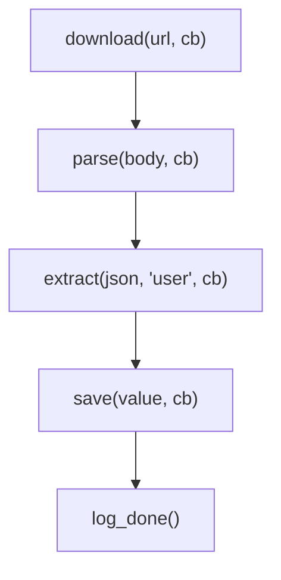
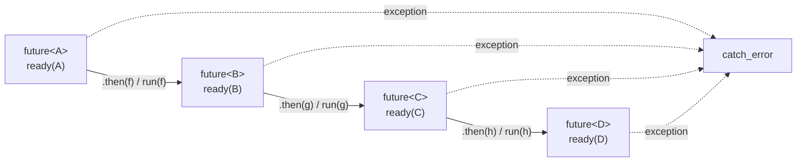
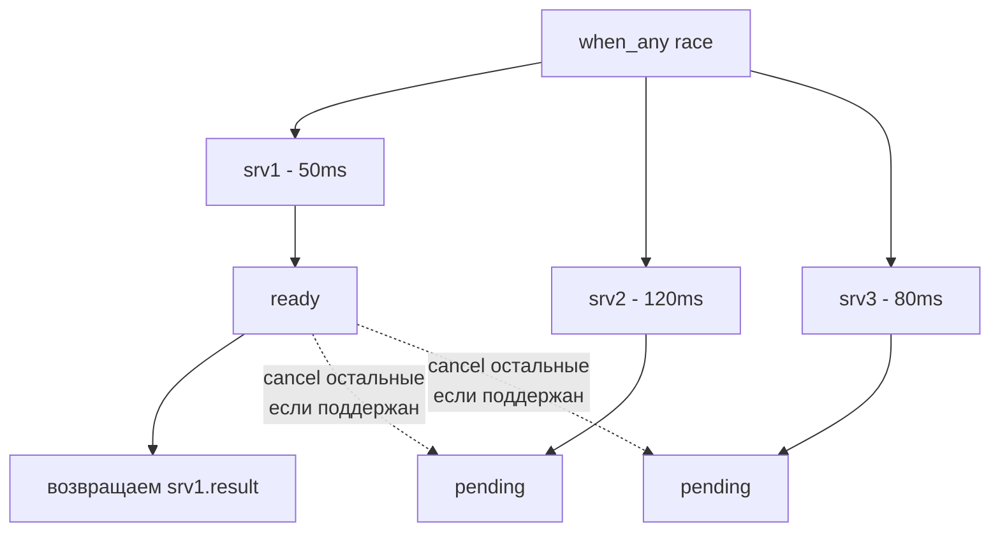

# Future / Promise: асинхронность без callback hell

Когда программа выполняет I/O — читает файл, ходит в сеть, ждёт ответа от другого потока — естественное желание не блокировать
весь поток на это время. Исторически решение писалось через callbacks: «вот функция, вызови её, когда результат будет готов».
Этот подход быстро превращается в **pyramid of doom** — вложенные лямбды, в которых сложно отследить поток данных и
обработку ошибок:

```cpp
download(url, [](Response r) {
    parse(r.body, [](Json j) {
        extract(j, "user", [](Value v) {
            save(v, [](bool ok) {
                if (ok) log("done");
                else    log("failed");
            });
        });
    });
});
```

Future/Promise делает то же самое линейно:

```cpp
download(url)
    .then(parse)
    .then([](Json j){ return extract(j, "user"); })
    .then(save)
    .then([](bool ok){ log(ok ? "done" : "failed"); });
```

Идея родилась в Multilisp (1985) под именем `future`, развилась в Twisted's Deferred (Python, 2002), достигла зрелости в
.NET Task (2010) и пришла в C++ как `std::future` / `std::promise` в C++11. Параллельно появились JavaScript Promise,
Java CompletableFuture, Rust Future + async/await. Везде та же модель: пара объектов, один пишет, другой читает.

## Понятия

В сердце абстракции лежат три сущности:

- **Promise** — write-end. Производитель устанавливает результат через `set_value()` или `set_exception()` ровно один раз.
- **Future** — read-end. Потребитель забирает результат через `get()` (блокирующий) или регистрирует continuation
  через `then(callback)` (не-блокирующий).
- **Shared state** — общая структура между promise и future. Содержит результат (значение или исключение), флаг
  готовности и список ожидающих потоков/continuations.

```
                       ┌─────────────────────────────────┐
                       │         shared state            │
                       │                                 │
    Producer           │  result: T | exception_ptr      │          Consumer
    ────────           │  ready:  false → true           │          ────────
                       │  mutex                          │
   ┌─────────┐         │  condition_variable             │         ┌─────────┐
   │ Promise │ ──set──▶│  waiters: [thread1, thread2]    │◀──get── │ Future  │
   │ <T>     │         │  continuations: [cb1, cb2]      │         │ <T>     │
   └─────────┘         └─────────────────────────────────┘         └─────────┘
        │                          ▲     ▲                              │
        │                          │     │                              │
        └──── owns write-end ──────┘     └────────── owns read-end ─────┘
```

Shared state живёт столько, сколько живут оба конца, поэтому в большинстве реализаций он держится через `shared_ptr`.
Promise гарантирует, что в shared state будет записан **ровно один** результат: повторный вызов `set_value` бросает
`promise_already_satisfied`. Future, наоборот, по умолчанию **one-shot**: после `get()` он становится invalid.

## std::future / std::promise basics

В C++11 базовый API живёт в `<future>`:

```cpp
#include <future>
#include <thread>

std::promise<int> p;
std::future<int> f = p.get_future();

std::thread producer([&p]{
    int result = heavy_computation();
    p.set_value(result);                // или p.set_exception(...)
});

int value = f.get();                    // блокирующее ожидание
producer.join();
```

`f.get()` возвращает значение или **перебрасывает** исключение, установленное через `set_exception`. Это ключевое отличие
от callbacks: исключение не теряется, оно «течёт» по цепочке future до того, кто его реально обработает.

Альтернативы блокирующему `get()`:

| Метод             | Что делает                                                              |
|-------------------|-------------------------------------------------------------------------|
| `f.wait()`        | блокируется до готовности, не забирает результат                        |
| `f.wait_for(d)`   | ждёт не более `d`, возвращает `future_status::{ready,timeout,deferred}` |
| `f.wait_until(t)` | ждёт до момента времени `t`                                             |
| `f.valid()`       | true, если future связан с shared state и `get` ещё не вызывался        |

`wait_for(std::chrono::seconds(0))` — единственный способ сделать non-blocking poll в стандартном API. Это не самый
элегантный hack, но работает.

После `f.get()` future становится invalid. Если нужно много раз читать один и тот же результат — `std::shared_future`:

```cpp
std::shared_future<int> sf = f.share();
auto a = std::async([sf]{ return sf.get() + 1; });   // обе lambdas
auto b = std::async([sf]{ return sf.get() * 2; });   // прочитают значение
```

## std::async

`std::async` — удобный фасад: запустить функцию асинхронно и сразу получить future с её результатом.

```cpp
auto f = std::async(std::launch::async, [](int x){ return x * x; }, 42);
int squared = f.get();                              // 1764
```

Политики запуска:

| Политика                           | Поведение                                                    |
|------------------------------------|--------------------------------------------------------------|
| `std::launch::async`               | гарантированно новый поток (на некоторых impl — thread pool) |
| `std::launch::deferred`            | ленивое выполнение в потоке, вызвавшем `get()`               |
| `async \| deferred` (по умолчанию) | выбор за implementation — обычно нежелательно                |

Подводный камень: future, возвращённый `std::async(launch::async, ...)`, при разрушении **блокируется** до завершения
задачи. То есть `std::async(launch::async, f); /* fire and forget */` — это **не** fire-and-forget, это синхронный вызов
с лишней аллокацией. Чтобы по-настоящему отделить задачу, нужен `std::thread` с `detach` или task queue.

## std::packaged_task

`std::packaged_task<Sig>` — type-erased wrapper для callable, который привязывает к нему future:

```cpp
std::packaged_task<int(int)> task([](int x){ return x * x; });
std::future<int> f = task.get_future();

std::thread t(std::move(task), 7);                  // выполняется в другом потоке
int result = f.get();                               // 49
t.join();
```

`packaged_task` отделяет «упаковку результата в future» от «места запуска». Это базовый кирпич thread pool:
очередь хранит `std::packaged_task<void()>`, рабочие потоки достают и вызывают, клиенту возвращается future.

## Callback hell vs futures

Сравним один и тот же сценарий — скачать страницу, распарсить, извлечь поле, сохранить — в трёх стилях.

**Callbacks (pyramid of doom):**



Каждая ошибка — `if (err) { cb(err); return; }` на каждом уровне. Переменные с верхних уровней либо capture'ятся
в замыкания (лишние аллокации), либо передаются явно через цепочку. Стек-трейс в дебаггере бесполезен — асинхронные
вызовы рвут связь между caller и callee.

**Futures с continuations:**

```cpp
download(url)
    .then(parse)
    .then([](Json j){ return extract(j, "user"); })
    .then(save)
    .catch_error([](std::exception_ptr e){ log_error(e); });
```

Ошибки автоматически «протекают» вниз по цепочке. Если `download` бросил исключение, остальные `.then` пропускаются,
управление прыгает в `.catch_error`.

**C++20 coroutines:**

```cpp
task<void> pipeline(std::string url) {
    try {
        auto body  = co_await download(url);
        auto json  = co_await parse(body);
        auto user  = extract(json, "user");
        co_await save(user);
        log_done();
    } catch (...) {
        log_error(std::current_exception());
    }
}
```

Это уже похоже на обычный синхронный код. `co_await` приостанавливает корутину, освобождая поток, и возобновляет, когда
future становится ready. Под капотом компилятор генерирует state machine, эквивалентную цепочке `.then`.

## Continuations: .then

В стандартном `std::future` continuations **нет** — до P2300 (std::execution, потенциальный C++26). Это главная причина,
почему в production C++ почти никто не использует голый `std::future`. Где они есть:

- **boost::future / boost::shared_future** — исторически первая полноценная реализация: `f.then([](auto f){ ... })`.
- **folly::Future / folly::SemiFuture** (Facebook) — самый богатый API: thenValue, thenError, deferValue, semi/full
  разделение.
- **Concurrencpp** — современная библиотека с executors и result type.
- **HPX::future** — для HPC, distributed continuations.
- **C++ Networking TS** — futures с executors для I/O.
- **std::execution (P2300)** — будущий стандарт, заменит future/promise на sender/receiver model.

Все они следуют одной модели: `then(callback)` возвращает **новый** future, который станет ready, когда callback
отработает. Если callback сам возвращает future — он автоматически «разворачивается» (unwrapping), чтобы цепочка
не становилась `future<future<future<T>>>`.



### P2300 std::execution: senders/receivers модель

`std::future` спроектирован вокруг shared state на куче: пара `promise<T>` + `future<T>` требует одного `shared_ptr`
на `shared_state`, даже если результат вычисляется синхронно в том же потоке. Cancellation в модель не заложен —
producer не имеет способа узнать, что consumer потерял интерес. Composability достигается только через нестандартные
`.then` / `when_all`. P2300 (target C++26, реализован как `stdexec`) переосмысливает асинхронность с нуля: вычисление
описывается **декларативно** как граф ленивых узлов, ничего не запускается до явного `start`, нет ни одной обязательной
heap-аллокации.

Три ключевых концепта:

- **Sender** — описание async вычисления. Это значение (часто stateless lambda или struct), знающее, какие completion
  signatures оно умеет производить: `set_value(T...)`, `set_error(E)`, `set_stopped()`. Sender ничего не делает, пока
  его не **connect**'нут к receiver'у.
- **Receiver** — три callback'а под результат: `set_value(values...)` (успех), `set_error(error)` (ошибка),
  `set_stopped()` (cancellation). Receiver — это «куда положить результат».
- **operation_state** — узел, созданный через `connect(sender, receiver)`. В нём лежит весь state, нужный для
  выполнения (захваченные переменные, вложенные operation_state). `start(op)` запускает вычисление; sender может
  завершиться синхронно прямо внутри `start` или асинхронно через callback.

```
   sender         receiver                    operation_state                callbacks
   ──────         ────────                    ───────────────                ─────────

  ┌────────┐   ┌───────────┐                ┌──────────────────┐         ┌────────────┐
  │ then(  │   │ set_value │                │ child op_state   │ ───▶    │ set_value()│
  │   read,│ + │ set_error │ ─── connect ──▶│ + captured fn    │ ───▶    │ set_error()│
  │   parse│   │ set_stop  │                │ + receiver copy  │ ───▶    │ set_stopped│
  │ )      │   └───────────┘                └──────────────────┘         └────────────┘
  └────────┘                                         │
                                                     ▼
                                                 start(op)
                                                     │
                                                     ▼
                                            начинает работу
```

`connect` строит дерево operation_state в стеке (или в выделенной памяти структурированного scope), без обязательной
динамической аллокации. Sender + receiver — pure data; вся «жизнь» вычисления концентрируется в operation_state, время
жизни которого структурировано caller'ом.

**Algorithms** — building blocks для составления pipeline. Все принимают sender и возвращают новый sender:

| Algorithm                       | Что делает                                                                  |
|---------------------------------|-----------------------------------------------------------------------------|
| `then(s, f)`                    | продолжение: применяет `f` к value-сигналу `s`, возвращает sender нового T  |
| `let_value(s, f)`               | `f` возвращает **новый sender**, который встраивается в pipeline (monadic)  |
| `when_all(s1, s2, ...)`         | fan-in: ждёт все, выдаёт tuple values                                       |
| `schedule(sched)`               | sender, который завершается на executor'е scheduler'а                       |
| `start_detached(s)`             | fire-and-forget: запускает sender, не возвращает future                     |
| `sync_wait(s)`                  | блокирует текущий поток, возвращает `optional<tuple<values...>>`            |
| `upon_error(s, f)`              | обработчик ошибки, аналог `catch`                                           |
| `stopped_as_optional(s)`        | конвертирует `set_stopped` в `optional` без значения                        |

Pipeline через operator `|`:

```cpp
exec::static_thread_pool pool{4};
auto sched = pool.get_scheduler();

auto pipeline =
       schedule(sched)
    |  then([]{ return read_file("config.json"); })
    |  then(parse_json)
    |  let_value([](Json cfg){ return fetch_url(cfg["api"]); })
    |  then(parse_response);

auto [result] = sync_wait(std::move(pipeline)).value();
```

Pipeline — это значение типа sender. Никакие функции не вызваны: `schedule`, `then`, `let_value` лишь строят граф.
Только `sync_wait` (или `start_detached`) делает `connect` + `start` и пинает первый узел.

**Completion signatures** — типобезопасное описание возможных исходов sender'а. Каждый sender экспортирует список
`completion_signatures<set_value_t(T...), set_error_t(E1), set_error_t(E2), set_stopped_t()>`. Algorithms требуют, чтобы
receiver был способен принять все возможные completion'ы своего sender'а. Это даёт compile-time проверку: нельзя
скомпоновать sender, возможно бросающий `parse_error`, с receiver'ом, не умеющим обработать эту ошибку — иначе
ошибка типа.

**Cancellation через stop_token.** В receiver вшит `get_stop_token` (через environment). Scheduler или explicit
запрос может перевести operation_state в stopped state — sender обязан после получения запроса завершиться через
`set_stopped` вместо `set_value`. В отличие от `std::future`, который продолжит работать и выкинуть результат, P2300
sender **знает**, что его не ждут, и может корректно отменить I/O, освободить ресурсы.

```
   Structured scope

   ┌───────────┐
   │ stop_src  │──────────── stop_token ───────────┐
   └───────────┘                                   │
         │                                         ▼
         │            ┌──────────────────────────────────────┐
         └─request──▶ │ operation_state (root)               │
                      │   ├─ child op_state (read_file)      │
                      │   ├─ child op_state (parse_json)     │
                      │   └─ child op_state (fetch_url)      │
                      │                                      │
                      │   set_stopped() распространяется     │
                      │   снизу вверх, освобождая ресурсы    │
                      └──────────────────────────────────────┘

   scope.spawn(...) гарантирует, что nested child закончится
   до того, как parent выйдет из scope (structured concurrency)
```

**Structured concurrency** — `async_scope` / `nested_scope` гарантируют, что parent operation_state не разрушится,
пока живут все child operations. Это убирает целый класс багов «promise разрушен, а thread всё ещё пишет в его
state» — компилятор и type system заставляют вкладывать lifetimes как stack frames.

**Связь с C++20 coroutines.** Любой sender автоматически awaitable: `co_await sender` приостанавливает корутину,
connect'ит sender к специальному receiver'у, который возобновляет корутину при `set_value`. И обратно: корутина типа
`task<T>` есть sender. Это даёт два эквивалентных синтаксиса для одной модели:

```cpp
auto run() -> task<int> {
    auto data = co_await (schedule(pool) | then(load_data));
    auto parsed = co_await (just(data) | then(parse));
    co_return parsed.value;
}
```

Реальные реализации:

- **stdexec** (NVIDIA) — reference implementation P2300, header-only, требует C++20. Используется как тестовый
  bed для standards committee.
- **libunifex** (Facebook) — предшественник P2300, основа для практического опыта. Активно используется в Folly
  и проектах Meta.
- **HPX execution** — distributed senders для HPC.

## Combining futures

Реальные сценарии редко состоят из одной цепочки. Чаще нужно:

- **when_all** — дождаться завершения всех future, получить tuple/vector результатов.
- **when_any** — дождаться первого завершившегося.
- **collect / race / select** — те же идеи под разными именами в разных библиотеках.

Классический пример — fan-out к нескольким серверам, использовать первый ответ (hedged request):



И наоборот, fan-out для агрегации — собрать данные из трёх источников, объединить:

```cpp
auto f1 = fetch("/api/users");
auto f2 = fetch("/api/posts");
auto f3 = fetch("/api/comments");

when_all(f1, f2, f3).then([](auto results){
    auto [users, posts, comments] = results;
    return aggregate(users, posts, comments);
});
```

`when_all` не запускает задачи параллельно — задачи **уже** работают параллельно (это породили `fetch`); комбинатор
лишь даёт future, который станет ready, когда все три закончат.

## Реалистичный chaining: futures vs callbacks

Возьмём задачу: по ID пользователя получить профиль, форматировать, сохранить в БД, и параллельно отправить
уведомление, дождавшись обоих результатов.

**С futures:**

```cpp
auto pipeline(int user_id) -> future<void> {
    return fetch_user(user_id)
        .then([](User u){ return get_profile(u.id); })
        .then([](Profile p){
            auto saved = save_to_db(format(p));
            auto notified = send_notification(p.email);
            return when_all(saved, notified);
        })
        .then([](auto){ log("pipeline ok"); })
        .catch_error([](std::exception_ptr e){ log_error(e); });
}
```

**С callbacks (то же самое):**

```cpp
void pipeline(int user_id, std::function<void(bool)> done) {
    fetch_user(user_id, [done](std::optional<User> u, Error e) {
        if (e) { log_error(e); done(false); return; }
        get_profile(u->id, [done](std::optional<Profile> p, Error e) {
            if (e) { log_error(e); done(false); return; }
            auto formatted = format(*p);
            auto state = std::make_shared<std::atomic<int>>(0);
            save_to_db(formatted, [done, state](Error e) {
                if (e) { log_error(e); done(false); return; }
                if (++*state == 2) { log("pipeline ok"); done(true); }
            });
            send_notification(p->email, [done, state](Error e) {
                if (e) { log_error(e); done(false); return; }
                if (++*state == 2) { log("pipeline ok"); done(true); }
            });
        });
    });
}
```

`state` появился, потому что обе ветки fan-out должны договориться, кто из них последний — и значит, должен дёрнуть
`done`. С futures та же логика лежит внутри `when_all`. Каждый раз, когда вы пишете callback, который должен дождаться
другого callback'а, вы переизобретаете кусочек future/promise — обычно хуже.

## Упрощённая реализация shared state

Чтобы понять, что внутри `std::future`, достаточно собрать минимальный аналог. Shared state — это `mutex` + `cv` +
variant с результатом:

```cpp
template <typename T>
struct shared_state {
    std::mutex m;
    std::condition_variable cv;
    std::variant<std::monostate, T, std::exception_ptr> result;
    bool ready = false;
};
```

Promise держит `shared_ptr` на state и умеет писать:

```cpp
template <typename T>
class promise {
    std::shared_ptr<shared_state<T>> state_;
public:
    promise() : state_(std::make_shared<shared_state<T>>()) {}

    future<T> get_future() { return future<T>(state_); }

    void set_value(T v) {
        std::lock_guard lk(state_->m);
        if (state_->ready) throw std::future_error(/*already_satisfied*/);
        state_->result.template emplace<1>(std::move(v));
        state_->ready = true;
        state_->cv.notify_all();
    }

    void set_exception(std::exception_ptr e) {
        std::lock_guard lk(state_->m);
        if (state_->ready) throw std::future_error(/*already_satisfied*/);
        state_->result.template emplace<2>(e);
        state_->ready = true;
        state_->cv.notify_all();
    }
};
```

Future держит тот же `shared_ptr` и умеет ждать:

```cpp
template <typename T>
class future {
    std::shared_ptr<shared_state<T>> state_;
public:
    explicit future(std::shared_ptr<shared_state<T>> s) : state_(std::move(s)) {}

    T get() {
        std::unique_lock lk(state_->m);
        state_->cv.wait(lk, [&]{ return state_->ready; });
        if (auto* e = std::get_if<2>(&state_->result))
            std::rethrow_exception(*e);
        T v = std::move(std::get<1>(state_->result));
        state_.reset();                               // one-shot
        return v;
    }
};
```

Поток, вызвавший `get()`, засыпает на condition variable. Поток, вызвавший `set_value`, делает `notify_all`. Это
тот же паттерн, что и обычная производитель-потребитель синхронизация — просто упакованный в две стороны одного
объекта.

`then` — где он есть — устроен похоже: вместо засыпания на cv в shared state хранится список continuations,
которые вызываются при `set_value`. Где они выполняются — в потоке, вызвавшем `set_value`, или на executor'е,
переданном в `then`, — определяется implementation.

!!! example "Рабочий пример"
    Полные компилируемые демонстрации:

    - `std::future` / `std::promise` / `std::async` / `std::packaged_task`: `examples/q13_future_promise/future_demo.cpp`
    - собственная реализация future/promise поверх mutex + condition variable: `examples/q14_future_impl/my_future.cpp`

    Собрать и запустить: `cd examples && make q13 q14 && ./bin/q13_future_promise`

## std::shared_future: multi-consumer вариант

`std::future` — one-shot: `get()` забирает значение и делает future invalid. Для сценариев, где результат должен быть
прочитан несколько раз или несколькими потоками, нужен `std::shared_future<T>`. Он держит тот же shared_state, но
ref-counted, и `get()` не очищает state — значение остаётся доступным сколько угодно раз.

```cpp
std::promise<int> p;
std::future<int> f = p.get_future();

std::shared_future<int> sf = f.share();          // f теперь invalid
auto sf2 = sf;                                   // копия — refcount++

std::thread([sf]{ log("worker1 sees: " + std::to_string(sf.get())); }).detach();
std::thread([sf2]{ log("worker2 sees: " + std::to_string(sf2.get())); }).detach();

p.set_value(42);                                 // оба worker'а увидят 42
```

Типичный use case — broadcast результата: один producer вычисляет (например, парсит конфиг при старте), много worker'ов
ждут готовности. `std::shared_future` дешевле, чем класть результат в `std::atomic<shared_ptr<T>>` с условной
переменной отдельно — вся синхронизация уже зашита в shared_state.

```
                ┌─────────────────────────────────┐
                │         shared_state            │
                │  result: 42                     │
                │  refcount: 3 (atomic)           │
                │  ready: true                    │
                └─────────────────────────────────┘
                    ▲           ▲            ▲
                    │           │            │
              ┌─────┴────┐ ┌────┴─────┐ ┌────┴─────┐
              │ shared_  │ │ shared_  │ │ shared_  │
              │ future#1 │ │ future#2 │ │ future#3 │
              └──────────┘ └──────────┘ └──────────┘
                  thread A     thread B     thread C
                  get()→42     get()→42     get()→42
```

Под капотом каждый `shared_future` хранит `shared_ptr<shared_state>` — копирование = atomic increment рефсчётчика.
Это дешевле полного `mutex` lock, но не бесплатно: на горячем пути с миллионами копий контентация на refcount
становится заметной (классическая проблема `shared_ptr` под большой нагрузкой). При уничтожении последнего
`shared_future` shared_state освобождается.

Отличия от `std::future`:

| Свойство               | `std::future`              | `std::shared_future`            |
|------------------------|----------------------------|---------------------------------|
| Копирование            | не копируется              | копируется (refcount++)         |
| `get()` после первого  | UB                         | возвращает то же значение       |
| Wait одновременно      | нельзя (один владелец)     | можно из многих потоков         |
| Конверсия              | `.share()` → shared_future | финальная форма                 |
| Размер object          | 1 указатель                | 1 указатель + atomic refcount   |

## std::packaged_task internals в libstdc++

`std::packaged_task<R(Args...)>` отделяет «упаковать результат в future» от «выбрать место и время выполнения». Внутри
это два type-erased поля: shared_state, в который пойдёт результат, и callable, который будет вызван. Упрощённая
реализация — это около 50 строк:

```cpp
template <typename Sig> class packaged_task;

template <typename R, typename... Args>
class packaged_task<R(Args...)> {
    std::shared_ptr<shared_state<R>> state_;
    std::function<R(Args...)> fn_;

public:
    template <typename F>
    explicit packaged_task(F&& f)
        : state_(std::make_shared<shared_state<R>>())
        , fn_(std::forward<F>(f)) {}

    packaged_task(packaged_task&&) noexcept = default;
    packaged_task& operator=(packaged_task&&) noexcept = default;
    packaged_task(const packaged_task&) = delete;

    future<R> get_future() { return future<R>(state_); }

    void operator()(Args... args) {
        if (!state_) throw std::future_error(/*no_state*/);
        try {
            if constexpr (std::is_void_v<R>) {
                fn_(std::forward<Args>(args)...);
                state_->set_value();
            } else {
                state_->set_value(fn_(std::forward<Args>(args)...));
            }
        } catch (...) {
            state_->set_exception(std::current_exception());
        }
    }

    void reset() {
        state_ = std::make_shared<shared_state<R>>();
    }
};
```

`std::function` — это второй уровень type erasure. Для большинства callable он сам делает heap allocation (small
buffer optimization работает только для совсем мелких объектов, обычно ≤ 16–24 байт). То есть один `packaged_task`
= **две** heap allocations: одна на `shared_state`, одна на closure внутри `std::function`. В libstdc++ реализация
оптимизирована (`std::function` имеет inline storage на ~16 байт), но для лямбд с захватом по значению этого мало.

Связь с thread pool: рабочая очередь хранит `std::packaged_task<R()>` (либо `std::function<void()>`-обёртку вокруг
`packaged_task` для type erasure по R), workers достают и вызывают `()`, клиент получает `future<R>` для ожидания
результата. См. [Thread pool](thread_implementation_clone.md) для полной картины.

## Стоимость аллокаций

Каждая пара `promise<T>` + `future<T>` = одна heap allocation на shared_state. На современном glibc malloc это
~50–100 нс на горячем пути (если попадает в tcache), но добавляется атомарный refcount у `shared_ptr` и
cache-line bouncing при копировании в другой поток. Для рутинного «запустить функцию в потоке» это незаметно. Для
высокочастотного async — миллион tasks/sec, реактивные системы, network event loops — это становится bottleneck.

Декомпозиция стоимости одного `std::async`:

```
   std::async(launch::async, fn, args...)
        │
        ├─ allocate shared_state           ~  50–100 ns  (malloc + ctor)
        ├─ allocate packaged_task closure  ~  30–80  ns  (std::function)
        ├─ spawn thread (clone syscall)    ~  10–50  μs  (×1000 раз дороже!)
        └─ return future                   ~  10     ns
```

Поток создать в тысячу раз дороже самой аллокации — поэтому `std::async` без thread pool редко используется в
production. С готовым thread pool остаётся два allocation'а на каждую задачу.

Способы убрать overhead:

- **Pool allocator для shared_state.** Переопределить `operator new`/`operator delete` для конкретного типа
  `shared_state<T>` через arena, выделяющую блоки фиксированного размера без обращения к глобальному malloc.
  Folly использует intrusive refcount прямо в state, убирая отдельный control block `shared_ptr`.
- **Inline shared_state.** Если время жизни future полностью вложено в caller'а, state можно положить на стек
  caller'а — это то, что делает coroutine frame: его «promise type» аллоцируется при создании корутины
  один раз, и future-подобные suspension точки переиспользуют то же место.
- **P2300 senders.** Lazy by design: `then(s, f)` не создаёт state — только хранит lambda по значению. Все
  intermediate operation_state встроены в один монолитный объект внутри финального `connect`. Heap allocation
  возникает только если pipeline явно требует — например, `start_detached` без явного scope.

Микробенчмарк (gcc 13, x86-64, thread pool с готовыми воркерами):

| Подход                                       | Latency на task   | Allocations |
|----------------------------------------------|-------------------|-------------|
| `std::future<int>` + `std::promise<int>`     | ~150 ns           | 1           |
| `std::packaged_task<int()>` через pool       | ~250 ns           | 2           |
| `folly::Future<int>` (intrusive refcount)    | ~80 ns            | 1           |
| `stdexec::then(just(), fn)` + `sync_wait`    | ~5 ns             | 0           |
| Прямой вызов функции (для сравнения)         | ~1 ns             | 0           |

Разрыв между sender'ом и `std::future` объясняется не «магией» — sender просто не делает того, что делает future:
не выделяет shared_state, не атомарно меняет refcount, не уведомляет condition variable. Он встроен в код caller'а
как обычная ленивая структура и развёртывается компилятором в эквивалент написанного вручную state machine.

## Недостатки std::future / std::promise

После C++11 стало понятно, что базовый API закрывает не всё:

- **Нет `.then`** в стандарте до P2300. Без continuations futures имеют смысл только как «жди ровно одного результата
  из другого потока».
- **`get()` обязан блокировать.** Нет non-blocking poll, кроме `wait_for(0s)` — это работает, но это hack.
- **Shared state — heap-аллокация через `shared_ptr`.** Для миллионов мелких задач (как в реактивных системах) это
  дорого. Folly решает через intrusive ref count, P2300 — через sender/receiver без аллокации вовсе.
- **Не cancellable.** Нельзя сказать future «отмени задачу, я не жду больше». Producer продолжит работать и потеряет
  результат «в никуда».
- **Не композируемы.** `when_all`, `when_any`, `then` — всё это вне стандарта.
- **Не интегрированы с executors.** Нет ответа на вопрос «где исполнится continuation?» — в текущем потоке? в том,
  где set_value? в thread pool? P2300 делает executor частью сигнатуры.
- **Нет статической защиты lifetime.** Можно вызвать `get()` второй раз и получить UB; компилятор не поможет.

Из-за этого в production C++ напрямую `std::future`/`std::promise` используют редко. Их роль — низкоуровневый
примитив, чтобы написать что-то более полезное (или backend для `std::async`).

## Что использовать в production

| Решение                       | Где использовать                                          |
|-------------------------------|-----------------------------------------------------------|
| **C++20 coroutines**          | новый код; `co_await` поверх любого awaitable             |
| **folly::Future**             | Facebook-стек; самый зрелый API с then/collect/SemiFuture |
| **stdexec / P2300**           | будущее стандарта; sender/receiver model с executors      |
| **asio (Boost / standalone)** | I/O-bound, networking; executors + completion tokens      |
| **concurrencpp**              | general-purpose async с executors и result type           |
| **HPX**                       | HPC, distributed computing                                |

`std::future` остаётся уместным, когда задача буквально одна: «запустить функцию в потоке, дождаться ровно одного
результата». Для всего остального — coroutines поверх какого-то executor framework.

## Связанные темы

- [Thread pool](thread_implementation_clone.md) — где исполняются async-задачи; `packaged_task` — клей между ним и future
- [setjmp/longjmp и ucontext](userspace_context_switching.md) — основа stackful coroutines, альтернатива future-based async
- [Синхронизация: мьютексы, семафоры, futex](thread_synchronization.md) — `condition_variable` под капотом `future::wait`
- [Atomics и memory model](atomics_and_memory_model.md) — happens-before для передачи результата через shared state

## Источники

- Anthony Williams, «C++ Concurrency in Action», 2nd ed., Chapter 4 — futures, promises, packaged_task
- [cppreference: `<future>`](https://en.cppreference.com/w/cpp/thread#Futures)
- [folly::Future documentation](https://github.com/facebook/folly/blob/main/folly/docs/Futures.md)
- [P2300R10 — std::execution](https://www.open-std.org/jtc1/sc22/wg21/docs/papers/2024/p2300r10.html)
- Eric Niebler, [«A Unifying Abstraction for Async in C++»](https://ericniebler.com/2020/11/08/structured-concurrency/)
- Bartosz Milewski, [«Broken promises — C++0x futures»](https://bartoswiniarski.wordpress.com/) — критика базового API
