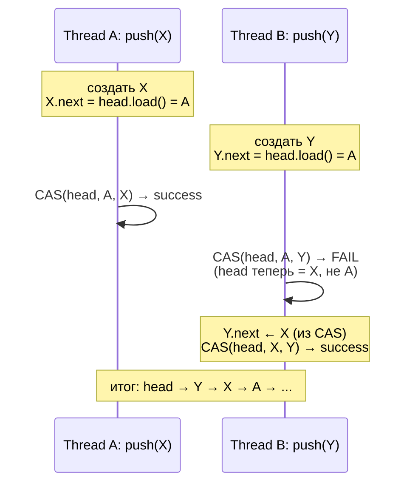
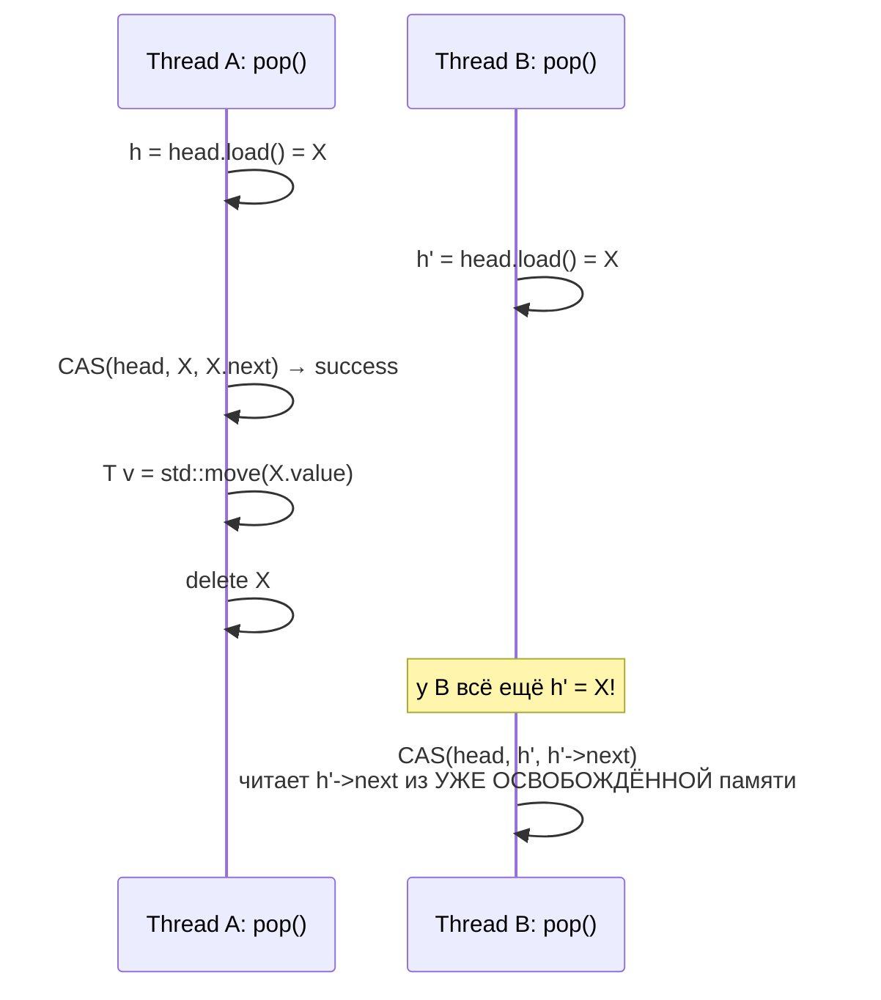
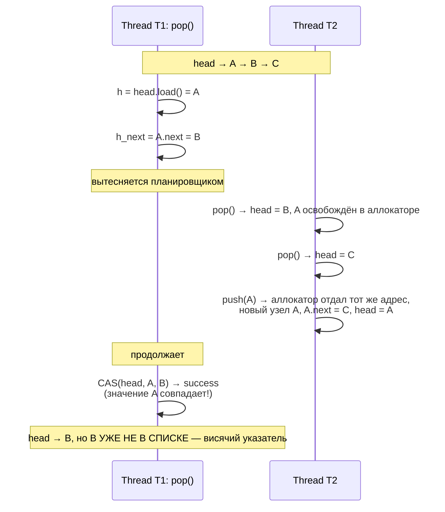
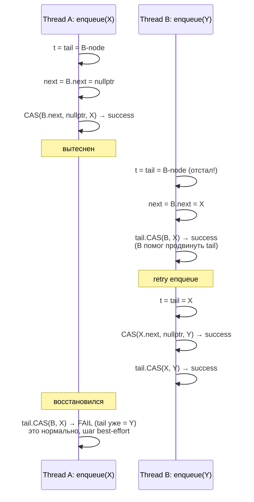
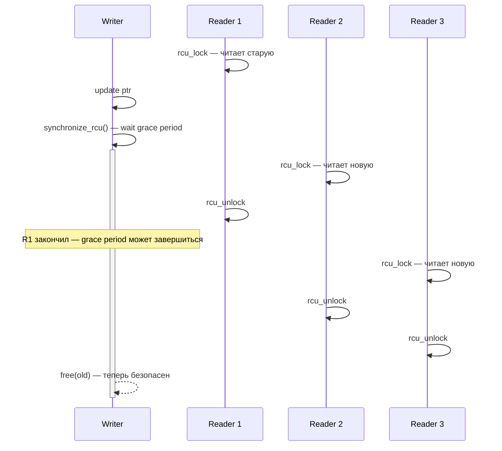
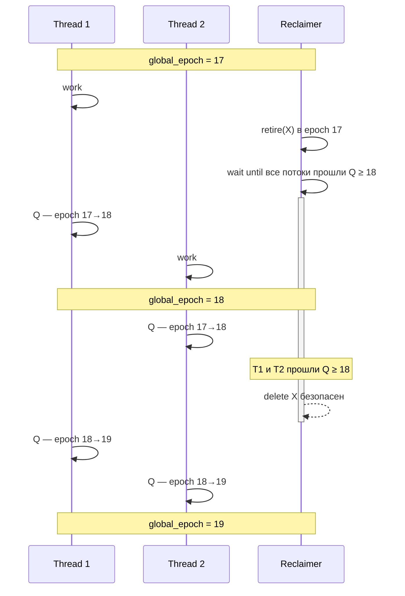

# Lock-free структуры данных

Мьютекс сериализует исполнение: пока один поток держит lock, все остальные ждут. Под высокой нагрузкой это не просто
медленно — это создаёт классы багов, которых нет в однопоточном коде. Поток с захваченным mutex'ом, вытесненный
планировщиком, держит всех остальных. Низкоприоритетный поток внутри критической секции блокирует высокоприоритетный —
**priority inversion**. Два потока, захватывающие пару mutex'ов в разном порядке, образуют **deadlock**. Поток, упавший
с SIGSEGV под mutex'ом, оставляет lock навсегда захваченным.

Lock-free структуры решают эти проблемы радикально: они **не используют блокировки**. Вместо ожидания на mutex'е
потоки соревнуются за обновление через атомарные операции (CAS, fetch_add, exchange), повторяя попытку при провале.
Гарантируется: даже если один поток умер посреди операции, остальные продолжают делать прогресс.

Цена — сложность. Lock-free код доказывается через формальную модель памяти, а не «прогнать тесты на x86». Главная
проблема, отсутствующая в lock-based коде — **memory reclamation**: когда безопасно удалить узел, если другой поток
мог только что прочитать на него указатель, но ещё не разыменовал его?

## Иерархия progress guarantees

Параллельный алгоритм классифицируется по тому, какую гарантию прогресса он даёт под произвольным interleaving'ом
потоков и при возможности их остановки в любой момент.

```
   слабее                                                              сильнее
   ◀─────────────────────────────────────────────────────────────────────────▶

      blocking          obstruction-free        lock-free         wait-free
   ┌──────────────┐    ┌──────────────┐    ┌──────────────┐    ┌──────────────┐
   │  поток может │    │  поток       │    │  хотя бы 1   │    │  каждый      │
   │  застрять    │    │  завершит,   │    │  поток       │    │  поток       │
   │  навсегда    │    │  если работа-│    │  завершает   │    │  завершает   │
   │              │    │  ет один     │    │  за конечное │    │  за конечное │
   │  mutex,      │    │              │    │  время       │    │  число шагов │
   │  spinlock    │    │  STM,        │    │              │    │              │
   │              │    │  obstruction-│    │  CAS-loop    │    │  Herlihy's   │
   │  deadlock    │    │  free queues │    │  без помощи  │    │  universal   │
   │  возможен    │    │              │    │  другим      │    │  construction│
   └──────────────┘    └──────────────┘    └──────────────┘    └──────────────┘
```

| Уровень          | Гарантия                                                                  | Примеры                                       |
|------------------|---------------------------------------------------------------------------|-----------------------------------------------|
| Blocking         | Поток внутри критической секции тормозит всех остальных                   | mutex, semaphore, spinlock                    |
| Obstruction-free | Поток завершит операцию, если ему дать поработать в одиночестве           | STM, double-ended queue Herlihy/Luchangco     |
| Lock-free        | Хотя бы один поток системы завершает операцию за конечное число шагов     | Treiber stack, Michael-Scott queue            |
| Wait-free        | Каждый поток завершит свою операцию за **известное** число шагов          | wait-free queue Kogan-Petrank, atomic counter |

Lock-free **не** значит «без mutex'а» в обывательском смысле. Spinlock не lock-free —
если поток с захваченным flag'ом вытесняется, остальные крутят пустой цикл бесконечно. Lock-freedom — это математическое
свойство: невозможна ситуация, когда система целиком стоит, не делая прогресса.

Wait-freedom — сильнейшее свойство, но дорогое: требует, чтобы потоки **помогали** друг другу завершать операции
(announce-help-resolve pattern). Большинство практических lock-free структур не wait-free, а просто lock-free —
этого хватает почти всегда.

## Treiber stack

Простейшая lock-free структура — стек из односвязного списка с атомарным указателем на голову. Описана R. K. Treiber
в IBM Research Report (1986).

```
         ┌─────┐    ┌─────┐    ┌─────┐
 head ─▶ │  A  │ ─▶ │  B  │ ─▶ │  C  │ ─▶ nullptr
         └─────┘    └─────┘    └─────┘

push(X):  создать узел X, X.next = head, CAS(head, X.next, X)
pop():    h = head, CAS(head, h, h.next), вернуть h.value
```

Операции в коде:

```cpp
template <typename T>
class TreiberStack {
    struct Node {
        T value;
        Node* next;
    };
    std::atomic<Node*> head{nullptr};

public:
    void push(T value) {
        Node* n = new Node{std::move(value),
                           head.load(std::memory_order_relaxed)};
        while (!head.compare_exchange_weak(
                   n->next, n,
                   std::memory_order_release,
                   std::memory_order_relaxed)) {
            // n->next обновлён CAS'ом до актуального head; повторяем
        }
    }

    std::optional<T> pop() {
        Node* h = head.load(std::memory_order_acquire);
        while (h && !head.compare_exchange_weak(
                        h, h->next,
                        std::memory_order_acquire,
                        std::memory_order_acquire)) {
            // h обновлён до актуального head; повторяем
        }
        if (!h) return std::nullopt;
        T v = std::move(h->value);
        delete h;                       // ОПАСНО! см. ниже
        return v;
    }
};
```

Параллельный push'и двух потоков:



Память освобождает поток, выполнивший pop. И вот тут проблема: между `head.load()` потока B и `delete h` потока A
может произойти такая последовательность:



Это **use-after-free**. Узел `X` уже удалён потоком A, но поток B держит на него указатель и собирается разыменовать.
На практике может выстрелить чем угодно: SIGSEGV, прочитанным мусором, или (хуже) тем самым `X`, который аллокатор
успел отдать кому-то ещё.

**Memory reclamation problem** — общая для всех lock-free структур с динамически выделяемыми узлами. Без её решения
lock-free стек корректен только если узлы **никогда не освобождаются** (например, аллоцируются из пула, который живёт
до конца программы).

### Memory ordering в Treiber stack

Почему именно такие ordering'и:

- **push**, success branch: `release` — публикуем содержимое нового узла (поле `value`, поле `next`) другому потоку,
  который сделает `pop` и acquire-load голову.
- **push**, failure branch: `relaxed` — `n->next` обновляется CAS'ом, мы не читаем никаких разделённых данных при провале.
- **pop**, success branch: `acquire` — читаем `h->value`, которое было опубликовано push'ом через release-store.
- **pop**, failure branch: `acquire` — `h` обновляется до текущего head; нам всё равно понадобится acquire для
  последующего чтения `h->value`, поэтому он не дороже relaxed на провале.

`compare_exchange_weak` вместо strong: на ARM/POWER strong внутренне крутит цикл, чтобы спрятать spurious fail. У нас
свой цикл — нет смысла платить дважды. На x86 разницы нет.

### Elimination stack (Hendler-Shavit-Yerushalmi, 2004)

Treiber stack деградирует под высокой contention: все потоки бьются за один и тот же head pointer, CAS постоянно
проваливается, cache line летает между ядрами. На 32 потоках throughput не растёт — он падает относительно single-thread
из-за coherence traffic.

Идея elimination stack — наблюдение: `push(X)` и `pop()`, выполненные одновременно, эквивалентны прямой передаче `X`
от push'а к pop'у, минуя структуру. Стек вообще не нужно трогать. Если два потока встречаются на elimination array,
они «сокращаются» — один отдаёт значение, другой забирает, оба завершают операцию без касания head.

```
   ┌─────────────────────────────────────────────────────────────────┐
   │                       Treiber stack head                        │
   │                              ▲                                  │
   │           CAS fail ─┐        │ ┌─ CAS fail                      │
   │                     │        │ │                                │
   │                  push(X)   pop()                                │
   │                     │        │ │                                │
   │                     ▼        │ ▼                                │
   │  ┌──────────────────────────────────────────────────┐           │
   │  │ elimination array (size ≈ N_CPU)                 │           │
   │  │  slot[0] │ slot[1] │ slot[2] │ ... │ slot[N-1]   │           │
   │  │   EMPTY  │  WAIT:X │  EMPTY  │ ... │   EMPTY     │           │
   │  └──────────┴────┬────┴─────────┴─────┴─────────────┘           │
   │                  │  pop встречает waiting push                  │
   │                  ▼                                              │
   │           eliminated: X передан напрямую,                       │
   │           head вообще не тронут                                 │
   └─────────────────────────────────────────────────────────────────┘
```

Каждый slot — atomic с тремя состояниями: `EMPTY`, `WAITING(value)` (push ждёт pop'а), `BUSY` (идёт сам обмен).
Алгоритм:

```cpp
template <typename T>
class EliminationStack {
    static constexpr int ELIM_SIZE = 64;
    static constexpr int SPIN_LIMIT = 100;

    struct Slot {
        std::atomic<uintptr_t> state{EMPTY};   // EMPTY | WAITING | BUSY
        T value;
    };
    alignas(64) std::atomic<Node*> head{nullptr};
    std::array<Slot, ELIM_SIZE> elim;

    int random_slot() { return rand() % ELIM_SIZE; }

public:
    void push(T value) {
        Node* n = new Node{std::move(value), nullptr};
        while (true) {
            n->next = head.load(acquire);
            if (head.compare_exchange_weak(n->next, n, release, relaxed))
                return;
            // CAS fail — пробуем elimination
            int idx = random_slot();
            Slot& s = elim[idx];
            uintptr_t expected = EMPTY;
            s.value = n->value;
            if (s.state.compare_exchange_strong(expected, WAITING)) {
                for (int i = 0; i < SPIN_LIMIT; ++i) {
                    if (s.state.load(acquire) == BUSY) {
                        // pop забрал — выходим без касания head
                        s.state.store(EMPTY, release);
                        delete n;
                        return;
                    }
                    cpu_relax();
                }
                // никто не пришёл — отменяем
                if (s.state.compare_exchange_strong(
                        (expected = WAITING), EMPTY))
                    continue;             // обратно к CAS на head
                // кто-то всё-таки забрал в последний момент
                s.state.store(EMPTY, release);
                delete n;
                return;
            }
        }
    }

    std::optional<T> pop() {
        while (true) {
            Node* h = head.load(acquire);
            if (h && head.compare_exchange_weak(h, h->next, acquire, acquire)) {
                T v = std::move(h->value);
                retire(h);
                return v;
            }
            // CAS fail или пусто — смотрим elimination array
            int idx = random_slot();
            Slot& s = elim[idx];
            uintptr_t st = s.state.load(acquire);
            if (st == WAITING &&
                s.state.compare_exchange_strong(st, BUSY)) {
                T v = std::move(s.value);
                // push сам сбросит state в EMPTY
                return v;
            }
        }
    }
};
```

Размер array — около числа ядер. Слишком маленький — слабая elimination rate; слишком большой — низкая вероятность
встречи push с pop в одном слоте. Под high contention elimination stack масштабируется почти линейно с числом ядер:
большинство пар push/pop вообще не доходят до head, traffic на главной cache line падает в N раз.

Под низкой contention overhead минимален: CAS на head проходит с первой попытки, до elimination array дело не доходит.

### Exponential backoff при CAS failure

Tight CAS-loop под contention — антипаттерн: проваленный CAS означает, что cache line с head только что обновили,
наша копия инвалидирована, перечитывание и повторный CAS почти гарантированно опять провалятся. Десятки тысяч CAS в
секунду на ядро при нулевом прогрессе — типичная картина без backoff.

Backoff — пауза между попытками, растущая с числом подряд идущих провалов. Идея взята из Ethernet CSMA/CD: чем больше
collisions, тем дольше ждём перед retransmit.

```
   contention rate                 без backoff       с exp. backoff
   ┌──────────────┬──────────────────────────────┬──────────────────┐
   │  1 поток     │  ✓ throughput nominal        │  ✓ nominal       │
   │  4 потока    │  throughput × 0.8            │  ✓ × 1.0         │
   │  16 потоков  │  throughput × 0.3            │  ✓ × 0.9         │
   │  64 потока   │  throughput × 0.05 (collapse)│ × 0.7            │
   └──────────────┴──────────────────────────────┴──────────────────┘
```

Простой bounded exponential backoff:

```cpp
class Backoff {
    static constexpr int MIN_DELAY = 1;     // CPU cycles
    static constexpr int MAX_DELAY = 1024;
    int limit = MIN_DELAY;

public:
    void operator()() {
        int delay = rand() % limit;
        for (int i = 0; i < delay; ++i)
            cpu_relax();                    // _mm_pause() / yield
        if (limit < MAX_DELAY)
            limit <<= 1;                    // удваиваем для следующего раза
    }
    void reset() { limit = MIN_DELAY; }
};

void push(T value) {
    Node* n = new Node{std::move(value), nullptr};
    Backoff bo;
    while (true) {
        n->next = head.load(relaxed);
        if (head.compare_exchange_weak(n->next, n, release, relaxed))
            return;
        bo();                               // подождать перед retry
    }
}
```

`cpu_relax()` на x86 — это `PAUSE` (`F3 90`), на ARM — `YIELD`. Инструкция говорит CPU: я в spin-wait, можно отдать
ресурсы другому SMT-thread'у, не пред-загружать speculative branches, экономить энергию. Без `PAUSE` busy-wait
выжигает branch predictor и греет ядро на холостом ходу.

Cap верхней границы (`MAX_DELAY`) защищает от starvation: с неограниченным backoff поток, регулярно проигрывающий
CAS-гонку, мог бы ждать секунды. Real-world значение cap — порядок миллисекунды (`1024` cycles при 1 GHz ≈ 1 µs,
обычно подбирается под latency target).

Backoff используется повсеместно: glibc `pthread_mutex` adaptive spinning перед futex syscall, JVM `ConcurrentHashMap`
при contention на bucket, mimalloc atomic ops, Linux kernel `qspinlock`. На uncontended path backoff не активируется
(первый CAS успешен) — overhead нулевой.

!!! example "Рабочий пример"
    Полная компилируемая реализация Treiber stack (lock-free push/pop через CAS): `examples/q18_treiber_stack/treiber_stack.cpp` — собрать и запустить: `cd examples && make q18 && ./bin/q18_treiber_stack`.

## ABA-проблема в Treiber stack

CAS сравнивает значения, не идентичность. ABA подробно разобрана в
[Atomic operations и memory model](atomics_and_memory_model.md) — кратко напомним суть в контексте
stack'а:



T1 проверил, что head всё ещё равен A, и считает, что список не менялся. На деле A был удалён и переаллоцирован.
Решения:

| Подход                                  | Идея                                                                 |
|-----------------------------------------|----------------------------------------------------------------------|
| Tagged pointer (ABA tag)                | (ptr, counter) пара в одном слове, инкремент counter при каждом push |
| DWCAS (`CMPXCHG16B`)                    | 128-битный CAS — позволяет полноценный 64-bit ptr + 64-bit tag       |
| Hazard pointers                         | Не переиспользовать узел, пока кто-то на него смотрит                |
| RCU (read-copy-update)                  | Отложенный delete после grace period                                 |
| Epoch-based reclamation                 | Узел освобождается только после смены глобального epoch              |
| GC (Java, Go)                           | Узел не переиспользуется, пока есть ссылка                           |

Tagged pointer прост, если 32 бита `tag` достаточно (на 32-bit системе помещается в одно 64-bit слово). На x86-64 с
48-битными виртуальными адресами есть две схемы: поместить tag в верхние 16 бит указателя (рискованно — Intel LAM
и ARM TBI начали использовать эти биты), либо честный 128-битный CAS через `CMPXCHG16B` / `LL/SC` пары.

## Michael-Scott queue

Lock-free FIFO-очередь, опубликованная Maged Michael и Michael Scott в 1996 ([Simple, Fast, and Practical Non-Blocking
and Blocking Concurrent Queue Algorithms](https://www.cs.rochester.edu/u/scott/papers/1996_PODC_queues.pdf)).
До сих пор — основа большинства реализаций lock-free queue в production (`java.util.concurrent.ConcurrentLinkedQueue`,
`boost::lockfree::queue`).

Главная идея — **dummy node** (sentinel) в начале списка, который никогда не извлекается. Это убирает гонки между
случаем пустой очереди и обычным enqueue/dequeue.

```
   Изначально: head = tail = dummy

              ┌────────┐ 
              │ dummy  │
      head ─▶ │ next=⌀ │ ◀─ tail
              └────────┘

   После enqueue(A), enqueue(B):

              ┌───────┐    ┌───┐    ┌───┐ 
      head ─▶ │ dummy │ ─▶ │ A │ ─▶ │ B │ ◀─ tail
              └───────┘    └───┘    └───┘

   dequeue() возвращает A:
   (новый dummy = бывший узел A, освобождён старый dummy)

              ┌───┐    ┌───┐ 
      head ─▶ │ A │ ─▶ │ B │ ◀─ tail
              └───┘    └───┘
```

Псевдокод enqueue:

```cpp
void enqueue(T value) {
    Node* n = new Node{std::move(value), nullptr};
    Node* t;
    Node* next;
    while (true) {
        t = tail.load(acquire);
        next = t->next.load(acquire);
        if (t != tail.load(acquire)) continue;        // tail сдвинулся, перечитать

        if (next == nullptr) {
            // нормальный случай: tail указывает на последний узел
            if (t->next.compare_exchange_weak(next, n,
                    release, relaxed)) {
                // успех — пробуем продвинуть tail (best-effort)
                tail.compare_exchange_strong(t, n, release, relaxed);
                return;
            }
        } else {
            // tail отстал от реальности — помогаем продвинуть
            tail.compare_exchange_strong(t, next, release, relaxed);
        }
    }
}
```

Enqueue делает **два** CAS'а:

```
   шаг 1: CAS(tail->next, nullptr, n)         подсоединить новый узел
   шаг 2: CAS(tail, t, n)                     продвинуть tail
```

Между шагами 1 и 2 другой поток может увидеть состояние «tail указывает не на последний узел». Алгоритм это явно
обрабатывает: если поток видит `tail->next != nullptr`, он **помогает** продвинуть tail (шаг 2), прежде чем делать
свой enqueue. Это паттерн **helping**, без которого алгоритм не был бы lock-free: умерший между шагами 1 и 2 поток
оставил бы tail отстающим навсегда.



Псевдокод dequeue:

```cpp
std::optional<T> dequeue() {
    Node* h;
    Node* t;
    Node* next;
    while (true) {
        h = head.load(acquire);
        t = tail.load(acquire);
        next = h->next.load(acquire);
        if (h != head.load(acquire)) continue;

        if (h == t) {
            if (next == nullptr) return std::nullopt;  // очередь пуста
            // tail отстал — помогаем
            tail.compare_exchange_strong(t, next, release, relaxed);
        } else {
            T value = next->value;                      // читаем ДО CAS!
            if (head.compare_exchange_weak(h, next,
                    release, relaxed)) {
                retire(h);                              // см. memory reclamation
                return value;
            }
        }
    }
}
```

Тонкость: значение читается **до** CAS на head. После успешного CAS узел `h` становится «удалённым» (новый dummy будет
`next`, старый dummy = `h` подлежит освобождению), но `next` уже опубликован как новый dummy — другой поток может
прочитать `next->value` тоже. Это нормально: значение скопировано, владение однозначно у того, кто сделал CAS первым.

Обычная очередь в C++/Java под mutex'ом проста и понятна. Lock-free вариант требует:

- два CAS на enqueue,
- helping pattern,
- memory reclamation,
- внимательные acquire/release.

В обмен — отсутствие deadlock'а и system-wide progress даже при остановке любого потока.

### LCRQ (Linked Concurrent Ring Queue)

MS queue платит два CAS на enqueue и один — на dequeue, при этом каждый узел — отдельная аллокация. На высоких rate'ах
(сотни миллионов операций в секунду) аллокатор и cache misses на random node addresses становятся узким местом.

LCRQ (Morrison-Afek, PPoPP 2013) заменяет singly-linked list узлов на **linked list ring buffers**. Базовый блок — CRQ
(Concurrent Ring Queue), массив фиксированного размера со счётчиками head/tail и per-slot sequence numbers. Когда ring
заполняется или исчерпывается — добавляется/удаляется ring из linked list.

```
                       ┌──────────────────┐    ┌──────────────────┐    ┌──────────────────┐
                       │   CRQ #1         │    │   CRQ #2         │    │   CRQ #3         │
                       │ ┌──┬──┬──┬──┬──┐ │    │ ┌──┬──┬──┬──┬──┐ │    │ ┌──┬──┬──┬──┬──┐ │
   LCRQ:  head_ring ─▶ │ │  │  │  │  │  │ │ ─▶ │ │  │  │  │  │  │ │ ─▶ │ │  │  │  │  │  │ │ ─▶ tail_ring
                       │ └──┴──┴──┴──┴──┘ │    │ └──┴──┴──┴──┴──┘ │    │ └──┴──┴──┴──┴──┘ │
                       │  (closed/full)   │    │  (in use)        │    │  (current tail)  │
                       └──────────────────┘    └──────────────────┘    └──────────────────┘

   внутри CRQ:
     head, tail — atomic indices
     slots[i] = {seq: atomic<uint64>, value: T*}
     enqueue:  i = FAA(tail, 1);  Wait until slot[i % N].seq == i;  store value, seq = i+1
     dequeue:  i = FAA(head, 1);  Wait until slot[i % N].seq == i+1; load value,  seq = i+N
```

Ключевые отличия от MS queue:

- **FAA (fetch-and-add) вместо CAS** на горячем пути. FAA не имеет fail branch — поток всегда получает уникальный
  index. На x86 `LOCK XADD` дешевле `LOCK CMPXCHG` в среднем, под contention FAA не теряет work на retry'ях.
- **Ring buffer** даёт cache locality: соседние enqueue'ы пишут в соседние slots той же cache line (после padding).
- **Меньше аллокаций**: один ring на N (например 1024) элементов, не N отдельных узлов.

Затраты сложности: CRQ обрабатывает race между slow enqueuer (получил index, но не дописал) и fast dequeuer — нужен
механизм «close» ring'а и переход на следующий. Полный алгоритм требует DWCAS на (value, seq) для надёжного closing'а.

Production применение: Erlang VM message passing, .NET runtime `ConcurrentQueue<T>`, исследовательские реализации в
folly. Под high contention LCRQ обгоняет MS queue в 2–5 раз, под низкой — сравним.

### Vyukov MPMC bounded queue (2010)

Когда максимальный размер queue известен заранее, можно построить lock-free MPMC queue вообще без linked list — на
одном фиксированном array. Дизайн опубликован Дмитрием Вьюковым на 1024cores.net и стал основой `moodycamel::
ConcurrentQueue`, `boost::lockfree::queue`, Rust `crossbeam::ArrayQueue`.

Идея — **per-slot sequence number** как фазовый счётчик. Producer и consumer проверяют, что слот сейчас в правильной
фазе: для enqueue нужен пустой slot с `seq == tail`, для dequeue — заполненный с `seq == head + 1`. После операции
seq обновляется до следующей фазы.

```
   buffer[N]:  каждый slot = { atomic<size_t> seq, T value }

   фазы slot[i] для capacity N=4:
   ┌──────────┬──────────────┬─────────────────────┐
   │ seq      │ состояние    │ кто может работать  │
   ├──────────┼──────────────┼─────────────────────┤
   │   0      │ EMPTY        │ producer (round 0)  │
   │   1      │ FULL         │ consumer (round 0)  │
   │   4      │ EMPTY        │ producer (round 1)  │
   │   5      │ FULL         │ consumer (round 1)  │
   │  ...     │ ...          │ ...                 │
   └──────────┴──────────────┴─────────────────────┘

   enqueue с tail=t:
     slot = buffer[t % N]
     expected_seq = t          ← slot должен быть EMPTY для этого round
     если slot.seq == t:  CAS(tail, t, t+1), запись value, slot.seq = t+1 (FULL)
     если slot.seq <  t:  queue full
     если slot.seq >  t:  кто-то другой захватил tail — retry с новым tail
```

Полная реализация:

```cpp
template <typename T, size_t N>
class VyukovQueue {
    static_assert((N & (N - 1)) == 0, "N must be power of two");

    struct alignas(64) Cell {
        std::atomic<size_t> seq;
        T value;
    };

    alignas(64) std::atomic<size_t> enqueue_pos{0};
    alignas(64) std::atomic<size_t> dequeue_pos{0};
    Cell buffer[N];

public:
    VyukovQueue() {
        for (size_t i = 0; i < N; ++i)
            buffer[i].seq.store(i, relaxed);
    }

    bool try_enqueue(T value) {
        Cell* cell;
        size_t pos = enqueue_pos.load(relaxed);
        while (true) {
            cell = &buffer[pos & (N - 1)];
            size_t seq = cell->seq.load(acquire);
            intptr_t diff = (intptr_t)seq - (intptr_t)pos;
            if (diff == 0) {
                if (enqueue_pos.compare_exchange_weak(
                        pos, pos + 1, relaxed))
                    break;                              // нам этот slot
            } else if (diff < 0) {
                return false;                           // queue full
            } else {
                pos = enqueue_pos.load(relaxed);        // отстали
            }
        }
        cell->value = std::move(value);
        cell->seq.store(pos + 1, release);              // signal consumer
        return true;
    }

    bool try_dequeue(T& out) {
        Cell* cell;
        size_t pos = dequeue_pos.load(relaxed);
        while (true) {
            cell = &buffer[pos & (N - 1)];
            size_t seq = cell->seq.load(acquire);
            intptr_t diff = (intptr_t)seq - (intptr_t)(pos + 1);
            if (diff == 0) {
                if (dequeue_pos.compare_exchange_weak(
                        pos, pos + 1, relaxed))
                    break;
            } else if (diff < 0) {
                return false;                           // queue empty
            } else {
                pos = dequeue_pos.load(relaxed);
            }
        }
        out = std::move(cell->value);
        cell->seq.store(pos + N, release);              // slot снова EMPTY,
        return true;                                    // но для следующего round
    }
};
```

Производительность: один CAS на enqueue/dequeue в успешном случае, ~10 нс под low contention, около 50 нс под
высокой. Bounded размер исключает необходимость в memory reclamation вообще — массив живёт всё время существования
queue, slots переиспользуются по кругу.

Ограничения: fixed capacity (нет dynamic resize), нужен `N` — степень двойки для дешёвого modulo, full/empty
определяется без блокировки — producer на полной queue получает `false`, не ждёт.

### Flat combining (Hendler-Incze-Shavit-Tzafrir, 2010)

Все рассмотренные подходы — distributed: каждый поток сам ходит по структуре, конкурируя за atomic'и. Flat combining
переворачивает идею: один поток (combiner) выполняет операции **всех остальных** последовательно, остальные просто
публикуют свои запросы и ждут результат.

```
   ┌─────────────────────────────────────────────────────────────────┐
   │                  publication record array                       │
   │  ┌─────────┬─────────┬─────────┬─────────┬─────────┐            │
   │  │ rec[0]  │ rec[1]  │ rec[2]  │ rec[3]  │ rec[4]  │            │
   │  │ op=push │ op=pop  │ done    │ op=push │ idle    │            │
   │  │ val=X   │         │ ret=Y   │ val=Z   │         │            │
   │  └─────────┴─────────┴─────────┴─────────┴─────────┘            │
   │       ▲         ▲         ▲         ▲                           │
   │       │         │         │         │                           │
   │     waits     waits     done!     waits                         │
   │                                                                 │
   │  ┌─────────────────────────────────────────────────────────┐    │
   │  │           combiner thread (chosen by CAS on flag)       │    │
   │  │  while(records to process):                             │    │
   │  │    pick next pending → execute on local data structure  │    │
   │  │    write result → mark done → wake requester            │    │
   │  │  release combiner flag                                  │    │
   │  └─────────────────────────────────────────────────────────┘    │
   └─────────────────────────────────────────────────────────────────┘
```

Алгоритм:

- Каждый поток имеет публикационную запись (`publication record`) в TLS — указатель публикуется в global list.
- Поток заполняет op-code и аргументы, ставит flag «pending».
- CAS на global `combiner_lock` — кто захватил, тот combiner.
- Combiner сканирует все pending records, выполняет операции последовательно над структурой (которая внутри —
  обычная sequential, под этим единственным combiner'ом), записывает результат.
- Остальные spin'ятся на своём флаге «done».
- Combiner отпускает lock, выбирается следующий через CAS.

Выгоды:

- **Cache hot**: combiner трогает структуру целиком, не делит cache lines с другими ядрами.
- **Sequential implementation**: внутри combiner'а структура — обычная single-threaded, нет CAS-loop, нет helping
  pattern, легче доказать корректность.
- **Batching**: combiner может оптимизировать batch — например, two cancelling push/pop сокращать сразу.

Цена:

- Latency = время ожидания публикации + время до того, как нас обработают.
- Под низкой contention хуже простого lock-free: один поток всё равно делает round-trip через combiner.

Применение: Java's `ConcurrentLinkedDeque` использует частичный flat combining для concurrent additions, academic
структуры (FC-stack, FC-queue) показывают throughput сравнимый с elimination stack на 80+ потоках. Подход особенно
интересен для сложных структур (skiplist, priority queue), где написать корректный lock-free вариант почти невозможно,
а sequential — тривиально.

!!! example "Рабочий пример"
    Полная компилируемая реализация Michael-Scott queue (lock-free MPMC очередь с CAS на head и tail): `examples/q19_ms_queue/ms_queue.cpp` — собрать и запустить: `cd examples && make q19 && ./bin/q19_ms_queue`.

## Memory reclamation — главная сложность

Все lock-free структуры с динамическими узлами упираются в один вопрос: **когда безопасно delete?** Если просто
`delete` сразу после извлечения узла из структуры (как делает наивный Treiber stack), другой поток может в этот момент
держать на него указатель из своего CAS-цикла.

Известные стратегии:

| Стратегия              | Read-side overhead      | Reclaim-side cost                | Когда применять                       |
|------------------------|-------------------------|----------------------------------|---------------------------------------|
| Garbage collection     | нулевой                 | амортизированно высокий          | managed-языки (Java, Go, C#)          |
| Hazard pointers        | ~1 store + fence        | scan всех HP при retire          | universally applicable, C/C++         |
| RCU                    | нулевой (rcu_read_lock) | wait for grace period            | read-heavy, kernel-style              |
| Epoch-based (EBR)      | ~1 store на entry       | bucket cleanup на advance        | bursty workloads, crossbeam           |
| Reference counting     | atomic incref/decref    | дорого на read-heavy             | малое число читателей                 |
| Quiescent-state-based  | нулевой                 | требует callback'ов в quiescence | kernel, user-space liburcu            |

Никакая стратегия не идеальна. Hazard pointers быстры для readers, но дороги для writers. RCU почти бесплатен для
read-heavy, но writers ждут grace period. Atomic refcount универсален, но 2× cache traffic на каждый read.

## Hazard pointers

Maged Michael, 2004 ([Hazard Pointers: Safe Memory Reclamation for Lock-Free
Objects](https://www.cs.umd.edu/users/michael/pubs/hp.pdf)). Идея: поток, прежде чем разыменовать указатель, **объявляет**
его «опасным» — записывает в глобально видимый слот. Поток, желающий освободить узел, сначала проверяет, что ни один
hazard pointer на этот узел не указывает.

```
   Global hazard pointer table (по 1-2 слота на поток):

   ┌──────────────────────────────────────────────────────┐
   │ thread 0:  HP[0] = node_A    HP[1] = nullptr         │
   │ thread 1:  HP[0] = nullptr   HP[1] = nullptr         │
   │ thread 2:  HP[0] = node_C    HP[1] = node_B          │
   │ thread 3:  HP[0] = node_A    HP[1] = nullptr         │
   └──────────────────────────────────────────────────────┘
                     ▲                ▲
                     │                │
                node_A, node_B, node_C ─ нельзя освобождать
                все остальные         ─ можно освобождать
```

Read-side протокол (для каждого разыменования):

```cpp
T* protect(std::atomic<T*>& src, int hp_slot) {
    T* p;
    T* p2;
    do {
        p = src.load(acquire);
        hazard[tid][hp_slot].store(p, seq_cst);  // объявить опасным
        p2 = src.load(acquire);                  // проверить, что не изменился
    } while (p != p2);
    return p;
}
```

Двойная проверка нужна потому, что между загрузкой `p` и записью в hazard slot узел `*p` могли retire'нуть.
Перечитываем `src`: если он всё ещё `p`, значит retiring-поток ещё не успел просканировать hazard table и обязан
будет учесть наш слот. `seq_cst` критичен — без него release-store в hazard slot и acquire-load `src` могут
переупорядочиться так, что retiring-поток сначала прочитает старое значение HP, потом обновит `src`, потом мы прочитаем
новое значение `src` и пропустим публикацию HP.

Retire-side протокол:

```cpp
void retire(T* p) {
    retired_list[tid].push_back(p);
    if (retired_list[tid].size() >= R) {
        scan();
    }
}

void scan() {
    std::set<T*> hazards;
    for (int t = 0; t < NUM_THREADS; ++t)
        for (int s = 0; s < HP_SLOTS_PER_THREAD; ++s)
            if (auto* p = hazard[t][s].load(acquire))
                hazards.insert(p);

    auto& my_retired = retired_list[tid];
    for (auto it = my_retired.begin(); it != my_retired.end(); ) {
        if (hazards.count(*it) == 0) {
            delete *it;
            it = my_retired.erase(it);
        } else {
            ++it;                              // отложить
        }
    }
}
```

Стоимость:

- Reader: 1 store + 1 reload (~5–15 нс).
- Retirer: scan O(N × HP_PER_THREAD), но **только раз в R retirement'ов** (амортизированно дёшево).

Ограничения:

- Каждая структура должна знать, сколько hazard pointers ей нужно одновременно (для Michael-Scott queue — 2).
- Максимальное число потоков обычно фиксировано на старте.
- На структурах с глубоким чтением (например, обход списка) HP-разметка становится трудной.

В production: [folly::hazptr](https://github.com/facebook/folly/tree/main/folly/synchronization), boost::hazard_pointer
(после Boost 1.79), libcds. В C++26 ожидается `std::hazard_pointer` в стандартной библиотеке.

## RCU — Read-Copy-Update

Изобретена в Sequent (1993), доминирующая идиома в Linux kernel. Идея противоположная hazard pointers: readers
**ничего не делают** (нулевой overhead), writers платят за всё.

```
   Reader:                Writer:
   rcu_read_lock();       new_node = copy_and_modify(old_node);
   p = rcu_dereference(); rcu_assign_pointer(ptr, new_node);
   use(*p);               synchronize_rcu();          ← ждём grace period
   rcu_read_unlock();     free(old_node);
```

`rcu_read_lock` обычно — `preempt_disable()` в kernel (запретить вытеснение) или просто barrier в user-space liburcu.
`rcu_dereference` — load с минимально нужным ordering (на DEC Alpha — `READ_ONCE` + барьер, на остальных — обычный
load с consume-семантикой, апгрейженной до acquire).

**Grace period** — интервал времени, в течение которого все потоки, бывшие в RCU read-side critical section в начале
интервала, гарантированно её покинули. После grace period никакой reader не держит указатель на старую версию.



В Linux kernel RCU используется в:

- IP routing table — read-mostly, обновляется редко.
- Dentry cache в VFS.
- Module list, system call table.
- File descriptors per-process.

Production реализации:

- Linux kernel: classic RCU, tree RCU, tiny RCU, sleepable RCU (SRCU).
- User-space: [liburcu](https://liburcu.org/) (Paul McKenney et al.), несколько flavours.
- Folly: `folly::rcu_domain`.

RCU блещет на read-heavy structures: routing tables, configuration, observability data. Не подходит для write-heavy
или там, где требуется немедленная видимость записи всем читателям.

## Epoch-Based Reclamation

Компромисс между HP и RCU. Глобальный счётчик `epoch`, каждый поток объявляет «я сейчас в epoch N» при входе в
lock-free операцию. Удалённые узлы кладутся в bucket текущего epoch. Глобальный epoch периодически инкрементируется;
узлы из epoch ≤ (current_epoch − 2) можно безопасно удалить — все потоки уже либо вошли в новый epoch, либо вышли.

```
   глобальный epoch: 17

   ┌──────────────────────────────────────────────────────────────┐
   │ thread 0:  active=true,  local_epoch=17                      │
   │ thread 1:  active=true,  local_epoch=17                      │
   │ thread 2:  active=true,  local_epoch=16  ← не дал продвинуть │
   │ thread 3:  active=false, ─                                   │
   └──────────────────────────────────────────────────────────────┘

   buckets retired-узлов:
     epoch 15:  [n1, n2, n3]       ← можно delete (все потоки в ≥17)
     epoch 16:  [n4, n5]           ← НЕЛЬЗЯ (thread 2 в 16)
     epoch 17:  [n6]               ← НЕЛЬЗЯ
```

Lifecycle одной операции:

```
   1. enter():        local_epoch[tid] = global_epoch.load();
                      active[tid] = true;

   2. ─── работа со структурой, retire'им узлы ───
                      buckets[global_epoch].push(node);

   3. exit():         active[tid] = false;

   4. periodically (раз в N операций):
                      try_advance_epoch();
                      reclaim_old_buckets();

   try_advance_epoch():
      for each active thread t:
          if local_epoch[t] != global_epoch: return;  // отстаёт
      global_epoch.fetch_add(1);
```

Преимущества:

- Read-side cost ниже, чем HP (нет per-pointer fence) — два store на критическую секцию вместо store-per-load.
- Не требует знать, сколько hazard pointer'ов нужно структуре.

Недостатки:

- Один «зависший» поток блокирует reclamation глобально, память накапливается.
- Сложнее интегрировать с произвольным кодом — нужны явные enter/exit границы.

Применение: [crossbeam-epoch](https://docs.rs/crossbeam-epoch/) (Rust), CDS library (C++), Folly EBR.

## Reference counting и atomic shared_ptr

Самый интуитивный подход — atomic refcount внутри каждого узла:

```cpp
struct Node {
    T value;
    Node* next;
    std::atomic<int> ref{1};
};
```

Reader делает `incref` перед разыменованием, `decref` после. Освобождает тот, кто декрементировал до нуля.
Casual implementation:

```cpp
Node* read_with_refcount(std::atomic<Node*>& head) {
    Node* p = head.load(acquire);
    if (p) p->ref.fetch_add(1, relaxed);    // ← БАГ!
    return p;
}
```

Проблема: между `head.load()` и `p->ref.fetch_add()` другой поток может decrement'нуть `p->ref` до нуля и удалить
узел. Мы инкрементируем уже освобождённую память — UB.

Правильное решение требует **атомарного обновления (pointer, refcount)** одной операцией. Это значит:

- либо DWCAS (`CMPXCHG16B`) с раздельным хранением pointer + refcount,
- либо **split refcount**: внешний счётчик в самом atomic-указателе (теги в свободных битах), внутренний — в узле.

Anthony Williams описывает split-refcount атомарный stack в «C++ Concurrency in Action» (глава 7). Идея:

```
   atomic_ptr (16 bytes на x86-64):
   ┌──────────────────────────┬──────────────────────────┐
   │ external_count (4 bytes) │  pointer (8 bytes) + ⋯   │
   └──────────────────────────┴──────────────────────────┘

   node:
   ┌────────────────────┐
   │  value             │
   │  internal_count    │  (atomic int)
   │  next              │
   └────────────────────┘

   read:
     1. DWCAS(atomic_ptr, expected, expected_with_external_count+1)
        ─ инкремент external_count атомарно с проверкой указателя
     2. использовать pointer
     3. fetch_sub(internal_count, 1)
     4. если internal_count == 1 (был last), delete

   release (через CAS другого reader'а или writer'а):
     internal_count -= external_count;
     если итог == 0 — delete
```

Это работает, но сложно и платит DWCAS на каждый read.

### std::atomic<std::shared_ptr<T>>

С C++20 — официальная поддержка атомарных операций над `shared_ptr`:

```cpp
std::atomic<std::shared_ptr<Node>> head;

void push(T value) {
    auto new_node = std::make_shared<Node>(std::move(value));
    new_node->next = head.load();
    while (!head.compare_exchange_weak(new_node->next, new_node)) {}
}

std::optional<T> pop() {
    auto h = head.load();
    while (h && !head.compare_exchange_weak(h, h->next)) {}
    if (!h) return std::nullopt;
    return h->value;
    // никакого ручного delete — shared_ptr посчитает refs
}
```

Memory reclamation решена автоматически: пока хоть один поток держит `shared_ptr` на узел, тот не освободится. ABA
тоже невозможна — `shared_ptr` сравнивается по identity control block'а, не по адресу.

Цена — реализационная сложность. На уровне ABI у `atomic<shared_ptr<T>>` есть варианты:

| Подход                         | Lock-free? | Реализации                              |
|--------------------------------|------------|-----------------------------------------|
| Global lock per shared_ptr     | нет        | libc++ (на момент C++20–23)             |
| Hazard pointers внутри         | да         | libstdc++ на x86-64 с C++20             |
| Split refcount (Williams)      | да         | folly::AtomicSharedPtr (pre-C++20)      |
| DWCAS на (ctrl_block, counter) | да         | Various third-party                     |

Сравнение производительности относительно обычного `shared_ptr`:

```
   обычный shared_ptr копирование:  ~5 ns   (LOCK XADD на refcount)
   atomic<shared_ptr> load:         ~30-50 ns (CAS + memory reclamation)
   atomic<shared_ptr> store:        ~50-100 ns (full sync)
```

Atomic shared_ptr — пятикратно медленнее обычного. Это всё ещё может быть быстрее mutex'а в малоконтентном режиме,
но в горячих циклах люди вернутся к hazard pointers или RCU.

!!! example "Рабочий пример"
    Полная компилируемая демонстрация `std::atomic<std::shared_ptr<T>>` как lock-free стека/публикации указателя: `examples/q20_atomic_shared_ptr/atomic_sp.cpp` — собрать и запустить: `cd examples && make q20 && ./bin/q20_atomic_shared_ptr`.

## DWCAS (Double-Width CAS) для tagged pointers

Tagged pointer против ABA — простейшее решение, но требует поместить указатель и version counter в один atomic.
На 32-битных системах (ptr=4 байта + tag=4 байта = 8 байт) обычный 64-bit CAS справляется. На 64-битных архитектурах
64-bit pointer + сколь-нибудь полезный counter не помещаются — нужен 128-bit CAS.

Поддержка на железе:

- **x86-64**: инструкция `CMPXCHG16B`, доступна с Intel Core 2 / AMD K10 (2007+). Требует операнд, выровненный по
  16 байт. Доступность проверяется через `CPUID.01h:ECX[bit 13]`. На некоторых старых AMD K8 отсутствует — gcc
  без `-mcx16` не эмитит инструкцию.
- **ARMv8.1 (LSE extension)**: пара `CASP`/`CASPL` для атомарного 16-byte CAS. До ARMv8.1 нужно эмулировать через
  LL/SC (`LDXP`/`STXP`), что строго говоря не atomic в полном смысле.
- **PowerPC, RISC-V**: DWCAS отсутствует. Приходится либо ограничивать tag размером, помещающимся в неиспользуемые
  биты указателя, либо переходить на HP/RCU.

```
   x86-64 CMPXCHG16B:

   ┌────────────────────────────────────────────────────────┐
   │  RDX:RAX  =  expected (high:low,  128 bit)             │
   │  RCX:RBX  =  desired  (high:low,  128 bit)             │
   │  m128     =  memory operand (must be 16-byte aligned)  │
   │                                                        │
   │  if (m128 == RDX:RAX)  m128 = RCX:RBX,  ZF=1           │
   │  else                  RDX:RAX = m128,  ZF=0           │
   └────────────────────────────────────────────────────────┘
```

В C++ DWCAS появляется автоматически: `std::atomic<T>` с `sizeof(T) == 16` и достаточным alignment — компилятор
эмитит `CMPXCHG16B` если `-mcx16` (GCC/Clang) или `/arch:AVX` (MSVC). Проверить можно через
`std::atomic<T>::is_always_lock_free` или `is_lock_free()` в runtime.

Treiber stack с tagged head pointer:

```cpp
template <typename T>
class TaggedTreiberStack {
    struct Node { T value; Node* next; };

    struct TaggedPtr {
        Node*    ptr;
        uint64_t tag;
        bool operator==(const TaggedPtr&) const = default;
    };
    static_assert(sizeof(TaggedPtr) == 16);

    alignas(16) std::atomic<TaggedPtr> head{TaggedPtr{nullptr, 0}};

public:
    TaggedTreiberStack() {
        static_assert(std::atomic<TaggedPtr>::is_always_lock_free,
                      "DWCAS не поддерживается — пересоберите с -mcx16");
    }

    void push(T value) {
        Node* n = new Node{std::move(value), nullptr};
        TaggedPtr old = head.load(relaxed);
        TaggedPtr nw;
        do {
            n->next = old.ptr;
            nw = TaggedPtr{n, old.tag + 1};       // bump tag на каждый push
        } while (!head.compare_exchange_weak(
                     old, nw, release, relaxed));
    }

    std::optional<T> pop() {
        TaggedPtr old = head.load(acquire);
        TaggedPtr nw;
        do {
            if (!old.ptr) return std::nullopt;
            nw = TaggedPtr{old.ptr->next, old.tag + 1};
        } while (!head.compare_exchange_weak(
                     old, nw, acquire, acquire));
        T v = std::move(old.ptr->value);
        // delete всё равно проблематичен, но ABA не выстрелит
        return v;
    }
};
```

`tag` инкрементится на каждое обновление head. Сценарий ABA — узел `A` извлечён, переаллоцирован, возвращён — теперь
заблокирован: даже если `ptr` совпал, `tag` уже другой, CAS провалится.

Caveat: tagged pointer **не решает** memory reclamation. Освобождать узел всё равно нельзя, пока кто-то держит на него
указатель — UAF никуда не делся. Tagged pointer защищает от **семантической** ABA (узел переиспользован структурой),
но не от **физической** (память освобождена и переаллоцирована другому). На практике DWCAS комбинируют с HP/RCU/EBR:
DWCAS гасит ABA, а другой механизм откладывает delete.

На архитектурах без DWCAS приходится упаковывать tag в свободные биты pointer'а. На x86-64 виртуальные адреса
используют 48 младших бит (Linux user space), верхние 16 свободны — туда помещается tag. С Intel LAM и ARM TBI эти
биты официально стали MMU-визиблны, идиома становится опасной — приходится либо отключать LAM/TBI, либо ограничивать
tag меньшим числом бит (10–12 в младших, если pointer выровнен по 4 KB странице).

## Pass-the-buck algorithm (Herlihy-Luchangco-Moir, 2002)

Классические hazard pointers требуют глобальной таблицы slots, индексированной по thread id. Для retire необходимо
просканировать **все** slots — O(N_threads). На больших серверах с тысячами потоков это становится дорогим.

Pass-the-buck (буквально «передать ответственность») перераспределяет работу: вместо того чтобы retiring-поток
сам ждал, пока все освободят hp, он **передаёт** retired объект тому потоку, который его сейчас защищает. Этот поток
обязан удалить объект, когда сам отпустит свой hp.

```
   ┌──────────────────────────────────────────────────────────────────┐
   │ Thread A retires object X:                                       │
   │                                                                  │
   │   1. ищет HP slot, в котором лежит X                             │
   │   2. находит: slot принадлежит Thread B                          │
   │   3. атомарно: HP[B] = {ptr: X, retire_list: {X, ...}}           │
   │                ──────────────────────────────────────            │
   │                «X передан тебе на retire»                        │
   │   4. Thread A забывает про X                                     │
   │                                                                  │
   │ Thread B позже отпускает свой HP:                                │
   │                                                                  │
   │   1. перед очисткой slot — смотрит retire_list                   │
   │   2. для каждого retired объекта: некому передать → delete       │
   │      (если объекты были переданы B одним только A)               │
   │                                                                  │
   │ Если X защищён несколькими (B и C):                              │
   │   B при отпуске может передать X дальше Thread C                 │
   └──────────────────────────────────────────────────────────────────┘
```

Алгоритм формально требует более тонкого протокола — HP slot становится structure `{guarded_ptr, post_buck_list}` и
обновляется через CAS целиком. Каждый retire не сканирует таблицу полностью: смотрит только тех, кто прямо сейчас
защищает retired ptr. Сложность retire — O(active_guards), что в worst-case всё равно O(N), но средне намного меньше.

Преимущества над classical HP:

- Reclamation работа распределена: не один поток платит O(N) за scan, а каждый отпускающий guard платит за себя.
- Можно делать reclaim сразу при отпускании guard'а, а не batch'ами после R retire'ов.

Недостатки:

- Сложнее доказать корректность: protocol race'ы между передачей и отпусканием.
- HP slot становится heavier — нужен CAS на нём, не просто store.

Применение академическое: в production почти везде используются classical HP с batched scan. Pass-the-buck повлиял
на дизайн `folly::hazptr_obj_cohort` (cohort'ы как группы retire'нутых объектов) и теоретические работы по
wait-free reclamation.

## QSBR (Quiescent State-Based Reclamation)

QSBR — самая быстрая memory reclamation, существующая. Ноль атомарных операций на reader path. Цена — application
обязан **явно** объявлять quiescent state: моменты, когда поток гарантированно не держит ссылок ни на один shared
lock-free объект.



Quiescent state — точка в коде, где поток гарантированно не держит указателей на shared lock-free структуры. Примеры:

- Начало iteration event loop (DPDK packet processing, game engine main loop).
- Возврат из user-space syscall handler в kernel (Linux RCU использует это).
- Idle между задачами в worker thread pool.
- Явный `rcu_quiescent_state()` вызов в userspace liburcu.

API типичной QSBR-библиотеки:

```c
// reader code:
for (;;) {
    Node* p = atomic_load(&shared_ptr);
    process(p);                           // никаких barrier'ов, никаких stores
    // ... другая работа ...
    rcu_quiescent_state();                // объявляем: я отпустил все refs
}

// writer code:
Node* old = atomic_exchange(&shared_ptr, new_node);
synchronize_rcu();                        // ждём, пока все пройдут quiescent
free(old);
```

`rcu_quiescent_state()` — store текущего global_epoch в свой local epoch. Reclaimer ждёт, пока local_epoch всех
зарегистрированных threads догонит retirement epoch.

Сравнение с другими:

```
   ┌──────────────┬────────────────┬───────────────┬──────────────────┐
   │ Стратегия    │ Reader cost    │ Reclaim cost  │ Cooperation      │
   ├──────────────┼────────────────┼───────────────┼──────────────────┤
   │ HP           │ store + fence  │ scan O(N)     │ none             │
   │ EBR          │ store on enter │ epoch advance │ implicit boundary│
   │ QSBR         │ ZERO           │ wait quiesce  │ explicit Q call  │
   │ Refcount     │ atomic xadd    │ free on 0     │ none             │
   └──────────────┴────────────────┴───────────────┴──────────────────┘
```

QSBR vs EBR: оба используют epochs, разница — где обнаруживается граница critical section. EBR требует явных
`enter()`/`exit()` вокруг каждой операции с lock-free структурой — обнаруживает quiescent **неявно** между
операциями. QSBR требует **явных** `quiescent_state()` вызовов — потенциально реже, но требует знания структуры
application. Если поток забыл вызвать `quiescent_state()`, retired объекты копятся бесконечно, memory blow-up.

Применение:

- Linux kernel — границы `rcu_read_lock()`/`rcu_read_unlock()` для **classic RCU**, плюс implicit quiescent state
  на возврате из `schedule()`, syscall, idle.
- DPDK packet processing — каждая итерация polling loop = quiescent point.
- liburcu's `urcu-qsbr` flavour — самый быстрый из liburcu.

Throughput для read-heavy workload: QSBR обгоняет HP в 3–5 раз, RCU classic — в 2 раза. На write-heavy всё равно
проигрывает: writer ждёт grace period, который определяется самым медленным reader'ом. Хорош для конфигурационных
данных, routing tables, monitoring snapshot'ов.

## Практические библиотеки

| Библиотека                    | Язык     | Что предоставляет                                                  |
|-------------------------------|----------|--------------------------------------------------------------------|
| Boost.Lockfree                | C++      | stack, queue (MS), spsc_queue                                      |
| moodycamel::ConcurrentQueue   | C++      | MPMC очередь, считается одной из самых быстрых                     |
| Folly                         | C++      | AtomicHashMap, MPMCQueue, hazptr, rcu_domain, AtomicSharedPtr      |
| libcds                        | C++      | широкий каталог lock-free структур (skiplist, hashmap, deque)      |
| Crossbeam                     | Rust     | epoch GC, lock-free deque/queue/stack, channels                    |
| java.util.concurrent          | Java     | ConcurrentLinkedQueue (MS queue), ConcurrentHashMap (lock-striped) |
| TBB (oneAPI)                  | C++      | concurrent_queue, concurrent_hash_map                              |
| liburcu                       | C        | userspace RCU с несколькими flavours                               |

ConcurrentHashMap в Java интересен — это **не** строго lock-free структура, а lock-striped: bucket array разбит на
N сегментов, каждый со своим lock'ом. Чтение часто lock-free (volatile read), запись блокирует только один сегмент.
Это прагматичный компромисс — даёт большую часть выгод lock-free без сложности reclamation.

## Когда НЕ использовать lock-free

Lock-free — не серебряная пуля. В сценариях, где он проигрывает:

- **Низкая contention.** Mutex (futex-based) под uncontended path делает 1 atomic CAS на acquire + 1 на release. CAS-loop
  lock-free структуры платит то же. Если поток почти всегда работает в одиночестве, lock-free даст microseconds —
  ровно столько же, сколько mutex. Сложность и риск багов не окупаются.
- **Сложные транзакции.** Если операция читает/обновляет 3+ узла атомарно (rebalance в дереве, multi-key insert),
  lock-free вариант становится чудовищно сложным. STM или fine-grained mutex проще и часто быстрее.
- **CPU-bound секции.** Если внутри критической секции сотни инструкций арифметики, mutex'овый overhead — копейки
  относительно полезной работы. Lock-free даст ту же скорость с большей сложностью.
- **Workload с резкой асимметрией.** Где много writer'ов и мало reader'ов — RCU не работает; где наоборот — hazard
  pointers становятся избыточны (refcount проще).

Эмпирически: lock-free выигрывает при contention выше 30% или при латентности < 1 µs (high-frequency trading,
ядро сетевого стека). На остальных workload'ах хороший mutex (parking_lot в Rust, glibc adaptive mutex) обычно
не хуже.

## Подводные камни

- **Memory ordering легко зафакапить.** ThreadSanitizer ловит data race, но не «неправильный acquire вместо seq_cst».
  Корректность lock-free алгоритма требует формальной модели (cppmem, herd7) или строгого code review.
- **ABA маскируется на dev-ноутбуке.** На медленной системе с длинными interleaving'ами ABA не воспроизводится годами.
  Под боевой нагрузкой выстреливает раз в неделю с непредсказуемым crash'ем. Tagged pointer или HP с самого начала.
- **False sharing между atomic-полями** замедляет lock-free структуру в десятки раз. `head` и `tail` Michael-Scott
  queue обязаны быть на разных cache line — `alignas(64)`. Подробнее в [Кэши процессора](../assembler_and_processor/cpu_caches.md).
- **CAS-loop без backoff.** Под высокой contention потоки бесконечно проваливают CAS — branch predictor выгорает,
  energy decimal. Минимум — `_mm_pause()` (x86) / `yield` (ARM) в теле цикла. Лучше — exponential backoff.
- **Wait-freedom — теоретическая категория.** Wait-free структуры в общем случае медленнее lock-free на uncontended path
  из-за announce-help-resolve overhead. Применяются в реальном времени, где worst-case важнее average.
- **Linearizability ≠ correctness.** Lock-free очередь, обещающая FIFO, может в некоторых model checker'ах оказаться
  не linearizable из-за helping pattern'а. Проверка: [Loom](https://github.com/tokio-rs/loom),
  [Relacy](https://github.com/dvyukov/relacy_race_detector), CDSChecker.
- **`compare_exchange_weak` без цикла** — баг. На LL/SC возможен spurious fail даже без contention.
- **Глобальный аллокатор как точка contention.** Если узлы выделяются стандартным `new`, его внутренний lock сериализует
  всех. Для lock-free структур обычно нужен lock-free аллокатор (mimalloc, jemalloc per-thread cache).

## Связанные темы

- [Atomic operations и memory model](atomics_and_memory_model.md) — CAS, ABA, memory ordering, LOCK prefix
- [Синхронизация потоков](thread_synchronization.md) — mutex, condvar, futex как альтернативы
- [Кэши процессора](../assembler_and_processor/cpu_caches.md) — MESI, false sharing, cache line bouncing
- [Реализация потоков и clone](thread_implementation_clone.md) — TLS для hazard pointer slots
- [Параллелизм на уровне инструкций](../assembler_and_processor/instruction_level_parallelism.md) — почему CAS дороже
  обычной записи

## Источники

- Maurice Herlihy, Nir Shavit, «The Art of Multiprocessor Programming», 2nd ed., главы 9–11
- M. Michael, M. Scott, «Simple, Fast, and Practical Non-Blocking and Blocking Concurrent Queue Algorithms», PODC 1996
- Maged Michael, «Hazard Pointers: Safe Memory Reclamation for Lock-Free Objects», IEEE TPDS 2004
- Paul McKenney, «Is Parallel Programming Hard, And, If So, What Can You Do About It?» — https://mirrors.edge.kernel.org/pub/linux/kernel/people/paulmck/perfbook/perfbook.html
- Anthony Williams, «C++ Concurrency in Action», 2nd ed., главы 7 и 11
- Anthony Williams, «atomic_shared_ptr in C++20», CppCon talks
- Keir Fraser, «Practical Lock-Freedom», PhD thesis, Cambridge 2004 (epoch reclamation origins)
- R. K. Treiber, «Systems Programming: Coping with Parallelism», IBM Research Report RJ 5118, 1986
- boost::lockfree documentation — https://www.boost.org/doc/libs/release/doc/html/lockfree.html
- folly hazptr documentation — https://github.com/facebook/folly/blob/main/folly/synchronization/Hazptr.h
- liburcu — https://liburcu.org/
