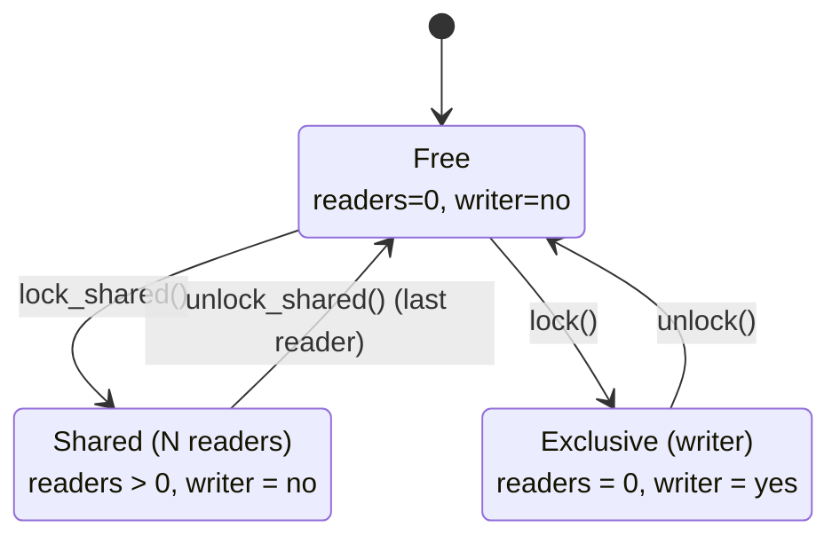
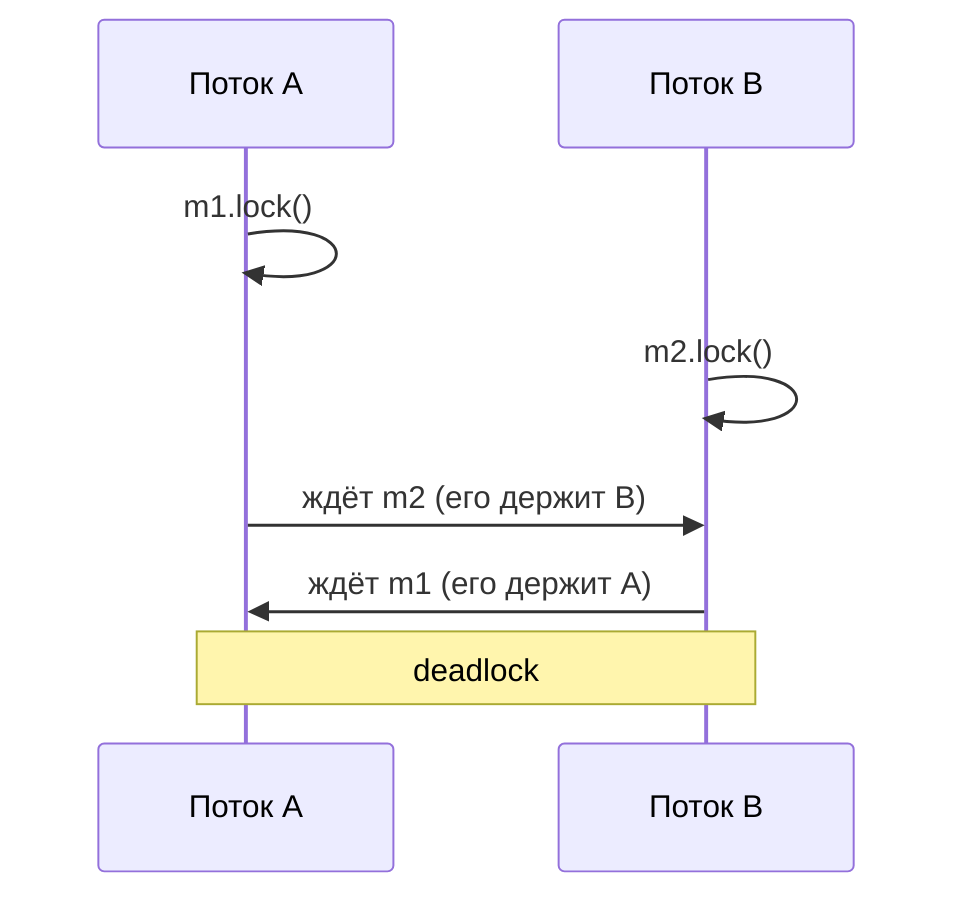
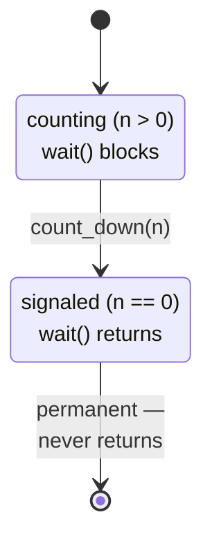
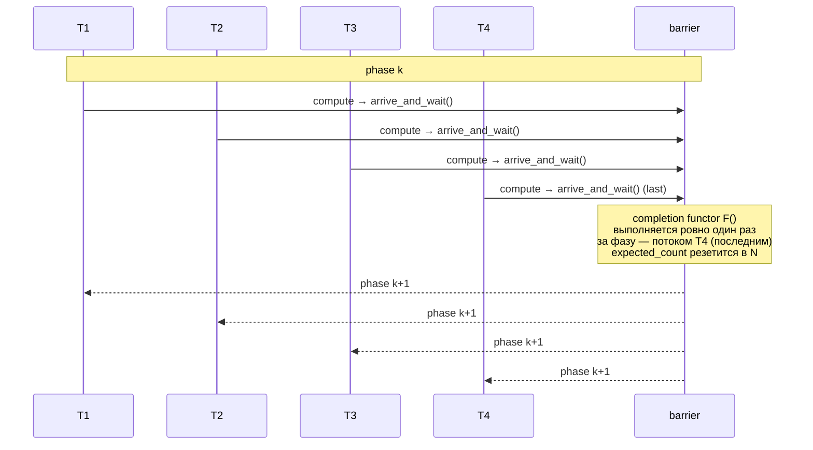

# Примитивы синхронизации в C++: lock'и, shared/recursive, semaphore

`std::mutex` + `std::lock_guard` — базис, который покрывает значительную часть случаев, но реальный код упирается в его
ограничения быстро: нужно одновременно захватывать пару мьютексов без deadlock'а, разрешить читателям конкурировать,
рекурсивно входить в критическую секцию из public-метода, передавать lock между функциями. Стандарт C++ предоставляет
полный набор: `<mutex>` содержит четыре RAII-обёртки и три вида мьютексов, `<shared_mutex>` добавляет reader/writer
блокировку, `<semaphore>` — counting/binary семафоры на futex'е. Эта статья — обзор всего этого арсенала, того как оно
устроено и когда что выбирать.

Базовые понятия (`std::mutex`, futex, condition variable) разобраны в [thread_synchronization.md](thread_synchronization.md).
Здесь — следующий слой.

## RAII guards

C++ предлагает четыре RAII-обёртки над lock'ом. Каждая решает свою задачу — выбор определяется тем, нужно ли управлять
блокировкой вручную, владеть ли несколькими мьютексами, и нужен ли shared-доступ.

| Guard               | Введён | Размер*  | Move | unlock/relock | Для CV | Сценарий                            |
|---------------------|--------|----------|------|---------------|--------|-------------------------------------|
| `std::lock_guard`   | C++11  | 8 байт   | нет  | нет           | нет    | простейший scope-bound lock         |
| `std::unique_lock`  | C++11  | 16 байт  | да   | да            | да     | CV, deferred lock, move out of fn   |
| `std::scoped_lock`  | C++17  | N×8 байт | нет  | нет           | нет    | один или несколько мьютексов сразу  |
| `std::shared_lock`  | C++14  | 16 байт  | да   | да            | нет    | reader-сторона `shared_mutex`       |

\* на x86-64 с обычным `std::mutex*`; реальный размер зависит от типа мьютекса.

```cpp
std::mutex m;
std::shared_mutex sm;

// 1. lock_guard — простейший случай, scope-bound
{
    std::lock_guard<std::mutex> lk(m);
    // критическая секция
}  // unlock в деструкторе

// 2. unique_lock — нужен для condition_variable
{
    std::unique_lock<std::mutex> lk(m);
    cv.wait(lk, [&]{ return ready; });   // wait делает unlock+relock через lk
    lk.unlock();                          // можно отпустить раньше scope'а
    // ... тяжёлая работа без блокировки ...
    lk.lock();                            // и взять обратно
}

// 3. scoped_lock — один или несколько мьютексов, deadlock-free
{
    std::scoped_lock lk(m1, m2);          // эквивалент std::lock(m1,m2)+two guards
    // обе блокировки захвачены атомарно
}

// 4. shared_lock — RAII для reader'а shared_mutex
{
    std::shared_lock<std::shared_mutex> lk(sm);
    // несколько потоков могут быть здесь одновременно
}
```

В новом коде для одного мьютекса обычно берут `std::scoped_lock` — он эквивалентен `lock_guard` (тот же overhead, та же
семантика), но единообразен с multi-mutex случаем. `lock_guard` остался по причинам совместимости.

## std::recursive_mutex

Обычный `std::mutex` UB-нет, если тот же поток попытается захватить его второй раз — это deadlock с самим собой.
`std::recursive_mutex` хранит идентификатор владеющего потока и счётчик владений; владелец может вызвать `lock()`
повторно — счётчик инкрементится, реальной блокировки не происходит. `unlock()` декрементит — мьютекс освобождается
только когда счётчик возвращается к нулю.

```
┌────────────────────────────────────────────────────────────┐
│ recursive_mutex internals                                  │
├────────────────────────────────────────────────────────────┤
│   owner_tid  : pthread_t   ← кто держит, 0 если свободен   │
│   count      : uint32_t    ← глубина рекурсии              │
│   state      : futex word  ← как у обычного мьютекса       │
└────────────────────────────────────────────────────────────┘

lock():
  if owner_tid == self_tid:    ──▶  ++count, return
  else                         ──▶  обычный mutex lock
                                    owner_tid = self_tid
                                    count = 1
unlock():
  --count
  if count == 0:               ──▶  owner_tid = 0
                                    обычный mutex unlock
```

Типичный сценарий — public-методы класса, которые могут вызывать друг друга:

```cpp
class Registry {
    std::recursive_mutex m_;
    std::map<std::string, int> data_;
public:
    void set(const std::string& k, int v) {
        std::lock_guard<std::recursive_mutex> lk(m_);
        data_[k] = v;
    }
    void set_many(const std::map<std::string, int>& batch) {
        std::lock_guard<std::recursive_mutex> lk(m_);
        for (const auto& [k, v] : batch)
            set(k, v);                  // повторный lock того же потока — ok
    }
};
```

Цена — дополнительные поля (TID + счётчик) и проверка владельца на каждом `lock()`. На x86-64 это ~2× медленнее обычного
мьютекса в fast path.

Использование `recursive_mutex` обычно говорит о том, что дизайн классов размывает границу между «методом, который
блокирует» и «методом, который предполагает блокировку уже взятой». Чище паттерн — private-методы с суффиксом `_locked`,
которые не берут lock:

```cpp
class Registry {
    std::mutex m_;
    std::map<std::string, int> data_;

    void set_locked(const std::string& k, int v) { data_[k] = v; }
public:
    void set(const std::string& k, int v) {
        std::lock_guard lk(m_);
        set_locked(k, v);
    }
    void set_many(const std::map<std::string, int>& batch) {
        std::lock_guard lk(m_);
        for (const auto& [k, v] : batch)
            set_locked(k, v);
    }
};
```

`std::recursive_timed_mutex` добавляет `try_lock_for()` / `try_lock_until()` — рекурсивная блокировка с таймаутом.

## std::shared_mutex

Reader/writer lock реализует политику «много читателей или один писатель». Если данные читаются часто и обновляются
редко (cache, конфигурация, routing table), `shared_mutex` позволяет читателям не блокировать друг друга.



API двусторонний: writer берёт мьютекс через `lock()` / `unlock()`, reader — через `lock_shared()` / `unlock_shared()`.
На практике это оборачивают в RAII:

```cpp
#include <shared_mutex>

class DNSCache {
    mutable std::shared_mutex m_;
    std::unordered_map<std::string, std::string> cache_;
public:
    // Reader — параллельно с другими reader'ами
    std::optional<std::string> get(const std::string& host) const {
        std::shared_lock<std::shared_mutex> lk(m_);
        auto it = cache_.find(host);
        return it == cache_.end()
            ? std::nullopt
            : std::optional{it->second};
    }

    // Writer — эксклюзивно
    void put(std::string host, std::string ip) {
        std::unique_lock<std::shared_mutex> lk(m_);
        cache_[std::move(host)] = std::move(ip);
    }
};
```

`shared_mutex` появился в C++17. В C++14 был `shared_timed_mutex` — то же самое плюс timed-API; в C++17 timed-вариант
остался, а «обычный» `shared_mutex` стал отдельным типом без timed-overhead.

### Внутри

Распространённая реализация — atomic word, содержащий счётчик читателей и writer-bit. Reader делает CAS,
инкрементирующий счётчик, если writer-bit не выставлен; writer выставляет бит и ждёт, пока счётчик не упадёт до нуля.
Под капотом — тот же futex (Linux) / WaitOnAddress (Windows), что и у обычного мьютекса; подробности futex в
[thread_synchronization.md](thread_synchronization.md).

```
shared_mutex state word (упрощённо)
┌──────────────┬───────────────────────────────────────┐
│ writer_bit   │   reader_count (31 бит)               │
│   1 бит      │                                       │
└──────────────┴───────────────────────────────────────┘

lock_shared() fast path:
   loop:
     s = load(state)
     if s & writer_bit: park on futex          ──▶ slow path
     if CAS(state, s, s + 1) ok: return        ──▶ fast path

lock() (writer):
   set writer_bit (ждать если уже выставлен)
   while reader_count > 0: park on futex
```

### Подводные камни

**Writer starvation.** Если читатели приходят непрерывно, writer может никогда не получить эксклюзивный доступ. Поведение
зависит от реализации: libstdc++ блокирует новых читателей, как только writer попросил lock — fair-ish; libc++ не даёт
такой гарантии. Стандарт это не специфицирует.

**Upgrade/downgrade не поддерживается.** Нет способа взять `shared_lock`, прочитать, и атомарно превратить его в writer
lock. Нужно отпустить shared, взять unique, перепроверить состояние (мог измениться).

**Не всегда быстрее.** При низком contention reader-fast-path требует CAS на одной кэш-линии — то же что у обычного
мьютекса. Если writers редкие, выигрыша почти нет; если писателей много, `shared_mutex` ощутимо медленнее обычного
из-за более сложного протокола.

**Не подходит для condition variable.** Standard CV работает только с `unique_lock<mutex>` / `unique_lock<timed_mutex>`,
не с `shared_lock`. Есть отдельный `std::condition_variable_any`, который принимает любой Lockable — это путь, если нужны
оба паттерна.

## std::lock и захват нескольких мьютексов

Классический deadlock: поток A берёт `m1`, потом `m2`; поток B берёт `m2`, потом `m1`. Если оба захватили первый
мьютекс одновременно — ни один не сможет взять второй.



Дисциплинированное решение — **lock ordering**: всегда захватывать мьютексы в одном глобально согласованном порядке
(например, по адресу). Это работает, но требует, чтобы все участники знали об ordering и его соблюдали.

`std::lock(m1, m2, ...)` — стандартный способ взять несколько мьютексов атомарно, без требований к ordering. Алгоритм
try-and-back-off:

```
std::lock(m1, m2) — пример с двумя мьютексами

   loop:
     m1.lock()                  ──▶  заняли первый
     if m2.try_lock() ok:       ──▶  успех, выходим
                          else: ──▶  m1.unlock()
                                     yield / короткий sleep
                                     поменять порядок: пробовать с m2 сначала

  поменять порядок:
     m2.lock()
     if m1.try_lock() ok:       ──▶  успех
                          else: ──▶  m2.unlock(), пробовать снова с m1
```

Алгоритм гарантирует отсутствие deadlock'а: если не удалось взять второй мьютекс — первый отпускается, чтобы другой
поток мог продвинуться. В реальной реализации (libstdc++) последовательность немного хитрее — она запоминает индекс
мьютекса, который удалось взять, и стартует следующую попытку с него, чтобы минимизировать число retry.

```cpp
// До C++17: std::lock + adopt_lock
std::lock(m1, m2);                       // атомарный захват
std::lock_guard<std::mutex> l1(m1, std::adopt_lock);
std::lock_guard<std::mutex> l2(m2, std::adopt_lock);

// C++17: scoped_lock — то же одним выражением
std::scoped_lock lk(m1, m2);
```

`adopt_lock_t` говорит guard'у: мьютекс уже захвачен (через `std::lock`), просто оберни его в RAII — не лочь повторно,
но unlock в деструкторе сделай.

### Алгоритм std::lock в деталях

Стандарт C++ не специфицирует конкретный алгоритм для `std::lock(m1, m2, ...)` — он требует только отсутствия deadlock'а
при произвольном interleaving потоков. Реализации идут двумя путями: **try-and-back-off** (libstdc++, MSVC) и
**ordered locking** (так называемый Phil's algorithm).

**Try-and-back-off** — каноническая реализация. Берётся первый мьютекс блокирующе, остальные через `try_lock`. При первом
fail вся последовательность откатывается, начальный индекс ротируется, попытка повторяется. Псевдокод для N мьютексов:

```
std::lock(m_0, m_1, ..., m_{N-1}):
  start = 0
  loop:
    locks[start].lock()                          ──▶  блокирующий lock на «опорный»
    failed = -1
    for i in (start+1, ..., start+N-1) mod N:
      if not locks[i].try_lock():                ──▶  пробуем без блокировки
        failed = i
        break

    if failed == -1:                             ──▶  все взяты
      return

    for j in (i, i-1, ..., start) mod N:         ──▶  откатываем всё в обратном порядке
      locks[j].unlock()

    start = failed                               ──▶  следующий раз начинаем с того,
    yield()                                          на котором споткнулись
```

Ротация `start = failed` — важная деталь. Она минимизирует число retry'ев: поток в следующей итерации блокирующе ждёт
именно того мьютекса, который был занят, вместо того чтобы крутиться на try_lock'ах. Это превращает spin в обычное
ожидание в slow path фьютекса.

**Phil's algorithm** (он же Phil's Lock, или address ordering) — альтернатива: отсортировать мьютексы по адресу (или
любому глобально-сравнимому идентификатору) и захватывать их в этом порядке блокирующе. Никаких try_lock, никаких
откатов:

```
phil_lock(m_0, m_1, ..., m_{N-1}):
  sorted = sort_by_address(m_0, ..., m_{N-1})
  for m in sorted:
    m.lock()
```

Если все потоки в системе используют один и тот же порядок (по адресу), deadlock невозможен по построению — это
классический lock ordering, формализованный для произвольного набора. Цена — мьютексы должны иметь сравнимую identity
(адрес стабилен, тип однороден), а реализация платит за `sort` (N×log N) на каждом вызове. Для N=2 это просто сравнение
указателей.

Стандарт оставил выбор реализациям, потому что у обоих алгоритмов есть trade-off'ы:

| Свойство              | try-and-back-off                | Phil's algorithm                    |
|-----------------------|---------------------------------|-------------------------------------|
| Worst case            | livelock theoretically possible | O(N log N) sort, deterministic      |
| Fast path (uncontend) | N lock'ов                       | N lock'ов + sort                    |
| Под contention        | retry'и, yield'ы                | одна попытка, ждёт в порядке адреса |
| Требования к mutex'у  | только Lockable                 | Lockable + сравнимая identity       |
| Fairness              | none                            | none (зависит от mutex'а)           |

**libstdc++ vs libc++.** GCC's libstdc++ исторически использует try-and-back-off с ротацией начального индекса —
`__try_lock_impl` в `<bits/std_mutex.h>`. Под высоким contention он может делать несколько retry'ев подряд, что заметно в
профиле как лишние `sched_yield`. libc++ (LLVM) использует похожую схему, но с другим выбором первого мьютекса и
агрессивнее переходит в blocking режим — это иногда быстрее под heavy contention, иногда медленнее при coexisting
spurious wake-up'ах. Различия наблюдаемы, но в обоих случаях это implementation detail без гарантий.

### scoped_lock vs lock_guard: стоимость

Для **одного** мьютекса разницы нет. `scoped_lock<M>` с одним аргументом — это эквивалент `lock_guard<M>`: тот же
размер (sizeof = sizeof(M*)), тот же конструктор `m.lock()`, тот же деструктор `m.unlock()`. Никаких лишних веток или
проверок.

Для **нескольких** мьютексов `scoped_lock<M1, M2, ...>` вызывает `std::lock(m1, m2, ...)` в конструкторе, и в деструкторе
каждый мьютекс получает свой `unlock()`. Это даёт безопасность от deadlock'а ценой алгоритма выше — на двух мьютексах под
contention это ~35 ns против ~15 ns у одного.

```
scoped_lock<M1, M2>::scoped_lock(M1& a, M2& b):
  std::lock(a, b)                  ──▶  try-and-back-off / Phil's
  ─────────────────────────────────
  // в полях хранится tuple<M1&, M2&>
  // адопт-семантика: lock уже взят

scoped_lock<M1, M2>::~scoped_lock():
  b.unlock()                       ──▶  обратный порядок относительно конструктора
  a.unlock()
```

Когда выбирать какой:

- **`lock_guard`** — один мьютекс, простейший RAII. Существует, потому что был до C++17 и оставлен для backward
  compatibility. В новом коде заменяется на `scoped_lock` без перекомпиляции (тот же ABI fast path).
- **`scoped_lock`** — С++17 и новее. Для одного мьютекса работает как `lock_guard`, для нескольких — единственно
  правильный способ их захвата. Унифицирует интерфейс.
- **`unique_lock`** — нужны manual lock/unlock, move, передача в condition variable, или deferred lock.

До C++17 «правильный» способ взять несколько мьютексов был громоздок — `std::lock` существовал, но guard'ы приходилось
адоптировать вручную:

```cpp
// C++11/14: грязно
std::lock(m1, m2);
std::lock_guard<std::mutex> l1(m1, std::adopt_lock);
std::lock_guard<std::mutex> l2(m2, std::adopt_lock);

// C++17: чисто
std::scoped_lock lk(m1, m2);
```

Правило «scoped_lock когда несколько мьютексов» имеет смысл только начиная с C++17 — в более ранних стандартах
эквивалентный по семантике паттерн требует явного `std::lock` с `adopt_lock` тегом на каждом guard'е.

## unique_lock против lock_guard

`lock_guard` минимален — указатель на мьютекс и ничего больше; конструктор делает `lock()`, деструктор делает `unlock()`.
Move не поддерживается, ручного управления нет.

`unique_lock` богаче: хранит указатель на мьютекс плюс boolean `owns_lock_`, поддерживает move, ручной lock/unlock,
несколько типов конструкторов:

```cpp
std::mutex m;

// 1. Стандартный конструктор — lock в конструкторе (= lock_guard)
std::unique_lock<std::mutex> a(m);

// 2. defer_lock — взять обёртку без захвата
std::unique_lock<std::mutex> b(m, std::defer_lock);
// ... позже ...
b.lock();                                // ручной захват

// 3. try_to_lock — попробовать без блокировки
std::unique_lock<std::mutex> c(m, std::try_to_lock);
if (c.owns_lock()) { /* успех */ }

// 4. adopt_lock — мьютекс уже захвачен извне (через std::lock)
m.lock();
std::unique_lock<std::mutex> d(m, std::adopt_lock);

// 5. Timed
std::unique_lock<std::timed_mutex> e(tm, std::chrono::milliseconds(100));

// Manual
a.unlock();                              // отпустить раньше scope'а
a.lock();                                // взять обратно
bool owns = a.owns_lock();               // в каком состоянии guard
std::mutex* raw = a.release();           // отдать ownership, НЕ unlock'нуть

// Move
std::unique_lock<std::mutex> f = std::move(a);   // a больше не owns
```

Когда `unique_lock` обязателен:

- **`condition_variable::wait`** требует `unique_lock<mutex>` — он внутри делает unlock на время сна и lock при
  пробуждении. `lock_guard` это не поддерживает.
- **Возврат lock'а из функции.** Move-семантика позволяет `unique_lock` пересекать функциональные границы; `lock_guard`
  не move'абелен.
- **Временный unlock** внутри scope'а — `lk.unlock() / lk.lock()` — для тяжёлой работы, не требующей блокировки.

Overhead `unique_lock` — лишние 8 байт (boolean + padding) и одна проверка `owns_lock_` в деструкторе. Это
не наблюдается в hot-loop, но для simple scope-bound случая `lock_guard` / `scoped_lock` чуть дешевле.

## std::counting_semaphore

C++20 добавил семафоры в стандарт. `std::counting_semaphore<MaxValue>` — счётный семафор, параметризованный максимальным
значением (compile-time константа). `std::binary_semaphore` — алиас для `counting_semaphore<1>`.

```cpp
#include <semaphore>

std::counting_semaphore<10> sem(0);   // max=10, initial=0
std::binary_semaphore sig(0);         // 0 или 1

sem.acquire();              // wait если 0, иначе decrement
sem.release();              // increment на 1, wake одного waiter
sem.release(3);             // increment на 3, wake до 3 waiters

bool got = sem.try_acquire();
bool got = sem.try_acquire_for(std::chrono::milliseconds(100));
bool got = sem.try_acquire_until(deadline);
```

Под капотом — обычно atomic counter + futex (Linux) / WaitOnAddress (Windows). Fast path для `acquire()` при ненулевом
счётчике — один atomic CAS. Это тот же механизм, что используют `std::atomic::wait` / `notify_*` — единый kernel-level
parking.

### Bounded buffer на семафорах

Классическая иллюстрация — producer-consumer с фиксированной очередью. Два семафора: `slots` (свободные места) и `items`
(заполненные места):

```cpp
template <typename T, std::size_t N>
class BoundedQueue {
    std::array<T, N> buf_;
    std::size_t head_ = 0, tail_ = 0;
    std::mutex m_;
    std::counting_semaphore<N> slots_{N};   // изначально все слоты свободны
    std::counting_semaphore<N> items_{0};   // изначально 0 элементов
public:
    void push(T x) {
        slots_.acquire();                    // ждём свободного слота
        {
            std::lock_guard lk(m_);
            buf_[tail_] = std::move(x);
            tail_ = (tail_ + 1) % N;
        }
        items_.release();                    // сигналим consumer'у
    }
    T pop() {
        items_.acquire();                    // ждём элемент
        T x;
        {
            std::lock_guard lk(m_);
            x = std::move(buf_[head_]);
            head_ = (head_ + 1) % N;
        }
        slots_.release();                    // освобождаем слот
        return x;
    }
};
```

Семафор здесь делает то, что цикл `cv.wait(lk, predicate)` сделал бы менее естественно: для счётных условий («есть
свободные слоты», «есть элементы») семафор — прямой подбор.

### binary_semaphore как notification

```cpp
std::binary_semaphore done{0};

std::jthread worker([&]{
    // ... тяжёлая работа ...
    done.release();                          // сигналим завершение
});

done.acquire();                              // ждём worker'а
```

Это часто чище, чем `cv + bool + mutex` для one-shot notification. Для повторных сигналов лучше CV.

## Семафор через condition_variable

До C++20 семафоров в стандарте не было — их собирали на CV. Пример образовательный: показывает почему CV-интерфейс
устроен именно так.

```cpp
class Semaphore {
    std::mutex m_;
    std::condition_variable cv_;
    int count_;
public:
    explicit Semaphore(int initial) : count_(initial) {}

    void acquire() {
        std::unique_lock<std::mutex> lk(m_);
        cv_.wait(lk, [&]{ return count_ > 0; });  // (1)
        --count_;
    }

    void release() {
        {
            std::lock_guard<std::mutex> lk(m_);
            ++count_;
        }
        cv_.notify_one();                         // (2)
    }
};
```

```
acquire через cv.wait(lk, predicate)

   thread A: acquire()
   ┌────────────────────────────────────────────────────┐
   │  lk.lock()                                         │
   │  while (count_ <= 0):                              │
   │      lk.unlock()  ──▶  park on futex (cv internal) │
   │      ... ждёт notify_one ...                       │
   │      wake                                          │
   │      lk.lock()                                     │
   │  // тут predicate == true                          │
   │  --count_                                          │
   │  lk.unlock() (scope exit)                          │
   └────────────────────────────────────────────────────┘
```

Два неочевидных момента:

**(1) Зачем predicate-форма `wait(lk, pred)`?** Защита от **spurious wakeups** (ложных пробуждений без `notify`). Стандарт
не гарантирует, что `wait` спит до тех пор, пока его не разбудили — поток может проснуться сам. Predicate-форма
эквивалентна `while (!pred()) cv.wait(lk);` — это правильный pattern. Без него код может декрементить `count_`, когда он
уже == 0.

**(2) Почему `unique_lock`, а не `lock_guard`?** `cv.wait()` должен атомарно: освободить мьютекс, заснуть, и
захватить мьютекс при пробуждении. Для этого CV нужно манипулировать lock'ом — `unlock()` перед сном, `lock()` после.
Интерфейс `lock_guard` этого не позволяет (нет публичных методов unlock/lock), а у `unique_lock` они есть.

### Что у production-семафора отличается

- **Thundering herd.** `notify_one` будит одного, `notify_all` — всех; всех будить плохо, если ждать должны не все.
  Реальный `counting_semaphore::release(k)` точечно разбудит до `k` ожидающих, минимизируя лишние пробуждения.
- **Без mutex'а в fast path.** Futex-based семафор делает acquire через CAS на счётчике без захвата мьютекса; mutex
  здесь — это то, чего пытаются избежать. CV-based реализация всегда платит за `lk.lock() / unlock()` — два atomic'а
  даже в неблокирующем случае.
- **Композиция с другими locks.** Если поток в `acquire()` держит ещё какой-то мьютекс, classic deadlock паттерн
  снова актуален; production-код документирует ordering.

## std::latch (C++20)

`std::latch` — однократный countdown counter. Конструктор задаёт начальное значение N, потоки делают `count_down(k)`
(уменьшает счётчик на k) и `wait()` (блокирует пока счётчик > 0). Когда счётчик достигает нуля, latch переходит в
permanently signaled state — все `wait()`'ы возвращаются мгновенно, любой последующий `wait()` не блокирует. Reset
не поддерживается — это **one-shot** примитив.

```cpp
#include <latch>

std::latch start_gate(1);                  // shared gun-shot: один count_down открывает всех
std::latch finish_line(N);                 // N работников должны отчитаться

void worker() {
    start_gate.wait();                     // ждём общего старта
    do_work();
    finish_line.count_down();              // отчитываемся
}

void coordinator() {
    spawn(N, worker);
    start_gate.count_down();               // открываем гонку
    finish_line.wait();                    // ждём финиша всех
}
```

API:

| Метод                  | Что делает                                                                  |
|------------------------|-----------------------------------------------------------------------------|
| `latch(N)`             | конструктор с начальным значением (`ptrdiff_t`)                             |
| `count_down(k = 1)`    | вычитает k из счётчика; ноль будит всех ждущих                              |
| `wait()`               | блокирует пока счётчик > 0                                                  |
| `try_wait()`           | non-blocking проверка: `true` если счётчик уже == 0                         |
| `arrive_and_wait(k=1)` | атомарно `count_down(k); wait()` — частый шаблон                            |



Под капотом — обычно atomic counter + futex на этой же ячейке. `count_down` делает `fetch_sub(k)`; если результат стал
≤ 0 — `futex_wake(INT_MAX)` будит всех waiter'ов одним syscall'ом. `wait()` крутит counter, и при ненулевом значении
делает `futex_wait` на адресе счётчика.

Use cases:

- **Барьер инициализации.** Главный поток создаёт N подсистем (БД, кэш, сетевые соединения, prometheus exporter), каждая
  инициализируется в своём потоке и делает `count_down`; main делает `wait()` и переходит к accept'у соединений только
  когда всё готово.
- **Synchronized start.** Бенчмарк — N потоков должны начать работу одновременно. `latch(1)` создаётся, каждый поток
  делает `wait()`, main делает `count_down()` — гонка стартует синхронно.
- **Test fixture teardown.** N асинхронных операций должны завершиться до teardown'а — latch с count = N, каждая
  операция вызывает `count_down` по завершении.

## std::barrier (C++20)

`std::barrier` — re-usable barrier. В отличие от latch'а, после прохождения всеми N участниками barrier автоматически
переходит в новую фазу и может использоваться снова. Это классический примитив для итеративных параллельных алгоритмов:
все потоки выполняют фазу 1 → синхронизируются → выполняют фазу 2 → синхронизируются → и т.д.

```cpp
#include <barrier>

constexpr int N = 4;

std::barrier sync_point(N, []() noexcept {
    // completion functor — выполняется один раз каждым phase'ом,
    // выбранным потоком, после того как все N достигли barrier'а
    log_phase_complete();
});

void worker(int id) {
    for (int phase = 0; phase < 10; ++phase) {
        compute_chunk(id, phase);
        sync_point.arrive_and_wait();      // ждём остальных, переходим к следующей фазе
    }
}
```

API:

| Метод               | Что делает                                                               |
|---------------------|--------------------------------------------------------------------------|
| `barrier(N, F)`     | конструктор: N — expected count, F — completion functor (опциональный)   |
| `arrive(k=1)`       | отметиться (вычесть k из текущего счётчика), вернуть `arrival_token`     |
| `wait(token)`       | ждать конца текущей фазы по token'у                                      |
| `arrive_and_wait()` | атомарно `arrive(); wait(token)` — частый шаблон                         |
| `arrive_and_drop()` | вычесть себя и из текущей, и из всех будущих фаз — поток покидает группу |

Фазовая структура и роль completion functor:



Completion functor вызывается ровно один раз за фазу, в потоке последнего arrive'a, и обязан быть `noexcept` —
исключение из него вызовет `std::terminate`. Это удобное место для:

- агрегации частичных результатов фазы (например, sum по локальным аккумуляторам),
- логирования прогресса,
- swap буферов (например, в double-buffered алгоритмах),
- инициализации общего состояния для следующей фазы.

Под капотом — два счётчика: текущий arrival count и фазовый token (обычно epoch number). `arrive` делает
`fetch_sub` на arrival counter'е; когда счётчик становится 0, последний поток вызывает completion functor, обновляет
epoch, восстанавливает arrival count в N и делает broadcast wake'е через `futex_wake(INT_MAX)`. Waiter'ы крутят epoch и
просыпаются, когда он изменился.

Use cases:

- **MapReduce shuffle.** Workers'ы делают map → barrier → shuffle (completion functor распределяет данные) → workers'ы
  делают reduce → barrier → следующая итерация.
- **Параллельные численные методы.** Iterative solvers (Jacobi, conjugate gradient) — каждая итерация = фаза; в
  completion проверка сходимости.
- **Game engines.** Each frame: physics → barrier → render → barrier → swap. Completion functor swap'ит framebuffer.

`arrive_and_drop()` — для динамически уменьшающихся групп. Поток сообщает «я выхожу, не ждите меня в будущем» — N
уменьшается на 1 для всех последующих фаз.

## wait_for и wait_until: precision

Timed-методы (`cv.wait_for`, `cv.wait_until`, `mutex.try_lock_for`, `semaphore.try_acquire_for`, `latch.wait_for`) —
часть всех ожидающих примитивов. У них есть неочевидный нюанс — какие часы используются под капотом.

`std::chrono` предоставляет несколько clock'ов; для синхронизации релевантны два:

- **`std::steady_clock`** — монотонные часы. Гарантируется, что между двумя вызовами `now()` время не уменьшается. Не
  привязаны к wall clock. Не корректируются NTP, не меняются при переводе времени, не реагируют на suspend/resume в
  смысле «прыжка вперёд» (на Linux `CLOCK_MONOTONIC` останавливается во время suspend, `CLOCK_BOOTTIME` — нет).
- **`std::system_clock`** — wall clock. Эквивалент `CLOCK_REALTIME` на Linux. Может прыгнуть назад или вперёд: NTP
  коррекция, ручное изменение даты, leap second.

Разница критична для абсолютных deadline'ов:

```cpp
// КОРРЕКТНО: deadline в монотонном времени
auto deadline = std::chrono::steady_clock::now() + std::chrono::seconds(30);
cv.wait_until(lk, deadline, predicate);

// ОПАСНО: deadline в wall clock
auto deadline = std::chrono::system_clock::now() + std::chrono::seconds(30);
cv.wait_until(lk, deadline, predicate);
// если NTP подвинет системные часы на минуту назад,
// поток просидит лишнюю минуту
// если на час вперёд — wait вернётся немедленно
```

`wait_for(N)` всегда транслируется в `wait_until(steady_now + N)` — это единственно корректный способ выразить
относительный таймаут. Implementations реализуют это через `CLOCK_MONOTONIC` в `pthread_cond_timedwait` (через
`pthread_condattr_setclock`) или через `FUTEX_WAIT_BITSET` с `FUTEX_CLOCK_REALTIME` флагом — но логика «прибавляем N к
текущему монотонному времени» одна и та же.

`wait_until(system_clock_time)` корректно только для случаев, когда deadline действительно привязан к wall clock —
например, «выполнить операцию до 12:00 GMT». Для большинства inter-thread синхронизаций это неправильный выбор.

## Performance

Приближённые цифры на x86-64 (Skylake, single thread, без contention):

| Примитив                   | lock+unlock | Под капотом                            |
|----------------------------|-------------|----------------------------------------|
| `std::mutex` + lock_guard  | ~15 ns      | 1× CAS + 1× store, futex slow path     |
| `std::mutex` + unique_lock | ~17 ns      | то же + проверка `owns_lock_`          |
| `std::scoped_lock` (1 m)   | ~15 ns      | то же что lock_guard                   |
| `std::scoped_lock` (2 m)   | ~35 ns      | try-and-back-off                       |
| `std::recursive_mutex`     | ~30 ns      | TID compare + count++ или обычный lock |
| `std::shared_mutex` rd     | ~20 ns      | CAS на reader counter                  |
| `std::shared_mutex` wr     | ~25 ns      | writer-bit + wait readers              |
| `std::counting_semaphore`  | ~10 ns      | atomic decrement, futex slow path      |

Под contention абсолютные числа уходят в сотни наносекунд (syscall + park/unpark). Reader-fast-path у `shared_mutex`
выигрывает только если несколько потоков читают одновременно и кэш-линия не пинг-понгает — иначе simple `mutex`
быстрее.

## Подводные камни

**`recursive_mutex` + `condition_variable` несовместимы.** `cv.wait` делает один `unlock()`, не разворачивая счётчик
владений. Если поток держит `recursive_mutex` с count=3, `wait` отпустит только один уровень — другой поток не сможет
взять мьютекс. Для CV нужен plain `std::mutex`.

**`shared_mutex` может быть медленнее обычного.** Если writers редкие, но reader'ов мало, или contention низкий — простой
`mutex` обычно выигрывает. Профилировать.

**`counting_semaphore` ≠ general CV.** CV позволяет произвольный predicate (`queue.size() > 0 && !stop_flag`). Semaphore
умеет только «считать единицы» — для сложных условий он не работает.

**`unique_lock(defer_lock)` + забытый `lock()`.** Конструктор `unique_lock(m, std::defer_lock)` не захватывает мьютекс.
Если дальше код работает с защищёнными данными без явного `lk.lock()` — это просто race condition, никакого
compile-time warning'а не будет.

**`release()` у `unique_lock` ≠ `unlock()`.** `release()` отдаёт raw-указатель и обнуляет `owns_lock_` — мьютекс остаётся
заблокированным, ответственность за `unlock()` переходит к вызывающему. Это удобно для перевода ownership, но
не то же, что отпустить блокировку.

**`scoped_lock()` без аргументов компилируется.** До C++17 nullary `scoped_lock<>` — корректный no-op guard. В C++17
это часто непреднамеренный bug (забыли передать мьютекс) — `scoped_lock lk;` блокирует ничего, scope не защищён.

!!! example "Рабочий пример"
    Полные компилируемые демонстрации:

    - мьютексы, `shared_mutex`, `scoped_lock`: `examples/q03_cpp_mutexes/mutexes.cpp`
    - condition variable и семафор (producer-consumer): `examples/q04_condvar_semaphore/condvar_sem.cpp`

    Собрать и запустить: `cd examples && make q03 q04 && ./bin/q03_cpp_mutexes`

## Связанные темы

- [Синхронизация: мьютексы, семафоры, futex](thread_synchronization.md) — базовые `std::mutex`, POSIX-семафоры, futex и
  его быстрый/медленный путь
- [Atomic операции и memory model](atomics_and_memory_model.md) — какие memory orderings используют lock'и внутри;
  acquire/release семантика
- [Потоки (основы)](threads_basics.md) — `std::thread`, `std::jthread`, создание и join потоков

## Источники

- [cppreference: `<mutex>`](https://en.cppreference.com/w/cpp/header/mutex)
- [cppreference: `<shared_mutex>`](https://en.cppreference.com/w/cpp/header/shared_mutex)
- [cppreference: `<semaphore>`](https://en.cppreference.com/w/cpp/header/semaphore)
- [cppreference: `std::lock` algorithm](https://en.cppreference.com/w/cpp/thread/lock)
- libstdc++ headers: `bits/std_mutex.h`, `shared_mutex`, `semaphore` — реальные реализации
- Anthony Williams, *C++ Concurrency in Action*, 2nd ed., главы 3–4
