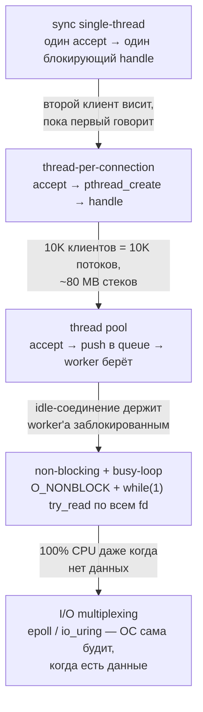
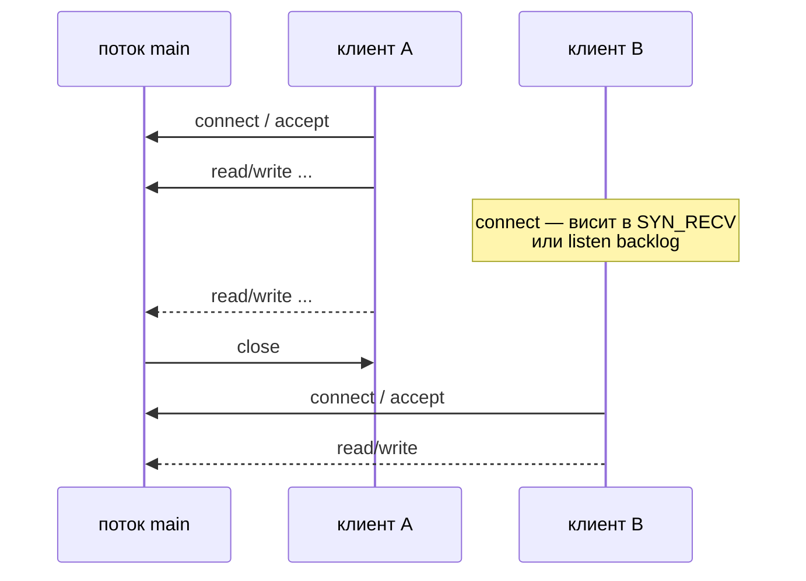
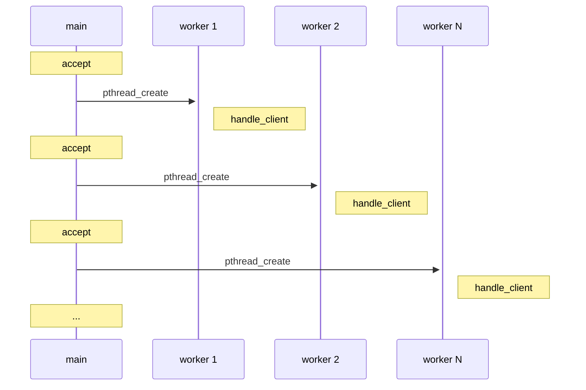
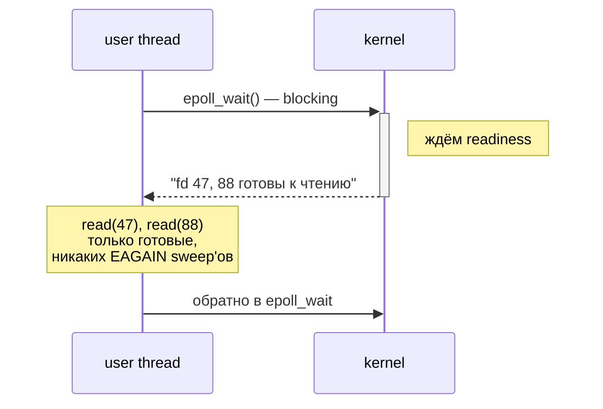

# TCP-серверы: модели обслуживания соединений

Один и тот же TCP-сервер можно написать по-разному, и архитектура определяет потолок производительности задолго до того,
как в дело вступит выбор языка или библиотеки. Сокетный API ([Сокеты: API](../networking/sockets_basics.md)) даёт лишь
строительные блоки — `socket`, `bind`, `listen`, `accept`, `read`, `write`. Из них собираются четыре канонических
модели, каждая решает проблему предыдущей и приносит новую.



Каждая модель — компромисс между простотой кода, использованием памяти, latency и масштабируемостью. Эта статья
проходит первые четыре; пятая раскрыта отдельно в
[I/O multiplexing](../networking/io_multiplexing.md) и [io_uring](../networking/io_uring.md).

## Sync single-threaded TCP server

Самая простая модель: один поток в бесконечном цикле принимает соединения и обрабатывает их по очереди. Для
обучающих примеров и отладки протокола больше ничего не нужно.

```c
#include <arpa/inet.h>
#include <netinet/in.h>
#include <stdio.h>
#include <string.h>
#include <sys/socket.h>
#include <unistd.h>

#define PORT     8080
#define BACKLOG  16
#define BUF_SIZE 4096

static void handle_client(int fd) {
    char buf[BUF_SIZE];
    ssize_t n;
    while ((n = read(fd, buf, sizeof(buf))) > 0) {
        ssize_t off = 0;
        while (off < n) {
            ssize_t w = write(fd, buf + off, n - off);
            if (w <= 0) return;
            off += w;
        }
    }
}

int main(void) {
    int srv = socket(AF_INET, SOCK_STREAM, 0);
    int one = 1;
    setsockopt(srv, SOL_SOCKET, SO_REUSEADDR, &one, sizeof(one));

    struct sockaddr_in addr = {
        .sin_family = AF_INET,
        .sin_port   = htons(PORT),
        .sin_addr   = { .s_addr = htonl(INADDR_ANY) },
    };
    bind(srv, (struct sockaddr*)&addr, sizeof(addr));
    listen(srv, BACKLOG);
    printf("listening on :%d\n", PORT);

    for (;;) {
        struct sockaddr_in cli;
        socklen_t clen = sizeof(cli);
        int fd = accept(srv, (struct sockaddr*)&cli, &clen);
        if (fd < 0) continue;
        handle_client(fd);
        close(fd);
    }
}
```



Пока `handle_client` крутит read/write с клиентом A, поток заблокирован. Клиент B уже выполнил TCP-handshake (ядро
завершает его за листенера, не дожидаясь `accept` — см. [TCP/UDP](../networking/tcp_udp.md), accept queue), но его
файловый дескриптор лежит в очереди ядра до тех пор, пока сервер не позовёт `accept` снова. Если A молчит, B ждёт. Если
backlog переполнен — новые SYN отбрасываются, клиенты получают `ECONNREFUSED`.

Модель подходит для отладочного echo-сервера, локального unix-сокета к утилите, обработки команд от одного клиента
(вроде `redis-cli` против локального демона). Для production — нет.

## TCP-клиент

Симметричный echo-клиент: подключиться, послать строку, прочитать ответ, закрыть соединение.

```c
#include <arpa/inet.h>
#include <netinet/in.h>
#include <stdio.h>
#include <string.h>
#include <sys/socket.h>
#include <unistd.h>

#define PORT     8080
#define BUF_SIZE 4096

int main(int argc, char *argv[]) {
    const char *msg = argc > 1 ? argv[1] : "hello\n";
    size_t mlen = strlen(msg);

    int fd = socket(AF_INET, SOCK_STREAM, 0);
    struct sockaddr_in addr = {
        .sin_family = AF_INET,
        .sin_port   = htons(PORT),
    };
    inet_pton(AF_INET, "127.0.0.1", &addr.sin_addr);

    if (connect(fd, (struct sockaddr*)&addr, sizeof(addr)) < 0) {
        perror("connect");
        return 1;
    }

    ssize_t off = 0;
    while (off < (ssize_t)mlen) {
        ssize_t w = send(fd, msg + off, mlen - off, 0);
        if (w <= 0) { perror("send"); return 1; }
        off += w;
    }
    shutdown(fd, SHUT_WR);   // EOF для сервера, мы больше не пишем

    char buf[BUF_SIZE];
    ssize_t n;
    while ((n = recv(fd, buf, sizeof(buf), 0)) > 0) {
        fwrite(buf, 1, n, stdout);
    }
    close(fd);
    return 0;
}
```

Два момента, которые часто опускают в учебных примерах:

- `send` (как и `write` на сокете) может вернуть **меньше**, чем запрошено, если буфер ядра почти полон. Цикл `while
  (off < mlen)` обязателен — иначе хвост сообщения молча теряется.
- `shutdown(fd, SHUT_WR)` посылает FIN, но оставляет приём открытым. Это сигнал серверу: «больше ничего не пришлю, можешь
  отвечать и закрывать». Без него echo-сервер прочитает наше сообщение и встанет на следующем `read`, ожидая ещё байт.

## Multithreaded thread-per-connection

Первое очевидное улучшение: каждое соединение — свой поток. Главный поток только принимает соединения и сразу делегирует.

```c
#include <pthread.h>
// ... те же include'ы и handle_client из sync-сервера

static void *client_thread(void *arg) {
    int fd = (int)(intptr_t)arg;
    handle_client(fd);
    close(fd);
    return NULL;
}

int main(void) {
    int srv = setup_listening_socket();   // socket+bind+listen, как раньше

    for (;;) {
        int fd = accept(srv, NULL, NULL);
        if (fd < 0) continue;

        pthread_t tid;
        if (pthread_create(&tid, NULL, client_thread, (void*)(intptr_t)fd) != 0) {
            close(fd);
            continue;
        }
        pthread_detach(tid);          // не будем join'ить, ресурсы освободит сам
    }
}
```

`pthread_detach` сразу после `pthread_create` снимает с главного потока необходимость когда-либо звать `pthread_join`:
после возврата из `client_thread` стек и `pthread_t`-структура освобождаются сами.



Проблема — стоимость потоков. Их две.

**Создание дорогое.** `pthread_create` на Linux вызывает `clone(2)` с `CLONE_VM|CLONE_FS|CLONE_FILES|CLONE_SIGHAND|...`
(см. [Реализация потоков (clone)](thread_implementation_clone.md)), плюс `mmap` под стек, плюс настройка TLS. Это
~10–100 микросекунд на поток в зависимости от ядра, нагрузки и того, есть ли уже свободный регион виртуальной памяти. На
коротких соединениях (HTTP/1.0 без keep-alive: connect → один request → close) `pthread_create` может занимать больше
времени, чем собственно обработка.

**Память дорогая.** По умолчанию pthread выделяет 8 MB виртуального адресного пространства под стек (см. `ulimit -s`).
Физически коммитится только то, что реально использовано, но виртуальное пространство закончится первым — на
32-битной системе с 3 GB user space потолок ~370 потоков. На 64-битке адресов хватает, но 10 000 потоков с типичным
коммитом 4–16 KB на стек съедают 40–160 MB только на стеки, плюс TLB pressure из-за разбросанных аллокаций.

**C10K problem.** Поставленная Dan Kegel'ем в 1999 задача — обслужить 10 000 одновременных соединений на одной машине —
ровно поэтому и стала вызовом: thread-per-connection упирался в RAM и context switching задолго до 10K.

## Multithreaded thread pool

Раз создание потока дорогое, выделим их заранее и переиспользуем. Главный поток принимает соединения и кладёт
дескрипторы в очередь, воркеры из пула забирают.

```cpp
#include <condition_variable>
#include <mutex>
#include <queue>
#include <thread>
#include <vector>

class FdQueue {
    std::mutex m;
    std::condition_variable cv;
    std::queue<int> q;
public:
    void push(int fd) {
        { std::lock_guard lk(m); q.push(fd); }
        cv.notify_one();
    }
    int pop() {
        std::unique_lock lk(m);
        cv.wait(lk, [&]{ return !q.empty(); });
        int fd = q.front(); q.pop();
        return fd;
    }
};

static void worker(FdQueue &q) {
    for (;;) {
        int fd = q.pop();      // блокирующее ожидание задачи
        handle_client(fd);
        close(fd);
    }
}

int main() {
    int srv = setup_listening_socket();

    FdQueue q;
    std::vector<std::thread> pool;
    const int N = std::thread::hardware_concurrency() * 2;
    for (int i = 0; i < N; ++i)
        pool.emplace_back(worker, std::ref(q));

    for (;;) {
        int fd = accept(srv, nullptr, nullptr);
        if (fd >= 0) q.push(fd);
    }
}
```

```
thread pool

                           ┌──── FdQueue ────┐
   main: accept ──▶ push ▶ │ [fd1][fd2][fd3] │ ▶ pop ──▶  worker 1: handle_client
                           └─────────────────┘       ──▶  worker 2: handle_client
                                                     ──▶  worker N: handle_client
                                                       (свободные блокируются в pop)
```

Очередь FIFO с mutex'ом и condition variable — каноническая
([Синхронизация: мьютексы, семафоры, futex](thread_synchronization.md)). Воркер, для которого нет работы, висит в
`cv.wait` и не тратит CPU.

Проблема перешла на уровень обработки. Воркер берёт fd и блокируется в `read(fd, ...)` до тех пор, пока клиент не
пришлёт байт. Если клиент медленный (мобильная сеть, keep-alive с большими паузами), один idle keep-alive занимает одного
воркера. Тысяча таких соединений требует тысячи воркеров — и мы вернулись к C10K, только с лишним слоем.

Thread pool отлично работает для коротких CPU-bound запросов (классический PostgreSQL backend per connection,
синхронный gRPC handler). Для долгих connection lifetime с большими idle-периодами модель не годится.

## Non-blocking sockets + busy-loop

Радикальная смена идеи: один поток, никакой блокировки. `fcntl(fd, F_SETFL, O_NONBLOCK)` переводит сокет в
неблокирующий режим — `read`/`write`/`accept` на нём возвращают сразу:

| Вызов в не-блокирующем режиме       | Возврат                                                                   |
|-------------------------------------|---------------------------------------------------------------------------|
| `read`, есть данные                 | количество прочитанных байт                                               |
| `read`, нет данных                  | `-1`, `errno = EAGAIN` (синоним `EWOULDBLOCK`)                            |
| `write`, буфер ядра имеет место     | количество записанных байт                                                |
| `write`, буфер полон                | `-1`, `errno = EAGAIN`                                                    |
| `accept`, есть соединение в очереди | новый fd                                                                  |
| `accept`, очередь пуста             | `-1`, `errno = EAGAIN`                                                    |

Сервер крутит цикл: пробует `accept`, пробует `read` на каждом активном соединении, пробует дослать pending-данные.

```c
#include <errno.h>
#include <fcntl.h>
#include <stdio.h>
#include <stdlib.h>
#include <string.h>
#include <sys/socket.h>
#include <unistd.h>

#define MAX_CONN 1024
#define BUF_SIZE 4096

struct conn {
    int  fd;
    char buf[BUF_SIZE];
    size_t pending;     // байт в buf, ждущих отправки обратно
};

static void make_nonblock(int fd) {
    int flags = fcntl(fd, F_GETFL, 0);
    fcntl(fd, F_SETFL, flags | O_NONBLOCK);
}

int main(void) {
    int srv = setup_listening_socket();
    make_nonblock(srv);

    struct conn conns[MAX_CONN] = {0};
    for (int i = 0; i < MAX_CONN; i++) conns[i].fd = -1;

    for (;;) {
        // 1. Попробовать принять новые соединения
        for (;;) {
            int fd = accept(srv, NULL, NULL);
            if (fd < 0) {
                if (errno == EAGAIN || errno == EWOULDBLOCK) break;
                break;
            }
            make_nonblock(fd);
            int slot = -1;
            for (int i = 0; i < MAX_CONN; i++)
                if (conns[i].fd == -1) { slot = i; break; }
            if (slot < 0) { close(fd); continue; }   // переполнение
            conns[slot].fd = fd;
            conns[slot].pending = 0;
        }

        // 2. Пройти по всем активным соединениям
        for (int i = 0; i < MAX_CONN; i++) {
            struct conn *c = &conns[i];
            if (c->fd < 0) continue;

            // 2a. Если есть pending-данные — попробовать дописать
            if (c->pending > 0) {
                ssize_t w = write(c->fd, c->buf, c->pending);
                if (w > 0) {
                    memmove(c->buf, c->buf + w, c->pending - w);
                    c->pending -= w;
                } else if (w < 0 && errno != EAGAIN && errno != EWOULDBLOCK) {
                    close(c->fd); c->fd = -1; continue;
                }
            }

            // 2b. Если буфер свободен — попробовать прочитать
            if (c->pending == 0) {
                ssize_t n = read(c->fd, c->buf, sizeof(c->buf));
                if (n > 0) {
                    c->pending = n;
                } else if (n == 0) {
                    close(c->fd); c->fd = -1;       // клиент закрыл
                } else if (errno != EAGAIN && errno != EWOULDBLOCK) {
                    close(c->fd); c->fd = -1;
                }
            }
        }
    }
}
```

```
non-blocking busy-loop

   ┌─ один поток ─────────────────────────────────────────────────┐
   │                                                              │
   │  while (1) {                                                 │
   │     try accept   ──▶  EAGAIN или новый fd                    │
   │                                                              │
   │     for fd in [conns]:                                       │
   │        try write ──▶  EAGAIN, либо отправили часть           │
   │        try read  ──▶  EAGAIN, либо получили данные           │
   │                                                              │
   │     ┌───────────────────────────────────────────────────┐    │
   │     │  100% CPU                                         │    │
   │     │  даже если все соединения idle —                  │    │
   │     │  каждую итерацию N системных вызовов              │    │
   │     └───────────────────────────────────────────────────┘    │
   │  }                                                           │
   └──────────────────────────────────────────────────────────────┘
```

Один поток обслуживает любое количество соединений и не тратит память на стеки. На бумаге — победа над C10K. На
практике — четыре фундаментальные проблемы.

**100% CPU без причины.** Цикл крутится постоянно, даже если все соединения молчат. На laptop'е батарея сядет за час; на
сервере в облаке счёт за CPU вырастет.

**O(N) sweep на каждой итерации.** Чтобы найти один активный fd среди 10 000 idle, мы делаем 10 000 системных вызовов
`read`, каждый из которых возвращает `EAGAIN`. Стоимость syscall'а — ~100 нс минимум; 10 000 × 100 нс = миллисекунда на
один проход, и так на каждой итерации.

**Cache bouncing.** Структура `struct conn` по слоту в массиве — обычно ~4–8 KB, что не помещается в L1 целиком при 1000+
соединений. Цикл `for i = 0..N` прогоняет всё через L2/L3, выбивая полезные данные. На latency это сказывается резко.

**Не масштабируется по ядрам.** Один поток — одно ядро. Чтобы загрузить 8 ядер, нужны 8 busy-loop'ов с шардированием
соединений между ними, и теперь начинается работа по балансировке.

Решение всех четырёх — переложить «есть ли работа на каком-то fd» на ОС. Вместо своего sweep'а мы просим ядро
заблокировать поток, пока хоть один из N дескрипторов не станет читаемым/записываемым, и сразу сообщить которые именно.
Это и есть **I/O multiplexing**: `select` (POSIX), `poll` (POSIX), `epoll` (Linux), `kqueue` (BSD), `io_uring`
(современный Linux).



Поток спит, пока работы нет (0% CPU), просыпается только когда есть конкретные готовые fd (O(M) где M — число готовых, не
N — общее число соединений). Подробно — в [I/O multiplexing](../networking/io_multiplexing.md) и
[io_uring](../networking/io_uring.md).

## Сравнение моделей

```
┌─────────────────────────┬──────────────────┬────────────────────────────────┐
│ Модель                  │ Потолок (порядок)│ Главное ограничение            │
├─────────────────────────┼──────────────────┼────────────────────────────────┤
│ Sync single-thread      │ 1 клиент за раз  │ блокирующий handle             │
│ Thread-per-connection   │ ~1–10K           │ ~8 KB+ стека + создание потока │
│ Thread pool             │ ~ size(pool)     │ idle-keep-alive держит worker  │
│ Non-blocking + busy     │ много, 100% CPU  │ O(N) sweep, нет масштабирования│
│ epoll / kqueue          │ 100K–1M idle     │ syscall на каждое readiness    │
│ io_uring                │ 100K–1M idle     │ сложность API                  │
└─────────────────────────┴──────────────────┴────────────────────────────────┘
```

Порядок throughput'а тоже различается:

| Модель                | Idle connections (потолок) | Active req/sec на ядро    |
|-----------------------|----------------------------|---------------------------|
| Sync                  | 1                          | ограничен handle latency  |
| Thread-per-connection | ~10K (упор в память)       | ~10–50K (упор в switches) |
| Thread pool           | ~ size(pool)               | ~50–100K                  |
| Non-blocking + busy   | ~10K (упор в CPU)          | ~10–50K (трата на sweep)  |
| epoll                 | ~1M                        | ~100K–500K                |
| io_uring              | ~1M                        | ~500K–1M (batched)        |

Цифры — порядки величины, не бенчмарки. Реальная нагрузка определяется размером ответов, использованием TLS,
расположением CPU/NIC.

!!! example "Рабочий пример"
    Полные компилируемые реализации моделей из этой статьи:

    - sync single-thread: `examples/q01_sync_tcp_server/server.c`
    - thread-per-connection (+ клиент): `examples/q02_threaded_tcp/server.c` + `client.c`
    - non-blocking + busy-loop: `examples/q10_nonblocking_busyloop/server.c`

    Собрать и запустить: `cd examples && make q01 q02 q10 && ./bin/q01_sync_tcp_server`

## Что выбирают в production

- **nginx, HAProxy, envoy** — non-blocking + epoll, worker-процесс на ядро, `SO_REUSEPORT` для разделения accept queue.
- **Apache httpd (prefork MPM)** — thread pool / process pool, исторически из-за модулей на C без thread safety.
- **Go HTTP server (net/http)** — goroutine per connection, но goroutine ≠ thread (stackful coroutine ~2 KB, M:N на
  пуле OS-потоков, под капотом epoll).
- **Node.js** — single thread + libuv (epoll), event loop, JavaScript handler синхронный относительно loop.
- **Tokio (Rust), asio (C++)** — async/await поверх epoll/io_uring, work-stealing scheduler по ядрам.
- **Redis** — single-threaded event loop поверх epoll, явный design choice ради простоты и отсутствия блокировок.

Чем дальше по списку — тем меньше потоков и больше нагрузки на event loop. Все они конвергировали к epoll/io_uring как
базовому слою.

## Связанные темы

- [Сокеты: API и базовые понятия](../networking/sockets_basics.md) — `socket`/`bind`/`listen`/`accept`, addr types, byte
  order
- [TCP и UDP: протоколы и тонкости](../networking/tcp_udp.md) — handshake, accept queue, состояния соединения, TIME_WAIT
- [I/O multiplexing (select, poll, epoll)](../networking/io_multiplexing.md) — масштабируемая альтернатива busy-loop
- [io_uring](../networking/io_uring.md) — batched async I/O без syscall'а на операцию
- [Синхронизация: мьютексы, семафоры, futex](thread_synchronization.md) — очередь задач для thread pool
- [Реализация потоков (clone)](thread_implementation_clone.md) — почему `pthread_create` стоит ~100 мкс

## Источники

- Beej's Guide to Network Programming — [beej.us/guide/bgnet](https://beej.us/guide/bgnet/)
- W. Richard Stevens — *UNIX Network Programming, Volume 1: The Sockets Networking API*, 3rd ed.
- Dan Kegel — *The C10K problem*, [kegel.com/c10k.html](http://www.kegel.com/c10k.html)
- `man 2 accept`, `man 2 listen`, `man 2 socket`, `man 7 socket`, `man 2 fcntl`
- nginx architecture overview — [nginx.org/en/docs/dev/development_guide.html](https://nginx.org/en/docs/dev/development_guide.html)
