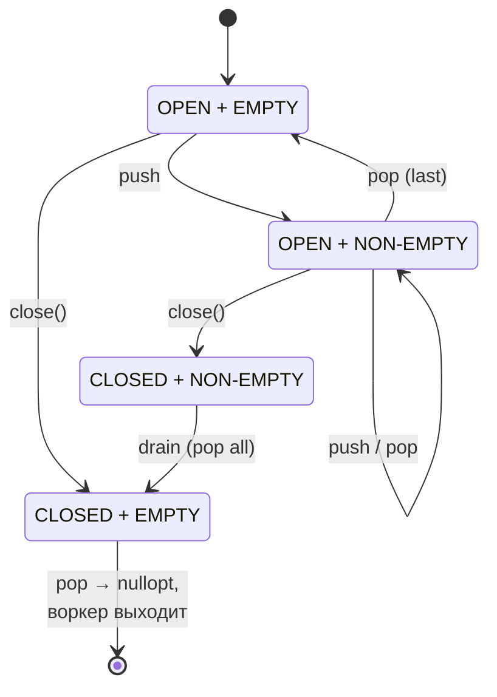

# Thread pool с блокирующей очередью

Создание потока стоит дорого. На Linux `pthread_create` выливается в `clone(2)`, выделение стека (обычно 8 MB виртуального адресного пространства), регистрацию TLS, инициализацию `struct task_struct` в ядре — порядка 50–100 µs на стандартной системе. Для веб-сервера, обслуживающего 10 000 коротких HTTP-запросов в секунду, спавн потока на каждый запрос быстро становится дороже самой обработки.

**Thread pool** — фиксированное (или ограниченно растущее) число заранее запущенных потоков, разбирающих задачи из общей очереди. Стоимость создания потока амортизируется по всему времени жизни процесса, а контекст-свитчи и cache pressure ограничены количеством воркеров.

## Зачем pool, а не spawn-per-task

Стоимость spawn-per-task складывается из четырёх компонентов:

| Компонент            | Стоимость                  | Природа                                                  |
|----------------------|----------------------------|----------------------------------------------------------|
| `clone(2)` + setup   | 30–100 µs                  | syscall + копирование `task_struct`                      |
| Стек                 | 8 MB VM + 4 KB resident    | `mmap(MAP_STACK)`, первая page fault коммитит память     |
| TLS                  | несколько µs               | копирование `tbss`, регистрация в линкере                |
| TLB / scheduler load | непрямая                   | больше потоков → больше context switch, больше TLB-miss  |

Pool с N воркерами платит это один раз при старте. Дальнейший submit task стоит ровно одну операцию над очередью + потенциальный `FUTEX_WAKE`, что укладывается в сотни наносекунд.

Дополнительные эффекты пула:

- **Backpressure**: bounded queue естественно ограничивает скорость прихода задач, защищая систему от OOM.
- **Locality**: повторное использование тех же потоков сохраняет тёплый L1/L2 cache и не сбрасывает TLB.
- **Предсказуемость latency**: число потоков ≈ числу CPU, scheduler не overcommit'ит ядра.

## Архитектура

```
                                  submit(task)
                                       │
                                       ▼
                          ┌─────────────────────────┐
                          │     blocking queue      │
                          │  ┌───┬───┬───┬───┬───┐  │
                          │  │ T │ T │ T │ T │   │  │  ← FIFO
                          │  └───┴───┴───┴───┴───┘  │
                          │   head             tail │
                          └────────────┬────────────┘
                                       │ pop() (блокирует если пусто)
              ┌──────────────┬─────────┴──────────┬──────────────┐
              ▼              ▼                    ▼              ▼
        ┌──────────┐   ┌──────────┐         ┌──────────┐   ┌──────────┐
        │ worker 0 │   │ worker 1 │         │worker N-2│   │worker N-1│
        │          │   │          │  . . .  │          │   │          │
        │ loop:    │   │ loop:    │         │ loop:    │   │ loop:    │
        │  pop     │   │  pop     │         │  pop     │   │  pop     │
        │  exec    │   │  exec    │         │  exec    │   │  exec    │
        └──────────┘   └──────────┘         └──────────┘   └──────────┘
```

Поток управления:

1. `submit(task)` захватывает mutex очереди, помещает task в хвост, делает `notify_one`.
2. Один из спящих воркеров просыпается на cv, проверяет предикат, забирает task из головы, отпускает mutex.
3. Воркер выполняет task вне mutex'а — пока он работает, другие воркеры разбирают остаток очереди параллельно.
4. По завершении task воркер возвращается к `pop()`.
5. `shutdown` помечает очередь closed; воркеры дочёрпывают оставшиеся задачи и выходят; destructor join'ит их.

## Блокирующая очередь

Сердце pool'а — concurrent queue с двумя свойствами: `pop` блокирует поток до появления элемента, и есть способ корректно завершить работу. Минимальная реализация на `std::mutex` + `std::condition_variable`:

```cpp
#include <condition_variable>
#include <mutex>
#include <optional>
#include <queue>

template <typename T>
class BlockingQueue {
    std::mutex              m;
    std::condition_variable cv;
    std::queue<T>           q;
    bool                    closed = false;

public:
    void push(T item) {
        {
            std::lock_guard<std::mutex> lock(m);
            if (closed) return;             // молча отбросить, либо throw
            q.push(std::move(item));
        }
        cv.notify_one();                    // разбудить ровно одного воркера
    }

    std::optional<T> pop() {
        std::unique_lock<std::mutex> lock(m);
        cv.wait(lock, [&] { return !q.empty() || closed; });
        if (q.empty()) return std::nullopt; // closed && empty → "очередь мертва"
        T item = std::move(q.front());
        q.pop();
        return item;
    }

    void close() {
        {
            std::lock_guard<std::mutex> lock(m);
            closed = true;
        }
        cv.notify_all();                    // разбудить всех — пусть выходят
    }
};
```

Несколько решений в этом коде заслуживают комментария.

**`notify_one` vs `notify_all`.** В `push` будит ровно один поток: если он один разбирает один элемент, будить остальных бессмысленно — они проснутся, увидят пустую очередь и снова заснут (thundering herd, см. ниже). В `close` нужен `notify_all`, потому что все воркеры обязаны проснуться и заметить завершение.

**`unique_lock` в `pop`.** `cv.wait` атомарно освобождает mutex и засыпает, а при пробуждении захватывает его обратно. `lock_guard` так не умеет — у него нет операций lock/unlock без RAII.

**Предикат в `wait`.** `wait(lock, predicate)` эквивалентен циклу `while(!pred()) cv.wait(lock);`. Цикл защищает от **spurious wakeups** (ядро может разбудить поток без сигнала) и от ситуации, когда между notify и пробуждением другой воркер уже забрал элемент.

**`std::optional<T>` как возвращаемое значение.** `pop` возвращает `nullopt` только если очередь закрыта **и** пуста. Это даёт воркеру явный сигнал на выход без exception'ов и без sentinel-задачи в очереди.

**Освобождение mutex'а перед `notify_one`.** Скобки `{ ... }` вокруг `lock_guard` существенны: notify под держимым mutex'ом приводит к лишнему пробуждению-и-сну, потому что разбуженный поток сразу упрётся в захваченный mutex. POSIX и C++ Standard оба разрешают notify без удержания, и это эффективнее.

Состояния очереди:



## Простейший Thread Pool

```cpp
#include <atomic>
#include <functional>
#include <thread>
#include <vector>

class ThreadPool {
    std::vector<std::thread>             workers;
    BlockingQueue<std::function<void()>> queue;

public:
    explicit ThreadPool(size_t n) {
        workers.reserve(n);
        for (size_t i = 0; i < n; ++i) {
            workers.emplace_back([this] {
                while (auto task = queue.pop()) {
                    try {
                        (*task)();
                    } catch (...) {
                        // глотаем — иначе terminate уничтожит весь pool
                    }
                }
            });
        }
    }

    template <typename F>
    void submit(F&& task) {
        queue.push(std::function<void()>(std::forward<F>(task)));
    }

    ~ThreadPool() {
        queue.close();                  // разбудить всех воркеров
        for (auto& w : workers)
            if (w.joinable()) w.join(); // дождаться завершения
    }

    ThreadPool(const ThreadPool&)            = delete;
    ThreadPool& operator=(const ThreadPool&) = delete;
};
```

Воркер крутит `while (auto task = queue.pop())` — `pop()` возвращает `nullopt`, когда очередь закрыта и пуста, цикл ломается, поток завершается. Это и есть graceful shutdown: оставшиеся в очереди задачи дочёрпываются, новые `push` после `close` молча игнорируются, никаких задач не теряется и никаких deadlock'ов нет.

`std::function<void()>` стирает тип лямбды или функтора, передаваемого в `submit`. Это позволяет хранить разнородные задачи в одной очереди. Цена — type erasure через указатель + потенциальная heap-аллокация для больших captures (small-buffer optimization обычно покрывает захват одного-двух указателей).

!!! example "Рабочий пример"
    Полная компилируемая реализация thread pool с блокирующей очередью и `submit`, возвращающим `std::future`: `examples/q05_thread_pool/thread_pool.cpp` — собрать и запустить: `cd examples && make q05 && ./bin/q05_thread_pool`.

`try { ... } catch (...)` в воркере критичен: исключение, выпавшее из `task()`, разрушит `std::thread`, что в деструкторе превратится в `std::terminate` и уронит весь процесс. Что делать с пойманным исключением — отдельный вопрос; для submit'ов с результатом ответ даёт `std::packaged_task`.

## submit с возвратом результата

`std::function<void()>` не возвращает значения. Чтобы вернуть результат и пробросить исключение в вызывающий поток, оборачиваем callable в `std::packaged_task`, которая по `get_future()` отдаёт `std::future` (см. [Future/Promise](future_promise.md)):

```cpp
#include <future>
#include <memory>

template <typename F, typename... Args>
auto submit(F&& f, Args&&... args)
    -> std::future<std::invoke_result_t<F, Args...>>
{
    using R = std::invoke_result_t<F, Args...>;

    auto bound = std::bind(std::forward<F>(f), std::forward<Args>(args)...);
    auto task  = std::make_shared<std::packaged_task<R()>>(std::move(bound));
    std::future<R> result = task->get_future();

    queue.push([task] { (*task)(); });   // shared_ptr копируется в лямбду
    return result;
}
```

Использование:

```cpp
ThreadPool pool(4);

auto f1 = pool.submit([](int a, int b) { return a + b; }, 2, 3);
auto f2 = pool.submit([] { throw std::runtime_error("boom"); });

std::cout << f1.get() << "\n";          // 5
try   { f2.get(); }
catch (const std::exception& e) { std::cout << e.what() << "\n"; }
```

Два неочевидных момента в реализации.

**Почему `shared_ptr<packaged_task>`, а не задача целиком в лямбде?** `packaged_task` move-only — её нельзя положить внутрь `std::function`, потому что `std::function` требует **CopyConstructible** Callable (исторический долг C++11; в C++23 появился `std::move_only_function`, который этого не требует). `shared_ptr` делает обёртку копируемой, при этом сам `packaged_task` остаётся внутри одним экземпляром.

**Кто держит `packaged_task` до выполнения?** Лямбда захватывает `shared_ptr` по копии — это последний живой указатель, пока task не выполнена. После `(*task)()` лямбда уничтожается, `shared_ptr` отпускает task, `future` уже получила результат через свой shared state.

## Узкие места

```
sub  ─▶┐     ┌────────────────────────┐     ┌─▶ worker 0
sub  ─▶┤     │                        │     ├─▶ worker 1
sub  ─▶┼────▶│   глобальный mutex     │────▶┼─▶ worker 2
sub  ─▶┤     │   + одна cache line    │     ├─▶ worker 3
sub  ─▶┘     └────────────────────────┘     └─▶ worker N-1

                    ▲
                    │
              узкое место:
              все ходят через
              эту дверь по одному
```

Простой pool отлично работает до ~10⁵ задач в секунду. На большем потоке вылезают три проблемы.

**Mutex contention.** Все `submit` и все `pop` крутятся через один `std::mutex`. На 16 потоках, борющихся за один mutex, доля времени, проведённого в slow-path futex, растёт нелинейно. Профилировщик показывает `__lll_lock_wait` в топе.

**Cache ping-pong.** `head` и `tail` указатели `std::queue` (внутри обёрнутого `std::deque`) лежат рядом в одной cache line. Поток, делающий `push`, дёргает её на свой L1 (MESI: M state), и каждый поток, делающий `pop`, инвалидирует свой кэш. На 16 потоках с большим RPS cache line летает между ядрами тысячи раз в секунду — отдельные ассемблерные инструкции `lock` стоят сотни ns вместо единиц.

**Thundering herd.** Если бы `push` делал `notify_all` вместо `notify_one`, все N воркеров проснулись бы на каждый task. N−1 из них упёрлись бы в захваченный mutex, заснули обратно — лишних 2N context switch'ей на каждый task. `notify_one` это убирает, но не решает первые две проблемы.

Что делать:

- **Sharded queue**: M очередей, submit round-robin'ом или по хэшу caller'а — уменьшает contention в M раз.
- **Per-CPU queue**: воркер всегда читает из «своей» очереди, cache line почти не мигрирует.
- **Lock-free queue**: убирает mutex как primitive contention point.
- **Work-stealing**: combo per-worker queue + кража, когда своя пуста.

## Work-stealing

Work-stealing — стандарт для CPU-bound workload в современных runtime'ах (Intel TBB, Cilk, Java ForkJoinPool, Tokio, Go runtime). Каждый воркер имеет свою **deque** (double-ended queue); владелец работает с одним концом, воры — с другим.

```
   worker 0 own deque                            worker 1 own deque
   ┌────────────────────────┐                    ┌────────────────────────┐
   │ T7  T6  T5  T4  T3  T2 │                    │       (empty)          │
   │  ▲                   ▲ │                    │                        │
   │  │                   │ │                    └───────────┬────────────┘
   │  │ steal from top    │ │                                │
   │  │ (FIFO, thieves)   │ │                                │ своя пуста
   │  │                   │ │                                ▼
   │  │           push/pop│ │              ┌────────────────────────────────┐
   │  │           (LIFO,  │ │              │ выбрать случайную жертву,      │
   │  │           by owner│ │              │ peek верхушку её deque,        │
   │  │                   │ │              │ если непусто — CAS-украсть     │
   └────────────────────────┘              └────────────────────────────────┘
```

Ключевые свойства:

- **Owner работает LIFO снизу.** Свежее задание оказывается рядом с тёплым cache; recursive parallelism (родительская task ждёт результата от child'ов, которые она же положила) распаковывается естественным DFS.
- **Воры крадут FIFO сверху.** Снизу деки — «горячий» хвост, активно мигрирующий между cache lines владельца; сверху — старые задачи, которые владелец трогать перестал, их можно унести без false sharing.
- **Конкурируют только владелец и воры.** Между двумя ворами одной очереди — да, но эта конкуренция редкая, и решается классическим Chase-Lev deque (lock-free deque с CAS только на верхнем конце).
- **Если своя пуста, владелец сам идёт воровать.** Стратегия выбора жертвы — обычно случайная (uniform random); это даёт хорошее распределение нагрузки без глобального координатора.

Сравнение с глобальной FIFO-очередью:

| Свойство             | Global FIFO queue                | Work-stealing                          |
|----------------------|----------------------------------|----------------------------------------|
| Contention point     | один mutex                       | в основном per-worker, редкая на краже |
| Cache locality       | плохая (миграция между CPU)      | отличная (LIFO в hot cache)            |
| Fairness             | строгая FIFO                     | приоритет «своих» задач                |
| Latency для new task | низкая (next worker берёт сразу) | может ждать кражи, если воркер занят   |
| Подходит для         | I/O-bound, mixed                 | CPU-bound, fork-join parallelism       |

Work-stealing проигрывает global queue по latency на единичных задачах в idle-pool'е (вор должен «обнаружить» новую работу через random probing), но выигрывает на throughput при насыщении.

## Lock-free queue

Альтернатива mutex'у — MPMC (multi-producer, multi-consumer) lock-free queue. Классическая основа — **Michael-Scott queue** (1996, см. [Lock-free структуры](lock_free_structures.md)) — связный список с CAS на хвосте для enqueue и на голове для dequeue.

```cpp
// Концептуально, без ABA-защиты:
struct Node { T value; std::atomic<Node*> next; };
std::atomic<Node*> head, tail;

void enqueue(T v) {
    Node* n = new Node{std::move(v), nullptr};
    Node* old_tail;
    do {
        old_tail = tail.load();
    } while (!tail.compare_exchange_weak(old_tail, n));
    old_tail->next.store(n);
}
```

Реальный production-grade `Node` обвешан hazard pointers или epoch-based reclamation, чтобы избежать use-after-free при удалении узлов. **ABA-проблема** (CAS видит то же значение, но память переиспользована) решается tagged pointers или той же epoch reclamation.

Готовые библиотеки:

| Библиотека                    | Особенности                                                      |
|-------------------------------|------------------------------------------------------------------|
| `moodycamel::ConcurrentQueue` | bounded и unbounded, batched ops, header-only                    |
| `boost::lockfree::queue`      | strict lock-free, bounded, требует trivially copyable T          |
| `folly::MPMCQueue`            | bounded, ticket-based, очень быстрая на высокой нагрузке         |
| `rigtorp::SPSCQueue`          | single-producer single-consumer, нулевая контенция               |

Tradeoff: lock-free сложнее, агрессивно нагружает coherency protocol (CAS — это атомарная транзакция, требующая monopoly на cache line), и в low-contention режиме часто **медленнее** обычного mutex'а. Берут lock-free тогда, когда профиль показывает mutex как bottleneck, либо когда нужны wait-free гарантии для realtime.

## Sizing thread pool

Число воркеров — единственный параметр, влияющий на performance больше всего. Универсального ответа нет, потому что оптимум зависит от природы задач.

**CPU-bound.** Если task насыщает CPU (вычисления, парсинг, компрессия), оптимум — около числа доступных аппаратных потоков:

```cpp
size_t n = std::thread::hardware_concurrency();   // включая SMT/HT
```

Иногда берут `N_CPU + 1` — лишний поток покрывает редкие блокировки на page fault. Больше потоков, чем CPU, добавляет context switching overhead без прироста throughput.

**Hyperthreading nuance.** На SMT процессоре `hardware_concurrency()` возвращает число логических CPU (обычно 2× физических). Для чистого CPU-bound workload SMT даёт ~1.2–1.4× throughput, не 2× — два логических ядра делят execution units. Для memory-bound workload эффект больше, потому что один поток ждёт RAM, второй использует ALU. Для AVX-heavy кода SMT часто вреден.

**I/O-bound.** Если task блокируется на syscall (read, write, recv), CPU простаивает. Формула Little's Law:

```
N_threads = N_cpu × (1 + wait_time / compute_time)
```

Task, проводящий 90% времени в `read()` и 10% в обработке, нуждается в N_cpu × 10 потоках, чтобы насытить CPU. На практике это означает, что для типичного веб-бэкенда с базами данных и внешними API пулы из 50–200 потоков — норма.

**Адаптивные пулы.** Java `ForkJoinPool` (на work-stealing) автоматически спавнит **compensation threads**, когда воркер блокируется в `ManagedBlocker`. Это даёт лучшее обоих миров: малое базовое число потоков для CPU-bound фазы, эластичный рост при блокировках. Цена — сложность реализации.

Современная альтернатива — отделить blocking I/O от CPU-bound pool'а: маленький CPU-pool (N_CPU воркеров), отдельный blocking pool (десятки воркеров) для syscall'ов. Так делают Tokio (`spawn_blocking`) и Java Loom.

## Реальные thread pools

| Реализация                          | Особенности                                                   |
|-------------------------------------|---------------------------------------------------------------|
| `boost::asio::thread_pool`          | FIFO global queue, интеграция с executor framework            |
| Intel TBB `task_scheduler_init`     | work-stealing, task DAG, blocking-aware                       |
| OpenMP runtime                      | за `#pragma omp parallel`, общий pool на process              |
| libuv thread pool                   | Node.js: blocking syscalls (fs, dns); по умолчанию 4 потока   |
| `std::async(std::launch::async, …)` | реализация-зависимая: GCC спавнит поток на вызов, MSVC — pool |
| Java `ForkJoinPool`                 | work-stealing, compensation threads, `parallelStream`         |
| Java `Executors.newFixedThreadPool` | классический FIFO, под капотом — `LinkedBlockingQueue`        |
| Go runtime (M:N scheduler)          | goroutines на work-stealing pool, нет явного user-facing API  |
| Rust Tokio multi-thread runtime     | work-stealing + `spawn_blocking` для I/O                      |

`std::async(std::launch::async)` в GCC до сих пор спавнит честный `std::thread` на каждый вызов — никакого pool'а под капотом. Если нужна реальная пуловая семантика, либо MSVC, либо своя реализация поверх `std::packaged_task` (как выше). Это поведение implementation-defined, поэтому не на что полагаться в кросс-платформенном коде.

## Подводные камни

**Recursive submit с bounded queue.** Воркер выполняет task, та сабмитит подзадачу в тот же pool и ждёт её результат. Если очередь полна и `submit` блокирует, а все воркеры висят на `future.get()` — deadlock. Решения: unbounded queue, отдельный pool для подзадач, или work-stealing с inlining (TBB так умеет — если task ждёт sub-task, текущий воркер выполняет sub-task сам, не отдавая в очередь).

**Непойманные исключения.** Если `task()` бросает наружу из лямбды воркера и нет `try { ... } catch (...)`, поток `std::thread` завершится с активным исключением → terminate всего процесса. Поэтому либо `submit` через `packaged_task` (исключение уходит в `future`), либо явный catch в worker loop.

**Незавершённый shutdown.** Если деструктор pool'а не дождётся join'ов, лямбды воркеров могут продолжить выполняться после смерти захваченных `this`-ссылок → use-after-free. `~ThreadPool` обязан вызвать `close()` **и** `join()` для каждого worker'а.

**Stack overflow в task.** Стек воркера фиксирован (`pthread_attr_setstacksize`, по умолчанию 8 MB). Рекурсивная task с глубоким стеком уронит **только этот воркер** в SIGSEGV — остальные продолжат работу, но pool потеряет один поток и не заметит этого. Health-check на число живых воркеров обычно никто не делает; диагностика приходит из логов в виде «pool deadlocked».

**Длинные task блокируют pool.** Single long-running task занимает воркер на минуты, остальные задачи ждут. Если N задач длиннее N_workers — pool вообще перестаёт прогрессировать. Стандартная защита — таймауты внутри task, или разделение pool'ов по latency-классам (short vs long).

**Mutex-захват в task'е и `notify` под mutex'ом.** Task внутри захватывает тот же mutex, что и `BlockingQueue` — гарантированный deadlock. На практике это редко случается напрямую, но косвенно через recursive submit + future — постоянно.

## Связанные темы

- [Синхронизация: мьютексы, семафоры, futex](thread_synchronization.md) — механика mutex, condition variable, futex fast/slow path
- [Future/Promise](future_promise.md) — async submit с возвратом результата через `packaged_task`
- [Atomic операции и memory model](atomics_and_memory_model.md) — основа для lock-free очередей
- [Lock-free структуры](lock_free_structures.md) — Michael-Scott queue, ABA, hazard pointers
- [Потоки (основы)](threads_basics.md) — стоимость `pthread_create`, размер стека, TLS

## Источники

- Anthony Williams, *C++ Concurrency in Action*, 2nd ed., Chapter 9 — реализация thread pool, work-stealing, task continuations
- Maurice Herlihy, Nir Shavit, *The Art of Multiprocessor Programming* — формальная модель work-stealing, Chase-Lev deque
- Maged M. Michael, Michael L. Scott, *Simple, Fast, and Practical Non-Blocking and Blocking Concurrent Queue Algorithms* (PODC '96)
- Robert D. Blumofe, Charles E. Leiserson, *Scheduling Multithreaded Computations by Work Stealing* (FOCS '94)
- [Intel TBB documentation](https://uxlfoundation.github.io/oneTBB/) — task scheduler, work-stealing
- [Boost.Asio source: `thread_pool`](https://www.boost.org/doc/libs/release/doc/html/boost_asio/reference/thread_pool.html)
- [moodycamel ConcurrentQueue design notes](https://moodycamel.com/blog/2014/a-fast-general-purpose-lock-free-queue-for-c++)
- `man 3 pthread_create`, `man 3 pthread_cond_wait`
