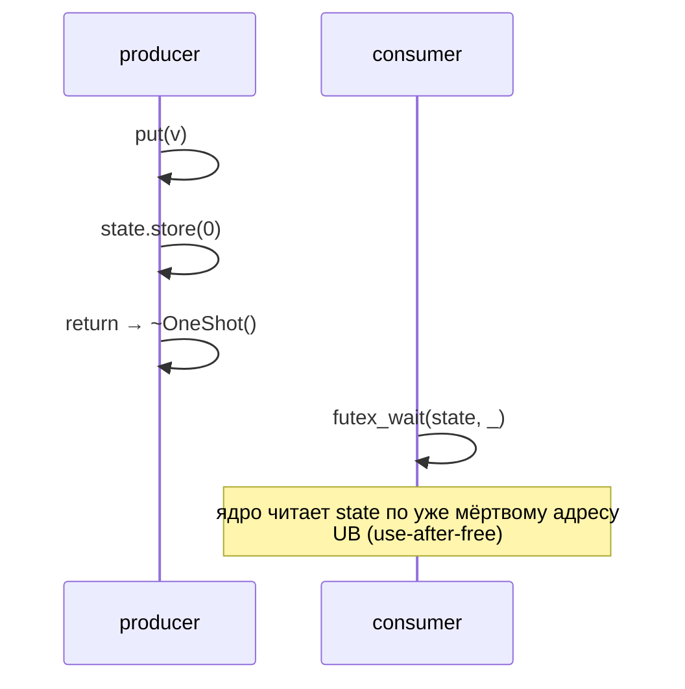
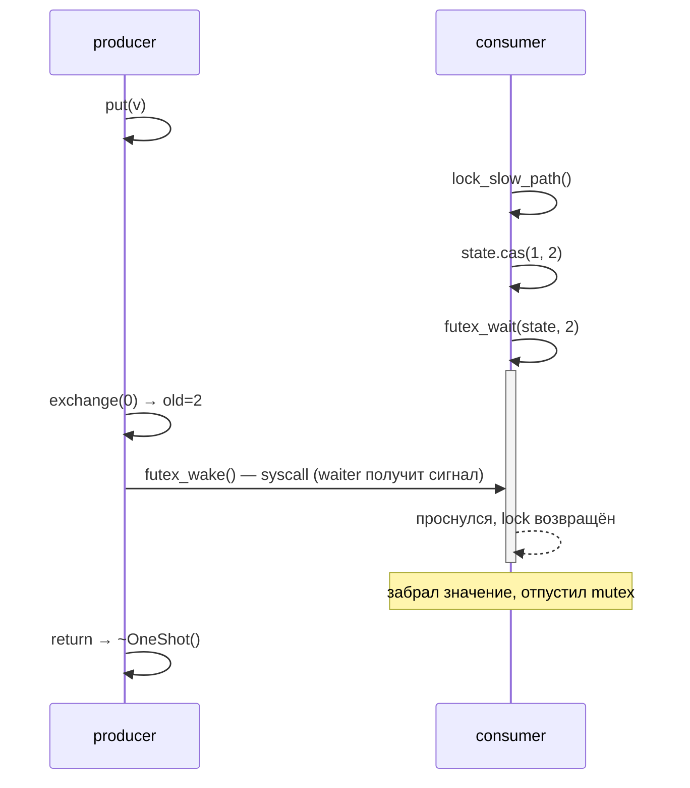
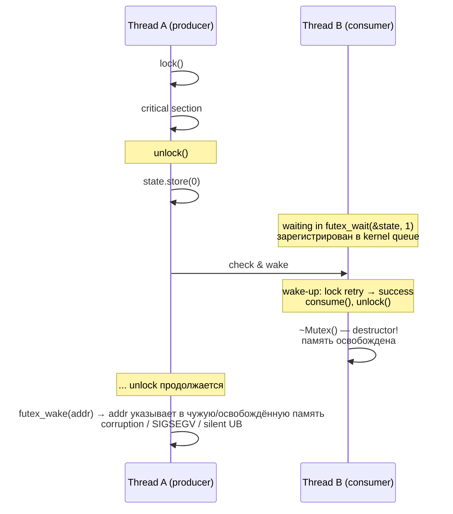
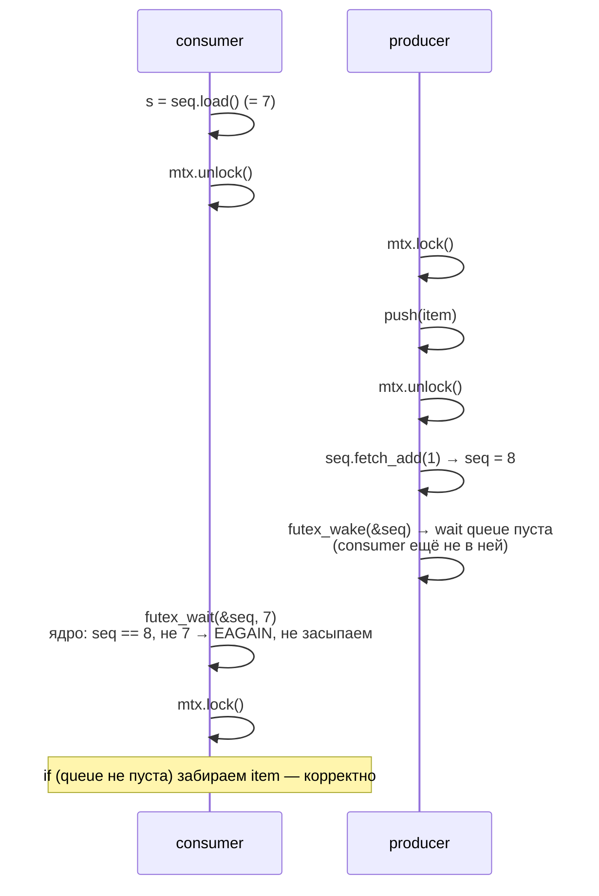
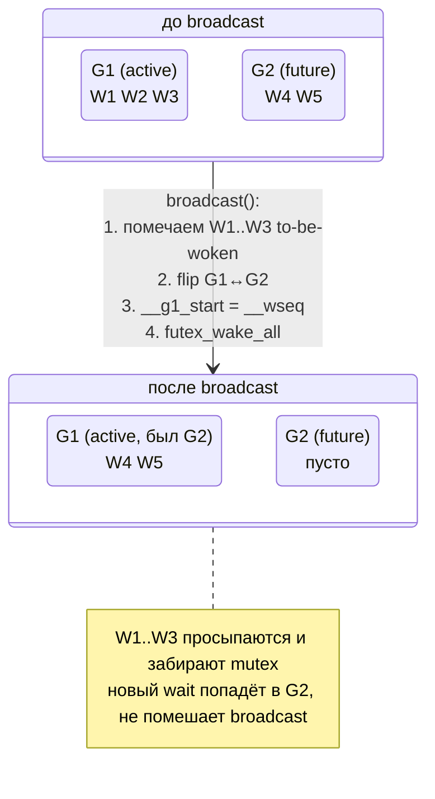

# Синхронизация потоков: мьютексы, семафоры, futex

Когда несколько потоков обращаются к общим данным без координации — возникают **гонки (race conditions)**,
приводящие к непредсказуемым результатам. Для их предотвращения используют примитивы синхронизации.

## Race condition

**Race condition** — ситуация, когда результат программы зависит от непредсказуемого порядка выполнения потоков.

```cpp
int counter = 0;  // общая переменная

void increment() {
    for (int i = 0; i < 100000; ++i)
        counter++;  // НЕ атомарно: read → add → write
}

// 10 потоков → ожидаем 1 000 000, получаем ~600 000
```

`counter++` транслируется в три инструкции. Если между ними произошло переключение контекста,
изменение одного потока перезапишет изменение другого.

## Мьютекс (Mutex)

**Mutex (Mutual Exclusion)** — примитив, гарантирующий, что в **критической секции** находится только один поток.

```cpp
#include <mutex>

int counter = 0;
std::mutex mtx;

void increment() {
    for (int i = 0; i < 100000; ++i) {
        std::lock_guard<std::mutex> lock(mtx);  // RAII: unlock при выходе из scope
        counter++;
    }
}
// Теперь counter == 1 000 000 гарантированно
```

**Pthreads (C API):**

```c
#include <pthread.h>

pthread_mutex_t mtx = PTHREAD_MUTEX_INITIALIZER;

pthread_mutex_lock(&mtx);
// критическая секция
pthread_mutex_unlock(&mtx);
```

### Deadlock

**Deadlock** — взаимная блокировка: поток A ждёт мьютекс B (который держит поток B),
а поток B ждёт мьютекс A (который держит поток A).

```cpp
std::mutex mtx1, mtx2;

// Поток 1                        // Поток 2
std::lock_guard lock1(mtx1);      std::lock_guard lock2(mtx2);
sleep(1);                         sleep(1);
std::lock_guard lock2(mtx2);  // DEADLOCK  std::lock_guard lock1(mtx1);  // DEADLOCK
```

**Как избежать:**

```cpp
// 1. Всегда захватывать в одном порядке (оба — mtx1, потом mtx2)

// 2. std::lock — атомарный захват нескольких мьютексов
std::lock(mtx1, mtx2);
std::lock_guard l1(mtx1, std::adopt_lock);
std::lock_guard l2(mtx2, std::adopt_lock);

// 3. try_lock с таймаутом
if (mtx1.try_lock_for(std::chrono::milliseconds(100))) { /* ... */ }
```

## Семафор

**Семафор** — целочисленный счётчик с операциями `wait` (P, уменьшить) и `signal` (V, увеличить).

- `wait`: если значение > 0 — уменьшить и продолжить; если 0 — заблокировать.
- `signal`: увеличить и пробудить одного ожидающего.

**Счётный семафор** ограничивает число одновременных потоков (например, пул соединений):

```cpp
#include <semaphore.h>
#include <thread>

sem_t sem;
sem_init(&sem, 0, 3);   // максимум 3 потока одновременно

void worker(int id) {
    sem_wait(&sem);      // P (уменьшить, блокировать при 0)
    // ... работа с ресурсом ...
    sem_post(&sem);      // V (увеличить, пробудить ожидающих)
}
```

**POSIX API:**

```c
sem_init(sem_t *, int pshared, unsigned value);  // pshared=0: только потоки; 1: между процессами
sem_wait(sem_t *);       // блокирующий P
sem_trywait(sem_t *);    // неблокирующий P (-1 + EAGAIN если занято)
sem_post(sem_t *);       // V
sem_getvalue(sem_t *, int *sval);
sem_destroy(sem_t *);
```

**Именованные семафоры** (между процессами):

```c
sem_t *s = sem_open("/my_sem", O_CREAT, 0666, 1);
sem_wait(s);
sem_post(s);
sem_close(s);
sem_unlink("/my_sem");
```

## Futex

**futex (fast userspace mutex)** — низкоуровневый примитив ядра Linux.
Ключевая идея: **без конкуренции** не нужен syscall — только атомарная операция над переменной в памяти.
Syscall делается только при реальной блокировке/пробуждении.

На futex построены `pthread_mutex_t`, `std::mutex`, `sem_t`.

```
futex: fast path vs slow path

  lock() — нет конкуренции (fast path):
  ┌─────────────────────────────────────────────────────────┐
  │  USER SPACE                                             │
  │                                                         │
  │  state == 0  ──▶  CAS(0 → 1)  ──▶  захват               │
  │                    (атомарная CPU-инструкция)           │
  │                    без syscall, без kernel              │
  └─────────────────────────────────────────────────────────┘

  lock() — конкуренция (slow path):
  ┌─────────────────────────────────────────────────────────┐
  │  USER SPACE                                             │
  │                                                         │
  │  state != 0  ──▶  CAS(1 → 2)  ──▶  syscall ─────────┐   │
  └─────────────────────────────────────────────────────┼───┘
                                                        │
  ┌─────────────────────────────────────────────────────┼───┐
  │  KERNEL SPACE                                       │   │
  │                                                     ▼   │
  │         futex wait queue [uaddr]                        │
  │         ┌──────────────────────────┐                    │
  │         │  Thread B  │  Thread C   │  ← спят            │
  │         └──────────────────────────┘                    │
  └─────────────────────────────────────────────────────────┘

  unlock():
  ┌─────────────────────────────────────────────────────────┐
  │  USER SPACE                                             │
  │                                                         │
  │  state.exchange(0)                                      │
  │  old == 2 (были ожидающие)  ──▶  syscall FUTEX_WAKE ─┐  │
  └──────────────────────────────────────────────────────┼──┘
                                                         │
  ┌──────────────────────────────────────────────────────┼──┐
  │  KERNEL SPACE                                        ▼  │
  │         пробудить 1 поток из wait queue                 │
  │         ──▶ Thread B переходит в RUNNABLE               │
  └─────────────────────────────────────────────────────────┘
```

```c
#include <linux/futex.h>
#include <sys/syscall.h>

// Заблокировать поток, если *uaddr == val
syscall(SYS_futex, uaddr, FUTEX_WAIT, val, NULL, NULL, 0);

// Пробудить до n потоков, ожидающих на uaddr
syscall(SYS_futex, uaddr, FUTEX_WAKE, n, NULL, NULL, 0);
```

### Простой mutex на futex

```cpp
#include <atomic>
#include <sys/syscall.h>
#include <unistd.h>
#include <linux/futex.h>

class FutexMutex {
    // 0=free, 1=locked, 2=locked+waiters
    std::atomic<uint32_t> state{0};

    static void futex_wait(std::atomic<uint32_t> *a, uint32_t v) {
        syscall(SYS_futex, a, FUTEX_WAIT_PRIVATE, v, nullptr, nullptr, 0);
    }
    static void futex_wake(std::atomic<uint32_t> *a) {
        syscall(SYS_futex, a, FUTEX_WAKE_PRIVATE, 1, nullptr, nullptr, 0);
    }

public:
    void lock() {
        while (true) {
            uint32_t expected = 0;
            // Быстрый путь: захватить без syscall
            if (state.compare_exchange_strong(expected, 1,
                    std::memory_order_acquire)) return;

            // Медленный путь: есть конкуренция
            expected = 1;
            state.compare_exchange_strong(expected, 2, std::memory_order_relaxed);
            futex_wait(&state, 2);
        }
    }

    void unlock() {
        uint32_t old = state.exchange(0, std::memory_order_release);
        if (old == 2) futex_wake(&state);  // были ожидающие
    }
};
```

| State | Смысл                 | lock()                | unlock()           |
|-------|-----------------------|-----------------------|--------------------|
| 0     | Свободно              | CAS(0→1), без syscall | exchange(0)        |
| 1     | Занято, нет ожидающих | CAS(1→2) + FUTEX_WAIT | exchange(0)        |
| 2     | Занято + ожидающие    | FUTEX_WAIT            | exchange(0) + WAKE |

### Зачем именно три состояния

В предыдущем коде состояний три, а не два — и это не «для красоты». Двухсостоянный mutex (свободно / занято) был бы
проще: `lock = CAS(0→1)` или `futex_wait`, `unlock = store(0) + futex_wake`. Но у него два дефекта.

**Лишний syscall на каждое unlock.** Если ни одного waiter'а в очереди нет, `futex_wake(uaddr, 1)` всё равно
улетает в ядро. Ядро находит пустую wait queue и возвращается ни с чем — ~100 нс впустую. Под uncontended нагрузкой,
типичной для большинства мьютексов в реальном коде, это стоимость 80–95% всех unlock'ов.

Трёхсостоянный mutex добавляет состояние LOCKED_WITH_WAITERS (2). Перед `futex_wait` в slow path поток сам помечает
mutex: «я тут засыпаю, не забудь меня разбудить» (CAS 1→2). Тогда unlock читает старое значение и принимает решение:

```
unlock():
    old = state.exchange(0)
    if old == 2:         ──▶  были waiter'ы, нужен futex_wake → syscall
    else (old == 1):     ──▶  никого не было, всё уже разблокировано без syscall'а
```

В uncontended случае старое значение всегда 1 — никакой syscall не вызывается. Это и есть смысл «futex = fast userspace
mutex»: в типичном пути ядро не участвует вообще.

**Защита от use-after-free на одноразовых примитивах.** Сценарий — `OneShot<T>` (single-producer / single-consumer слот
на один элемент), реализованный поверх mutex'а и condition variable. Producer кладёт значение, делает unlock,
заканчивает свою работу и **разрушает** `OneShot`. Consumer должен забрать значение и тоже отпустить.

С двухсостоянным mutex это race: после `store(0)` в unlock producer возвращает управление вверх по стеку, дальше у
producer'а нет никаких обязательств — он может вызвать деструктор `OneShot`. А consumer в этот момент ещё спит в
`futex_wait`. Producer должен **гарантированно** разбудить его до возврата — иначе деструктор зачистит память, на которую
consumer держит указатель в kernel wait queue.



С трёхсостоянным mutex producer **читает** старое значение в exchange и видит, что оно равно 2 — есть waiter, значит,
обязан синхронно вызвать `futex_wake` до возврата. Никакого «может быть waiter, может нет» — состояние памяти
самодостаточно отвечает на этот вопрос.



Третье состояние работает как метка: «пока я не зайду в ядро и не подниму вас, не уходите». Двух состояний
недостаточно, чтобы отличить «никто не спит» от «я только что положил себя в queue, но producer ещё не видел».

### OneShot destroyer race в деталях

Сам сценарий ломается на коротком окне между «producer закончил unlock» и «consumer ещё не вышел из ядра». Если в этом
окне память primitive'а уходит — kernel пишет в чужой адрес или возвращает waiter в стек, которого больше нет.



Трёхсостоянный mutex даёт producer'у атомарный ответ на вопрос «нужно ли мне делать syscall перед возвратом»:

```
трёхсостоянный mutex: producer знает заранее

  state == 1  ──▶  unlock = exchange(0), old == 1, никаких waiters
                   нет необходимости в futex_wake → возвращаемся сразу
                   ──▶ деструктор может бежать безопасно

  state == 2  ──▶  unlock = exchange(0), old == 2, есть waiter
                   обязаны вызвать futex_wake до return
                   ──▶ кто бы ни вызвал destructor — это будет после wake
```

Состояние 2 здесь — не «оптимизация», а контракт о том, кто и когда отвечает за финальный wake.

### PI-futex (priority inheritance)

Реальные RT-системы (промышленные контроллеры, audio pipeline'ы, ROS-роботы) сталкиваются с **priority inversion** —
ситуацией, когда high-priority поток косвенно блокирован low-priority через цепочку.

```
priority inversion

  prio   thread     состояние
  ────   ──────     ─────────
   high  H          блокирован на mutex M (его держит L)
   med   M1, M2     RUNNABLE: вытесняют L, не дают ему отпустить M
   low   L          держит mutex M, не получает CPU

  результат: H ждёт mtx, который ждёт L, который ждёт CPU,
             который занят M1/M2 которым H по идее обязан вытеснять
             ──▶ H фактически работает на priority L (Mars Pathfinder, 1997)
```

Решение — **priority inheritance**: пока L держит mutex, на котором ждёт H, kernel **временно** поднимает priority L до
priority H. M1/M2 больше не вытесняют L, L отпускает mutex, priority L возвращается, H запускается.

Linux реализует это через специальный класс futex-операций — **PI-futex**:

| Операция                | Семантика                                                                 |
|-------------------------|---------------------------------------------------------------------------|
| `FUTEX_LOCK_PI`         | взять mutex; при contention — заснуть и поднять priority owner'а          |
| `FUTEX_UNLOCK_PI`       | атомарно вернуть owner'у его priority и пробудить highest-priority waiter |
| `FUTEX_TRYLOCK_PI`      | неблокирующая попытка                                                     |
| `FUTEX_WAIT_REQUEUE_PI` | используется в pthread_cond_wait на PI-mutex                              |

Состояние PI-futex хранится прямо в futex word (32 бита) — kernel и userspace интерпретируют его одинаково:

```
PI-futex word layout (32 бита)

   31      30                                            0
  ┌──────┬──────┬──────────────────────────────────────────┐
  │ OWN  │ WAIT │              TID owner                   │
  │ DIED │ ERS  │              (30 младших бит)            │
  └──────┴──────┴──────────────────────────────────────────┘

  FUTEX_OWNER_DIED  (бит 30) — поток-владелец завершился, не отпустив mutex
  FUTEX_WAITERS     (бит 31) — есть waiter'ы в kernel queue
  TID               (0-29)   — pid владельца (gettid()), 0 = свободно
```

Userspace берёт fast path через CAS: `0 → gettid()` означает «захвачен мной, без waiters». При contention kernel сам
обновляет верхние биты, поэтому проверять их без syscall'а нельзя.

В pthread PI включается атрибутом:

```c
pthread_mutexattr_t attr;
pthread_mutexattr_init(&attr);
pthread_mutexattr_setprotocol(&attr, PTHREAD_PRIO_INHERIT);
pthread_mutex_t m;
pthread_mutex_init(&m, &attr);
```

В **PREEMPT_RT** patchset (mainline с Linux 6.12) все `mutex`, `rwsem`, `spinlock` ядра преобразованы в PI-варианты по
умолчанию — обычный spinlock превращается в `rt_mutex` со sleeping-семантикой и PI. Это меняет всю модель блокировок
ядра ради bounded latency.

### Robust mutex

Сценарий: процесс держит pthread_mutex_t (например, в shared memory между процессами), получает `SIGKILL` или
сегфолтится посреди критической секции. Mutex остаётся «навечно занят» с TID мёртвого потока в state — другие
ожидающие зависают forever, потому что некому вызвать `unlock`.

Решение — **robust mutex**: kernel при exit потока сам обходит список взятых им mutex'ов и помечает их как
«owner died».

```c
pthread_mutexattr_t attr;
pthread_mutexattr_init(&attr);
pthread_mutexattr_setrobust(&attr, PTHREAD_MUTEX_ROBUST);
pthread_mutex_init(&m, &attr);
```

Механизм — **robust futex list**. Каждый поток регистрирует через `set_robust_list(head, len)` указатель на голову
своего списка. При взятии robust mutex'а pthread добавляет узел в этот список (linked в userspace), при отпускании —
удаляет.

```
robust list поток-локальный (per-task)

  task_struct (kernel)
  ┌──────────────────────────┐
  │ robust_list = &head      │ ──┐
  └──────────────────────────┘   │
                                 ▼
                       ┌─────────────────────┐
              head ──▶ │ next ──▶ mutex_2    │
                       │ offset = -8         │  ◀── смещение futex_word внутри mutex
                       └─────────┬───────────┘
                                 ▼
                       ┌─────────────────────┐
                       │ next ──▶ mutex_5    │
                       └─────────┬───────────┘
                                 ▼
                              NULL
```

При exit_mm / do_exit kernel:

1. Читает robust_list через указатель в task_struct.
2. Для каждого узла находит futex_word по `offset` и атомарно выставляет в нём `FUTEX_OWNER_DIED`.
3. Если установлен `FUTEX_WAITERS`, вызывает `futex_wake` на этом адресе.

Waiter, проснувшись с `FUTEX_OWNER_DIED` в state, получает из `pthread_mutex_lock` код `EOWNERDEAD`. Mutex технически
взят им — но в **неконсистентном** состоянии: предыдущий владелец мог не успеть восстановить инвариант (например,
обновил queue head, но не tail). Дальше — решение приложения:

| Действие                                | Когда применимо                                                           |
|-----------------------------------------|---------------------------------------------------------------------------|
| `pthread_mutex_consistent()`            | приложение знает, как восстановить инвариант → продолжаем                 |
| `pthread_mutex_unlock()` без consistent | помечаем mutex unrecoverable; все будущие `lock` вернут `ENOTRECOVERABLE` |

PI + robust вместе — это **полноценный** mutex современного pthread: переживает priority inversion и смерть владельца.
Большинство production-кода в shared memory (PostgreSQL ipc, kdb+, торговые системы) использует именно эту комбинацию.

### glibc lll_lock внутри

В исходниках NPTL (glibc threading layer) базовый kernel-aware primitive называется **lll** — *low-level lock*.
`pthread_mutex_lock` для обычного (не PI, не robust) recursive=NORMAL mutex'а в итоге раскручивается до `lll_lock`.

Это ровно тот трёхсостоянный mutex, который описан выше, но в боевом виде — с правильными memory order'ами и
системными syscall-обёртками:

```c
// nptl/lowlevellock.h — упрощённо до сути

#define LLL_LOCK_INITIALIZER 0

static inline void lll_lock(int *futex, int private) {
    int expected = 0;
    // fast path: 0 → 1, без contention
    if (atomic_compare_exchange_weak_acquire(futex, &expected, 1))
        return;
    lll_lock_wait(futex, private);
}

static void lll_lock_wait(int *futex, int private) {
    // зацикливаемся, пока кто-то держит mutex
    while (atomic_exchange_acquire(futex, 2) != 0) {
        // выставили 2 ("я тут жду") и спим, пока state == 2
        futex_wait(futex, 2, private);
    }
}

static inline void lll_unlock(int *futex, int private) {
    // fast path: если был 1 (никто не ждёт) — release-store(0) и всё
    int old = atomic_exchange_release(futex, 0);
    if (__glibc_unlikely(old > 1))
        futex_wake_one(futex, private);
}
```

Тонкости, на которых ловятся самописные реализации:

| Деталь                                | Зачем                                                                |
|---------------------------------------|----------------------------------------------------------------------|
| `xchg` вместо `cas` в slow path       | xchg всегда успевает; cas в loop требует extra-read                  |
| acquire на lock, release на unlock    | публикует все writes критической секции до того, как mutex отпущен   |
| `_PRIVATE` флаг futex                 | private-futex не шарится между процессами → меньше hashing в kernel  |
| wake **one**, не all                  | thundering herd: разбудить 100 waiter'ов чтобы 99 сразу заснули      |

**Wake-one vs wake-all.** Для mutex просыпаться должен ровно один waiter: остальные всё равно пойдут опять в
`futex_wait`, потратив 100+ контекст-свитчей на пустое место. Это **thundering herd** — классическая проблема, из-за
которой раньше web-сервера ложились на `accept()` (решено в Linux 2.6 через `WQ_FLAG_EXCLUSIVE`). Для cv на broadcast
используется wake-all, потому что разные waiters ждут разных predicate'ов.

!!! example "Рабочий пример"
    Полные компилируемые реализации futex-мьютекса:

    - двухсостоянный futex-mutex: `examples/q07_futex_mutex/futex_mutex.cpp`
    - трёхсостоянный mutex (free / locked / locked+waiters), без лишнего syscall на uncontended unlock: `examples/q08_three_state_mutex/three_state.cpp`

    Собрать и запустить: `cd examples && make q07 q08 && ./bin/q07_futex_mutex`

## Condition variables через futex

`cv.wait(lk)` атомарно делает три вещи: отпускает mutex, засыпает на cv, при пробуждении захватывает mutex обратно.
Атомарность «отпустить + заснуть» — отдельная проблема: между unlock и `futex_wait` другой поток может успеть позвать
`notify_one`, и сигнал будет потерян (lost wakeup) — consumer навсегда останется в wait queue.

Решение — **счётчик поколений** (generation counter, или seq). Cv хранит monotonic счётчик; `notify_*` инкрементирует
его перед `futex_wake`; `wait` запоминает значение **до** unlock и зовёт `futex_wait` на это значение. Если notify
произошёл в окне «после запоминания, до futex_wait», kernel сразу вернёт `EAGAIN` — потому что текущее значение
счётчика уже не совпадает с переданным.

```cpp
#include <atomic>
#include <linux/futex.h>
#include <sys/syscall.h>
#include <unistd.h>

class FutexMutex { /* как выше */ };

class FutexCondVar {
    std::atomic<uint32_t> seq{0};       // generation counter

    static void futex_wait(std::atomic<uint32_t> *a, uint32_t v) {
        syscall(SYS_futex, a, FUTEX_WAIT_PRIVATE, v, nullptr, nullptr, 0);
    }
    static void futex_wake(std::atomic<uint32_t> *a, int n) {
        syscall(SYS_futex, a, FUTEX_WAKE_PRIVATE, n, nullptr, nullptr, 0);
    }

public:
    void wait(FutexMutex &m) {
        uint32_t s = seq.load(std::memory_order_acquire);   // снапшот ДО unlock
        m.unlock();
        futex_wait(&seq, s);            // если seq уже изменился — EAGAIN, не спим
        m.lock();
    }

    void notify_one() {
        seq.fetch_add(1, std::memory_order_release);
        futex_wake(&seq, 1);
    }

    void notify_all() {
        seq.fetch_add(1, std::memory_order_release);
        futex_wake(&seq, INT_MAX);
    }
};
```

Корректность держится на одном инварианте: `futex_wait(addr, expected)` — это **атомарная** kernel-операция «если
`*addr == expected`, заснуть; иначе вернуться сейчас же». Никакой race между сравнением и засыпанием невозможен —
сравнение делается ядром под локом wait queue.



Без счётчика consumer бы вызвал `futex_wait(&state, какое-то фиксированное)` — и попал бы в wait queue **после** того,
как producer уже сделал `futex_wake` на пустую queue. Сигнал потерян, consumer спит бесконечно.

!!! example "Рабочий пример"
    Полная компилируемая реализация condition variable на futex со счётчиком поколений (защита от lost wakeup) поверх futex-мьютекса, демонстрация producer-consumer: `examples/q09_condvar_futex/condvar_futex.cpp` — собрать и запустить: `cd examples && make q09 && ./bin/q09_condvar_futex`.

### glibc NPTL cv implementation в деталях

Учебный пример выше — это suffix необходимой логики. Боевая `pthread_cond_t` из glibc 2.25+ (новая реализация, заменившая
старую с requeue-эвристикой) хранит куда больше state'а, чтобы корректно работать с broadcast'ом и предсказуемо
обслуживать waiters в порядке прихода.

```
pthread_cond_t (упрощённая раскладка, glibc 2.25+)

  ┌──────────────────────────────────────────────────────────┐
  │ __wseq            : uint64_t      ← waiter sequence      │
  │                     инкрементируется на каждом wait      │
  ├──────────────────────────────────────────────────────────┤
  │ __g1_start        : uint64_t      ← seq на момент,       │
  │                     когда текущая G1 группа начала       │
  ├──────────────────────────────────────────────────────────┤
  │ __g_refs[2]       : uint32_t × 2  ← refcount waiters     │
  │                     в группах G1 и G2                    │
  ├──────────────────────────────────────────────────────────┤
  │ __g_signals[2]    : uint32_t × 2  ← счётчик "выданных"   │
  │                     сигналов в каждой группе             │
  │                     ← это и есть futex addr              │
  ├──────────────────────────────────────────────────────────┤
  │ __g_size[2]       : uint32_t × 2  ← сколько ещё waiters  │
  │                     должны проснуться в группе           │
  ├──────────────────────────────────────────────────────────┤
  │ __g1_orig_size    : размер G1 на момент перехода         │
  ├──────────────────────────────────────────────────────────┤
  │ __wrefs           : ref-counter всей cv (для destroy)    │
  └──────────────────────────────────────────────────────────┘
```

Идея — **two-group rotation**. Все waiter'ы делятся на две группы: **G1** (current, обслуживается signal/broadcast)
и **G2** (future, копит новых waiter'ов).

| Операция            | Что происходит                                                                  |
|---------------------|---------------------------------------------------------------------------------|
| `cond_wait`         | `__wseq++`; решает свою группу по чётности; ждёт на `__g_signals[group]`        |
| `cond_signal`       | если G1 непуста → `__g_signals[G1]++`, `futex_wake(1)`; иначе ничего            |
| `cond_broadcast`    | помечает всю G1 «to be woken», атомарно делает **group switch** G2→G1           |

**Group switch** при broadcast — ключевой момент:



Зачем такая сложность — **FIFO-fairness** и невозможность для нового waiter'а «украсть» сигнал, предназначенный
старому. В старой реализации (до 2.25) был race: между `cond_broadcast` и пробуждением waiter'ов мог прийти новый
waiter и забрать сигнал, оставив одного из старых waiter'ов в queue. Group rotation физически разделяет epoch'и.

**Lost wakeup защита** в новой реализации основана на двух фактах:

- `__g_signals[group]` инкрементируется **строго перед** `futex_wake` (release order).
- `cond_wait` снимает значение `__g_signals[group]` **внутри** заблокированного mutex'а, прямо перед unlock; передаёт
  его в `futex_wait`. Если signal произошёл в окне unlock → futex_wait, kernel сравнит значения и вернёт EAGAIN.

Атомарность держится не на «отпустить mutex + заснуть атомарно» (это технически невозможно), а на **sequencing
guarantee** через атомарный counter — то же самое, что и в учебной версии, но с двумя counter'ами на две группы.

**REQUEUE optimization — почему её убрали.** Старая реализация при broadcast делала `FUTEX_CMP_REQUEUE`: вместо того
чтобы будить всех waiter'ов (которые сразу же начнут драться за mutex и большинство уйдёт обратно спать на mutex
futex), kernel **перемещал** waiter'ов из cv-queue в mutex-queue без пробуждения. Один waiter получает mutex и
просыпается, остальные ждут уже на mutex'е.

Эффект — экономия N-1 спрятанных контекст-свитчей на broadcast'е из N waiter'ов. Но возникали корнер-кейсы:

| Проблема                                                                  | Эффект                                 |
|---------------------------------------------------------------------------|----------------------------------------|
| Requeue на чужой mutex (если приложение меняло mutex между wait вызовами) | UB, watcher оказывался в wrong queue   |
| Race с cancellation: requeue'нутый waiter мог быть отменён в окне         | leak ref-count                         |
| Сложность взаимодействия с PI-mutex                                       | нужен отдельный `FUTEX_CMP_REQUEUE_PI` |

В новой NPTL требоут оставлен только для PI-cv (через `FUTEX_WAIT_REQUEUE_PI`), а обычный broadcast делает
`futex_wake(all)` — проще и доказуемо корректно.

### Корни spurious wakeups

`futex_wait` возвращается **без соответствующего notify** по причинам, заложенным в архитектуру, а не из-за «kernel
случайно решил разбудить». Случайных пробуждений ядро не делает — это распространённый миф.

**Signal interrupt.** Если в потоке доставлен POSIX signal (`SIGUSR1`, `SIGALRM`, что угодно с установленным handler'ом),
syscall `futex_wait` прерывается и возвращает `-EINTR`. libc внутри `pthread_cond_wait` возвращает из своей реализации,
не делая повторной проверки predicate — потому что predicate проверяется в userspace, выше по стеку:

```
SIGUSR1 ──▶ kernel прерывает futex_wait ──▶ libc возвращается
                                            ──▶ pthread_cond_wait возвращает 0
                                            ──▶ цикл while(!pred) повторяет проверку
```

**Requeue collision** (исторически, в старой NPTL). При `FUTEX_CMP_REQUEUE` waiter'ы переезжали с cv на mutex queue.
Если затем приходил **второй** broadcast или signal — он мог разбудить уже-переехавшего waiter'а как если бы он был на
cv. Waiter просыпается «без причины» с точки зрения предиката cv. Этот же класс багов был причиной убрать requeue из
non-PI пути.

**Намеренные spurious wakeups в lock-free реализациях.** Некоторые библиотеки (в основном за пределами glibc — например,
ранние варианты Windows SRW lock, отдельные исследовательские примитивы) намеренно допускают spurious wake-up, потому
что строго правильное «один notify → один wake» требует extra-атомарного state, который дорого поддерживать. Дешевле
переложить ответственность на приложение (predicate loop всё равно обязателен).

**Что НЕ источник spurious wakeups:**

- Kernel «решил случайно разбудить» — нет, kernel будит только при явном `futex_wake` или signal.
- Page fault внутри `futex_wait` — kernel re-tries прозрачно.
- Migration между CPU — на корректность futex queue не влияет.

Практическое следствие — **never** `if (!pred()) cv.wait(lk);`, **always**:

```cpp
std::unique_lock<std::mutex> lk(mtx);
while (!predicate())
    cv.wait(lk);
// или эквивалентно:
cv.wait(lk, [&]{ return predicate(); });
```

Версия с lambda внутри C++ stdlib раскрывается ровно в `while (!pred()) wait(lk);` — никакой магии нет, это синтаксический
сахар, защищающий от «забыл цикл».

### Spurious wakeups

`futex_wait` может вернуться без `notify_*` по нескольким причинам:

- Прилёт сигнала (`EINTR` от signal handler'а в потоке).
- Очередное обновление `seq` другим потоком, делающим `notify` без реального условия (пограничный случай).
- Внутренние оптимизации ядра — например, при `futex_wake_op` нескольких очередей.

Поэтому стандарт требует **проверять предикат в цикле**:

```cpp
std::unique_lock lk(mtx);
while (!queue_has_item())
    cv.wait(lk);
int item = queue.pop_front();
```

`cv.wait(lk, pred)` в стандарте C++ — это сахар над `while (!pred()) cv.wait(lk);`. Один-в-один с показанным выше.

## Condition variables (условные переменные)

**Condition variable** позволяет потоку ждать наступления условия, атомарно освобождая мьютекс во время ожидания:

```cpp
#include <mutex>
#include <condition_variable>
#include <queue>

std::mutex mtx;
std::condition_variable cv;
std::queue<int> tasks;

void producer() {
    {
        std::lock_guard<std::mutex> lock(mtx);
        tasks.push(42);
    }
    cv.notify_one();  // разбудить одного ожидающего
}

void consumer() {
    std::unique_lock<std::mutex> lock(mtx);
    // Атомарно: освобождает мьютекс и засыпает; захватывает мьютекс при пробуждении
    cv.wait(lock, [] { return !tasks.empty(); });
    int task = tasks.front();
    tasks.pop();
}
```

POSIX API: `pthread_cond_t`, `pthread_cond_wait`, `pthread_cond_signal`, `pthread_cond_broadcast`.

Условие всегда проверяется в цикле: возможны **spurious wakeups** — ложные пробуждения без сигнала.

## Связанные темы

- [Atomic операции и memory model](atomics_and_memory_model.md) — low-level примитивы, на которых построены mutex и
  futex
- [Потоки (основы)](threads_basics.md) — создание потоков, join/detach, TLS
- [Реализация потоков (clone)](thread_implementation_clone.md) — как futex используется для реализации join и мьютексов
  на уровне ядра

## Источники

- `man 2 futex`, `man 3 pthread_mutex_lock`, `man 3 sem_init`
- `man 3 pthread_cond_wait` — условные переменные
- [Futex are tricky — Ulrich Drepper](https://www.akkadia.org/drepper/futex.pdf)
- [cppreference: std::mutex](https://en.cppreference.com/w/cpp/thread/mutex)
- [cppreference: std::condition_variable](https://en.cppreference.com/w/cpp/thread/condition_variable)
