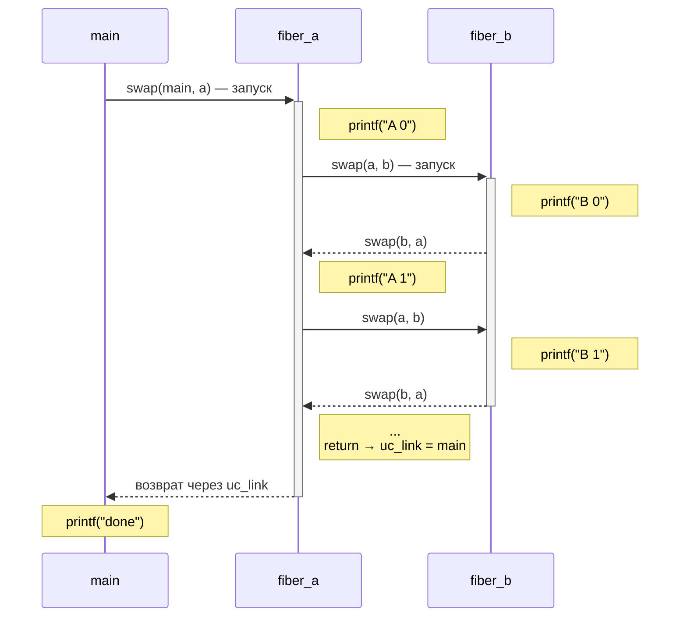

# Переключение контекста в user space: setjmp/longjmp, ucontext, собственный asm-switch

Kernel context switch (см. [context switch](../processes/context_switch.md)) переключает целую task'у: меняет page
tables через `CR3`, сохраняет FPU/SSE/AVX state, обновляет TSS, инвалидирует TLB-записи. Стоимость — единицы
микросекунд, и это без учёта вторичных эффектов вроде потери cache locality.

**User space context switching** делает то же самое — меняет «нить исполнения» — но без участия ядра. Сохраняется только
то, что строго необходимо: регистры, stack pointer, instruction pointer. Ни syscall'ов, ни смены адресного пространства,
ни инвалидации TLB.

Эта статья — про три способа переключить контекст в user space: `setjmp`/`longjmp` (non-local goto для error recovery),
POSIX `ucontext` (полноценный userspace-контекст) и собственный switch на ассемблере (Boost.Context, libco, libaco). То,
что строится **поверх** этого примитива, вынесено в отдельные статьи: stackful [фиберы](fibers.md) (scheduler,
trampoline, work-stealing, M:N) и stackless [C++20 coroutines](coroutines_cpp20.md).

```
Стоимость переключения (примерно):
┌───────────────────────────────┬──────────────────┐
│ kernel context switch         │   1 000–5 000 нс │
│ glibc ucontext swapcontext    │      ~1 000 нс   │  ← 2 syscall на signal mask
│ Boost.Context jump_fcontext   │         ~20 нс   │
│ setjmp + longjmp              │         ~10 нс   │
│ C++20 stackless coroutine     │          ~5 нс   │  ← обычный function call
└───────────────────────────────┴──────────────────┘
```

Разница — два-три порядка. Именно поэтому современный async-runtime (Go scheduler, Rust tokio, C++ asio) делает миллионы
переключений в секунду, не упираясь в ядро.

## setjmp / longjmp — non-local goto

```c
#include <setjmp.h>

int  setjmp(jmp_buf env);
void longjmp(jmp_buf env, int val);
```

`setjmp` снимает «снимок» текущего контекста и кладёт его в `env`. При первом, прямом вызове возвращает `0`.
`longjmp(env, val)` совершает прыжок назад — управление оказывается так, будто `setjmp` только что вернулся снова, но
уже со значением `val`. Если передать `val == 0`, стандарт принудительно меняет его на `1` — нулевое значение
зарезервировано за прямым вызовом.

Это **non-local goto**: прыжок через стековые фреймы, без раскручивания и cleanup'а.

```c
#include <setjmp.h>
#include <stdio.h>

static jmp_buf err_handler;

static void parse_token(const char *s) {
    if (!s)
        longjmp(err_handler, 1);          // прыжок наружу
    if (s[0] == '\0')
        longjmp(err_handler, 2);
    printf("token: %s\n", s);
}

static void parse_line(const char **tokens) {
    for (int i = 0; tokens[i]; i++)
        parse_token(tokens[i]);
}

int main(void) {
    const char *line[] = {"hello", "world", NULL, "trailing"};

    int code = setjmp(err_handler);       // первый вызов → 0
    if (code == 0) {
        parse_line(line);                 // никогда не вернётся
    } else {
        fprintf(stderr, "parse error: %d\n", code);
        return 1;
    }
    return 0;
}
```

Управление прыгает из `parse_token` сразу в `main`, минуя `parse_line`. Фреймы между `setjmp` и `longjmp` пропускаются —
без вызова деструкторов, без `__attribute__((cleanup))`, без чего бы то ни было.

```
До longjmp:                              После longjmp:

  high addr                                 high addr
┌──────────────────────┐                  ┌──────────────────────┐
│  main()              │ ◀── jmp_buf      │  main()              │ ◀── rsp восстановлен
│    err_handler       │     env.rsp      │                      │     управление сюда
│    setjmp(env) → 0   │                  │    setjmp(env) → 1   │
├──────────────────────┤                  ├──────────────────────┤
│  parse_line()        │                  │                      │
│    for-loop, i=2     │                  │   ╳ ╳ ╳ ╳ ╳ ╳ ╳ ╳    │  ← фреймы
├──────────────────────┤                  │                      │     просто "забыты"
│  parse_token(NULL)   │                  │                      │     (не cleaned up)
│    if (!s) longjmp() │ ───────┐         │                      │
└──────────────────────┘        │         └──────────────────────┘
  low addr                      │           low addr
                                │
                                └── копирует env.rsp в %rsp,
                                    прыгает на сохранённый %rip
```

Стековая память между прежним и новым `rsp` не очищается — она просто становится «over the top of the stack» и при
следующих вызовах перезапишется. Любые объекты с нетривиальной очисткой (`FILE*`, `mmap`-регионы, C++ объекты с
деструкторами) утекают.

## Что внутри jmp_buf

`jmp_buf` — архитектурно-зависимый opaque-тип. На glibc/x86-64 это структура размером 200 байт: 8 × 8-байтных регистров
плюс блок для signal mask.

```
glibc x86-64 jmp_buf (упрощённо)

offset
 ┌────────────────────────────────┐
 │  0  rbx       (callee-saved)   │
 │  8  rbp       (callee-saved)   │
 │ 16  r12       (callee-saved)   │
 │ 24  r13       (callee-saved)   │
 │ 32  r14       (callee-saved)   │
 │ 40  r15       (callee-saved)   │
 │ 48  rsp       (после ret)      │  ← PTR_MANGLE'd
 │ 56  rip       (saved return)   │  ← PTR_MANGLE'd
 ├────────────────────────────────┤
 │ ... saved signal mask          │  ← заполнено только sigsetjmp
 │ ... __saved_mask, padding      │
 └────────────────────────────────┘
```

!!! note "Напоминание: callee-saved vs caller-saved"
    SysV AMD64 ABI делит регистры по тому, кто бережёт их через `call`:

    - **callee-saved** (`rbx`, `rbp`, `r12`–`r15`, `rsp`) — `call` **обещает** их сохранность; если вызванная функция
      их использует, она сама восстанавливает исходные значения до `ret`. Вызывающий вправе считать их неизменными.
    - **caller-saved** (`rax`, `rcx`, `rdx`, `rsi`, `rdi`, `r8`–`r11`, `xmm*`) — `call` **вправе их затереть**; нужно
      значение после вызова — вызывающий сохраняет его сам.

    Поэтому любой userspace-switch сохраняет только callee-saved: caller-saved вызывающий и так считает затёртыми
    обычным вызовом. Полный разбор — [Callee-saved и caller-saved регистры](../assembler_and_processor/stack_frames_and_function_calls.md#callee-saved-и-caller-saved-регистры).

Сохраняются ровно **callee-saved** регистры из System V AMD64 ABI: `rbx`, `rbp`, `r12`–`r15`. Плюс `rsp` (вершина стека
на момент `ret` из `setjmp`) и сохранённый return address — он же будущий `rip` после прыжка.

Не сохраняются:

- **Caller-saved** (`rax`, `rcx`, `rdx`, `rsi`, `rdi`, `r8`–`r11`) — по ABI они считаются убитыми после любого вызова, в
  том числе после `setjmp`. Компилятор сам не полагается на их сохранность.
- **FPU/SSE/AVX state** (`xmm0`–`xmm15`, `MXCSR`, x87 control word) — у glibc вообще не сохраняется. Если между `setjmp`
  и `longjmp` живёт значение в `xmm`-регистре, поведение после прыжка неопределено. Это редко стреляет в обычном коде,
  но даёт о себе знать в численном коде и SIMD-инструкциях.
- **TLS-указатель** (`fs:0` на x86-64) — `longjmp` рассчитан на прыжок внутри одного потока, TLS-база не меняется.

glibc дополнительно делает **PTR_MANGLE** — XOR'ит `rsp` и `rip` с per-process secret, лежащим в TCB (Thread Control
Block, `fs:0x30`). При `longjmp` происходит `PTR_DEMANGLE` обратно. Цель — защита от ROP/JOP: даже если атакующий
перепишет `jmp_buf` (например, через stack overflow), он не знает секрета и не может направить `longjmp` на произвольный
gadget.

## Реализация в glibc

Упрощённый ассемблер `setjmp`/`longjmp` для x86-64 (без mangling для ясности):

```asm
; int setjmp(jmp_buf env);
;   env передан в %rdi (System V ABI)
setjmp:
    mov   %rbx, 0(%rdi)
    mov   %rbp, 8(%rdi)
    mov   %r12, 16(%rdi)
    mov   %r13, 24(%rdi)
    mov   %r14, 32(%rdi)
    mov   %r15, 40(%rdi)
    lea   8(%rsp), %rax       ; rsp каким он будет после ret
    mov   %rax, 48(%rdi)
    mov   (%rsp), %rax        ; return address на вершине стека
    mov   %rax, 56(%rdi)
    xor   %eax, %eax          ; вернуть 0
    ret

; void longjmp(jmp_buf env, int val);
;   env в %rdi, val в %esi
longjmp:
    mov   %esi, %eax          ; будущее возвращаемое значение
    test  %eax, %eax
    jnz   1f
    mov   $1, %eax            ; val == 0 → 1
1:  mov   0(%rdi), %rbx
    mov   8(%rdi), %rbp
    mov   16(%rdi), %r12
    mov   24(%rdi), %r13
    mov   32(%rdi), %r14
    mov   40(%rdi), %r15
    mov   48(%rdi), %rsp      ; восстановить стек
    mov   56(%rdi), %rdx
    jmp   *%rdx               ; прыжок на сохранённый rip
```

Ключевой момент — `mov 56(%rdi), %rdx; jmp *%rdx`. Это не `ret`: `ret` сначала прочитал бы значение со стека, а у нас
стек только что переключился, и на его вершине лежит то, что лежало в `parse_token`'е, а не сохранённый адрес. Поэтому
glibc хранит return address отдельно и прыгает на него явно.

С PTR_MANGLE строки `48(%rdi)` и `56(%rdi)` обрамляются дополнительным `xor %fs:0x30, %rax`, что добавляет ~2 такта на
прыжок и делает `jmp_buf` бесполезным для атакующего без знания TCB.

## Что не работает: UB-зоопарк

Стандарт C перечисляет ситуации, при которых `longjmp` ведёт к undefined behavior. Все они — следствие того, что
`jmp_buf` хранит абсолютные адреса в стек, а не самодостаточное состояние.

1. **Прыжок в функцию, которая уже вернулась.** Сохранённый `rsp` указывает на участок стека, который перезаписан
   другими вызовами. `longjmp` восстановит `rsp`, прыгнет на «return address» — и попадёт неизвестно куда.

   ```c
   jmp_buf env;
   void inner(void) { setjmp(env); }
   int main(void) {
       inner();             // setjmp сохранил env, но фрейм inner ушёл
       longjmp(env, 1);     // UB: прыгаем в труп
   }
   ```

2. **Локальные переменные между `setjmp` и `longjmp` без `volatile`.** Компилятор имеет право держать локальные
   переменные в callee-saved регистрах. Эти регистры восстановятся `longjmp`'ом до значения на момент `setjmp` —
   модификация теряется.

   ```c
   int main(void) {
       int counter = 0;                  // может попасть в %rbx
       jmp_buf env;
       if (setjmp(env) == 0) {
           counter++;
           longjmp(env, 1);
       }
       printf("%d\n", counter);          // UB: может быть 0, может быть 1
   }
   ```

   Лечится либо `volatile int counter`, либо хранением в глобале/static. `volatile` запрещает компилятору держать
   переменную в регистре между sequence point'ами.

3. **`longjmp` между потоками.** Сохранённый `rsp` ссылается на стек потока A. Если выполнить `longjmp` из потока B,
   `rsp` укажет в чужую стековую память. TLS-база (`fs:0`) останется потока B — все обращения к `errno`,
   `pthread_self()` и прочим thread-local переменным окажутся «в чужом доме».

4. **Прыжок «вглубь».** `setjmp` нужно вызывать в функции, в которую вы потом прыгаете, а не наоборот. Прыжок в функцию,
   которая в момент `longjmp` ещё не запущена, бессмыслен — её фрейма на стеке нет.

5. **`longjmp` из signal handler в обычный код.** Сигнал доставляется через trampoline, который выставляет `sigprocmask`
   с заблокированным своим сигналом. После «нормального» возврата из handler ядро восстанавливает старую маску через
   `sigreturn`. `longjmp` обходит этот `sigreturn` — сигнал останется заблокированным, и следующий той же категории
   просто не доставится. Для этого случая есть `sigsetjmp`/`siglongjmp`.

6. **`longjmp` ломает RAII.** В C++ деструкторы пропущенных фреймов не вызываются. `std::unique_ptr`, `std::lock_guard`,
   `std::ofstream` — всё утекает. Это одна из причин, почему C++ предпочитает exceptions: они делают полноценный stack
   unwinding с вызовом деструкторов.

## sigsetjmp / siglongjmp

```c
int  sigsetjmp(sigjmp_buf env, int savesigs);
void siglongjmp(sigjmp_buf env, int val);
```

При `savesigs == 1` `sigsetjmp` дополнительно сохраняет текущую `sigprocmask`, а `siglongjmp` её восстанавливает. Если
`savesigs == 0`, поведение совпадает с `setjmp`/`longjmp`.

Канонический сценарий — прыжок из signal handler:

```c
#include <setjmp.h>
#include <signal.h>
#include <stdio.h>
#include <unistd.h>

static sigjmp_buf env;

static void on_alarm(int sig) {
    siglongjmp(env, 1);                // signal-safe прыжок наружу
}

int main(void) {
    signal(SIGALRM, on_alarm);

    if (sigsetjmp(env, 1) == 0) {
        alarm(1);
        for (;;) pause();              // ждём сигнала
    } else {
        puts("interrupted by SIGALRM");
        alarm(2);                      // следующий сигнал придёт
        for (;;) pause();              // ← без siglongjmp это бы зависло
    }
}
```

Если бы вместо `siglongjmp` использовался `longjmp`, после первого прыжка `SIGALRM` остался бы заблокированным
навсегда — `signal(2)` man-page прямо говорит, что в handler'е сигнал автоматически добавлен в маску.

## Use cases setjmp/longjmp

- **Error recovery до эпохи C++ exceptions.** PostgreSQL использует `sigsetjmp` в главном цикле каждого backend'а —
  любая ошибка в выполнении запроса (`elog(ERROR, ...)`) делает `siglongjmp` обратно. OpenSSL делал то же в старых
  версиях своих BIO-парсеров. Lua interpreter использует `setjmp` для пропагации ошибок виртуальной машины.
- **Coroutines на минималках.** Два `jmp_buf` и подмена `rsp` дают примитивный switching между двумя нитями. Этот трюк
  описан в Knuth TAoCP Vol. 1.
- **LLVM SJLJ exceptions.** На платформах без полноценной Itanium C++ ABI (некоторые ARM, эмбеддед) C++ exceptions
  компилируются через `setjmp` в каждом `try`-блоке. Дорого, но работает.
- **`__builtin_setjmp` / `__builtin_longjmp`** в GCC — упрощённая версия (5 слов: `fp`, `pc`, `sp`, signal mask,
  padding), без PTR_MANGLE, без TCB. Не для пользовательского кода — для compiler runtime (например, libgcj, GNU Java).

## Compiler quirks: returns_twice

`setjmp` нарушает фундаментальное допущение оптимизатора: «функция, в которую мы вошли, либо вернётся ровно один раз,
либо не вернётся вообще». Компилятор обозначает такие функции атрибутом `__attribute__((returns_twice))`. У `setjmp` он
стоит в заголовках, у `vfork` тоже.

Без этого атрибута оптимизатор может, например, переставить порядок записей в локальные переменные или сложить две
операции в одну — а потом второй «возврат» из `setjmp` обнаружит несогласованное состояние.

Аналогично, `longjmp` помечен `noreturn`: компилятор знает, что после `longjmp` управление не вернётся, и может выкинуть
«мёртвый» код за вызовом.

## ucontext — полноценный userspace context

POSIX определил семейство `<ucontext.h>` для тех случаев, когда `setjmp`/`longjmp` не хватает: нужно не просто прыгнуть
назад, а уметь переключаться между несколькими независимыми контекстами туда-обратно. Стандарт пометил эти функции как
obsolescent в POSIX.1-2008 — но реализация в glibc и BSD никуда не делась и активно используется.

```c
typedef struct ucontext_t {
    struct ucontext_t *uc_link;       // куда вернуться после завершения func
    sigset_t          uc_sigmask;     // signal mask
    stack_t           uc_stack;       // стек этого контекста
    mcontext_t        uc_mcontext;    // машинное состояние (регистры + FPU)
    ...
} ucontext_t;

typedef struct {
    void  *ss_sp;                     // база стека
    int    ss_flags;
    size_t ss_size;
} stack_t;
```

`mcontext_t` — большая, архитектурно-зависимая структура. На x86-64 glibc хранит туда `gregset_t` (все 23 GP регистра,
включая `rax`, `rip`, `rflags`, `cs`, `gs`, `fs`) и указатель на `fpregset_t` (387/SSE/AVX state). Это полный снимок, в
отличие от minimal `jmp_buf`.

Четыре функции работают с `ucontext_t`:

| Функция                             | Что делает                                                            |
|-------------------------------------|-----------------------------------------------------------------------|
| `getcontext(ucp)`                   | снимок текущего контекста                                             |
| `setcontext(ucp)`                   | переключиться на `ucp` (не возвращается)                              |
| `makecontext(ucp, func, argc, ...)` | настроить `ucp` так, чтобы `setcontext` запустил `func` на `uc_stack` |
| `swapcontext(oucp, ucp)`            | атомарно сохранить current → `oucp` и переключиться на `ucp`          |

```
makecontext(ucp, func, 0) — что происходит с ucp.uc_stack:

high addr (ss_sp + ss_size)
┌────────────────────────────────────────┐
│  return address ──▶ trampoline         │  ← вершина стека
│                     (вызывает uc_link  │
│                      или setcontext)   │
├────────────────────────────────────────┤
│  saved args                            │
├────────────────────────────────────────┤
│                                        │
│  ... (свободно для func)               │
│                                        │
└────────────────────────────────────────┘
low addr (ss_sp)

После setcontext(ucp):
   rsp = вершина uc_stack
   rip = func
   func() вызывается → когда возвращается,
   управление переходит в trampoline →
   trampoline делает setcontext(uc_link) или exit
```

## Простейший fiber на ucontext

Тридцать строк работающего кода — кооперативный планировщик из двух fiber'ов, по очереди уступающих друг другу.

```c
#define _XOPEN_SOURCE 600
#include <stdio.h>
#include <stdlib.h>
#include <ucontext.h>

#define STACK_SIZE 65536

static ucontext_t ctx_main, ctx_a, ctx_b;

static void fiber_a(void) {
    for (int i = 0; i < 3; i++) {
        printf("A: step %d\n", i);
        swapcontext(&ctx_a, &ctx_b);     // yield → B
    }
    puts("A: done");                     // вернувшись, попадём в uc_link
}

static void fiber_b(void) {
    for (int i = 0; i < 3; i++) {
        printf("B: step %d\n", i);
        swapcontext(&ctx_b, &ctx_a);     // yield → A
    }
    puts("B: done");
}

int main(void) {
    char *stack_a = malloc(STACK_SIZE);
    char *stack_b = malloc(STACK_SIZE);

    getcontext(&ctx_a);
    ctx_a.uc_stack.ss_sp   = stack_a;
    ctx_a.uc_stack.ss_size = STACK_SIZE;
    ctx_a.uc_link          = &ctx_main;  // после fiber_a → ctx_main
    makecontext(&ctx_a, fiber_a, 0);

    getcontext(&ctx_b);
    ctx_b.uc_stack.ss_sp   = stack_b;
    ctx_b.uc_stack.ss_size = STACK_SIZE;
    ctx_b.uc_link          = &ctx_main;
    makecontext(&ctx_b, fiber_b, 0);

    swapcontext(&ctx_main, &ctx_a);      // запуск
    puts("main: all done");

    free(stack_a);
    free(stack_b);
    return 0;
}
```

Компилируется: `gcc fiber.c -o fiber`. Вывод:

```
A: step 0
B: step 0
A: step 1
B: step 1
A: step 2
B: step 2
A: done
main: all done
```

`fiber_b` не успевает дойти до «B: done» — потому что после третьего `swapcontext` управление ушло в `fiber_a`, который
сделал ещё один шаг и завершился. Тогда сработал `uc_link = &ctx_main`, и main продолжился. `ctx_b` остался «висеть» в
середине — ровно то место, куда никогда не вернутся.



Это **cooperative scheduling**: ни одна fiber не отнимет процессор силой. Каждая сама вызывает `swapcontext` в
подходящий момент (типично — на блокирующем I/O или таймере). Отсутствие preemption — одновременно главное достоинство (
нет race condition при доступе к разделяемым данным внутри fiber'ы) и главное ограничение (одна зависшая fiber вешает
всё).

!!! example "Рабочий пример"
    Кооперативные фиберы на POSIX `ucontext` (с fault injection): `examples/q15_fibers/fiber_ucontext.cpp` — собрать и запустить: `cd examples && make q15_ucontext && ./bin/q15_ucontext`.

## Почему glibc ucontext медленный

`getcontext`/`setcontext` в glibc делают `rt_sigprocmask(2)` каждый раз для сохранения и восстановления signal mask. На
`swapcontext` это два syscall — переход в kernel space, IRET обратно, ~1 мкс минимум. Для серверного workload'а с
миллионами переключений в секунду это категорически неприемлемо.

Альтернативы решили проблему радикально: вообще не сохранять signal mask.

| Библиотека     | Подход                                  | Стоимость swap | Что не сохраняется                  |
|----------------|-----------------------------------------|----------------|-------------------------------------|
| glibc ucontext | сохраняет всё, включая mask             | ~1 000 нс      | —                                   |
| Boost.Context  | `jump_fcontext` — голый ассемблер       | ~20 нс         | signal mask, FPU control word       |
| libco (byuu)   | ~ 30 строк asm на платформу             | ~15 нс         | signal mask, частично FPU           |
| libaco         | агрессивная оптимизация, save-on-demand | ~10 нс         | signal mask, FPU только опционально |

Boost.Context, libco, libaco не делают syscall'ов вообще. Их обмен — `mov`+`mov`+`jmp`, на уровне `setjmp`/`longjmp` по
стоимости, но с возможностью переключения между несколькими контекстами в обе стороны.

Различие в философии: ucontext «корректен» (signal-safe), boost::context «быстр» (signal-unsafe — если на fiber придёт
сигнал, маска не та, что положена).

## Собственный context switch на asm

`setjmp`/`longjmp` умеет прыгать только «назад» (в уже исполнявшийся фрейм), `ucontext` корректен, но платит двумя
syscall'ами за signal mask. Чтобы переключаться между несколькими контекстами в обе стороны и без участия ядра, switch
пишут руками на ассемблере. Это путь Boost.Context (`jump_fcontext`), libco, libaco — и наш `examples/q15_fibers`.

Идея ровно та же, что у `setjmp`, но симметричная: сохранить callee-saved уходящего контекста на **его же** стек,
подменить `rsp` на стек приходящего, восстановить **его** callee-saved и сделать `ret`. По SysV AMD64 ABI сохранять надо
только `rbx`, `rbp`, `r12`–`r15` и сам `rsp`. Caller-saved (`rax`, `rcx`, `rdx`, `rsi`, `rdi`, `r8`–`r11`, xmm) трогать
не нужно — их и так считает убитыми любой вызов функции, а switch для вызывающего и есть обычный вызов.

```asm
/* void fiber_switch(void** save_sp, void* restore_sp)
 *   rdi = save_sp     — куда записать rsp уходящего контекста
 *   rsi = restore_sp  — откуда взять rsp приходящего контекста */
fiber_switch:
    pushq %rbp                 /* сохраняем callee-saved уходящего контекста */
    pushq %rbx                 /* на его же стек */
    pushq %r12
    pushq %r13
    pushq %r14
    pushq %r15
    movq %rsp, (%rdi)          /* *save_sp = rsp — запомнили вершину уходящего */
    movq %rsi, %rsp            /* rsp = restore_sp — переключили стек */
    popq %r15                  /* снимаем callee-saved приходящего контекста */
    popq %r14
    popq %r13
    popq %r12
    popq %rbx
    popq %rbp
    ret                        /* прыжок по сохранённому адресу возврата приходящего */
```

Почему это работает:

1. Шесть `pushq` кладут callee-saved на стек уходящего контекста. Адрес возврата (куда вернётся `ret`) положил `call
   fiber_switch` ещё раньше — он лежит **над** этими шестью словами.
2. `movq %rsp, (%rdi)` сохраняет вершину уходящего стека в `*save_sp`. Этого одного указателя достаточно, чтобы потом
   полностью восстановить контекст: всё его состояние лежит на его стеке.
3. `movq %rsi, %rsp` — единственная «магия». Сменив `rsp`, мы оказались на чужом стеке, и дальше все `popq` снимают
   **чужие** callee-saved.
4. `ret` снимает со стека адрес возврата приходящего контекста — тот, который он сохранил, когда сам в прошлый раз
   уходил через `fiber_switch`. Управление прыгает туда, откуда чужой контекст ушёл.

`rip` нигде явно не сохраняется: его кладёт `call` и снимает `ret`, он живёт на стеке прямо под слотами callee-saved.
Ни syscall'а, ни барьера памяти — шесть записей, шесть чтений, один `ret`, ~15–25 тактов в горячем кэше (единицы
наносекунд).

### Подготовка стека новой фибры: setup_context

`fiber_switch` умеет только восстановить контекст, который кто-то **когда-то сохранил**. У свежей фибры такого контекста
нет — её стек пуст, восстанавливать нечего. Парная функция `setup_context` раскладывает на дне стека **фейковый кадр** в
точно том формате, который ждёт восстанавливающая половина `fiber_switch`. Тогда первый `fiber_switch` в эту фибру
«восстановит» этот кадр и сделает `ret` в стартовую функцию `entry`.

```asm
/* void* setup_context(void* stack_top, void (*entry)())
 *   rdi = stack_top  — верх стека новой фибры (high addr)
 *   rsi = entry      — точка входа; сюда уйдёт ret первого fiber_switch
 *   rax = sp         — значение, которое передают в fiber_switch как restore_sp */
setup_context:
    andq $-16, %rdi          /* выровнять вершину стека по 16 байт */
    leaq -64(%rdi), %rax     /* зарезервировать 8 слотов: 6 callee-saved + entry + align */
    movq %rsi, 48(%rax)      /* адрес возврата = entry (туда уйдёт первый ret) */
    ret
```

Раскладка кадра, считая от возвращённого `sp` (= `rax` = `top-64`):

```
sp+0   r15        слоты callee-saved: fiber_switch снимет их шестью popq в
sp+8   r14        регистры. Значения не важны — новая фибра ими не пользуется
sp+16  r13        до своего первого настоящего switch (стек std::vector<char>
sp+24  r12        и так обнулён, так что там нули).
sp+32  rbx
sp+40  rbp
sp+48  entry      адрес возврата: ret внутри fiber_switch прыгнет сюда
sp+56  (align)    после ret rsp окажется здесь — top-8
```

Почему именно так:

1. Раскладка **зеркальна** restore-последовательности `fiber_switch`: тот делает шесть `popq` (r15…rbp), затем `ret`.
   Значит снизу вверх должны лежать шесть callee-saved, а над ними — адрес возврата. `setup_context` кладёт `entry`
   ровно в слот возврата (`sp+48`); callee-saved-слоты не трогает (любое значение годится).
2. **Зачем лишний слот выравнивания (`sp+56`).** SysV ABI требует `rsp % 16 == 8` на входе в функцию (как сразу после
   `call`). После того как `fiber_switch` снимет шесть слотов и `ret` снимет адрес возврата, `rsp` встанет на `sp+56` =
   `top-8`. `top` выровнен по 16 → `top-8` даёт `rsp % 16 == 8` — ровно то, что нужно `entry`, чтобы внутри неё
   корректно работали `call`, `-fstack-protector` и unwinding. Без этого слота выравнивание было бы битым.
3. Возвращённый `sp` (`top-64`) — начальное значение `restore_sp` для **первого** `fiber_switch(&caller_sp, sp)`.

Что добавляет «боевой» `jump_fcontext` поверх этого скелета:

| Деталь                          | Зачем                                                                       |
|---------------------------------|------------------------------------------------------------------------------|
| `transfer_t {fctx, data}`       | двусторонний обмен: при возврате узнаёшь, кто тебя разбудил, и получаешь data |
| `stmxcsr`/`fnstcw` (MXCSR, x87) | сохранить режим округления/исключений SSE и x87 control word                  |
| `jmp *reg` вместо `ret`         | приёмник передаёт data в регистрах — нужен явный прыжок, а не `ret`           |

Адрес `entry`, который кладёт `setup_context`, на практике указывает не прямо на тело фибры, а на **trampoline** —
переходник, который вызовет тело и перехватит его возврат (вернуться из стартовой функции некуда — под ней пустой стек).
Разбор trampoline и того, как поверх switch строится scheduler, work-stealing и M:N-runtime — в статье
[Stackful fibers](fibers.md). Stackless-вариант, где компилятор вообще убирает отдельный стек, — в
[C++20 coroutines](coroutines_cpp20.md).

!!! example "Рабочий пример"
    Собственный asm-switch и фиберы поверх него: `examples/q15_fibers/context_switch.S` + `fiber_asm.cpp` (свой switch)
    и `fiber_ucontext.cpp` (через POSIX `ucontext`). Собрать: `cd examples && make q15` (цели `q15_asm`, `q15_ucontext`).

## Сравнение стоимости context switching

```
┌─────────────────────────────────┬─────────────┬──────────────────────────────────┐
│ Механизм                        │ Стоимость   │ Что сохраняется                  │
├─────────────────────────────────┼─────────────┼──────────────────────────────────┤
│ kernel context switch           │ 1–5 мкс     │ всё: regs, FPU, CR3, TSS, TLB    │
│ glibc ucontext swapcontext      │ ~1 мкс      │ всё regs + FPU + signal mask     │
│ Boost.Context jump_fcontext     │ ~20 нс      │ callee-saved + FPU control word  │
│ setjmp / longjmp                │ ~10 нс      │ callee-saved + rsp + rip         │
│ C++20 stackless coroutine resume│ ~5 нс       │ ничего (обычный call)            │
└─────────────────────────────────┴─────────────┴──────────────────────────────────┘
```

Главная переменная — что мы готовы **не** сохранить. Чем меньше state, тем дешевле. Kernel сохраняет всё, потому что не
знает, что будет нужно task'е после возобновления. Boost.Context экономит на signal mask и большей части FPU — потому
что fiber library знает свой контракт: внутри fiber'а не должно быть FPU-чувствительного long-lived state, signal
handler'ы — забота вызывающего.

Stackless coroutine — predельный случай: state хранится в куче в structured frame'е, переключение это вызов функции.
Дешевле быть не может.

## Подводные камни

- **Stack overflow в fiber.** `malloc`/`mmap` стека не даёт ни canary, ни guard page'и. Если код в fiber'е переполнит
  стек, он молча запишет в соседнюю аллокацию или в чужую структуру. Лечится явным
  `mprotect(stack, PAGE_SIZE, PROT_NONE)` на нижнюю страницу — overflow вызовет `SIGSEGV` вместо тихой коррупции.

  ```c
  char *stack = mmap(NULL, STACK_SIZE, PROT_READ|PROT_WRITE,
                     MAP_PRIVATE|MAP_ANON, -1, 0);
  mprotect(stack, 4096, PROT_NONE);          // guard page снизу
  ctx.uc_stack.ss_sp   = stack + 4096;
  ctx.uc_stack.ss_size = STACK_SIZE - 4096;
  ```

- **`longjmp` ломает RAII.** В C++ ни один деструктор пропущенных фреймов не вызывается. `unique_ptr` утекает,
  `lock_guard` оставляет mutex захваченным навсегда, `ofstream` не сбрасывает буфер. Это отдельная и фундаментальная
  причина, почему C++ движется в сторону exceptions (которые корректно делают unwinding) и почему `setjmp` в C++ коде —
  это запах.

- **Stack protector и alignment.** `-fstack-protector` ожидает, что стек выровнен по 16 байт на момент вызова. Если
  `uc_stack.ss_sp` указывает на невыровненный буфер (например, `malloc` дал 8-байтное выравнивание после header'а),
  функция стартует с битым canary, и при возврате срабатывает abort. Лечится `posix_memalign(&stack, 16, STACK_SIZE)`.

- **Прыжок между потоками.** `longjmp` или `swapcontext` через границу потока — катастрофа. `fs`/`gs` сегментные
  регистры не меняются — TLS останется потока, в котором мы сейчас, а сам fiber/`jmp_buf` принадлежит другому. `errno`,
  `pthread_self`, любой `__thread`-переменной нельзя верить. На практике это всегда баг.

- **Boost.Context и backtrace.** Stack unwinder (libunwind, libgcc_s) ожидает, что стек растёт линейно от entry point'а.
  Когда вы переключились на fiber, его стек — отдельный mmap-регион без CFI-информации, связывающей с прежним стеком.
  `backtrace(3)` оборвётся на границе. Boost.Context умеет давать unwinder'у hint через `__splitstack_*` API, но
  включается это руками.

## Связанные темы

- [Context switch (kernel)](../processes/context_switch.md) — kernel-level аналог; почему userspace switching на 2–3
  порядка быстрее
- [Стековые фреймы и вызовы функций](../assembler_and_processor/stack_frames_and_function_calls.md) — System V AMD64
  ABI: что обязан сохранять callee, а что — caller
- [Сигналы](../processes/signals.md) — почему `sigsetjmp`/`siglongjmp`, а не обычные `setjmp`/`longjmp` в signal
  handler'ах
- [Потоки (основы)](threads_basics.md) — pthread = kernel threads (1:1) vs userspace fibers (M:N)
- [Stackful fibers](fibers.md) — scheduler, trampoline, work-stealing, M:N-runtime поверх asm-switch
- [C++20 coroutines](coroutines_cpp20.md) — stackless-вариант: state machine вместо отдельного стека

## Источники

- `man 3 setjmp`, `man 3 longjmp`, `man 3 sigsetjmp`, `man 3 makecontext`, `man 7 ucontext`
- glibc sources: `setjmp/sigjmp.c`, `sysdeps/x86_64/setjmp.S`, `sysdeps/unix/sysv/linux/x86_64/setcontext.S`,
  `stdlib/setcontext.c`
- [Boost.Context documentation](https://www.boost.org/doc/libs/release/libs/context/)
- "C++ Coroutines: Understanding the promise type" — Lewis
  Baker, [lewissbaker.github.io](https://lewissbaker.github.io/2018/09/05/understanding-the-promise-type)
- Donald E. Knuth — *The Art of Computer Programming, Vol. 1*, §1.4.2 «Coroutines» (исторический разбор)
- [libaco — pure-asm coroutine](https://github.com/hnes/libaco) — детальный README с micro-benchmarks
- PostgreSQL source: `src/backend/utils/error/elog.c` — `PG_TRY`/`PG_CATCH` поверх `sigsetjmp`
