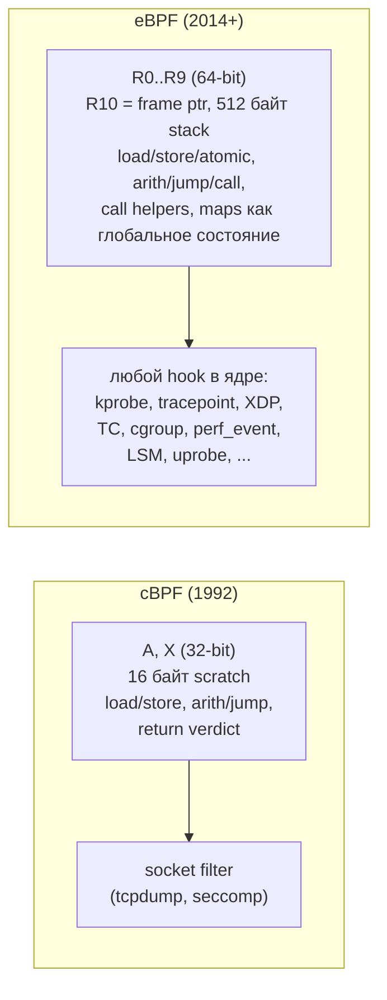
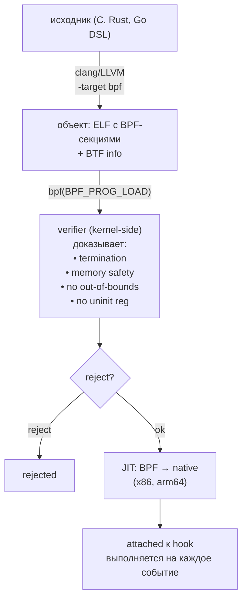
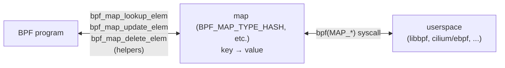
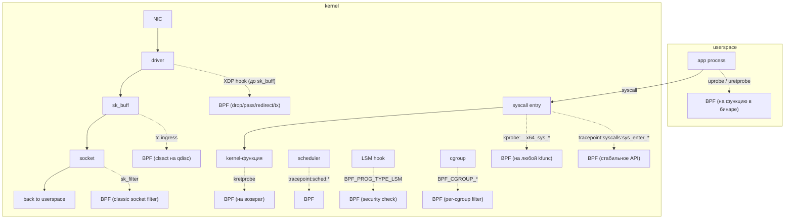
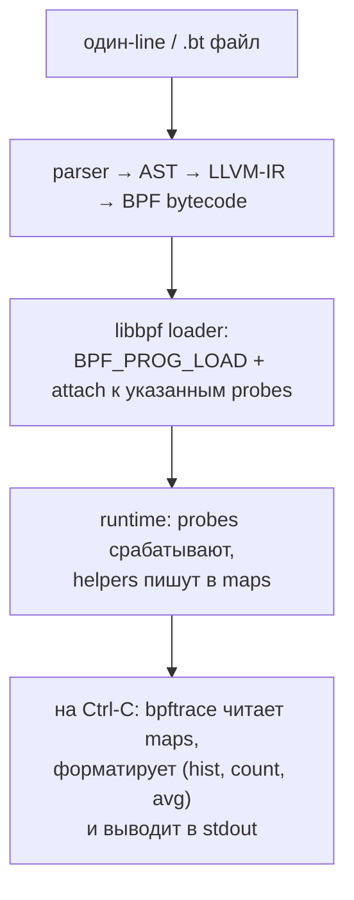
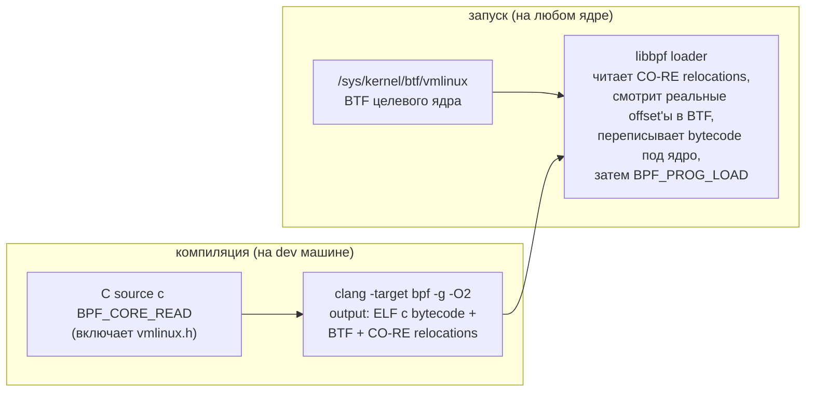

# eBPF: программируемое ядро

eBPF (extended Berkeley Packet Filter) — это виртуальная машина внутри Linux-ядра, исполняющая безопасный
байт-код. Пользователь компилирует C-программу в специальный BPF-байт-код, kernel-side **verifier** доказывает,
что она не упадёт и не зациклится, а **JIT** превращает её в native-инструкции хоста. Результат привязывается к
**hook'у**: точке внутри ядра, где программа автоматически вызывается на каждое событие — приход сетевого пакета,
вход в syscall, переключение контекста, отправка сообщения по сокету.

До eBPF единственный способ расширить ядро — kernel module. Это значило: C-код, доступ ко всем kernel API, любой
баг → kernel panic, любая ошибка с памятью → root-эксплойт. eBPF — компромисс: ограниченный набор операций,
ограниченный набор kernel API через **helpers**, статическая проверка перед загрузкой. В обмен — возможность
писать в ядре код с гарантией безопасности и обновлять его без перезагрузки. Это превратило Linux в
программируемую платформу: networking (Cilium, Katran), observability (Pixie, Parca), security (Tetragon,
Falco), tracing (bpftrace, bcc) — всё это eBPF поверх обычного ядра.

## От cBPF к eBPF

| Год  | Этап       | Что добавилось                                                               |
|------|------------|------------------------------------------------------------------------------|
| 1992 | cBPF       | classic BPF: для `tcpdump`, 2 регистра 32-bit, фильтр пакетов в socket layer |
| 2014 | eBPF       | 10 регистров 64-bit, 512-byte stack, maps, helpers, JIT                      |
| 2015 | kprobe BPF | привязка eBPF к точкам в kernel-коде                                         |
| 2016 | XDP        | eBPF на driver-level, до построения `sk_buff`                                |
| 2017 | cgroup BPF | hook'и на skb/sock/device per-cgroup                                         |
| 2018 | BTF        | BPF Type Format → CO-RE (compile once, run everywhere)                       |
| 2020 | LSM BPF    | замена SELinux/AppArmor через eBPF                                           |
| 2022 | kfuncs     | вызов произвольных kernel-функций (с ограничениями) вместо только helpers    |

cBPF до сих пор живёт в `tcpdump` и в seccomp-bpf — это тот же байт-код, который Steven McCanne и Van Jacobson
описали в 1992 году. eBPF — переписанная VM, совместимая по идее (`load`/`store`/`alu`/`branch`), но
несовместимая по коду: 10 регистров вместо 2, 64-битная арифметика, доступ к kernel-объектам через helpers,
maps как persistent state между вызовами.



## Архитектура: как программа попадает в ядро



Loader (libbpf, cilium/ebpf, aya) парсит ELF, видит секции вида `SEC("kprobe/__x64_sys_open")` и `SEC("maps")`,
делает syscall `bpf(BPF_PROG_LOAD, ...)` для каждой программы и `bpf(BPF_MAP_CREATE, ...)` для каждой map'ы.
Ядро создаёт BPF-объекты (программы и maps), возвращает file descriptors. Затем loader привязывает программу к
hook'у — для kprobe это `perf_event_open(PERF_TYPE_TRACEPOINT)` + `PERF_EVENT_IOC_SET_BPF`, для XDP это
`bpf(BPF_LINK_CREATE, target=ifindex)`, для каждого типа свой механизм.

## Verifier

Verifier — центральный элемент eBPF. Это статический анализатор, который читает байт-код и доказывает:

- **termination**: программа завершится за конечное число шагов
- **memory safety**: все load/store попадают в валидные регионы (стек, map values, packet data)
- **type safety**: регистр, в котором лежит указатель, не используется как скаляр
- **resource bounds**: нет деления на ноль, нет переполнений, ссылочные счётчики сбалансированы

Алгоритм — symbolic execution с **state tracking** для каждого регистра. Для каждой инструкции verifier
поддерживает abstract state (range, type, pointer base) и пробует все возможные ветки. Если хоть одна ведёт к
out-of-bounds или uninit-read — отказ.

```
verifier пример:
  r1 = pointer to map_value (size=64)
  r2 = packet_offset (from user, range: 0..1500)

  *(r1 + r2) = 0          ← REJECT: r2 может быть >= 64

  if (r2 >= 60) goto END  ← теперь verifier знает: r2 в 0..59
  *(r1 + r2) = 0          ← ACCEPT: 59 < 64
END:
```

Лимиты verifier'а:

| Лимит               | Значение              | Зачем                                        |
|---------------------|-----------------------|----------------------------------------------|
| Размер программы    | 1 000 000 инструкций  | до Linux 5.2 было 4096; ограничивает память  |
| Глубина стека       | 512 байт              | + 256 байт на каждый вложенный call          |
| Глубина вложенности | 8 функций             | защита от рекурсии (запрещена в eBPF)        |
| Циклы               | bounded loops only    | компилятор разворачивает или bpf_loop helper |
| Время верификации   | ограничено heuristics | сложные программы отклоняются по таймауту    |

Циклы — главная боль. До Linux 5.3 циклы вообще не поддерживались; компилятору приходилось разворачивать через
`#pragma unroll`. С 5.3 появились **bounded loops** — verifier подтверждает завершение, если счётчик растёт и
сравнивается с константой. С 5.17 — helper `bpf_loop()`, который принимает callback и счётчик: внешне для
verifier'а это «один вызов на N итераций», без проверки тела цикла каждый раз.

## Helpers

eBPF не может напрямую вызывать kernel-функции (это сломало бы verifier и стабильность ABI). Вместо этого
доступен фиксированный набор **helpers** — функций, экспортированных ядром именно для BPF:

```c
bpf_map_lookup_elem(map, key)       // прочитать из map
bpf_map_update_elem(map, key, val, flags)
bpf_map_delete_elem(map, key)
bpf_get_current_pid_tgid()          // PID и TGID текущего процесса
bpf_get_current_uid_gid()           // UID и GID
bpf_get_current_comm(buf, size)     // имя процесса (comm)
bpf_ktime_get_ns()                  // монотонное время в нс
bpf_probe_read_kernel(dst, sz, src) // безопасное чтение kernel-памяти
bpf_probe_read_user(dst, sz, src)   // безопасное чтение user-памяти
bpf_perf_event_output(ctx, map, ...) // отправить событие в userspace
bpf_ringbuf_output(map, data, sz, flags)
bpf_redirect(ifindex, flags)        // редирект пакета (XDP/TC)
bpf_trace_printk(fmt, ...)          // в /sys/kernel/tracing/trace_pipe
bpf_get_stackid(ctx, map, flags)    // capture stack trace
bpf_skb_load_bytes(skb, off, dst, sz)
bpf_send_signal(sig)                // отправить сигнал текущему процессу
bpf_override_return(ctx, rc)        // CAP_BPF; подменить возврат kprobe
```

К 2025 году в ядре ~250 helpers, не все доступны для всех program types — verifier проверяет совместимость.
Например, `bpf_get_current_task()` доступен в kprobe/tracepoint, но не в XDP (там нет понятия «текущая задача»).

Альтернатива helpers — **kfuncs** (с Linux 5.18). Это произвольные kernel-функции, явно помеченные как
безопасные для вызова из BPF. Их добавление в ядре требует только аннотации `BTF_KFUNCS_START/END`, а не патчей
verifier'а — поэтому экспортированный API расширяется намного быстрее, чем через helpers.

## Maps: состояние между вызовами

BPF-программа сама по себе **stateless** — она запускается на событии, что-то считает, возвращает verdict.
Состояние между вызовами хранится в **maps** — key/value-хранилищах ядра, доступных из BPF через helpers и из
userspace через syscall.



| Тип map              | Назначение                                               |
|----------------------|----------------------------------------------------------|
| `HASH`               | hash table; общий random-access                          |
| `ARRAY`              | плоский массив; индекс = ключ; быстрее HASH              |
| `LRU_HASH`           | hash с автоматическим вытеснением старых ключей          |
| `PERCPU_HASH`        | hash, но отдельная копия на каждое ядро (без локов)      |
| `PERCPU_ARRAY`       | array per-CPU; для счётчиков без atomic                  |
| `RINGBUF` (5.8+)     | lockless ring buffer для отправки событий в userspace    |
| `PERF_EVENT_ARRAY`   | старый способ отправки событий (per-CPU perf rings)      |
| `STACK_TRACE`        | хранит стек-трейсы по ID, выданному `bpf_get_stackid`    |
| `LPM_TRIE`           | longest prefix match; для роутинг-таблиц по подсетям     |
| `SOCKMAP`/`SOCKHASH` | sockets как values; для sk_msg/sk_skb редиректа          |
| `PROG_ARRAY`         | values — другие BPF-программы; для tail calls            |
| `CGROUP_ARRAY`       | cgroup-fd как values; для cgroup-aware фильтров          |
| `MAP_OF_MAPS`        | values сами являются maps; для динамических конфигураций |
| `XSKMAP`             | для AF_XDP zero-copy sockets                             |

### PERCPU vs обычные

В PERCPU-картах каждое ядро видит **свою** копию value. Это даёт счётчики без атомиков и без contention:

```c
__type(key, u32);
__type(value, u64);
__uint(type, BPF_MAP_TYPE_PERCPU_ARRAY);
__uint(max_entries, 1);

SEC("tracepoint/syscalls/sys_enter_openat")
int count_open(void *ctx) {
    u32 key = 0;
    u64 *cnt = bpf_map_lookup_elem(&counts, &key);
    if (cnt) (*cnt)++;     // нет atomic — мы единственные на этом CPU
    return 0;
}
```

В userspace при чтении PERCPU map syscall возвращает массив `[value_cpu0, value_cpu1, ..., value_cpuN]`,
суммировать нужно самостоятельно.

### RINGBUF vs PERF_EVENT_ARRAY

Оба способа отправлять события из BPF в userspace, но RINGBUF (Linux 5.8+) проще и быстрее:

| Свойство           | PERF_EVENT_ARRAY            | RINGBUF                    |
|--------------------|-----------------------------|----------------------------|
| Топология          | per-CPU кольцевой буфер     | один общий буфер           |
| Атомарность записи | нет (per-CPU)               | да (kernel-side spinlock)  |
| Сохранение порядка | нет между CPU               | да                         |
| Allocation API     | bpf_perf_event_output(copy) | reserve/submit (zero-copy) |
| Userspace API      | perf_buffer_poll            | ringbuf__poll              |
| Доступен с         | всегда (eBPF core)          | Linux 5.8                  |

Для нового кода — RINGBUF. PERF_EVENT_ARRAY остаётся для ядерных версий до 5.8 и для случаев, где нужна
именно per-CPU топология (например, для совместимости с perf-инструментами).

## Program types и hook points

BPF-программа всегда привязана к hook'у. Тип программы определяет: какой контекст ей передаётся, какие helpers
доступны, какой verdict она возвращает.



### Основные типы

| Тип                      | Hook                              | Применение                           |
|--------------------------|-----------------------------------|--------------------------------------|
| **kprobe**/**kretprobe** | любая kernel-функция (по символу) | трассировка, профилирование, отладка |
| **uprobe**/**uretprobe** | функция в user-binary             | трассировка библиотек/приложений     |
| **tracepoint**           | стабильные kernel-точки           | трассировка с гарантированным ABI    |
| **perf_event**           | hardware counters (PMU)           | sampling profilers (perf, Parca)     |
| **socket filter**        | RX socket layer (cBPF)            | tcpdump-style фильтрация             |
| **sk_msg** / **sk_skb**  | BPF_SOCK_OPS hooks                | redirect между sockets (sidecars)    |
| **XDP**                  | network driver, до sk_buff        | DDoS protection, load balancing      |
| **TC** (clsact)          | tc-qdisc на интерфейсе            | traffic shaping, NAT, firewalling    |
| **cgroup**               | bind/connect/skb per-cgroup       | network policy, device filter        |
| **LSM**                  | security hooks                    | замена SELinux/AppArmor              |
| **struct_ops**           | реализация ядерного interface     | TCP congestion control, sched_ext    |

### XDP

XDP (eXpress Data Path) — самый быстрый сетевой hook. Программа выполняется в драйвере NIC сразу после DMA
полученного пакета, **до построения sk_buff** (тяжёлой kernel-структуры пакета). Verdict'ы: `XDP_PASS` (отдать
дальше в стек), `XDP_DROP` (выбросить — на этом этапе drop стоит 5–10 нс), `XDP_TX` (отправить обратно из того
же NIC), `XDP_REDIRECT` (на другой интерфейс или в AF_XDP socket).

```c
SEC("xdp")
int drop_udp(struct xdp_md *ctx) {
    void *data     = (void *)(long)ctx->data;
    void *data_end = (void *)(long)ctx->data_end;

    struct ethhdr *eth = data;
    if ((void *)(eth + 1) > data_end) return XDP_DROP;
    if (eth->h_proto != htons(ETH_P_IP)) return XDP_PASS;

    struct iphdr *ip = (void *)(eth + 1);
    if ((void *)(ip + 1) > data_end) return XDP_DROP;

    if (ip->protocol == IPPROTO_UDP) return XDP_DROP;
    return XDP_PASS;
}
```

Cloudflare использует XDP для фильтрации DDoS (миллионы pps на одну ноду), Facebook — для load balancer
**Katran**. Сравнение с iptables: при потоке 14 Mpps на 10 GbE iptables нагружает CPU на 100%, XDP — на 5–10%.

### TC (Traffic Control)

TC-hook стоит позже XDP — после построения `sk_buff`, но до qdisc-планировщика и роутинга. Доступен и на TX
(исходящие пакеты), что важно для policy enforcement и encapsulation. Cilium использует TC для всей
маршрутизации между Pod'ами в Kubernetes, обходя iptables полностью.

### kprobe vs tracepoint

| Свойство         | kprobe                        | tracepoint                    |
|------------------|-------------------------------|-------------------------------|
| ABI стабильность | НЕТ — функция может исчезнуть | ДА — поддерживается ядром     |
| Список доступных | `/proc/kallsyms` (тысячи)     | `/sys/kernel/tracing/events/` |
| Overhead         | ~100 нс на срабатывание       | ~30 нс                        |
| Аргументы        | через `pt_regs` (по ABI)      | по схеме tracepoint           |

kprobe — это «debugger в ядре»: можно поставить на любую функцию по адресу, ядро вставляет int3 при первом
срабатывании и эмулирует оригинальную инструкцию. Tracepoint — статически объявленные точки в коде ядра
(`trace_sched_switch`, `trace_block_rq_issue`), которые гарантированно есть в любой версии. Для observability
производственного кода всегда предпочтительнее tracepoint.

### LSM BPF

С Linux 5.7 BPF может реализовывать LSM (Linux Security Module) hooks — те же точки, где работают SELinux,
AppArmor, smack. Программа возвращает 0 (allow) или -EACCES (deny). Это даёт возможность писать security
policy на eBPF: гибче, чем DSL AppArmor, без перекомпиляции ядра как SELinux.

## bpftrace: high-level DSL

Писать BPF на C через libbpf — много кода. **bpftrace** — awk-подобный язык, который компилирует одноcтрочники
в eBPF-байт-код через LLVM.

```bash
# Сколько syscall'ов делает каждый процесс?
bpftrace -e 'tracepoint:raw_syscalls:sys_enter { @[comm] = count(); }'

# Распределение размеров read() по экспоненциальным bucket'ам (гистограмма)
bpftrace -e 'tracepoint:syscalls:sys_enter_read { @ = hist(args.count); }'

# Кто открывает /etc/passwd?
bpftrace -e 'tracepoint:syscalls:sys_enter_openat /str(args.filename) == "/etc/passwd"/
             { printf("%s (%d)\n", comm, pid); }'

# Латентность каждого block I/O запроса
bpftrace -e 'tracepoint:block:block_rq_issue { @start[args.dev, args.sector] = nsecs; }
             tracepoint:block:block_rq_complete /@start[args.dev, args.sector]/
             { @latency_ns = hist(nsecs - @start[args.dev, args.sector]);
               delete(@start[args.dev, args.sector]); }'

# Кто шлёт SIGKILL и кому?
bpftrace -e 'tracepoint:syscalls:sys_enter_kill /args.sig == 9/
             { printf("%s (pid=%d) -> kill %d\n", comm, pid, args.pid); }'
```



bpftrace покрывает 90% ad-hoc-задач трассировки и заменил `bcc` для большинства случаев — те же программы,
но без необходимости писать Python-обёртки. Для постоянных production-инструментов лучше libbpf — она даёт
полный контроль и CO-RE.

## CO-RE: Compile Once, Run Everywhere

Главная проблема BPF до 2018: программа компилировалась под конкретную версию kernel headers. Структура
`task_struct` менялась от версии к версии — добавлялись/удалялись поля, менялся offset. Скомпилированный
БПФ-байткод с захардкоженным offset падал на любом другом ядре.

Решение — **BTF** (BPF Type Format): метаданные о структурах ядра, экспортированные в `/sys/kernel/btf/vmlinux`.
Компилятор (clang) при сборке BPF-программы вставляет **CO-RE relocations** вместо конкретных offset'ов:
«offset поля `pid` структуры `task_struct`». Loader (libbpf) на этапе загрузки читает BTF целевого ядра и
переписывает relocations в актуальные offset'ы.



Без CO-RE для каждой dist-комбинации ядра надо было собирать отдельную BPF-программу — как делает bcc
(Python собирает C-код на лету через clang при каждом запуске). С CO-RE одна сборка работает на ядрах от
4.18 до 6.x — libbpf сама подстраивается.

Пакеты `vmlinux.h` для популярных дистрибутивов скачиваются с [BTFhub](https://github.com/aquasecurity/btfhub),
если в собственном ядре BTF не включён (по умолчанию включён в Debian 11+, Ubuntu 20.10+, Fedora 31+, RHEL 9+).

## libbpf и языки

| Библиотека      | Язык     | Особенности                                                |
|-----------------|----------|------------------------------------------------------------|
| **libbpf** (C)  | C        | reference, низкоуровневая, CO-RE, поставляется с ядром     |
| **cilium/ebpf** | Go       | pure-Go, без cgo; используется Cilium, Pixie, Tetragon     |
| **aya**         | Rust     | type-safe, CO-RE, без runtime-зависимостей                 |
| **rbpf**        | Rust     | userspace BPF VM (без kernel), для embedded и тестирования |
| **bcc**         | Python+C | старая школа: clang при запуске; устарела, заменена libbpf |
| **bpftrace**    | DSL      | для ad-hoc; компилируется в BPF через LLVM                 |

Для production-инструментов выбор обычно — libbpf (для системных утилит, eBPF-CO-RE skeleton) или
cilium/ebpf (для микросервисных Go-приложений).

## bpftool

`bpftool` — CLI для инспекции и управления BPF-объектами:

```bash
# Список всех загруженных программ
bpftool prog show
# 245: kprobe  name kprobe__do_sys_openat2  tag abc123
#      loaded_at 2025-01-15T10:30:00+0000  uid 0
#      xlated 1280B  jited 768B  memlock 4096B  map_ids 12,15
#      btf_id 88

# Дизассемблер: показать JIT-код программы
bpftool prog dump jited id 245

# Maps
bpftool map show
bpftool map dump id 12

# Привязки к cgroup'ам
bpftool cgroup tree

# Декомпиляция BTF
bpftool btf dump file /sys/kernel/btf/vmlinux format c | less
```

## Реальные применения

| Проект         | Что делает                                                                    |
|----------------|-------------------------------------------------------------------------------|
| **Cilium**     | Kubernetes networking + security через eBPF, замена iptables/kube-proxy       |
| **Katran**     | Facebook L4 load balancer на XDP, миллионы запросов в секунду на одну ноду    |
| **Pixie**      | observability в Kubernetes без агента в каждом Pod'е (uprobe на gRPC, HTTP)   |
| **Tetragon**   | runtime security (Isovalent): tracing exec/network/file ops для аудита        |
| **Falco**      | security alerts на eBPF: подозрительные syscall'ы, escapes из контейнеров     |
| **Parca**      | continuous profiling через perf_event BPF: stack traces всех процессов        |
| **bcc tools**  | коллекция utility-программ: opensnoop, execsnoop, biolatency, tcpconnect, ... |
| **tcpdump**    | до сих пор использует cBPF для фильтрации                                     |
| **systemd**    | cgroup-bpf для device filter (замена devices controller v1)                   |
| **Cloudflare** | XDP для DDoS mitigation на edge-нодах                                         |
| **rr/strace**  | seccomp-bpf для трассировки и снимка состояния                                |

## Подводные камни

**Verifier reject странного вида.** Сообщение типа `R1 unbounded memory access` означает, что verifier не смог
доказать диапазон регистра. Часто помогает явная проверка `if (idx >= ARRAY_SIZE) return 0;` сразу перед
доступом к array — даже если по логике этого не может быть. Verifier не доверяет «по логике», только явным
проверкам в bytecode.

**`bpf_probe_read` на user-pointer.** До CO-RE и `bpf_probe_read_user`/`_kernel` был один helper
`bpf_probe_read`, который пытался угадать адресное пространство. На некоторых архитектурах (s390, sparc) это
не работало. Современный код должен использовать раздельные варианты.

**Размер RINGBUF.** Должен быть степенью двойки. Слишком маленький → потери событий (видно через
`bpf_ringbuf_query` и счётчик `BPF_RB_AVAIL_DATA`). Слишком большой → лишняя память. Типично 4–16 MB на
production-инструмент.

**Stack limit 512 байт.** Большие локальные структуры (например, `struct iphdr` + `struct tcphdr` + buffer на
1500 байт) не помещаются. Решение — `PERCPU_ARRAY` с одним value-слотом и использовать его как «расширенный
стек».

**TRACE_PRINTK медленный.** `bpf_trace_printk` пишет в общий ring `/sys/kernel/tracing/trace_pipe`. Несколько
параллельных пишущих программ замедляются глобально. Для debug — можно, для prod — RINGBUF.

**Совместимость BTF.** Если ядро собрано без `CONFIG_DEBUG_INFO_BTF=y`, CO-RE не работает. Старые
дистрибутивы (CentOS 7, Ubuntu 18.04) — без BTF. bcc вместо libbpf на таких системах.

**kprobe overhead на горячих функциях.** Привязка kprobe к `vfs_read` или `tcp_sendmsg` добавляет ~100 нс на
каждый вызов. В syscall-heavy нагрузке это ощутимо. Для observability обычно лучше sampling (perf_event на
hardware counter с частотой 99 Hz, не на каждое срабатывание).

**Maps не очищаются автоматически.** Если в HASH-map с заданным `max_entries=10000` пишутся новые ключи без
удаления, на 10001-м `bpf_map_update_elem` вернёт `-E2BIG`. Для трассировок процессов часто это LRU_HASH или
ручная очистка по тайм-ауту.

**bpf-programs пережимают cgroup.** Каждая cgroup-bpf программа выполняется на каждом релевантном событии в
группе и **в каждом потомке** (наследование по умолчанию). Тяжёлая программа на root cgroup замедляет всё.

## Связанные темы

- [seccomp](../isolation/seccomp.md) — seccomp-bpf использует тот же байт-код (cBPF подмножество)
- [cgroups: углублённо](../isolation/cgroups.md) — cgroup-bpf hooks как замена devices controller
- [Linux namespaces](../isolation/namespaces.md) — BPF может различать namespace-ы через helpers
- [ptrace](../tools_and_debugging/ptrace.md) — eBPF вытеснил ptrace для пассивного наблюдения, оставив ему вмешательство
- [Внутреннее устройство контейнеров](../isolation/containers_internals.md) — Cilium/Tetragon заменяют iptables и
  observability стек
- [Отладка (gdb, sanitizers, perf, strace)](../tools_and_debugging/debugging.md) — `perf trace`, `perf script`
  используют eBPF под капотом

## Источники

- [ebpf.io — обзор технологии](https://ebpf.io/)
- Brendan Gregg, «BPF Performance Tools» (Addison-Wesley, 2019)
- [kernel Documentation/bpf/](https://www.kernel.org/doc/html/latest/bpf/)
- [libbpf-bootstrap — examples](https://github.com/libbpf/libbpf-bootstrap)
- [BPF CO-RE reference guide](https://nakryiko.com/posts/bpf-core-reference-guide/) — Andrii Nakryiko
- [BPF and XDP reference guide — Cilium docs](https://docs.cilium.io/en/stable/bpf/)
- [Awesome eBPF](https://github.com/zoidyzoidzoid/awesome-ebpf) — list of resources
- `man 2 bpf`, `man 1 bpftool`, `man 8 bpftrace`
- [What is eBPF? — Brendan Gregg](https://www.brendangregg.com/blog/2019-01-01/learn-ebpf-tracing.html)
