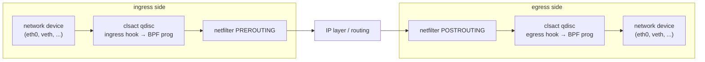
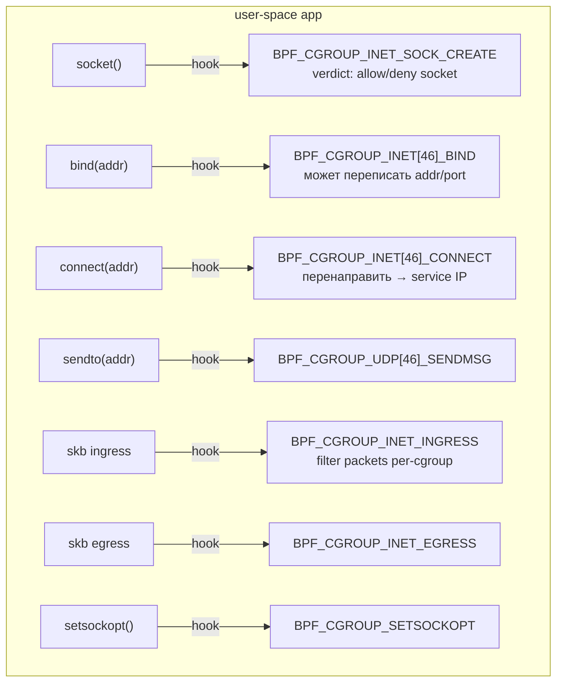

# eBPF в сетевом стеке: XDP, TC, sk_msg, sockops

Linux network stack — это многоуровневый pipeline. Кадр приходит на NIC, драйвер строит `sk_buff`,
передаёт его softirq, который ведёт пакет через netfilter, IP-уровень, TCP, очередь сокета и в
итоге в `recv()` приложения. На передаче — зеркальный путь от `send()` через qdisc к драйверу и
на wire. Каждая точка перехода между уровнями — кандидат на фильтрацию, модификацию, redirect.

До eBPF эти точки были закрыты для пользовательского кода. Расширение стека требовало одного из
двух: правила netfilter (iptables/nftables) — медленные, чисто декларативные, привязанные к
фиксированным hook'ам PREROUTING/FORWARD/INPUT/OUTPUT/POSTROUTING; или kernel module — полный
доступ ко всему, но любая ошибка → kernel panic, любая дыра → root-exploit, обновление → ребут.
iptables c десятками тысяч правил на ядро load balancer'а съедал 30–40% CPU только на матчинг.

eBPF дал третий путь. Программа компилируется в безопасный байт-код, verifier доказывает её
корректность, JIT превращает в нативные инструкции — и она attach'ится прямо в RX/TX path. Без
перекомпиляции ядра, без модулей, с производительностью на уровне нативного C-кода. XDP, который
запускается до allocation `sk_buff`, на голом железе обходит даже user-space DPDK по latency на
drop-операциях. Cilium заменил iptables в Kubernetes на TC BPF и получил O(1) поиск сервисов
вместо O(N) по chain'ам netfilter. Facebook Katran заменил IPVS на XDP и держит десятки Mpps на
ядро на commodity hardware.

Эта статья — о том, где именно в сетевом стеке Linux можно attach'ить BPF-программу, какие
verdict'ы доступны на каждой точке, и почему индустрия переезжает с netfilter на eBPF.

## Где можно attach'ить BPF в network path

Сетевой стек предоставляет полтора десятка hook-точек для BPF. Они различаются по тому, **в какой
момент жизни пакета** программа исполняется, и **что доступно** в её контексте.

```mermaid
flowchart TB
    subgraph RX["RX path"]
        NIC_R["NIC (hardware)"]
        DRV["driver (NAPI poll)"]
        XDP["XDP hook (до sk_buff!)"]
        SKB["skb allocation"]
        TC_IN["tc ingress (clsact)"]
        TC_BPF_IN["TC ingress BPF hook"]
        NF_PRE["netfilter PREROUTING"]
        IPRCV["ip_rcv() / routing"]
        IPLD["ip_local_deliver()"]
        CG_SKB["cgroup_skb ingress (BPF)"]
        TCPRCV["tcp_v4_rcv() / udp_rcv()"]
        SOCKOPS["sockops (BPF) — TCP state transitions"]
        SL["socket layer<br/>sk_filter / sk_reuseport"]
        SK_SKB["sk_skb (BPF) на streamed bytes (SOCKMAP)"]
        US_R["user-space recv()"]
        NIC_R -->|IRQ / DMA| DRV
        DRV --> XDP
        XDP -->|XDP_PASS| SKB
        SKB --> TC_IN
        TC_IN --> TC_BPF_IN
        TC_IN --> NF_PRE
        NF_PRE --> IPRCV
        IPRCV --> IPLD
        IPLD --> CG_SKB
        IPLD --> TCPRCV
        TCPRCV --> SOCKOPS
        TCPRCV --> SL
        SL --> SK_SKB
        SL --> US_R
    end
    subgraph TX["TX path"]
        US_T["user-space send/connect/bind"]
        CG_SA["cgroup_sock / cgroup_sockaddr hooks (BPF)<br/>на bind/connect"]
        SL_T["socket layer (sk_msg BPF) для send()"]
        TCPS["tcp_sendmsg()"]
        IPO["ip_output()"]
        QD["qdisc (fq_codel/...)"]
        NF_POST["netfilter POSTROUTING"]
        TC_E["tc egress (clsact)"]
        TC_BPF_E["TC egress BPF hook"]
        NIC_T["NIC → wire"]
        US_T --> CG_SA --> SL_T --> TCPS --> IPO --> QD --> NF_POST --> TC_E --> TC_BPF_E --> NIC_T
    end
```



Каждая точка — отдельный `bpf_prog_type` с собственным context и набором verdict'ов:

| Hook point            | Program type                     | Контекст          | Когда вызывается                                      |
|-----------------------|----------------------------------|-------------------|-------------------------------------------------------|
| **XDP**               | `BPF_PROG_TYPE_XDP`              | `xdp_md`          | в драйвере, до allocation `sk_buff`                   |
| **TC ingress/egress** | `BPF_PROG_TYPE_SCHED_CLS`        | `__sk_buff`       | на qdisc clsact, после `sk_buff`                      |
| **socket filter**     | `BPF_PROG_TYPE_SOCKET_FILTER`    | `__sk_buff`       | на входе пакета в socket (legacy cBPF API)            |
| **sockops**           | `BPF_PROG_TYPE_SOCK_OPS`         | `bpf_sock_ops`    | TCP state transitions (connect/accept/RTO)            |
| **sk_skb**            | `BPF_PROG_TYPE_SK_SKB`           | `__sk_buff`       | при чтении/записи в SOCKMAP-зарегистрированный socket |
| **sk_msg**            | `BPF_PROG_TYPE_SK_MSG`           | `sk_msg_md`       | при `sendmsg()` для socket в SOCKMAP                  |
| **sk_reuseport**      | `BPF_PROG_TYPE_SK_REUSEPORT`     | `sk_reuseport_md` | выбор socket в `SO_REUSEPORT` группе                  |
| **cgroup_skb**        | `BPF_PROG_TYPE_CGROUP_SKB`       | `__sk_buff`       | network packets per-cgroup (ingress/egress)           |
| **cgroup_sock**       | `BPF_PROG_TYPE_CGROUP_SOCK`      | `bpf_sock`        | при `socket()` в cgroup                               |
| **cgroup_sockaddr**   | `BPF_PROG_TYPE_CGROUP_SOCK_ADDR` | `bpf_sock_addr`   | при `bind()`/`connect()`/`sendto()`                   |
| **cgroup_sock_ops**   | `BPF_PROG_TYPE_SOCK_OPS`         | `bpf_sock_ops`    | TCP options per-cgroup                                |
| **lwt**               | `BPF_PROG_TYPE_LWT_*`            | `__sk_buff`       | при роутинге через lwt-encapsulated route             |
| **flow_dissector**    | `BPF_PROG_TYPE_FLOW_DISSECTOR`   | `__sk_buff`       | при парсинге flow для RSS/RPS/RFS                     |

Чем раньше в pipeline стоит hook, тем меньше работы успело сделать ядро, тем дешевле drop/redirect.
XDP — самый ранний, и потому самый быстрый. Чем глубже — тем больше доступного контекста: на
уровне socket BPF знает про owning task, про namespace, про cgroup, про TCP-состояние.

## XDP — самый быстрый путь

XDP (eXpress Data Path, 2016) был добавлен, чтобы дать Linux competitive position против DPDK и
Netmap. Идея: дать BPF-программе исполниться **внутри драйвера NIC, сразу после DMA**, до того как
ядро потратило время на `napi_alloc_skb()`, `__build_skb()`, копирование заголовков. На этом этапе
пакет — это просто указатель на DMA-буфер NIC; ничего из дорогой машинерии skb ещё нет.

### Context: xdp_md

```c
struct xdp_md {
    __u32 data;              // offset на начало packet data
    __u32 data_end;          // offset на конец packet data
    __u32 data_meta;         // offset на metadata (от XDP_METADATA)
    __u32 ingress_ifindex;   // ifindex входного интерфейса
    __u32 rx_queue_index;    // номер RX queue
    __u32 egress_ifindex;    // для XDP_REDIRECT — выходной ifindex
};
```

Программа получает `data`/`data_end` как указатели на сырые bytes пакета. Никаких parsed
заголовков — всё руками. Verifier строго следит, чтобы любой доступ был bounded check'ом против
`data_end`.

### Verdicts

| Verdict        | Значение | Что происходит                                                          |
|----------------|----------|-------------------------------------------------------------------------|
| `XDP_PASS`     | 2        | передать пакет в обычный стек, пойдёт через skb allocation              |
| `XDP_DROP`     | 1        | мгновенный drop, packet buffer возвращается в NIC pool, ~5–10 ns        |
| `XDP_TX`       | 3        | отправить тот же пакет обратно через этот же NIC (bounce)               |
| `XDP_REDIRECT` | 4        | перенаправить на другой интерфейс или в AF_XDP socket / CPUMAP / DEVMAP |
| `XDP_ABORTED`  | 0        | trace event `xdp_exception` + drop; для отладки                         |

`XDP_DROP` — главная киллер-фича для DDoS protection. Когда Cloudflare ловит атаку на 100+ Mpps,
правила в iptables просто не успевают: каждый пакет проходит весь netfilter, ksoftirqd выгребает
budget'ы, остаётся 0% CPU на полезную работу. XDP_DROP кладёт пакет в /dev/null до того, как
ядро узнало о его существовании.

### Modes

XDP attach'ится в трёх режимах в зависимости от поддержки драйвера и железа.

```mermaid
flowchart TB
    subgraph Off["1. OFFLOADED XDP (на NIC hardware)"]
        Owire[wire] --> ONIC["NIC firmware<br/>BPF program JIT'ится в инструкции NPU<br/>(Netronome AF, Mellanox)"]
        ONIC --> Overdict["verdict: PASS/DROP/TX<br/>(драйвер не видит DROP)"]
    end
    subgraph Nat["2. NATIVE XDP (в драйвере)"]
        Nwire[wire] --> NNIC["NIC hardware<br/>DMA в RX ring buffer"]
        NNIC --> NDRV["driver (NAPI poll)<br/>XDP program в page context<br/>~5–10 ns drop, ~50 ns pass,<br/>~30 ns tx/redirect"]
        NDRV -->|pass| Nskb["skb alloc"]
        NDRV -->|drop/tx/redirect| NDONE["done"]
    end
    subgraph Gen["3. GENERIC XDP (SKB-mode) — fallback"]
        Gwire[wire] --> GNIC["NIC hardware"]
        GNIC --> GDRV["драйвер: обычный путь<br/>napi_alloc_skb(), __build_skb()<br/>(skb уже создан!)"]
        GDRV --> GNRSC["netif_receive_skb_core<br/>XDP program поверх готового skb<br/>~200–500 ns на drop<br/>работает на любом NIC"]
    end
```



| Mode            | Где исполняется       | Когда выбрать                           | Performance              |
|-----------------|-----------------------|-----------------------------------------|--------------------------|
| **Native XDP**  | в драйвере, до skb    | основная цель XDP                       | ~24 Mpps drop на 1 core  |
| **Offloaded**   | на NIC (SmartNIC NPU) | Netronome Agilio, Mellanox BlueField    | hardware line rate       |
| **Generic XDP** | после skb allocation  | драйвер не умеет native; для разработки | ~5–8 Mpps, latency 2–10× |

Native mode поддерживают современные драйверы: `ixgbe`, `i40e`, `ice` (Intel), `mlx4`/`mlx5`
(Mellanox), `bnxt` (Broadcom), `nfp` (Netronome), `virtio_net`, `veth`, `tap`. Realtek `r8169` —
только generic. Список можно проверить через `bpftool feature probe dev eth0`.

### XDP_REDIRECT и map-based targets

`XDP_REDIRECT` сам по себе не знает, куда редиректить — это просто verdict. Конкретная цель
указывается через **map**, в которую программа кладёт ifindex/cpu/socket-id перед возвратом:

| Map type              | Куда редирект                       | Use case                            |
|-----------------------|-------------------------------------|-------------------------------------|
| `BPF_MAP_TYPE_DEVMAP` | другой netdev (по ifindex)          | software bridge, router             |
| `BPF_MAP_TYPE_CPUMAP` | другой CPU для дальнейшей обработки | load balancing softirq между ядрами |
| `BPF_MAP_TYPE_XSKMAP` | AF_XDP socket в user-space          | kernel bypass, zero-copy            |

```c
// DEVMAP: bridge eth0 ↔ eth1 на уровне XDP
struct {
    __uint(type, BPF_MAP_TYPE_DEVMAP);
    __type(key, __u32);
    __type(value, __u32);
    __uint(max_entries, 64);
} tx_port SEC(".maps");

SEC("xdp")
int bridge(struct xdp_md *ctx) {
    __u32 key = ctx->ingress_ifindex == ETH0_IFINDEX ? 1 : 0;
    return bpf_redirect_map(&tx_port, key, 0);
}
```

### Минимальный пример: drop по IP

```c
#include <linux/bpf.h>
#include <linux/if_ether.h>
#include <linux/ip.h>
#include <bpf/bpf_helpers.h>
#include <bpf/bpf_endian.h>

#define BLOCKED_IP bpf_htonl(0x0A000005)  // 10.0.0.5

SEC("xdp")
int drop_ip(struct xdp_md *ctx) {
    void *data     = (void *)(long)ctx->data;
    void *data_end = (void *)(long)ctx->data_end;

    struct ethhdr *eth = data;
    if ((void *)(eth + 1) > data_end) return XDP_PASS;
    if (eth->h_proto != bpf_htons(ETH_P_IP)) return XDP_PASS;

    struct iphdr *ip = (void *)(eth + 1);
    if ((void *)(ip + 1) > data_end) return XDP_PASS;

    if (ip->saddr == BLOCKED_IP) return XDP_DROP;
    return XDP_PASS;
}

char LICENSE[] SEC("license") = "GPL";
```

Загрузка:

```bash
clang -target bpf -O2 -g -c drop_ip.c -o drop_ip.o
sudo ip link set eth0 xdp obj drop_ip.o sec xdp
# или generic mode:
sudo ip link set eth0 xdpgeneric obj drop_ip.o sec xdp
# отвязать:
sudo ip link set eth0 xdp off
```

### Use cases в production

| Проект                | Что делает                                                  |
|-----------------------|-------------------------------------------------------------|
| **Cloudflare L4Drop** | DDoS mitigation; XDP_DROP по rule set на edge nodes         |
| **Facebook Katran**   | L4 load balancer; XDP_TX с DSR (Direct Server Return)       |
| **Cilium**            | host firewall, NAT64, multicluster routing                  |
| **MS Azure**          | XDP на DPDK-альтернативу для SDN dataplane                  |
| **Suricata IDS**      | inspect & drop malware-трафик до его обработки стеком       |
| **DPDK + AF_XDP**     | hybrid: AF_XDP kernel-managed driver + DPDK API в userspace |

## TC (Traffic Control) — гибче XDP, но позже

TC BPF цепляется к **qdisc** — слою между IP-стеком и драйвером. До eBPF qdisc использовался
только для shaping (htb, fq_codel) и фильтрации через cls_u32/cls_flower. С приходом BPF появился
`cls_bpf` и специальная qdisc `clsact`, которая добавляет одновременно ingress и egress
filter-точки на интерфейсе.



### Контекст: __sk_buff

TC-программа работает с `sk_buff` (через специальную проекцию `__sk_buff`, скрывающую внутренности
от UAPI):

```c
struct __sk_buff {
    __u32 len;
    __u32 pkt_type;
    __u32 mark;          // skb mark — можно ставить, потом читать в iptables/routing
    __u32 queue_mapping;
    __u32 protocol;
    __u32 vlan_present;
    __u32 vlan_tci;
    __u32 ifindex;
    __u32 priority;
    /* ... */
    __u32 data;          // указатель на начало packet data (как и в XDP)
    __u32 data_end;
};
```

Помимо `data`/`data_end`, доступны helper'ы для работы с `sk_buff`:

```c
bpf_skb_load_bytes(skb, off, dst, sz);          // безопасное чтение
bpf_skb_store_bytes(skb, off, src, sz, flags);  // запись + recompute csum
bpf_skb_change_head(skb, len, flags);           // расширить headroom
bpf_skb_change_tail(skb, new_len, flags);       // изменить длину payload
bpf_skb_pull_data(skb, len);                    // расширить linear part skb
bpf_skb_adjust_room(skb, delta, mode, ..);      // encap/decap (VXLAN, GRE)
bpf_l3_csum_replace(skb, off, from, to, sz);
bpf_l4_csum_replace(skb, off, from, to, flags);
```

В отличие от XDP, TC может **модифицировать пакет** легко: добавить/убрать заголовок,
переписать поля, пересчитать checksum. Это делает TC основным dataplane для overlay-сетей
(VXLAN, Geneve, IPIP-encap).

### Verdicts

| Verdict             | Значение | Эффект                                                     |
|---------------------|----------|------------------------------------------------------------|
| `TC_ACT_OK`         | 0        | пропустить пакет, продолжить обработку                     |
| `TC_ACT_SHOT`       | 2        | drop                                                       |
| `TC_ACT_RECLASSIFY` | 1        | вернуть на начало tc-цепочки                               |
| `TC_ACT_PIPE`       | 3        | передать следующему filter в цепочке                       |
| `TC_ACT_STOLEN`     | 4        | пакет «украден» (например, отправлен через `bpf_redirect`) |
| `TC_ACT_REDIRECT`   | 7        | redirect на другой интерфейс (после `bpf_redirect()`)      |

### Attach

```bash
# Создать clsact qdisc на интерфейсе
sudo tc qdisc add dev eth0 clsact

# Прицепить BPF-программу на ingress
sudo tc filter add dev eth0 ingress bpf da obj filter.o sec tc

# То же на egress
sudo tc filter add dev eth0 egress bpf da obj filter.o sec tc

# Посмотреть
tc filter show dev eth0 ingress
tc filter show dev eth0 egress
```

`da` = `direct-action`: возвращаемое значение программы интерпретируется как verdict напрямую,
без отдельного action-модуля. Стандарт для BPF; legacy режим без `da` остался для совместимости.

### Пример: добавить tracing header в egress

```c
SEC("tc")
int add_marker(struct __sk_buff *skb) {
    // вставить 4-байтный TLV между Ethernet и IP
    if (bpf_skb_adjust_room(skb, 4, BPF_ADJ_ROOM_MAC, 0) < 0)
        return TC_ACT_OK;

    void *data     = (void *)(long)skb->data;
    void *data_end = (void *)(long)skb->data_end;

    if (data + sizeof(struct ethhdr) + 4 > data_end)
        return TC_ACT_OK;

    __u32 marker = bpf_htonl(0xDEADBEEF);
    bpf_skb_store_bytes(skb, sizeof(struct ethhdr), &marker, 4,
                        BPF_F_RECOMPUTE_CSUM);
    return TC_ACT_OK;
}
```

### Cilium: TC BPF вместо iptables

Cilium — главный consumer TC BPF. Архитектура: на каждом netdev (host eth0, на каждом veth от
pod) прицеплены ingress + egress BPF-программы. Они выполняют всё, что в традиционном Kubernetes
делает iptables + kube-proxy:

| Функция iptables                                | Cilium TC BPF                             |
|-------------------------------------------------|-------------------------------------------|
| `iptables -t nat -L KUBE-SERVICES` (O(N) chain) | hash lookup в `BPF_MAP_TYPE_HASH_OF_MAPS` |
| `iptables -t filter` (NetworkPolicy)            | identity-based policy в HASH map          |
| `conntrack` модуль                              | own conntrack в `BPF_MAP_TYPE_LRU_HASH`   |
| `kube-proxy` userspace daemon                   | весь dataplane в kernel BPF               |

На кластере с 10000 services iptables build & reload занимает минуты, во время которых правила
неконсистентны. Cilium обновляет одну map-запись за микросекунды.

## Socket-level hooks

Глубже в стеке, на уровне отдельного сокета, есть несколько BPF program types для разной
гранулярности контроля.

### Classic socket filter

`BPF_PROG_TYPE_SOCKET_FILTER` — самый старый, унаследованный от cBPF. Программа цепляется к
конкретному socket через `setsockopt(SOL_SOCKET, SO_ATTACH_BPF, ...)` и решает: пропустить пакет
до приложения или дропнуть. Возвращаемое значение — длина, в которую truncate'ить пакет (0 =
drop, ~0 = pass full).

Главный пользователь — `tcpdump`. При запуске `tcpdump 'tcp port 443'` он компилирует фильтр в
cBPF и attach'ит к raw socket. Ядро запускает программу на каждом пакете и передаёт прошедшие в
userspace. Без BPF tcpdump копировал бы все пакеты и фильтровал в userspace — на нагруженном
интерфейсе это 100% CPU.

### Sockops (BPF_PROG_TYPE_SOCK_OPS)

Sockops — единственный BPF type, который вызывается **на TCP state transitions**, а не на
пакетах. Программа получает event code и решает, что вернуть:

```c
struct bpf_sock_ops {
    __u32 op;                // event code (см. ниже)
    __u32 family;            // AF_INET / AF_INET6
    __u32 remote_ip4;
    __u32 local_ip4;
    __u32 remote_port;
    __u32 local_port;
    __u32 is_fullsock;
    __u32 snd_cwnd;          // TCP congestion window
    __u32 srtt_us;           // smoothed RTT
    __u32 bpf_sock_ops_cb_flags;
    __u32 state;             // TCP state
    /* ... */
};
```

Основные `op` codes:

| Op                                    | Когда вызывается                              |
|---------------------------------------|-----------------------------------------------|
| `BPF_SOCK_OPS_TIMEOUT_INIT`           | для установки initial RTO                     |
| `BPF_SOCK_OPS_RWND_INIT`              | для установки initial receive window          |
| `BPF_SOCK_OPS_TCP_CONNECT_CB`         | активное соединение, до отправки SYN          |
| `BPF_SOCK_OPS_ACTIVE_ESTABLISHED_CB`  | переход в ESTABLISHED после активного connect |
| `BPF_SOCK_OPS_PASSIVE_ESTABLISHED_CB` | переход в ESTABLISHED после accept            |
| `BPF_SOCK_OPS_NEEDS_ECN`              | разрешить ECN на этом socket                  |
| `BPF_SOCK_OPS_BASE_RTT`               | для congestion control hints                  |
| `BPF_SOCK_OPS_RTO_CB`                 | retransmission timeout                        |
| `BPF_SOCK_OPS_RETRANS_CB`             | любая retransmission                          |
| `BPF_SOCK_OPS_STATE_CB`               | любой state transition                        |

Use cases:

- **Per-connection congestion control tuning.** Установить cwnd / SYN cookies для определённых
  cgroup'ов или peer'ов.
- **SOCKMAP population.** На `PASSIVE_ESTABLISHED_CB` положить socket в SOCKMAP для дальнейшего
  sk_msg/sk_skb redirect.
- **Metrics collection.** На каждом state transition записать в map; userspace читает и шлёт в
  observability backend.

### sk_msg и sk_skb — manipulation на streamed bytes

`sk_msg` и `sk_skb` работают поверх **SOCKMAP** / **SOCKHASH** — специальных map типов, в
которые кладутся socket descriptors. Программа имеет доступ к bytes в момент `sendmsg()` (sk_msg)
или к incoming chunks (sk_skb), может **перенаправить bytes из одного socket в другой** без
копирования через userspace.

```mermaid
flowchart LR
    subgraph WO["без BPF (service mesh sidecar, traditional)"]
        WA["app A"] -->|send()| WK1[kernel→TCP→NIC]
        WK1 --> WK2[NIC→TCP→kernel→recv()]
        WK2 --> WSC[sidecar]
        WSC -->|send()| WK3[kernel→TCP→NIC]
        WK3 --> WK4["NIC→TCP→kernel<br/>(loopback)"]
        WK4 -->|recv()| WB["app B"]
    end
    subgraph WS["с sk_msg + SOCKMAP"]
        SA["app A"] -->|send()| SMP["sk_msg BPF prog<br/>bpf_msg_redirect_hash(map, key, ...)"]
        SMP -->|"перекладывает payload<br/>в receive queue B<br/>без копирования"| RQ["socket B receive queue"]
        RQ -->|recv()| SB["app B"]
    end
```

Это основа **sockmap-based service mesh** (Cilium Mesh, Istio Ambient Mode): два процесса на
одном хосте общаются через kernel-bypass loopback, минуя весь TCP stack целиком.

```c
// Минимальный sk_msg redirect: переадресовать всё в peer socket
SEC("sk_msg")
int redirect_all(struct sk_msg_md *msg) {
    __u32 key = 0;  // ключ peer-сокета в SOCKHASH
    return bpf_msg_redirect_hash(&sock_hash, &key, BPF_F_INGRESS);
}
```

### sk_reuseport — выбор socket в группе

`SO_REUSEPORT` позволяет нескольким сокетам слушать один порт; ядро распределяет входящие
соединения по hash. `BPF_PROG_TYPE_SK_REUSEPORT` позволяет **заменить** этот hash на программу:

```c
SEC("sk_reuseport")
int select_by_cpu(struct sk_reuseport_md *reuse) {
    __u32 cpu = bpf_get_smp_processor_id();
    return bpf_sk_select_reuseport(reuse, &reuse_map, &cpu, 0);
}
```

Use case: пин-нуть каждый incoming connection к worker'у, работающему на том же CPU, что и NIC
RX queue — для cache locality.

## cgroup-bpf для networking

cgroup BPF — отдельная категория, в которой программа attach'ится не к интерфейсу, а к **cgroup
inode**. Все процессы внутри cgroup (и дочерних, если включено наследование) проходят через
программу при соответствующих событиях.



| Program type                     | Hook                            | Что можно                               |
|----------------------------------|---------------------------------|-----------------------------------------|
| `BPF_PROG_TYPE_CGROUP_SKB`       | ingress/egress на cgroup        | drop/pass packet                        |
| `BPF_PROG_TYPE_CGROUP_SOCK`      | socket()/release/post_bind      | allow/deny socket creation              |
| `BPF_PROG_TYPE_CGROUP_SOCK_ADDR` | bind/connect/sendto/getpeername | rewrite address (NAT, DNS interception) |
| `BPF_PROG_TYPE_CGROUP_SOCKOPT`   | getsockopt/setsockopt           | filter sockopt values                   |
| `BPF_PROG_TYPE_CGROUP_SOCK_OPS`  | TCP state events                | per-cgroup TCP tuning                   |
| `BPF_PROG_TYPE_CGROUP_SYSCTL`    | sysctl read/write               | per-cgroup sysctl override              |

### Cgroup-bpf для Kubernetes Network Policy

Традиционно NetworkPolicy в Kubernetes реализуется через iptables (calico, kube-router) или
ipvs. Это значит: O(N) rules, per-packet matching, перестроение всех правил при изменении
конфигурации. С cgroup-bpf можно проверять policy один раз — на `connect()` — и кэшировать
результат в socket cookie, дальше пропуская весь трафик без overhead.

Использование Cilium: на каждом pod cgroup attach'ится `cgroup_sock_addr` для `connect()`.
Программа смотрит destination, ищет в HASH map identity peer pod'а, проверяет policy. Если
allow — переписывает destination address на endpoint pod'а (сервисная балансировка) и пропускает.
Если deny — возвращает `-EPERM`, `connect()` падает с EACCES.

## AF_XDP — kernel bypass через XDP

AF_XDP — это **socket family** (`AF_XDP`, 44), который позволяет userspace процессу получать
сырые пакеты из XDP-программы напрямую, **минуя весь kernel network stack**. Это альтернатива
DPDK, но без необходимости переписывать NIC driver: программа использует обычный kernel driver,
просто прицепляется к XDP hook'у.

### Архитектура

```
                       AF_XDP zero-copy data flow

       userspace                                        kernel
       ──────────                                       ──────

   ┌─────────────────────────────┐
   │   application               │
   │                             │              ┌─────────────────────────┐
   │   xsk_socket__create()      │ ────────────▶│  AF_XDP socket в kernel │
   │                             │              │  (struct xdp_sock)      │
   └─────────────────────────────┘              └────────────┬────────────┘
                                                             │
   ┌─────────────────────────────┐                           │
   │   mmap region: UMEM         │                           │
   │   (User Memory)             │ ◀───────── registered ────┤
   │                             │                           │
   │   ┌────┬────┬────┬────┬───┐ │                           │
   │   │ F0 │ F1 │ F2 │ F3 │...│ │  frames, обычно 2 KB      │
   │   └────┴────┴────┴────┴───┘ │  каждый                   │
   └─────────────────────────────┘                           │
            ▲              ▲                                 │
            │              │                                 │
       ┌────┴────┐    ┌────┴────┐                            │
       │ FILL    │    │ COMPL   │                            │
       │ ring    │    │ ring    │                            │
       │ (RX)    │    │ (TX)    │                            │
       └─────────┘    └─────────┘                            │
                                                             │
       ┌─────────┐    ┌─────────┐                            │
       │ RX ring │    │ TX ring │ ───────────────────────────┤
       │         │    │         │                            │
       └────┬────┘    └─────────┘                            │
            │                                                │
            │                                     ┌──────────▼──────────┐
            │  app читает дескрипторы             │   XSKMAP            │
            │  кадров                             │   key → xdp_sock fd │
            │                                     └──────────▲──────────┘
            │                                                │
            │                                     ┌──────────┴──────────┐
            │                                     │   XDP program       │
            │                                     │                     │
            │                                     │  bpf_redirect_map(  │
            │                                     │    &xsks_map,       │
            │                                     │    queue_id, 0);    │
            │                                     │                     │
            │                                     │  return XDP_REDIRECT;│
            │                                     └──────────▲──────────┘
            │                                                │
            │                                     ┌──────────┴──────────┐
            │                                     │  NIC driver         │
            │                                     │  (native XDP)       │
            └──── packet данные в UMEM (zero-copy)│  DMA в UMEM frames  │
                                                  └─────────────────────┘
```

Четыре кольцевых буфера между kernel и userspace:

| Ring      | Направление   | Содержит                                                 |
|-----------|---------------|----------------------------------------------------------|
| **FILL**  | user → kernel | свободные UMEM frame descriptors (для RX)                |
| **RX**    | kernel → user | descriptors заполненных пакетами frames                  |
| **TX**    | user → kernel | descriptors frames, которые надо отправить               |
| **COMPL** | kernel → user | descriptors отправленных frames (можно переиспользовать) |

UMEM — большой mmap-регион, поделённый на фиксированного размера frame'ы. NIC через DMA пишет
прямо в эти frame'ы (zero-copy mode) или ядро копирует туда (copy mode). XDP-программа на пути
RX делает `bpf_redirect_map(&xsks_map, queue_id, 0)` — и kernel вместо обычного pass-через-стек
кладёт frame в RX-ring соответствующего AF_XDP socket.

### Сравнение с DPDK

| Аспект             | DPDK                            | AF_XDP                           |
|--------------------|---------------------------------|----------------------------------|
| Driver             | own (PMD, vfio-pci)             | kernel driver + XDP hook         |
| NIC ownership      | exclusive (driver replaced)     | shared (kernel + userspace)      |
| Setup              | hugepages, IOMMU, dedicated CPU | mmap + xdp_socket_create         |
| Performance        | ~100 Gbps line rate             | 60–80 Gbps                       |
| Поддержка hardware | ограниченный список             | любой XDP-native NIC             |
| Routing/firewall   | заново в userspace              | можно дёшево пропустить в kernel |

AF_XDP выигрывает там, где нужна гибкость: часть трафика обрабатывать в userspace zero-copy
fast path, часть отдавать обратно в kernel для обычной обработки. DPDK — для случаев, где
**весь** трафик с NIC идёт в userspace и нужны абсолютные числа.

```c
// Создание AF_XDP socket (упрощённо, через libxdp/libbpf)
struct xsk_umem *umem;
struct xsk_socket *xsk;
void *buffer = mmap(NULL, UMEM_SIZE, PROT_READ | PROT_WRITE,
                    MAP_PRIVATE | MAP_ANONYMOUS, -1, 0);
xsk_umem__create(&umem, buffer, UMEM_SIZE, &fq, &cq, &umem_cfg);
xsk_socket__create(&xsk, "eth0", queue_id, umem, &rx, &tx, &xsk_cfg);

// Получить пакеты:
__u32 idx_rx = 0;
unsigned int rcvd = xsk_ring_cons__peek(&rx, BATCH_SIZE, &idx_rx);
for (int i = 0; i < rcvd; i++) {
    const struct xdp_desc *desc = xsk_ring_cons__rx_desc(&rx, idx_rx++);
    void *pkt = xsk_umem__get_data(buffer, desc->addr);
    // process pkt
}
xsk_ring_cons__release(&rx, rcvd);
```

## Cilium — самый известный consumer eBPF networking

Cilium — open-source Kubernetes CNI plugin от Isovalent (теперь часть Cisco), который полностью
заменил iptables/kube-proxy на eBPF. Стал референс-имплементацией того, как должен выглядеть
production eBPF networking.

### Архитектура

```
                      Cilium architecture (per-node)

   ┌─────────────────────────────────────────────────────────────────────┐
   │                       Kubernetes node                               │
   │                                                                     │
   │   ┌─────────────────────────────────────────────────────────────┐   │
   │   │                  cilium-agent (DaemonSet)                   │   │
   │   │                                                             │   │
   │   │   • watches K8s API (pods, services, NetworkPolicy)         │   │
   │   │   • генерирует BPF C-код per pod                            │   │
   │   │   • компилирует через clang, loads через libbpf             │   │
   │   │   • поддерживает state в BPF maps                           │   │
   │   │   • exposes Prometheus metrics, Hubble events               │   │
   │   └─────┬─────────────────────────────────────────┬─────────────┘   │
   │         │ loads BPF                               │ updates maps    │
   │         ▼                                         ▼                 │
   │   ┌──────────────────────────────────────────────────────────────┐  │
   │   │                       kernel                                 │  │
   │   │                                                              │  │
   │   │   ┌─────────────────────────────────────────────────────┐    │  │
   │   │   │              BPF maps (shared state)                │    │  │
   │   │   │                                                     │    │  │
   │   │   │   cilium_lb4_services_v2  ← service IP → backends   │    │  │
   │   │   │   cilium_lb4_backends_v3  ← backend pool            │    │  │
   │   │   │   cilium_ct4_global       ← conntrack table         │    │  │
   │   │   │   cilium_policy_v2_<id>   ← per-endpoint policy     │    │  │
   │   │   │   cilium_ipcache_v2       ← IP → identity → security│    │  │
   │   │   │   cilium_tunnel_map       ← VXLAN tunnel endpoints  │    │  │
   │   │   └─────────────────────────────────────────────────────┘    │  │
   │   │                            ▲                                 │  │
   │   │            ┌───────────────┼───────────────┐                 │  │
   │   │            │               │               │                 │  │
   │   │   ┌────────┴───────┐ ┌─────┴────────┐ ┌────┴───────┐         │  │
   │   │   │ XDP on eth0    │ │ TC on eth0   │ │ TC on each │         │  │
   │   │   │ (DDoS, LB)     │ │ (ingress)    │ │ veth (per  │         │  │
   │   │   │                │ │              │ │ pod)       │         │  │
   │   │   └────────────────┘ └──────────────┘ └────────────┘         │  │
   │   │                                                              │  │
   │   │   ┌────────────────┐ ┌──────────────┐ ┌────────────┐         │  │
   │   │   │ cgroup BPF on  │ │ sock_addr    │ │ sk_msg on  │         │  │
   │   │   │ host cgroup    │ │ for connect()│ │ SOCKMAP    │         │  │
   │   │   │ (host firewall)│ │ load balance │ │ (Mesh)     │         │  │
   │   │   └────────────────┘ └──────────────┘ └────────────┘         │  │
   │   └──────────────────────────────────────────────────────────────┘  │
   │                                                                     │
   │   ┌─────┐  ┌─────┐  ┌─────┐  ┌─────┐                                │
   │   │pod A│  │pod B│  │pod C│  │pod D│   ── каждый имеет veth, на     │
   │   └─────┘  └─────┘  └─────┘  └─────┘      каждом TC BPF             │
   │                                                                     │
   └─────────────────────────────────────────────────────────────────────┘
                                    │
                                    │ маршрутизация cross-node:
                                    ▼ VXLAN, Geneve, или native routing
                              другие nodes кластера
```

Ключевые компоненты:

- **cilium-agent** — DaemonSet pod на каждом ноде. Watches Kubernetes API, на каждое
  pod/service/policy событие генерирует обновлённый C-код для BPF-программ, компилирует через
  встроенный clang, загружает через libbpf. Поддерживает в синхроне множество BPF maps.
- **eBPF maps shared между BPF и agent.** Agent пишет в maps снаружи через `bpf()` syscall, BPF
  читает изнутри через helpers. Это синхронизация без блокировок: при изменении NetworkPolicy
  agent просто обновляет map-запись, и BPF-программа на следующем пакете использует новое
  правило.
- **Hubble** — observability layer. Subscribed на events из BPF (через ring buffer), отдаёт UI и
  metrics. Видно каждое allowed/dropped соединение, identity отправителя/получателя, L7
  protocol parsing (HTTP method, gRPC service, Kafka topic).
- **Cluster mesh** — cross-cluster service discovery. Каждый кластер реплицирует свои services и
  identities в etcd cluster mesh; remote services появляются в локальных BPF maps как обычные
  ClusterIP — pod может звонить через них без знания, что endpoint на другом кластере.

### Cilium Mesh без sidecar

Традиционный service mesh (Istio, Linkerd v1) использует **sidecar pattern**: в каждый pod
инжектируется Envoy proxy, который перехватывает весь трафик и применяет policies. Это удваивает
число pod'ов и добавляет 2 hop'а к каждому RPC.

Cilium Mesh реализует то же самое **в kernel через sockmap + sk_msg**. Когда pod A на хосте
открывает соединение с pod B на том же хосте, BPF-программа на `connect()` распознаёт
intra-host trip, кладёт обе стороны socket'а в SOCKMAP. `sk_msg`-программа потом перенаправляет
`sendmsg()` напрямую в receive queue второго socket, минуя весь TCP stack. Производительность
loopback × 4 при том же policy enforcement.

Visibility через `cilium monitor`, `cilium hubble observe`:

```bash
# Все события на ноде
cilium monitor -t drop

# Запросы через Hubble за последние 5 минут
hubble observe --since=5m --type=trace

# Конкретный flow с DNS / HTTP / gRPC L7 info
hubble observe --pod default/frontend --to-pod default/backend --output json
```

## Facebook Katran — XDP load balancer

Katran — open-source L4 load balancer от Facebook (теперь Meta), полностью построенный на XDP.
Заменил предыдущий проприетарный IPVS-based балансировщик в production. Используется на edge
nodes Facebook для распределения трафика между application servers.

### Архитектура

```
                       Katran data plane

                ┌──────────────────────────────────┐
                │  client request                  │
                │  src=client_ip,                  │
                │  dst=VIP                         │
                └────────────┬─────────────────────┘
                             │
                             ▼
                ┌──────────────────────────────────┐
                │  Katran edge node                │
                │  ┌────────────────────────────┐  │
                │  │  NIC RX                    │  │
                │  └────────────┬───────────────┘  │
                │               │                  │
                │               ▼                  │
                │  ┌────────────────────────────┐  │
                │  │  XDP program (Katran)      │  │
                │  │                            │  │
                │  │  1. Maglev consistent hash │  │
                │  │     (client_ip, port, ...) │  │
                │  │     → backend server       │  │
                │  │                            │  │
                │  │  2. IPIP-encapsulate с     │  │
                │  │     outer dst=backend      │  │
                │  │                            │  │
                │  │  3. XDP_TX (отправить      │  │
                │  │     обратно через NIC)     │  │
                │  └────────────┬───────────────┘  │
                └───────────────┼──────────────────┘
                                │
                                ▼
                ┌──────────────────────────────────┐
                │  backend server                  │
                │  • получает IPIP-encapsulated    │
                │  • IPIP decap (kernel ipip mod)  │
                │  • inner src=client_ip, dst=VIP  │
                │  • отвечает напрямую клиенту     │
                │    (DSR, Direct Server Return)   │
                │                                  │
                │  ответ идёт от backend → client  │
                │  МИНУЯ Katran                    │
                └──────────────────────────────────┘
```

Ключевые свойства:

- **Maglev consistent hashing.** При добавлении/удалении backend'а только ~1/N соединений
  переезжают, остальные сохраняют affinity. Без consistent hash удаление backend'а перетасовало
  бы все сессии и обнулило TCP connections.
- **DSR (Direct Server Return).** Backend отвечает клиенту напрямую, минуя load balancer. Это
  значит: трафик ответа (обычно в 10–100× больше запроса для HTTP/video) не нагружает Katran.
  Один Katran node обслуживает в 100× больше клиентов, чем classical L4 LB с symmetric path.
- **IPIP encapsulation.** Чтобы сохранить original client IP на backend, Katran кладёт original
  packet в IPIP туннель. Backend делает decap и видит правильный source.

Производительность: >10 Mpps на ядро на commodity Intel Xeon, line-rate 100 Gbps на современном
hardware с 8–16 ядрами под Katran.

GitHub: [facebookincubator/katran](https://github.com/facebookincubator/katran).

## Производительность в числах

Цифры зависят от железа, packet size (обычно 64-byte minimum-size для measurement), сложности
программы. Порядок величин на современном Xeon с 100 GbE NIC, packet 64 B:

```
            Performance ladder (single core, 64-byte packets)

                  iptables       ~3 Gbps    │█░░░░░░░░░░░░░░░░░░░░░░░░░│
                                            │                          │
                  nftables       ~6 Gbps    │██░░░░░░░░░░░░░░░░░░░░░░░░│
                                            │                          │
                  TC BPF        ~15 Gbps    │█████░░░░░░░░░░░░░░░░░░░░░│
                                            │                          │
                  XDP generic   ~25 Gbps    │█████████░░░░░░░░░░░░░░░░░│
                                            │                          │
                  XDP native    ~60 Gbps    │██████████████████░░░░░░░░│
                                            │                          │
                  AF_XDP        ~70 Gbps    │██████████████████████░░░░│
                                            │                          │
                  DPDK         ~100 Gbps    │██████████████████████████│
                                            │                          │
                  XDP offloaded line rate   │██████████████████████████│  hardware
```

| Технология        | Single-core throughput | Latency на drop | CPU cost                       |
|-------------------|------------------------|-----------------|--------------------------------|
| **iptables**      | 3–5 Gbps               | ~3 µs           | O(N) на rule chain             |
| **nftables**      | 5–10 Gbps              | ~1.5 µs         | O(log N) (set lookup)          |
| **TC BPF**        | 15–20 Gbps             | ~500 ns         | O(1) с hash map                |
| **XDP generic**   | 5–8 Mpps drop          | ~250 ns         | работает на любом NIC          |
| **XDP native**    | 24+ Mpps drop          | ~5–10 ns        | требует native driver          |
| **XDP offloaded** | line rate              | hardware        | требует SmartNIC               |
| **AF_XDP**        | 30 Mpps RX/TX          | ~100 ns + user  | shared NIC ownership           |
| **DPDK**          | 100 Gbps               | ~50 ns + user   | exclusive NIC, dedicated cores |

Цифры для **drop**. На pass-через-стек разница между XDP и iptables меньше — там доминирует
последующая обработка skb, а не сам filter.

## Ограничения

**XDP — только ingress.** Нет XDP на TX. Для egress filtering используется TC BPF на egress
hook. Есть expérimental `tx_metadata` для XDP_TX, но это не полноценный egress XDP.

**Native XDP не на всех драйверах.** Поддержка зависит от драйвера. Native: `ixgbe`, `i40e`,
`ice`, `mlx4`, `mlx5`, `bnxt`, `nfp`, `qede`, `tun`, `tap`, `veth`, `virtio_net`. Generic — на
всех. Realtek (`r8169`), большинство wifi-драйверов — generic only. Проверить:

```bash
sudo bpftool feature probe dev eth0 | grep -i xdp
ethtool -i eth0 | grep driver
```

**Verifier stack 512 байт.** Большие пакеты (jumbo frames 9 KB) не помещаются в локальный
буфер. Решение — `BPF_MAP_TYPE_PERCPU_ARRAY` с одним value как «расширенный стек»:

```c
struct {
    __uint(type, BPF_MAP_TYPE_PERCPU_ARRAY);
    __type(key, __u32);
    __type(value, __u8[9000]);
    __uint(max_entries, 1);
} scratch SEC(".maps");
```

**cgroup-bpf добавляет latency в socket path.** Каждый `connect()` теперь идёт через VM. На
syscall-heavy workload (тысячи connections в секунду) это видно — несколько µs overhead. Для
обычных приложений (десятки connections в секунду) незаметно.

**XDP не видит fragmented packets корректно.** Native XDP получает только linear part skb (а в
случае native XDP — вообще DMA buffer без skb). IPv4 фрагменты с большой длиной могут потребовать
multi-buffer XDP (Linux 5.18+), который поддерживается не всеми драйверами.

**Hardware checksum offload + skb_store_bytes.** Если NIC посчитал checksum и поставил
`CHECKSUM_UNNECESSARY`, а программа потом изменила пакет — checksum становится неверным. Нужен
явный `bpf_l3_csum_replace` / `bpf_l4_csum_replace` для пересчёта.

**Tail calls между program types запрещены.** XDP программа не может call'ить TC программу через
tail call — типы program и context разные. Внутри одного типа — можно.

**SOCKMAP несовместим с TLS in-kernel (kTLS).** Если socket использует kTLS, sk_msg не работает
корректно — encryption layer вставлен между socket layer и tcp_sendmsg. Это известное
ограничение, обсуждается в kernel mailing lists.

## Связанные темы

- [eBPF: программируемое ядро](foundations.md) — общая архитектура, verifier, maps, helpers
- [Linux network stack изнутри](../networking/network_stack_internals.md) — где именно в RX/TX path встают XDP и TC
- [Сокеты: API и базовые понятия](../networking/sockets_basics.md) — что такое socket layer, на который вешается
  sk_msg/sk_skb
- [TCP и UDP: протоколы и тонкости](../networking/tcp_udp.md) — TCP state machine, для sockops
- [I/O multiplexing](../networking/io_multiplexing.md) — epoll и event-driven серверы поверх сокетов
- [io_uring](../networking/io_uring.md) — другой путь обхода стандартного syscall API
- [cgroups: углублённо](../isolation/cgroups.md) — cgroup как контейнер для cgroup-bpf
- [Внутреннее устройство контейнеров](../isolation/containers_internals.md) — где Cilium заменяет iptables

## Источники

- [cilium.io documentation](https://docs.cilium.io/) — официальная документация Cilium
- [Cilium eBPF datapath](https://docs.cilium.io/en/stable/network/ebpf/) — детали dataplane
- [facebookincubator/katran](https://github.com/facebookincubator/katran) — исходники Katran
- [The eXpress data path: fast programmable packet processing in the operating system kernel](https://dl.acm.org/doi/10.1145/3281411.3281443) —
  Høiland-Jørgensen et al., CoNEXT 2018
- [kernel Documentation/networking/af_xdp.rst](https://www.kernel.org/doc/html/latest/networking/af_xdp.html)
- [kernel Documentation/networking/filter.txt](https://www.kernel.org/doc/Documentation/networking/filter.txt) —
  оригинальный BPF spec
- [LWN: A thorough introduction to eBPF](https://lwn.net/Articles/740157/) — Matt Fleming
- [LWN: BPF and TC](https://lwn.net/Articles/761204/)
- [LWN: Accelerating networking with AF_XDP](https://lwn.net/Articles/750845/)
- [XDP tutorial](https://github.com/xdp-project/xdp-tutorial) — практические упражнения
- [BPF and XDP reference guide — Cilium docs](https://docs.cilium.io/en/stable/bpf/)
- [Linux kernel networking: scaling](https://www.kernel.org/doc/html/latest/networking/scaling.html)
- Brendan Gregg, «BPF Performance Tools» (Addison-Wesley, 2019), главы по networking
- `man 7 bpf-helpers`, `man 8 tc-bpf`, `man 8 ip-link` (XDP options)
