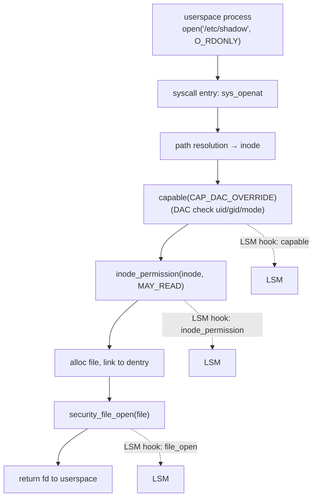
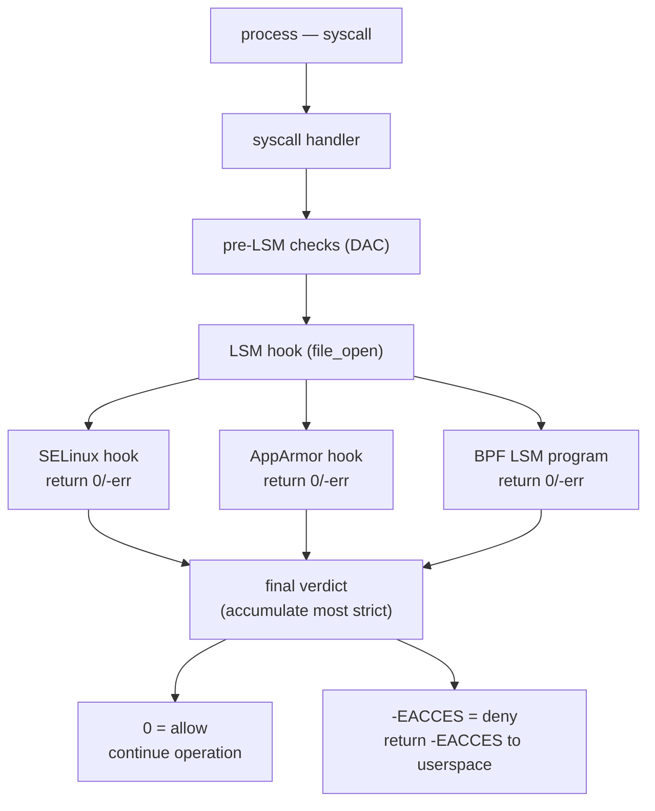
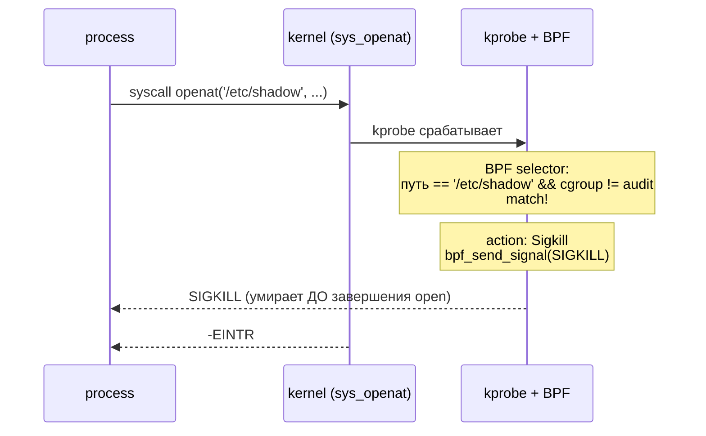
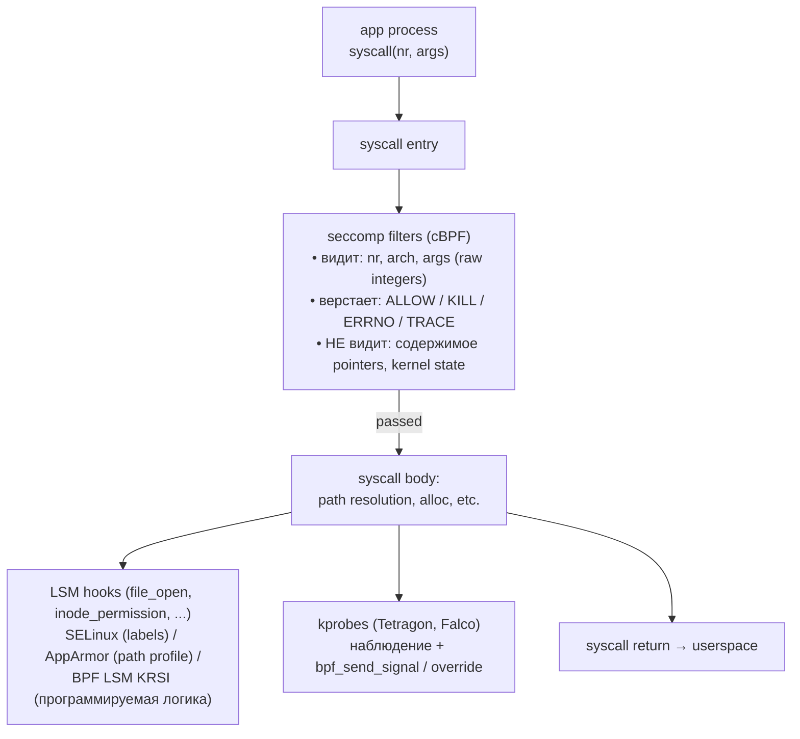
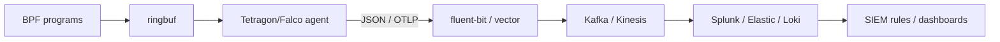

# eBPF для безопасности: LSM, KRSI, Tetragon, runtime defense

eBPF в безопасности решает две принципиально разные задачи. **Enforcement** — блокировать опасные операции
до того, как они произойдут: запретить `execve` подозрительного бинаря, отрезать `ptrace` к sensitive
процессу, отказать в `open` секрета. **Detection** (observability) — записывать всё подозрительное для
последующего расследования: кто открывал `/etc/shadow`, чьи процессы делают `mmap(PROT_EXEC)`, какой
container звонит в неизвестный IP. Раньше эти задачи решали разные инструменты, у каждого свои ограничения.

| Механизм | Что умел                      | Чего не хватало                                           |
|----------|-------------------------------|-----------------------------------------------------------|
| SELinux  | enforcement через LSM, mature | статичный policy (DSL), сложный аудит, дорогая разработка |
| AppArmor | enforcement по path           | path-based уязвим к bind mounts/symlink, без аргументов   |
| seccomp  | фильтр syscall в момент входа | только syscall, не видит kernel-объектов, не файла        |
| auditd   | детальный журнал событий      | дорогой (text-based), теряет события под нагрузкой        |

eBPF вместил всё в один runtime: динамический policy без перекомпиляции ядра, любой kernel hook
(не только syscall), общий verifier гарантирует, что security-программа сама не уронит ядро. Цена —
зависимость от свежего ядра (5.7+ для LSM, 5.8+ для ringbuf) и собственных проблем верификатора.

## LSM framework

**Linux Security Module** (LSM) — набор hook-точек, расставленных по всему ядру специально для security
modules. Каждый hook вызывается перед выполнением чувствительной операции: открытие файла, передача
сокета, создание процесса, проверка capability. Hook принимает контекст операции (объект, субъект,
запрашиваемые права) и возвращает verdict: `0` — операция разрешена, `-EACCES` (или другой `-errno`) —
отклонена.

К Linux 6.x в ядре около 250 LSM-хуков. Их декларации живут в `include/linux/lsm_hook_defs.h`:

```c
LSM_HOOK(int, 0, file_open,        struct file *file)
LSM_HOOK(int, 0, inode_permission, struct inode *inode, int mask)
LSM_HOOK(int, 0, socket_connect,   struct socket *sock,
                                   struct sockaddr *address, int addrlen)
LSM_HOOK(int, 0, bprm_check_security, struct linux_binprm *bprm)
LSM_HOOK(int, 0, capable,          const struct cred *cred,
                                   struct user_namespace *ns,
                                   int cap, unsigned int opts)
LSM_HOOK(int, 0, ptrace_access_check, struct task_struct *child,
                                      unsigned int mode)
LSM_HOOK(int, 0, kernel_load_data, enum kernel_load_data_id id, bool contents)
LSM_HOOK(int, 0, bpf,              int cmd, union bpf_attr *attr,
                                   unsigned int size)
/* … около 250 штук … */
```

Hook'и расставлены по всему ядру в позициях, где **уже разрешён DAC** (классические UNIX permissions),
но ещё не выполнено само действие. Это даёт MAC (mandatory access control) — даже root не пройдёт мимо
LSM hook'а, если security module его не пустит.



Семейства hooks по доменам:

| Домен    | Hook-функции                                   |
|----------|------------------------------------------------|
| file/fs  | file_open, inode_permission, inode_unlink, ... |
| network  | socket_connect, socket_bind, sk_alloc_security |
| process  | bprm_check_security, task_alloc, task_kill     |
| cred     | capable, cred_prepare, task_fix_setuid         |
| ptrace   | ptrace_access_check, ptrace_traceme            |
| kernel   | kernel_load_data, kernel_read_file, locked_down|
| bpf      | bpf, bpf_map, bpf_prog                         |

В ядре одновременно может быть зарегистрировано несколько LSM (с Linux 5.0 — **stacked LSMs**). Каждый
hook прогоняется через цепочку модулей; первый, кто вернул deny, останавливает дальнейшую обработку.
Существующие модули:

| LSM      | Подход                               | Где используется            |
|----------|--------------------------------------|-----------------------------|
| SELinux  | type enforcement по меткам контекста | RHEL, Fedora, Android       |
| AppArmor | path-based profiles                  | Ubuntu, SUSE                |
| Smack    | simple labels                        | Tizen, automotive           |
| Tomoyo   | path-based, learn-from-behavior      | embedded, нишевое           |
| Yama     | restricts ptrace                     | везде по умолчанию          |
| Landlock | unprivileged userspace sandbox       | Linux 5.13+, для приложений |
| **BPF**  | программы eBPF на LSM hooks          | KRSI, Tetragon              |

## BPF LSM (KRSI)

**KRSI** — Kernel Runtime Security Instrumentation, работа KP Singh в Google, попавшая в mainline
в Linux 5.7 (2020). KRSI — это просто BPF program type, который можно attach'ить к LSM hook'у.
Программа возвращает `0` (разрешить) или отрицательный `-errno` (отклонить); ядро доносит этот
verdict до hook'а ровно как от любого другого LSM.



Включение BPF LSM требует двух шагов: ядро собрано с `CONFIG_BPF_LSM=y` и параметр
`lsm=bpf,...,selinux` (или другой набор) передан в kernel cmdline. На Ubuntu 22.04+ и RHEL 9 BPF LSM
включён по умолчанию.

Программа объявляется через секцию `SEC("lsm/<hook_name>")`:

```c
#include <vmlinux.h>
#include <bpf/bpf_helpers.h>
#include <bpf/bpf_tracing.h>

char LICENSE[] SEC("license") = "GPL";

/* Запретить execve бинарей не из /usr/bin для процессов в cgroup id 12345 */
SEC("lsm/bprm_check_security")
int BPF_PROG(restrict_exec, struct linux_binprm *bprm, int ret)
{
    /* Если предыдущий LSM уже отклонил — пропускаем дальше */
    if (ret != 0)
        return ret;

    u64 cgid = bpf_get_current_cgroup_id();
    if (cgid != 12345)
        return 0;

    char path[256];
    bpf_probe_read_kernel_str(path, sizeof(path),
                               bprm->filename);

    /* startswith("/usr/bin/") */
    if (path[0] == '/' && path[1] == 'u' && path[2] == 's' &&
        path[3] == 'r' && path[4] == '/' && path[5] == 'b' &&
        path[6] == 'i' && path[7] == 'n' && path[8] == '/')
        return 0;

    return -EPERM;
}
```

Несколько свойств, на которые стоит обратить внимание:

- **`ret` как первый аргумент**: BPF LSM программам передаётся значение, накопленное предыдущими LSM
  в цепочке. Если кто-то уже отклонил — не нужно «оживлять» операцию (это в принципе невозможно
  — самый строгий verdict побеждает).
- **CO-RE доступ к `linux_binprm`**: через `vmlinux.h` структура читается так же, как любая kernel
  struct в tracing-программах.
- **verifier требует bounded loops**: проверки префикса пути написаны вручную; написать
  `strncmp(path, "/usr/bin/", 9)` не получится — verifier не пропустит без unroll'а или
  `bpf_loop()`.

### BPF LSM vs SELinux vs AppArmor

| Свойство          | SELinux               | AppArmor                 | BPF LSM                |
|-------------------|-----------------------|--------------------------|------------------------|
| Policy language   | type enforcement DSL  | path-based profile       | C → BPF bytecode       |
| Update без reload | `semodule -i` (live)  | `apparmor_parser` (live) | `bpftool prog load`    |
| Гранулярность     | per-context label     | per-path, per-binary     | программируемая        |
| Аргументы syscall | да, но через DSL      | ограниченно              | полный доступ          |
| Контекст процесса | label                 | profile name             | cgroup, ns, comm, env  |
| Зрелость          | 20+ лет, mature audit | 18+ лет                  | с 2020, развивается    |
| Аудит policy      | sealert, ausearch     | apparmor logs            | свой, через ringbuf    |
| Развёртывание     | distro-bundled        | distro-bundled           | свой loader / Tetragon |

SELinux и AppArmor выигрывают в **аудите policy**: их декларативный DSL можно проверить на полноту,
сравнить два профиля, доказать инварианты. BPF LSM выигрывает в **выразительности**: можно условно
блокировать только если родительский процесс — `bash`, только если cgroup label содержит «prod», только
если время суток между 02:00 и 06:00. И всё это меняется без перезагрузки и без перекомпиляции ядра.

В production эти подходы дополняют друг друга: SELinux/AppArmor — baseline OS hardening, BPF LSM —
сценарии, которых статический DSL не покрывает.

## Паттерны защиты на BPF LSM

### Process execution control

Запрет запуска нежелательных бинарей делается на `bprm_check_security` (вызывается из `execve` после
загрузки заголовков бинаря, но до передачи управления). Альтернатива — `file_open` на
`O_EXEC`/`MAP_EXEC`-маппинги, но `bprm_check_security` точнее: ловит именно execve, а не любое чтение
бинаря.

```c
SEC("lsm/bprm_check_security")
int BPF_PROG(deny_curl, struct linux_binprm *bprm, int ret)
{
    if (ret) return ret;
    char comm[16];
    bpf_probe_read_kernel_str(comm, sizeof(comm), bprm->filename);
    /* грубый чёрный список — для production используется hash от пути */
    if (comm[0]=='c' && comm[1]=='u' && comm[2]=='r' && comm[3]=='l')
        return -EPERM;
    return 0;
}
```

Defense-in-depth: тот же hook позволяет проверять подпись бинаря (через `kernel_read_file`) или
сравнивать его SHA256 с allowlist'ом, читая первые килобайты через `bpf_probe_read_kernel`.

### Filesystem access control

Hook `inode_permission` срабатывает на каждую проверку прав файла (read/write/exec). Здесь можно
блокировать чтение секретов из определённой cgroup, например запретить web-серверу читать `/etc/shadow`
даже если он каким-то образом получил CAP_DAC_OVERRIDE:

```c
SEC("lsm/inode_permission")
int BPF_PROG(block_shadow, struct inode *inode, int mask)
{
    /* интересует только запрос на чтение */
    if (!(mask & MAY_READ)) return 0;

    u64 cgid = bpf_get_current_cgroup_id();
    if (cgid != WEB_CGROUP_ID) return 0;

    /* сравнить inode с заранее известным inode '/etc/shadow' */
    if (inode->i_ino != shadow_ino) return 0;

    return -EACCES;
}
```

Сравнение по inode устойчиво к bind-mount и symlink-атакам, в отличие от AppArmor с его path-based
правилами. inode уникален в пределах filesystem.

### Network policy

Cgroup-bpf уже даёт inet socket-level policies (`BPF_CGROUP_INET_SOCK_CREATE`, `BPF_CGROUP_INET_CONNECT4`).
LSM hook `socket_connect` стоит чуть выше и видит больше контекста — task, cred, parent cgroup. Использовать
имеет смысл, когда policy решается не только адресом, но и историей процесса:

```c
SEC("lsm/socket_connect")
int BPF_PROG(restrict_egress, struct socket *sock,
             struct sockaddr *address, int addrlen)
{
    if (address->sa_family != AF_INET) return 0;
    struct sockaddr_in *sin = (struct sockaddr_in *)address;
    u32 daddr = bpf_ntohl(sin->sin_addr.s_addr);

    /* пример: процесс, запущенный из /tmp, не имеет права в интернет */
    /* (проверка origin тащит из map'ы, обновляемой на execve)        */
    if (proc_started_from_tmp() && !is_private_ip(daddr))
        return -ECONNREFUSED;
    return 0;
}
```

### Capability check override

LSM hook `capable` вызывается каждый раз, когда kernel-код проверяет capability. Возврат `-EPERM` из
BPF LSM == «capability отсутствует», даже если по `cred` она есть. Это даёт runtime drop отдельных
capabilities без необходимости перезапускать процесс:

```c
SEC("lsm/capable")
int BPF_PROG(no_sys_module, const struct cred *cred,
             struct user_namespace *ns, int cap, unsigned int opts)
{
    /* в production cgroup никто не должен грузить модули */
    if (in_prod_cgroup() && cap == CAP_SYS_MODULE)
        return -EPERM;
    return 0;
}
```

В отличие от capabilities-drop через `prctl(PR_CAPBSET_DROP)`, это работает на уже запущенном процессе.

### ptrace lockdown

`ptrace_access_check` срабатывает на каждую попытку attach к процессу. Стандартный Yama LSM уже ставит
базовые ограничения (`/proc/sys/kernel/yama/ptrace_scope`), но BPF позволяет точечный lockdown
sensitive процессов, например, защитить SSH-агент или browser content process от посторонних
debugger'ов:

```c
SEC("lsm/ptrace_access_check")
int BPF_PROG(protect_agent, struct task_struct *child, unsigned int mode)
{
    char comm[16];
    bpf_probe_read_kernel_str(comm, sizeof(comm), child->comm);
    if (comm[0]=='s' && comm[1]=='s' && comm[2]=='h' && comm[3]=='-' &&
        comm[4]=='a' && comm[5]=='g')
        return -EPERM;
    return 0;
}
```

### Module loading

Hook `kernel_load_data` (Linux 5.7+) вызывается при попытке загрузить kernel modules, firmware,
kexec-образы. Запрет загрузки modules в production-системе — стандартная hardening-практика:

```c
SEC("lsm/kernel_load_data")
int BPF_PROG(no_modules, enum kernel_load_data_id id, bool contents)
{
    if (id == LOADING_MODULE)
        return -EPERM;
    return 0;
}
```

Альтернатива (statically) — `kernel.modules_disabled=1` через sysctl, но это безвозвратное действие.
BPF позволяет временные исключения (например, разрешить на 30 секунд во время обновления).

## Tetragon

**Tetragon** — open-source security observability и enforcement, проект Isovalent/Cilium. Идея: дать
оператору декларативный язык policy (CRD в Kubernetes) и низкоуровневую runtime, которая фильтрует
события прямо в ядре через BPF и реагирует немедленно — SIGKILL подозрительному процессу, audit-запись,
сетевая отсечка.

```
                       Tetragon architecture

   Kubernetes API server
        │
        │ TracingPolicy CRD (YAML)
        ▼
   ┌─────────────────────────────────────────────────────────────┐
   │  Tetragon agent (Go, DaemonSet, host network)               │
   │                                                             │
   │  ┌────────────────┐    ┌───────────────────────────────┐    │
   │  │ policy parser  │ ──▶│  BPF program generator        │    │
   │  │ (YAML → spec)  │    │  • kprobes / LSM / tracepoints│    │
   │  └────────────────┘    │  • per-hook selectors         │    │
   │                        │  • action map (sigkill, log)  │    │
   │                        └──────────────┬────────────────┘    │
   │                                       │ libbpf load         │
   │                                       ▼                     │
   └───────────────────────────────────────┼─────────────────────┘
                                           │
   ═══════════════════════════════════════ │ ════ kernel boundary
                                           ▼
   ┌─────────────────────────────────────────────────────────────┐
   │  BPF programs attached to hooks                             │
   │                                                             │
   │  syscall ──▶ kprobe ──▶ selector match? ──▶ action          │
   │                              │                  │           │
   │                              │                  ├─ sigkill  │
   │                              │                  │  via      │
   │                              │                  │  bpf_send │
   │                              │                  │  _signal  │
   │                              │                  │           │
   │                              ▼                  ├─ override │
   │                          event → ringbuf        │  return   │
   │                                  │              │           │
   └──────────────────────────────────┼──────────────└─ log ─────┘
                                      │
                                      ▼
   ┌─────────────────────────────────────────────────────────────┐
   │  Tetragon agent (userspace, продолжение)                    │
   │                                                             │
   │  ringbuf reader → event enricher (pod/container metadata)   │
   │                          │                                  │
   │     ┌────────────────────┼────────────────────┐             │
   │     ▼                    ▼                    ▼             │
   │  tetra CLI         OpenTelemetry          gRPC API          │
   │  (stdout, JSON)    exporter → SIEM        для интеграций    │
   └─────────────────────────────────────────────────────────────┘
```

### TracingPolicy CRD

Policy декларируется YAML'ом. Один пример — отслеживать `sys_write` в файлы за пределами
`/var/log` и убивать процесс при попытке:

```yaml
apiVersion: cilium.io/v1alpha1
kind: TracingPolicy
metadata:
  name: write-monitor
spec:
  kprobes:
    - call: "sys_write"
      syscall: true
      args:
        - index: 0
          type: "fd"
        - index: 1
          type: "char_buf"
          sizeArgIndex: 3
        - index: 2
          type: "size_t"
      selectors:
        - matchPIDs:
            - operator: "NotIn"
              followForks: true
              values: [ 1 ]
          matchBinaries:
            - operator: "NotIn"
              values: [ "/usr/bin/log-writer" ]
          matchActions:
            - action: Sigkill
```

### In-kernel filtering

Главное архитектурное решение Tetragon: **селекторы выполняются в kernel-side BPF, до отправки события
в userspace**. Если процесс делает миллион `write`, но только сотня соответствует selector — userspace
видит только сто событий, не миллион. Это критично для production: альтернатива (отправить всё в user
agent, фильтровать там) ломает CPU при любой нагрузке.

Селекторы умеют сравнивать:

- `matchPIDs` — list of PIDs, optionally followForks
- `matchBinaries` — путь к бинарю (with prefix/postfix matching)
- `matchNamespaces` — PID/mount/net ns ID
- `matchCapabilities` — текущий effective set
- `matchArgs` — содержимое аргументов через operators (`Equal`, `Prefix`, `Postfix`, `Mask`, `SPort`,
  `DPort`, `SAddr`, `DAddr`, ...)
- `matchReturnArgs` — на возврате из функции

Compiler Tetragon переводит селекторы в цепочку BPF-инструкций, всё это работает прямо в kernel-side
программе.

### Real-time enforcement через bpf_send_signal

Helper `bpf_send_signal()` появился в Linux 5.3. Он позволяет BPF-программе отправить сигнал текущему
процессу. Tetragon использует его для немедленного убийства процесса прямо из kernel-side, без
round-trip в userspace:



Альтернативный action — `NotifyKiller` — отправляет событие в userspace agent, который убивает уже
оттуда. Используется, когда нужно сначала log'ировать с полным контекстом, потом убить.

### Production use cases

| Сценарий                    | Hook                            | Action                  |
|-----------------------------|---------------------------------|-------------------------|
| Container escape detection  | kprobe `__x64_sys_setns`        | Log + Sigkill           |
| Crypto miner detection      | tracepoint `sched_process_exec` | matchBinaries + Sigkill |
| Reverse shell от unknown    | LSM `socket_connect`            | matchArgs DAddr         |
| Read /etc/shadow            | kprobe `vfs_read` + matchArgs   | Sigkill                 |
| Modify SUID binary          | LSM `inode_setattr`             | Override -EPERM         |
| Supply chain (`curl \| sh`) | bprm_check + matchBinaries      | Log                     |
| Kernel module loading       | kprobe `do_init_module`         | Sigkill                 |

## Falco

**Falco** — другой популярный CNCF-проект (graduated), стартовал в Sysdig до того, как eBPF был
widely доступен. Раньше использовал **kernel module** (sysdig-probe) или ptrace-based driver; сейчас
основной вариант — eBPF probe (`falco-driver-loader` собирает или скачивает CO-RE BPF skeleton).

Архитектурное отличие от Tetragon — **DSL для правил**:

```yaml
- rule: Write below etc
  desc: an attempt to write to any file below /etc
  condition: >
    write_open_etc and
    not proc.name in (allowed_etc_writers) and
    not container.image.repository in (allowed_images)
  output: >
    File below /etc opened for writing (user=%user.name
    command=%proc.cmdline file=%fd.name)
  priority: WARNING
  tags: [ filesystem, mitre_persistence ]
```

Условие — boolean-выражение над набором заранее объявленных полей (`fd.name`, `proc.cmdline`,
`container.image`, ...). Falco-engine компилирует это в дерево предикатов, kernel-side BPF только
собирает события и шлёт в userspace; основная фильтрация — в Go-rule engine.

| Свойство          | Falco                           | Tetragon                        |
|-------------------|---------------------------------|---------------------------------|
| Origin            | Sysdig (2016)                   | Isovalent / Cilium (2022)       |
| Driver            | eBPF (CO-RE), kmod, ptrace      | eBPF only                       |
| Rules язык        | YAML с DSL-выражениями          | YAML с selectors                |
| Где фильтруется   | kernel + user-space rule engine | преимущественно kernel-side     |
| Enforcement       | через plugin (внешний)          | встроенное (Sigkill, Override)  |
| Kubernetes-native | через ConfigMap                 | CRD, поддержка policy lifecycle |
| CNCF status       | graduated                       | incubating                      |
| Типичный use case | detection + alerting            | detection + active enforcement  |

Sysdig (commercial) построен на том же core, добавляет UI, agent management, threat intelligence feed.

## Сравнение enforcement моделей



| Механизм    | Уровень               | Programmable      | Гранулярность    | Overhead     | Use case                 |
|-------------|-----------------------|-------------------|------------------|--------------|--------------------------|
| SELinux     | LSM (MAC)             | DSL (TE/RBAC)     | per-context      | низкий       | OS hardening, MLS        |
| AppArmor    | LSM (MAC)             | path-based DSL    | per-profile      | низкий       | sandboxing apps          |
| seccomp-bpf | syscall filter        | cBPF              | per-syscall+args | очень низкий | sandbox (Docker, Chrome) |
| Landlock    | LSM (DAC ext)         | API из userspace  | per-FS-path      | низкий       | self-restricting app     |
| BPF LSM     | LSM (MAC)             | C → BPF           | произвольная     | низкий       | dynamic policy           |
| Falco       | observability         | DSL (Falco rules) | произвольная     | низкий       | runtime detection        |
| Tetragon    | observability+enforce | YAML selectors    | произвольная     | низкий       | detection + sigkill      |
| auditd      | kaudit                | rules DSL         | per-event        | **высокий**  | compliance logging       |

auditd — единственный с серьёзным overhead'ом: всё пишется text-based через netlink в один user-process
(`auditd`), который сериализует в файл; под нагрузкой теряет события. eBPF-based решения используют
ringbuf и per-CPU данные, поэтому в десятки раз дешевле.

## Атаки на eBPF

BPF verifier — это формальная проверка ~25k строк C-кода. За эти годы найдены десятки CVE, позволявших
обмануть проверку и выполнить unsafe BPF от непривилегированного пользователя.

| CVE            | Год  | Суть                                               |
|----------------|------|----------------------------------------------------|
| CVE-2020-8835  | 2020 | bounds tracking flaw → arbitrary read/write        |
| CVE-2021-3490  | 2021 | 32-bit ALU bounds tracking → escalation to root    |
| CVE-2021-31440 | 2021 | sign-extension bug в 32-bit truncation             |
| CVE-2022-23222 | 2022 | pointer arithmetic verifier bypass                 |
| CVE-2024-26581 | 2024 | nft_set с element flags позволял доступ за границы |

Паттерн один и тот же: verifier неправильно отслеживает диапазон какого-то регистра, BPF получает
возможность построить указатель за границу и читать/писать произвольную kernel memory. Поскольку BPF
JIT'ится в native-код, эксплуатация — это просто local privilege escalation.

Дополнительные классы угроз:

- **Type confusion via BTF**: некорректный BTF может ввести verifier в заблуждение о типе поля.
- **Side channels через JIT'нутый код**: cache timing атаки, теоретически Spectre v2 на JIT-pad.
- **Helper bugs**: `bpf_probe_read` исторически не проверял адресное пространство (kernel vs user),
  что давало info leak.

### Mitigations

| Защита                               | Что делает                                               |
|--------------------------------------|----------------------------------------------------------|
| `kernel.unprivileged_bpf_disabled=1` | запретить BPF без CAP_BPF (по умолчанию с Linux 5.16)    |
| `CAP_BPF` split (Linux 5.8+)         | разделение CAP_SYS_ADMIN на узкие capabilities           |
| BPF lockdown mode                    | в lockdown integrity mode часть BPF-helpers отключена    |
| Spectre v1/v2 mitigations в JIT      | speculative load hardening, retpolines в jit'нутом коде  |
| BPF Token (Linux 6.9+)               | per-namespace токены для частичного BPF в user namespace |

## Privileges и hardening

До Linux 5.8 для загрузки любой BPF-программы требовался `CAP_SYS_ADMIN` — самый широкий capability,
почти эквивалент root. Это блокировало любые попытки запустить unprivileged BPF в контейнерах.

С 5.8 capability разделена:

```
  CAP_SYS_ADMIN  ──┬────────────────────────────────────┐
                   │ старая семантика: всё BPF доступно │
                   │                                    │
  CAP_BPF          ──── загрузка programs, MAP_CREATE   │
  CAP_PERFMON      ──── kprobe, tracepoint, perf_event  │── комбинации
  CAP_NET_ADMIN    ──── network programs (XDP, TC, ...) │   дают полный
                                                        │   набор
```

Хорошая практика для security-агентов:

- Контейнер Tetragon/Falco запускается с `CAP_BPF, CAP_PERFMON, CAP_SYS_RESOURCE` и `CAP_SYS_PTRACE`
  (для чтения `/proc/$pid/ns/*`).
- `CAP_NET_ADMIN` нужен только если агент устанавливает XDP/TC programs.
- `CAP_SYS_ADMIN` нужен для cgroup-bpf attach.

Дополнительный switch — `/proc/sys/kernel/unprivileged_bpf_disabled`:

| Значение | Поведение                                                               |
|----------|-------------------------------------------------------------------------|
| 0        | unprivileged user может socket-filter (legacy)                          |
| 1        | требуется CAP_BPF/CAP_NET_ADMIN для всего (recommended, default с 5.16) |
| 2        | то же, что 1, но read-only — нельзя вернуть в 0 до reboot               |

## Production deployment

### DaemonSet pattern

Tetragon, Falco, Cilium, Pixie — все следуют одной модели: **privileged DaemonSet на каждом ноде
Kubernetes-кластера**.

```
  Kubernetes node                                Kubernetes node
  ┌─────────────────────────┐                    ┌─────────────────────────┐
  │  ┌──────────────────┐   │                    │  ┌──────────────────┐   │
  │  │ Tetragon Pod     │   │                    │  │ Tetragon Pod     │   │
  │  │ (privileged,     │   │                    │  │                  │   │
  │  │  host network,   │   │                    │  │                  │   │
  │  │  CAP_BPF,        │   │                    │  │                  │   │
  │  │  CAP_PERFMON)    │   │                    │  │                  │   │
  │  └────────┬─────────┘   │                    │  └────────┬─────────┘   │
  │           │             │                    │           │             │
  │           │ load BPF    │                    │           │             │
  │           ▼             │                    │           ▼             │
  │  ┌──────────────────┐   │                    │  ┌──────────────────┐   │
  │  │     kernel       │   │                    │  │     kernel       │   │
  │  │  BPF programs    │   │                    │  │  BPF programs    │   │
  │  │  attached        │   │                    │  │  attached        │   │
  │  └──────────────────┘   │                    │  └──────────────────┘   │
  │  ┌──┬──┬──┬──┐          │                    │  ┌──┬──┬──┬──┐          │
  │  │P │P │P │P │ workload │                    │  │P │P │P │P │          │
  │  └──┴──┴──┴──┘          │                    │  └──┴──┴──┴──┘          │
  └─────────────────────────┘                    └─────────────────────────┘
                │                                       │
                └───────────────┬───────────────────────┘
                                ▼
                         CRD policy
                         (TracingPolicy)
                         applied cluster-wide
```

В отличие от service mesh (Istio, Linkerd), eBPF-based security **sidecar-less**: один Pod на ноду,
видит весь kernel-side трафик. Это экономит сотни/тысячи sidecar-контейнеров в больших кластерах.

### Staged rollout

Включение enforcement policy на проде сразу — большой риск false-positive (легитимный процесс будет
убит). Стандартный путь:

1. **Audit-only**: action = `Log` или `NotifyKiller`. Собрать события за неделю-две.
2. **Анализ false positives**: какие легитимные сценарии триггерят policy? Уточнить selectors.
3. **Canary enforcement**: enable Sigkill в одном namespace или на одной cgroup.
4. **Full enforcement**: после стабильной работы canary.

Tetragon поддерживает action `Notify` отдельно от `Sigkill` именно для этого.

### Интеграция с SIEM

eBPF security агенты порождают много событий (десятки тысяч в секунду на нагруженном ноде).
Стандартный pipeline:



Перегружать SIEM сырыми event'ами невыгодно — лучше агрегировать на уровне агента (counts, hist) и
посылать наверх только аномалии и явные security events.

## Подводные камни

**verifier для LSM-программ строже**, чем для tracing. Например, доступ к `task_struct` через
`bpf_get_current_task_btf()` требует `CAP_PERFMON` и BTF-aware verifier; иначе придётся читать через
`bpf_probe_read_kernel`.

**Stacked verdict**: BPF LSM не последний LSM в цепочке. Если SELinux уже сказал «deny», BPF
не сможет «allow» (kernel берёт самый строгий verdict). Это означает, что BPF LSM **не может разрешить
то, что блокирует другой LSM** — только запретить дополнительно.

**bpf_send_signal на atomic-context**: helper нельзя вызывать из BPF-программы, исполняющейся
в interrupt-handler (kprobes на irq-функциях, например). Проверять перед использованием — есть
`bpf_send_signal_thread()` (Linux 5.5+), у которого таких ограничений меньше.

**Cgroup-id stability**: `bpf_get_current_cgroup_id()` возвращает inode-id cgroup; пересоздание
cgroup (например, после restart Pod'а) даёт новый id. Хранить id в long-lived map'ах опасно — лучше
сравнивать pod label через user-space agent.

**LSM hook позже DAC**: если процесс не имеет прав по классической UNIX-модели, до BPF LSM hook
не дойдёт — операция уже отклонена. Это значит, что BPF LSM не может «разрешить» root'у то, чего
запретили mode bits.

**BPF в user namespace**: до недавнего времени любой BPF в user-ns был невозможен. С Linux 6.9
появился **BPF Token** — namespace-локальная capability, позволяющая загружать ограниченный набор
BPF programs внутри unprivileged user-ns. Tetragon пока этим не пользуется.

**Накладные на горячих hook'ах**: LSM hook `inode_permission` вызывается тысячи раз в секунду на
любой filesystem-нагрузке. Большая BPF-программа на этом hook'е замедлит всю систему. Для horizontal
checks (cgroup-id, comm) overhead 50–200 нс приемлем; для path-resolution или map-lookup'ов с
большими keys — нет.

## Связанные темы

- [eBPF: основы](foundations.md) — VM, verifier, maps, helpers — фундамент для security программ
- [seccomp](../isolation/seccomp.md) — старый syscall-only filter, дополняющий BPF LSM
- [Linux namespaces](../isolation/namespaces.md) — изоляция, на которой строится container security
- [cgroups v2](../isolation/cgroups.md) — cgroup-bpf programs как соседний механизм
- [Контейнеры изнутри](../isolation/containers_internals.md) — где работают Tetragon/Falco
- [Capabilities](../processes/process_priority_affinity_capabilities.md) — CAP_BPF, CAP_PERFMON
- [Системные вызовы](../assembler_and_processor/system_calls_introduction.md) — то, что фильтрует seccomp

## Источники

- [BPF LSM kernel docs](https://www.kernel.org/doc/html/latest/bpf/prog_lsm.html)
- KP Singh, «Kernel Runtime Security Instrumentation» (Linux Plumbers 2019)
- [Tetragon documentation](https://tetragon.io/)
- [Falco project](https://falco.org/)
- [Linux Security Modules API](https://www.kernel.org/doc/html/latest/security/lsm.html)
- `include/linux/lsm_hook_defs.h` — список всех hook'ов в kernel-tree
- [Cilium eBPF security guide](https://docs.cilium.io/en/stable/security/)
- Brendan Gregg, «BPF Performance Tools» (Addison-Wesley, 2019) — глава про security
- [Awesome eBPF security](https://github.com/zoidyzoidzoid/awesome-ebpf#security) — список инструментов
