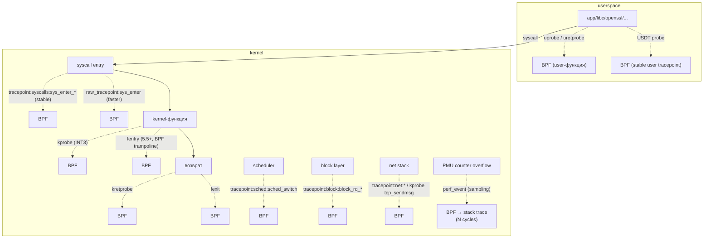
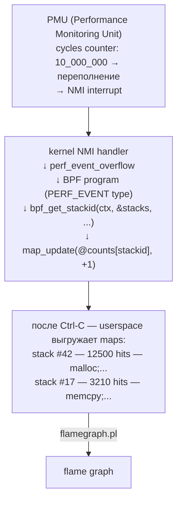
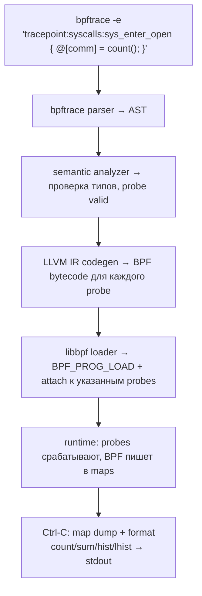
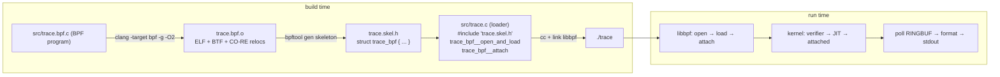

# eBPF tracing: наблюдаемость без накладных расходов

Что делает ядро прямо сейчас? Какой syscall зависает на 30 миллисекунд? Почему процесс блокируется именно на этом
mutex'е? Почему disk I/O стал медленнее в два раза после деплоя? Эти вопросы — основа observability на уровне ОС, и
исторический инструментарий отвечал на них плохо.

`ptrace` останавливает целевой процесс на каждом событии, тратя десятки переключений контекста на один syscall.
Замедление 10×–100× — норма, для краулера или сетевого сервера это значит «не использовать в продакшене». `strace`,
`ltrace`, gdb-watchpoints — всё это поверх ptrace со всеми его болями. `ftrace` быстрый, но статичен: набор
tracepoint'ов
фиксирован в исходниках ядра, агрегация в userspace, фильтрация примитивна. `perf` собирает sample'ы через PMU, но
обработка происходит в userspace, и при тысячах событий в секунду overhead становится заметным.

eBPF tracing переворачивает модель. BPF-программа компилируется в безопасный байт-код, грузится в ядро, прикрепляется
к **attach point** (kprobe, tracepoint, uprobe, perf_event), и **внутри ядра** считает, фильтрует, агрегирует. В
userspace выгружаются уже агрегированные данные — гистограмма латентности, top процессов по syscall'ам, стеки самых
горячих функций. Overhead — единицы процентов на типичной нагрузке вместо 10× у ptrace, и при этом доступна семантика,
которой у ftrace никогда не было: stack walking, USDT, динамический набор фильтров, lockless ringbuf наружу.

## Attach points: где можно прикрепить BPF

Attach point — это место в коде (kernel или user), где kernel умеет дернуть зарегистрированную BPF-программу. Каждый тип
дает свой контекст (`ctx`), свой набор доступных helpers и свои гарантии стабильности.



### kprobe / kretprobe

Динамическая привязка к **любой** функции ядра по символу из `/proc/kallsyms`. Реализация — тот же INT3 (опкод 0xCC),
который gdb ставит для breakpoint'ов: ядро заменяет первый байт инструкции функции на INT3, при срабатывании trap'а
вызывает kprobe handler, который дёргает BPF-программу, потом эмулирует оригинальную инструкцию и продолжает.
kretprobe устроен похитрее — kernel подменяет return address на адрес trampoline'а, который выполнит BPF после
завершения функции и вернётся куда нужно.

Плюсы:

- Никаких изменений в kernel source — можно цеплять что угодно
- Доступно на любом ядре с `CONFIG_KPROBES=y` (включён почти везде)
- Захватывает все вызовы функции, не sampling

Минусы:

- Имена функций — это **внутренний API ядра**, не стабильный. Переименовали `__x64_sys_open` → `do_sys_openat2` —
  программа молча перестала собирать данные
- Overhead ~100 нс на срабатывание из-за trap-механизма
- Inlined-функции и оптимизированные хвостовые вызовы недоступны (компилятор их растворил)

### tracepoint

Статически объявленные точки в исходниках ядра. Добавляются разработчиками через макрос `TRACE_EVENT(...)` и считаются
**стабильным ABI** — ломать tracepoint между версиями ядра не положено. Полный список — в
`/sys/kernel/debug/tracing/events/`:

```
/sys/kernel/debug/tracing/events/
├── syscalls/
│   ├── sys_enter_openat/    ← BPF может прицепиться сюда
│   └── sys_exit_openat/
├── sched/
│   ├── sched_switch/        ← переключение контекста
│   └── sched_wakeup/
├── block/
│   ├── block_rq_issue/      ← блочный I/O ушёл на устройство
│   └── block_rq_complete/   ← вернулся
└── net/, tcp/, irq/, ...
```

При срабатывании tracepoint'а kernel передаёт BPF-программе структуру с уже распарсенными аргументами —
`args->filename`, `args->count` — а не голый `pt_regs`. Это и стабильнее, и удобнее. Production-инструменты должны
использовать tracepoint везде, где он есть.

### raw_tracepoint

То же самое место в ядре, но без преобразования аргументов в «стабильный» формат. Контекст — голые kernel-структуры
(`struct task_struct *`, `struct sock *`), которые нужно читать через `BPF_CORE_READ`. Чуть быстрее (нет копирования
аргументов), значительно опаснее (структуры меняются между версиями ядра — спасает только CO-RE).

### uprobe / uretprobe

То же INT3-trick, но в `.text` пользовательского процесса. Kernel читает байт из mmap'нутого исполняемого региона,
запоминает оригинал, пишет 0xCC. При срабатывании trap'а ядро видит, что адрес принадлежит uprobe, и вызывает
BPF-программу. uretprobe ставится через подмену return address на трамплин в `vsyscall`-области процесса.

```
uprobe на libc:malloc:

  до:                                после uprobe install:
  ┌───────────────────────┐          ┌───────────────────────┐
  │ libc.so:malloc:       │          │ libc.so:malloc:       │
  │  push %rbp       55   │          │  int3            CC   │  ← подменили
  │  mov  %rsp,%rbp 48 89 │          │  ?                ??  │
  │  ...                  │          │  ...                  │
  └───────────────────────┘          └───────┬───────────────┘
                                             │ trap
                                             ▼
                                     ┌───────────────────────┐
                                     │ kernel uprobe handler │
                                     │  → BPF program        │
                                     │  → эмулирует push %rbp│
                                     │  → возврат в +1       │
                                     └───────────────────────┘
```

Можно цеплять любую функцию libc, libssl, libpthread, любого собственного бинаря. Pixie через uprobe на
`SSL_read`/`SSL_write` читает HTTPS-трафик до шифрования, без какой-либо инструментации приложения.

### USDT (User Statically-Defined Tracing)

Стабильные user tracepoint'ы, явно добавленные в код приложения через макрос `DTRACE_PROBE` (исторически из Solaris
DTrace) или `SDT_PROBE` (systemd-style). Компилятор кладёт в ELF особую секцию `.note.stapsdt` с именем provider'а,
именем probe'а, форматом аргументов. BPF цепляется по имени `usdt:provider:probe`, а не по адресу функции.

```c
#include <sys/sdt.h>
void process_request(int id, const char *url) {
    DTRACE_PROBE2(myapp, request_start, id, url);   // <── stable tracepoint
    // ... обработка ...
    DTRACE_PROBE1(myapp, request_done, id);
}
```

В коде это превращается в `nop`-инструкцию (zero overhead, если не трассируется) + запись в `.note.stapsdt`. Когда BPF
прицепляется, kernel заменяет `nop` на INT3 — механизм тот же, что у uprobe.

PostgreSQL, Python (CPython), Node.js, MySQL, Ruby, Java (через JVMTI) — всё это поставляется с USDT. Это даёт
**стабильный API трассировки приложения**: имена функций можно переименовывать, USDT-имена нет.

### perf_event

Привязка не к точке в коде, а к **переполнению PMU-счётчика**. Аппаратный счётчик (cycles, instructions, cache-misses,
LLC-references) настраивается через `perf_event_open` так, чтобы при каждых N событиях генерировать NMI. В
NMI-обработчике
вызывается BPF-программа с текущим `pt_regs` процесса, и она обычно делает `bpf_get_stackid()` — захватывает стек,
кладёт
в `STACK_TRACE` map.



Так работают Parca, Pyroscope, `perf record -e cycles -- ...`. На 99 Hz overhead — порядка 1% даже на загруженном
сервере, потому что вся обработка происходит in-kernel: stack walk + hash + atomic increment, без exit'а в userspace на
каждое событие.

### fentry / fexit (BPF trampoline)

Появились в Linux 5.5. Заменяют kprobe для типичной задачи «прицепить программу на вход/выход функции», но без INT3:
kernel при загрузке BPF генерирует крошечный JIT'нутый trampoline, который встраивается в пролог функции через
`ftrace`-механизм (5-байтный nop, заранее зарезервированный компилятором `-pg`). Trampoline вызывает BPF-программу с
типизированным контекстом (реальные аргументы функции, известные через BTF) и идёт дальше.

| Свойство          | kprobe                     | fentry/fexit               |
|-------------------|----------------------------|----------------------------|
| Mechanism         | INT3 trap                  | inline call в trampoline   |
| Overhead          | ~100 нс                    | ~30–40 нс (2–3× быстрее)   |
| Аргументы         | `pt_regs *`, ручной разбор | типизированные через BTF   |
| Доступность       | Linux 2.6.9+               | Linux 5.5+                 |
| Symbol resolution | `/proc/kallsyms`           | через BTF (CO-RE-friendly) |

Новый код пишут на fentry, kprobe остаётся для совместимости со старыми ядрами.

### Сравнение всех типов

| Probe          | Стабильность ABI      | Overhead     | Scope     | Когда выбирать              |
|----------------|-----------------------|--------------|-----------|-----------------------------|
| kprobe         | низкая                | ~100 нс      | kernel    | если нет tracepoint'а       |
| kretprobe      | низкая                | ~150 нс      | kernel    | возврат kernel-функции      |
| tracepoint     | высокая               | ~30 нс       | kernel    | первый выбор для kernel     |
| raw_tracepoint | средняя (нужен CO-RE) | ~20 нс       | kernel    | высокочастотные события     |
| uprobe         | низкая                | ~1–2 µs      | userspace | трассировка library-функций |
| uretprobe      | низкая                | ~1–2 µs      | userspace | возврат user-функции        |
| USDT           | высокая               | ~1 µs        | userspace | трассировка приложения      |
| perf_event     | стабильна (PMU API)   | sample-based | весь CPU  | profiling, flame graphs     |
| fentry/fexit   | средняя (через BTF)   | ~30 нс       | kernel    | новый production-tooling    |

## Helpers для tracing

Helpers — функции, экспортированные ядром именно для BPF (см. [foundations.md](foundations.md)). Подмножество,
актуальное для трассировки:

| Helper                                  | Что возвращает / делает                                   |
|-----------------------------------------|-----------------------------------------------------------|
| `bpf_get_current_pid_tgid()`            | `(tgid << 32) \| pid` текущей задачи                      |
| `bpf_get_current_uid_gid()`             | `(gid << 32) \| uid` текущей задачи                       |
| `bpf_get_current_comm(buf, size)`       | имя процесса (`comm`), 16 байт макс                       |
| `bpf_get_current_task()`                | `struct task_struct *` (для глубокого чтения через BTF)   |
| `bpf_ktime_get_ns()`                    | монотонное время в наносекундах                           |
| `bpf_ktime_get_boot_ns()`               | то же, но включает время сна                              |
| `bpf_probe_read_kernel(dst, sz, src)`   | безопасное копирование из kernel-памяти                   |
| `bpf_probe_read_user(dst, sz, src)`     | безопасное копирование из user-памяти tracee'а            |
| `bpf_probe_read_user_str(dst, sz, src)` | то же, но строка с NUL-терминатором                       |
| `bpf_get_stackid(ctx, map, flags)`      | капчурит стек, возвращает ID для STACK_TRACE map          |
| `bpf_get_stack(ctx, buf, sz, flags)`    | капчурит стек прямо в буфер                               |
| `bpf_perf_event_output(ctx, map, ...)`  | отправляет event через PERF_EVENT_ARRAY                   |
| `bpf_ringbuf_output(map, data, sz, f)`  | отправляет event в RINGBUF (copy)                         |
| `bpf_ringbuf_reserve` / `submit`        | zero-copy запись в RINGBUF (reserve → fill → submit)      |
| `bpf_get_ns_current_pid_tgid(...)`      | PID внутри указанного PID-namespace (для container-aware) |

`bpf_probe_read_*` — единственный безопасный способ прочитать память. Прямой dereference указателя verifier'ом
отклоняется: kernel-структуры могут оказаться невалидными (race с освобождением), user-память — невалидной (страница не
смаппена). Helper делает access с обработкой page fault'а и возвращает -EFAULT вместо oops'а.

## Maps для tracing

Maps — это то место, где живёт состояние между вызовами BPF-программы и где userspace его потом читает. Для трассировки
есть несколько типичных паттернов.

### Агрегация через HASH

Самый частый кейс. Key — что считаем (PID, comm, syscall_nr), value — счётчик/сумма.

```c
struct {
    __uint(type, BPF_MAP_TYPE_HASH);
    __type(key, u32);          // pid
    __type(value, u64);         // count
    __uint(max_entries, 10240);
} syscalls_by_pid SEC(".maps");

SEC("tracepoint/raw_syscalls/sys_enter")
int count_syscalls(void *ctx) {
    u32 pid = bpf_get_current_pid_tgid() >> 32;
    u64 *cnt = bpf_map_lookup_elem(&syscalls_by_pid, &pid);
    if (cnt) __sync_fetch_and_add(cnt, 1);
    else {
        u64 one = 1;
        bpf_map_update_elem(&syscalls_by_pid, &pid, &one, BPF_ANY);
    }
    return 0;
}
```

### PERCPU_HASH / PERCPU_ARRAY

То же самое, но per-CPU копия. Нет contention, не нужны атомики, в userspace массив суммируется.

```c
struct {
    __uint(type, BPF_MAP_TYPE_PERCPU_HASH);
    __type(key, u32);
    __type(value, u64);
    __uint(max_entries, 10240);
} counts SEC(".maps");

// в hot path:
u64 *cnt = bpf_map_lookup_elem(&counts, &pid);
if (cnt) (*cnt)++;   // не atomic — мы единственные на этом CPU
```

### Гистограммы

Power-of-2 buckets через HASH с ключом `log2(value)`:

```
@latency_ns = hist(nsecs - @start[tid]);

в userspace bpftrace выводит:
  [256, 512)    23 |@                              |
  [512, 1K)    187 |@@@@@@@@@@@                    |
  [1K, 2K)     412 |@@@@@@@@@@@@@@@@@@@@@@@@@@@    |
  [2K, 4K)     891 |@@@@@@@@@@@@@@@@@@@@@@@@@@@@@@@| ← peak
  [4K, 8K)     203 |@@@@@@@@@@@@                   |
  [8K, 16K)     34 |@@                             |
```

bpftrace и bcc делают это автоматически через `hist()` / `BPF_HISTOGRAM`. Под капотом — обычный HASH с
`log2(value)` как ключом.

### LRU_HASH

HASH с автоматическим вытеснением старых записей при заполнении. Незаменим для трассировок «соответствие
syscall-enter ↔ syscall-exit»: ключ — TID, value — timestamp начала. Если процесс умер посреди syscall, запись
сама вытеснится, а не съест всю map'у.

### STACK_TRACE

Хранит стеки по ID, который выдал `bpf_get_stackid`. Используется в паре с другой map (`HASH<stackid, count>`):

```
HASH<stackid, count>:                  STACK_TRACE<stackid, stack[127]>:
┌──────┬────────┐                      ┌──────┬─────────────────────────┐
│  42  │ 12500  │ ─────────────────▶   │  42  │ malloc                  │
│  17  │  3210  │                      │      │ my_func                 │
│  88  │   910  │                      │      │ main                    │
└──────┴────────┘                      │      │ __libc_start_main       │
                                       ├──────┼─────────────────────────┤
                                       │  17  │ memcpy                  │
                                       │      │ copy_buffer             │
                                       │      │ ...                     │
                                       └──────┴─────────────────────────┘
```

### RINGBUF и PERF_EVENT_ARRAY

Когда нужен **поток событий**, а не агрегация — каждое срабатывание probe должно дойти до userspace как самостоятельная
запись. Здесь два варианта:

```mermaid
flowchart TB
    KE["kernel event<br/>(kprobe / tracepoint / uprobe / perf_event)"]
    BP["BPF program<br/>• bpf_get_current_pid_tgid()<br/>• bpf_probe_read_user_str(buf, &args->path)<br/>• filter: if (uid != target) return 0"]
    HM["HASH / PERCPU<br/>@count[pid]++<br/>@hist = hist(d)"]
    RB["RINGBUF (5.8+)<br/>reserve → fill → submit<br/>(lock-free)"]
    UL["userspace loader (libbpf / bcc / bpftrace)<br/>• map_dump → format → stdout<br/>• ringbuf__poll → callback на каждое event"]
    KE --> BP
    BP -->|агрегация| HM
    BP -->|событие| RB
    HM -->|периодический pull| UL
    RB -->|push (epoll-able)| UL
```

| Свойство           | PERF_EVENT_ARRAY               | RINGBUF                         |
|--------------------|--------------------------------|---------------------------------|
| Топология          | per-CPU ring                   | один общий ring                 |
| Allocation         | copy через `perf_event_output` | reserve/fill/submit (zero-copy) |
| Сохранение порядка | нет (между CPU теряется)       | да                              |
| Spinlock           | нет (per-CPU)                  | да (kernel-side)                |
| Доступен с         | всегда                         | Linux 5.8                       |

RINGBUF — выбор по умолчанию для нового кода. PERF_EVENT_ARRAY остаётся в legacy bcc-инструментах и там, где нужна
per-CPU топология для совместимости с perf-tools.

## bpftrace: DSL для одноразовых задач

Писать BPF на C через libbpf — много кода: ELF-скелет, loader, attach, map polling, форматирование. Для one-shot
задач это перебор. bpftrace — awk-подобный язык, который компилирует одностроки в BPF-байт-код через LLVM и сам
управляет maps/probes/выводом.



### Probe types

| Префикс         | Что обозначает                                           |
|-----------------|----------------------------------------------------------|
| `kprobe:`       | вход в kernel-функцию                                    |
| `kretprobe:`    | выход из kernel-функции                                  |
| `tracepoint:`   | tracepoint в формате `category:event`                    |
| `uprobe:`       | вход в user-функцию (`uprobe:/usr/lib/libc.so.6:malloc`) |
| `uretprobe:`    | выход из user-функции                                    |
| `usdt:`         | USDT-probe (`usdt:/usr/bin/postgres:transaction__start`) |
| `profile:hz:99` | sampling profiler на каждом CPU 99 раз/сек               |
| `interval:s:1`  | таймер раз в секунду (для печати агрегатов)              |
| `software:`     | software event (page faults, context switches)           |
| `hardware:`     | hardware event (cache misses, branch misses)             |
| `BEGIN`/`END`   | один раз при старте/завершении                           |

### Встроенные переменные

| Переменная    | Значение                                             |
|---------------|------------------------------------------------------|
| `pid`         | PID текущего процесса                                |
| `tid`         | TID текущего потока                                  |
| `uid`, `gid`  | UID, GID                                             |
| `comm`        | имя процесса (16 байт)                               |
| `cpu`         | номер CPU                                            |
| `nsecs`       | монотонное время в наносекундах                      |
| `arg0..argN`  | аргументы probe'а (для kprobe — из `pt_regs`)        |
| `args->field` | аргументы tracepoint'а (типизированные)              |
| `retval`      | возвращаемое значение (только в kretprobe/uretprobe) |
| `kstack`      | kernel stack                                         |
| `ustack`      | user stack                                           |
| `func`        | имя текущей probe-функции                            |

### Встроенные функции

| Функция                  | Делает                                                 |
|--------------------------|--------------------------------------------------------|
| `count()`                | счётчик, агрегируется в map                            |
| `sum(v)`                 | сумма значений                                         |
| `avg(v)`                 | среднее                                                |
| `min(v)`, `max(v)`       | минимум/максимум                                       |
| `hist(v)`                | power-of-2 histogram                                   |
| `lhist(v, lo, hi, step)` | linear histogram                                       |
| `stats(v)`               | count + avg + min + max + stddev                       |
| `str(addr)`              | прочитать C-строку из памяти                           |
| `printf(fmt, ...)`       | форматированный вывод (асинхронный, через perf buffer) |
| `time(fmt)`              | текущее время                                          |
| `kstack`, `ustack`       | захват стека                                           |
| `delete(@map[k])`        | удалить ключ из map                                    |
| `clear(@map)`            | обнулить map                                           |
| `exit()`                 | завершить программу                                    |

### One-liner'ы

```bash
# Топ процессов по числу read()
bpftrace -e 'kprobe:vfs_read { @[comm] = count(); }'

# Кто что открывает
bpftrace -e 'tracepoint:syscalls:sys_enter_openat {
               printf("%-16s %s\n", comm, str(args->filename));
             }'

# Распределение размеров read()
bpftrace -e 'tracepoint:syscalls:sys_enter_read { @ = hist(args->count); }'

# Кто шлёт SIGKILL и кому
bpftrace -e 'tracepoint:syscalls:sys_enter_kill /args->sig == 9/ {
               printf("%s (%d) -> kill -9 %d\n", comm, pid, args->pid);
             }'

# Подсчёт TCP-соединений по dest-port
bpftrace -e 'kprobe:tcp_connect { @[arg1] = count(); }'

# Топ файлов по количеству открытий (за весь сеанс)
bpftrace -e 'tracepoint:syscalls:sys_enter_openat {
               @[str(args->filename)] = count();
             }'

# CPU-profile (flame graph data) — каждые 99 Hz берём ustack
bpftrace -e 'profile:hz:99 { @[ustack] = count(); }'

# Off-CPU time per process (сколько времени процессы спят)
bpftrace -e 'kprobe:finish_task_switch { @start[tid] = nsecs; }
             kretprobe:schedule /@start[tid]/ {
               @offcpu_us[comm] = sum((nsecs - @start[tid]) / 1000);
               delete(@start[tid]);
             }'

# Histograms размеров malloc (libc)
bpftrace -e 'uprobe:/lib/x86_64-linux-gnu/libc.so.6:malloc {
               @bytes = hist(arg0);
             }'

# USDT: транзакции PostgreSQL
bpftrace -e 'usdt:/usr/lib/postgresql/15/bin/postgres:transaction__start {
               @[pid] = nsecs;
             }
             usdt:/usr/lib/postgresql/15/bin/postgres:transaction__commit /@[pid]/ {
               @latency_ms = hist((nsecs - @[pid]) / 1000000);
               delete(@[pid]);
             }'

# Кто читает /etc/shadow
bpftrace -e 'tracepoint:syscalls:sys_enter_openat
             /str(args->filename) == "/etc/shadow"/ {
               printf("%s (uid=%d, pid=%d)\n", comm, uid, pid);
             }'
```

### Большой пример: латентность read() per-файл

```awk
#!/usr/bin/env bpftrace
// read_latency.bt — латентность read() с разбивкой по файлу

BEGIN {
    printf("Tracing read() latency... Ctrl-C to stop.\n");
}

tracepoint:syscalls:sys_enter_read {
    @start[tid] = nsecs;
    @fd[tid] = args->fd;
}

tracepoint:syscalls:sys_exit_read /@start[tid]/ {
    $delta_us = (nsecs - @start[tid]) / 1000;

    // путь файла из /proc/PID/fd/N — bpftrace умеет это
    $path = path(curtask->files->fdt->fd[@fd[tid]]);

    @latency_us[$path] = hist($delta_us);
    @count[$path] = count();

    delete(@start[tid]);
    delete(@fd[tid]);
}

END {
    clear(@start);
    clear(@fd);
}
```

Вывод после Ctrl-C — гистограмма латентности по каждому файлу плюс суммарный счётчик, отсортированный по убыванию.
Без единой строки на C.

## bcc: программы посерьёзнее

bpftrace покрывает 90% ad-hoc задач, но когда нужно сложное преобразование данных, многоступенчатая обработка или
аргументы командной строки — пишут на bcc (BPF Compiler Collection). bcc — Python (или Lua) обёртка над libbpf,
которая принимает C-код BPF как строку, компилирует его через clang **при запуске**, грузит и запускает.

```python
#!/usr/bin/env python3
# mini_opensnoop.py — кто открывает какие файлы
from bcc import BPF

BPF_TEXT = r"""
#include <uapi/linux/ptrace.h>
#include <linux/sched.h>

struct event_t {
    u32 pid;
    char comm[TASK_COMM_LEN];
    char filename[256];
};

BPF_PERF_OUTPUT(events);

int trace_openat(struct tracepoint__syscalls__sys_enter_openat *args) {
    struct event_t ev = {};
    ev.pid = bpf_get_current_pid_tgid() >> 32;
    bpf_get_current_comm(&ev.comm, sizeof(ev.comm));
    bpf_probe_read_user_str(&ev.filename, sizeof(ev.filename), args->filename);
    events.perf_submit(args, &ev, sizeof(ev));
    return 0;
}
"""

b = BPF(text=BPF_TEXT)
b.attach_tracepoint(tp="syscalls:sys_enter_openat", fn_name="trace_openat")

print(f"{'PID':>6} {'COMM':<16} FILE")


def on_event(cpu, data, size):
    e = b["events"].event(data)
    print(f"{e.pid:>6} {e.comm.decode('utf-8', 'replace'):<16} "
          f"{e.filename.decode('utf-8', 'replace')}")


b["events"].open_perf_buffer(on_event)
while True:
    b.perf_buffer_poll()
```

### bcc-tools

Готовый набор production-инструментов от Brendan Gregg и команды bcc, лежит в `/usr/share/bcc/tools/`:

| Инструмент    | Что показывает                                          |
|---------------|---------------------------------------------------------|
| `execsnoop`   | каждый `exec()` в системе: кто, что, аргументы          |
| `opensnoop`   | каждый `open()`/`openat()`                              |
| `biotop`      | top процессов по block I/O (как `top` для дисков)       |
| `biolatency`  | гистограмма латентности block I/O                       |
| `runqlat`     | гистограмма scheduler run-queue latency                 |
| `offcputime`  | где процессы блокируются (off-CPU profiling)            |
| `tcpconnect`  | каждый `tcp_connect`: pid, src, dst                     |
| `tcpaccept`   | каждый принятый TCP-connection                          |
| `tcptracer`   | connect+accept+close — полный жизненный цикл TCP-сессий |
| `funccount`   | сколько раз вызывалась функция (по wildcard'у)          |
| `funclatency` | гистограмма латентности любой функции                   |
| `profile`     | CPU profiler через perf_event sampling                  |
| `memleak`     | трассировка malloc/free, поиск утечек                   |

Минусы bcc:

- Тяжёлый runtime: нужен clang + kernel headers на каждой машине, где запускается инструмент
- Медленный startup: компиляция C-кода при каждом запуске занимает 1–5 секунд
- Размер runtime: ~100 MB clang + Python + kernel-headers

Для production-распространения это много. Решение — переписать на libbpf + CO-RE.

## libbpf + skeleton

libbpf — C-библиотека (поставляется с ядром), которая делает то же, что bcc, но **без runtime-компиляции**. Программа
BPF собирается заранее `clang -target bpf`, превращается в ELF-объект, `bpftool gen skeleton` генерирует C-header'ы для
загрузки и доступа к maps. Конечный бинарь — один исполняемый файл, размером несколько мегабайт, без внешних
зависимостей.



Минимальный пример loader'а (упрощённо):

```c
#include "trace.skel.h"

int main(void) {
    struct trace_bpf *skel = trace_bpf__open_and_load();
    if (!skel) return 1;

    trace_bpf__attach(skel);

    struct ring_buffer *rb = ring_buffer__new(
        bpf_map__fd(skel->maps.events), handle_event, NULL, NULL);

    while (!exiting) ring_buffer__poll(rb, 100);

    ring_buffer__free(rb);
    trace_bpf__destroy(skel);
    return 0;
}
```

### Когда что выбирать

```
┌──────────────────┬─────────────────────────────────────────────────────┐
│  one-shot        │  bpftrace                                           │
│  ad-hoc          │   • один файл, один запуск, гистограмма в stdout    │
│                  │   • not for shipping to other machines              │
├──────────────────┼─────────────────────────────────────────────────────┤
│  production tool │  libbpf + CO-RE                                     │
│  for shipping    │   • single binary, малый, без рантайма              │
│                  │   • работает на ядрах от 4.18 до 6.x                │
├──────────────────┼─────────────────────────────────────────────────────┤
│  legacy /        │  bcc                                                │
│  proof of concept│   • быстро на dev-машине, но требует clang в проде  │
└──────────────────┴─────────────────────────────────────────────────────┘
```

bcc-tools постепенно мигрируются в `libbpf-tools` (тот же `execsnoop`, `opensnoop`, `biolatency`, но на libbpf+CO-RE).
В новом коде — сразу libbpf.

## Реальные продукты на eBPF tracing

| Продукт              | Что делает                                                                          |
|----------------------|-------------------------------------------------------------------------------------|
| **bcc-tools**        | классическая sysadmin-коллекция: 100+ утилит для трассировки                        |
| **bpftrace-tools**   | те же задачи на bpftrace; `tools/` в репо bpftrace                                  |
| **Pixie**            | observability в Kubernetes: uprobe на HTTP/gRPC/MySQL/PostgreSQL без агента в Pod'е |
| **Parca**            | continuous profiling: perf_event sampling + BPF stack walking → flame graphs        |
| **Pyroscope**        | continuous profiling, аналог Parca, теперь часть Grafana                            |
| **Coroot**           | full-stack observability: tracing TCP/HTTP/DB через kprobe/uprobe                   |
| **Inspektor Gadget** | набор gadgets для Kubernetes (trace exec, dns, file, tcp)                           |
| **Pwru**             | packet-level tracing через kprobe на функции skb                                    |
| **Cilium Hubble**    | observability сетевого трафика Kubernetes (см. networking.md)                       |
| **Tetragon**         | runtime security observability через kprobe/LSM (см. security.md)                   |

### Сравнение с APM-агентами

Классические APM (Datadog, New Relic, Dynatrace) работают через **code instrumentation**: библиотека-агент линкуется
в приложение, патчит библиотеки во время загрузки (`-javaagent`, monkeypatch в Python), добавляет код в каждый HTTP
handler / DB query. Это требует поддержки конкретного языка / фреймворка и невозможно для closed-source бинарей или
системных процессов.

eBPF tracing — **zero-code observability**. uprobe на `SSL_write` ловит HTTPS-трафик любого процесса, использующего
OpenSSL — Python-сервиса, Go-бинаря, nginx, базы данных — без перекомпиляции. То же для MySQL-протокола (uprobe на
`my_real_query`), для gRPC (USDT в grpc-go), для file I/O (tracepoint:syscalls:sys_enter_read).

| Подход             | Поддержка ЯП                 | Code change      | Closed-source         | Overhead              |
|--------------------|------------------------------|------------------|-----------------------|-----------------------|
| APM agent          | конкретный (Java/Py/Go/.NET) | библиотека/agent | требует доступ к коду | 5–15%                 |
| eBPF (uprobe/USDT) | язык-агностично              | нет              | работает              | 1–5%                  |
| eBPF + USDT в коде | язык-агностично              | макрос           | нужен пересбор        | <1% (nop если не tr.) |

## Производительность и ограничения

### Overhead

| Сценарий                                    | Типичный overhead |
|---------------------------------------------|-------------------|
| Tracepoint на редкое событие (exec, open)   | <1%               |
| Tracepoint на горячий syscall (read, write) | 2–5%              |
| kprobe на vfs_read, tcp_sendmsg             | 5–15%             |
| Множество kprobe'ов на разных hot path      | 30–50%            |
| perf_event sampling 99 Hz                   | ~1%               |
| perf_event sampling 999 Hz                  | 5–10%             |
| Uprobe на горячую user-функцию (malloc)     | 20–50%            |

kprobe-overhead растёт нелинейно: при правильно написанном handler'е (без сложных операций, без множественных
`bpf_probe_read`, ранние возвраты в фильтре) — единицы процентов. Когда handler делает 10 lookup'ов в map'у +
stack capture + ringbuf output — десятки процентов на самой горячей функции.

fentry/fexit обычно в 2–3 раза быстрее kprobe для той же задачи, потому что нет trap'а и нет копирования pt_regs.

### Verifier limits для tracing-программ

| Лимит               | Значение                | Особенность для tracing                   |
|---------------------|-------------------------|-------------------------------------------|
| Размер программы    | 1M инструкций (5.2+)    | редко достигается, кроме сложных парсеров |
| Глубина стека       | 512 байт + 256 на frame | строки/буферы хранят в PERCPU_ARRAY       |
| Циклы               | bounded или bpf_loop    | обход list'ов через `bpf_loop()`          |
| Тип tail call       | до 33 уровней           | хватает для большинства схем              |
| Глубина вложенности | 8 функций               | без рекурсии                              |

Tracing-программы редко упираются в лимиты. Чаще проблема — verifier rejects при чтении полей kernel-структур: каждый
`BPF_CORE_READ` должен иметь явные bound checks между шагами, иначе verifier теряет тип.

### Continuous profiling: безопасные настройки

| Параметр          | Production-safe                              |
|-------------------|----------------------------------------------|
| Sample rate       | 19, 49, 99 Hz                                |
| Stack depth       | до 127 frames                                |
| Map size (stacks) | 8K–32K entries                               |
| Active runtime    | sample при нагрузке, idle CPU не sample'ится |

99 Hz — стандарт для production. Простое число выбрано, чтобы избежать lockstep с периодическими timer'ами (1000 Hz
tick,
HZ=250, и т.д.). Parca, Pyroscope, `perf record` все по умолчанию используют 99.

### Подводные камни tracing

**`bpf_probe_read_user` на ещё не paged-in данных** возвращает -EFAULT — не ошибка программы, нормальное поведение,
но забудешь обработать и счётчики останутся нулевыми. Всегда проверяйте return value.

**Lost samples**. Если RINGBUF полон, новые события теряются (`bpf_ringbuf_query(rb, BPF_RB_AVAIL_DATA)` показывает
текущее заполнение). Userspace должен poll'ить достаточно часто, либо buffer должен быть достаточно большим.
Типичный размер — 256 KB – 16 MB, всегда степень двойки.

**Stack walking в JIT'нутом коде** (Java, V8, .NET CoreCLR) даёт мусор: нет frame pointer'ов, нет .debug_frame.
Решение — perf-map-agent для Java (создаёт `/tmp/perf-<pid>.map` с символами), или USDT-пробы языкового рантайма.

**`bpf_get_current_comm()` обрезан до 16 байт** (`TASK_COMM_LEN`). Длинные имена процессов (`/usr/lib/firefox/firefox`)
получаются обрезанными — `firefox` (потому что kernel хранит только basename). Полный exe-path читается через
`task->mm->exe_file->f_path` с CO-RE.

**Container PID confusion**. `bpf_get_current_pid_tgid()` возвращает PID из root PID-namespace. Внутри контейнера у
процесса PID=1, но trace покажет real PID (например, 12345). Для container-aware tools используется
`bpf_get_ns_current_pid_tgid()` с указанием dev/inode целевого namespace.

## Связанные темы

- [eBPF: основы](foundations.md) — VM, verifier, JIT, общие maps и helpers
- [eBPF в сетевом стеке](networking.md) — XDP, TC для networking observability
- [eBPF для безопасности](security.md) — LSM BPF, KRSI, Tetragon, runtime security
- [ptrace: process tracing изнутри](../tools_and_debugging/ptrace.md) — старая альтернатива с 100× overhead
- [Отладка (gdb, strace, sanitizers, perf)](../tools_and_debugging/debugging.md) — perf, ftrace, strace в контексте
- [Сигналы](../processes/signals.md) — `bpf_send_signal` из tracing-программы
- [Системные вызовы](../assembler_and_processor/system_calls_introduction.md) — что трассируется в
  `syscalls:sys_enter_*`

## Источники

- [bpftrace reference guide](https://github.com/iovisor/bpftrace/blob/master/docs/reference_guide.md)
- [bcc tutorial](https://github.com/iovisor/bcc/blob/master/docs/tutorial.md)
- [bcc reference guide](https://github.com/iovisor/bcc/blob/master/docs/reference_guide.md)
- [libbpf-bootstrap](https://github.com/libbpf/libbpf-bootstrap) — стартовый шаблон для libbpf-инструментов
- [libbpf-tools](https://github.com/iovisor/bcc/tree/master/libbpf-tools) — миграция bcc-tools на libbpf
- Brendan Gregg, «BPF Performance Tools» (Addison-Wesley, 2019) — каноническая книга
- [BPF and XDP reference guide — Cilium docs](https://docs.cilium.io/en/stable/bpf/)
- [The state of eBPF tracing — Brendan Gregg](https://www.brendangregg.com/blog/2019-01-01/learn-ebpf-tracing.html)
- [BPF CO-RE reference guide](https://nakryiko.com/posts/bpf-core-reference-guide/) — Andrii Nakryiko
- [USDT probes в PostgreSQL](https://www.postgresql.org/docs/current/dynamic-trace.html)
- kernel `Documentation/bpf/`, `Documentation/trace/kprobes.rst`, `Documentation/trace/uprobetracer.rst`
- `man 8 bpftrace`, `man 1 bpftool`, `man 2 perf_event_open`
