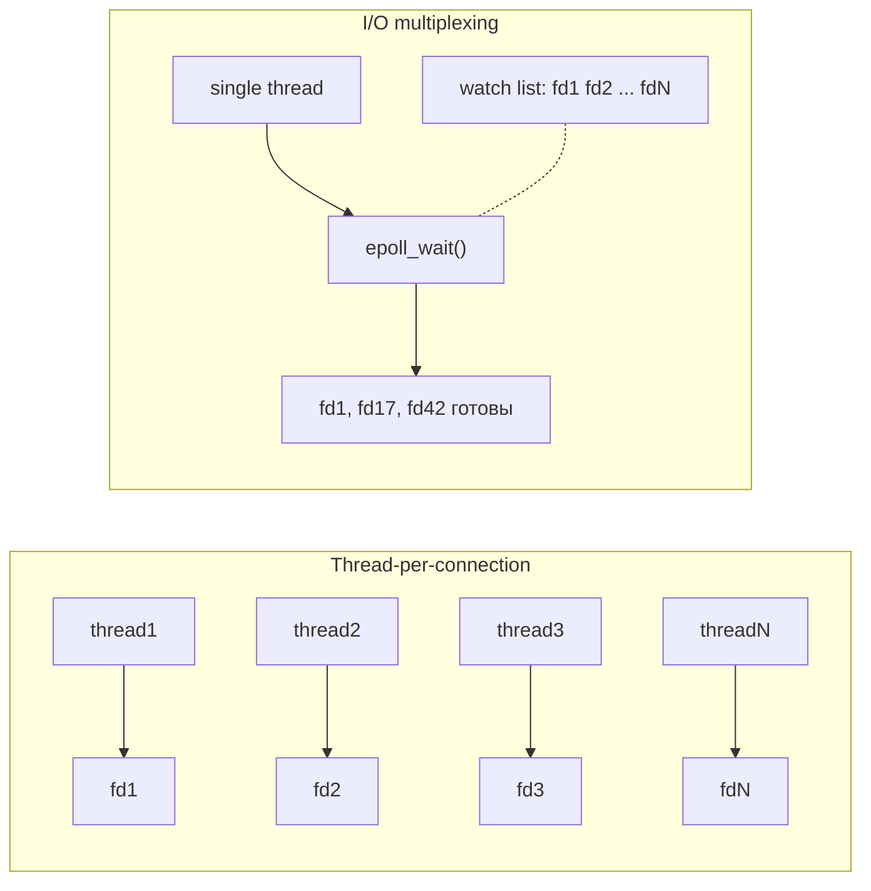
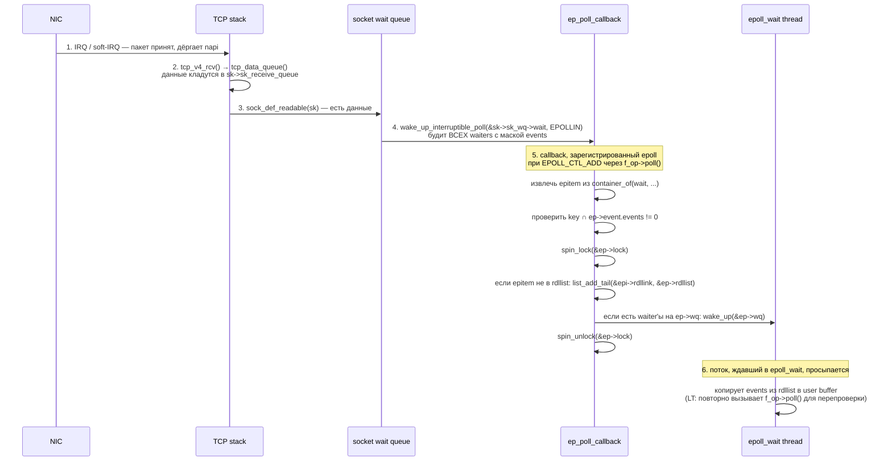
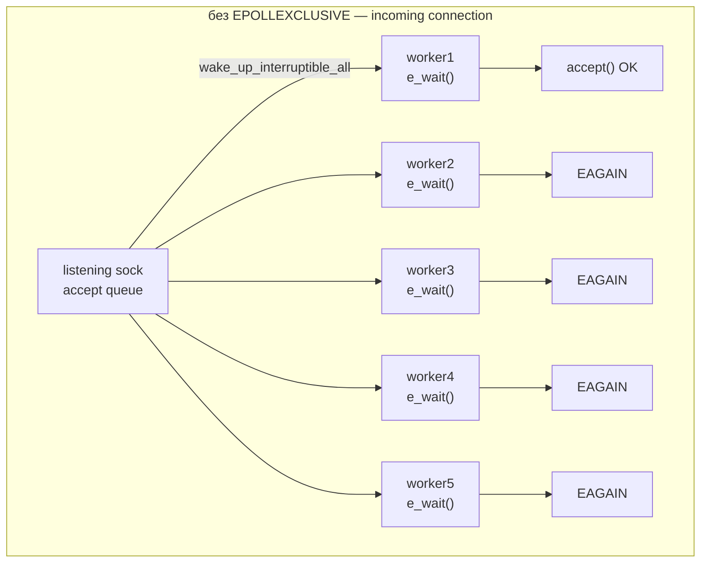
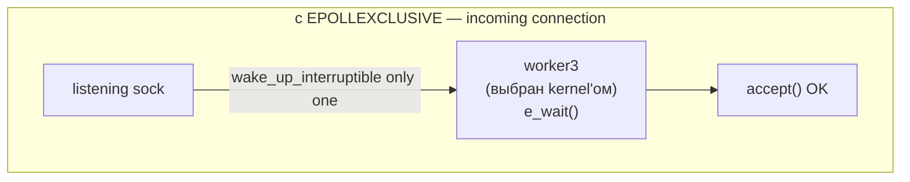
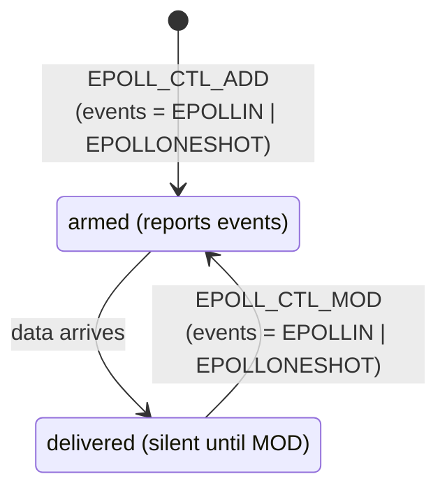

# I/O multiplexing: select, poll, epoll

Сервер на 10 000 одновременных подключений — это не про железо, это про модель ввода-вывода. Если на каждое подключение
выделять поток, ядро тратит мегабайты на стеки и микросекунды на context switch'и. I/O multiplexing решает задачу иначе:
один поток сидит на одном syscall и просыпается, когда хотя бы один из сотен file descriptor'ов готов к чтению или
записи.

Три API дают эту способность в Linux: исторический `select`, его наследник `poll` и линейно масштабирующийся `epoll`.

## Зачем это вообще

Альтернативы multiplexing'у плохо масштабируются:

- **Thread-per-connection** — каждый клиент получает свой поток. Поток в Linux стоит 8 MB virtual memory под стек
  (`ulimit -s`), context switch — сотни наносекунд, scheduler контролирует тысячи runnable threads с просадкой
  throughput. На 10K соединений это становится узким местом — классическая C10K problem, описанная Dan Kegel в 1999.
- **Process-per-connection** — то же самое, только с `fork`. Стоимость порядки на два хуже из-за copy-on-write страниц и
  отдельного address space.
- **Non-blocking + busy-wait** — поток в цикле опрашивает каждый fd через `read()` с `O_NONBLOCK`. CPU работает на 100%,
  даже если данных нет.

Multiplexing использует тот факт, что подавляющее большинство соединений в каждый момент времени неактивны. Один поток
вызывает single syscall, передавая список интересующих fd. Kernel блокирует поток до тех пор, пока хотя бы один fd не
станет ready, и возвращает управление с информацией о готовых fd. Никаких лишних потоков, никакого busy-wait.



## select

Появился в 4.2BSD (1983), включён в POSIX. Передаёт ядру три bitmap'а — для чтения, записи и exceptional conditions —
и блокируется, пока хотя бы один бит не «загорится».

```c
#include <sys/select.h>

int select(int nfds, fd_set *readfds, fd_set *writefds,
           fd_set *exceptfds, struct timeval *timeout);

void FD_ZERO(fd_set *set);
void FD_SET(int fd, fd_set *set);
void FD_CLR(int fd, fd_set *set);
int  FD_ISSET(int fd, fd_set *set);
```

`fd_set` — статический bitmap фиксированного размера `FD_SETSIZE` (1024 на Linux). Бит с номером N означает интерес к fd
N:

```
fd_set (1024 бита = 128 байт):

  бит:   0   1   2   3   4   5   6   7   8   9  ... 1023
        ┌───┬───┬───┬───┬───┬───┬───┬───┬───┬───┬─────┐
        │ 0 │ 0 │ 0 │ 1 │ 0 │ 1 │ 0 │ 0 │ 1 │ 0 │ ... │
        └───┴───┴───┴───┴───┴───┴───┴───┴───┴───┴─────┘
                          ▲       ▲           ▲
                          │       │           └── интерес к fd 8
                          │       └────────────── интерес к fd 5
                          └────────────────────── интерес к fd 3
```

Параметр `nfds` — наибольший fd плюс 1; kernel сканирует ровно столько бит. После возврата bitmap'ы переписываются: бит
остаётся установлен только у готовых fd. Это значит, что bitmap нужно перестраивать перед каждым вызовом.

```c
#include <sys/select.h>
#include <unistd.h>
#include <stdio.h>

int main(void) {
    fd_set rfds;
    struct timeval tv = { .tv_sec = 5, .tv_usec = 0 };

    FD_ZERO(&rfds);
    FD_SET(STDIN_FILENO, &rfds);

    int ret = select(STDIN_FILENO + 1, &rfds, NULL, NULL, &tv);
    if (ret == -1)      perror("select");
    else if (ret == 0)  printf("timeout\n");
    else if (FD_ISSET(STDIN_FILENO, &rfds))
                        printf("stdin ready\n");
    return 0;
}
```

Проблемы `select` накапливаются с ростом числа fd:

- **Жёсткий лимит 1024.** `FD_SETSIZE` зашит в libc; превысить нельзя, потому что bitmap статический.
- **O(n) по fd.** Kernel сканирует все биты от 0 до `nfds-1`, даже если активен один fd. User space потом сканирует
  bitmap снова через `FD_ISSET`.
- **Копирование bitmap'а в kernel каждый вызов.** Три fd_set'а по 128 байт туда, три обратно — мелочь, но это на каждый
  цикл event loop.
- **Деструктивный API.** После возврата input bitmap потерян; нужно хранить копию и восстанавливать.
- **`timeout` модифицируется.** На Linux после возврата структура содержит оставшееся время — портабельность под
  угрозой.

## poll

Появился в System V, POSIX. Решает лимит 1024 и упрощает API, но не решает O(n).

```c
#include <poll.h>

struct pollfd {
    int   fd;        // дескриптор
    short events;    // что мониторим (POLLIN, POLLOUT, ...)
    short revents;   // что произошло — заполняет kernel
};

int poll(struct pollfd *fds, nfds_t nfds, int timeout);
```

Передаётся массив `pollfd`, длина не ограничена ничем кроме `RLIMIT_NOFILE`. Kernel заполняет `revents` у каждой
записи —
исходные `events` остаются нетронутыми, перестраивать массив не нужно.

```c
#include <poll.h>
#include <unistd.h>
#include <stdio.h>

int main(void) {
    struct pollfd pfds[2] = {
        { .fd = STDIN_FILENO, .events = POLLIN },
        { .fd = 3,            .events = POLLIN | POLLOUT },
    };

    int ret = poll(pfds, 2, 5000);  // timeout 5s в миллисекундах
    if (ret == -1) { perror("poll"); return 1; }

    for (int i = 0; i < 2; i++) {
        if (pfds[i].revents & POLLIN)  printf("fd %d readable\n",  pfds[i].fd);
        if (pfds[i].revents & POLLOUT) printf("fd %d writable\n", pfds[i].fd);
        if (pfds[i].revents & POLLHUP) printf("fd %d hangup\n",   pfds[i].fd);
    }
    return 0;
}
```

Чем poll лучше select:

| Аспект                 | select               | poll                         |
|------------------------|----------------------|------------------------------|
| Лимит fd               | 1024 (`FD_SETSIZE`)  | `RLIMIT_NOFILE`              |
| Отдельный input/output | нет (деструктивно)   | да (`events` ≠ `revents`)    |
| Гранулярность событий  | read/write/except    | POLLIN/OUT/RDHUP/HUP/ERR/PRI |
| Размер передачи        | 3 × `FD_SETSIZE` бит | 8 байт на fd                 |
| Сканирование в kernel  | O(nfds)              | O(nfds)                      |

Главная проблема осталась: kernel перебирает весь массив каждый вызов, user space — тоже. На 10K idle соединений с одним
активным `poll()` тратит 80 KB на копирование туда-обратно и линейный проход через 10K элементов в kernel space. Для
event loop с десятками тысяч fd это убивает throughput.

## epoll

Linux-специфичный API, появился в ядре 2.5.45 (2002). Главная идея — разорвать связь между «списком интересующих fd» и
«списком готовых fd». Первый регистрируется один раз, второй ядро формирует само и возвращает уже готовый.

```c
#include <sys/epoll.h>

int epoll_create1(int flags);
int epoll_ctl(int epfd, int op, int fd, struct epoll_event *event);
int epoll_wait(int epfd, struct epoll_event *events, int maxevents, int timeout);

struct epoll_event {
    uint32_t     events;    // EPOLLIN, EPOLLOUT, EPOLLET, ...
    epoll_data_t data;      // user data (ptr/fd/u32/u64)
};
```

`epoll_create1` создаёт **epoll instance** — kernel-объект, ассоциированный с file descriptor'ом. Закрытие этого fd
освобождает instance. Через `epoll_ctl` в instance добавляют/изменяют/удаляют наблюдаемые fd:

- `EPOLL_CTL_ADD` — зарегистрировать fd с набором интересующих events
- `EPOLL_CTL_MOD` — изменить events для уже зарегистрированного fd
- `EPOLL_CTL_DEL` — снять fd с наблюдения

`epoll_wait` блокируется до появления готовых fd и записывает их в буфер `events` — возвращает ровно столько записей,
сколько fd готово.

### Внутреннее устройство

Каждый epoll instance в kernel — это две структуры:

- **interest list** (watch list) — red-black tree всех зарегистрированных fd. RB-tree даёт O(log n) на add/mod/del и
  быстрый lookup по ключу `(fd, file*)`. Хранится один раз, не передаётся туда-обратно.
- **ready list** — doubly-linked list fd, у которых произошло событие. Когда драйвер сокета вызывает callback при
  приходе данных, fd добавляется в ready list. `epoll_wait` просто переливает этот список в user buffer.

```
epoll instance (kernel)

         interest list                    ready list
         (RB-tree by fd)                  (linked list)
                                            ┌──────┐
              ┌────────┐                    │ head │
              │ fd=42  │                    └──┬───┘
              └───┬────┘                       │
            ┌────┴────┐                        ▼
            │         │                  ┌──────────┐
       ┌────┴───┐ ┌───┴────┐             │ fd=17    │ (data arrived)
       │ fd=17  │ │ fd=88  │ ────────▶   ├──────────┤
       └────────┘ └───┬────┘             │ fd=88    │ (TCP FIN)
                     ┌┴─────┐            └──────────┘
                     │fd=103│
                     └──────┘                  ▲
                                                │
   все зарегистрированные fd          только готовые fd —
   (тысячи штук, добавляются         их kernel и возвращает
   при EPOLL_CTL_ADD)                в epoll_wait
```

Когда у наблюдаемого fd происходит I/O событие, file system / network stack дёргает callback, который атомарно
проверяет наличие fd в ready list и добавляет туда, если ещё нет. Поток, заблокированный в `epoll_wait`,
будится. Сложность каждого шага — O(1) на event, независимо от размера interest list.

Это и есть ключевое отличие от select/poll: kernel не сканирует все fd, а получает уведомления только об активных.
Размер interest list может быть миллион — `epoll_wait` всё равно вернётся за микросекунды, если активных fd десяток.

### epoll internals в ядре

Реализация — `fs/eventpoll.c` в kernel tree. Каждый epoll instance представлен структурой `struct eventpoll`:

```
struct eventpoll {
   spinlock_t        lock;       ──▶  защищает rdllist и wq
   struct mutex      mtx;        ──▶  защищает rbr (interest list)
   wait_queue_head_t wq;         ──▶  waiters в epoll_wait
   wait_queue_head_t poll_wait;  ──▶  для случая «epoll в epoll»
   struct list_head  rdllist;    ──▶  ready list — fd's с pending events
   struct rb_root_cached rbr;    ──▶  red-black tree всех зарегистрированных fd's
   struct epitem    *ovflist;    ──▶  overflow list (когда rdllist в processing)
   struct user_struct *user;     ──▶  rlimit accounting
   struct file       *file;
};
```

- **`rbr`** (red-black tree by file* + fd) — все зарегистрированные через `EPOLL_CTL_ADD` fd. RB-tree даёт O(log N) на
  `EPOLL_CTL_ADD/MOD/DEL` lookup. Ключ — пара `(struct file*, int fd)`, потому что один fd может быть переоткрыт после
  close на тот же номер.
- **`rdllist`** — doubly-linked list `struct epitem`'ов, у которых есть pending event. Это и есть «список готовых fd».
  `epoll_wait` ходит по этому списку, копирует events в user space, и (для LT) перепроверяет каждый fd на актуальную
  готовность.
- **`wq`** — wait queue потоков, ожидающих в `epoll_wait`. При появлении нового события в rdllist делается
  `wake_up(&ep->wq)`, что будит первого waiter'а (или всех — зависит от EPOLLEXCLUSIVE).

Каждый зарегистрированный fd представлен `struct epitem`:

```
struct epitem {
   union {
     struct rb_node      rbn;       ──▶  узел в eventpoll::rbr
     struct rcu_head     rcu;
   };
   struct list_head      rdllink;   ──▶  узел в eventpoll::rdllist
   struct epitem        *next;      ──▶  узел в ovflist
   struct epoll_filefd   ffd;       ──▶  (struct file*, int fd) — ключ
   struct eventpoll     *ep;        ──▶  back-pointer
   struct list_head      pwqlist;   ──▶  poll wait queues (callback hooks)
   struct epoll_event    event;     ──▶  subscribed events + user data
};
```

Поле `pwqlist` — самое интересное. При `EPOLL_CTL_ADD` epoll вызывает `f_op->poll()` целевого файла, и эта функция
регистрирует callback `ep_poll_callback` на native wait queue этого файла (например, у TCP-сокета это
`sk->sk_wq->wait`). `epitem` хранит список этих регистраций, чтобы при `EPOLL_CTL_DEL` их можно было аккуратно снять.

Диаграмма связей:

```
                  struct eventpoll
                  ┌────────────────────────────┐
                  │  rbr ─────────┐            │
                  │  rdllist ──┐  │            │
                  │  wq        │  │            │
                  └────────────┼──┼────────────┘
                               │  │
                               │  └──▶ red-black tree (interest list)
                               │              │
                               │       ┌──────┴──────┐
                               │       ▼             ▼
                               │   ┌────────┐   ┌────────┐
                               │   │ epitem │   │ epitem │
                               │   │ fd=42  │   │ fd=88  │
                               │   └────────┘   └────────┘
                               │        │            │
                               ▼        ▼            ▼
                          ready list (linked)
                          ┌──────────────────────────┐
                          │  head ─▶ epitem(fd=17)   │
                          │         ─▶ epitem(fd=88) │
                          │         ─▶ NULL          │
                          └──────────────────────────┘

  epitem'ы в RB-tree — все, подписанные через EPOLL_CTL_ADD.
  В ready list — только те, у кого есть pending event.
  Каждый epitem подписан через pwqlist на native wait queue
  своего файла (например, sk->sk_wq->wait у TCP-сокета).
```

### ep_poll_callback flow

Ключ к O(1) cost'у — реактивная модель. epoll не опрашивает fd в момент `epoll_wait`; он подписан на их wake-up'ы.

Когда драйвер устройства (например, TCP stack) получает пакет:



`epoll_wait` сам не делает `poll()` ни по одному fd кроме случая LT-revalidation: он просто разгребает `rdllist`,
который заполняется реактивно через `ep_poll_callback`. Cost — O(R), где R — число ready events, а не O(N) по
размеру interest list.

LT vs ET в этой картине отличаются только в одной точке: после копирования event'а в user space LT повторно вызывает
`f_op->poll()` и, если fd всё ещё ready, **оставляет** его в rdllist для следующего `epoll_wait`. ET — удаляет
безусловно: следующее пробуждение возможно только через свежий `ep_poll_callback`.

### EPOLLEXCLUSIVE

Linux 4.5+ (март 2016). Решает классическую **thundering herd** проблему в многопоточных серверах.

Сценарий: N воркер-потоков, каждый из которых имеет свой epoll fd и регистрирует один и тот же listening socket. Каждый
делает `epoll_wait`. Приходит входящее соединение → пробуждаются все N потоков → один делает успешный `accept`,
остальные N-1 получают `EAGAIN` (без `SO_REUSEPORT`) или принимают connection (с `SO_REUSEPORT`, что меняет
распределение, но не убирает лишние пробуждения).



wasted wakeup × 4 — лишние context switches, cache thrashing, scheduler queueing.



Использование: `epoll_ctl(epfd, EPOLL_CTL_ADD, listen_fd, &(struct epoll_event){.events = EPOLLIN | EPOLLEXCLUSIVE})`. На
уровне ядра флаг изменяет тип wait queue entry с `WQ_FLAG_NONEXCLUSIVE` на exclusive: `wake_up_interruptible` будит
только одного exclusive waiter'а вместо всех.

Restrictions:

- работает только с `EPOLL_CTL_ADD`, не с `MOD` (поведение нельзя изменить после регистрации);
- несовместим с `EPOLLONESHOT`;
- не гарантирует fairness — kernel будит «первого попавшегося», обычно LIFO от wait queue.

nginx использует EPOLLEXCLUSIVE начиная с 1.11.3 для shared listener sockets между worker processes. envoy и HAProxy —
в worker-per-thread моделях. Для модели с `SO_REUSEPORT` (каждый worker слушает свой socket с тем же портом, kernel
разруливает hash by 4-tuple) EPOLLEXCLUSIVE не нужен — нет shared waitable объекта.

### EPOLLONESHOT

Флаг для модели «один fd обрабатывается строго одним воркером». После того как `epoll_wait` сообщил event на fd с
EPOLLONESHOT, fd деактивируется в kernel — больше события на нём не репортятся, пока приложение явно не сделает
`EPOLL_CTL_MOD` с новой маской events:



Use case — thread pool с очередью fd's:

- main reactor делает `epoll_wait`, получает ready fd, передаёт его в work queue одного из worker'ов;
- worker обрабатывает (полностью drain'ит read buffer, отвечает в write buffer);
- по завершении worker делает `EPOLL_CTL_MOD` чтобы re-arm fd — это сигнал «я закончил, можно снова доставлять events
  по этому fd».

Без EPOLLONESHOT в multi-worker модели возникала бы race: пока worker A обрабатывает первый event на fd, второй event на
тот же fd мог бы быть доставлен worker'у B → два потока конкурентно работают с одним соединением, требуется
дополнительный mutex per-fd. EPOLLONESHOT перекладывает эту дисциплину на ядро.

Отличие от EPOLLEXCLUSIVE:

- EPOLLEXCLUSIVE — про **distribution wakeup**: который из N потоков, ждущих *одного* event'а, будет разбужен.
- EPOLLONESHOT — про **ownership of fd**: какой поток отвечает за обработку *одного fd* до явного re-arm.

Их можно комбинировать на уровне дизайна (разные epoll fd's per worker + per-fd EPOLLONESHOT для serialized ownership),
но не на одном epoll_ctl call.

### События

| Флаг             | Значение                                                              |
|------------------|-----------------------------------------------------------------------|
| `EPOLLIN`        | данные доступны для чтения                                            |
| `EPOLLOUT`       | в сокет можно писать без блокировки                                   |
| `EPOLLRDHUP`     | peer закрыл свою сторону соединения (half-close)                      |
| `EPOLLPRI`       | urgent data (out-of-band)                                             |
| `EPOLLERR`       | ошибка на fd (всегда репортится, без явной регистрации)               |
| `EPOLLHUP`       | hangup (всегда репортится)                                            |
| `EPOLLET`        | edge-triggered режим вместо level-triggered                           |
| `EPOLLONESHOT`   | после первого события fd деактивируется до явного `EPOLL_CTL_MOD`     |
| `EPOLLEXCLUSIVE` | будить только одного waiter'а (защита от thundering herd на `accept`) |

### Level-triggered vs edge-triggered

Default режим — **level-triggered (LT)**. `epoll_wait` возвращает fd до тех пор, пока на нём есть данные для чтения. Это
поведение `poll`/`select`.

**Edge-triggered (ET)** включается флагом `EPOLLET`. `epoll_wait` возвращает fd ровно один раз — в момент перехода
состояния (новые данные пришли, буфер записи освободился). Если приложение прочитало не всё, повторно `epoll_wait` fd
не вернёт, пока не придёт новая порция данных.

```
Сценарий: на сокет приходят 1000 байт двумя пачками по 500. Приложение читает по 200 байт за раз.

время →
        приход 500 байт            приход 500 байт
            │                          │
            ▼                          ▼
data:   [500 в буфере]──▶[300]──▶[100]──▶[ready+500=600]──▶[400]──▶[200]──▶[0]
              ▲             ▲       ▲           ▲             ▲       ▲       ▲
              │             │       │           │             │       │       │
LT:        wake          wake     wake        wake          wake    wake     —
              │             │       │           │             │       │
              │  пока буфер не пуст, каждый epoll_wait возвращает fd

ET:        wake           —        —          wake            —       —      —
              │                                  │
              │  пробуждение только на edge —    │
              │  переходе из «нет данных» в      │
              │  «есть данные»                   │
              └─ приложение обязано читать      └─ снова edge: 0 → 600
                 в цикле до EAGAIN
```

ET требует строгой дисциплины:

- **Fd должен быть в `O_NONBLOCK`**. Иначе `read()` после исчерпания буфера заблокирует поток навсегда — пробуждения
  больше не будет.
- **Читать в цикле до `EAGAIN`/`EWOULDBLOCK`**. Если остановиться раньше — данные останутся в буфере, и приложение
  никогда не получит о них уведомление.
- **Писать аналогично до `EAGAIN`**. Иначе `EPOLLOUT` event не повторится.
- **Готовность к spurious wakeup**. Иногда `epoll_wait` возвращает fd, у которого `read()` сразу даёт `EAGAIN`. Это
  нормально, обрабатывать как «нет данных».

Зачем нужен ET. Level-triggered прост, но создаёт лишние syscalls: каждое чтение из неполного буфера приводит к новому
пробуждению. ET идеален для приложений, которые в любом случае читают весь доступный буфер в цикле — он экономит
несколько syscalls на каждом read. Также ET — необходимое условие для thundering herd mitigations через
`EPOLLEXCLUSIVE` на shared listening sockets.

### Echo-сервер на epoll

Минимальный TCP echo-сервер с edge-triggered режимом и non-blocking сокетами:

```c
#include <sys/epoll.h>
#include <sys/socket.h>
#include <netinet/in.h>
#include <arpa/inet.h>
#include <fcntl.h>
#include <unistd.h>
#include <string.h>
#include <stdio.h>
#include <errno.h>

#define MAX_EVENTS 64
#define PORT       8080

static void set_nonblock(int fd) {
    int flags = fcntl(fd, F_GETFL, 0);
    fcntl(fd, F_SETFL, flags | O_NONBLOCK);
}

int main(void) {
    int listen_fd = socket(AF_INET, SOCK_STREAM, 0);
    int yes = 1;
    setsockopt(listen_fd, SOL_SOCKET, SO_REUSEADDR, &yes, sizeof(yes));

    struct sockaddr_in addr = {
        .sin_family = AF_INET,
        .sin_addr.s_addr = htonl(INADDR_ANY),
        .sin_port = htons(PORT),
    };
    bind(listen_fd, (struct sockaddr*)&addr, sizeof(addr));
    listen(listen_fd, SOMAXCONN);
    set_nonblock(listen_fd);

    int epfd = epoll_create1(EPOLL_CLOEXEC);

    struct epoll_event ev = { .events = EPOLLIN | EPOLLET, .data.fd = listen_fd };
    epoll_ctl(epfd, EPOLL_CTL_ADD, listen_fd, &ev);

    struct epoll_event events[MAX_EVENTS];
    char buf[4096];

    for (;;) {
        int n = epoll_wait(epfd, events, MAX_EVENTS, -1);
        for (int i = 0; i < n; i++) {
            int fd = events[i].data.fd;

            if (fd == listen_fd) {
                // Accept all pending connections (edge-triggered)
                for (;;) {
                    int cfd = accept(listen_fd, NULL, NULL);
                    if (cfd == -1) {
                        if (errno == EAGAIN || errno == EWOULDBLOCK) break;
                        perror("accept");
                        break;
                    }
                    set_nonblock(cfd);
                    struct epoll_event cev = {
                        .events = EPOLLIN | EPOLLET | EPOLLRDHUP,
                        .data.fd = cfd,
                    };
                    epoll_ctl(epfd, EPOLL_CTL_ADD, cfd, &cev);
                }
            } else if (events[i].events & (EPOLLERR | EPOLLHUP | EPOLLRDHUP)) {
                epoll_ctl(epfd, EPOLL_CTL_DEL, fd, NULL);
                close(fd);
            } else if (events[i].events & EPOLLIN) {
                // Drain socket until EAGAIN (mandatory for ET)
                for (;;) {
                    ssize_t r = read(fd, buf, sizeof(buf));
                    if (r > 0) {
                        write(fd, buf, r);  // simplified: ignore EAGAIN on write
                    } else if (r == 0) {
                        epoll_ctl(epfd, EPOLL_CTL_DEL, fd, NULL);
                        close(fd);
                        break;
                    } else {
                        if (errno == EAGAIN || errno == EWOULDBLOCK) break;
                        epoll_ctl(epfd, EPOLL_CTL_DEL, fd, NULL);
                        close(fd);
                        break;
                    }
                }
            }
        }
    }
    close(epfd);
    close(listen_fd);
    return 0;
}
```

Опущены error checks возврата `epoll_ctl`, `bind`, `listen`, и обработка частичной записи — в production коде каждый
сокет имеет собственный outgoing buffer, и `EPOLLOUT` подключается через `EPOLL_CTL_MOD`, когда `write()` вернул
`EAGAIN`.

!!! example "Рабочий пример"
    Полная компилируемая реализация edge-triggered epoll echo-сервера с non-blocking сокетами: `examples/q11_epoll_server/server.c` — собрать и запустить: `cd examples && make q11 && ./bin/q11_epoll_server`.

## Сравнение

```
                  select       poll          epoll
                  ──────       ────          ─────
fd limit       1024 hard    RLIMIT_NOFILE   RLIMIT_NOFILE
wakeup cost    O(n) scan    O(n) scan       O(1) per event
state          rebuild      persistent      persistent (kernel)
                fd_set       array          rb-tree
copy per call  3 × bitmap   8 B × n         only ready events
trigger mode   level only   level only      level + edge
portability    POSIX        POSIX           Linux only
```

| Сценарий                                | Лучший выбор                                         |
|-----------------------------------------|------------------------------------------------------|
| Linux server, тысячи соединений         | epoll, edge-triggered                                |
| Linux server, сотни соединений          | epoll, level-triggered (проще, ошибиться сложнее)    |
| Кроссплатформенный код (Linux+BSD+Win)  | `poll` + платформозависимые ускорения через `#ifdef` |
| FreeBSD/macOS                           | `kqueue` — аналог epoll, в чём-то богаче             |
| Windows                                 | IOCP — completion-based, другая модель               |
| Embedded, мало fd, минимум зависимостей | `select` или `poll`                                  |
| Async file I/O (epoll бесполезен)       | `io_uring`                                           |

Один важный нюанс: epoll **не работает с regular file fd**. Файлы на диске всегда «ready» в смысле POSIX, и kernel
никогда не сообщит о появлении данных. Для асинхронного I/O по файлам нужен `io_uring` или POSIX AIO. epoll нормально
работает с socket'ами, pipe, terminal, eventfd, signalfd, timerfd, inotify — со всем, что имеет non-trivial readiness
state.

## Связанные темы

- [io_uring](io_uring.md) — completion model, современная альтернатива epoll с одной операцией на каждый I/O
- [Сокеты: API](../networking/sockets_basics.md) — основной источник fd для epoll: TCP/UDP/Unix сокеты
- [Файловые дескрипторы](../files_and_filesystems/file_descriptors.md) — основа всех multiplexing API, fd как ключ в
  interest list
- [Перенаправление ввода-вывода](../files_and_filesystems/input_output_redirection.md) — pipe и redirected fd как
  объекты для epoll
- [Сигналы](../processes/signals.md) — `signalfd` интегрирует доставку сигналов в epoll loop
- [IPC](../processes/ipc.md) — `eventfd` как способ разбудить epoll_wait из другого потока
- [Потоки: основы](../concurrency/threads_basics.md) — альтернатива thread-per-connection и её ограничения

## Источники

- `man 2 select`, `man 2 poll`, `man 7 epoll`
- `man 2 epoll_create1`, `man 2 epoll_ctl`, `man 2 epoll_wait`
- [Dan Kegel — The C10K problem](http://www.kegel.com/c10k.html)
- [LWN — Edge-triggered interfaces are too difficult?](https://lwn.net/Articles/25137/)
- [The Implementation of epoll — idndx.com](https://idndx.com/the-implementation-of-epoll-1/)
