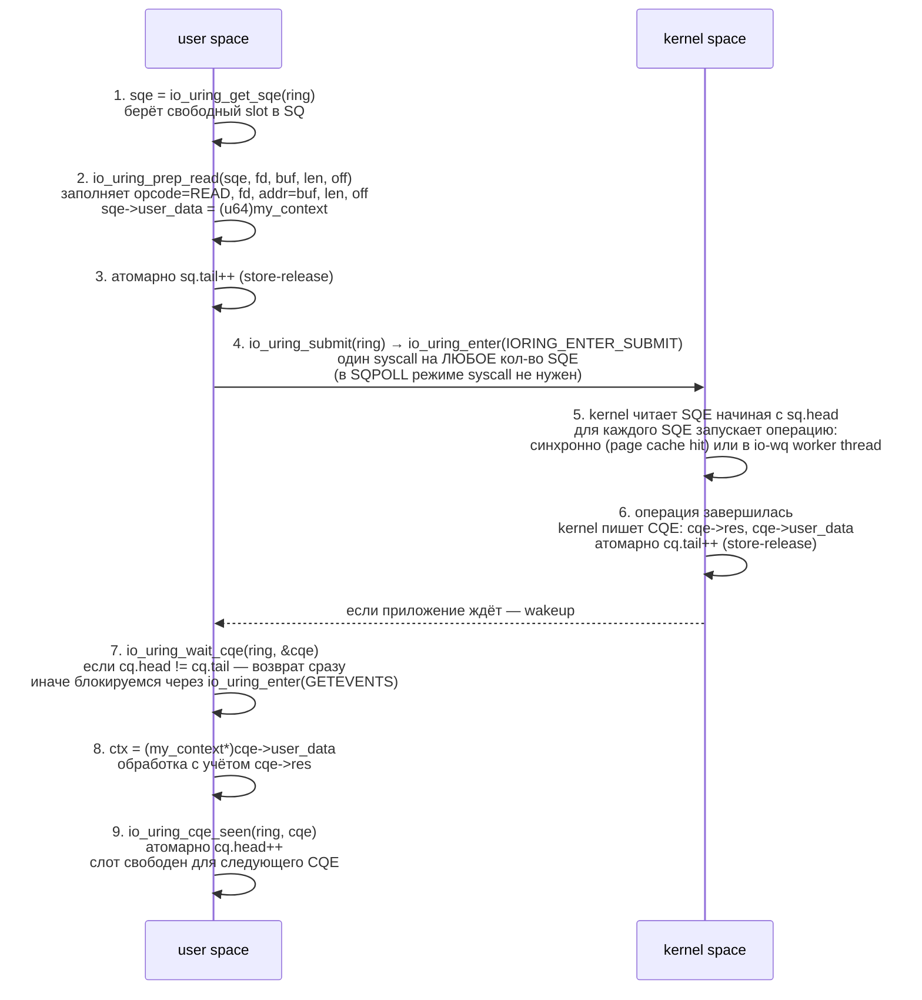
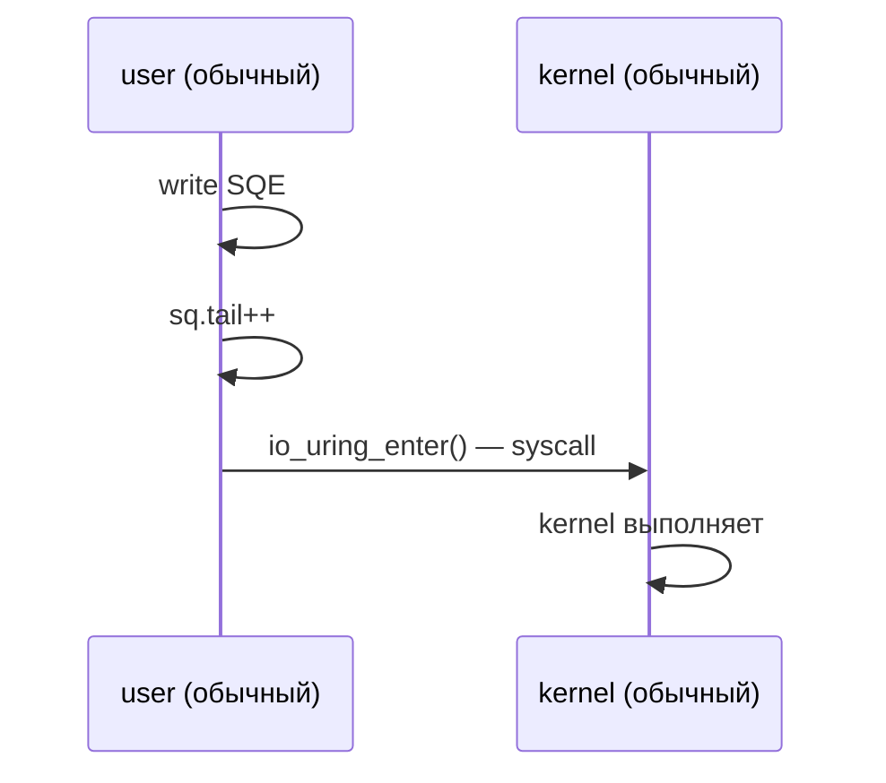
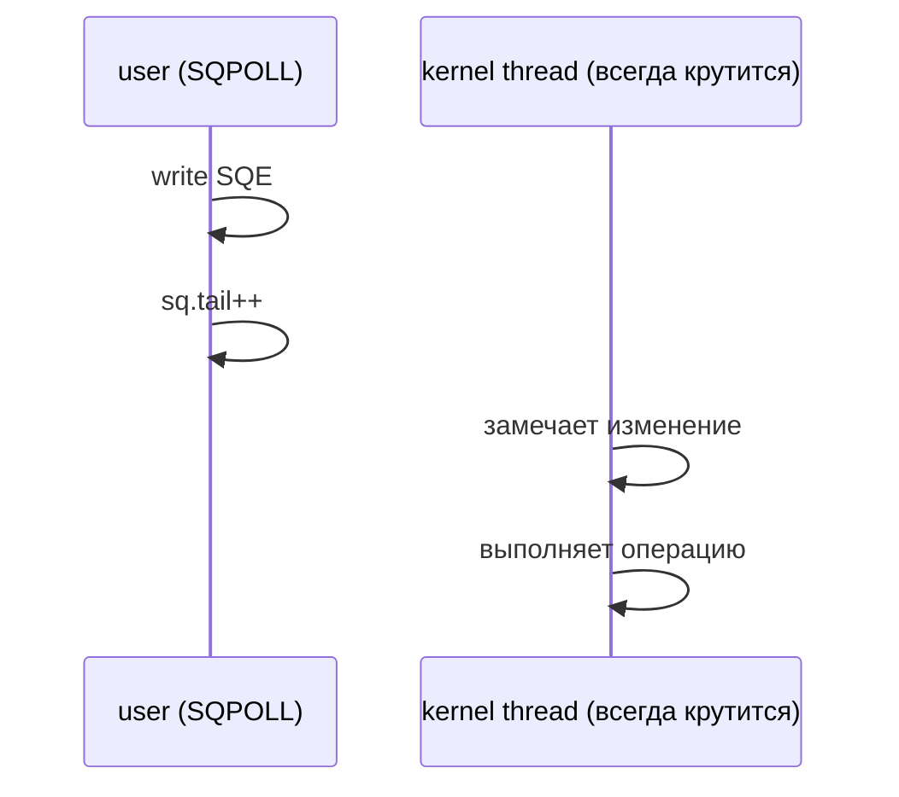
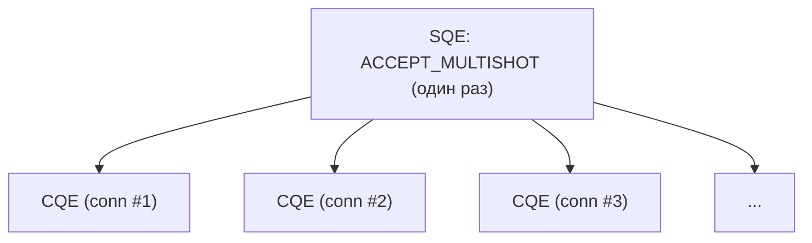
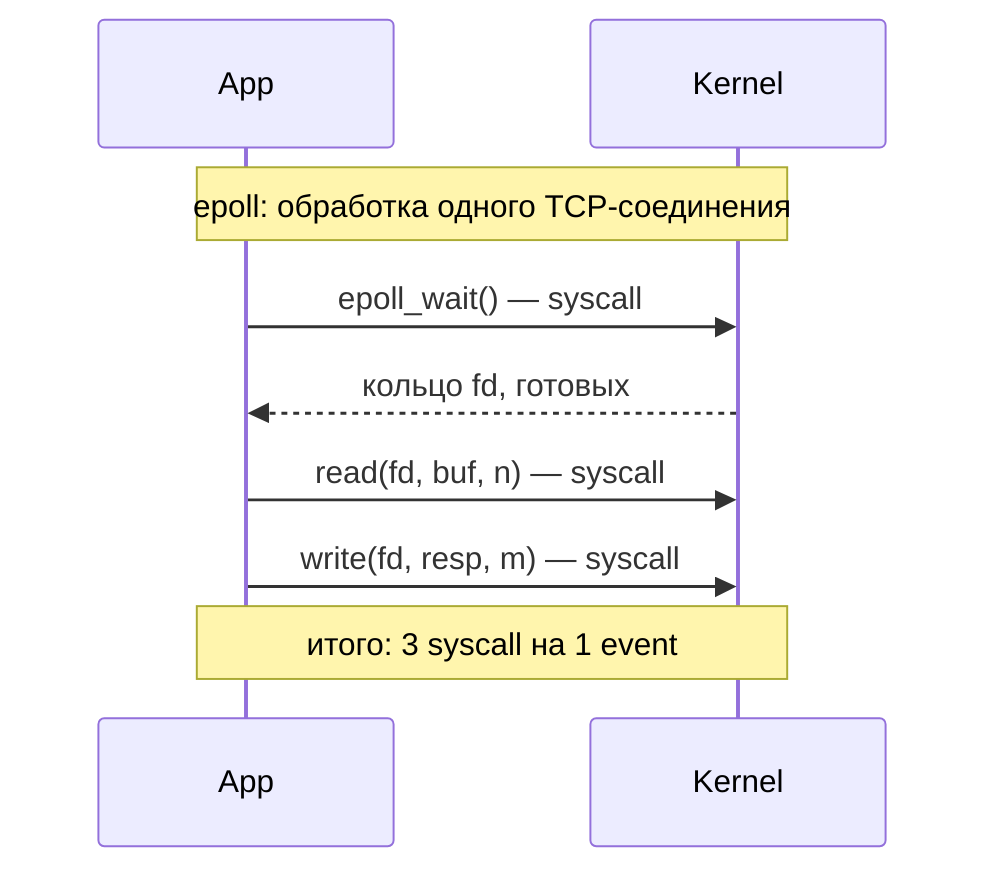
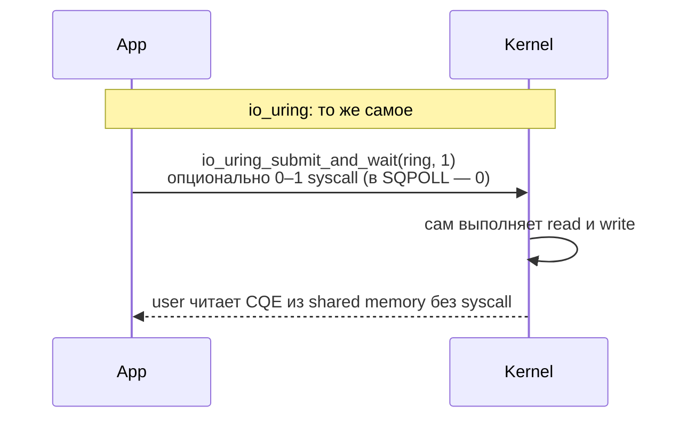

# io_uring: асинхронный I/O в Linux

Каждый syscall — это переход в kernel mode: сохранение регистров, проверка аргументов, копирование данных через границу
user/kernel. На современном железе с mitigations против Meltdown/Spectre один syscall стоит сотни наносекунд. Когда
сервер обрабатывает миллион соединений и каждая операция — это `read` или `write`, эти наносекунды превращаются в
проценты CPU.

Даже `epoll`, главный механизм event-driven I/O в Linux, не решает проблему до конца: он только сообщает, что fd готов,
а саму операцию всё равно надо делать отдельным syscall'ом. На один полезный event получается три syscall'а:
`epoll_wait` → `read` → `write`.

**io_uring** — интерфейс асинхронного I/O, появившийся в Linux 5.1 (май 2019, автор — Jens Axboe, мейнтейнер block layer
ядра). Идея: между user space и kernel mmap'ятся два кольцевых буфера. Чтобы попросить kernel что-то сделать, user
просто пишет описание операции в shared memory. Чтобы получить результат — читает другой буфер. Никаких syscall на
сабмит (или один батчевый), полностью асинхронный режим.

## Архитектура

io_uring состоит из двух колец, разделяемых между user space и kernel через `mmap`:

- **SQ (Submission Queue)** — user пишет SQE (Submission Queue Entry, описание операции), kernel читает.
- **CQ (Completion Queue)** — kernel пишет CQE (Completion Queue Entry, результат), user читает.

Оба буфера — кольцевые: производитель инкрементирует `tail`, потребитель `head`. Когда индекс достигает конца массива,
он по модулю заворачивается в начало. Все индексы — атомарные `uint32_t`, синхронизация через memory barriers, без
блокировок.

```
                  user space                                kernel space
┌─────────────────────────────────────────────┐  ┌─────────────────────────────┐
│                                             │  │                             │
│  app code                                   │  │  io_uring worker            │
│       │                                     │  │       ▲                     │
│       │ 1. prep SQE                         │  │       │ 2. consume SQE      │
│       ▼                                     │  │       │                     │
│  ┌─────────────────────────────────────┐    │  │       │                     │
│  │      SQ (Submission Queue)          │◀───┼──┼───────┘                     │
│  │  ┌────┬────┬────┬────┬────┬────┐    │    │  │                             │
│  │  │SQE │SQE │SQE │ .. │ .. │ .. │    │    │  │  выполняет syscalls         │
│  │  └────┴────┴────┴────┴────┴────┘    │    │  │  напрямую внутри ядра:      │
│  │   ▲              ▲                  │    │  │  read, write, accept, ...   │
│  │   │ head         │ tail             │    │  │                             │
│  │   │ (kernel)     │ (user пишет)     │    │  │                             │
│  └───┼──────────────┼──────────────────┘    │  │                             │
│      │              │                       │  │       │ 3. produce CQE      │
│      │              │   shared via mmap     │  │       ▼                     │
│  ┌───┼──────────────┼──────────────────┐    │  │                             │
│  │   │              │                  │    │  │                             │
│  │   ▼              ▼                  │    │  │                             │
│  │      CQ (Completion Queue)          │◀───┼──┼───────┐                     │
│  │  ┌────┬────┬────┬────┬────┬────┐    │    │  │       │                     │
│  │  │CQE │CQE │CQE │ .. │ .. │ .. │    │    │  │       │ kernel пишет        │
│  │  └────┴────┴────┴────┴────┴────┘    │    │  │       │ результат           │
│  │   ▲              ▲                  │    │  │       │                     │
│  │   │ head         │ tail             │    │  │       │                     │
│  │   │ (user)       │ (kernel пишет)   │    │  │       │                     │
│  └───┼──────────────┼──────────────────┘    │  │       │                     │
│      │              │                       │  │       │                     │
│      │ 4. read CQE  │                       │  │       │                     │
│      ▼              │                       │  │       │                     │
│  app code           │                       │  │       │                     │
│                                             │  │                             │
└─────────────────────────────────────────────┘  └─────────────────────────────┘
```

Установка пары колец делается через `io_uring_setup(2)`: он возвращает fd, через который mmap'ятся три области (SQ ring,
CQ ring, и массив SQE — он вынесен отдельно, чтобы entries можно было переупорядочивать через индекс). Размер кольца —
степень двойки, обычно 64–4096 entries.

## SQE и CQE

**Submission Queue Entry** — 64-байтовая структура, описывающая одну операцию. Поля общие для всех опкодов, конкретные
смыслы зависят от `opcode`:

```
SQE (64 bytes)
┌────────────────────────────────────────────┐
│ opcode       (u8)   IORING_OP_READ, ...    │  что делать
├────────────────────────────────────────────┤
│ flags        (u8)   IOSQE_IO_LINK, ...     │  модификаторы (link, drain, ...)
├────────────────────────────────────────────┤
│ ioprio       (u16)                         │  I/O priority
├────────────────────────────────────────────┤
│ fd           (s32)  на чём оперировать     │  файловый дескриптор
├────────────────────────────────────────────┤
│ off          (u64)  offset в файле         │  union с addr2
├────────────────────────────────────────────┤
│ addr         (u64)  user buffer            │  адрес данных
├────────────────────────────────────────────┤
│ len          (u32)  размер                 │  в байтах или кол-во iovec
├────────────────────────────────────────────┤
│ op_flags     (u32)  per-opcode flags       │  напр. RWF_DSYNC для write
├────────────────────────────────────────────┤
│ user_data    (u64)  непрозрачный токен     │  возвращается в CQE как есть
├────────────────────────────────────────────┤
│ buf_index    (u16)  + padding              │  индекс fixed buffer
└────────────────────────────────────────────┘
```

**Completion Queue Entry** — 16 байт, минимум информации, чтобы кольцо помещало много событий:

```
CQE (16 bytes)
┌────────────────────────────────────────────┐
│ user_data    (u64)  как в SQE              │  чтобы матчить запрос с ответом
├────────────────────────────────────────────┤
│ res          (s32)  результат              │  как возврат syscall: ≥0 или -errno
├────────────────────────────────────────────┤
│ flags        (u32)  IORING_CQE_F_*         │  multi-shot, buffer id и т.д.
└────────────────────────────────────────────┘
```

`user_data` — ключевая абстракция. Kernel его не интерпретирует, просто копирует из SQE в соответствующий CQE.
Приложение
обычно кладёт туда указатель на свой context-объект: при получении CQE достаточно `(my_ctx*)cqe->user_data`, и
понятно, какой именно request завершился.

## Жизненный цикл операции



Главное: операции **не блокируют** ни submit, ни wait. Можно подготовить 1000 SQE, сделать один `io_uring_submit`, и
заниматься чем угодно — kernel в фоне всё выполнит. Когда нужны результаты — `io_uring_wait_cqe` или `peek` (без блока).

## liburing

Прямой API (`io_uring_setup`, `io_uring_enter`, mmap, ручная работа с индексами и memory barriers) сложен и
error-prone. Существует **liburing** — официальная C-обёртка от Jens Axboe, скрывающая всю чёрную магию. Большинство
приложений используют именно её.

Основные функции:

| Функция                      | Назначение                                     |
|------------------------------|------------------------------------------------|
| `io_uring_queue_init`        | создать ring заданного размера                 |
| `io_uring_queue_exit`        | освободить ring                                |
| `io_uring_get_sqe`           | взять свободный SQE из очереди                 |
| `io_uring_prep_read/write/…` | заполнить SQE для нужной операции              |
| `io_uring_sqe_set_data`      | положить указатель в `user_data`               |
| `io_uring_submit`            | отправить все подготовленные SQE в kernel      |
| `io_uring_submit_and_wait`   | submit + дождаться хотя бы N completions       |
| `io_uring_wait_cqe`          | блокирующее ожидание одного CQE                |
| `io_uring_peek_cqe`          | неблокирующая проверка                         |
| `io_uring_cqe_seen`          | пометить CQE обработанным (сдвиг cq.head)      |
| `io_uring_for_each_cqe`      | макрос для пакетной обработки всех готовых CQE |

### Пример: чтение файла

Прочитать файл асинхронно через io_uring:

```c
// gcc read_file.c -luring -o read_file
#include <fcntl.h>
#include <stdio.h>
#include <stdlib.h>
#include <string.h>
#include <unistd.h>
#include <liburing.h>

#define BUF_SIZE 4096

int main(int argc, char *argv[]) {
    if (argc < 2) { fprintf(stderr, "usage: %s <file>\n", argv[0]); return 1; }

    int fd = open(argv[1], O_RDONLY);
    if (fd < 0) { perror("open"); return 1; }

    struct io_uring ring;
    if (io_uring_queue_init(8, &ring, 0) < 0) { perror("queue_init"); return 1; }

    char buf[BUF_SIZE];
    struct io_uring_sqe *sqe = io_uring_get_sqe(&ring);
    io_uring_prep_read(sqe, fd, buf, BUF_SIZE, 0);
    io_uring_sqe_set_data(sqe, (void *)0x1234);   // произвольный токен

    io_uring_submit(&ring);

    struct io_uring_cqe *cqe;
    if (io_uring_wait_cqe(&ring, &cqe) < 0) { perror("wait_cqe"); return 1; }

    if (cqe->res < 0)
        fprintf(stderr, "read failed: %s\n", strerror(-cqe->res));
    else
        fwrite(buf, 1, cqe->res, stdout);

    io_uring_cqe_seen(&ring, cqe);
    io_uring_queue_exit(&ring);
    close(fd);
    return 0;
}
```

### Пример: echo-сервер

Полноценный multi-connection echo-сервер на io_uring. Каждое соединение — это цепочка accept → read → write → read → …
Используется `user_data` для различения типов операций:

```c
// gcc echo.c -luring -o echo
#include <arpa/inet.h>
#include <netinet/in.h>
#include <stdio.h>
#include <stdlib.h>
#include <string.h>
#include <sys/socket.h>
#include <unistd.h>
#include <liburing.h>

#define PORT       8080
#define BUF_SIZE   2048
#define QUEUE_DEPTH 256

enum op_type { OP_ACCEPT, OP_READ, OP_WRITE };

struct conn_ctx {
    enum op_type type;
    int          fd;
    char         buf[BUF_SIZE];
    size_t       len;     // для WRITE — сколько байт писать
};

static struct io_uring ring;

static void submit_accept(int listen_fd) {
    struct conn_ctx *ctx = calloc(1, sizeof(*ctx));
    ctx->type = OP_ACCEPT;
    ctx->fd   = listen_fd;
    struct io_uring_sqe *sqe = io_uring_get_sqe(&ring);
    io_uring_prep_accept(sqe, listen_fd, NULL, NULL, 0);
    io_uring_sqe_set_data(sqe, ctx);
}

static void submit_read(int fd) {
    struct conn_ctx *ctx = calloc(1, sizeof(*ctx));
    ctx->type = OP_READ;
    ctx->fd   = fd;
    struct io_uring_sqe *sqe = io_uring_get_sqe(&ring);
    io_uring_prep_recv(sqe, fd, ctx->buf, BUF_SIZE, 0);
    io_uring_sqe_set_data(sqe, ctx);
}

static void submit_write(int fd, char *data, size_t len) {
    struct conn_ctx *ctx = calloc(1, sizeof(*ctx));
    ctx->type = OP_WRITE;
    ctx->fd   = fd;
    ctx->len  = len;
    memcpy(ctx->buf, data, len);
    struct io_uring_sqe *sqe = io_uring_get_sqe(&ring);
    io_uring_prep_send(sqe, fd, ctx->buf, len, 0);
    io_uring_sqe_set_data(sqe, ctx);
}

int main(void) {
    int listen_fd = socket(AF_INET, SOCK_STREAM, 0);
    int yes = 1;
    setsockopt(listen_fd, SOL_SOCKET, SO_REUSEADDR, &yes, sizeof(yes));

    struct sockaddr_in addr = { .sin_family = AF_INET,
                                .sin_port   = htons(PORT),
                                .sin_addr   = { INADDR_ANY } };
    bind(listen_fd, (struct sockaddr *)&addr, sizeof(addr));
    listen(listen_fd, 128);

    io_uring_queue_init(QUEUE_DEPTH, &ring, 0);
    submit_accept(listen_fd);

    for (;;) {
        io_uring_submit_and_wait(&ring, 1);

        struct io_uring_cqe *cqe;
        unsigned head, count = 0;
        io_uring_for_each_cqe(&ring, head, cqe) {
            struct conn_ctx *ctx = io_uring_cqe_get_data(cqe);
            int res = cqe->res;

            switch (ctx->type) {
            case OP_ACCEPT:
                if (res >= 0) submit_read(res);
                submit_accept(ctx->fd);          // снова слушаем
                break;

            case OP_READ:
                if (res > 0) submit_write(ctx->fd, ctx->buf, res);
                else         close(ctx->fd);
                break;

            case OP_WRITE:
                if (res > 0) submit_read(ctx->fd);
                else         close(ctx->fd);
                break;
            }
            free(ctx);
            count++;
        }
        io_uring_cq_advance(&ring, count);
    }
}
```

Один поток обслуживает все соединения через одно кольцо. Никакого `epoll_wait` + `read` + `write` — всё уходит в kernel
батчем через `io_uring_submit_and_wait`.

!!! example "Рабочий пример"
    Полная компилируемая реализация io_uring echo-сервера на liburing (accept → recv → send цепочка через `user_data`): `examples/q12_io_uring_server/server.c` — собрать и запустить (нужен `liburing`): `cd examples && make q12 && ./bin/q12_io_uring_server`.

## Опкоды

io_uring покрывает практически весь POSIX I/O плюс многое сверху. На 2024 год опкодов больше 60, основные:

| Opcode               | Аналог syscall | Назначение                         |
|----------------------|----------------|------------------------------------|
| `IORING_OP_NOP`      | —              | пустая операция, для тестов        |
| `IORING_OP_READ`     | `read(2)`      | чтение в один буфер                |
| `IORING_OP_WRITE`    | `write(2)`     | запись из одного буфера            |
| `IORING_OP_READV`    | `readv(2)`     | scatter-read в iovec               |
| `IORING_OP_WRITEV`   | `writev(2)`    | gather-write из iovec              |
| `IORING_OP_FSYNC`    | `fsync(2)`     | flush данных на диск               |
| `IORING_OP_ACCEPT`   | `accept4(2)`   | принять TCP-соединение             |
| `IORING_OP_CONNECT`  | `connect(2)`   | подключиться к сокету              |
| `IORING_OP_RECV`     | `recv(2)`      | чтение из сокета                   |
| `IORING_OP_SEND`     | `send(2)`      | запись в сокет                     |
| `IORING_OP_RECVMSG`  | `recvmsg(2)`   | recv с control messages            |
| `IORING_OP_SENDMSG`  | `sendmsg(2)`   | send с control messages            |
| `IORING_OP_POLL_ADD` | `poll(2)`      | подписка на readiness fd           |
| `IORING_OP_TIMEOUT`  | `timer_*`      | таймер (CQE через указанное время) |
| `IORING_OP_CLOSE`    | `close(2)`     | закрытие fd                        |
| `IORING_OP_OPENAT`   | `openat(2)`    | открытие файла                     |
| `IORING_OP_STATX`    | `statx(2)`     | получение метаданных файла         |
| `IORING_OP_SPLICE`   | `splice(2)`    | передача данных между fd без копий |
| `IORING_OP_MKDIRAT`  | `mkdirat(2)`   | создание директории                |

Поскольку kernel выполняет операцию полностью, через io_uring можно делать вещи, которые `epoll` принципиально не умеет:
открытие файла, fsync, statx — это всё блокирующие операции, и в epoll-цикле они блокировали бы весь event loop.

## Расширенные возможности

### SQPOLL — kernel polling

При флаге `IORING_SETUP_SQPOLL` kernel запускает отдельный thread, который **сам** опрашивает SQ. User space просто
пишет SQE и инкрементирует `tail` — kernel это увидит без всякого syscall'а.





Нулевая стоимость submit'а — критично для систем с миллионами операций в секунду (high-frequency trading, NVMe
storage). Цена: kernel thread сжигает CPU в polling-цикле. По умолчанию через `sq_thread_idle` миллисекунд бездействия
он засыпает, и тогда user space должен сделать `io_uring_enter` для разбудки (liburing делает это автоматически).

### Fixed buffers

`IORING_REGISTER_BUFFERS` регистрирует массив user buffers в kernel один раз. После этого SQE может ссылаться на буфер
по индексу, и kernel не делает `get_user_pages()` на каждую операцию — страницы уже pinned. Опкоды
`IORING_OP_READ_FIXED`
и `IORING_OP_WRITE_FIXED` используют это.

Без fixed buffers kernel на каждый read/write должен:

1. найти struct page для каждой страницы буфера,
2. увеличить refcount (чтобы страница не была swapped out),
3. после операции — release.

С fixed buffers всё это делается один раз при регистрации. Экономия особенно заметна на маленьких I/O.

### Fixed files

`IORING_REGISTER_FILES` делает то же для fd: массив указателей на `struct file` регистрируется в kernel, SQE ссылается
на файл по индексу через `IOSQE_FIXED_FILE`. Экономит `fget`/`fput` на каждую операцию.

### Linked SQEs

Флаг `IOSQE_IO_LINK` связывает последовательные SQE в цепочку: следующий не стартует, пока предыдущий не завершится
успешно. Если предыдущий вернул ошибку — цепочка обрывается, остальные получают `-ECANCELED`.

Типичный паттерн — `read → write` без промежуточного syscall'а на ожидание результата чтения:

```
SQE[0]: READ  file_a → buf      [IOSQE_IO_LINK]
SQE[1]: WRITE buf    → file_b   (стартует после успешного READ)
```

### Multi-shot

Опкоды вроде `IORING_OP_RECV_MULTISHOT` и `IORING_OP_ACCEPT_MULTISHOT` производят **много** CQE из одного SQE. Один раз
запустили accept — каждое новое соединение генерирует CQE, без необходимости заново готовить SQE на каждое.



Особенно полезно для accept-loop серверов: больше нет race между обработкой соединения и подготовкой нового accept.

## io_uring vs epoll





| Свойство               | epoll                           | io_uring                                         |
|------------------------|---------------------------------|--------------------------------------------------|
| Модель                 | readiness notification          | completion notification                          |
| Syscall на operation   | минимум 2 (wait + read/write)   | 0 при SQPOLL, иначе батчированный                |
| Поддерживаемые ops     | только socket-like fd           | весь POSIX I/O + open/stat/fsync                 |
| Async file I/O         | нет (read блокирует, если miss) | да, всегда                                       |
| Кёрнел-версия          | 2.6+                            | 5.1+ (стабильное API с 5.6)                      |
| Сложность              | низкая                          | высокая (без liburing — катастрофа)              |
| Безопасность           | редкие CVE                      | десятки CVE, отключён в продакшене ряда компаний |
| Latency на event       | ~1–3 μs                         | ~0.1–1 μs                                        |
| Throughput (small I/O) | ~1–2M ops/s                     | 5–10M ops/s                                      |

`epoll` — readiness model: «fd готов, теперь сам читай». `io_uring` — completion model: «вот тебе результат, читать уже
не надо». Это фундаментальная разница: io_uring перекладывает выполнение операций в kernel, освобождая user thread.

## Подводные камни и безопасность

io_uring — мощный, но опасный механизм. Поверхность атаки большая: kernel выполняет произвольные I/O-операции по запросу
из shared memory, валидация сложная, и баги в этом коде моментально становятся уязвимостями ядра.

С 2019 по 2024 в io_uring найдено более 60 CVE, многие — с категорией LPE (local privilege escalation). Реакция
индустрии:

- **Google** в 2023 отключил io_uring во всех production-ядрах ChromeOS и Android. Внутренний meta-ticket объяснял:
  «io_uring расширяет attack surface слишком сильно, выгода для нашего workload не оправдывает риск».
- **Docker / Kubernetes** добавили io_uring syscalls в default seccomp deny-list для контейнеров.
- Большинство дистрибутивов оставляют io_uring включённым, но позволяют отключить через
  `sysctl kernel.io_uring_disabled=2`.

Когда io_uring действительно нужен:

- storage-серверы с миллионами IOPS на NVMe,
- proxy/load-balancer'ы с десятками миллионов соединений,
- базы данных с heavy random I/O.

Когда избыточен:

- обычные web-сервера: `epoll` справляется, выгода от io_uring — единицы процентов, риск выше.
- batch-обработка: разница в latency не важна.
- любой контейнерный workload, где seccomp всё равно запретит.

## Связанные темы

- [I/O multiplexing (select, poll, epoll)](io_multiplexing.md) — readiness model, основная альтернатива
- [Файловые дескрипторы](../files_and_filesystems/file_descriptors.md) — fd, на которых io_uring оперирует
- [mmap и маппинг файлов](../memory/mmap_and_file_mapping.md) — основа shared memory между user и kernel для колец
- [seccomp](../isolation/seccomp.md) — типовой способ отключить io_uring в sandbox

## Источники

- [Efficient IO with io_uring — Jens Axboe whitepaper](https://kernel.dk/io_uring.pdf)
- [Lord of the io_uring — unixism.net/loti](https://unixism.net/loti/)
- [Ringing in a new asynchronous I/O API — LWN, Jonathan Corbet](https://lwn.net/Articles/776703/)
- [The rapid growth of io_uring — LWN](https://lwn.net/Articles/810414/)
- [io_uring and security — LWN](https://lwn.net/Articles/902466/)
- `man 2 io_uring_setup`, `man 2 io_uring_enter`, `man 2 io_uring_register`, `man 7 io_uring`
- [liburing на GitHub](https://github.com/axboe/liburing)
