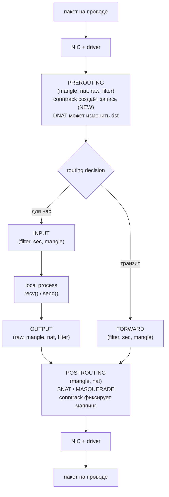
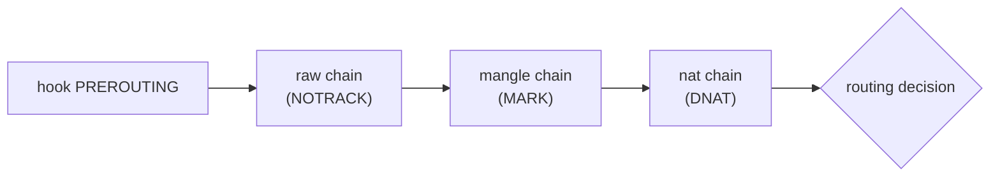
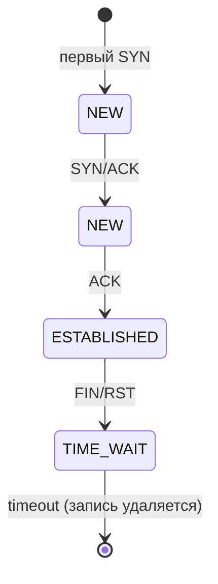
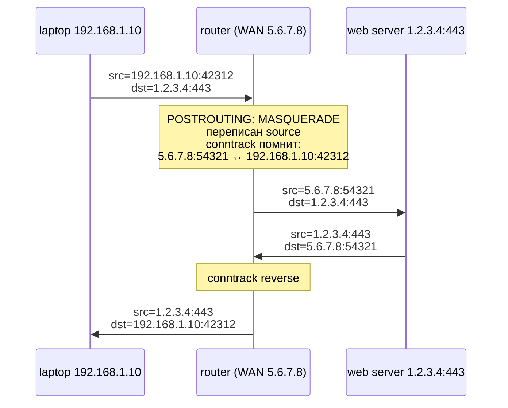

# netfilter, iptables, nftables, conntrack

Когда пакет проходит через Linux, kernel предоставляет точки, в которых пакет можно отбросить, изменить,
перенаправить, залогировать или передать в user-space. Эти точки и инфраструктура вокруг них называются
**netfilter** — kernel-фреймворк перехвата пакетов, существующий с ядра 2.4 (2000 год). Сам netfilter не имеет
правил; правила пишутся user-space инструментами — исторически `iptables`, начиная с 3.13 (2014) — `nftables`,
а в нагрузку идёт **connection tracking** (conntrack) для stateful решений.

Понимать этот стек нужно по нескольким причинам. firewall, NAT, port forwarding, transparent proxy, traffic
marking для QoS — всё это конфигурируется через netfilter. Docker, Kubernetes (`kube-proxy`), libvirt, podman
автоматически генерируют сотни правил, и без понимания, что они делают, отладка «почему контейнер не отвечает»
превращается в гадание. Производительность edge-нод (load balancer, NAT gateway) ограничена именно тем,
насколько эффективно netfilter (или его наследники — `nftables`, eBPF/XDP) обрабатывает миллионы пакетов в
секунду.

## netfilter: hooks в network stack

netfilter — это пять точек (hooks), в которые kernel вызывает зарегистрированные обработчики при прохождении
пакета через стек IPv4 (для IPv6, ARP, bridge — отдельные параллельные наборы):

| Hook            | Когда срабатывает                                          | Типичное применение           |
|-----------------|------------------------------------------------------------|-------------------------------|
| `PREROUTING`    | сразу после декодирования L3-заголовка, до routing         | DNAT, mark, raw, conntrack    |
| `INPUT`         | для пакетов, адресованных локальному socket                | filter входящего, INPUT chain |
| `FORWARD`       | для пакетов, маршрутизируемых через host (не локальных)    | filter транзитного трафика    |
| `OUTPUT`        | для пакетов, сгенерированных локальным процессом           | filter исходящего             |
| `POSTROUTING`   | непосредственно перед передачей пакета на link layer       | SNAT, MASQUERADE              |

Решение, какой из путей `INPUT`/`FORWARD` выбрать, принимается routing-кодом между `PREROUTING` и этими hooks.
То же для исходящего: routing выбирает выходной интерфейс между `OUTPUT` и `POSTROUTING`.



Каждый зарегистрированный обработчик возвращает одно из решений: `NF_ACCEPT` (пропустить дальше),
`NF_DROP` (молча выбросить), `NF_STOLEN` (обработчик забрал ownership, kernel дальше не трогает),
`NF_QUEUE` (передать в user-space через `NFQUEUE`), `NF_REPEAT` (вызвать обработчик снова). На этих
примитивах построены все user-space инструменты.

## iptables: tables, chains, targets

`iptables` — наиболее известный фронтенд к netfilter (написан в 2000 году Расти Расселом одновременно с
самим netfilter). Его модель — **tables** (наборы chains), **chains** (упорядоченные списки rules), **rules**
(matcher + target).

### Tables

| Table      | Назначение                                            | Hooks                                                |
|------------|-------------------------------------------------------|------------------------------------------------------|
| `filter`   | фильтрация (default table, ACCEPT/DROP/REJECT)        | `INPUT`, `FORWARD`, `OUTPUT`                         |
| `nat`      | трансляция адресов (DNAT, SNAT, MASQUERADE)           | `PREROUTING`, `INPUT`, `OUTPUT`, `POSTROUTING`       |
| `mangle`   | модификация заголовков (TOS, TTL, MARK)               | все пять                                             |
| `raw`      | отметка пакета до conntrack (`NOTRACK`)               | `PREROUTING`, `OUTPUT`                               |
| `security` | интеграция с SELinux (`SECMARK`)                      | `INPUT`, `FORWARD`, `OUTPUT`                         |

Порядок обхода tables на одном hook фиксирован: `raw → mangle → nat → filter → security`. На `PREROUTING`
сначала срабатывает `raw` (можно пометить пакет как `NOTRACK`, чтобы он не попал в conntrack),
потом `mangle` (модификация полей), потом `nat` (DNAT), и только после этого пакет уходит на routing decision.



### Chains

В каждой table предопределены **built-in chains** по числу hooks, в которых table работает. В `filter`
это `INPUT`, `FORWARD`, `OUTPUT`. Пользователь может создать свои **user-defined chains** —
именованные подпрограммы. Из built-in chain'а в user-defined переходят через target `JUMP`, возвращаются —
через `RETURN` или достижение конца chain'а.

```
filter table
┌──────────────────────────────────────────────────────────────┐
│                                                              │
│  INPUT chain                                                 │
│  ┌──────────────────────────────────────────────────────┐    │
│  │  rule 1:  state ESTABLISHED,RELATED  →  ACCEPT       │    │
│  │  rule 2:  iif lo                     →  ACCEPT       │    │
│  │  rule 3:                             →  jump SSH-IN  │    │
│  │  rule 4:  proto tcp dport 80         →  ACCEPT       │    │
│  │  default policy:                     →  DROP         │    │
│  └────────────────────────┬─────────────────────────────┘    │
│                           │                                  │
│                           ▼                                  │
│  SSH-IN chain (user-defined)                                 │
│  ┌──────────────────────────────────────────────────────┐    │
│  │  rule 1:  src 10.0.0.0/8              →  ACCEPT      │    │
│  │  rule 2:  src 0.0.0.0/0  match recent →  DROP        │    │
│  │  rule 3:  proto tcp dport 22          →  ACCEPT      │    │
│  │  (нет policy у user chain — fall back в INPUT)       │    │
│  └──────────────────────────────────────────────────────┘    │
└──────────────────────────────────────────────────────────────┘
```

Built-in chain имеет **default policy** (`ACCEPT` или `DROP`), которая срабатывает, если ни одно правило
не подошло. У user-defined chain policy нет — после прохода всех правил выполнение возвращается в
вызывающий chain (как из функции).

### Targets и verdicts

Result правила — это либо **verdict** (терминальное решение), либо **non-terminating target** (выполнить
действие и продолжить):

| Target        | Тип             | Действие                                                   |
|---------------|-----------------|------------------------------------------------------------|
| `ACCEPT`      | verdict         | пропустить пакет (выйти из chain)                          |
| `DROP`        | verdict         | молча выбросить                                            |
| `REJECT`      | verdict         | выбросить и отправить ICMP unreachable / TCP RST           |
| `RETURN`      | verdict         | вернуться в вызывающий chain                               |
| `JUMP`        | verdict         | прыгнуть в user-defined chain                              |
| `QUEUE`       | verdict         | передать пакет в user-space через `NFQUEUE`                |
| `LOG`         | non-terminating | записать в kernel log и продолжить                         |
| `MARK`        | non-terminating | поставить nfmark на skb (используется для policy routing)  |
| `DNAT`        | verdict         | заменить destination address/port                          |
| `SNAT`        | verdict         | заменить source address/port                               |
| `MASQUERADE`  | verdict         | как SNAT, но source IP = IP выходного интерфейса           |
| `REDIRECT`    | verdict         | DNAT на localhost (для transparent proxy)                  |
| `TPROXY`      | verdict         | transparent proxy без изменения адресов                    |

### Базовые примеры iptables

```bash
# заблокировать входящий трафик на TCP-порт 8080
iptables -A INPUT -p tcp --dport 8080 -j DROP

# разрешить SSH только из подсети 10.0.0.0/8
iptables -A INPUT -p tcp --dport 22 -s 10.0.0.0/8 -j ACCEPT
iptables -A INPUT -p tcp --dport 22                 -j DROP

# принимать ответы на исходящие соединения
iptables -A INPUT -m conntrack --ctstate ESTABLISHED,RELATED -j ACCEPT

# NAT для контейнеров: маскарад исходящего из 172.17.0.0/16
iptables -t nat -A POSTROUTING -s 172.17.0.0/16 -o eth0 -j MASQUERADE

# port forwarding 80 → 8080 на бэкенд
iptables -t nat -A PREROUTING -p tcp --dport 80 -j DNAT --to-destination 10.0.0.2:8080
iptables -A FORWARD -p tcp -d 10.0.0.2 --dport 8080 -j ACCEPT

# rate-limit входящих SYN (защита от SYN flood)
iptables -A INPUT -p tcp --syn -m limit --limit 20/sec --limit-burst 30 -j ACCEPT
iptables -A INPUT -p tcp --syn -j DROP
```

### Производительность iptables

iptables хранит rules как последовательный список. Для каждого пакета каждое правило проверяется по очереди,
сложность — O(N). На сотнях правил это незаметно, на десятках тысяч (характерно для `kube-proxy` в большом
Kubernetes-кластере) — bottleneck. Частичное лекарство — `ipset`: hash/tree-структуры под IP/port/MAC, к
которым правило обращается одним match'ем.

```bash
# вместо тысячи правил "block IP X" — один ipset и одно правило
ipset create blacklist hash:ip
ipset add  blacklist 1.2.3.4
ipset add  blacklist 5.6.7.8
iptables -A INPUT -m set --match-set blacklist src -j DROP
```

## nftables: замена iptables

`nftables` появился в Linux 3.13 (2014) как наследник iptables. Изначально цель — устранить дублирование между
`iptables` (IPv4), `ip6tables` (IPv6), `arptables` (ARP), `ebtables` (bridge), у каждого из которых был свой
синтаксис, свой набор tables, свои демоны. Все четыре заменяет одна утилита `nft` и одна kernel-инфраструктура.

### Виртуальная машина

Главное архитектурное отличие: iptables хранит правила как статически скомпилированные C-структуры с
match-функциями, а nftables компилирует ruleset в **байт-код для виртуальной машины** (по образцу BPF) и
выполняет его на каждом пакете. Это даёт:

- единый verifier (правила проверяются один раз при загрузке);
- атомарную замену всего ruleset (`nft -f new.rules`) — никакого окна, когда часть правил уже изменена,
  а часть ещё старая;
- более выразительный язык (одно правило может матчить произвольную комбинацию полей нескольких
  протоколов);
- лучшую производительность за счёт **native sets и maps** с lookup O(1).

```
            iptables                                  nftables
   ┌──────────────────────┐                  ┌──────────────────────┐
   │  rule 1: match X     │                  │   nft VM bytecode    │
   │  rule 2: match Y     │                  │  ┌────────────────┐  │
   │  rule 3: match Z     │                  │  │ load r1, ip.sa │  │
   │  ...                 │                  │  │ lookup set bl  │  │
   │  rule N              │                  │  │ jeq match,drop │  │
   └──────────┬───────────┘                  │  │ ...            │  │
              │                              │  └────────────────┘  │
              ▼                              └──────────┬───────────┘
       O(N) перебор                                     │
                                                        ▼
                                               O(1) set lookup
```

### Базовые примеры nftables

```bash
# создать table и chain
nft add table inet filter
nft add chain inet filter input  { type filter hook input  priority 0 \; policy drop \; }
nft add chain inet filter output { type filter hook output priority 0 \; policy accept \; }

# разрешить established/related
nft add rule inet filter input ct state established,related accept

# разрешить SSH с одного диапазона
nft add rule inet filter input ip saddr 10.0.0.0/8 tcp dport 22 accept

# native set: блок-лист IP, добавление без перезагрузки
nft add set inet filter blacklist { type ipv4_addr \; flags interval \; }
nft add element inet filter blacklist { 1.2.3.4, 5.6.7.0/24 }
nft add rule inet filter input ip saddr @blacklist drop

# map: port → backend для port forwarding
nft add map inet nat fwd { type inet_service : ipv4_addr \;}
nft add element inet nat fwd { 80 : 10.0.0.2, 443 : 10.0.0.3 }

# просмотр всего ruleset
nft list ruleset
```

### Семейства таблиц

| Family   | Покрытие                       | Аналог iptables  |
|----------|--------------------------------|------------------|
| `ip`     | только IPv4                    | `iptables`       |
| `ip6`    | только IPv6                    | `ip6tables`      |
| `inet`   | IPv4 + IPv6 (общие правила)    | —                |
| `arp`    | ARP                            | `arptables`      |
| `bridge` | bridge frames                  | `ebtables`       |
| `netdev` | ingress hook драйвера (как XDP)| —                |

Семейство `inet` снимает необходимость дублировать ruleset для IPv4 и IPv6 — частая ошибка в iptables-инсталляциях,
когда `ip6tables` забывают настроить и хост открыт по IPv6.

### Сравнение iptables vs nftables

| Свойство               | iptables                                      | nftables                                   |
|------------------------|-----------------------------------------------|--------------------------------------------|
| Архитектура rules      | static C structures                           | bytecode для VM                            |
| Match performance      | O(N) перебор                                  | O(1) для set/map lookup                    |
| Atomic replace         | нет (по правилу за раз)                       | да (`nft -f`)                              |
| Утилиты для семейств   | `iptables`,`ip6tables`,`arptables`,`ebtables` | одна `nft`                                 |
| Sets                   | через `ipset` (внешний)                       | native `nft set`                           |
| Maps (verdict map)     | нет                                           | native                                     |
| Counters               | в каждом rule всегда                          | опциональны (`counter`) — экономия памяти  |
| Tracing                | `TRACE` target + log                          | `nft monitor trace`                        |
| Минимальное ядро       | 2.4+                                          | 3.13+                                      |
| Зрелость экосистемы    | максимальная                                  | Docker/k8s начали переходить с 2022–2024   |

### Миграция

Утилита `iptables-translate` (или `iptables-restore-translate`) конвертирует существующий ruleset в
`nft`-синтаксис:

```bash
iptables-translate -A INPUT -p tcp --dport 80 -j ACCEPT
# nft add rule ip filter INPUT tcp dport 80 counter accept

# полная миграция:
iptables-save | iptables-restore-translate -f - > new.nft
nft -f new.nft
```

Современные дистрибутивы (Debian 11+, RHEL 8+, Ubuntu 22.04+) уже используют `nftables` под капотом, а
бинарь `iptables` — это shim `iptables-nft`, который преобразует команды на лету. Узнать, какой backend
используется:

```bash
iptables --version
# iptables v1.8.7 (nf_tables)        ← shim, реальный backend — nftables
# iptables v1.8.7 (legacy)           ← старый ip_tables backend
```

## conntrack: connection tracking

Stateless firewall смотрит только на отдельный пакет: tuple `(src, dst, sport, dport, proto)`. Этого
недостаточно для двух классических задач:

1. Различить «ответ на наш запрос» (`ESTABLISHED`) и «новое соединение извне» (`NEW`) — нужно для безопасного
   firewall: «разрешить любой исходящий и любой ответ, но никаких входящих NEW».
2. NAT: когда мы заменили source-адрес на исходящем пакете, ответ придёт на изменённый адрес — нужно
   запомнить mapping, чтобы при возврате применить обратную трансляцию.

Эти задачи решает **conntrack** — подсистема netfilter, которая для каждого нового соединения создаёт запись и
обновляет её при каждом следующем пакете.

### Состояния соединения

| State         | Когда                                                                                 |
|---------------|---------------------------------------------------------------------------------------|
| `NEW`         | первый пакет, который выглядит валидным (для TCP — SYN)                               |
| `ESTABLISHED` | обе стороны обменялись пакетами (рукопожатие закончилось)                             |
| `RELATED`     | пакет относится к существующему соединению, но открывает новое (FTP-data, ICMP error) |
| `INVALID`     | пакет не подходит ни к одному соединению (повреждённый, out-of-window)                |
| `UNTRACKED`   | пакет помечен в `raw`-table как `NOTRACK`                                             |



### Таблица conntrack

Все записи хранятся в hash-таблице в kernel, доступной через `/proc/net/nf_conntrack` или удобную утилиту:

```bash
# посмотреть текущие соединения
conntrack -L

# пример вывода:
# tcp  6 431999 ESTABLISHED src=10.0.0.5 dst=1.1.1.1 sport=42312 dport=443 \
#                           src=1.1.1.1 dst=10.0.0.5 sport=443 dport=42312 \
#                           [ASSURED] mark=0 use=1
```

Каждая запись содержит **две tuple**: original direction (как пакет ушёл) и reply direction (как пришёл
ответ). Если NAT изменил адреса — reply tuple содержит изменённые адреса, и при возврате пакет матчится по
reply tuple, после чего conntrack делает обратную трансляцию (это и есть «stateful NAT»).

### Размер и тюнинг

Таблица conntrack — это hash table фиксированного размера. На NAT-шлюзе или нагруженном сервере она быстро
исчерпывается, и тогда пакеты новых соединений просто отбрасываются:

```bash
# текущий лимит
sysctl net.netfilter.nf_conntrack_max
# обычно 65536 или 262144

# текущее количество
cat /proc/sys/net/netfilter/nf_conntrack_count

# увеличить (помнить: каждая запись ~320 байт)
sysctl -w net.netfilter.nf_conntrack_max=1048576
sysctl -w net.netfilter.nf_conntrack_buckets=262144   # размер hash table

# таймауты состояний — сократить, если ESTABLISHED висят слишком долго
sysctl -w net.netfilter.nf_conntrack_tcp_timeout_established=3600
```

При переполнении ядро пишет в dmesg: `nf_conntrack: table full, dropping packet` — характерный симптом,
который надо знать.

### Helpers (ALG)

Некоторые протоколы используют control-канал и отдельный data-канал на динамическом порту: FTP (active mode),
SIP, IRC, PPTP, H.323. Conntrack-helper парсит control-канал и заранее создаёт expectation для data-канала,
чтобы тот матчился как `RELATED`:

```bash
# подгрузить FTP-helper
modprobe nf_conntrack_ftp

# в nftables поместить трафик в helper-зону
nft add rule inet filter input ct helper "ftp" accept
```

Helper'ы — потенциальная attack surface (CVE в helper'ах находили), поэтому в современных дистрибутивах они
не загружаются по умолчанию, и активировать их надо явно.

## NAT: SNAT, DNAT, MASQUERADE, REDIRECT

NAT (Network Address Translation) — переписывание адресов и портов в L3/L4 заголовках. В netfilter NAT
работает **поверх conntrack**: трансляция применяется только к первому пакету соединения (`NEW`), все
остальные пакеты в обе стороны транслируются по уже сохранённой mapping-записи в conntrack.

| Тип          | Что меняет                | Hook          | Зачем                                   |
|--------------|---------------------------|---------------|-----------------------------------------|
| `SNAT`       | source IP/port            | `POSTROUTING` | исходящий с приватной сети наружу       |
| `DNAT`       | destination IP/port       | `PREROUTING`  | port forwarding, expose внутреннего host|
| `MASQUERADE` | SNAT на IP выходного intf | `POSTROUTING` | SNAT когда внешний IP динамический      |
| `REDIRECT`   | destination → 127.0.0.1   | `PREROUTING`  | transparent proxy на локальный listener |



`MASQUERADE` отличается от обычного `SNAT` тем, что при падении интерфейса все его соединения сбрасываются —
SNAT в этой ситуации продолжал бы пытаться использовать старый IP. На стабильных static IP лучше явный `SNAT` —
быстрее, не делает per-packet lookup IP интерфейса.

## Использование на практике

### Docker

Docker автоматически создаёт сложную сеть правил для bridge networking:

```bash
iptables -t nat -L DOCKER -n
# Chain DOCKER (2 references)
# target     prot opt source        destination
# RETURN     all  --  0.0.0.0/0     0.0.0.0/0
# DNAT       tcp  --  0.0.0.0/0     0.0.0.0/0  tcp dpt:8080 to:172.17.0.2:80
```

Ключевые chain'ы, которые создаёт Docker:

| Chain                        | Table  | Назначение                                                |
|------------------------------|--------|-----------------------------------------------------------|
| `DOCKER`                     | nat    | DNAT для `-p host:container` маппинга                     |
| `DOCKER-USER`                | filter | пользовательские правила, выполняются до Docker'овских    |
| `DOCKER-ISOLATION-STAGE-1/2` | filter | изоляция между разными bridge-сетями                      |
| `DOCKER`                     | filter | разрешить трафик к контейнерам                            |

Поэтому в Docker'ной системе нельзя просто `iptables -P FORWARD DROP` — это сломает контейнерную сеть.
Правильное место для пользовательских правил — chain `DOCKER-USER`, гарантированно выполняемый до правил Docker.

### Kubernetes kube-proxy

`kube-proxy` реализует Service-абстракцию (виртуальный IP, балансируемый на pod'ы). Эволюция backend'ов:

| Mode      | Доступен с             | Как работает                  | Масштабируемость                    |
|-----------|------------------------|-------------------------------|-------------------------------------|
| userspace | 1.0                    | TCP-прокси в user-space       | ужасная (две копии в kernel↔user)   |
| iptables  | 1.1 (2015)             | DNAT-правила в `nat`-table    | O(N) по числу Services, deprecated  |
| ipvs      | 1.11 (2018)            | L4 LB в kernel (hash-таблицы) | O(1), 1000+ Services без проблем    |
| eBPF      | вне kube-proxy: Cilium | XDP/TC eBPF, O(1)             | максимальная                        |

iptables-режим для кластера на 5000 Services генерирует ~25000 правил; перезагрузка ruleset при изменении
любого endpoint занимает секунды и блокирует netfilter (нет atomic replace для iptables). Это — основная
причина миграции на ipvs или eBPF.

### High-level обёртки

| Утилита     | Поверх              | Аудитория                                    |
|-------------|---------------------|----------------------------------------------|
| `ufw`       | iptables / nftables | Ubuntu, простой fw для desktop/server        |
| `firewalld` | nftables            | RHEL/Fedora, zones (public/home/work)        |
| `shorewall` | iptables            | сложные конфиги через декларативные файлы    |
| `nftables`  | сам себе            | низкоуровневый, рекомендуется для нового     |

## Tools

```bash
# iptables: посмотреть текущий ruleset с числом пакетов
iptables -L -n -v --line-numbers

# сохранить/восстановить
iptables-save > /etc/iptables.rules
iptables-restore < /etc/iptables.rules

# nftables
nft list ruleset
nft list table inet filter
nft -f /etc/nftables.conf

# conntrack
conntrack -L                          # список соединений
conntrack -E                          # events realtime
conntrack -D --dst 10.0.0.1           # удалить конкретные записи
cat /proc/sys/net/netfilter/nf_conntrack_count

# tracing: куда уходит конкретный пакет в ruleset
nft monitor trace
iptables -t raw -I PREROUTING -p tcp --dport 80 -j TRACE
dmesg -w   # смотреть результат TRACE
```

## Граница: где netfilter перестаёт быть лучшим решением

Для нескольких десятков-сотен правил на host'е netfilter — оптимальный выбор. Для edge-нод с миллионами
пакетов в секунду (load balancer, DDoS protection, NAT-gateway телеком-оператора) у него заканчивается
бюджет:

- iptables линеен по числу правил, nftables — лучше за счёт sets, но всё равно softirq context;
- conntrack — обязательная hash-таблица, на 1+ Mpps превращается в bottleneck;
- путь через стек до `PREROUTING` уже включает allocation `sk_buff` и парсинг L2/L3.

Здесь начинается территория **eBPF/XDP** — пакет обрабатывается до allocation `sk_buff`, можно ответить или
дропнуть на десятки Mpps на ядро. Cilium заменил kube-proxy именно потому, что iptables-режим не масштабируется.
Facebook Katran (replacement для IPVS) — XDP. AWS использует свои аналоги.

## Связанные темы

- [Сетевой стек Linux изнутри](network_stack_internals.md) — где `PREROUTING`/`POSTROUTING` сидят в общем пути пакета
- [eBPF в сетевом стеке](../ebpf/networking.md) — XDP/TC как преемник netfilter для high-performance
- [Внутреннее устройство контейнеров](../isolation/containers_internals.md) — как Docker строит bridge-сеть поверх iptables
- [Linux namespaces](../isolation/namespaces.md) — network namespace, у каждого свой ruleset netfilter

## Источники

- [The netfilter.org project](https://www.netfilter.org/)
- [nftables wiki](https://wiki.nftables.org/wiki-nftables/index.php/Main_Page)
- [Performance comparison: iptables vs nftables — Red Hat](https://developers.redhat.com/blog/2017/04/11/migrating-my-iptables-setup-to-nftables)
- [conntrack-tools manual](https://conntrack-tools.netfilter.org/manual.html)
- [Kubernetes kube-proxy modes](https://kubernetes.io/docs/reference/networking/virtual-ips/)
- `man 8 iptables`, `man 8 nft`, `man 8 conntrack`
