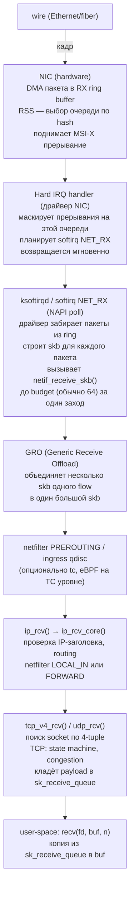
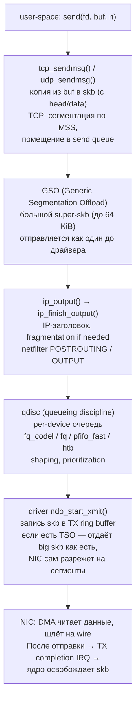
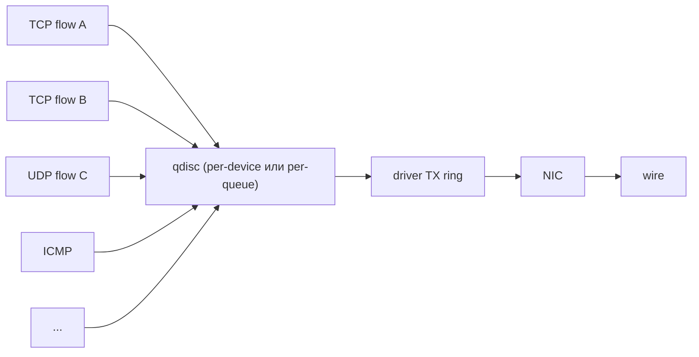
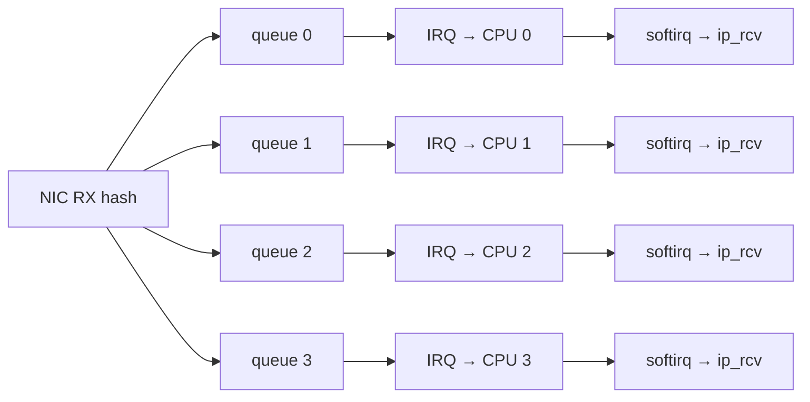
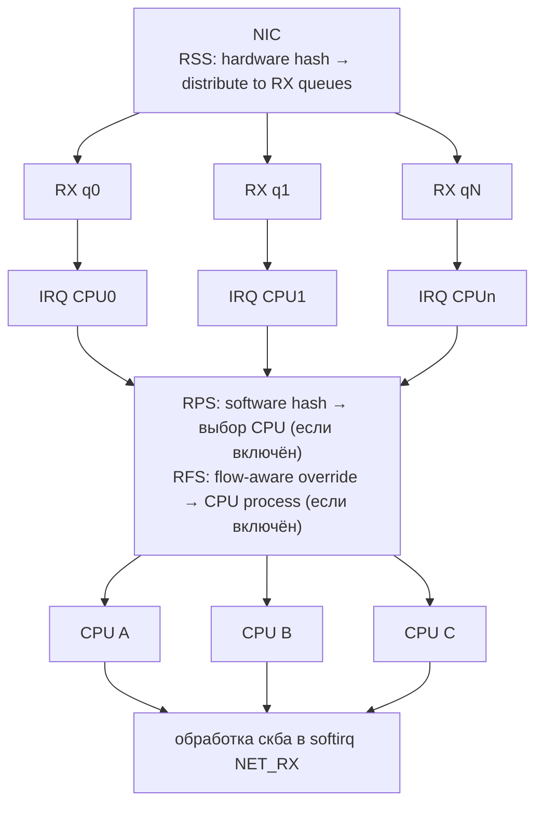
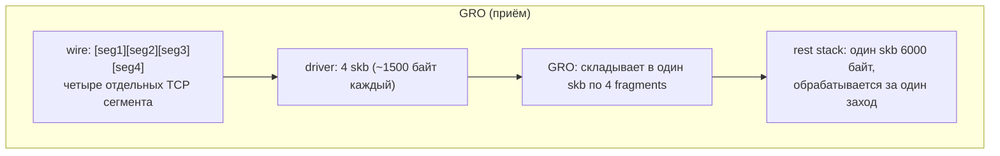
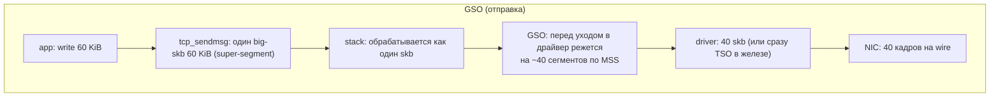
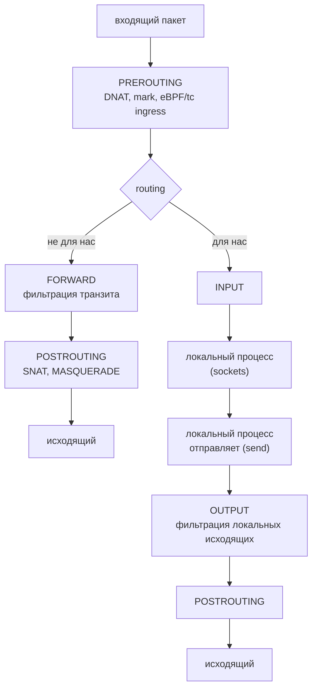
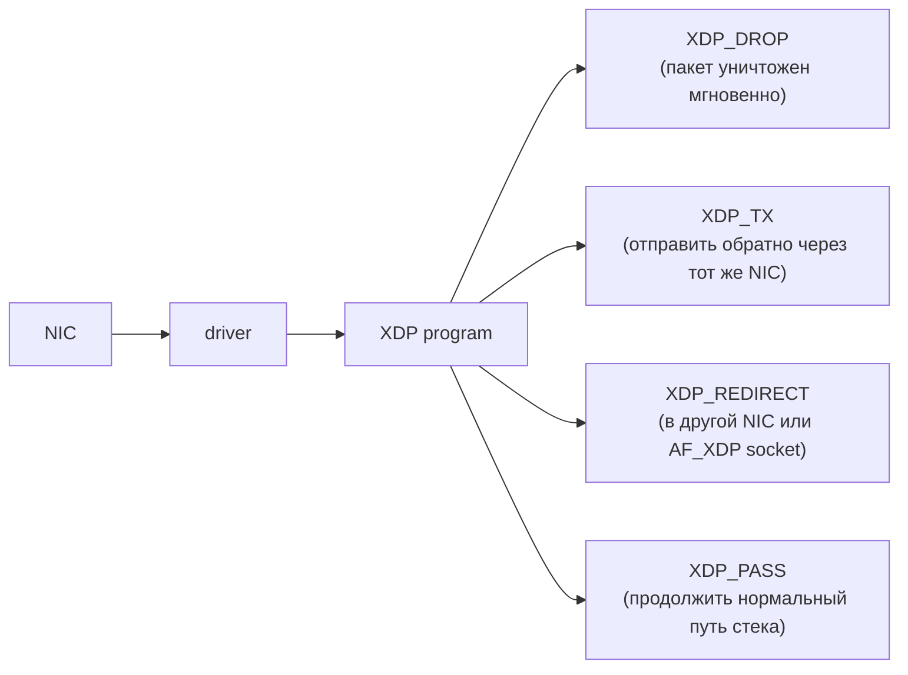

# Linux network stack изнутри

API сокетов — `recv()`/`send()` — это вершина айсберга. Под ним лежат десятки тысяч строк кода ядра:
драйверы сетевых карт, обработчики прерываний, реализации протоколов IPv4/IPv6/TCP/UDP, очереди
qdisc, фильтры netfilter, точки eBPF. Когда пакет приходит на NIC и до момента, когда `recv()`
возвращает данные приложению, он проходит десяток подсистем. Когда `send()` отдаёт байты — они
проходят такой же путь в обратную сторону.

Понимать этот путь нужно по нескольким причинам. Во-первых, тюнинг производительности (10 Gbps, 100
Gbps line rate) невозможен без знания, где именно теряется bandwidth. Во-вторых, отладка странных
проблем — потери пакетов, всплески латентности, mysterious retransmits — требует точно знать, где
смотреть счётчики. В-третьих, eBPF, XDP, DPDK и любые современные user-space сетевые фреймворки
строятся вокруг тех же абстракций, что и kernel-стек.

## Путь пакета на приём

Когда NIC получает пакет, он не «прерывает» CPU напрямую при каждом фрейме — это убило бы систему на
gigabit-скоростях. Современная схема — **interrupt + polling** (NAPI).



Ключевая оптимизация на этом пути — **NAPI**: после первого прерывания драйвер не получает новые
interrupts, пока крутит цикл polling. На скоростях 1+ Gpps interrupt rate был бы запретительным;
polling амортизирует overhead.

## Путь пакета на передачу

Зеркальный путь от `send()` до wire:



## sk_buff: универсальный контейнер пакета

В центре всего стека — структура **`sk_buff`** (socket buffer, в коде обычно `skb`). Это контейнер
для одного пакета на любом этапе обработки: тот же объект существует от драйвера до момента, когда
`recv()` забирает данные.

`sk_buff` хитро устроен. Сам объект — это метаданные; собственно payload лежит в отдельной области
**data buffer**, на которую smb указывает четырьмя указателями: `head`, `data`, `tail`, `end`.

```
struct sk_buff (метаданные)
┌────────────────────────────────┐
│ next, prev    (список skb)     │
│ sk            (owning socket)  │
│ dev           (input/output)   │
│ len, data_len (длины)          │
│ protocol      (ethertype)      │
│ priority, mark, hash, ...      │
│ transport_header (offset)      │  ← смещение TCP/UDP-заголовка
│ network_header   (offset)      │  ← смещение IP-заголовка
│ mac_header       (offset)      │  ← смещение Ethernet-заголовка
│                                │
│   head ────┐                   │
│   data ──┐ │                   │
│   tail ─┐│ │                   │
│   end ─┐││ │                   │
└────────┼┼┼┼───────────────────-┘
         ││││
         ▼▼▼▼
data buffer (отдельная аллокация, обычно из page allocator)
┌────────────┬───────────────────────────┬─────────┬──────┐
│ head ──▶   │  data ──▶ ... ── ▶ tail   │  tail   │ end  │
│  headroom  │      payload пакета       │ tailroom│      │
└────────────┴───────────────────────────┴─────────┴──────┘
   ▲             ▲                          ▲         ▲
   head          data                       tail      end

   data − head = текущее место, где начинается полезный payload
   tail − data = длина полезного payload (тело + заголовки выше)
   end  − tail = свободное место после payload (tailroom)

   headroom используется, когда стек добавляет заголовки
   (TCP над приложенческими данными, IP над TCP, Ethernet над IP):
   просто сдвигает data назад, без копирования.
```

### Зачем такая структура

- **Безкопийное добавление заголовков.** Когда `tcp_sendmsg` создаёт skb, он резервирует headroom под
  все будущие заголовки. IP-стек, Ethernet-драйвер дописывают свои заголовки в начало `data`, сдвигая
  его назад — без `memcpy`.
- **Безкопийное снятие заголовков.** На приёме `data` просто двигается вперёд после разбора каждого
  заголовка. Тот же skb доходит до сокета без копирования payload.
- **Scatter-gather через `skb_shared_info.frags[]`.** Большой skb может ссылаться на несколько
  отдельных страниц (для TSO/GSO, sendfile, fragmented packets). Драйвер передаёт DMA-список в NIC,
  опять без копирования.

```
SG skb (один skb, payload в нескольких страницах)
┌────────────────────────────────┐
│ struct sk_buff metadata        │
│  ...                           │
│  end ──┐                       │
└────────┼───────────────────────┘
         │
         ▼
┌─────────────────────────────────────────────────────────┐
│ head                                              end   │
│ ┌──── linear part ───┐    skb_shared_info               │
│ │ заголовки + начало │    ┌─────────────────────────┐   │
│ │ данных             │    │ nr_frags = 3            │   │
│ └────────────────────┘    │ frags[0] → page A, len  │   │
│                           │ frags[1] → page B, len  │   │
│                           │ frags[2] → page C, len  │   │
│                           └─────────────────────────┘   │
└─────────────────────────────────────────────────────────┘
                                 │
                                 ▼
            ┌─────────┐     ┌─────────┐     ┌─────────┐
            │ page A  │     │ page B  │     │ page C  │
            │ payload │     │ payload │     │ payload │
            └─────────┘     └─────────┘     └─────────┘
```

Это даёт zero-copy для `sendfile(2)`, `splice(2)`, MSG_ZEROCOPY: данные читаются с диска в page
cache, оттуда напрямую идут в NIC без копирования в kernel buffer.

## NAPI: polling вместо прерываний

Без NAPI на каждый пакет генерируется отдельный hard IRQ. Прерывание — это:

- сохранение контекста CPU;
- переход в IRQ handler с маскированием прерываний;
- запуск softirq;
- восстановление контекста.

На скорости 1 Mpps это десятки тысяч прерываний в секунду — overhead становится сравним с полезной
работой. Хуже, если злоумышленник специально шлёт мелкие пакеты — **interrupt storm**, который
полностью забивает CPU обработкой IRQ, не оставляя времени user-space.

**NAPI** (New API, с ядра 2.4.20) переключается между двумя режимами:

```mermaid
flowchart TB
    subgraph IDLE["Idle / низкий трафик"]
        i1[NIC → IRQ → драйвер] --> i2[планируем napi_schedule]
        i2 --> i3[softirq NET_RX poll]
        i3 --> i4["получили < budget пакетов"]
        i4 --> i5[размаскируем IRQ, выходим]
    end
    subgraph HIGH["Высокий трафик"]
        h1[NIC → IRQ → драйвер] --> h2[маскируем IRQ]
        h2 --> h3[softirq NET_RX poll]
        h3 --> h4[получили budget пакетов]
        h4 --> h5["повторно планируем poll<br/>(без размаскивания IRQ)"]
        h5 --> h6[следующая итерация poll<br/>пока есть пакеты или budget исчерпан]
    end
```



Ключевые параметры:

```bash
# Лимит пакетов за один poll, чтобы не монополизировать softirq
sysctl net.core.netdev_budget          # default: 300

# Время в микросекундах на softirq
sysctl net.core.netdev_budget_usecs    # default: 8000

# Сколько раз пакет может быть пере-помещён в backlog
sysctl net.core.netdev_max_backlog     # default: 1000

# Per-CPU счётчики softirq
cat /proc/net/softnet_stat
# каждая строка = один CPU, hex-значения:
# processed, dropped, time_squeeze, ..., backlog_len
```

`time_squeeze` — растёт, когда softirq исчерпывает budget и не успевает обработать всё. Сигнал, что
надо повышать budget или включать RPS.

## Qdisc: очереди на выход

На стороне TX каждое сетевое устройство имеет одну или несколько очередей **qdisc** (queueing
discipline). Qdisc — это слой между IP-стеком и драйвером, отвечающий за порядок отправки пакетов,
shaping и QoS.



Стандартные qdisc:

| Qdisc           | Что делает                                                           |
|-----------------|----------------------------------------------------------------------|
| `pfifo_fast`    | три полосы по приоритету IP TOS, FIFO внутри полосы (старый default) |
| `fq_codel`      | fair queueing + CoDel AQM против bufferbloat (рекомендуемый default) |
| `fq`            | per-flow queueing, pacing для TCP (нужен для BBR)                    |
| `htb`           | Hierarchical Token Bucket — иерархическое shaping (rate limiting)    |
| `tbf`           | Token Bucket Filter — простой rate limiter                           |
| `mq` / `mqprio` | multi-queue: каждая аппаратная TX-очередь имеет свою sub-qdisc       |
| `noqueue`       | без буферизации, для виртуальных устройств (loopback, bridge)        |

```bash
# Что стоит сейчас
tc qdisc show dev eth0

# Сменить на fq_codel
sudo tc qdisc replace dev eth0 root fq_codel

# Включить fq для BBR pacing
sudo tc qdisc replace dev eth0 root fq

# HTB с rate limit
sudo tc qdisc add dev eth0 root handle 1: htb default 10
sudo tc class add dev eth0 parent 1: classid 1:10 htb rate 100mbit
```

**Bufferbloat** — патологическое заполнение буферов промежуточных устройств, дающее задержки в
сотни мс. `fq_codel` решает это через AQM (Active Queue Management): пакеты в очереди дольше target
delay (5 мс) помечаются ECN или дропаются, заставляя TCP снизить cwnd.

## RSS / RPS / RFS: масштабирование по CPU

На скоростях 10+ Gbps один CPU не справляется с обработкой всех пакетов. Решение —
**распараллеливание по очередям и CPU**.

### RSS (Receive Side Scaling) — аппаратное

NIC имеет несколько RX-очередей (обычно по числу CPU). Для каждого входящего пакета NIC считает
hash от полей (src_ip, dst_ip, src_port, dst_port) и выбирает очередь. Каждая очередь привязана к
отдельному CPU через MSI-X.



Один TCP flow попадает всегда на одну очередь (хэш стабилен) → нет переупорядочивания внутри flow.

```bash
# Сколько RX-очередей поддерживает NIC и сколько включено
ethtool -l eth0

# Включить максимум
sudo ethtool -L eth0 combined 16

# Привязка IRQ к CPU
cat /proc/interrupts | grep eth0
# echo CPU_MASK > /proc/irq/<N>/smp_affinity
```

### RPS (Receive Packet Steering) — программное

Если NIC без RSS (или RSS-очередей меньше, чем CPU), RPS делает то же самое в software: hard IRQ
прилетает на один CPU, но дальше ядро вычисляет hash и перебрасывает skb на нужный CPU через
backlog queue. Включается отдельно для каждой RX-очереди:

```bash
# bitmask CPU для очереди rx-0
echo ffff > /sys/class/net/eth0/queues/rx-0/rps_cpus
```

### RFS (Receive Flow Steering) — flow-aware

RPS распределяет по hash вслепую. RFS дополнительно отслеживает, на каком CPU работает процесс с
этим socket, и направляет пакет именно туда — чтобы данные оказались в локальном L1/L2 кэше нужного
CPU.

```bash
sysctl net.core.rps_sock_flow_entries        # размер flow table (например, 32768)
echo 4096 > /sys/class/net/eth0/queues/rx-0/rps_flow_cnt
```

### Иерархия



На правильно настроенном 100 Gbps сервере с 32 CPU все 32 ядра одинаково загружены softirq, и
система держит 10+ Mpps без single-CPU bottleneck.

## GRO / GSO: батчинг в software

Обрабатывать каждый ~1500-байтный TCP-сегмент отдельно — большой overhead на per-skb path. **GRO**
(Generic Receive Offload) и **GSO** (Generic Segmentation Offload) объединяют последовательные
пакеты одного flow в один большой skb на границе драйвера.





**TSO/LRO** (TCP Segmentation Offload / Large Receive Offload) — аппаратные аналоги: NIC сам режет
большой буфер на TCP-сегменты или собирает входящие сегменты в один. TSO почти всегда выгоден; LRO
исторически проблемный (нельзя forward'ить такие пакеты), на сервере-маршрутизаторе его выключают,
оставляя только software GRO.

```bash
# Какие offloads включены
ethtool -k eth0

# Выключить TSO
sudo ethtool -K eth0 tso off

# Включить GRO (обычно уже on)
sudo ethtool -K eth0 gro on
```

## Netfilter hooks: где живут iptables и nftables

Netfilter — каркас фильтрации, в котором определены пять хуков на пути пакета. Iptables, nftables,
conntrack, NAT — всё цепляется именно к этим хукам.



```bash
# Старая утилита (legacy)
iptables -L -n -v
iptables -t nat -L -n -v

# Современная (nftables)
nft list ruleset
nft list table inet filter
```

Каждое правило стоит времени; на горячем сервере с тысячами правил netfilter может стать узким
местом. Альтернатива — eBPF на TC ingress, который компилируется в JIT и работает в разы быстрее.

## eBPF и XDP: программирование стека

**eBPF** (extended Berkeley Packet Filter) — виртуальная машина в ядре, в которую можно загружать
безопасные программы и цеплять их к разным точкам стека. Для сети используются два уровня:

### XDP (eXpress Data Path)

Программа eBPF подключается **на самой ранней стадии RX**, ещё до построения полного skb — прямо в
драйвере или даже на NIC (offloaded XDP). Это самый быстрый путь обработки пакета в Linux: для
DROP/REDIRECT/PASS принимается решение до того, как ядро потратилось на аллокацию skb.



Используется для DDoS-mitigation (миллионы pps дропов на CPU), load balancing (Cloudflare,
Facebook Katran), zero-copy user-space сетевых стеков через AF_XDP.

### TC eBPF

Программа eBPF цепляется к qdisc level (ingress или egress). Уже есть полный skb, скорость ниже
XDP, но возможностей больше (доступ к sockets, classification, modification).

Подробное обсуждение eBPF — отдельная тема; здесь важно понимать, что вся новая «cloud-native»
сетевая обвязка (Cilium, Calico eBPF dataplane) построена вокруг этих двух точек.

## Диагностика и инструменты

### Состояние сокетов

```bash
ss -tan                        # TCP, все состояния
ss -uan                        # UDP
ss -tinp                       # TCP с детальной info (cwnd, rtt, ...)
ss -lntp                       # слушающие сокеты + PID
ss -s                          # сводка по протоколам и состояниям
```

### Per-device статистика

```bash
# Базовые счётчики
ip -s link show eth0

# Подробные счётчики драйвера/NIC
ethtool -S eth0 | grep -E 'drop|err|miss'

# Multi-queue загрузка
mpstat -P ALL 1                # %soft per CPU
```

### Внутренние счётчики стека

```bash
# Сводка по подсистемам сети
nstat -a | grep -E 'Tcp|Udp|Ip'

# Подробно (legacy формат)
netstat -s

# Per-CPU softirq статистика NET_RX/NET_TX
cat /proc/net/softnet_stat
# колонки в hex: processed, dropped, time_squeeze, _, _, _, cpu_collision, received_rps, flow_limit
```

### Qdisc и tc

```bash
tc -s qdisc show dev eth0      # включая drops/overlimits
tc -s class show dev eth0      # для htb/мульти-класс qdisc
```

### Трассировка пакетов

```bash
# tcpdump на уровне stack
sudo tcpdump -i eth0 -nn 'port 443'

# bpftrace для глубокой трассировки
sudo bpftrace -e 'kprobe:tcp_v4_rcv { @[comm] = count(); }'

# perf события сетевых функций
sudo perf record -g -e net:net_dev_xmit -a sleep 5
```

## Производительность: куда обычно упирается

- **Single-CPU bottleneck.** RSS/RPS не настроены, весь трафик жмётся в softirq одного ядра. Видно
  как `%soft = 100` на одном CPU в `mpstat`.
- **time_squeeze > 0.** Softirq не успевает обработать budget. Поднять `netdev_budget`, включить
  RPS, проверить IRQ affinity.
- **Drop на qdisc.** `tc -s qdisc` показывает overlimits/drops. Сменить qdisc (fq_codel), увеличить
  buffer, либо source приложение шлёт быстрее линка — нужна шейпер.
- **Drop на NIC.** `ethtool -S | grep drop` показывает `rx_missed`, `rx_no_buffer`. RX-ring мал или
  IRQ не обрабатывается вовремя. Увеличить ring (`ethtool -G eth0 rx 4096`), привязать IRQ к
  отдельному CPU.
- **Conntrack table full.** При высоком rate новых соединений conntrack table переполняется,
  пакеты дропаются. `cat /proc/sys/net/netfilter/nf_conntrack_max`, поднять; либо `NOTRACK` для
  трафика, не нуждающегося в connection tracking.
- **NUMA misalignment.** NIC подключён к одному NUMA node, обработчики работают на другом — каждый
  пакет идёт через интерконнект. Привязать IRQ и обрабатывающие процессы к node того PCIe-slot, где
  стоит NIC.

## Связанные темы

- [Сокеты: API и базовые понятия](sockets_basics.md) — `socket`, `bind`, `recv`, `send` — точка входа в стек
- [TCP и UDP: протоколы и тонкости](tcp_udp.md) — что делает `tcp_v4_rcv`, congestion control, TIME_WAIT
- [I/O multiplexing](io_multiplexing.md) — epoll и event-driven серверы поверх сокетов
- [io_uring](io_uring.md) — async I/O API, обходящий часть стека через registered sockets
- [NUMA](../memory/numa.md) — почему IRQ affinity и RPS должны учитывать NUMA-топологию

## Источники

- [Kernel Documentation: networking/](https://www.kernel.org/doc/html/latest/networking/index.html)
- [Kernel Documentation: networking/scaling.rst](https://www.kernel.org/doc/html/latest/networking/scaling.html) —
  RSS/RPS/RFS/XPS
- [Kernel Documentation: networking/napi.rst](https://www.kernel.org/doc/html/latest/networking/napi.html)
- Christian Benvenuti, «Understanding Linux Network Internals», O'Reilly, 2005
- [Cloudflare blog: How to receive a million packets per second](https://blog.cloudflare.com/how-to-receive-a-million-packets/)
- [Cloudflare blog: Path of a packet through the Linux kernel](https://blog.cloudflare.com/tag/linux/)
- `man 7 tcp`, `man 8 tc`, `man 8 ethtool`, `man 8 nft`
- [Cilium docs: eBPF and XDP](https://docs.cilium.io/en/stable/bpf/)
