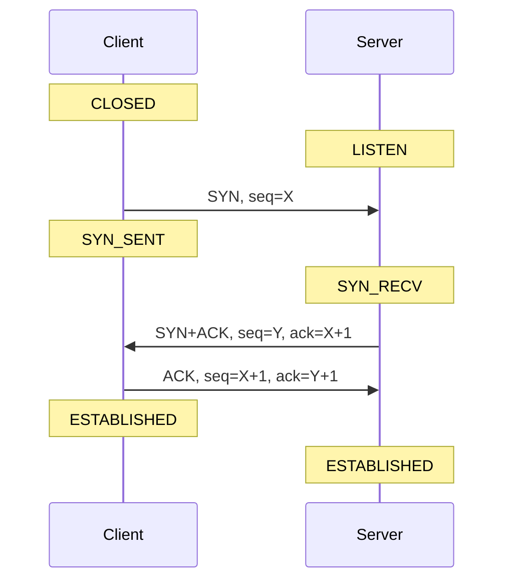
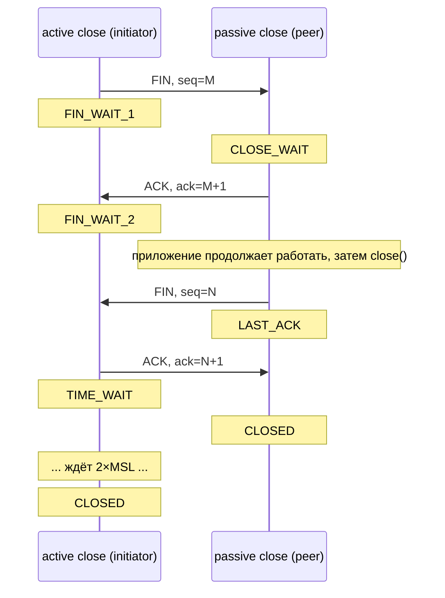
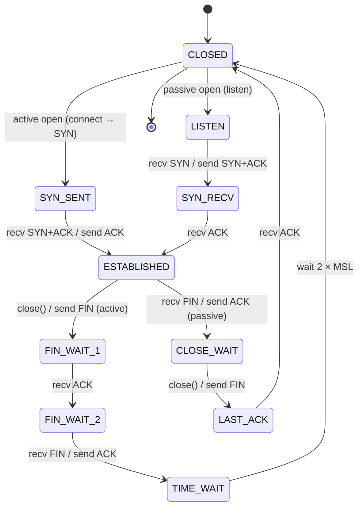
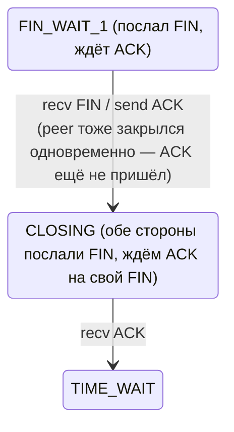
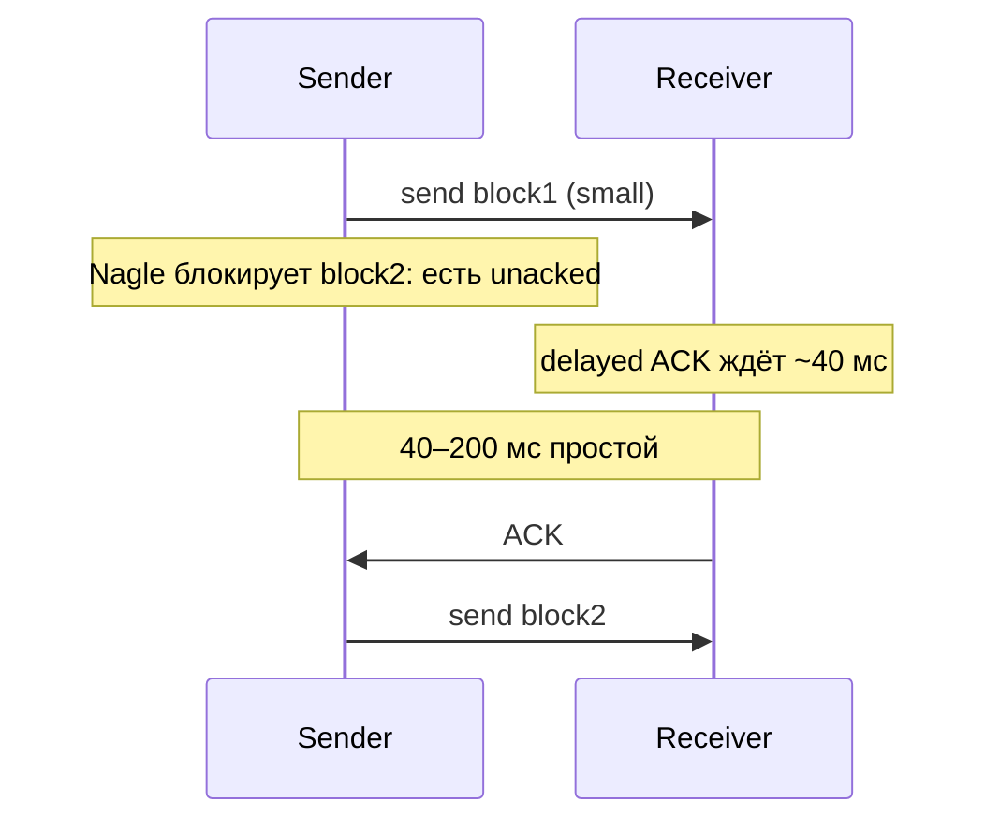
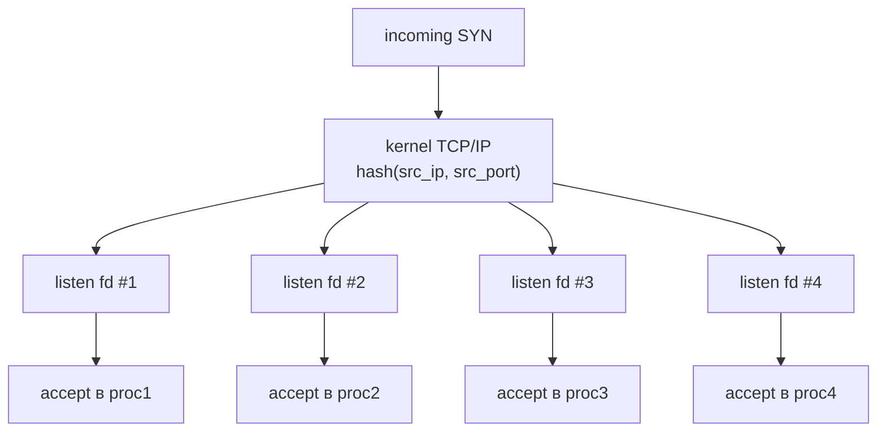

# TCP и UDP: протоколы и тонкости

TCP даёт ordered, reliable byte stream поверх ненадёжной сети: байты приходят в том же порядке, в каком были отправлены,
без потерь и без дублей. UDP даёт unordered, unreliable datagrams: отправил пакет — он либо дошёл, либо нет, без
подтверждений и без переупорядочивания.

Выбор протокола определяется задачей. HTTP, SSH, базы данных, файловые передачи — TCP: данные нельзя терять и порядок
критичен. DNS, NTP, голосовой и видео-трафик в реальном времени, игровые протоколы — UDP: задержка важнее, потерянный
пакет либо не нужен (устарел), либо восстанавливается на уровне приложения. QUIC (основа HTTP/3) построен поверх UDP,
потому что эволюция TCP в kernel-space идёт медленно — а в user-space с UDP можно катить новые версии транспорта без
обновления ядра.

Эта статья — про то, что происходит **под капотом** API сокетов: формат заголовков, конечный автомат TCP, flow и
congestion control, тонкости настройки. Про сам API (`socket`, `bind`, `listen`, `accept`, `connect`, `send`, `recv`)
см. [Сокеты: API](sockets_basics.md).

## TCP segment

TCP передаёт данные сегментами. Заголовок — минимум 20 байт, до 60 с опциями.

```
 0                   1                   2                   3
 0 1 2 3 4 5 6 7 8 9 0 1 2 3 4 5 6 7 8 9 0 1 2 3 4 5 6 7 8 9 0 1
┌───────────────────────────────┬───────────────────────────────┐
│       source port (16)        │       dest port (16)          │
├───────────────────────────────┴───────────────────────────────┤
│                  sequence number (32)                         │
├───────────────────────────────────────────────────────────────┤
│              acknowledgement number (32)                      │
├───────┬───────┬───┬───┬───┬───┬───┬───┬───────────────────────┤
│ data  │ rsvd  │ U │ A │ P │ R │ S │ F │   window size (16)    │
│ offs  │       │ R │ C │ S │ S │ Y │ I │                       │
│ (4)   │  (6)  │ G │ K │ H │ T │ N │ N │                       │
├───────┴───────┴───┴───┴───┴───┴───┴───┴───────────────────────┤
│         checksum (16)         │   urgent pointer (16)         │
├───────────────────────────────┴───────────────────────────────┤
│                    options (0–40 байт)                        │
├───────────────────────────────────────────────────────────────┤
│                          data ...                             │
└───────────────────────────────────────────────────────────────┘
```

| Поле           | Значение                                                        |
|----------------|-----------------------------------------------------------------|
| source/dest    | порты — вместе с IP-адресами образуют 4-tuple соединения        |
| seq            | номер первого байта данных в сегменте (cumulative byte counter) |
| ack            | следующий ожидаемый seq от другой стороны (valid если ACK=1)    |
| data offset    | длина заголовка в 32-битных словах (нужно из-за options)        |
| window size    | сколько байт получатель готов принять (см. flow control)        |
| checksum       | covers header + data + pseudo-header (включая src/dst IP)       |
| urgent pointer | offset до urgent data (используется редко, например в Telnet)   |

**Флаги** в одном байте, по одному биту на каждый:

| Флаг  | Значение                                                           |
|-------|--------------------------------------------------------------------|
| `SYN` | синхронизация sequence numbers — установление соединения           |
| `ACK` | поле acknowledgement number валидно (стоит после первого сегмента) |
| `FIN` | отправитель закончил передачу данных                               |
| `RST` | reset — сброс соединения (порт закрыт, состояние сломано)          |
| `PSH` | push — передать данные в приложение сразу, не буферизовать         |
| `URG` | urgent pointer валиден                                             |

Среди options самые важные — MSS (объявляется в SYN), window scale (растягивает 16-битное window до 30 бит), SACK
permitted (selective acknowledgements), timestamps (для RTT измерения и PAWS).

## Three-way handshake

Установление соединения — обмен тремя сегментами. Каждая сторона выбирает свой initial sequence number (ISN),
исторически псевдослучайный для защиты от подмены.



После `listen(fd, backlog)` ядро держит две очереди:

- **SYN queue** (incomplete connections) — сюда попадают соединения после получения SYN, до получения финального ACK.
  Размер — `net.ipv4.tcp_max_syn_backlog`.
- **Accept queue** (established connections) — сюда переходят соединения после получения финального ACK. Из этой очереди
  `accept(2)` забирает готовые. Размер — `min(backlog, net.core.somaxconn)`.

Если accept queue переполнена, ядро либо игнорирует финальный ACK (клиент будет ретрансмитить), либо посылает RST (
`tcp_abort_on_overflow=1`).

### SYN cookies

При SYN flood атакующий шлёт массу SYN, не отвечая на SYN+ACK. SYN queue заполняется, новые валидные соединения
отбрасываются. Решение — **SYN cookies**: при переполнении SYN queue ядро не хранит state, а кодирует его прямо в
выбранном `seq=Y` (ISN сервера). Формула включает хэш от 4-tuple и времени. Когда приходит финальный ACK с `ack=Y+1`,
сервер расшифровывает обратно состояние и создаёт connection.

```bash
sysctl net.ipv4.tcp_syncookies   # 1 = включены при overflow, по умолчанию
```

SYN cookies теряют опции из SYN (MSS округляется до одного из 8 фиксированных значений, window scale теряется), поэтому
используются только как fallback.

## Four-way close

Закрытие — четыре сегмента, потому что TCP — full-duplex и каждое направление закрывается независимо.



### Half-close

TCP позволяет закрыть только одно направление. `shutdown(fd, SHUT_WR)` шлёт FIN, но read половина остаётся открытой —
peer может ещё что-то слать. Так работает HTTP/1.0 без `Content-Length`: клиент шлёт запрос, `shutdown(SHUT_WR)`, сервер
видит EOF, шлёт ответ, закрывает соединение. Симметрично `SHUT_RD` закрывает чтение локально (peer этого не видит).

## TCP state machine

Главная диаграмма TCP. Состояния и переходы видны в `ss -tan state ...` и `/proc/net/tcp`.



Существует также состояние **CLOSING** — симметричное закрытие, когда оба конца одновременно послали FIN; редко, но
встречается. Ветка simultaneous close из общей диаграммы:




## TIME_WAIT

После active close сторона висит в TIME_WAIT `2 × MSL` (Maximum Segment Lifetime). В Linux это hardcoded 60 секунд (
`TCP_TIMEWAIT_LEN`), а не `2 × MSL = 120`.

Причины две:

1. **Защита от delayed segments**. Если переоткрыть тот же 4-tuple `(src_ip, src_port, dst_ip, dst_port)` слишком
   быстро, опоздавший сегмент из старого соединения может прилететь и быть принят как валидный в новом. 2×MSL — время,
   за которое все опоздавшие пакеты гарантированно умрут (TTL/timeout в роутерах).
2. **Гарантия доставки финального ACK**. Если последний ACK потерялся, peer ретрансмитит FIN — TIME_WAIT должен ответить
   ACK, иначе peer закроется по RST.

### Проблема для серверов с большим количеством исходящих connections

Если сервер инициирует много короткоживущих TCP-соединений (например, обращения к upstream), исходные порты быстро
заканчиваются. Эфемерный диапазон — `net.ipv4.ip_local_port_range` (по умолчанию ~28000 портов). С TIME_WAIT 60 секунд
это потолок ~470 connections/sec **на один dst_ip:dst_port**.

```bash
ss -tan state time-wait | wc -l                  # сколько висит
sysctl net.ipv4.ip_local_port_range              # диапазон портов
sysctl net.ipv4.tcp_tw_reuse                     # 1 = переиспользовать TIME_WAIT для исходящих
```

`tcp_tw_reuse=1` безопасно использует TIME_WAIT сокет для нового исходящего соединения, если `timestamp` нового SYN
строго больше — это защищает от старых сегментов.

`SO_REUSEADDR` на сервере разрешает `bind` на адрес/порт, на котором ещё висит TIME_WAIT от предыдущего инстанса — иначе
после рестарта сервис не поднимется минуту.

`tcp_tw_recycle` исторически существовал, был сломан (ломал клиентов за NAT) и удалён в Linux 4.12. Не использовать.

## Flow control

TCP не должен топить медленного получателя. В каждом ACK получатель сообщает **advertised window** — сколько ещё байт он
готов принять. Sender держит unacked байтов не больше, чем разрешает window.

```
sender's perspective (sliding window)

  отправлено    │  отправлено,        │  можно        │  пока
  и подтверждено│  ждёт ACK           │  отправить    │  нельзя
 ┌──────────────┼─────────────────────┼───────────────┼──────────┐
 │ 1 2 3 4 5 6  │ 7 8 9 10 11 12 13   │ 14 15 16 17   │ 18 19 .. │
 └──────────────┴─────────────────────┴───────────────┴──────────┘
                ▲                                     ▲
                │                                     │
                snd.una                               snd.una + window
                (oldest unacked)

  При получении ACK snd.una сдвигается вправо, окно «скользит».
  Если получатель advertised window=0 — sender замолкает, периодически
  шлёт zero window probe, ждёт открытия окна.
```

Размер receive window ограничен `SO_RCVBUF`. На современных Linux окно автомасштабируется (`tcp_moderate_rcvbuf=1`),
верхняя граница — `net.ipv4.tcp_rmem` (третье число).

16-битное поле window вмещает максимум 65535. Опция window scale (объявляется в SYN) умножает window на `2^scale` — до 1
GB.

## Congestion control

Flow control защищает только peer. Сеть между ними — общий ресурс, и если все sender'ы зальют её на полную, начнётся
congestion collapse (мнение Van Jacobson, 1988). Congestion control решает: сколько данных безопасно держать **в полёте
** (in-flight) в сети.

Sender держит **cwnd** (congestion window) — внутреннюю переменную, не объявляемую. Реальный потолок in-flight =
`min(advertised_window, cwnd)`.

**Slow start**: начинаем с `cwnd = 10 × MSS` (Linux default). Каждый ACK увеличивает cwnd на MSS — то есть cwnd
удваивается за RTT. Экспоненциальный рост.

**Congestion avoidance**: когда cwnd доходит до `ssthresh` (slow start threshold), рост становится линейным — +1 MSS за
RTT.

**Реакция на потерю**: потеря сегмента — сигнал congestion. Алгоритм режет cwnd. Reno: при тройном duplicate ACK (fast
retransmit) — `cwnd /= 2`, продолжаем fast recovery. При retransmission timeout — `cwnd = 1 MSS`, начинаем slow start
заново.

```
cwnd
  ▲
  │                                      ssthresh (new, после loss) ─ ─
  │                          ╱──────╲                   ╱─
  │                         ╱        ╲                 ╱
  │                        ╱          ╲              ╱
  │                       ╱            ╲           ╱
  │                      ╱              ╲        ╱
  │                     ╱                ╲     ╱
  │                    ╱                  ▼ loss
  │                   ╱                   cwnd /= 2
  │   slow start    ╱      congestion
  │   (exp)        ╱       avoidance (linear)
  │              ╱
  │ ─ ─ ─ ─ ─ ─╱──── ssthresh (initial; обновляется при loss до cwnd/2)
  │           ╱
  │         ╱
  │       ╱
  │     ╱
  │   ╱
  │ ╱
  └────────────────────────────────────────────────────▶  time
```

**Алгоритмы**:

- **Reno** — классика, основан на потерях.
- **Cubic** — default в Linux, cwnd растёт по кубической функции от времени с последней потери. Хорош на high-bandwidth
  long-RTT линках.
- **BBR** (Google) — измеряет bandwidth и RTT, моделирует bottleneck, не реагирует на отдельные потери. Резко лучше на
  линках с random loss (Wi-Fi, мобильная сеть).

```bash
sysctl net.ipv4.tcp_congestion_control           # текущий
sysctl net.ipv4.tcp_available_congestion_control # доступные
sysctl -w net.ipv4.tcp_congestion_control=bbr    # сменить
```

Каждое соединение может выбрать свой алгоритм через `setsockopt(TCP_CONGESTION)`.

## Nagle's algorithm и delayed ACK

**Nagle** (RFC 896): не отправлять маленький сегмент, пока есть unacked данные — копить, пока не наберётся MSS или
придёт ACK. Цель — не плодить tinygram'ы (телнет шлёт 41-байтный пакет на каждое нажатие клавиши).

**Delayed ACK** (RFC 1122): получатель ждёт до 40 мс перед отправкой ACK, надеясь скомбинировать его с ответными
данными (piggybacking) или с другим ACK.

По отдельности оба разумны. Вместе дают патологию: sender пишет два маленьких блока подряд.



Латентность вырастает на десятки-сотни миллисекунд из ничего.

**Решения**:

- `TCP_NODELAY` — отключает Nagle. Каждый `write` уходит немедленно. Используется в интерактивных протоколах (SSH), RPC,
  low-latency приложениях. Минус — больше пакетов, больше нагрузка на сеть.
- `TCP_QUICKACK` — отключает delayed ACK для следующих сегментов (флаг сбрасывается ядром автоматически, надо
  переустанавливать). Полезно когда вы — получатель и знаете, что отвечать данными не будете.
- `TCP_CORK` (Linux-специфично) — наоборот, копит до MSS или 200 мс. Полезно когда строите длинный ответ из кусков (
  `sendfile` + header).

В правильно спроектированном протоколе (`write`-ы — это логические сообщения целиком, а не байты по одному) Nagle обычно
мешает — большинство серверов включают `TCP_NODELAY`.

## Keepalive

Если соединение простаивает, как понять, жив ли peer? TCP сам по себе не пингует. Если peer выдернул сетевой кабель —
отправляющая сторона узнает только при попытке `write`. Принимающая может ждать вечно.

`SO_KEEPALIVE` включает периодическую отправку keepalive-пробников. Параметры:

| Опция           | Значение                                   | Default Linux |
|-----------------|--------------------------------------------|---------------|
| `TCP_KEEPIDLE`  | сколько секунд простоя до первого пробника | 7200 (2 часа) |
| `TCP_KEEPINTVL` | интервал между пробниками                  | 75 сек        |
| `TCP_KEEPCNT`   | сколько пробников без ответа = dead        | 9             |

С дефолтами обнаружение мёртвого peer занимает 2 часа + 9×75 сек = ~2:11. Для веб-серверов это бесполезно. Обычно
настраивают агрессивнее: idle=60, intvl=10, cnt=3 — обнаружение за ~90 секунд.

Дополнительная причина — **NAT timeouts**. Промежуточные NAT-боксы выкидывают connection mapping после нескольких минут
без трафика. Keepalive раз в минуту-две держит mapping живым.

## Socket buffers

Каждый сокет имеет send buffer и receive buffer в ядре. `write(2)` копирует данные в send buffer и возвращается —
отправкой занимается TCP-стек. `read(2)` забирает из receive buffer.

```bash
sysctl net.ipv4.tcp_rmem    # min, default, max — для receive
sysctl net.ipv4.tcp_wmem    # min, default, max — для send
sysctl net.core.rmem_max    # абсолютный потолок для SO_RCVBUF
sysctl net.core.wmem_max    # абсолютный потолок для SO_SNDBUF
```

Buffer auto-tuning (`tcp_moderate_rcvbuf=1`) увеличивает буфер по мере роста соединения. Явный `setsockopt(SO_RCVBUF)` *
*отключает** auto-tuning — что обычно делает только хуже. Linux также удваивает значение, переданное в `SO_RCVBUF`, под
bookkeeping.

### Bandwidth-Delay Product

Чтобы насытить линк, в полёте должно быть `BDP = bandwidth × RTT` байт. Линк 1 Gbps с RTT 100 мс:

```
BDP = 1_000_000_000 / 8 × 0.1 = 12.5 MB
```

Если send buffer < 12.5 MB или advertised window < 12.5 MB, соединение никогда не выйдет на 1 Gbps — sender упрётся в
окно. Поэтому на дальних высокоскоростных линках нужны жирные буферы и window scale.

## MSS и MTU

**MTU** (Maximum Transmission Unit) — максимальный размер кадра канального уровня. Для Ethernet — 1500 байт.

**MSS** (Maximum Segment Size) — максимум TCP payload в одном сегменте: `MSS = MTU − IP_header − TCP_header`. Для IPv4
без options: `1500 − 20 − 20 = 1460`. Для IPv6: `1500 − 40 − 20 = 1440`.

MSS объявляется в опциях SYN-сегмента — каждая сторона говорит, что готова принять. Итоговый MSS =
`min(my_mss, peer_mss)`.

### Path MTU Discovery

Между sender и receiver путь может проходить через линк с меньшим MTU (туннели, VPN). **PMTUD** (RFC 1191):

1. Sender ставит флаг DF (don't fragment) во всех IP-пакетах.
2. Если по пути роутер не может переслать без фрагментации — он отбрасывает пакет и шлёт ICMP `fragmentation needed` с
   указанием реального MTU.
3. Sender уменьшает MSS для этого соединения и ретрансмитит.

### Black hole

Если admin заблокировал ICMP полностью (популярная глупость), PMTUD ломается: большие сегменты молча теряются, sender
ретрансмитит их раз за разом и упирается в timeout. Соединение «висит» — установилось, мелкие данные ходят, большой
ответ не приходит.

Решение — **PLPMTUD** (RFC 4821, `net.ipv4.tcp_mtu_probing`), который определяет MTU по факту потерь, без ICMP.
Включается явно: `sysctl -w net.ipv4.tcp_mtu_probing=1`.

## UDP

UDP — почти прямой доступ к IP с добавлением портов. Заголовок — 8 байт:

```
 0                   1                   2                   3
 0 1 2 3 4 5 6 7 8 9 0 1 2 3 4 5 6 7 8 9 0 1 2 3 4 5 6 7 8 9 0 1
┌───────────────────────────────┬───────────────────────────────┐
│       source port (16)        │       dest port (16)          │
├───────────────────────────────┼───────────────────────────────┤
│       length (16)             │       checksum (16)           │
├───────────────────────────────┴───────────────────────────────┤
│                          data ...                             │
└───────────────────────────────────────────────────────────────┘
```

Никаких seq, ack, флагов, окон, состояний. `sendto` шлёт датаграмму, `recvfrom` читает целую датаграмму (граница
датаграмм сохраняется — в отличие от TCP byte stream). Если буфер `recvfrom` меньше датаграммы, остаток теряется (Linux)
или хранится для следующего вызова (некоторые системы).

**Когда нужен UDP**:

- **DNS** — query/response одним RTT, потеря решается ретраем приложения. TCP-handshake удвоил бы латентность.
- **NTP** — точность измерения времени важнее доставки.
- **Видео/аудио в реальном времени** — потерянный кадр устарел до момента ретрансмита, лучше показать артефакт, чем
  ждать.
- **Игры** — серверу не нужен потерянный пакет с координатами 50 мс назад, нужен свежий.
- **QUIC** — реализует свою надёжность и congestion control поверх UDP, чтобы крутиться в user-space и эволюционировать
  независимо от kernel TCP-стека.

### UDP fragmentation

Если UDP-датаграмма больше MTU, IP-уровень фрагментирует её. Каждый фрагмент идёт независимо. Потеря **одного**
фрагмента означает потерю **всей** датаграммы — receiver не сможет её собрать. Чем больше фрагментов, тем хуже
эффективная вероятность доставки.

Практический потолок UDP payload — `1500 − 20 − 8 = 1472` байта на Ethernet. Для интернета принято закладываться на
1200–1280 байт (минимум IPv6 MTU + запас на VPN-туннели). DNS поэтому ограничивал ответы 512 байтами (RFC 1035), пока не
появился EDNS0.

## SO_REUSEPORT

Классическая модель — один процесс делает `bind+listen`, accept'ит соединения, разбрасывает их по worker'ам. Acceptor
становится bottleneck при десятках тысяч conn/sec.

`SO_REUSEPORT` (Linux 3.9+) разрешает **нескольким** независимым сокетам в **разных** процессах биндиться на один порт.
Ядро само распределяет входящие connections между ними по hash от 4-tuple (`src_ip, src_port, dst_ip, dst_port`).



Преимущества:

- Нет shared accept queue — нет contention.
- Каждый worker имеет свою accept queue, нагрузка распределена равномерно.
- При reload можно поднять новые worker'ы (с `SO_REUSEPORT`), убить старые, без сброса listening socket.

Применяется в nginx, HAProxy, envoy. Если процесс упал и не успел забрать соединения из своей accept queue — они
теряются (RST клиенту); в обычной модели этого не было.

## Диагностика

```bash
# Состояния всех TCP-соединений
ss -tan
ss -tan state established
ss -tan state time-wait

# Сводка по количеству соединений в каждом состоянии
ss -tan | awk 'NR>1 {s[$1]++} END {for (k in s) print k, s[k]}'

# Подробности по соединению: cwnd, rtt, retrans, bytes_acked
ss -ti
ss -tinp dst 1.2.3.4    # с PID процесса, фильтр по адресу

# Глобальные счётчики стека: retransmits, listen overflows, etc.
nstat -a
netstat -s | less

# Сырой снимок состояния
cat /proc/net/tcp        # IPv4 (адреса в hex!)
cat /proc/net/tcp6
cat /proc/net/sockstat   # счётчики использования

# Capture
tcpdump -i any -nn 'tcp port 443'
tcpdump -i any -nn -w out.pcap 'host 1.2.3.4'

# Анализировать в Wireshark / tshark
tshark -r out.pcap -q -z conv,tcp

# Полезные счётчики проблем
nstat -a | grep -E 'TCPSynRetrans|ListenDrops|ListenOverflows|TCPLostRetransmit'
```

Что искать:

- `ListenOverflows` растёт — accept queue переполнена, увеличить `somaxconn` / `backlog`.
- `TCPSynRetrans` много — потери на handshake, сетевые проблемы.
- `TimeWait` тысячами — узкое место по эфемерным портам, см. `tcp_tw_reuse`.
- `Retransmit` высокий процент — congestion или packet loss.

## Связанные темы

- [Сокеты: API](sockets_basics.md) — `socket`, `bind`, `listen`, `accept`, `connect`
- [I/O multiplexing](../networking/io_multiplexing.md) — epoll для масштабирования TCP-серверов
- [io_uring](../networking/io_uring.md) — современный async I/O для сокетов

## Источники

- [RFC 793 — Transmission Control Protocol](https://datatracker.ietf.org/doc/html/rfc793)
- [RFC 768 — User Datagram Protocol](https://datatracker.ietf.org/doc/html/rfc768)
- [RFC 5681 — TCP Congestion Control](https://datatracker.ietf.org/doc/html/rfc5681)
- [RFC 7323 — TCP Extensions for High Performance](https://datatracker.ietf.org/doc/html/rfc7323)
- `man 7 tcp`, `man 7 udp`, `man 7 socket`
- W. Richard Stevens, «TCP/IP Illustrated, Volume 1: The Protocols»
- [Cloudflare blog — tag: TCP](https://blog.cloudflare.com/tag/tcp/)
