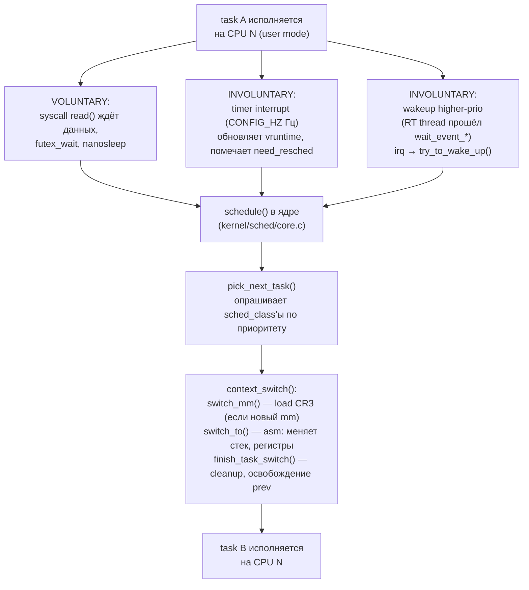
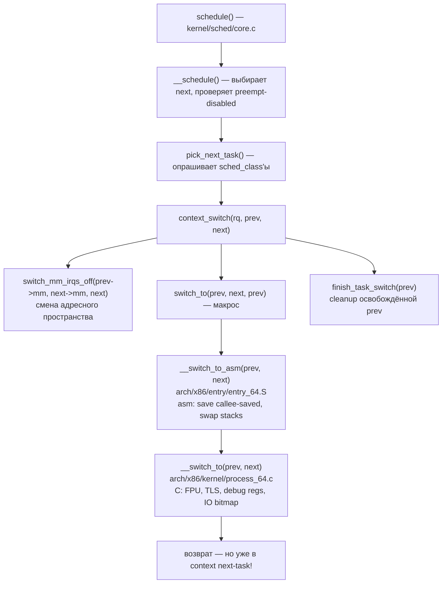
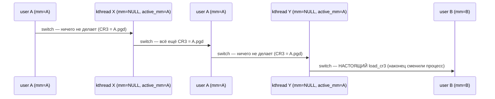
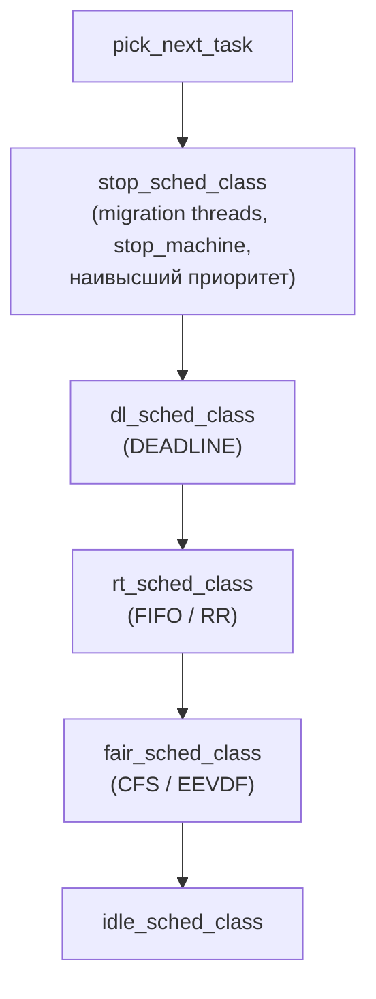

# Context switch в Linux: что сохраняется и сколько это стоит

Context switch — переключение CPU с одной задачи на другую. Ядро сохраняет всё исполнительное состояние текущей task'и
(регистры, стек, FPU, ссылки на адресное пространство) и восстанавливает состояние следующей выбранной task'и так, чтобы
та продолжила работу ровно с того места, где её прервали — будто паузы не было.

Switch'и происходят постоянно: на сервере под нагрузкой их легко десятки тысяч в секунду на ядро. Часть из них —
**voluntary**: задача сама уходит со CPU, потому что вызвала блокирующий syscall (`read` без данных, `futex_wait`,
`nanosleep`). Часть — **involuntary**, или **preemption**: scheduler вытесняет задачу, потому что истёк её квант, или
проснулся поток с более высоким приоритетом, или RCU потребовал quiescent state. Стоимость одного switch'а — единицы
микросекунд прямых затрат плюс десятки микросекунд косвенных (cold caches, TLB, branch predictor).

## Что входит в «контекст»

Контекст task'и в Linux физически размазан по нескольким структурам ядра. Часть данных — общая для всех потоков процесса
(адресное пространство, файловые дескрипторы), часть — приватная для каждого потока (регистры, kernel stack, FPU).
Поэтому **switch между потоками одного процесса дешевле**, чем switch между процессами: общие данные не трогаются.

```
                          ┌────────────────────────────────┐
                          │        task_struct             │  одна на каждый thread
                          │   (≈ 10 KB на x86-64)          │
                          ├────────────────────────────────┤
                          │ pid, tgid, state               │
                          │ prio, sched_class, se          │  ← для scheduler'а
                          │ flags, exit_code               │
              ┌───────────│ mm           ──▶ mm_struct     │
              │           │ active_mm    ──▶ mm_struct     │
              │           │ files        ──▶ files_struct  │  ─┐
              │           │ fs           ──▶ fs_struct     │   │ shared в рамках
              │           │ signal       ──▶ signal_struct │  │ процесса
              │           │ sighand      ──▶ sighand_struct│ ─┘ (НЕ переключаются)
              │           │ stack        ──▶ kernel stack  │
              │           │ thread       ──▶ thread_struct │  ── per-thread state
              │           └────────────────────────────────┘
              │                              │
              │                              ▼
              │                  ┌──────────────────────────┐
              │                  │      thread_struct       │
              │                  ├──────────────────────────┤
              │                  │ sp        (kernel rsp)   │  ← главное, что
              │                  │ ip        (не использ.)  │     меняет switch
              │                  │ fsbase, gsbase           │  ← TLS (FS/GS)
              │                  │ es, ds                   │
              │                  │ cr2, trap_nr, error_code │
              │                  │ io_bitmap_ptr            │
              │                  │ debugreg[8]              │  ← hw breakpoints
              │                  │ fpu  ──▶ struct fpu      │
              │                  └──────────────────────────┘
              │                              │
              │                              ▼
              │                  ┌──────────────────────────┐
              │                  │       struct fpu         │
              │                  ├──────────────────────────┤
              │                  │ last_cpu                 │
              │                  │ avx512_timestamp         │
              │                  │ fpstate ──▶ xstate area  │  ← до 2688 байт
              │                  └──────────────────────────┘    (AVX-512)
              ▼
   ┌────────────────────────────┐
   │         mm_struct          │  одна на ВЕСЬ процесс (shared между threads)
   ├────────────────────────────┤
   │ pgd       ──▶ page tables  │  ← попадёт в CR3 при switch_mm
   │ mmap      ──▶ VMA list     │
   │ context.ctx_id (PCID/ASID) │
   │ mm_users, mm_count         │
   │ start_code, end_code, ...  │
   └────────────────────────────┘
```

Полный список данных, которые ядру нужно учесть при переключении task'и:

| Группа                 | Состав                                                    | Размер на x86-64 |
|------------------------|-----------------------------------------------------------|------------------|
| GP-регистры            | rax–r15 (16 × 8 байт)                                     | 128 байт         |
| Управление потоком     | rip, rsp, rbp, rflags                                     | 32 байта         |
| Сегментные             | cs, ss, ds, es, fs, gs + fsbase/gsbase (TLS)              | ≈ 20 байт        |
| FPU/SSE                | x87 + MMX + XMM0–15                                       | ≈ 512 байт       |
| AVX                    | + YMM0–15 (верхние 128 бит)                               | ≈ 832 байта      |
| AVX-512                | + ZMM0–31, opmask k0–k7                                   | ≈ 2688 байт      |
| AMX (Sapphire Rapids+) | TILECFG + tmm0–tmm7 (8 × 1 KB)                            | до 8 KB          |
| Debug                  | DR0–DR7 (если task использует hw breakpoints)             | ≈ 64 байта       |
| Kernel stack           | per-thread, размер `THREAD_SIZE` (16 KB на x86-64)        | 16 KB            |
| mm_struct (через CR3)  | page-table base — переключается только при смене процесса | 8 байт в CR3     |

Что **НЕ** переключается на каждом switch'е, потому что shared в рамках процесса либо живёт в самой task_struct (которая
и есть сущность, которую переключают):

- открытые файловые дескрипторы (`struct files_struct`)
- обработчики сигналов (`struct sighand_struct`) — сами обработчики общие, но pending-сигналы per-thread
- credentials, capabilities, namespace-ссылки
- working directory, root directory
- `task_struct.comm`, pid, ppid, scheduling-параметры

## Когда происходит switch



**Voluntary switch** — task сама обнаружила, что не может продолжать (нет данных в сокете, не получила mutex), переходит
в состояние `TASK_INTERRUPTIBLE` / `TASK_UNINTERRUPTIBLE` и вызывает `schedule()`. Это «чистый» switch без накладных
расходов на обработку прерывания — task уходит со CPU организованно.

**Involuntary switch** возникает из-за внешнего события. Конкретно в Linux это работает через флаг `TIF_NEED_RESCHED` в
`thread_info`:

1. Timer interrupt (с частотой `CONFIG_HZ` — обычно 250 или 1000) попадает в `scheduler_tick()`. Тот обновляет
   `vruntime` (или `deadline` для DL-классов) и, если текущая task'а исчерпала своё право на CPU, выставляет
   `TIF_NEED_RESCHED`.
2. Wakeup поток с более высоким приоритетом (`try_to_wake_up()`) тоже выставляет `TIF_NEED_RESCHED` у текущей task'и на
   её CPU и шлёт IPI, если нужно.
3. На выходе из любого syscall / interrupt / exception ядро проверяет этот флаг (`exit_to_user_mode_loop` или
   `preempt_schedule_irq` для preemptible kernel) и вызывает `schedule()`, если флаг взведён.

Поля `/proc/PID/status` отражают это разделение:

```
voluntary_ctxt_switches:    142    ← сама ушла со CPU
nonvoluntary_ctxt_switches:  37    ← вытеснили
```

Высокий `nonvoluntary` относительно `voluntary` — признак того, что задача CPU-bound и её часто preempt'ят. Высокий
`voluntary` — задача I/O-bound и часто блокируется.

## Анатомия switch_to() на x86-64

В Linux вся машинерия switch'а уложена в цепочку из нескольких функций, каждая решает свой кусок задачи:



Самый интересный шаг — `__switch_to_asm`. На x86-64 он делает буквально следующее (упрощённо):

```asm
__switch_to_asm:
    pushq   %rbp                  ; сохраняем callee-saved регистры
    pushq   %rbx                  ; (System V ABI: rbx, rbp, r12-r15)
    pushq   %r12
    pushq   %r13
    pushq   %r14
    pushq   %r15
    pushq   $0                    ; STACK_FRAME_NON_STANDARD магия

    movq    %rsp, TASK_threadsp(%rdi)   ; prev->thread.sp = rsp
    movq    TASK_threadsp(%rsi), %rsp   ; rsp = next->thread.sp

    popq    %rbp                  ; снимаем callee-saved next-task
    popq    %r15                  ; ... но это уже регистры NEXT,
    popq    %r14                  ;     потому что мы поменяли стек
    popq    %r13
    popq    %r12
    popq    %rbx
    popq    %rbp

    jmp     __switch_to           ; продолжаем в C-части
```

Главный фокус: **поменяв rsp, мы автоматически меняем «всё»**. Все callee-saved регистры лежат на стеке предыдущей
task'и, после `mov rsp, next->thread.sp` мы оказываемся на стеке next-task — и `pop`'ы достают её регистры. По возврату
(`ret` где-то в верхней рамке) процессор прыгает в место, откуда next-task в последний раз ушла в `schedule()`.

Caller-saved регистры (`rax`, `rcx`, `rdx`, `rsi`, `rdi`, `r8`–`r11`) не сохраняются специально — компилятор уже
позаботился об этом перед вызовом `schedule()` по ABI. Поэтому save/restore — это всего **6 push/pop пар** плюс смена
rsp. Очень дёшево.

Чего здесь нет:

- **FPU/vector** не трогаются в asm-части — это слишком дорого и делается отдельно в `__switch_to` (см. ниже).
- **CR3** меняется ДО `switch_to` — в `switch_mm_irqs_off`.
- **rip** «восстанавливается» неявно через `ret` — потому что выход из `__switch_to_asm` для каждой task'и происходит
  ровно туда, откуда она ушла в schedule().

## switch_mm() — самое дорогое для процессов

Когда new task принадлежит другому процессу (`prev->mm != next->mm`), нужно сменить адресное пространство — загрузить
новый корень page table в `CR3`:

```c
static inline void load_new_mm_cr3(pgd_t *pgdir, u16 new_asid, bool need_flush)
{
    unsigned long new_mm_cr3 = build_cr3(pgdir, new_asid, ...);
    write_cr3(new_mm_cr3);
}
```

И в этом — главная проблема. Что происходит с **TLB** при записи в CR3?

### TLB без PCID

Старое поведение (или с `nopcid` в cmdline): запись в CR3 **полностью инвалидирует TLB** на этом CPU. Каждая страница,
которую новая task будет использовать, потребует walk по page table'ам (3–4 обращения к памяти на каждый промах).

```
Без PCID: запись в CR3 = full TLB flush
                                                         каждый доступ
   task A работала                                       к памяти у task B
   ┌─────────────────┐                                   проходит page-walk
   │ TLB             │   load_cr3(B.pgd)                 ┌──────────────┐
   │ A: 0x... ──▶ ph │  ──────────────────▶  TLB пуст ──▶│ TLB miss     │
   │ A: 0x... ──▶ ph │                                   │ page walk    │
   │ ...             │                                   │ refill TLB   │
   └─────────────────┘                                   └──────────────┘
                                                          ≈ 100 циклов
                                                          каждый раз
```

Для contained workloads (Kubernetes, web-frontend с тысячами процессов) это катастрофа: каждый switch буквально
обнуляет несколько сотен TLB-записей, накопленных task'ой.

### TLB с PCID/ASID

PCID (Process-Context Identifier) — 12-битный тег, который Intel ввела в 2008-м, а Linux массово включил по умолчанию
только с 4.14 (2017). Каждой `mm_struct` присваивается ASID, и каждая TLB-запись помечается этим ASID. При load CR3 с
правильно установленным флагом TLB записи **не удаляются**, просто становятся неактивными:

```
С PCID: запись в CR3 не сбрасывает TLB

   Перед switch                          После load_cr3(B.pgd | ASID_B)
   ┌─────────────────────┐               ┌─────────────────────┐
   │ TLB                 │               │ TLB (то же содержим)│
   │ A.ASID, 0x... ──▶ ph│               │ A.ASID, 0x... ──▶ ph│  неактивна
   │ A.ASID, 0x... ──▶ ph│   ───────▶    │ A.ASID, 0x... ──▶ ph│  неактивна
   │ B.ASID, 0x... ──▶ ph│               │ B.ASID, 0x... ──▶ ph│  АКТИВНА
   │ B.ASID, 0x... ──▶ ph│               │ B.ASID, 0x... ──▶ ph│  АКТИВНА
   └─────────────────────┘               └─────────────────────┘

   При следующем switch обратно в A — её записи всё ещё в TLB. Cache hit!
```

Реальный выигрыш: на типичном container-сервере PCID снижает TLB-misses на 20–50% и заметно бустит latency. Цена — 12
бит на ASID и небольшая логика отслеживания, какой ASID какой mm соответствует. Linux реализует это через `cpu_tlbstate`
per-CPU.

Проверить, что PCID активен:

```bash
grep -o 'pcid' /proc/cpuinfo | head -1                # есть в CPU?
dmesg | grep -i pcid                                  # включил ли kernel?
# Linux на загрузке выведет: "Kernel/User page tables isolation: enabled"
```

### Lazy TLB для kernel threads

Kernel threads (`kthreadd`-потомки) не имеют своего user-space mm — их `task->mm == NULL`. Но им нужен page-table base
для доступа к kernel-памяти (она замаплена в верхней половине каждого процесса). Решение: kthread «одалживает» mm
предыдущей user-task через `active_mm`. `switch_mm` тогда не делает `load_cr3` вообще — это **lazy TLB mode**.



Большая часть kernel-thread'ов короткоживущие — interrupt handler'ы, workqueue items. Этот трюк экономит сотни циклов на
каждом таком прерывании.

## FPU/Vector state: XSAVE/XRSTOR

FPU и векторные регистры — самая объёмная часть контекста. На AVX-512-машине это 2.7 KB на каждый switch. Историю того,
как Linux работает с ним, стоит рассказать отдельно — она объясняет, почему сейчас сделано именно так.

### Раньше: lazy FPU

До 2016-го Linux использовал **lazy FPU switching**: при switch'е FPU регистры **не** сохранялись/восстанавливались.
Вместо этого ядро ставило бит `CR0.TS` (Task Switched). При первой же FPU/SSE-инструкции в новой task'е CPU выбрасывал
`#NM` (Device Not Available) exception, обработчик которого сохранял FPU предыдущего пользователя FPU и восстанавливал
FPU текущей task'и. Идея: если task не использует FPU — экономим время.

Проблема выявилась как уязвимость **CVE-2018-3665 (Lazy FP State Restore)**: спекулятивное выполнение позволяло читать
FPU-регистры предыдущей task'и через side-channel. После этого Linux окончательно перешёл на **eager FPU** — состояние
сохраняется/восстанавливается на каждом switch'е (это уже было дефолтом с 4.6 для большинства CPU).

### Сейчас: XSAVE/XRSTOR

XSAVE — расширяемая инструкция Intel для сохранения FPU + векторных регистров в структуру переменного размера.
Структура называется **XSAVE area** и состоит из header'а и набора **компонентов**, каждый соответствует одному
расширению ISA:

```
XSAVE area (компонентов столько, сколько поддерживает CPU и включил kernel)

  offset
      ┌────────────────────────────────────────────────┐
    0 │ Legacy region (FXSAVE format)                  │
      │   x87 FPU control/status                       │ 160 байт
      │   MXCSR                                        │
      │   ST0–ST7 / MM0–MM7 (80 бит каждый)            │
      │   XMM0–XMM15 (128 бит каждый)                  │
  512 ├────────────────────────────────────────────────┤
      │ XSAVE Header                                   │
      │   XSTATE_BV (bitmap: какие компоненты валидны) │ 64 байта
      │   XCOMP_BV  (bitmap: какие в compacted-формате)│
  576 ├────────────────────────────────────────────────┤
      │ Extended Region                                │
      │   ┌──────────────────────────────────────────┐ │
      │   │ AVX:  YMM_Hi128 (верхние биты YMM0-15)   │ │ 256   ▲
      │   ├──────────────────────────────────────────┤ │       │
      │   │ MPX (deprecated)                         │ │       │ зависит от CPU
      │   ├──────────────────────────────────────────┤ │       │ и от XCR0
      │   │ AVX-512: opmask k0-k7                    │ │  64   │
      │   ├──────────────────────────────────────────┤ │       │
      │   │ AVX-512: ZMM_Hi256 (верх ZMM0-15)        │ │ 512   │
      │   ├──────────────────────────────────────────┤ │       │
      │   │ AVX-512: Hi16_ZMM (ZMM16-31)             │ │1024   │
      │   ├──────────────────────────────────────────┤ │       │
      │   │ PKRU (memory-protection keys)            │ │   4   │
      │   ├──────────────────────────────────────────┤ │       │
      │   │ AMX: XTILECFG                            │ │  64   │
      │   ├──────────────────────────────────────────┤ │       │
      │   │ AMX: XTILEDATA (tmm0-tmm7, 1 KB каждый)  │ │8192   ▼
      │   └──────────────────────────────────────────┘ │
      └────────────────────────────────────────────────┘
```

Эффективный размер с AVX-512 без AMX — около **2688 байт** на каждый context switch. С AMX — почти 11 KB.

| Расширение | Доп. размер | Накопительно |
|------------|-------------|--------------|
| FPU + SSE  | 512         | 512          |
| AVX        | +320        | 832          |
| AVX-512    | +1856       | 2688         |
| AMX        | +8256       | 10944        |

Linux использует:

- `XSAVES` / `XRSTORS` (supervisor) — оптимизированный вариант с **compacted format** (компоненты лежат подряд без
  «дыр» для неактивных) и поддержкой supervisor-state. Доступен только из kernel mode.
- `XSAVEOPT` — сохраняет только изменённые с прошлого XRSTOR компоненты (по флагам в XSTATE_BV). Реальная экономия,
  если task не пользовалась, например, AVX-512.

### AMX как особый случай

Intel AMX (Advanced Matrix Extensions, Sapphire Rapids+) — тайл-регистры по 1 KB каждый, всего 8 штук. Сохранять 8 KB на
каждый switch'е, когда 99% задач даже не знают про AMX, — расточительно. Linux поэтому реализует **lazy switching
именно для AMX-компонента**: процесс получает доступ к AMX только после явного `arch_prctl(ARCH_REQ_XCOMP_PERM, ...)`, и
только такие процессы получают расширенный XSAVE buffer. Без запроса — AMX выключен через XCR0, любое обращение к
tmm-регистрам выбрасывает `#NM`.

Это разумный компромисс: «дорогой» опт-ин выкручен для редких клиентов, не штрафуя всех остальных. Похожий механизм
готовится для AVX10 и будущих SIMD-расширений.

## Process switch vs thread switch

Что именно делается, зависит от того, switch ли между процессами или между потоками одного процесса:

```
┌────────────────────────────────┬─────────────────┬─────────────────┐
│           Операция             │  thread switch  │ process switch  │
│                                │  (общий mm)     │  (разный mm)    │
├────────────────────────────────┼─────────────────┼─────────────────┤
│ save/restore GP-регистров      │       да        │       да        │
│ swap kernel stack (rsp)        │       да        │       да        │
│ save/restore FS/GS base (TLS)  │       да        │       да        │
│ XSAVE/XRSTOR FPU+SIMD          │       да        │       да        │
│ load_cr3 (новый mm)            │      НЕТ        │       да        │
│ TLB flush (без PCID)           │      НЕТ        │       да        │
│ TLB неактивен (с PCID)         │      НЕТ        │   да (но soft)  │
│ MMU walk новых VMA при доступе │      НЕТ        │       да        │
│ Cold L1d/L2/L3 (новые данные)  │  частично       │       да        │
│ Branch predictor mispredicts   │   небольшие     │   значительные  │
└────────────────────────────────┴─────────────────┴─────────────────┘
```

В большинстве workload'ов **thread switch в 2-3 раза дешевле** process switch. Поэтому многопоточные серверы
(нагруженные web-серверы, базы данных) обычно тяжелее, чем такая же логика на одном процессе с epoll'ом — но context
switch не главный фактор; основное — кэш-локальность.

## Реальная стоимость

Прямые затраты на switch — сохранение/восстановление + scheduler — обычно **1–5 микросекунд** на современном
x86-64-сервере. Косвенные затраты — намного дороже:

```
Time
   ▲
   │       direct cost
   │      ┌─────┐
   │      │     │              cache warm-up
   │      │     │ ┌──┐
   │      │     │ │  │┌─┐ ┌──┐
   │      │     │ │  ││ │ │  │  cold cache penalty
   │      │     │ │  ││ │ │  │  до десятков µs
   │      │     │ │  ││ │ │  │
   │  ────┴─────┴─┴──┴┴─┴─┴──┴────  baseline
   │
   └───────────────────────────────────────────────▶ Time
       switch       первые сотни инструкций
                    после switch'а
```

Что становится «холодным»:

- **L1d / L2 / L3 cache** — данные предыдущей task'и вытесняются данными новой, которая через ms вернётся к своим
  данным — а их уже нет в кэше.
- **TLB** — даже с PCID, на CPU с маленьким TLB (например, 64–128 записей у L1 TLB) переключение между сотнями task'ов
  всё равно ведёт к eviction.
- **Branch predictor** — predictor-state у каждой task'и свой, но physically один на ядро. После switch'а первые
  предсказания будут плохие.
- **Cache lines в page tables** — page-walker сам кэширует промежуточные уровни page table'ов, эти кэши тоже остывают.

Примерные цифры на типичном Xeon с PCID:

| Сценарий                      | Прямые    | Косвенные |
|-------------------------------|-----------|-----------|
| Thread switch внутри процесса | 0.8–2 µs  | 1–5 µs    |
| Process switch с PCID         | 1.5–3 µs  | 5–15 µs   |
| Process switch без PCID       | 2–4 µs    | 10–30 µs  |
| Switch + AVX-512 active       | +0.5–1 µs | (тот же)  |

Измерить switch latency локально:

```bash
# lmbench: lat_ctx измеряет именно context-switch latency
lat_ctx -s 0 2 4 8 16        # 2-16 процессов, working set 0 KB
lat_ctx -s 64 2 4 8 16       # working set 64 KB — увидите рост cache cost

# perf: подсчитать switches за время работы программы
perf stat -e context-switches,cpu-migrations,page-faults ./prog

# Самые «переключаемые» процессы в системе сейчас
perf sched record -- sleep 5
perf sched latency
```

## Модели preemption в Linux

В каких именно местах ядра разрешено вытеснять task'у — выбирается на этапе сборки kernel'а (`CONFIG_PREEMPT_*`). Это
фундаментальный trade-off между throughput'ом и latency:

| Модель              | Когда preempt'ит                                  | Throughput | Latency     | Применение           |
|---------------------|---------------------------------------------------|------------|-------------|----------------------|
| `PREEMPT_NONE`      | только на возврате в user space                   | максимум   | непредсказ. | классические серверы |
| `PREEMPT_VOLUNTARY` | + явные точки (`might_sleep()`, `cond_resched()`) | высокий    | средняя     | desktop, default     |
| `PREEMPT` (full)    | в kernel почти везде, кроме critical sections     | средний    | хорошая     | interactive, low-lat |
| `PREEMPT_RT`        | + spinlock'и через rt_mutex, threaded IRQs        | ниже       | минимальная | hard real-time       |

`PREEMPT_RT` был долго отдельным патч-сетом и наконец слит в mainline в Linux 6.12 (2024). Он переделывает большинство
спинлоков в `rt_mutex` (mutex с inheritance приоритета), превращает interrupt handlers в обычные threads — всё ради
предсказуемой latency, ценой throughput'а.

Внутри ядра preemption гранулярно блокируется через **`preempt_count`** в `thread_info`:

```
preempt_count (32 бита)
┌──────────┬──────────┬──────────┬──────────┬──────────────────────┐
│ PREEMPT  │ SOFTIRQ  │ HARDIRQ  │ NMI      │ PREEMPT_NEED_RESCHED │
│ (8 бит)  │ (8 бит)  │ (4 бита) │ (4 бита) │ (бит 31)             │
│  биты    │  биты    │  биты    │  биты    │                      │
│  0–7     │  8–15    │  16–19   │  20–23   │                      │
└──────────┴──────────┴──────────┴──────────┴──────────────────────┘
```

`preempt_disable()` инкрементит, `preempt_enable()` декрементит и проверяет — если стало 0 и `TIF_NEED_RESCHED` взведён,
вызывает `schedule()`. `spin_lock()` под `PREEMPT` тоже делает `preempt_disable` — иначе можно было бы заснуть с
spinlock'ом и заблокировать весь CPU.

Проверить модель собранного ядра:

```bash
grep -E 'PREEMPT(_NONE|_VOLUNTARY|_RT)?=' /boot/config-$(uname -r)
# CONFIG_PREEMPT_VOLUNTARY=y    ← на большинстве desktop-дистрибутивов
```

## Scheduler классы

`schedule()` не знает, какую именно task запустить — он опрашивает зарегистрированные **scheduling classes** в порядке
приоритета:



Иерархия: `stop` > `dl` (deadline) > `rt` (real-time FIFO/RR) > `fair` (CFS/EEVDF) > `idle`. Если в DL-runqueue есть
task — она пойдёт раньше любой FIFO. Если в FIFO — раньше любой CFS.

**CFS (Completely Fair Scheduler)** — был default'ом с 2007-го до 6.6. Per-CPU runqueue — red-black tree, ключ
`vruntime` (виртуальное время, накопленное task'ой; чем больше, тем «правее» в дереве). `pick_next_task_fair` всегда
берёт leftmost.

**EEVDF (Earliest Eligible Virtual Deadline First)** — default с 6.6 (2023). Решает проблему CFS со справедливостью по
latency: short-running interactive tasks получают приоритет относительно long-running batch'а одного веса. Базовая
структура тоже rb-tree, но ключ — virtual deadline, а не просто vruntime.

`switch_to` сам ничего этого не знает — он работает универсально с любой sched_class. Это разделение позволило ввести
EEVDF без переписывания низкого уровня переключения.

## Profile и debug context switches

```bash
# Сколько switches за время работы программы + связанная статистика
perf stat -e context-switches,cs,cpu-migrations,task-clock ./prog

# Детальная трассировка switch-событий со scheduler-info
perf sched record -- ./prog
perf sched latency
perf sched timehist

# Per-process: сколько switch'ей было, и каких именно
cat /proc/$PID/status | grep -i ctxt
#   voluntary_ctxt_switches:   1024
#   nonvoluntary_ctxt_switches:  37

# Глобальная статистика по системе — sys-wide cs/sec
vmstat 1
#  ...  in    cs us sy ...
#       1234 5678 ...

# bpftrace: какие команды переключаются чаще всего
sudo bpftrace -e 'tracepoint:sched:sched_switch { @[comm] = count(); }'

# Latency-аналог: задержка пробуждения task'и до её планирования на CPU
sudo bpftrace -e '
   tracepoint:sched:sched_wakeup { @wake[args->pid] = nsecs; }
   tracepoint:sched:sched_switch /@wake[args->next_pid]/ {
       @latency = hist(nsecs - @wake[args->next_pid]);
       delete(@wake[args->next_pid]);
   }'
```

Признаки нездоровой context-switch активности:

- `cs/sec` > 100k на ядро в `vmstat` — слишком много switch'ей, проверьте, не используете ли thread-per-connection.
- `nonvoluntary` доминирует у CPU-bound процесса — possibly throttling (cgroup CPU limit) или просто шумные соседи.
- `perf sched latency` показывает большие wakeup-latency у RT-task'ов — кто-то держит `preempt_disable` слишком долго,
  или у вас не PREEMPT/PREEMPT_RT ядро.

## Как минимизировать context switch

Сократить число switch'ей часто эффективнее, чем оптимизировать сам switch — каждый switch стоит дорого из-за косвенных
факторов:

- **CPU pinning** — `taskset -c 0,1 ./prog` или `sched_setaffinity()` ограничивает task'у конкретными ядрами. Меньше
  миграций между CPU, теплее кэши. Для серверов с предсказуемыми воркерами — почти всегда выигрыш.
- **isolcpus / cpuset** — изолировать целые ядра от scheduler'а ОС, отдать их latency-критичному коду. На этих ядрах не
  будет ничего, кроме явно прибитой task'и.
- **SCHED_FIFO** для критичных потоков — `pthread_setschedparam(SCHED_FIFO, prio)`. Внутри одного приоритета нет
  preemption по timer'у; вытеснит только более высокий RT-приоритет. Без `RLIMIT_RTTIME` рискуете подвесить систему.
- **Event-driven I/O вместо thread-per-connection**: `epoll`, `kqueue` (BSD). Один поток обрабатывает тысячи сокетов,
  switch'и происходят только когда поток реально блокируется.
- **io_uring SQPOLL** — kernel-thread polling submission queue без syscall'ов; правильно настроенный io_uring
  обрабатывает миллионы операций в секунду с почти нулевым числом switch'ей.
- **Batching syscall'ов** — readv/writev/sendmmsg/recvmmsg вместо N отдельных вызовов. Меньше syscall — меньше шансов
  попасть на need_resched checkpoint.
- **Reducing thread count** — десятки тысяч потоков (старые Java/JVM-приложения) → scheduler overhead доминирует.
  Virtual threads / fibers / async-runtime обычно лучше.

## Связанные темы

- [setjmp/longjmp и ucontext](../concurrency/userspace_context_switching.md) — userspace-аналог: переключение контекста без
  ядра, фибры, coroutine'ы.
- [Состояния процессов, wait, sleep](process_states_wait_sleep.md) — что заставляет task'у уйти со CPU (R → S/D).
- [Реализация потоков (clone)](../concurrency/thread_implementation_clone.md) — флаги `CLONE_*`, что именно shared между
  потоками одного процесса.
- [Приоритеты, affinity, capabilities](process_priority_affinity_capabilities.md) — `nice`, RT-приоритеты, `taskset`,
  `sched_setaffinity`.
- [Прерывания](../assembler_and_processor/interrupts.md) — timer interrupt как trigger для `scheduler_tick`.
- [Кэши процессора](../assembler_and_processor/cpu_caches.md) — почему cold cache после switch'а стоит дороже самого
  switch'а.
- [Виртуальная память](../memory/virtual_memory.md) — TLB, page tables, PCID/ASID и почему `load_cr3` дорог.

## Источники

- Linux kernel: `kernel/sched/core.c` (`__schedule`, `context_switch`), `arch/x86/entry/entry_64.S` (`__switch_to_asm`),
  `arch/x86/kernel/process_64.c` (`__switch_to`).
- LWN: [The kernel's preemption models](https://lwn.net/Articles/831678/),
  [Lazy and lossy FPU register switching](https://lwn.net/Articles/590162/),
  [An EEVDF CPU scheduler for Linux](https://lwn.net/Articles/925371/).
- Daniel P. Bovet, Marco Cesati. *Understanding the Linux Kernel*, 3rd ed., O'Reilly, глава «Process Switch».
- Robert Love. *Linux Kernel Development*, 3rd ed., главы 3-4.
- Intel SDM Vol 1, ch. 13 (XSAVE/XRSTOR), Vol 3A, ch. 4.10 (PCID).
- AMD APM Vol 2, ch. 5.5 (ASID).
- lmbench — <http://www.bitmover.com/lmbench/>.
- `man 7 sched`, `man 2 sched_setscheduler`, `man 2 clone`.
