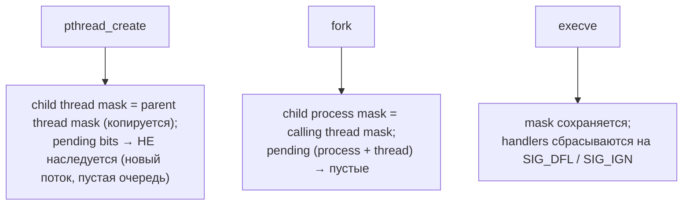

# Сигналы в Linux

**Сигналы** — асинхронные уведомления, отправляемые процессу или потоку для информирования о наступлении события.
Асинхронность означает, что сигнал может прийти в любой момент исполнения кода — это ключевое отличие от исключений.

## Как работают сигналы

При доставке сигнала:

1. текущее исполнение **приостанавливается** (в любом месте кода);
2. вызывается **обработчик сигнала** (или выполняется действие по умолчанию);
3. после возврата из обработчика выполнение **продолжается**.

Физически: ядро, доставляя сигнал, проверяет маску блокировки, модифицирует стек процесса,
вставляя туда вызов обработчика (через механизм `sigreturn`).

## Стандартные сигналы

| Номер | Имя     | Описание                                  | Действие по умолчанию | Перехватывается? |
|-------|---------|-------------------------------------------|-----------------------|------------------|
| 1     | SIGHUP  | Разрыв терминала                          | Завершить             | Да               |
| 2     | SIGINT  | Ctrl+C                                    | Завершить             | Да               |
| 3     | SIGQUIT | Ctrl+\                                    | Завершить + core dump | Да               |
| 6     | SIGABRT | `abort()`                                 | Завершить + core dump | Да               |
| 8     | SIGFPE  | Деление на 0, переполнение                | Завершить + core dump | Да               |
| 9     | SIGKILL | Принудительное завершение                 | Завершить             | **НЕТ**          |
| 11    | SIGSEGV | Обращение по неверному адресу             | Завершить + core dump | Да               |
| 13    | SIGPIPE | Запись в закрытый pipe                    | Завершить             | Да               |
| 15    | SIGTERM | Вежливое завершение                       | Завершить             | Да               |
| 17    | SIGCHLD | Дочерний процесс завершился / остановился | Игнорировать          | Да               |
| 18    | SIGCONT | Продолжить остановленный процесс          | Продолжить            | Да               |
| 19    | SIGSTOP | Остановить процесс                        | Остановить            | **НЕТ**          |

`SIGKILL` и `SIGSTOP` нельзя перехватить, игнорировать или заблокировать.

### Pending bitmask и blocked mask

Каждый сигнал существует в одном из трёх состояний относительно потока:

```
  kill(pid, SIG) / raise(SIG)
          │
          ▼
  ┌───────────────────────────────────────────────────────────┐
  │                   ядро: task_struct                       │
  │                                                           │
  │  pending bitmask   ┌─┬─┬─┬─┬─┬─┬─┬─┬─┐                    │
  │  (сигнал пришёл)   │0│1│0│0│1│0│0│0│0│  бит N = сигнал N  │
  │                    └─┴─┴─┴─┴─┴─┴─┴─┴─┘                    │
  │                      │       │                            │
  │  blocked mask      ┌─┬─┬─┬─┬─┬─┬─┬─┬─┐                    │
  │  (sigprocmask)     │0│0│0│0│1│0│0│0│0│  бит N = заблок.   │
  │                    └─┴─┴─┴─┴─┴─┴─┴─┴─┘                    │
  │                      │       │                            │
  │  pending & ~blocked  │       │                            │
  │                      ▼       ▼                            │
  │               ┌────────┐  ┌─────────┐                     │
  │               │DELIVER │  │ PENDING │  (ждёт разблокировки│
  │               │(вызвать│  │(остаётся│   sigprocmask)      │
  │               │обработ-│  │в битмаск│                     │
  │               │ чик)   │  │е)       │                     │
  │               └────────┘  └─────────┘                     │
  └───────────────────────────────────────────────────────────┘
```

`SIGKILL` и `SIGSTOP` не попадают в blocked mask — ядро доставляет их безусловно.

### Вставка вызова обработчика в стек (sigframe, sigreturn)

Когда сигнал готов к доставке, ядро не просто вызывает обработчик напрямую — оно встраивает специальный фрейм в стек
процесса:

```
  Стек процесса до доставки сигнала:
  ┌────────────────────────────────┐  ← rsp (вершина стека)
  │   ... обычные фреймы ...       │
  └────────────────────────────────┘

  Ядро перехватывает возврат из syscall / прерывание:
          │
          ▼
  ┌────────────────────────────────┐  ← новый rsp
  │  struct rt_sigframe            │
  │  ┌──────────────────────────┐  │
  │  │ ucontext_t uc            │  │  ← сохранённые регистры:
  │  │   uc_mcontext.rip        │  │──────────▶ адрес прерванной инструкции
  │  │   uc_mcontext.rsp        │  │     rsp, rbp, rax, ... всё
  │  │   uc_mcontext.eflags     │  │  ← rflags/EFLAGS (REG_EFL)
  │  │   uc_sigmask             │  │  ← старая маска сигналов
  │  └──────────────────────────┘  │
  │  siginfo_t info                │  ← si_signo, si_pid, si_addr ...
  │  [адрес возврата: sigreturn() ]│  ← ядро кладёт сюда инструкцию
  └────────────────────────────────┘    или адрес vDSO-trampoline

          │  ядро передаёт управление
          ▼
  ┌────────────────────────────────┐
  │  my_handler(sig, info, ctx)    │  ← обработчик выполняется
  └────────────────────────────────┘
          │  ret из обработчика
          ▼
  ┌────────────────────────────────┐
  │  sigreturn() syscall           │  ← восстанавливает регистры
  └────────────────────────────────┘   из rt_sigframe и возвращает
          │                             управление в прерванную точку
          ▼
  ┌────────────────────────────────┐
  │  ... обычный код продолжается  │
  └────────────────────────────────┘
```

`sigreturn(2)` — специальный системный вызов без аргументов: он читает сохранённый контекст прямо из стека (по адресу
`rsp`) и восстанавливает все регистры.

## Синхронные и асинхронные сигналы

**Синхронные** — порождаются самим процессом при выполнении конкретной инструкции:
`SIGSEGV`, `SIGFPE`, `SIGILL`, `SIGBUS`, `SIGTRAP`.
Опасны: могут повторяться бесконечно при возврате в то же место.

**Асинхронные** — порождаются внешними событиями:
`SIGINT`, `SIGTERM`, `SIGKILL`, `SIGUSR1`, `SIGUSR2`, `SIGCHLD`.
На стандартные сигналы **очередь не создаётся** — повторный сигнал игнорируется.
На realtime-сигналы (`SIGRTMIN`..`SIGRTMAX`) очередь создаётся.

## Отправка сигналов

**Из терминала:**

```bash
kill -SIGTERM <pid>     # послать SIGTERM
kill -9 <pid>           # SIGKILL (нельзя перехватить)
kill -STOP <pid>        # остановить процесс
killall -TERM prog      # по имени программы
```

**Из кода:**

```c
#include <signal.h>
#include <unistd.h>

kill(pid, SIGTERM);           // другому процессу
kill(-pgid, SIGTERM);         // группе процессов (отрицательный PID = PGID)
kill(-1, SIGTERM);            // всем процессам пользователя (требует прав)

raise(SIGUSR1);               // самому себе
pthread_kill(tid, SIGUSR1);   // конкретному потоку
```

## Ожидание сигнала

```c
#include <signal.h>
#include <unistd.h>

pause();                          // спать до прихода любого сигнала

sigset_t mask;
sigemptyset(&mask);
sigsuspend(&mask);                // ждать сигнала, не входящего в mask

struct timespec req = {.tv_sec = 10};
nanosleep(&req, NULL);            // с таймаутом (может быть прервана)
```

## Обработчики сигналов

### `signal()` — простой, но ненадёжный

```c
#include <signal.h>

void my_handler(int sig) { /* ... */ }

signal(SIGUSR1, my_handler);   // установить обработчик
signal(SIGINT,  SIG_IGN);      // игнорировать
signal(SIGTERM, SIG_DFL);      // восстановить действие по умолчанию
```

### `sigaction()` — рекомендуемый способ

```c
#include <signal.h>

void my_handler(int sig, siginfo_t *info, void *context) {
    // info->si_pid — PID отправителя
}

struct sigaction sa = {0};
sa.sa_sigaction = my_handler;
sa.sa_flags = SA_SIGINFO;          // передавать siginfo_t
sigemptyset(&sa.sa_mask);
sigaddset(&sa.sa_mask, SIGUSR2);   // заблокировать SIGUSR2 во время обработки

sigaction(SIGUSR1, &sa, NULL);
```

### Перехват SIGSEGV

```c
void segfault_handler(int sig, siginfo_t *info, void *ctx) {
    const char msg[] = "Caught SIGSEGV\n";
    write(STDERR_FILENO, msg, sizeof(msg) - 1);
    _exit(1);  // не return: возврат в ту же инструкцию вызовет повторный SIGSEGV
}

struct sigaction sa = {0};
sa.sa_sigaction = segfault_handler;
sa.sa_flags = SA_SIGINFO;
sigemptyset(&sa.sa_mask);
sigaction(SIGSEGV, &sa, NULL);
```

## Вложенные сигналы и маска

Если во время обработки одного сигнала приходит другой, обработчик прерывается (вложенный вызов).
Это может привести к проблемам при общих данных — блокируйте сигналы через маску:

```c
sigset_t mask, old;
sigfillset(&mask);
sigprocmask(SIG_BLOCK, &mask, &old);   // заблокировать все сигналы
// критическая секция
sigprocmask(SIG_SETMASK, &old, NULL);  // восстановить маску
```

## Сигналы и системные вызовы

«Медленные» сисколлы (`read`, `write`, `wait`) могут быть **прерваны** сигналом:
возвращают `-1`, `errno = EINTR`.

```c
// Паттерн перезапуска
while (1) {
    ssize_t n = read(fd, buf, size);
    if (n == -1 && errno == EINTR) continue;
    if (n == -1) { perror("read"); break; }
    // обработать данные
}
```

Или использовать флаг `SA_RESTART` — ядро перезапустит сисколл автоматически:

```c
sa.sa_flags = SA_RESTART;
sigaction(SIGUSR1, &sa, NULL);
```

## Signal-safety и реентрабельность

**Signal-safe функция** — может быть безопасно вызвана из обработчика сигнала.

- Signal-safe: `write`, `read`, `_exit`, `kill`, `signal`.
- **Не** signal-safe: `printf`, `malloc`, `free`, `exit` (используют внутренние блокировки → возможен deadlock).

**Реентрабельная функция** — не использует глобальное/статическое состояние
и может быть вызвана повторно до завершения предыдущего вызова.

**Рекомендуемый паттерн:**

```c
volatile sig_atomic_t got_signal = 0;

void safe_handler(int sig) {
    got_signal = 1;   // только простое присваивание — всегда signal-safe
}

int main() {
    signal(SIGUSR1, safe_handler);
    while (!got_signal) pause();
    printf("Обработано\n");  // безопасно — вызываем из основного потока
}
```

## Realtime signals (SIGRTMIN..SIGRTMAX)

Стандартные сигналы (1..31) хранятся в `pending` как **bitmask** — один бит на сигнал. Если `SIGUSR1` пришёл, пока ещё
не был доставлен, повторный `kill(pid, SIGUSR1)` не добавит второй бит — сигнал «сливается». Realtime signals (32..64,
доступны как `SIGRTMIN..SIGRTMAX`) хранятся в **очереди**: каждый отправленный сигнал доставляется отдельно, в порядке
FIFO, с привязанной полезной нагрузкой.

```
Standard signal (bitmask)              Realtime signal (FIFO queue)
┌──────────────────────────────┐       ┌──────────────────────────────┐
│ pending: ...01000... (bit 10)│       │ pending queue (per-task):    │
│                              │       │  ┌──────┬──────┬──────┬────┐ │
│ kill x 1 → бит уже стоит,    │       │  │ sig= │ sig= │ sig= │ ...│ │
│ kill x 5    бит остаётся 1   │       │  │ 34   │ 34   │ 35   │    │ │
│                              │       │  │ val=A│ val=B│ val=C│    │ │
│ Доставка: один раз,          │       │  └──────┴──────┴──────┴────┘ │
│ payload — пусто              │       │ между RT-номерами: меньший   │
│                              │       │ номер = выше приоритет;      │
│                              │       │ внутри номера — FIFO arrival │
└──────────────────────────────┘       └──────────────────────────────┘
```

Размер очереди ограничен `RLIMIT_SIGPENDING` (`ulimit -i`). При переполнении `sigqueue()` возвращает `EAGAIN`.

### Отправка с данными через sigqueue

`sigqueue(pid, sig, value)` отправляет realtime signal с дополнительным значением — `int si_int` или указатель
`void *si_ptr` внутри `union sigval`. Получатель должен установить обработчик с флагом `SA_SIGINFO`, чтобы прочитать
`siginfo_t`.

```c
#define _POSIX_C_SOURCE 199309L
#include <signal.h>
#include <stdio.h>
#include <unistd.h>

void rt_handler(int sig, siginfo_t *info, void *ctx) {
    // безопасно для signal handler: write, _exit, sig_atomic_t
    char buf[64];
    int n = snprintf(buf, sizeof(buf),
                     "sig=%d from pid=%d value=%d\n",
                     sig, info->si_pid, info->si_value.sival_int);
    write(STDOUT_FILENO, buf, n);
}

int main() {
    struct sigaction sa = {0};
    sa.sa_sigaction = rt_handler;
    sa.sa_flags = SA_SIGINFO;
    sigemptyset(&sa.sa_mask);
    sigaction(SIGRTMIN, &sa, NULL);

    for (int i = 0; i < 5; i++) {
        union sigval v = { .sival_int = i * 100 };
        sigqueue(getpid(), SIGRTMIN, v);   // 5 сигналов в очереди, все доставятся
    }
    sleep(1);
}
```

Доставляются в порядке: сначала меньший номер (более высокий приоритет), внутри одного номера — FIFO.

Realtime signals удобны для пользовательских уведомлений, когда стандартных `SIGUSR1`/`SIGUSR2` мало, или когда важно не
потерять ни одного события.

## sigaltstack: альтернативный стек для обработчика

Обработчик сигнала по умолчанию запускается на **том же стеке**, что и прерванный код. Если стек переполнен и приходит
`SIGSEGV` от guard page'а, на нём негде разместить sigframe + локальные переменные обработчика — попытка вызвать handler
сама вызовет `SIGSEGV`, который без перехвата завершит процесс.

```
Сценарий: stack overflow → SIGSEGV → нет места для handler

  user stack                           Без sigaltstack:
  ┌────────────────────┐  high addr    1. recursive_fn() забивает стек
  │  main frame        │               2. push на guard page → SIGSEGV
  │  ...               │               3. ядро пытается положить sigframe
  │  recursive_fn      │                  на тот же стек → опять SIGSEGV
  │  recursive_fn      │               4. SIGSEGV не пойман → процесс убит
  │  ...               │
  │  recursive_fn      │  ← rsp
  ├╌╌╌╌╌╌╌╌╌╌╌╌╌╌╌╌╌╌╌╌┤  guard page
  │  (PROT_NONE)       │               С sigaltstack + SA_ONSTACK:
  └────────────────────┘  low addr     1. handler разворачивается на altstack
                                       2. altstack не пересекается с основным
  altstack (отдельный mmap)            3. SIGSEGV перехвачен, можно
  ┌────────────────────┐                  напечатать backtrace и _exit
  │  sigframe          │  ← новый rsp
  │  handler frame     │     во время доставки
  └────────────────────┘
```

Решение: выделить отдельный стек через `sigaltstack(2)` и пометить обработчик флагом `SA_ONSTACK`.

```c
#include <signal.h>
#include <stdlib.h>
#include <unistd.h>
#include <string.h>

static char alt_stack_mem[SIGSTKSZ];

void segv_handler(int sig, siginfo_t *info, void *ctx) {
    const char msg[] = "SIGSEGV on altstack — stack overflow caught\n";
    write(STDERR_FILENO, msg, sizeof(msg) - 1);
    _exit(1);
}

int main() {
    stack_t ss = {
        .ss_sp = alt_stack_mem,
        .ss_size = SIGSTKSZ,
        .ss_flags = 0,
    };
    sigaltstack(&ss, NULL);

    struct sigaction sa = {0};
    sa.sa_sigaction = segv_handler;
    sa.sa_flags = SA_SIGINFO | SA_ONSTACK;   // ключевой флаг
    sigemptyset(&sa.sa_mask);
    sigaction(SIGSEGV, &sa, NULL);

    // вызываем переполнение стека
    char big[1 << 30];
    big[0] = 1;
}
```

`SIGSTKSZ` — минимальный рекомендованный размер (8 KB на Linux). Для тяжёлых обработчиков с `backtrace()` лучше выделить
больше. У каждого потока — собственный altstack: `sigaltstack()` устанавливает его для вызывающего потока.

## Sigprocmask vs pthread_sigmask

В многопоточной программе **маска сигналов индивидуальна для каждого потока**. Pending sigmask же делится: одна часть на
процесс (signals от `kill(pid, ...)`), вторая на поток (signals от `pthread_kill(tid, ...)`, синхронные сигналы).

```
Process-level                Thread-level (у каждого потока — свой)
┌────────────────────┐       ┌─────────────────────────────────────┐
│ shared pending     │       │ T1: mask=[SIGINT], pending=[]       │
│(kill -> task_struct│       │ T2: mask=[],       pending=[SIGUSR1]│
│   process queue)   │       │ T3: mask=[ALL],    pending=[]       │
└────────────────────┘       └─────────────────────────────────────┘
        │
        └──▶ доставляется ЛЮБОМУ потоку, у которого сигнал не заблокирован
```

| API                  | Контекст      | Эффект                                                                                             |
|----------------------|---------------|----------------------------------------------------------------------------------------------------|
| `sigprocmask(2)`     | Однопоточный  | Меняет mask текущего (единственного) потока. Поведение **не определено** в multithreaded программе |
| `pthread_sigmask(3)` | Многопоточный | Меняет mask только вызывающего потока                                                              |

Сигнал от `kill(pid, sig)` доставляется любому потоку, который его не заблокировал. Если все потоки заблокировали —
сигнал остаётся pending на процессе до разблокировки.

### Наследование маски



Типичный паттерн в многопоточном сервере: главный поток в начале блокирует нужные сигналы через `pthread_sigmask`, затем
создаёт worker'ы (они наследуют маску) и отдельный signal-handling thread с разблокированной маской, который ловит
сигналы через `sigwait()` или `signalfd`.

```c
#include <pthread.h>
#include <signal.h>

void *sighandler_thread(void *arg) {
    sigset_t mask;
    sigemptyset(&mask);
    sigaddset(&mask, SIGTERM);
    sigaddset(&mask, SIGINT);

    int sig;
    sigwait(&mask, &sig);   // синхронное ожидание
    // обработать sig
    return NULL;
}

int main() {
    sigset_t mask;
    sigemptyset(&mask);
    sigaddset(&mask, SIGTERM);
    sigaddset(&mask, SIGINT);
    pthread_sigmask(SIG_BLOCK, &mask, NULL);  // блокируем в main

    pthread_t workers[4];
    for (int i = 0; i < 4; i++)
        pthread_create(&workers[i], NULL, worker_fn, NULL);
    // workers наследуют заблокированную маску

    pthread_t sigthr;
    pthread_create(&sigthr, NULL, sighandler_thread, NULL);
    pthread_join(sigthr, NULL);
}
```

## signalfd: сигналы через файловый дескриптор

`signalfd(2)` позволяет получать сигналы через обычный файловый дескриптор (читать `read()`). Это удобно при интеграции
с событийными циклами (`epoll`, `select`): вместо асинхронного обработчика сигналы читаются синхронно в основном потоке.

```c
#include <sys/signalfd.h>
#include <signal.h>
#include <unistd.h>
#include <stdio.h>

int main() {
    sigset_t mask;
    sigemptyset(&mask);
    sigaddset(&mask, SIGTERM);
    sigaddset(&mask, SIGINT);

    // Заблокировать сигналы — они будут приходить через sfd
    sigprocmask(SIG_BLOCK, &mask, NULL);

    int sfd = signalfd(-1, &mask, 0);

    struct signalfd_siginfo info;
    ssize_t n = read(sfd, &info, sizeof(info));
    if (n == sizeof(info)) {
        printf("Received signal %u from PID %u\n",
               info.ssi_signo, info.ssi_pid);
    }
    close(sfd);
    return 0;
}
```

## Связанные темы

- [Состояния процессов, wait, sleep](process_states_wait_sleep.md) — `SIGCHLD`, `SIGSTOP`, зомби и orphan
- [IPC: Pipes, FIFO, Shared memory](ipc.md) — другие механизмы взаимодействия между процессами
- [fork и exec](fork_and_exec.md) — наследование обработчиков сигналов после fork

## Источники

- `man 7 signal`, `man 2 kill`, `man 2 sigaction`, `man 2 sigprocmask`
- `man 2 signalfd` — получение сигналов через файловый дескриптор
- `man 3 sigqueue`, `man 7 signal` (раздел Real-time signals)
- `man 2 sigaltstack`, `man 3 pthread_sigmask`, `man 3 sigwait`
- [POSIX Signal Safety](https://pubs.opengroup.org/onlinepubs/9699919799/functions/V2_chap02.html#tag_15_04)
- [AlexSavelev: Processes and signals](https://github.com/AlexSavelev/caos_course_notes/blob/main/Processes%20and%20signals.md)
