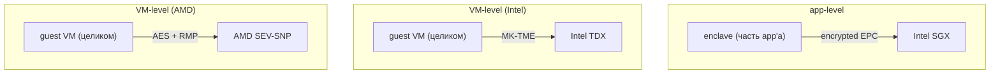
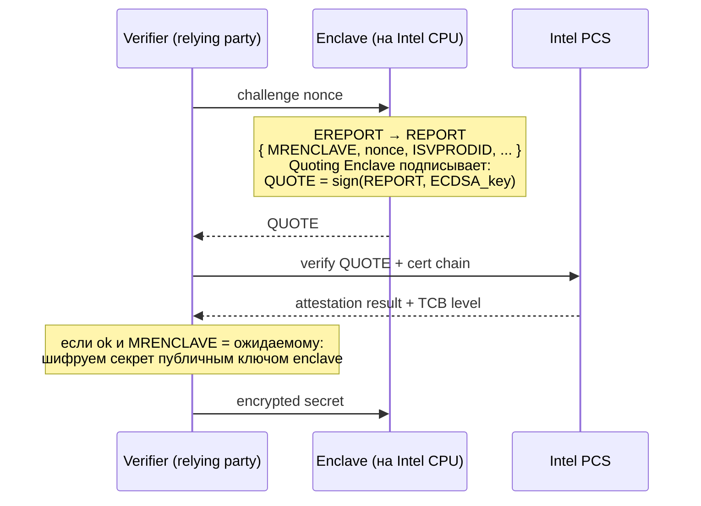
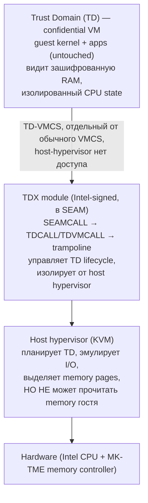
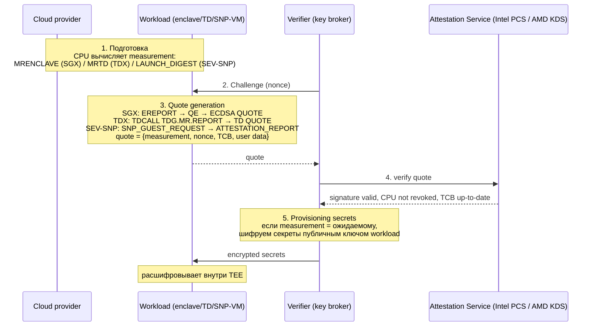
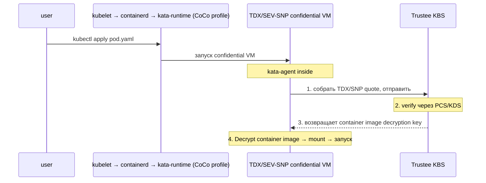

# Confidential Computing: SGX, TDX, SEV

Облако ставит перед разработчиком неудобный вопрос: ваша VM работает на железе, которым вы не владеете и не управляете.
Hypervisor облачного провайдера видит всю гостевую RAM, может снять её dump, прочитать ключи шифрования из памяти,
подменить инструкции в коде гостя. Юридические соглашения и compliance-аудиты помогают, но не заменяют технической
гарантии: пока hypervisor имеет физический доступ к памяти, любой rogue администратор и любой эксплуатационный баг
ставят данные клиента под угрозу.

Confidential computing — это набор аппаратных механизмов, который переворачивает модель доверия: hypervisor продолжает
управлять расписанием и I/O, но **не может прочитать или модифицировать содержимое памяти гостя**. Память шифруется
ключом, хранящимся в CPU; целостность защищается hardware-структурами; через механизм **attestation** клиент может
криптографически доказать третьей стороне, что его код исполняется в неподделанном TEE на не-revoked CPU.

## TEE: общие принципы

**Trusted Execution Environment (TEE)** — обобщённое название для аппаратных механизмов, реализующих три свойства:

| Свойство              | Что это значит                                                              |
|-----------------------|-----------------------------------------------------------------------------|
| **Memory encryption** | Содержимое RAM зашифровано аппаратно; даже если host прочитает физическую   |
|                       | страницу или сделает cold-boot attack, увидит cipher                        |
| **Integrity**         | Защита от подмены страниц: попытка hypervisor'а заменить страницу гостя     |
|                       | детектируется и вызывает abort или machine check                            |
| **Attestation**       | CPU подписывает «измерение» (hash кода/конфигурации) ключом, удостоверенным |
|                       | производителем; внешний verifier может проверить подпись                    |
| **Sealing**           | Шифрование данных ключом, привязанным к identity TEE; расшифровать можно    |
|                       | только из того же TEE на том же CPU                                         |

Существует три семейства реализаций на x86: **Intel SGX** (application-level enclaves), **Intel TDX** (VM-level
confidential VM) и **AMD SEV** (тоже VM-level). ARM имеет аналог — TrustZone и Realm Management Extension; в этой
статье — только x86.



## Intel SGX

**Software Guard Extensions** — реализация TEE на уровне приложения, появилась в Skylake (2015). Программа выделяет
«**enclave**» — защищённую область в своём адресном пространстве, в которой исполняется доверенный код. Память enclave
аппаратно шифруется, нешифрованная копия существует только внутри CPU, в L1/L2 cache. Никто, включая kernel и
hypervisor, не может прочитать enclave извне.

```
SGX address space:

   User process (untrusted)             Enclave (trusted)
   ┌───────────────────────┐            ┌────────────────────────┐
   │ обычный код, stack,   │            │ enclave code           │
   │ heap, libc            │            │ enclave heap           │
   │                       │            │ enclave stack          │
   │      ┌─────────┐      │            └─────────┬──────────────┘
   │      │ ECALL ──┼──────┼──── enter ──────────▶│
   │      └─────────┘      │            (через EENTER)
   │                       │                      │ работает с
   │      ┌─────────┐      │                      │ зашифрованной EPC
   │      │ ◀───────┼──────┼──── exit ────────────┤ (Enclave Page Cache)
   │      │  OCALL  │      │            (через EEXIT)
   │      └─────────┘      │
   └───────────────────────┘
```

### EPC и memory encryption

**EPC (Enclave Page Cache)** — выделенный участок физической RAM, в котором живут все enclave-страницы. Контроллер
памяти на CPU перехватывает все обращения к EPC: данные пишутся в RAM зашифрованными (AES в режиме CTR), читаются —
расшифровываются. Кэш-линии внутри CPU — открытый текст; в RAM никогда не попадает unencrypted.

Целостность защищена **Merkle tree**: для каждой EPC-страницы хранится MAC, корень дерева — в SRAM на чипе. Попытка
hypervisor'а подменить шифр-текст детектируется при чтении: MAC не совпадает → CPU генерирует exception.

Размер EPC — серьёзное ограничение. На consumer-CPU выделяется 128 МБ, на Xeon — до 512 МБ. Если enclave хочет больше
памяти, kernel делает **EPC paging**: шифрует страницу дополнительным ключом и эвакуирует в обычную RAM. Каждое
возвращение страницы — десятки тысяч циклов на крипто + integrity check. Workload, активно использующий >256 МБ
enclave-памяти, может терять 50-90% производительности.

### ECALL и OCALL

Enclave не может вызывать syscall напрямую: для CPU инструкция `INT 0x80` или `SYSCALL` из enclave — недопустимая, CPU
бросает `#UD`. Это сделано намеренно: если enclave вызывает kernel, malicious kernel может перехватить вызов и подменить
результат. Вместо этого:

- **ECALL** — вызов из обычного кода в enclave (`EENTER`).
- **OCALL** — enclave хочет сделать syscall → возвращается в untrusted код (`EEXIT`) → unt-код делает syscall → передаёт
  результат обратно через ECALL.

Каждое пересечение границы — десятки тысяч циклов (full state save/restore + EPC scrubbing). Syscall-heavy enclave —
плохая идея.

### Runtime libraries

Чтобы не переписывать приложение под ECALL/OCALL, существуют runtime'ы, которые поднимают полноценный Linux ABI
внутри enclave:

- **Gramine** (бывший Graphene-SGX) — реализует Linux ABI как библиотеку, исполняемую внутри enclave. Unmodified ELF
  можно запустить как `gramine-sgx ./myapp`.
- **Occlum** — то же самое, но на Rust, с поддержкой multi-process через библиотечный fork.
- **EGo** — то же для Go-приложений.

### Attestation

Перед тем как загрузить секреты в enclave, клиент хочет убедиться, что разговаривает именно с подлинным enclave на
не-скомпрометированном CPU. Процесс:



`MRENCLAVE` — SHA-256 кода и initial state enclave; `MRSIGNER` — hash публичного ключа подписи. Verifier проверяет, что
именно ожидаемый код запущен на не-revoked Intel CPU. Раньше использовался **EPID** (Enhanced Privacy ID) с
обязательным онлайн-обращением к Intel; современный **DCAP (Data Center Attestation Primitives)** — offline ECDSA
attestation с локальным PCCS-кешем.

### Известные атаки

SGX побит десятками side-channel attacks: **Foreshadow** (L1TF, чтение enclave через speculative execution),
**Plundervolt** (изменение voltage сбивает AES integrity), **ÆPIC Leak** (чтение enclave через APIC register), **SGAxe**
(extracting attestation keys). Intel реагирует через TCB updates (microcode + recovery), которые требуют re-attestation,
но фундаментально side-channel surface SGX остаётся открытым.

## Intel TDX

**Trust Domain Extensions** — VM-level confidential computing от Intel, доступен с Sapphire Rapids (2023). Идея: вместо
защиты отдельной части приложения защищать целую VM. Гость может быть unmodified Linux, который запускает обычные
приложения; hypervisor управляет ресурсами, но не имеет доступа к памяти гостя.



### SEAM и TDX module

Intel добавил новый CPU mode — **SEAM (Secure Arbitration Mode)** — режим даже более привилегированный, чем VMX root.
В SEAM работает **TDX module** — Intel-подписанный кусок кода, который инициализирует и управляет TD. Hypervisor не
может войти в SEAM напрямую; для управления TD он делает `SEAMCALL`, и SEAM-код решает, разрешено ли действие.

### MK-TME

Шифрование памяти выполняется через **MK-TME (Multi-Key Total Memory Encryption)**: контроллер памяти поддерживает до
2048 различных AES ключей, каждый TD получает уникальный ключ, hypervisor не имеет доступа к ключам. При записи в RAM
данные автоматически шифруются ключом владельца страницы; чтение из чужого TD возвращает мусор.

### Integrity

Защита от replay/swap attacks (host подменяет старую страницу TD новой версией с той же позиции) обеспечивается
дополнительной структурой — каждая TD-страница имеет связанный MAC, проверяемый на каждом доступе.

### Attestation

Аналогично SGX: TD-quote, подписанный CPU-keyом, проверяется через Intel PCS. Quote содержит `MRTD` (measurement of TD
initial state) и `MRCONFIGID` (configuration hash) — verifier проверяет, что загружен ожидаемый kernel + initramfs.

### Linux support

| Уровень | Состояние                                                                      |
|---------|--------------------------------------------------------------------------------|
| Guest   | mainline с Linux 6.x (драйверы `arch/x86/coco/tdx/`)                           |
| Host    | требует Intel proprietary patches; идёт постепенный merge в mainline (KVM TDX) |

**Confidential Containers (CoCo)** — проект CNCF: Kubernetes pods, запускаемые внутри TDX/SEV-SNP VM с встроенной
attestation против KBS (Key Broker Service). Pod видит обычный Kubernetes API, операторы кластера не имеют доступа к
container'у.

## AMD SEV

AMD двигался к VM-level confidential computing раньше Intel: семейство **SEV (Secure Encrypted Virtualization)**
эволюционировало через три поколения.

### SEV (Zen 1, 2017)

Базовая версия: каждая гостевая VM получает уникальный AES-128 ключ, контроллер памяти шифрует все обращения гостя
этим ключом. Hypervisor продолжает программировать NPT (Nested Page Tables), но содержимое RAM ему недоступно.
Слабость: регистры CPU (XSAVE area) при VM-exit складываются в host-memory **в открытом виде** — host может прочитать
state гостя.

### SEV-ES (Encrypted State, Zen 2)

Расширение SEV: при VM-exit регистры тоже шифруются (XSAVE area encrypted с тем же VM-key). Host видит только бинарный
мусор. Чтобы host всё-таки мог обработать exit (например, эмулировать I/O инструкцию), гость через **VC handler**
(VMM Communication exception) шлёт минимальный subset регистров, нужный для конкретного exit'а. Это требует guest
support (VC handler — guest-side code) и переписывания части ядра.

### SEV-SNP (Secure Nested Paging, Zen 3, 2021)

Главное добавление — **integrity protection через RMP (Reverse Map Table)**:

```
RMP (Reverse Map Table):

   Host physical page X ──▶ RMP entry:
                              { owner = TD_id или HOST,
                                guest_pfn = ожидаемая GPA,
                                assigned = bool,
                                size = 4K|2M }

   При каждом доступе hardware проверяет:
     - страница принадлежит ожидаемому владельцу
     - GPA в гостевой PT совпадает с RMP.guest_pfn
   Несовпадение → page fault, attack detected
```

RMP закрывает класс атак, при которых host подменяет какую-то страницу гостя другой (swap attack, alias attack,
replay). Hypervisor может выделить новые страницы гостю, но не может «перевесить» уже выделенную с одной GPA на другую.

Атестация: **SNP attestation report**, подписанный VCEK (Versioned Chip Endorsement Key); проверяется через AMD KDS
(Key Distribution Service).

## Сравнительная таблица

| Параметр                | SGX                        | TDX                       | SEV-SNP                    |
|-------------------------|----------------------------|---------------------------|----------------------------|
| Уровень защиты          | App enclave                | Full VM                   | Full VM                    |
| CPU                     | Intel (Skylake+)           | Intel (Sapphire Rapids+)  | AMD EPYC (Milan+)          |
| Memory size             | ~256 MB EPC                | до host RAM               | до host RAM                |
| Memory encryption       | AES-CTR + Merkle integrity | MK-TME + per-TD integrity | AES + RMP integrity        |
| Регистры CPU при exit   | защищены (внутри enclave)  | защищены                  | защищены (с ES)            |
| Attestation             | DCAP / EPID                | TD-quote → Intel PCS      | SNP report → AMD KDS       |
| Linux support           | mainline (drivers/misc)    | guest mainline; host WIP  | guest+host mainline        |
| Side-channel resistance | слабая (множество CVE)     | средняя                   | средняя                    |
| Use case                | защищённые библиотеки      | unmodified Linux guest    | unmodified Linux guest     |
| Cloud вендоры           | Azure CC enclaves          | Azure DCe/ECe, GCP CC     | Azure DCa/ECa, GCP CC, AWS |

## Attestation flow (универсальный)

Хотя криптография у SGX/TDX/SEV различается, концептуально процесс один: third party verifier удостоверяется, что
доверяет конкретному TEE на конкретном CPU.



В Kubernetes это формализовано как **Trustee / KBS (Key Broker Service)** — отдельный сервис в кластере, который
держит секреты и выдаёт их только pod'ам, прошедшим attestation.

## Confidential Containers (CoCo)

CoCo — это интеграция TDX/SEV-SNP/SGX с Kubernetes. Pod запускается внутри confidential VM (TDX или SEV-SNP),
attestation производится автоматически перед mounting секретов из vault.



Это решает классическую cloud-проблему: cluster admin или cloud provider не могут прочитать секреты, лежащие в pod'е,
потому что секреты лежат внутри encrypted memory TDX/SNP, а ключ выдаётся только после attestation.

## Limitations

| Проблема                | Описание                                                                   |
|-------------------------|----------------------------------------------------------------------------|
| Debug                   | host gdb не видит memory → дебаг через guest-side gdb или special debug TD |
| Live migration          | требует re-encryption на дестинейшн с новым CPU-keyом → сложнее            |
| Performance overhead    | TDX/SEV-SNP: ~2-5% CPU, ~5-15% memory bandwidth; SGX: значительно больше   |
| I/O без passthrough     | virtio bounce buffers (shared memory) — копирование между TD и host        |
| Side-channel attacks    | cache timing, branch prediction остаются риском                            |
| Trusted firmware update | требует re-attestation; TCB changes ломают pinned measurements             |

Дебаг confidential VM требует особого режима: TDX поддерживает **debug TD** (с открытой памятью, но non-production
attestation), SEV-SNP имеет аналогичный bit в launch policy. В production debug запрещён — иначе механизм бессмыслен.

Live migration confidential VM работает через **memory re-encryption**: на source CPU расшифровывает страницы своим
ключом, передаёт по сети (шифруется TLS), на destination CPU зашифровывает уже своим. Целостность сохраняется через
attested key exchange между source и dest CPU.

## Связанные темы

- [Виртуализация: основы](foundations.md) — VMX root, VMCS, на котором надстраивается SEAM/TDX
- [Виртуализация памяти](memory_virtualization.md) — EPT/NPT, поверх которых работают RMP и MK-TME
- [MicroVMs](microvms.md) — confidential containers поверх microVM
- [Nested virtualization](nested_virtualization.md) — почему confidential VM усложняют nested

## Источники

- [Intel SGX documentation](https://www.intel.com/content/www/us/en/architecture-and-technology/software-guard-extensions.html)
- [Intel TDX whitepaper](https://www.intel.com/content/www/us/en/developer/articles/technical/intel-trust-domain-extensions.html)
- [AMD SEV-SNP whitepaper](https://www.amd.com/system/files/TechDocs/SEV-SNP-strengthening-vm-isolation-with-integrity-protection-and-more.pdf)
- [Confidential Containers project](https://confidentialcontainers.org/)
- [Gramine project](https://gramineproject.io/)
- [Confidential Computing Consortium](https://confidentialcomputing.io/)
