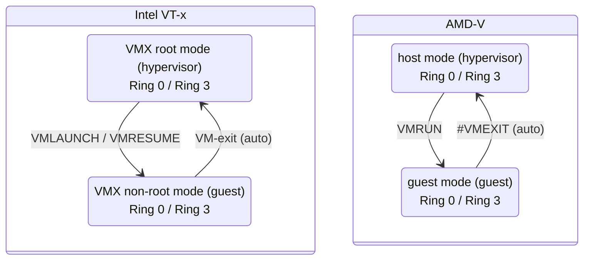
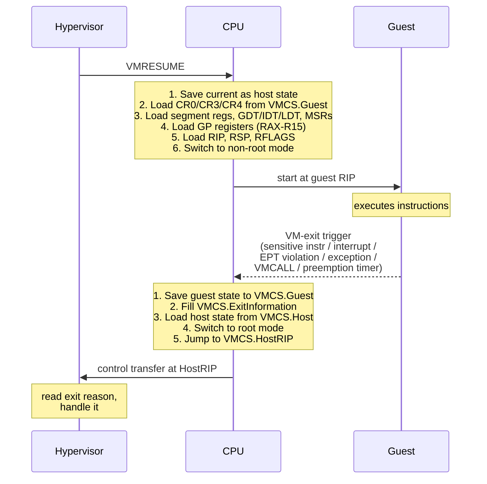
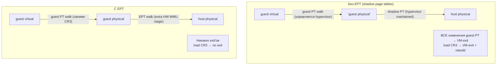
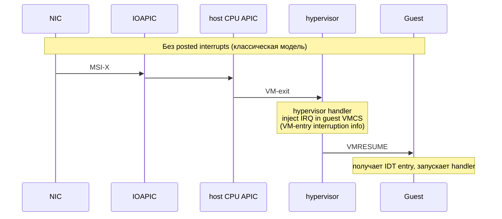
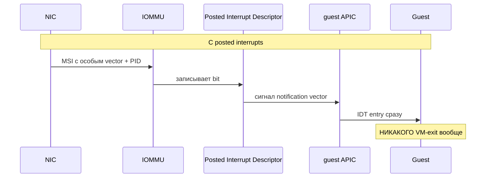
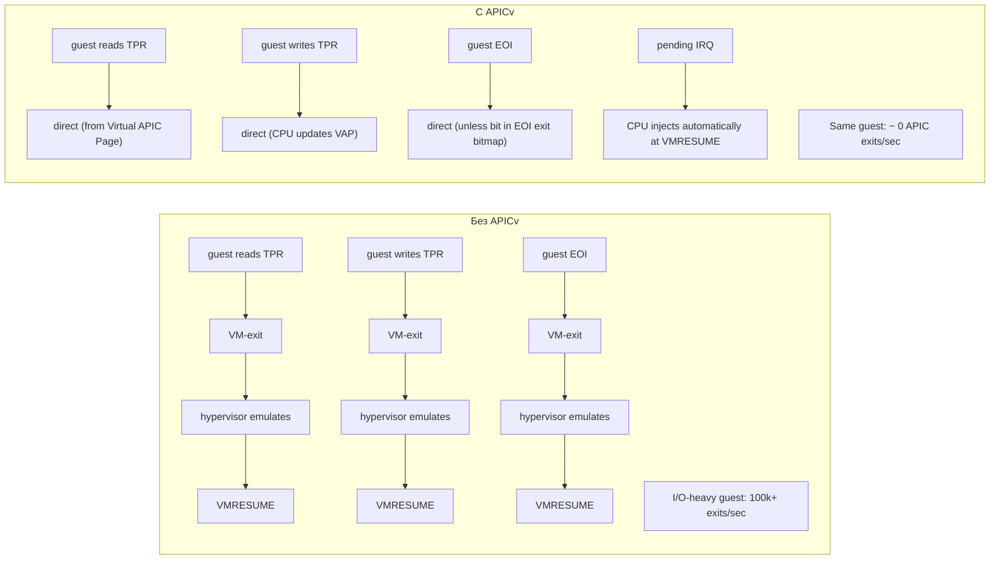
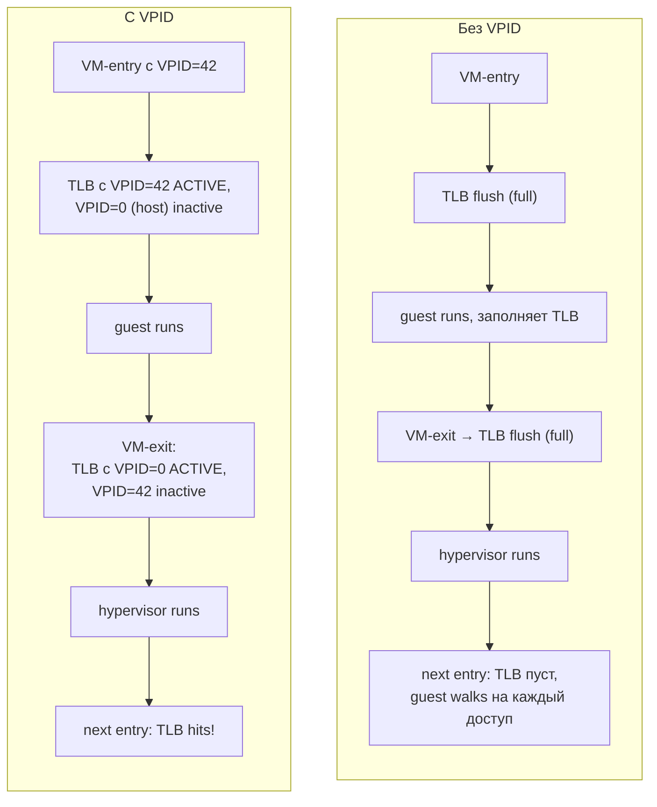

# CPU virtualization: VMX, VMCS, VM-exit'ы и paravirt KVM

Intel VT-x и AMD-V превратили виртуализацию x86 из набора хитрых хаков в инженерную дисциплину. Главная идея проста:
CPU получил новый режим, в котором гость может выполнять привилегированные инструкции, не задевая host. Все детали —
какие инструкции вызывают VM-exit, как сохраняется состояние, как минимизировать число exit'ов — определяют, будет ли
VM работать с overhead'ом в 2% или в 200%.

VM-exit — **доминирующая статья расходов** в HW-assisted виртуализации. Один exit стоит 1000-5000 cycles, и если
workload генерирует миллион exit'ов в секунду, на это уходит уже больше CPU, чем на полезную работу. Соответственно
весь дизайн современных hypervisors — это набор техник «как не делать VM-exit там, где он не нужен».

## VMX и SVM: два режима для одной задачи

Intel называет свою технологию **VT-x (Virtualization Technology for x86)**, реализованную через **VMX (Virtual
Machine Extensions)**. AMD называет свою — **AMD-V (Pacifica)**, реализованную через **SVM (Secure Virtual Machine)**.
Идеологически они идентичны, но instruction set и структуры разные.

Оба добавляют поверх существующей системы Ring 0–3 ещё одно «измерение»: каждый ring может работать либо в **root
mode** (для hypervisor), либо в **non-root mode** (для гостя).



Главное отличие от классического Ring 0–3 — **полностью независимые наборы регистров для гостя и hypervisor**. CPU
хранит два рабочих набора (CR-регистры, segment selectors, IDT/GDT base, MSR'ы), и при переходе между ними
автоматически сохраняет/восстанавливает оба.

Чтобы войти в VMX-режим, hypervisor выполняет:

```
1. Проверка: CPUID.01:ECX.VMX[bit 5] = 1
   (поддерживает ли CPU VT-x)

2. Включить VMX в CR4:
   movq    %cr4, %rax
   orq     $CR4_VMXE, %rax
   movq    %rax, %cr4

3. Включить VMX в MSR IA32_FEATURE_CONTROL (если ещё не):
   wrmsr   IA32_FEATURE_CONTROL = lock | enable_vmx_outside_smx

4. Подготовить 4 KB VMXON region:
   page_align(vmxon_region)
   vmxon_region[0..3] = VMCS_revision_id   (нижние 31 бит MSR IA32_VMX_BASIC)

5. Войти в root mode:
   vmxon   [physical_addr_vmxon_region]
   (после этой инструкции CPU в VMX root mode)
```

С этого момента hypervisor контролирует VM. AMD-V проще — никакого `VMXON`, просто включить флаг `SVME` в
`EFER.SVME` MSR, и можно делать `VMRUN`.

## VMCS: 4 KB описание гостя

VMCS (Virtual Machine Control Structure) — структура, которая хранит **всё**, что нужно знать про конкретную VM:
guest state, host state, и control fields. На AMD аналогичная структура называется VMCB (Virtual Machine Control
Block).

VMCS — **per-vCPU**. Если у вас 8 гостей по 4 vCPU каждый — будет 32 VMCS, каждая занимает 4 KB. Они хранятся в RAM,
и hypervisor работает с ними через специальные инструкции `VMREAD` / `VMWRITE` (а не обычным `MOV`), потому что
точное расположение полей CPU-зависимое.

```
   VMCS layout (упрощённо, ~ 4 KB)

   ┌───────────────────────────────────────────────────────────────┐
   │ VMCS revision identifier (32 бит, идентификатор схемы CPU)    │
   ├───────────────────────────────────────────────────────────────┤
   │ VMX abort indicator                                           │
   ├───────────────────────────────────────────────────────────────┤
   │                                                               │
   │  Guest State Area                                             │
   │  ┌─────────────────────────────────────────────────────────┐  │
   │  │ CR0, CR3, CR4                                           │  │
   │  │ RSP, RIP, RFLAGS                                        │  │
   │  │ CS, SS, DS, ES, FS, GS (selector + base + limit + AR)   │  │
   │  │ LDTR, TR (task register)                                │  │
   │  │ GDTR, IDTR (base + limit)                               │  │
   │  │ DR7                                                     │  │
   │  │ MSR'ы: IA32_DEBUGCTL, IA32_SYSENTER_*, IA32_EFER, ...   │  │
   │  │ activity state, interruptibility state                  │  │
   │  └─────────────────────────────────────────────────────────┘  │
   │                                                               │
   │  Host State Area                                              │
   │  ┌─────────────────────────────────────────────────────────┐  │
   │  │ CR0, CR3, CR4 (hypervisor)                              │  │
   │  │ RSP, RIP (куда прыгать после VM-exit'а)                 │  │
   │  │ CS, SS, DS, ES, FS, GS selectors + bases                │  │
   │  │ GDTR, IDTR base                                         │  │
   │  │ MSR'ы hypervisor'а                                      │  │
   │  └─────────────────────────────────────────────────────────┘  │
   │                                                               │
   │  VM-Execution Control Fields                                  │
   │  ┌─────────────────────────────────────────────────────────┐  │
   │  │ Pin-Based Controls (NMI, IRQ exiting)                   │  │
   │  │ Primary Processor-Based Controls (HLT exit, MOV-CR8,...)│  │
   │  │ Secondary Processor-Based Controls (EPT enable, VPID)   │  │
   │  │ Exception Bitmap (какие #exception вызывают exit)       │  │
   │  │ I/O Bitmap A/B (какие порты вызывают exit при IN/OUT)   │  │
   │  │ MSR Bitmap (какие MSR'ы вызывают exit при RDMSR/WRMSR)  │  │
   │  │ TSC Offset                                              │  │
   │  │ CR0/CR4 Guest/Host Mask (какие биты гость не может)     │  │
   │  │ EPT Pointer (корень EPT)                                │  │
   │  │ VPID                                                    │  │
   │  └─────────────────────────────────────────────────────────┘  │
   │                                                               │
   │  VM-Exit Controls (что сохранять/восстанавливать при exit)    │
   │  VM-Entry Controls (что подгружать при entry)                 │
   │                                                               │
   │  VM-Exit Information Fields (заполняются CPU при exit)        │
   │  ┌─────────────────────────────────────────────────────────┐  │
   │  │ Exit Reason (основная причина)                          │  │
   │  │ Exit Qualification (детали)                             │  │
   │  │ Guest-Linear-Address, Guest-Physical-Address            │  │
   │  │ VM-Instruction Length, VM-Instruction Info              │  │
   │  └─────────────────────────────────────────────────────────┘  │
   └───────────────────────────────────────────────────────────────┘
```

При выполнении `VMLAUNCH`/`VMRESUME` CPU загружает guest state из VMCS, переключается в non-root mode и начинает
исполнять guest код с `RIP` гостя. При VM-exit CPU автоматически сохраняет guest state обратно в VMCS, загружает host
state, и hypervisor получает управление в точке, заданной полем `Host RIP`.

Hypervisor работает с VMCS через инструкции:

```
   VMPTRLD <physical_addr>    ← сделать VMCS текущей для этого CPU
   VMREAD  rax, $field        ← прочитать поле из текущей VMCS
   VMWRITE $field, rax        ← записать поле в текущую VMCS
   VMCLEAR <physical_addr>    ← сбросить состояние, write back
```

Каждая VMCS «живёт» только на одном CPU единовременно — для миграции vCPU между ядрами hypervisor делает `VMCLEAR` на
старом ядре и `VMPTRLD` на новом.

## VMRUN / VMLAUNCH / VMRESUME

Чтобы переключиться в гостя, Intel требует двух разных инструкций. Первый раз для VMCS используется `VMLAUNCH`, все
последующие — `VMRESUME`. Это позволяет CPU оптимизировать «холодный» запуск (полная загрузка состояния) от
«горячих» возвратов (только то, что изменилось).

AMD-V проще: всегда `VMRUN`, который и launches, и resumes.



Самое интересное — guest state и host state **полностью изолированы**. После VM-exit hypervisor выполняется в своём
адресном пространстве (свой CR3), со своим стеком (`Host RSP`), со своим IDT — никакая ошибка в гостевом коде не
может затронуть hypervisor через регистры.

## Анатомия VM-exit

```mermaid
sequenceDiagram
    participant Guest
    participant CPU
    participant HV as Hypervisor
    Note over Guest: mov %cr3, %rax (привилегированная)
    Guest->>CPU: tact 0: instruction decode
    Note over CPU: tact 1: detected MOV from CR3 in non-root<br/>→ unconditional VM-exit
    Note over CPU: tact 2..N: save guest state to VMCS<br/>RIP/RSP/RFLAGS, RAX-R15,<br/>CR0/CR3/CR4, segments, GDTR/IDTR,<br/>MSRs from VM-exit MSR-Store<br/>~ 100-200 cycles
    Note over CPU: tact N: fill VMCS.ExitInfo<br/>ExitReason = 28 (MOV CR3)<br/>ExitQualification, InstructionLength = 3
    Note over CPU: tact M: load host state from VMCS<br/>CR3 ← host CR3 (AS switch)<br/>RIP/RSP ← host, switch to root mode<br/>~ 200-400 cycles
    CPU->>HV: tact P: execute at HostRIP
    Note over HV: exit_handler:<br/>reason = VMREAD ExitReason<br/>switch(reason) { case 28: handle_cr3_write(); }<br/>VMWRITE GuestRIP += instr_length
    HV->>CPU: tact Q: VMRESUME
    Note over CPU: restore guest state, ~ 200-400 cycles
    CPU->>Guest: continue at next instruction
    Note over Guest,HV: Total: one VM-exit ≈ 1000–5000 cycles (300 ns – 1 µs)
```

Стоимость VM-exit'а делится на три части:

- **direct (hardware)**: 600–1000 cycles на save/restore guest и host state. CPU делает это в микрокоде, на новых
  поколениях быстрее.
- **handler in hypervisor**: 200–3000 cycles, зависит от сложности эмуляции. Простой `CPUID` обрабатывается за
  десятки cycles, эмуляция MMIO-операции может стоить тысячи.
- **косвенные**: cache miss'ы (cold caches после переключения AS), TLB miss'ы, branch predictor разогрев. Аналогично
  обычному context switch.

## Типы VM-exits

Не все exit'ы стоят одинаково. CPU и hypervisor сотрудничают, чтобы наиболее частые операции либо не делали exit
вообще, либо обрабатывались максимально быстро.

| Exit reason          | Когда                                      | Стоимость    | Можно ли избежать         |
|----------------------|--------------------------------------------|--------------|---------------------------|
| CPUID                | гость спрашивает feature set               | низкая       | нет (всегда exit)         |
| RDMSR / WRMSR        | чтение/запись Model Specific Register      | средняя      | да — через MSR bitmap     |
| IN / OUT (PIO)       | I/O port access                            | средняя      | да — через I/O bitmap     |
| EPT violation        | nested page fault (guest physical missing) | высокая      | nope, но prefetch         |
| External interrupt   | устройство прерывает хост                  | средняя      | posted interrupts         |
| HLT                  | гость говорит «делать нечего»              | низкая       | да, если флаг убрать      |
| MOV CR (0,3,4,8)     | гость пишет в control register             | средняя      | CR Mask для отдельных бит |
| VMCALL / VMMCALL     | явный hypercall                            | средняя      | nope, by design           |
| Triple fault         | unrecoverable error в госте                | catastrophic | guest crash, kill VM      |
| EPT misconfiguration | сломанные EPT entries                      | bug в HV     | nope, debug               |
| Preemption timer     | hypervisor timer истёк                     | низкая       | использовать TSC deadline |
| INVLPG               | guest инвалидирует TLB-запись              | средняя      | INVPCID для batch         |
| Task switch          | guest делает hardware task switch          | редко        | --                        |

**CPUID всегда вызывает exit**, потому что hypervisor должен подменить ответ: гость должен видеть только те features,
которые hypervisor готов поддержать (нельзя exposing AVX-512 в госте, если host эмулирует не на AVX-512). На каждый
CPUID в госте уходит ~ 500 ns — поэтому загрузка ОС в VM такая медленная: тысячи CPUID при инициализации kernel.

**RDMSR/WRMSR** через MSR bitmap. В VMCS есть указатель на 4 KB битмап, по 1 биту на каждый MSR (4096 байт × 8 бит = 32k
MSR, по 2 битмапа — для чтения и записи). Если бит выставлен — операция с этим MSR вызывает exit. Hypervisor для
большинства MSR оставляет бит = 0 — гость может читать/писать их напрямую без exit. Только sensitive MSR'ы
перехватываются.

```
   MSR Bitmap (4 KB)
   ┌──────────────────────────────────────────────────────────┐
   │ Read bitmap, low MSRs (0x00000000-0x00001FFF)            │  1024 байта
   ├──────────────────────────────────────────────────────────┤
   │ Read bitmap, high MSRs (0xC0000000-0xC0001FFF)           │  1024 байта
   ├──────────────────────────────────────────────────────────┤
   │ Write bitmap, low MSRs                                   │  1024 байта
   ├──────────────────────────────────────────────────────────┤
   │ Write bitmap, high MSRs                                  │  1024 байта
   └──────────────────────────────────────────────────────────┘

   Бит = 1 → exit при доступе к этому MSR
   Бит = 0 → guest читает/пишет MSR напрямую (~5 cycles, no exit)
```

Аналогично I/O bitmap для PIO portов: 64 KB битмап для 65536 портов. KVM для большинства портов оставляет 0
(пропускает), exit'ит только при обращении к эмулируемым устройствам (legacy 0x60 keyboard, 0xCF8 PCI configuration,
и т.д.).

## EPT и nested page faults

Когда у гостя свои таблицы страниц, простой алгоритм будет такой: hypervisor поддерживает **shadow page tables** —
теневую копию гостевых таблиц, в которой guest physical уже переведена в host physical. Гость пишет в свои таблицы,
hypervisor через write-protection ловит это и обновляет shadow. На каждое изменение PTE — VM-exit. Для load CR3
(переключение процесса в госте) — exit + полная перестройка shadow root.

Это было невыносимо медленно. EPT/NPT решили проблему добавлением **второго уровня трансляции** прямо в железе:



EPT — отдельная иерархия таблиц страниц (тоже 4-уровневая на x86-64), но управляется **только hypervisor'ом**.
Гость про неё не знает: для гостя адрес, который он считает «физическим», MMU автоматически прогоняет через EPT и
получает настоящий host physical.

При EPT violation (адреса нет в EPT, гость обратился к памяти, которую hypervisor ещё не замапил) случается **VM-exit
типа EPT violation** — hypervisor аллоцирует страницу, обновляет EPT, возвращает гостя.

Цена: TLB MMU теперь делает **два walk'а** на каждый miss — один по guest PT, второй по EPT. Это до 4×4 = 16 обращений
к памяти. Чтобы это компенсировать, MMU кэширует промежуточные результаты в **paging-structure cache** и **PML4/PDPTE
cache**.

## Оптимизации: как сократить число exit'ов

Каждое нововведение в VT-x за последние 15 лет — это попытка убрать VM-exit для какого-то частого случая.

### MSR bitmap и I/O bitmap

Уже обсудили: позволяют гостю напрямую читать/писать sensitive registers без exit'а, если hypervisor разрешает. Самый
простой и эффективный механизм — современный Linux-гость на KVM делает миллионы RDTSC и RDMSR без exit'ов.

### Posted interrupts

Классическая модель доставки interrupt'а в гостя такая: устройство прерывает host, host получает interrupt в root
mode (VM-exit), hypervisor решает что interrupt относится к гостю, инжектирует interrupt в guest VMCS, делает
VMRESUME, и только после этого guest действительно получает interrupt. На каждый interrupt — два exit'а.

Posted interrupts (Intel VT-d, 2013) позволяют **доставить interrupt напрямую в guest без exit вообще**:





**Posted Interrupt Descriptor (PID)** — 64-байтная структура в RAM, одна на vCPU. IOMMU при доставке MSI с правильным
remapping выставляет нужный бит в PID. Guest APIC видит его и доставляет interrupt без участия hypervisor.

Это критично для **interrupt-intensive workloads** — high-throughput NICs, NVMe, GPU passthrough. С posted interrupts
network throughput в VM подходит к bare-metal.

### APICv (APIC virtualization)

Виртуализация локального APIC. Старая модель: каждое чтение/запись регистра APIC (TPR, EOI, ICR) — VM-exit, потому
что APIC влияет на доставку interrupt'ов. Для guest'а, который делает много I/O и обрабатывает много interrupt'ов,
это сотни тысяч exit'ов в секунду.

APICv (введён в Haswell, 2013) реализует часть APIC прямо в железе:

- **TPR shadow** — guest пишет в TPR без exit'а, hypervisor видит изменения только если они опускаются ниже threshold.
- **Virtual APIC page** — 4 KB страница, через которую guest читает/пишет APIC registers напрямую. CPU обновляет её.
- **Virtual-interrupt delivery** — CPU сам injectит pending interrupt'ы в guest без exit'а при VMRESUME.
- **EOI** — guest пишет в EOI register, CPU очищает соответствующий bit в **EOI exit bitmap**. Exit только для
  тех vectors, которые hypervisor явно отметил.



APICv + posted interrupts вместе дают почти нулевой interrupt overhead. Это требование для NFV (Network Function
Virtualization), где VM обрабатывает миллионы пакетов в секунду.

### VPID (Virtual Processor Identifier)

При каждом VM-entry/exit CPU переключает CR3 (между guest CR3 и host CR3). Это обычно вызывает **TLB flush** — все
записи становятся невалидными, потому что CPU не знает, к какому address space они относятся.

VPID — 16-битный tag, который добавляется к каждой TLB-записи. Hypervisor назначает каждой VM (точнее, каждой паре
VM+vCPU) свой VPID, и при переключении TLB-записи **не удаляются**, а становятся неактивными:



Идея ровно такая же, как PCID/ASID для process context switching внутри одной ОС (см.
[context switch](../processes/context_switch.md)), только применённая на уровень VM.

### VMCS shadowing (nested virtualization)

Когда гость сам является hypervisor'ом (запускает VM внутри VM), его операции с VMCS — `VMREAD`, `VMWRITE`, `VMLAUNCH`
— должны попасть в L0 hypervisor. По умолчанию все эти инструкции делают exit, и L0 эмулирует их. Для guest hypervisor
это означает тысячи exit'ов на каждый запуск nested VM.

VMCS shadowing (introduced с Haswell) позволяет guest hypervisor читать и писать свои **shadow VMCS** напрямую без
exit'а. L0 hypervisor синхронизирует shadow VMCS с настоящей только в моменты, когда это нужно — при
VMLAUNCH/VMRESUME nested guest. Сокращает overhead nested virtualization в 5-10 раз.

## KVM paravirtualization

Несмотря на полную аппаратную поддержку, есть случаи, когда **paravirtualization всё ещё выигрывает**. Если гостевое
ядро **знает**, что под ним hypervisor, оно может сделать вещи, которые невозможно сделать аппаратно.

KVM expose свои возможности через CPUID leaf `0x40000000`. Guest kernel читает этот leaf, видит signature `KVMKVMKVM`,
и активирует paravirt drivers.

### kvm-clock

Проблема классических time sources в VM: **TSC (Time Stamp Counter)** на разных физических CPU не синхронизирован, а
vCPU может мигрировать между ядрами. Guest читает TSC, получает время T1, мигрирует на другое ядро, читает TSC,
получает T2 — и T2 может оказаться меньше T1, потому что физические counter'ы отличаются. Это ломает time keeping в
госте.

**kvm-clock** — paravirt clocksource. Hypervisor поддерживает per-vCPU структуру в shared memory с гостем,
содержащую `tsc_timestamp` и `system_time` на момент последнего VM-entry, плюс multiplier и shift для конвертации
TSC delta в наносекунды. Guest читает TSC, читает структуру (без exit'а!), считает время. Гарантируется
монотонность даже при vCPU migration.

```
   shared memory page (host writes, guest reads)
   ┌─────────────────────────────────────────────────┐
   │ struct pvclock_vcpu_time_info {                 │
   │     uint32_t version;                           │
   │     uint32_t pad0;                              │
   │     uint64_t tsc_timestamp;                     │
   │     uint64_t system_time;                       │
   │     uint32_t tsc_to_system_mul;                 │
   │     int8_t   tsc_shift;                         │
   │     uint8_t  flags;                             │
   │     uint8_t  pad[2];                            │
   │ };                                              │
   └─────────────────────────────────────────────────┘

   Guest читает время:
       1. v1 = read(version);                    // ловим seqlock
       2. tsc = rdtsc();                          // нативное чтение TSC
       3. system_time, tsc_ts, mul, shift = read fields;
       4. v2 = read(version);
       5. if (v1 != v2 || v1 & 1) goto 1;        // host updated, retry
       6. delta = tsc - tsc_ts;
       7. return system_time + (delta * mul) >> shift;

   Ноль exit'ов. Точность — наносекунды.
```

### kvm-steal-time

Когда vCPU не получает CPU (потому что host scheduler дал time slice другому процессу), guest kernel этого **не
видит** — для него таймер ходит как обычно, и он считает, что просто медленно работает. Это путает CFS гостя:
он не понимает, что задержки не его вина, и применяет неправильные эвристики.

**Steal time accounting**: hypervisor поддерживает per-vCPU счётчик `steal`, который инкрементится на интервалы, когда
vCPU был ready, но не получал CPU. Guest читает этот счётчик и вычитает steal time из общего runtime, получая честные
метрики.

```bash
# В госте:
cat /proc/stat | grep '^cpu '
# cpu  user nice system idle iowait irq softirq steal ...
#                                              ^^^^^
#                          Cumulative steal time, ticks
```

Виден в `top` (поле `st`), `mpstat`. Если steal большой — host overcommitted, ваша VM не получает CPU.

### PV TLB shootdown

Если гость много-CPU и обновляет page table — он должен отправить **IPI (Inter-Processor Interrupt)** всем остальным
vCPU, чтобы те инвалидировали свои TLB. Каждый IPI — это **VM-exit на отправителе** (он пишет в ICR) и **возможно
VM-entry/exit на получателе** (если vCPU не работал, нужно его разбудить).

С paravirt KVM это превращается в **один hypercall** `KVM_HC_FLUSH_TLB`: гость говорит hypervisor «инвалидируй TLB
для этих vCPU», hypervisor делает это нативно (через INVLPG на host CPU), и пробуждает только активные vCPU. Один
exit вместо N.

### Async page fault

Сценарий: host swapped out страницу гостя. Guest обращается — EPT violation — hypervisor должен загрузить страницу с
диска. Это может занять миллисекунды. Всё это время **vCPU thread заблокирован**, гость не может делать ничего.

С async PF: hypervisor injects специальный **#PF в гостя** с маркером «async». Guest paravirt handler понимает, что
страница загружается, и **переключает gost task на другую** — гостевое ядро запускает scheduler внутри себя. Когда
страница готова, hypervisor injects interrupt «вот, страница есть» и гость возобновляет оригинальную task.

Полезно при overcommit memory — host своппит страницы гостя, но guest не блокируется, продолжает крутить другие
threads.

### KVM hypercalls

Все KVM paravirt вызовы идут через инструкцию `VMCALL` (Intel) или `VMMCALL` (AMD) с номером функции в RAX.

| Hypercall               | RAX | Назначение                                  |
|-------------------------|-----|---------------------------------------------|
| `KVM_HC_VAPIC_POLL_IRQ` | 1   | пробудить vCPU для проверки pending IRQ     |
| `KVM_HC_KICK_CPU`       | 5   | kick другой vCPU (для inter-vCPU signaling) |
| `KVM_HC_FLUSH_TLB`      | 11  | TLB shootdown для списка vCPU               |
| `KVM_HC_CLOCK_PAIRING`  | 9   | синхронизировать kvm-clock с host RTC       |
| `KVM_HC_SCHED_YIELD`    | 11  | yield CPU другому vCPU                      |

Аналогичный механизм есть у Hyper-V (HvCallXXX через `VMCALL`) и Xen (всё через `int 0x82` / `vmmcall`). Linux
поддерживает все три ABI — детектирует hypervisor через CPUID и переключается на соответствующий paravirt set.

## Стоимость VM-exit'ов: измерение

Подсчитать exit'ы на host'е — через perf или KVM tracepoints:

```bash
# Подсчёт KVM events за время работы guest'а:
perf stat -e 'kvm:*' -p $(pidof qemu-system-x86_64) sleep 10

# Подробная разбивка по причинам exit'ов:
perf record -e kvm:kvm_exit -p $(pidof qemu-system-x86_64) sleep 5
perf report --sort comm,dso

# Stats через kvm_stat (из qemu-utils):
kvm_stat
# Выводит таблицу: exits per reason per second
#   exits         5234/s
#   io_exits      1023/s
#   mmio_exits     234/s
#   halt_exits    1500/s
#   ept_violation  100/s
#   ...
```

Высокий `io_exits` — guest часто делает PIO, обычно из-за legacy device emulation. Перейти на virtio.
Высокий `mmio_exits` — MMIO в guest, обычно APIC без APICv. Включить APIC virtualization.
Высокий `halt_exits` — guest идёт спать (HLT). Можно убрать halt-polling, но это растрит CPU.

## Связанные темы

- [Виртуализация: основы и обзор стека](foundations.md) — введение, Type 1/2, KVM/QEMU стек
- [Виртуальная память](../memory/virtual_memory.md) — TLB, PCID, на этих идеях построены EPT и VPID
- [Context switch](../processes/context_switch.md) — VM-entry/exit концептуально близок к context switch, но с
  переключением целых режимов CPU
- [Прерывания](../assembler_and_processor/interrupts.md) — IDT, IRQ delivery, на этом фундаменте построены posted
  interrupts и APICv
- [Режимы процессора и syscalls](../assembler_and_processor/processor_modes_and_syscalls.md) — Ring 0/3, как они
  расширяются до root/non-root mode
- [Cgroups](../isolation/cgroups.md) — лимиты CPU для vCPU threads на host

## Источники

- Intel® 64 and IA-32 Architectures Software Developer's Manual, Vol. 3C — System Programming Guide, Part 3:
  Virtual-Machine Extensions (ch. 23–33).
- AMD64 Architecture Programmer's Manual, Vol. 2 — System Programming, ch. 15 (Secure Virtual Machine).
- Neiger et al. *Intel Virtualization Technology: Hardware Support for Efficient Processor Virtualization*. Intel
  Technology Journal, 2006.
- Bhargava et al. *Accelerating Two-Dimensional Page Walks for Virtualized Systems*. ASPLOS, 2008.
- Linux kernel: `arch/x86/kvm/vmx/vmx.c`, `arch/x86/kvm/svm/svm.c`, `arch/x86/include/uapi/asm/kvm_para.h`.
- KVM paravirt features — <https://www.kernel.org/doc/html/latest/virt/kvm/x86/cpuid.html>.
- Posted interrupts — Intel VT-d specification, ch. 5.2.3.
- *KVM Forum* talks — <https://www.linux-kvm.org/page/KVM_Forum>.
