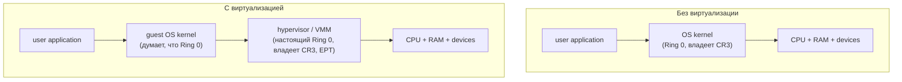
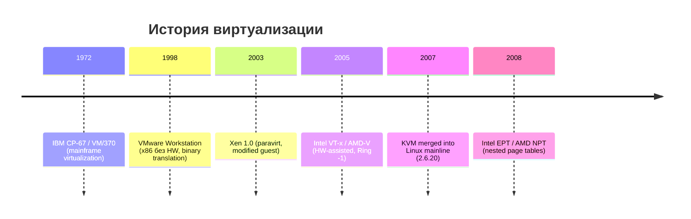
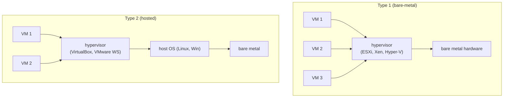
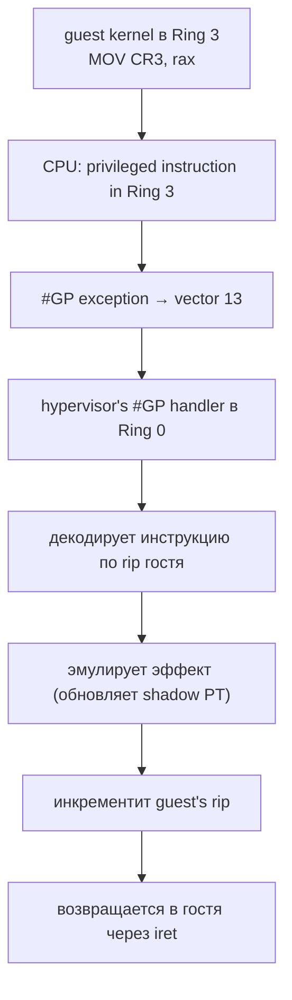
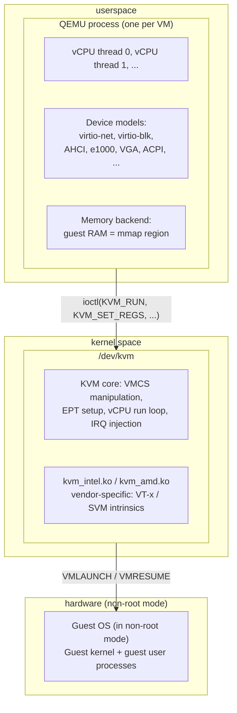
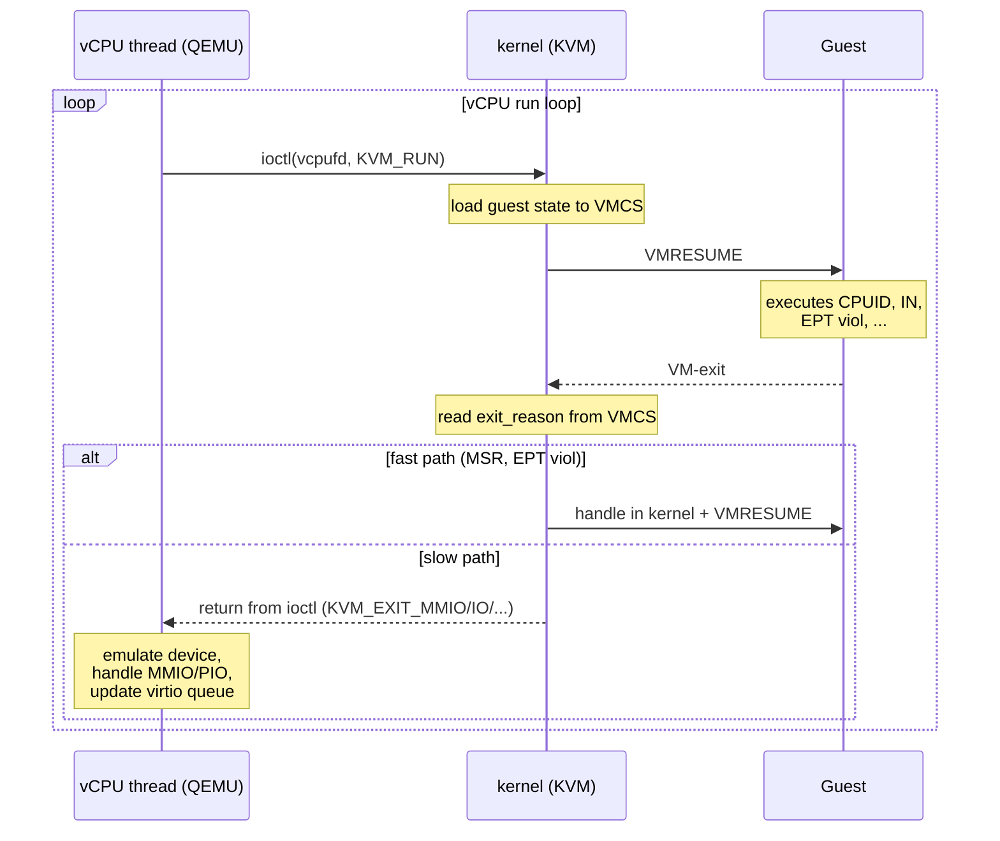
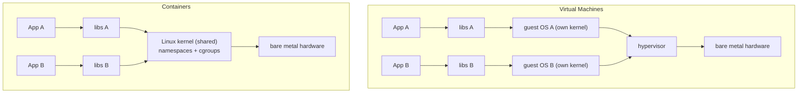

# Виртуализация: основы и обзор стека

Виртуализация — это создание иллюзии, что ОС работает на собственном железе, хотя в реальности под ней находится
другая ОС или специальный software, который перехватывает все привилегированные операции и решает, что с ними делать.
Гостевая ОС думает, что владеет CPU, памятью и устройствами целиком; на самом деле всем этим распоряжается
**hypervisor** (он же VMM — Virtual Machine Monitor), который мультиплексирует один физический ресурс между десятками
гостей.

Главная сложность виртуализации не в «эмуляции инструкций» — её в том, что классическая x86 архитектура изначально не
была рассчитана на это, и десятилетия инженерных решений шли вокруг одной задачи: как заставить guest OS работать
быстро, не модифицируя её исходный код и не теряя при этом контроль над железом.

## Что значит «виртуализировать»

Когда обычное приложение в user mode выполняет привилегированную инструкцию (например, `MOV CR3` или `HLT`), CPU
выбрасывает `#GP` — general protection fault — и управление переходит в kernel. Kernel либо эмулирует операцию, либо
убивает процесс. На этом построена защита между user space и kernel space.

Виртуализация переносит ту же идею на уровень выше: **гостевое ядро** становится для hypervisor таким же ненадёжным
исполнителем, как user-программа для kernel. Когда guest пытается выполнить инструкцию, которая может затронуть общие
ресурсы (записать в CR3, прочитать MSR, остановить CPU через HLT), управление перехватывается hypervisor, который
либо выполняет операцию «по-настоящему» на виртуальных ресурсах гостя, либо эмулирует её эффект.



Hypervisor поддерживает для каждого гостя:

- **vCPU** — виртуальный процессор: набор регистров, контекст, поток исполнения. На каждый vCPU обычно приходится один
  поток на host'е.
- **vRAM** — виртуальная физическая память: участок host-памяти, который гость видит как «настоящую» RAM, начиная с
  адреса 0.
- **virtual devices** — virtual NIC, virtual disk, virtual interrupt controller. Часть из них эмулируется в software
  (QEMU), часть — пробрасывается с реального железа через IOMMU.

Гость не знает, что под ним hypervisor (за исключением случаев paravirtualization — там знает и сотрудничает).

## Краткая история виртуализации



**1972, IBM CP-67 / VM/370.** Первая полноценная коммерческая виртуализация, на mainframe System/370. IBM сразу
заложила в архитектуру правильное разделение privileged/non-privileged инструкций — все sensitive операции честно
trap'ились в supervisor, что делало классический подход «trap-and-emulate» сразу применимым.

**1998, VMware Workstation 1.0.** Первая виртуализация x86 без поддержки железа. x86 спроектирован не для
виртуализации: 17 инструкций (`POPF`, `PUSHF`, `SIDT`, `SGDT`, `SLDT`, `LAR`, `LSL`, `SMSW`, `STR`, `MOV from CS/SS`,
и др.) ведут себя по-разному в Ring 0 и Ring 3, но **не trap'ятся** в Ring 3 — просто молча возвращают неправильный
результат. VMware решила эту проблему через **binary translation**: на лету переписывала гостевой код, заменяя
проблемные инструкции на callbacks в hypervisor.

**2003, Xen 1.0 (Cambridge).** Альтернативный подход — **paravirtualization**: вместо перехвата инструкций изменить
гостевую ОС так, чтобы она сама вызывала hypervisor через **hypercalls** вместо проблемных инструкций. Дешевле в
runtime, но требует модификации kernel — работало только с Linux и FreeBSD, Windows не поддерживался.

**2005, Intel VT-x (Vanderpool) и AMD-V (Pacifica).** Аппаратная поддержка. CPU получил новый режим работы — **VMX
root mode** (для hypervisor) и **VMX non-root mode** (для гостя). В non-root режиме все sensitive инструкции
автоматически вызывают **VM-exit** — переключение в hypervisor с сохранением состояния гостя. Никакого binary
translation, никакой модификации гостя.

**2007, KVM (Kernel-based Virtual Machine) в Linux mainline (2.6.20).** Avi Kivity из Qumranet (потом купленной Red
Hat) сделал нечто простое и гениальное: превратил Linux kernel в hypervisor через kernel module `kvm.ko`. Каждая VM —
обычный процесс, vCPU — обычный thread. Весь scheduling, NUMA, cgroups — бесплатно от Linux. QEMU использовался как
userspace часть для эмуляции устройств.

**2008, Intel EPT (Extended Page Tables) и AMD NPT (Nested Page Tables).** Аппаратная поддержка вложенных таблиц
страниц. До этого hypervisor поддерживал shadow page tables — теневую копию гостевых таблиц, синхронизированную с
оригиналом, что стоило десятков VM-exit'ов на каждое изменение CR3. EPT/NPT убрали этот overhead полностью: MMU
самостоятельно делает два уровня трансляции — guest virtual → guest physical → host physical.

## Type 1 vs Type 2 hypervisors

Классическая классификация Голдберга и Попека (1974) делит hypervisors на два типа:



**Type 1 (bare-metal)** работает прямо на железе, без host OS под собой. Hypervisor сам управляет CPU scheduling,
memory allocation, hardware drivers. Примеры: **VMware ESXi**, **Xen**, **Microsoft Hyper-V**, **IBM PR/SM**.

У Xen есть особенность: первый запущенный гость — **dom0** (domain 0) — получает привилегии для управления другими
гостями и доступ к hardware drivers. Технически dom0 — обычная Linux/BSD, но через специальный API делегирует hardware
access другим VMs.

**Type 2 (hosted)** запускается как обычное приложение поверх host OS. Все hardware drivers — от host OS, hypervisor
лишь предоставляет виртуальную машину как пользовательский процесс. Примеры: **VirtualBox**, **VMware Workstation**,
**Parallels Desktop**.

| Аспект    | Type 1                 | Type 2                      |
|-----------|------------------------|-----------------------------|
| Установка | вместо OS              | в OS, как программа         |
| Drivers   | свои (узкий список)    | от host OS (любые)          |
| Boot time | секунды                | минуты (через host OS)      |
| Overhead  | минимальный            | дополнительный слой host OS |
| Use case  | datacenter, production | desktop, development        |
| Изоляция  | очень высокая          | зависит от host OS          |

### KVM — гибрид

KVM формально не вписывается в эту классификацию. С одной стороны, KVM работает внутри Linux kernel — выглядит как
Type 2. С другой стороны, kernel module `kvm.ko` сам по себе hypervisor, использующий VT-x/AMD-V и работающий в Ring
0 без посредников — это поведение Type 1.

Правильнее называть KVM **hybrid**: hypervisor functionality (VM-entry/exit, EPT management, vCPU scheduling) живёт в
kernel mode рядом с обычным Linux scheduler'ом. Linux при этом продолжает работать как обычная ОС — KVM-гость для
него просто набор процессов, один thread на vCPU.

```mermaid
graph TB
    G1["Guest OS 1 (Linux)"] -->|VM-exit| QEMU["QEMU (userspace, per-VM process)<br/>emulates: disk, NIC, GPU, ACPI"]
    G2["Guest OS 2 (Windows)"] -->|VM-exit| QEMU
    QEMU -->|ioctl(KVM_RUN)| KVM["Linux kernel + KVM module<br/>- vCPU scheduling (CFS/EEVDF)<br/>- VM-entry/VM-exit handling<br/>- EPT management<br/>- VMCS / VMCB регистры"]
    KVM --> HW["Hardware: CPU (VT-x), IOMMU, NIC"]
```

С хозяйственной точки зрения KVM ближе к Type 1: Linux кernel и hypervisor неотделимы, оба работают в Ring 0,
hardware drivers общие. Тип 2 предполагает hypervisor поверх неприкосновенного OS — а здесь kernel и hypervisor
изначально одно целое.

## Подходы к виртуализации

С момента выхода x86 разные команды пробовали разные способы сделать его виртуализуемым. Каждый подход решал
конкретные проблемы и нёс свой набор trade-off'ов.

### Trap-and-emulate

Классический подход, заложенный ещё в IBM/370. Принцип такой: запустить guest kernel в Ring 3 (как обычный
user-процесс), и тогда все привилегированные инструкции автоматически вызовут `#GP`. Hypervisor перехватит fault и
эмулирует операцию — например, при попытке записи в CR3 обновит свою shadow-таблицу страниц гостя.



Подход элегантный, но **на x86 не работает в чистом виде**. Голдберг и Попек в своей классической статье 1974 года
сформулировали критерий: для классической виртуализации нужно, чтобы **все sensitive instructions были также
privileged** (вызывали fault в user mode). x86 этому критерию не удовлетворяет — на ней 17 инструкций (см. историю
VMware) ведут себя по-разному в разных ring'ах, но **не trap'ятся**.

Например, `POPF` восстанавливает RFLAGS из стека. В Ring 0 это меняет IF (interrupt flag), в Ring 3 — нет. Никакого
fault'а не возникает; guest kernel думает, что отключил interrupts, а на самом деле они продолжают работать. Через
несколько инструкций — катастрофа.

### Binary translation (BT)

Чтобы обойти проблему, VMware придумала следующий трюк: перед запуском кусок guest-кода **сканируется и
переписывается**. Все sensitive инструкции заменяются на callout'ы в hypervisor:

```
оригинальный guest code:                переписанный код (cache блок):
   pushq  %rax                            pushq  %rax
   popfq                  ───────▶        call   vmm_emulate_popfq
   movq   %cr3, %rax                      call   vmm_read_cr3
   cli                                    call   vmm_disable_irq
```

Переписанные блоки кэшируются (translation cache), так что один и тот же горячий код переписывается один раз.
Безопасные инструкции (`add`, `mov reg,reg`, `call`, etc.) копируются без изменений — но управление потоком (`call`,
`jmp`, `ret`) тоже переписывается, чтобы оставаться внутри cache'а.

VMware Workstation 1.0 (1998) была первым продуктом, который этого добился. Производительность была на удивление
хорошая: для CPU-bound нагрузок overhead был всего 5-15%, потому что большинство инструкций виртуализовалось «через
себя» — без замены.

Минусы:

- сложная реализация (десятилетия работы над BT-движком в VMware),
- проблемы с self-modifying code в госте,
- BT работает с CPU-инструкциями, но не упрощает виртуализацию I/O и interrupts,
- BT-overhead для system-call-intensive workloads был большой (каждый syscall в госте — несколько вызовов в
  hypervisor).

QEMU использует похожую технологию — **TCG (Tiny Code Generator)**: переводит гостевые инструкции в TCG IR, потом в
host машинный код. Это позволяет QEMU эмулировать любую архитектуру (ARM, RISC-V, MIPS) на любом host'е, но без
hardware acceleration работает в 10-100 раз медленнее нативного.

### Paravirtualization

Если переписывать guest binary на лету сложно — давайте перепишем guest source code заранее. Это идея **Xen**:
изменить guest kernel так, чтобы он сам вызывал hypervisor вместо привилегированных инструкций:

```
guest kernel (модифицированный):

   // вместо записи в CR3:
   HYPERVISOR_mmu_update(new_cr3);

   // вместо записи в page table:
   HYPERVISOR_update_va_mapping(va, new_pte);

   // вместо HLT:
   HYPERVISOR_sched_op(SCHEDOP_block);
```

Каждый такой вызов — **hypercall** — компилируется в специальную инструкцию (`int 0x82` на x86, `vmmcall`/`vmcall`
если есть HW поддержка), которая переключает в hypervisor.

Преимущества paravirt:

- **минимальный overhead** — hypercall быстрее, чем trap-and-emulate (точно знает, что делать, не нужно декодировать),
- одна транзакция вместо нескольких (можно сделать batch — обновить много PTE одним hypercall),
- **никакой эмуляции** sensitive инструкций — гость их просто не использует.

Недостатки:

- guest kernel нужно модифицировать (Linux это поддерживает, Windows — нет),
- каждый hypervisor определяет свой ABI hypercall'ов, гости несовместимы между Xen, KVM, Hyper-V,
- сложнее поддерживать ядро — два кодовых пути (paravirt и native).

Сейчас классический paravirt в значительной мере отжил — HW-assisted виртуализация даёт сопоставимый perf без
модификации гостя. Но **частичный paravirtualization (PV-on-HVM)** живёт и здравствует: guest kernel виртуализован
аппаратно (полная VT-x), но устройства (disk, NIC, console, balloon) — paravirtual через **virtio**. Это lingua
franca современной виртуализации.

### Hardware-assisted virtualization

Intel VT-x (Vanderpool, 2005) и AMD-V (Pacifica, 2006) добавили в CPU новый режим работы. Если раньше было четыре
рингa (0–3), то теперь есть «измерение» поверх них: **root mode** для hypervisor и **non-root mode** для guest. В
non-root mode гость получает полный набор Ring 0–3, как на настоящем железе.

```
                     classic x86                    с VT-x

            ┌───────────────────┐         root mode    non-root mode
            │      Ring 3       │         (hypervisor) (guest)
            │      Ring 2       │
            │      Ring 1       │           Ring 3        Ring 3 (guest user)
            │      Ring 0       │           Ring 2        Ring 2
            └───────────────────┘           Ring 1        Ring 1
                                            Ring 0        Ring 0 (guest kernel)
                                                ▲             │
                                                │ VM-exit     │ VMRESUME
                                                └─────────────┘
```

Hypervisor в root mode переключается в гостя командой `VMLAUNCH` / `VMRESUME`. Гость выполняется до тех пор, пока не
случится одно из событий, которые **спровоцируют VM-exit**:

- выполнение sensitive инструкции (CPUID, MOV CR3, RDMSR, и т.д.),
- внешний interrupt,
- nested page fault (EPT violation),
- вызов `VMCALL` (hypercall).

При VM-exit CPU автоматически сохраняет состояние гостя (RIP, RSP, регистры, CR-регистры) в специальную структуру
**VMCS (Virtual Machine Control Structure)**, переключается в root mode и прыгает в hypervisor по адресу,
заранее заданному в VMCS. Hypervisor обрабатывает причину выхода, потенциально модифицирует гостевое состояние и
возвращается через `VMRESUME`.

Главное достижение HW-assisted подхода — **никакой модификации гостя**. Windows, Linux, FreeBSD, OS/2, DOS работают
одинаково. Никакого binary translation, никаких hypercalls в коде ядра. CPU сам разруливает все sensitive
инструкции через trap-and-emulate, но на этот раз — честно, потому что все sensitive операции теперь действительно
вызывают VM-exit.

Подробности VMX, VMCS, VM-exit'ов и стоимости перехода — в [статье про CPU virtualization](cpu_virtualization.md).

## KVM + QEMU стек

KVM — самый распространённый open-source hypervisor сейчас. Его архитектура отражает философию Linux: «не строй
hypervisor с нуля, преврати kernel в hypervisor».



Цикл работы vCPU — один из основных потоков понимания KVM:



Разделение «fast path в kernel, slow path в userspace» — фундаментальный design choice. Простые operations (MSR
read/write, EPT page-fault) обрабатываются прямо в kernel module, без переключения в userspace. Сложная эмуляция
устройств (virtio, MMIO) уходит в QEMU, где есть весь инфраструктурный код. Это компромисс между latency и
сложностью kernel-кода.

QEMU при этом — далеко не единственный userspace для KVM. Альтернативы:

- **crosvm** (Google) — минималистичный VMM для ChromeOS и Android Cuttlefish, написан на Rust.
- **firecracker** (AWS) — оптимизированный для микро-VMs (Lambda, Fargate), boot time < 125 ms.
- **cloud-hypervisor** (Intel) — fork firecracker для cloud workloads.

Все они используют то же `/dev/kvm` API, но переписывают device models, чтобы избавиться от исторического кода QEMU.

## Терминология

| Термин             | Значение                                                                |
|--------------------|-------------------------------------------------------------------------|
| Hypervisor         | software, который управляет VMs; синоним VMM                            |
| VMM                | Virtual Machine Monitor; технически hypervisor — тип VMM                |
| Guest              | ОС, работающая внутри VM                                                |
| Host               | физическая машина + ОС, на которой работает hypervisor                  |
| vCPU               | виртуальный CPU гостя; на host'е — обычно thread                        |
| vRAM               | виртуальная физическая память гостя; на host'е — mmap-регион            |
| Ring deprivileging | запуск guest kernel в Ring > 0 (классический approach VMware)           |
| Hypercall          | явный вызов hypervisor из гостя (VMCALL/VMMCALL, по аналогии с syscall) |
| Trap-and-emulate   | hypervisor перехватывает privileged инструкцию и эмулирует её           |
| Binary translation | переписывание guest-кода на лету                                        |
| Paravirtualization | гость знает про hypervisor и сотрудничает (hypercalls вместо traps)     |
| HVM                | Hardware Virtual Machine — гость, использующий HW-assisted virt         |
| PV-on-HVM          | гибрид: HW-virt CPU, paravirt устройства (стандарт сейчас)              |
| VMCS               | Virtual Machine Control Structure (Intel) — 4 KB структура состояния VM |
| VMCB               | Virtual Machine Control Block (AMD) — аналог VMCS                       |
| VM-exit            | переход из non-root в root mode (из гостя в hypervisor)                 |
| VM-entry           | переход из root в non-root mode (из hypervisor в гостя)                 |
| EPT                | Extended Page Tables (Intel) — двухуровневая трансляция в железе        |
| NPT                | Nested Page Tables (AMD) — аналог EPT                                   |
| SLAT               | Second-Level Address Translation — общий термин для EPT/NPT             |
| dom0               | управляющий guest в Xen, имеет привилегированный API                    |
| domU               | обычный (непривилегированный) guest в Xen                               |
| virtio             | стандартизированный paravirt интерфейс для устройств                    |
| IOMMU              | I/O MMU — трансляция адресов для DMA (VT-d, AMD-Vi)                     |
| Posted interrupt   | механизм доставки interrupt'а напрямую в guest APIC без VM-exit         |

## Виртуализация vs контейнеры

Контейнеры (Docker, LXC, containerd) часто противопоставляют виртуальным машинам, хотя это технологии разного
уровня. Главное архитектурное отличие:



VM запускает **полное гостевое ядро** в изолированной среде с виртуальными устройствами. Container — **обычный
процесс** на host kernel, изолированный через **namespaces** (PID, mount, network, IPC, UTS, user) и ограниченный
через **cgroups**.

| Аспект           | VM                                | Container                       |
|------------------|-----------------------------------|---------------------------------|
| Kernel           | свой у каждого guest              | shared с host                   |
| Boot time        | секунды-минуты                    | миллисекунды                    |
| Memory overhead  | сотни МБ (guest kernel + drivers) | мегабайты (только processes)    |
| Density          | десятки на host                   | сотни-тысячи на host            |
| Изоляция         | hardware-level (VT-x, EPT)        | namespace-level (kernel-driven) |
| Attack surface   | hypervisor API (узкий)            | весь kernel syscall surface     |
| Heterogeneous OS | Linux + Windows + BSD             | только same kernel              |
| Live migration   | да (vMotion, KVM live migration)  | сложно (CRIU, partial)          |
| Resource pinning | дешёво (vCPU = thread)            | дешёво (cgroup limits)          |

Виртуализация и контейнеры не взаимоисключающие, а **complementary**: типичная production-инфраструктура запускает
hypervisor (KVM в AWS Nitro, ESXi в VMware) на железе, и уже внутри VMs крутит контейнеры (Kubernetes). Это даёт два
уровня изоляции:

- VMs изолируют tenants (security boundary, hypervisor очень узкий attack surface),
- containers внутри одного tenant'а изолируют workloads (быстрый boot, dense packing).

Существуют гибриды: **Kata Containers** и **gVisor** запускают каждый container в своей мини-VM, получая kernel-level
isolation при container-like API. AWS Firecracker появился именно для этого сценария — Lambda function запускается в
свежей microVM за < 125 ms.

## Связанные темы

- [CPU virtualization](cpu_virtualization.md) — VT-x/SVM, VMCS, VM-exit'ы, paravirt KVM
- [Виртуальная память](../memory/virtual_memory.md) — двухуровневая трансляция в EPT/NPT строится поверх этих базовых
  механизмов
- [Context switch](../processes/context_switch.md) — vCPU как thread, sCheduler управляет vCPU так же, как обычными
  процессами
- [Namespaces](../isolation/namespaces.md) — основа container isolation, альтернатива hypervisor-based virtualization
- [Cgroups](../isolation/cgroups.md) — ресурсные лимиты для контейнеров, аналог vCPU pinning для VMs
- [Containers internals](../isolation/containers_internals.md) — как Docker/containerd используют namespaces + cgroups

## Источники

- Popek, Goldberg. *Formal Requirements for Virtualizable Third Generation Architectures*. Communications of the ACM,
    1974.
- Adams, Agesen. *A Comparison of Software and Hardware Techniques for x86 Virtualization*. ASPLOS, 2006.
- Barham et al. *Xen and the Art of Virtualization*. SOSP, 2003.
- Kivity et al. *KVM: the Linux Virtual Machine Monitor*. Ottawa Linux Symposium, 2007.
- Intel® 64 and IA-32 Architectures Software Developer's Manual, Vol. 3C — System Programming Guide, Part 3 (VMX).
- AMD64 Architecture Programmer's Manual, Vol. 2 — System Programming, ch. 15 (Secure Virtual Machine).
- KVM documentation — <https://www.linux-kvm.org/page/Documents>.
- QEMU documentation — <https://www.qemu.org/docs/master/>.
- Firecracker — <https://github.com/firecracker-microvm/firecracker>.
