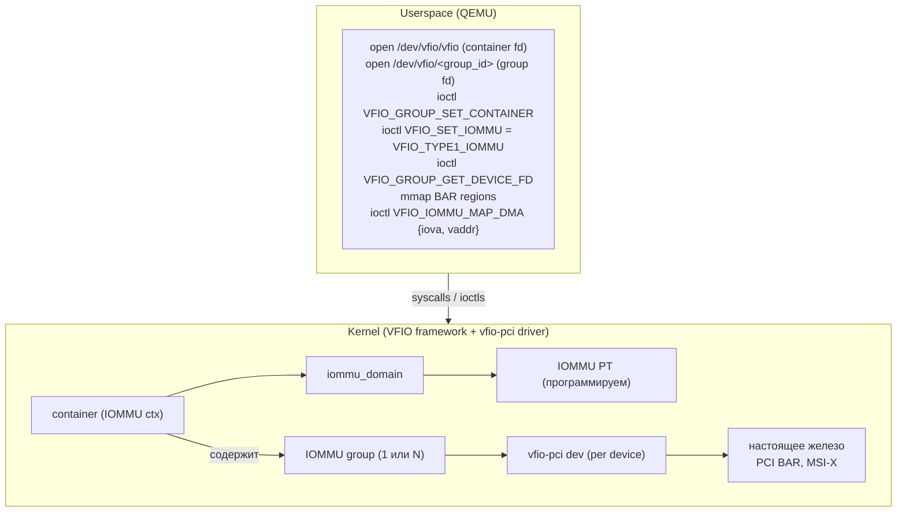
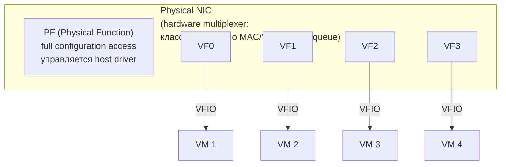
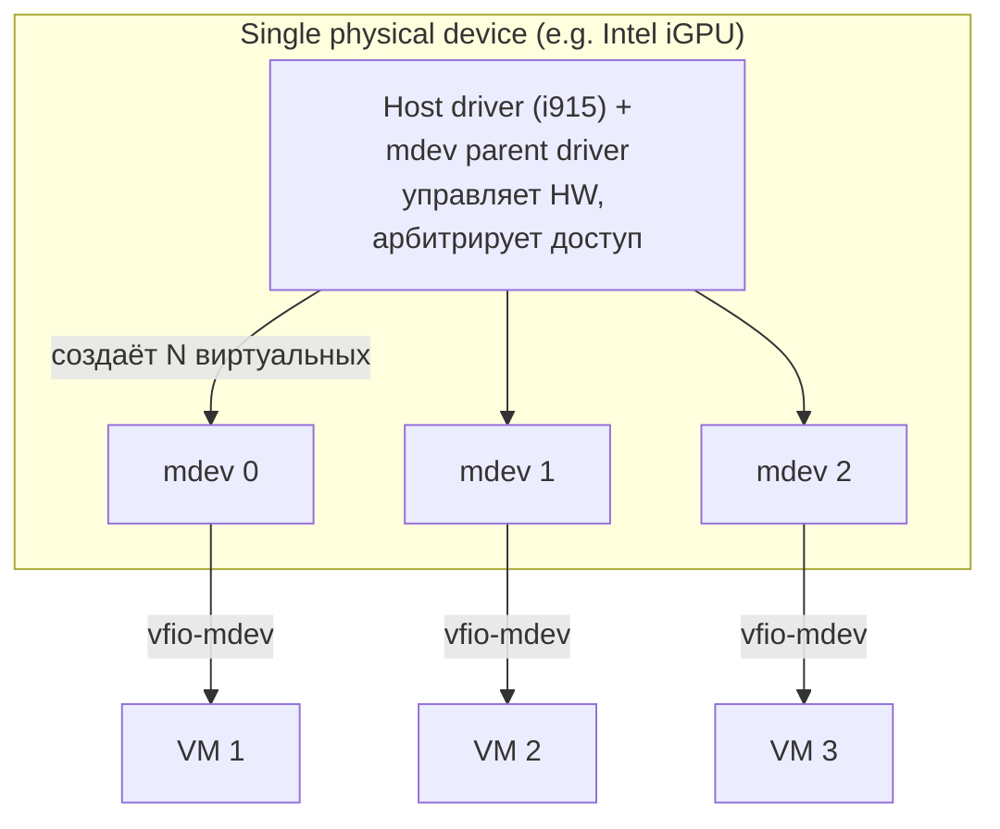

# I/O passthrough: VFIO, IOMMU, SR-IOV

virtio даёт хорошую виртуализацию I/O, но даже самый быстрый backend всё равно — программный слой между гостем и
железом. Для задач, где важна последняя капля производительности (high-frequency trading, GPU compute, ML training,
low-latency сети), существует альтернатива: отдать физическое устройство в VM **напрямую**. Гость работает с настоящим
PCI-устройством, как будто запущен на bare-metal, без всякой эмуляции.

Цена: устройство больше не разделяется между гостями, и появляется новая проблема — DMA. Устройства, говорящие DMA,
могут писать в любую физическую память. Если такое устройство принадлежит VM, без защиты оно может писать в память
других гостей или ядра. Решение — IOMMU.

## Проблема DMA

Любой современный bus master (PCI/PCIe-устройство) умеет читать и писать память напрямую через DMA, минуя CPU.
Это критично для производительности: один DMA-трансфер на 64 KB вместо 16 тысяч инструкций `mov`.

В bare-metal системе устройство работает с физическими адресами. Драйвер устройства программирует DMA-engine
адресами буферов в RAM и говорит «начни читать оттуда». Никакого MMU между устройством и памятью нет.

```
Без IOMMU: устройство видит всю RAM напрямую
                     ┌─────────────────────────┐
                     │      Physical RAM       │
                     │ ┌─────────┐ ┌─────────┐ │
                     │ │ Kernel  │ │ Guest 1 │ │
                     │ │  pages  │ │  RAM    │ │
                     │ ├─────────┤ ├─────────┤ │
                     │ │ Guest 2 │ │ Hyperv. │ │
                     │ │  RAM    │ │  data   │ │
                     │ └─────────┘ └─────────┘ │
                     └─────────────────────────┘
                                ▲
                                │ DMA read/write
                                │ (любой физический адрес)
                                │
                        ┌────────────────┐
                        │  PCI Device    │  ← если это устройство принадлежит
                        │  (NIC, GPU...) │    Guest 1, оно может читать память
                        └────────────────┘    Guest 2 или ядра
```

Это смертельная дыра для виртуализации. Зловредный или забагованный driver в гостевой VM мог бы запрограммировать
DMA-операцию по адресу ядра хоста — и переписать любую память. Поэтому без IOMMU passthrough физического устройства
в VM невозможен.

## IOMMU

**IOMMU** (Input-Output Memory Management Unit) — это MMU для устройств. Он сидит между PCI-bus и memory controller'ом
и транслирует адреса в DMA-запросах. У каждого устройства свой набор таблиц трансляции (IOMMU page tables), и оно
видит только то адресное пространство, которое ему явно выделено.

Аппаратные реализации:

| Платформа | IOMMU             | Особенности                        |
|-----------|-------------------|------------------------------------|
| Intel     | VT-d              | требует поддержки в чипсете и BIOS |
| AMD       | AMD-Vi (IOMMU)    | поддерживается с Bulldozer/Zen     |
| ARM       | SMMU (System MMU) | вариант SMMUv2 и SMMUv3            |
| POWER     | PHB IOMMU         | per-bridge IOMMU на IBM POWER      |

С IOMMU схема выглядит так:

```
С IOMMU: устройство видит только разрешённое
                     ┌─────────────────────────┐
                     │      Physical RAM       │
                     │ ┌─────────┐ ┌─────────┐ │
                     │ │ Kernel  │ │ Guest 1 │ │
                     │ │  pages  │ │  RAM    │ │
                     │ ├─────────┤ ├─────────┤ │
                     │ │ Guest 2 │ │ Hyperv. │ │
                     │ │  RAM    │ │  data   │ │
                     │ └────▲────┘ └─────────┘ │
                     └──────│──────────────────┘
                            │ только эта область
                            │
                     ┌──────────────┐
                     │  IOMMU PT    │  ← per-device page table
                     │  device →    │     translates DMA addresses
                     │  IOVA → PA   │
                     └──────▲───────┘
                            │ IOVA (I/O virtual address)
                            │
                        ┌────────────────┐
                        │  PCI Device    │  ← запросы выходят с IOVA,
                        │  принадлежит   │    IOMMU транслирует в PA;
                        │  Guest 2       │    обращение к Guest 1 → fault
                        └────────────────┘
```

Когда устройство, принадлежащее Guest 2, делает DMA-запрос с адресом X, IOMMU ищет X в page table этого устройства.
Если в таблице есть entry — выдаётся реальный физический адрес внутри RAM Guest 2. Если нет — **DMA fault**,
транзакция отменяется. Устройство физически не может попасть в чужую память.

### IOMMU groups

PCIe не всегда позволяет изолировать устройства поодиночке. Если две функции одного PCI-чипа делят bus, или если
PCIe-switch без ACS (Access Control Services) пропускает peer-to-peer DMA, устройства могут общаться между собой,
минуя IOMMU. Linux объединяет такие устройства в **IOMMU groups** — минимальную единицу изоляции.

```
$ ls /sys/kernel/iommu_groups/
0/  1/  2/  3/  4/  5/  ...

$ ls /sys/kernel/iommu_groups/13/devices/
0000:01:00.0    # GPU
0000:01:00.1    # HDMI audio функция той же карты
```

Группа всегда передаётся в VM целиком. Если в одной группе GPU + Ethernet, нельзя отдать только GPU — придётся брать
оба. На современных серверных платах ACS обычно настроен, и каждое устройство в своей группе. На consumer
материнских платах часто наоборот.

## VFIO

**VFIO** (Virtual Function I/O) — современный Linux API для безопасного userspace-доступа к PCI-устройствам с IOMMU.
До VFIO существовали `pci-stub` и `UIO` — но они не настраивали IOMMU, и userspace мог сломать хост через DMA.
VFIO появился в 3.6 (2012) как замена.

Архитектура VFIO:



Ключевые объекты:

- **Container** (`/dev/vfio/vfio`) — IOMMU-домен. К нему привязываются IOMMU groups, и через container идут все
  DMA-маппинги. Один QEMU обычно создаёт один container на VM.
- **Group** (`/dev/vfio/<N>`) — IOMMU group, открывается отдельным fd и привязывается к container'у.
- **Device fd** — конкретное PCI-устройство. Через него mmap'ятся BARs, читаются/пишутся конфиг-регистры,
  настраиваются прерывания.

DMA-маппинги программируются через `VFIO_IOMMU_MAP_DMA`: userspace говорит «маппи виртуальный адрес `vaddr` длиной
`size` на IOVA `iova` с правами `r/w`». Ядро вставляет это в IOMMU page table. С этого момента устройство, написав
DMA-запрос с адресом `iova`, попадёт ровно по адресу `vaddr` в QEMU-процессе — то есть в RAM гостя.

## Полный путь passthrough GPU

Передача дискретной GPU в VM — классический use case. Шаги:

```bash
# 1. Найти device IDs
lspci -nn | grep VGA
#   01:00.0 VGA compatible controller [0300]: NVIDIA Corporation ... [10de:1c82]
#   01:00.1 Audio device [0403]: NVIDIA Corporation ... [10de:0fb9]

# 2. Проверить IOMMU group
ls /sys/kernel/iommu_groups/*/devices/ | grep 01:00
#   /sys/kernel/iommu_groups/13/devices/0000:01:00.0
#   /sys/kernel/iommu_groups/13/devices/0000:01:00.1
# группа 13: вся карта (GPU + audio) идёт вместе

# 3. Сказать ядру: vfio-pci должен забрать это устройство при загрузке
echo "vfio-pci" > /sys/bus/pci/devices/0000:01:00.0/driver_override
echo "vfio-pci" > /sys/bus/pci/devices/0000:01:00.1/driver_override

# 4. Отвязать nvidia driver, привязать vfio-pci
echo 0000:01:00.0 > /sys/bus/pci/drivers/nvidia/unbind
echo 0000:01:00.0 > /sys/bus/pci/drivers/vfio-pci/bind
echo 0000:01:00.1 > /sys/bus/pci/drivers/snd_hda_intel/unbind
echo 0000:01:00.1 > /sys/bus/pci/drivers/vfio-pci/bind

# 5. Запустить QEMU с -device vfio-pci
qemu-system-x86_64 \
    -enable-kvm -m 16G -smp 8 \
    -device vfio-pci,host=01:00.0,multifunction=on \
    -device vfio-pci,host=01:00.1 \
    -drive file=win.qcow2,if=virtio \
    ...
```

QEMU открывает device через VFIO, mmap'ит BARs в своё адресное пространство и через KVM API мапит эти регионы прямо
в гостевое физическое пространство. Гость видит NVIDIA-карту по своему PCI-bus, грузит NVIDIA-драйвер, работает с
ней напрямую. CPU-сторона: записи в BAR идут как regular MMIO в RAM (нет VM-exit'ов на каждое обращение, только на
конфиг-space).

Распространённые проблемы при passthrough:

- **Above 4G decoding** — для GPU с BAR > 4 GB нужно включить опцию в BIOS, иначе адресация не работает
- **PCIe reset bug** — некоторые карты (особенно AMD Radeon GPUs) не делают proper FLR (Function Level Reset);
  после перезагрузки гостя host не может вернуть карту в исходное состояние, нужны патчи `vendor-reset` или
  перезагрузка хоста
- **vBIOS** — для primary GPU passthrough часто нужен dump оригинальной vBIOS через `nvflash` или
  с `techpowerup.com`, и передача его через `-device vfio-pci,romfile=...`
- **MSI vs MSI-X** — Windows-гостям иногда требуется ручное включение MSI через registry
- **NVIDIA Code 43** — исторически NVIDIA блокировала consumer GPUs в VM; обходилось через `kvm=off` и
  скрытие KVM signature; с драйвером 465+ ограничение снято

## SR-IOV

Passthrough всей карты — это «всё или ничего». **SR-IOV** (Single Root I/O Virtualization) — PCIe-стандарт,
позволяющий одному физическому устройству представлять себя как N независимых virtual function'ов, каждый
из которых можно отдать отдельной VM.



**PF** (Physical Function) — основное устройство, видимое хосту. Через него настраиваются глобальные параметры
(MTU, RX-фильтры, VFs). **VF** (Virtual Function) — упрощённая копия устройства: тот же class, тот же базовый
функционал, но без права на global config. У каждой VF свой PCI-address, свой BAR, своя IOMMU group, свой MSI-X
вектор.

Включение SR-IOV (если устройство поддерживает):

```bash
# Сколько VFs может породить устройство
cat /sys/class/net/ens3f0/device/sriov_totalvfs
#   64

# Создать 8 VFs
echo 8 > /sys/class/net/ens3f0/device/sriov_numvfs

# Появятся новые PCI-функции
lspci | grep Ethernet
#   3b:00.0 ... Intel 82599 (PF)
#   3b:10.0 ... Intel 82599 VF
#   3b:10.1 ... Intel 82599 VF
#   3b:10.2 ... Intel 82599 VF
#   ...

# Каждая VF — в своей IOMMU group, passthrough в VM через vfio-pci
```

Hardware-поддержка SR-IOV распространена в enterprise-сегменте:

| Vendor   | Устройства                                                |
|----------|-----------------------------------------------------------|
| Intel    | 82599, X710, E810 (NICs), Sapphire Rapids ML accelerators |
| Mellanox | ConnectX-4/5/6/7 (NICs, 100 Gbps+)                        |
| Broadcom | NetXtreme series                                          |
| NVIDIA   | A100, H100 (datacenter GPUs), BlueField DPUs              |
| AMD      | Instinct MI series                                        |

Consumer-устройства (GeForce, обычные домашние NIC) обычно не имеют SR-IOV — это бизнес-сегментация.

## mdev: mediated devices

Когда SR-IOV нет в железе, можно сделать его в software. **mdev** (mediated devices, Linux 4.10) — kernel-фреймворк,
позволяющий драйверу хоста создавать виртуальные «дочерние» устройства поверх одного физического и отдавать их в VM
через VFIO.



Гость видит mdev как настоящее устройство через VFIO. Host driver обрабатывает запросы time-sharing'ом: запросы от
VM 1 идут на iGPU, потом от VM 2, потом от VM 3 — round-robin или fair-share scheduling. Hardware не нужно
SR-IOV-aware.

Примеры:

- **Intel GVT-g** — sharing Intel iGPU между несколькими гостями без SR-IOV
- **NVIDIA vGPU** (GRID) — sharing datacenter GPUs (Quadro/Tesla); требует proprietary драйвер на хосте
- **s390 vfio-ap** — sharing crypto adapters на IBM Z

## Производительность: сравнение

Реальные цифры зависят от железа, но порядки величин стабильны:

| Подход                     | Throughput | Latency | Sharing  | Live migration |
|----------------------------|------------|---------|----------|----------------|
| Эмуляция e1000             | ~1 Gbps    | ~200 μs | да       | да             |
| virtio + QEMU              | ~10 Gbps   | ~50 μs  | да       | да             |
| virtio + vhost-net         | ~25 Gbps   | ~20 μs  | да       | да             |
| virtio + vhost-user (DPDK) | ~40 Gbps   | ~10 μs  | да       | да             |
| vDPA                       | line rate  | ~5 μs   | да       | да             |
| SR-IOV VF                  | line rate  | ~5 μs   | до 64 VM | ограниченно    |
| Полный PCI passthrough     | line rate  | ~3 μs   | нет      | нет            |

Для GPU compute разница ещё ярче:

| Подход             | Performance vs bare-metal         |
|--------------------|-----------------------------------|
| virtio-gpu + virgl | ~50% (3D через трансляцию OpenGL) |
| Intel GVT-g (mdev) | ~85% на iGPU                      |
| NVIDIA vGPU        | 90–95% (зависит от профиля)       |
| GPU passthrough    | 97–99% (полный доступ к карте)    |

Live migration — главное ограничение passthrough'а: physical device держит state в hardware, который нельзя
сериализовать и переслать на другой хост. SR-IOV VF теоретически поддерживает migration через вспомогательный
virtio-fallback (vDPA Live Migration), но в production это редкость.

## NUMA-aware passthrough

На multi-socket серверах passthrough требует тщательного pinning. Если GPU физически висит на PCIe-шине CPU 0, а VM
запущена на CPU 1, каждый MMIO access проходит через interconnect (Intel UPI или AMD Infinity Fabric) — добавляется
сотня наносекунд латентности и теряется значительная часть преимущества passthrough.

```
NUMA-aware GPU passthrough
┌─────────────────────────────────────────────────────────────────┐
│  Socket 0 (CPU0..15, NUMA node 0)                               │
│    │                                                            │
│    PCIe Root Complex 0                                          │
│    │                                                            │
│    └─ GPU 0  (passthrough в VM-A)  ──┐                          │
│                                      │ DMA-traffic              │
│                                      │ внутри node 0            │
│  RAM banks of node 0 ◀───────────────┘                          │
│                                                                 │
├─────────────────────────────────────────────────────────────────┤
│  Socket 1 (CPU16..31, NUMA node 1)                              │
│    │                                                            │
│    PCIe Root Complex 1                                          │
│    │                                                            │
│    └─ GPU 1  (passthrough в VM-B)                               │
│                                                                 │
└─────────────────────────────────────────────────────────────────┘

Правило: vCPU pinned на physical CPUs того же NUMA node, что и passthrough
устройство; guest RAM выделена из того же node.
```

QEMU поддерживает явный pinning:

```bash
# Узнать NUMA node устройства
cat /sys/bus/pci/devices/0000:01:00.0/numa_node
#   0

# Узнать CPUs в node 0
lscpu | grep "NUMA node0"
#   NUMA node0 CPU(s):  0-15,32-47

# Pinning через QEMU + libvirt: разместить guest memory на node 0
numactl --membind=0 --cpunodebind=0 qemu-system-x86_64 \
    -enable-kvm -smp 8 -m 16G \
    -object memory-backend-memfd,id=mem,size=16G,host-nodes=0,policy=bind \
    -numa node,memdev=mem \
    -device vfio-pci,host=01:00.0 \
    ...
```

В Kubernetes это решается через `topology-manager` policy `single-numa-node`: kubelet распределяет CPU, RAM, GPU
по одному NUMA node на pod.

## P2P DMA

Между двумя устройствами на одном PCIe-сегменте возможна **peer-to-peer DMA**: одно устройство (например, NVMe)
пишет напрямую в память другого (GPU), минуя host RAM. Для ML workloads это даёт x2 throughput при загрузке тензоров
с диска в GPU.

С IOMMU есть нюанс: ACS (Access Control Services) может блокировать P2P transactions из соображений безопасности —
два устройства из разных IOMMU groups не должны общаться напрямую. Для P2P нужно либо отключить ACS на корневом
порту, либо разместить устройства за одним switch'ем с ACS-bypass.

Linux 4.20+ имеет `p2pdma` subsystem: драйверы декларируют возможность P2P, ядро управляет mappings через IOMMU.
QEMU 6.0+ умеет пробрасывать P2P-capable устройства в VM через `vfio-pci-igd`.

## VFIO-PCI options и quirks

Полный набор QEMU-флагов для GPU passthrough — это не один `-device vfio-pci`. Реальный production-конфиг:

```bash
qemu-system-x86_64 \
    -enable-kvm \
    -M q35,kernel-irqchip=on,accel=kvm \
    -cpu host,kvm=off,hv_vendor_id=null,+topoext \
    -smp 8,sockets=1,dies=1,cores=4,threads=2 \
    -m 16G \
    -object iothread,id=io1 \
    -object memory-backend-memfd,id=mem,size=16G,hugetlb=on \
    -machine memory-backend=mem \
    -device pcie-root-port,id=root0,slot=0 \
    -device vfio-pci,host=01:00.0,bus=root0,multifunction=on,x-vga=on,romfile=/etc/qemu/gpu.rom \
    -device vfio-pci,host=01:00.1,bus=root0,addr=00.1 \
    -drive file=disk.qcow2,if=none,id=hd0,format=qcow2,cache=none,aio=native \
    -device virtio-blk-pci,drive=hd0,iothread=io1 \
    -netdev tap,id=n0,vhost=on \
    -device virtio-net-pci,netdev=n0,mq=on,vectors=10 \
    -display none -nographic
```

Ключевые трюки:

| Опция               | Зачем нужно                                                          |
|---------------------|----------------------------------------------------------------------|
| `kernel-irqchip=on` | прерывания обрабатывает KVM (не QEMU userspace) — низкая латентность |
| `kvm=off`           | скрыть от guest, что он в VM (workaround для NVIDIA Code 43)         |
| `hv_vendor_id=null` | подменить Hyper-V ID, ещё один обход driver checks                   |
| `+topoext`          | пробросить AMD CPU topology в guest                                  |
| `hugetlb=on`        | guest RAM из HugeTLB-пула — TLB miss reduction                       |
| `x-vga=on`          | helper для primary GPU (initialize legacy VGA modes)                 |
| `romfile=...`       | загрузить оригинальный vBIOS (для GPU без UEFI GOP)                  |
| `pcie-root-port`    | разместить vfio-pci на отдельном root port (некоторые GPU требуют)   |

## Безопасность passthrough

VFIO с IOMMU не панацея. Несколько остающихся векторов атаки:

- **PCI config space attacks**: устройство контролирует свои config registers; зловредная прошивка может переключать
  BARs, ломая host driver. Mitigation: VFIO блокирует write на чувствительные поля (Command register modifications,
  BAR remapping в работающем состоянии).
- **DMA before IOMMU setup**: window между attach устройства и программированием IOMMU page tables. В этот момент
  устройство теоретически может выполнить DMA по любому адресу. Linux IOMMU drivers инициализируют PT перед attach,
  но баги случаются.
- **Bus mastering enable**: гость может включить bus mastering и сделать DMA-flooding (DoS). Mitigation —
  rate-limiting в IOMMU (на новых платформах).
- **MSI/MSI-X reprogramming**: гость может перепрограммировать MSI vectors устройства, вызвав spurious interrupts на
  host CPUs других гостей. Mitigation: irqchip в KVM virtualizes MSI table, не пускает напрямую.

Историческое: **SVS attack** (2018) — на некоторых Intel platforms возможно было обойти VT-d через ATS (Address
Translation Service) cache poisoning. Исправлено в микрокоде и в Linux 4.16+.

## Когда что выбирать

| Сценарий                         | Рекомендация                       |
|----------------------------------|------------------------------------|
| Cloud server, много мелких VM    | virtio + vhost-net                 |
| HPC, многоузловые ML тренировки  | SR-IOV (NIC) + GPU passthrough     |
| Виртуальный desktop с GPU (VDI)  | NVIDIA vGPU (mdev) или Intel GVT-g |
| Domestic gaming в VM             | полный GPU passthrough (vfio-pci)  |
| High-frequency trading           | SR-IOV NIC + DPDK в guest          |
| Контейнеры с временной изоляцией | virtio (cgroup'ы уже достаточно)   |
| Embedded multi-tenant            | mdev для shared accelerators       |

Главные критерии выбора — нужно ли sharing устройства, важна ли live migration, есть ли SR-IOV в hardware, и
насколько критична каждая микросекунда латентности.

## Связанные темы

- [virtio: paravirtual I/O](virtio.md) — software-альтернатива passthrough'у с другими trade-off'ами
- [QEMU изнутри: TCG, device models, QMP](qemu_internals.md) — как QEMU интегрирует VFIO в device model
- [Виртуальная память](../memory/virtual_memory.md) — MMU как родственник IOMMU: одинаковые принципы для CPU и устройств

## Источники

- [VFIO documentation — kernel.org](https://docs.kernel.org/driver-api/vfio.html)
- [PCI SR-IOV specification — PCI-SIG](https://pcisig.com/specifications)
- [Intel VT-d specification](https://www.intel.com/content/www/us/en/products/docs/processors/embedded/virtualization-tech-spec.html)
- [IOMMU groups and PCIe ACS — Alex Williamson blog](https://vfio.blogspot.com/)
- [PCI passthrough via OVMF — ArchWiki](https://wiki.archlinux.org/title/PCI_passthrough_via_OVMF)
- [mediated devices — kernel.org](https://docs.kernel.org/driver-api/vfio-mediated-device.html)
- `Documentation/driver-api/vfio.rst`, `Documentation/PCI/pci-iov-howto.rst`
