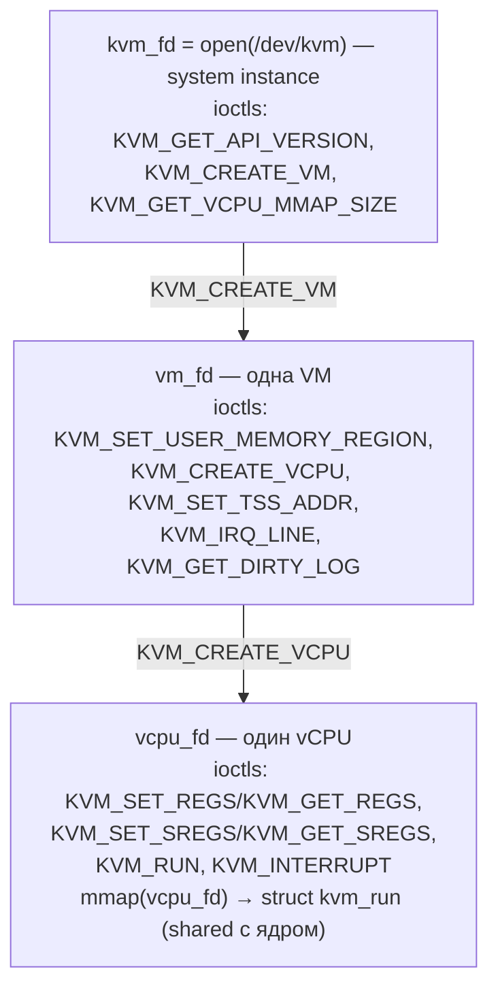
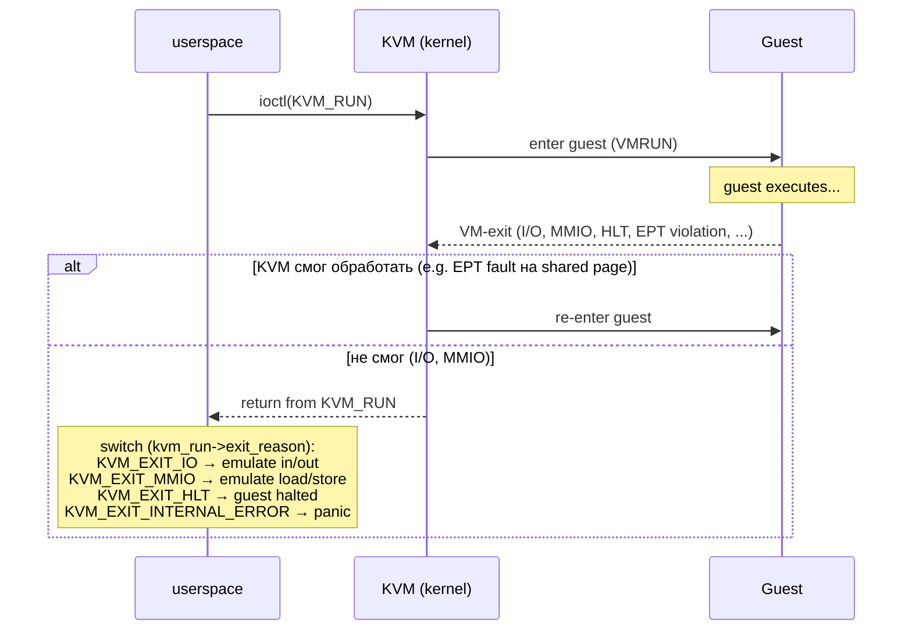

# KVM API: минимальный гипервизор в 200 строк

KVM (Kernel-based Virtual Machine) — модуль ядра Linux, превращающий его в **type-2 гипервизор**. Сам KVM не эмулирует
устройства, не реализует CPU и не работает с диском: всё это делает userspace. KVM предоставляет тонкий слой над
аппаратной виртуализацией (VT-x на Intel, AMD-V на AMD) и экспонирует его в userspace через единственный character
device — `/dev/kvm`.

QEMU, Firecracker, crosvm, cloud-hypervisor, kvmtool — все они userspace-приложения, которые через ioctl'ы на этот
device создают виртуальные машины и крутят их vCPU. Понимание этого API даёт ясное представление о том, что такое
«гипервизор» с точки зрения операционной системы — и позволяет за вечер написать собственный.

## Что такое /dev/kvm

```bash
$ ls -l /dev/kvm
crw-rw---- 1 root kvm 10, 232 May 24 22:00 /dev/kvm

$ file /dev/kvm
/dev/kvm: character special (10/232)
```

Character device, доступ к которому управляется обычными permissions (обычно через группу `kvm`). Любое
userspace-приложение,
у которого есть `open()` на `/dev/kvm`, может создать VM — никаких syscall'ов, специфичных для виртуализации, не нужно.
Весь API — это ioctl'ы.

```bash
# Загружен ли модуль KVM?
lsmod | grep kvm
# kvm_intel ... 0
# kvm       ... kvm_intel

# Доступна ли аппаратная виртуализация в принципе?
grep -E "vmx|svm" /proc/cpuinfo | head -1
```

Если CPU поддерживает VT-x, ядро загружает `kvm_intel`; для AMD — `kvm_amd`. Общая часть лежит в модуле `kvm`.

## Иерархия объектов

KVM строится на трёх уровнях файловых дескрипторов, каждый из которых принимает свой набор ioctl'ов:



`kvm_fd` — глобальный handle на KVM; `vm_fd` — отдельная виртуальная машина (адресное пространство, набор vCPU,
memory regions); `vcpu_fd` — отдельный виртуальный процессор. Memory regions общие для всей VM; регистры — у каждого
vCPU свои.

Каждый vCPU имеет ассоциированную **shared page** — `struct kvm_run`, которую userspace `mmap`-ит на `vcpu_fd`. Через
неё ядро сообщает причину выхода из vCPU и параметры эмулируемой операции; ту же страницу userspace использует для
ответа.

## Основные ioctl

| ioctl                           | Уровень | Назначение                                                        |
|---------------------------------|---------|-------------------------------------------------------------------|
| `KVM_GET_API_VERSION`           | system  | проверить совместимость (всегда должен возвращать `12`)           |
| `KVM_CREATE_VM`                 | system  | создать VM, возвращает `vm_fd`                                    |
| `KVM_GET_VCPU_MMAP_SIZE`        | system  | размер `struct kvm_run`, нужен для последующего `mmap`            |
| `KVM_SET_TSS_ADDR`              | vm      | (Intel) задать адрес для TSS — обязательно для unrestricted-guest |
| `KVM_SET_USER_MEMORY_REGION`    | vm      | связать кусок userspace-памяти с диапазоном GPA                   |
| `KVM_CREATE_VCPU`               | vm      | создать vCPU, возвращает `vcpu_fd`                                |
| `KVM_IRQ_LINE`                  | vm      | поднять или опустить уровень IRQ                                  |
| `KVM_GET_DIRTY_LOG`             | vm      | прочитать bitmap dirty pages (для live migration)                 |
| `KVM_SET_REGS` / `KVM_GET_REGS` | vcpu    | general-purpose регистры                                          |
| `KVM_SET_SREGS`/`KVM_GET_SREGS` | vcpu    | сегментные регистры, CR0/CR3/CR4/EFER, GDT/IDT                    |
| `KVM_RUN`                       | vcpu    | передать управление vCPU; возвращается на VM-exit                 |
| `KVM_INTERRUPT`                 | vcpu    | инжектировать interrupt в vCPU                                    |

## Жизненный цикл VM

```
1. open("/dev/kvm")                                     → kvm_fd
2. ioctl(kvm_fd, KVM_GET_API_VERSION)                   → проверка == 12
3. ioctl(kvm_fd, KVM_CREATE_VM, 0)                      → vm_fd
4. ioctl(vm_fd, KVM_SET_TSS_ADDR, 0xfffbd000)           → (Intel only)
5. mem = mmap(NULL, SIZE, RW, PRIVATE|ANONYMOUS, -1, 0)
   ioctl(vm_fd, KVM_SET_USER_MEMORY_REGION, &region)    → guest physical RAM
6. ioctl(vm_fd, KVM_CREATE_VCPU, 0)                     → vcpu_fd
7. mmap_size = ioctl(kvm_fd, KVM_GET_VCPU_MMAP_SIZE)
   kvm_run   = mmap(NULL, mmap_size, RW, SHARED, vcpu_fd, 0)
8. ioctl(vcpu_fd, KVM_GET_SREGS, &sregs)
   …настроить sregs (CS, DS, etc)…
   ioctl(vcpu_fd, KVM_SET_SREGS, &sregs)
   ioctl(vcpu_fd, KVM_SET_REGS,  &regs)
9. loop:
       ioctl(vcpu_fd, KVM_RUN, 0)
       switch (kvm_run->exit_reason) { … }
```

Заметим: всё ниже `KVM_CREATE_VM` — обычный пользовательский процесс, который случайно умеет выполнять «гостевой код»
на железе через `KVM_RUN`. Никаких отдельных потоков, привилегий или namespace'ов не требуется.

## vCPU run loop и exit reasons

`KVM_RUN` блокируется, пока гость не сделает что-то, что KVM не может обработать самостоятельно. Это называется
**VM-exit**: процессор переключается обратно в hypervisor mode, KVM записывает причину в `kvm_run->exit_reason`,
ioctl возвращает 0.



Главные exit reasons:

| Exit reason               | Когда                                               | Что должен сделать userspace            |
|---------------------------|-----------------------------------------------------|-----------------------------------------|
| `KVM_EXIT_IO`             | гость выполнил `in`/`out` (I/O port)                | прочитать/записать байт в `kvm_run->io` |
| `KVM_EXIT_MMIO`           | гость обратился к адресу вне зарегистрированной RAM | эмулировать через `kvm_run->mmio`       |
| `KVM_EXIT_HLT`            | гость выполнил `hlt`                                | обычно завершить или ждать события      |
| `KVM_EXIT_SHUTDOWN`       | triple fault или явное завершение                   | завершить VM                            |
| `KVM_EXIT_INTR`           | userspace получил сигнал, прервал `KVM_RUN`         | продолжить или выйти                    |
| `KVM_EXIT_FAIL_ENTRY`     | VMX/SVM не смог войти в гостя                       | диагностика, обычно завершение          |
| `KVM_EXIT_INTERNAL_ERROR` | внутренняя ошибка KVM                               | завершение                              |

EPT-нарушения, прерывания таймера, обращения к `CR3`, страничные ошибки — всё это KVM обрабатывает сам, и `KVM_RUN`
из них не возвращается.

## Полный пример: «hello, KVM!» в 200 строк C

Пример загружает 16-bit real-mode гостевой код, который пишет строку `Hello, KVM!` посимвольно в порт COM1 (`0x3f8`)
и затем выполняет `hlt`. Гипервизор перехватывает каждое `out` через `KVM_EXIT_IO` и печатает байт в свой `stdout`.

```c
// kvm-hello.c — собирается gcc kvm-hello.c -o kvm-hello
#define _GNU_SOURCE
#include <fcntl.h>
#include <linux/kvm.h>
#include <stdint.h>
#include <stdio.h>
#include <stdlib.h>
#include <string.h>
#include <sys/ioctl.h>
#include <sys/mman.h>
#include <unistd.h>

static void die(const char *msg) { perror(msg); exit(1); }

// 16-bit real-mode код. Программа выводит "Hello, KVM!\n" в COM1 (0x3f8) и hlt.
//   start:
//      mov dx, 0x3f8
//      mov si, msg
//   1: lodsb                  ; AL <- DS:[SI], SI++
//      cmp al, 0
//      je  done
//      out dx, al             ; запись байта в I/O port
//      jmp 1b
//   done:
//      hlt
//   msg: db "Hello, KVM!", 10, 0
static const uint8_t guest_code[] = {
    0xba, 0xf8, 0x03,          // mov dx, 0x3f8
    0xbe, 0x14, 0x00,          // mov si, 0x0014
    0xac,                      // lodsb
    0x3c, 0x00,                // cmp al, 0
    0x74, 0x04,                // je +4 -> hlt
    0xee,                      // out dx, al
    0xeb, 0xf9,                // jmp -7
    0xf4,                      // hlt
    0x00, 0x00, 0x00,          // padding до offset 0x14
    'H','e','l','l','o',',',' ','K','V','M','!','\n', 0,
};

#define GUEST_RAM_SIZE  0x1000   // 4 KB достаточно

int main(void) {
    int kvm = open("/dev/kvm", O_RDWR | O_CLOEXEC);
    if (kvm < 0) die("open /dev/kvm");

    int api = ioctl(kvm, KVM_GET_API_VERSION, 0);
    if (api != 12) { fprintf(stderr, "unexpected KVM API %d\n", api); return 1; }

    int vm = ioctl(kvm, KVM_CREATE_VM, 0);
    if (vm < 0) die("KVM_CREATE_VM");

    // Intel требует TSS-area, AMD молча проигнорирует.
    ioctl(vm, KVM_SET_TSS_ADDR, 0xfffbd000);

    // Аллоцируем 4 KB user memory, который станет guest RAM @ GPA 0.
    void *mem = mmap(NULL, GUEST_RAM_SIZE,
                     PROT_READ | PROT_WRITE,
                     MAP_PRIVATE | MAP_ANONYMOUS | MAP_NORESERVE, -1, 0);
    if (mem == MAP_FAILED) die("mmap guest RAM");

    memcpy(mem, guest_code, sizeof(guest_code));

    struct kvm_userspace_memory_region region = {
        .slot = 0,
        .flags = 0,
        .guest_phys_addr = 0x0,
        .memory_size = GUEST_RAM_SIZE,
        .userspace_addr = (uint64_t)mem,
    };
    if (ioctl(vm, KVM_SET_USER_MEMORY_REGION, &region) < 0)
        die("KVM_SET_USER_MEMORY_REGION");

    int vcpu = ioctl(vm, KVM_CREATE_VCPU, 0);
    if (vcpu < 0) die("KVM_CREATE_VCPU");

    int run_size = ioctl(kvm, KVM_GET_VCPU_MMAP_SIZE, 0);
    if (run_size < 0) die("KVM_GET_VCPU_MMAP_SIZE");

    struct kvm_run *run = mmap(NULL, run_size,
                               PROT_READ | PROT_WRITE,
                               MAP_SHARED, vcpu, 0);
    if (run == MAP_FAILED) die("mmap vcpu");

    // Настроить sregs: CS:IP = 0x0000:0x0000 в real-mode.
    struct kvm_sregs sregs;
    if (ioctl(vcpu, KVM_GET_SREGS, &sregs) < 0) die("KVM_GET_SREGS");
    sregs.cs.selector = 0;
    sregs.cs.base = 0;
    // ds/es/ss/fs/gs можно оставить — KVM проинициализировал.
    if (ioctl(vcpu, KVM_SET_SREGS, &sregs) < 0) die("KVM_SET_SREGS");

    struct kvm_regs regs = {
        .rip = 0,
        .rax = 0,
        .rflags = 0x2,    // обязательно бит 1 в RFLAGS
    };
    if (ioctl(vcpu, KVM_SET_REGS, &regs) < 0) die("KVM_SET_REGS");

    // Run loop.
    for (;;) {
        if (ioctl(vcpu, KVM_RUN, 0) < 0) die("KVM_RUN");

        switch (run->exit_reason) {
        case KVM_EXIT_HLT:
            fprintf(stderr, "[hypervisor] guest halted, exiting\n");
            return 0;

        case KVM_EXIT_IO:
            if (run->io.direction == KVM_EXIT_IO_OUT &&
                run->io.size == 1 &&
                run->io.port == 0x3f8) {
                // Данные лежат в kvm_run по смещению run->io.data_offset.
                uint8_t byte = *((uint8_t *)((uint8_t *)run + run->io.data_offset));
                fputc(byte, stdout);
                fflush(stdout);
            } else {
                fprintf(stderr, "[hypervisor] unhandled IO: port=0x%x dir=%d size=%d\n",
                        run->io.port, run->io.direction, run->io.size);
                return 1;
            }
            break;

        case KVM_EXIT_MMIO:
            fprintf(stderr, "[hypervisor] MMIO @ 0x%llx (size=%d, write=%d)\n",
                    (unsigned long long)run->mmio.phys_addr,
                    run->mmio.len, run->mmio.is_write);
            return 1;

        case KVM_EXIT_FAIL_ENTRY:
            fprintf(stderr, "[hypervisor] KVM_EXIT_FAIL_ENTRY: reason 0x%llx\n",
                    (unsigned long long)run->fail_entry.hardware_entry_failure_reason);
            return 1;

        case KVM_EXIT_INTERNAL_ERROR:
            fprintf(stderr, "[hypervisor] KVM_EXIT_INTERNAL_ERROR: suberror %d\n",
                    run->internal.suberror);
            return 1;

        default:
            fprintf(stderr, "[hypervisor] unhandled exit_reason=%d\n", run->exit_reason);
            return 1;
        }
    }
}
```

Сборка и запуск:

```bash
gcc kvm-hello.c -o kvm-hello
./kvm-hello
# Hello, KVM!
# [hypervisor] guest halted, exiting
```

Что произошло:

1. Гипервизор создал VM с 4 KB guest physical RAM, отображённой на анонимный mmap в собственном адресном пространстве.
2. Загрузил в неё ровно 16-bit real-mode код.
3. vCPU стартовал с CS:IP=0:0 и пошёл выполнять `mov dx,0x3f8 ; lodsb ; out dx,al ; jmp`.
4. Каждое `out` транслировалось процессором в **VM-exit** с `exit_reason = KVM_EXIT_IO`; userspace прочитал байт из
   `kvm_run` и распечатал.
5. По достижении нуля программа выполнила `hlt`, что вызвало `KVM_EXIT_HLT`, и гипервизор корректно завершился.

200 строк C, и это уже технически hypervisor: своя VM, своя память, свой vCPU, свой emulated I/O.

## MMIO emulation

Что отличает реальный гипервизор от примера выше — десятки эмулируемых устройств. Каждое устройство — это **набор
MMIO-регионов** (memory-mapped IO), **набор I/O ports**, иногда **interrupt line**.

Когда гость обращается к адресу, **не покрытому ни одной** `KVM_SET_USER_MEMORY_REGION`, KVM возвращает
`KVM_EXIT_MMIO`:

```c
struct {
    uint64_t phys_addr;   // GPA, куда обратились
    uint8_t  data[8];     // что пишут или куда положить прочитанное
    uint32_t len;         // 1, 2, 4 или 8 байт
    uint8_t  is_write;    // 1 = store, 0 = load
} mmio;
```

Userspace смотрит, какому устройству принадлежит `phys_addr`, эмулирует операцию, заполняет `data` (если чтение) и
возвращает в `KVM_RUN`. KVM кладёт `data` в регистры гостя и продолжает выполнение.

Пример: эмуляция чтения регистра версии у воображаемого устройства @ `0xfeb00000`:

```c
case KVM_EXIT_MMIO:
    if (run->mmio.phys_addr == 0xfeb00000 && !run->mmio.is_write && run->mmio.len == 4) {
        uint32_t version = 0x00010203;
        memcpy(run->mmio.data, &version, 4);
    }
    break;
```

## I/O ports

Похоже на MMIO, но через инструкции `in`/`out` и адресное пространство I/O ports (x86 имеет 65536 портов). Используется
для классических устройств: PIC (`0x20`), PIT (`0x40`), keyboard (`0x60`), serial (`0x3f8`), VGA. Структура
`kvm_run->io`:

```c
struct {
    uint8_t  direction;     // KVM_EXIT_IO_IN или KVM_EXIT_IO_OUT
    uint8_t  size;          // 1, 2 или 4
    uint16_t port;
    uint32_t count;         // для string-инструкций (`rep insb` и т.п.)
    uint64_t data_offset;   // смещение от начала kvm_run, где лежат данные
} io;
```

Современные устройства тяготеют к MMIO (больше доступных адресов, лучшая семантика), но legacy-стек PC сидит на портах.

## Interrupt injection

Гость должен получать прерывания от устройств: таймер, network RX, disk completion. Гипервизор сообщает KVM, что
определённая IRQ-линия должна быть поднята:

```c
struct kvm_irq_level irq = { .irq = 4, .level = 1 };   // COM1 IRQ
ioctl(vm, KVM_IRQ_LINE, &irq);
// …позднее опустить:
irq.level = 0;
ioctl(vm, KVM_IRQ_LINE, &irq);
```

Это работает, только если KVM настроен с **in-kernel IRQ chip** (`KVM_CREATE_IRQCHIP`): тогда PIC, APIC и I/O APIC
эмулируются прямо в ядре, и поднятие IRQ автоматически приводит к доставке прерывания в гостя, без userspace.

Альтернатива — `KVM_INTERRUPT`: userspace сам решает, когда инжектировать прерывание, но обязан эмулировать APIC.

## Несколько vCPU

Multi-vCPU поднимается прямолинейно: на каждое ядро гостя — отдельный pthread, который делает свой `KVM_RUN`. Memory
regions общие — все vCPU видят одну guest RAM (как и положено SMP).

```c
struct vcpu_ctx { int vcpu_fd; struct kvm_run *run; int id; };

void *vcpu_thread(void *arg) {
    struct vcpu_ctx *c = arg;
    for (;;) {
        ioctl(c->vcpu_fd, KVM_RUN, 0);
        // … обработка exit reasons …
    }
}

// в main:
for (int i = 0; i < ncpus; i++) {
    int fd = ioctl(vm, KVM_CREATE_VCPU, i);
    // …настроить регистры…
    pthread_create(&tid[i], NULL, vcpu_thread, &ctx[i]);
}
```

Координация между vCPU (IPI, atomic-инструкции, MMIO от разных потоков) поддерживается KVM прозрачно — гипервизор
просто заботится о том, чтобы все vCPU стартовали по правильному EIP и имели согласованную начальную картину памяти.

## Live migration: dirty page tracking

KVM поддерживает live migration, отслеживая, какие страницы guest RAM модифицировались с момента последнего опроса.
Userspace включает tracking для memory slot, периодически опрашивает bitmap, пересылает изменённые страницы на
destination — и постепенно сходится к маленькому набору, который можно перенести во время короткой остановки.

```c
struct kvm_userspace_memory_region region = {
    .slot = 0,
    .flags = KVM_MEM_LOG_DIRTY_PAGES,    // включить tracking
    .guest_phys_addr = 0,
    .memory_size = ram_size,
    .userspace_addr = (uint64_t)ram,
};
ioctl(vm, KVM_SET_USER_MEMORY_REGION, &region);

// …запросить bitmap:
struct kvm_dirty_log dl = { .slot = 0, .dirty_bitmap = bitmap };
ioctl(vm, KVM_GET_DIRTY_LOG, &dl);
// bitmap[i] = 1 → страница i грязная, переслать её
```

Внутри KVM использует EPT/NPT: снимает `W` со всех страниц → запись → EPT violation → KVM ставит бит в bitmap →
выставляет `W` обратно → возвращает гостя.

## Альтернативные hypervisor API

KVM — Linux-only. На других платформах есть аналоги, концептуально похожие:

| Платформа | API                                    | Заметки                                      |
|-----------|----------------------------------------|----------------------------------------------|
| Linux     | `/dev/kvm` (KVM)                       | ioctl-based                                  |
| macOS     | Hypervisor.framework                   | C API, vmm runs as user process              |
| Windows   | Windows Hypervisor Platform (WHPX) API | COM-подобные функции, базируется на Hyper-V  |
| FreeBSD   | bhyve (`/dev/vmm`)                     | ioctl-based, концептуально близок к KVM      |
| OpenBSD   | vmm(4) (`/dev/vmm`)                    | минималистичный, без MMIO emulation в kernel |

QEMU абстрагирует все эти бэкенды через **TCG accelerator interface**: `-accel kvm`, `-accel hvf`, `-accel whpx`,
`-accel tcg` (чистая software-эмуляция). Firecracker и crosvm — KVM-only.

## Что отсюда следует

KVM не «гипервизор»: KVM — это **API для написания гипервизоров**. Всё, что отличает QEMU от учебного примера выше, —
эмуляция десятков устройств, drivers для virtio, BIOS/UEFI firmware, поддержка миграции и snapshot'ов, security
(seccomp, Landlock). KVM этим всем не занимается; ядро лишь даёт userspace способ безопасно выполнить гостевой код на
реальном железе и эффективно его остановить.

Этим объясняется существование **Firecracker** и **crosvm**: они выкидывают всю legacy-эмуляцию QEMU, оставляя только
virtio-blk, virtio-net, virtio-vsock — и получают VM, запускающуюся за 100 ms с памятью в 5 MB. Под капотом — те же
`KVM_CREATE_VM`, `KVM_SET_USER_MEMORY_REGION`, `KVM_RUN`.

## Связанные темы

- [Виртуализация памяти](memory_virtualization.md) — EPT/NPT, под которыми работает `KVM_SET_USER_MEMORY_REGION`
- [mmap и маппинг файлов](../memory/mmap_and_file_mapping.md) — `mmap` на `vcpu_fd` для shared `kvm_run`
- [Сигналы: основы](../processes/signals.md) — сигналы прерывают `KVM_RUN` через `KVM_EXIT_INTR`
- [Файловые дескрипторы](../files_and_filesystems/file_descriptors.md) — `kvm_fd`, `vm_fd`, `vcpu_fd` — обычные fd

## Источники

- [KVM API documentation — Documentation/virt/kvm/api.rst](https://www.kernel.org/doc/html/latest/virt/kvm/api.html)
- [Linux kernel: include/uapi/linux/kvm.h](https://github.com/torvalds/linux/blob/master/include/uapi/linux/kvm.h)
- [«Using the KVM API» — LWN.net](https://lwn.net/Articles/658511/)
- [«Learn how to use the kernel-based virtual machine» — IBM Developer](https://developer.ibm.com/tutorials/l-kvm/)
- [kvmtool: минимальный hypervisor поверх KVM](https://github.com/kvmtool/kvmtool)
- [Firecracker: production microVM на KVM](https://github.com/firecracker-microvm/firecracker)
- [crosvm: Chrome OS VMM на KVM](https://chromium.googlesource.com/crosvm/crosvm/)
- Intel® 64 and IA-32 Architectures Software Developer's Manual, Volume 3C — главы 23–26 (VMX)
- `man 4 kvm`
