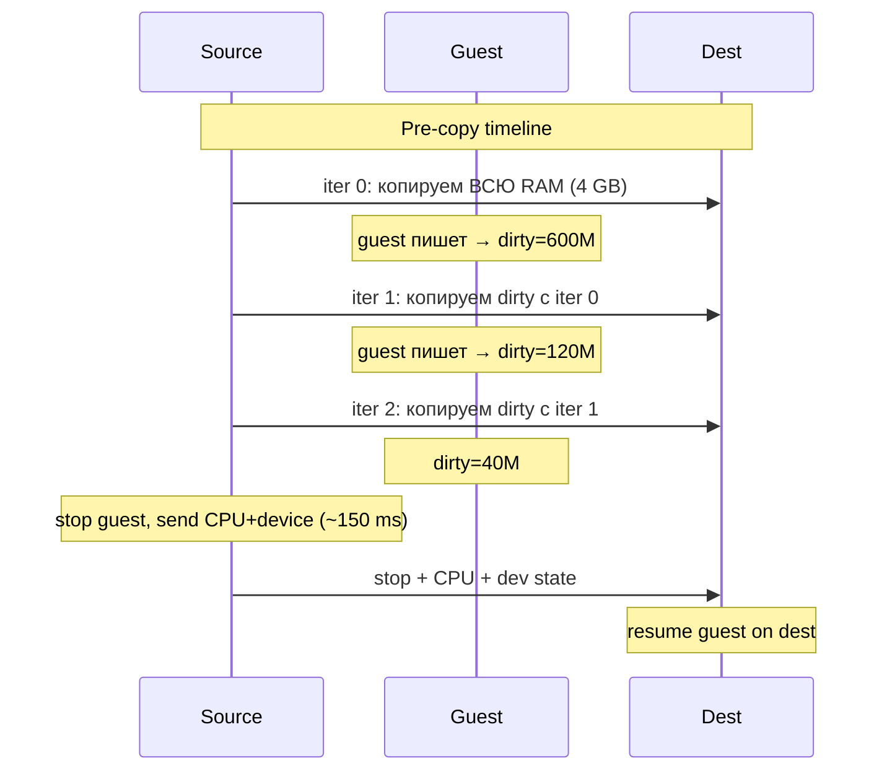
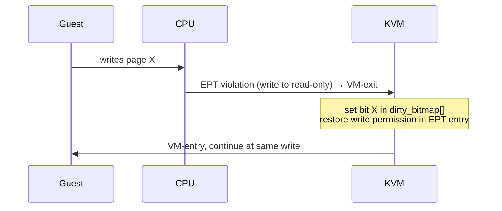
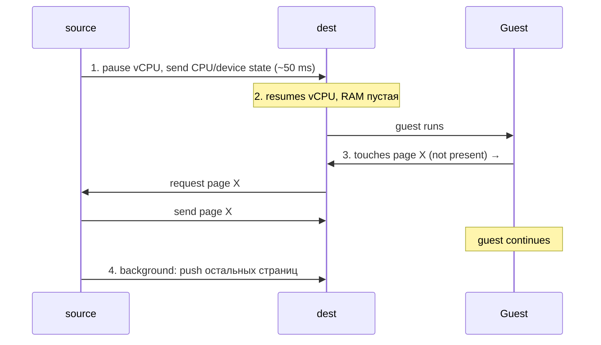
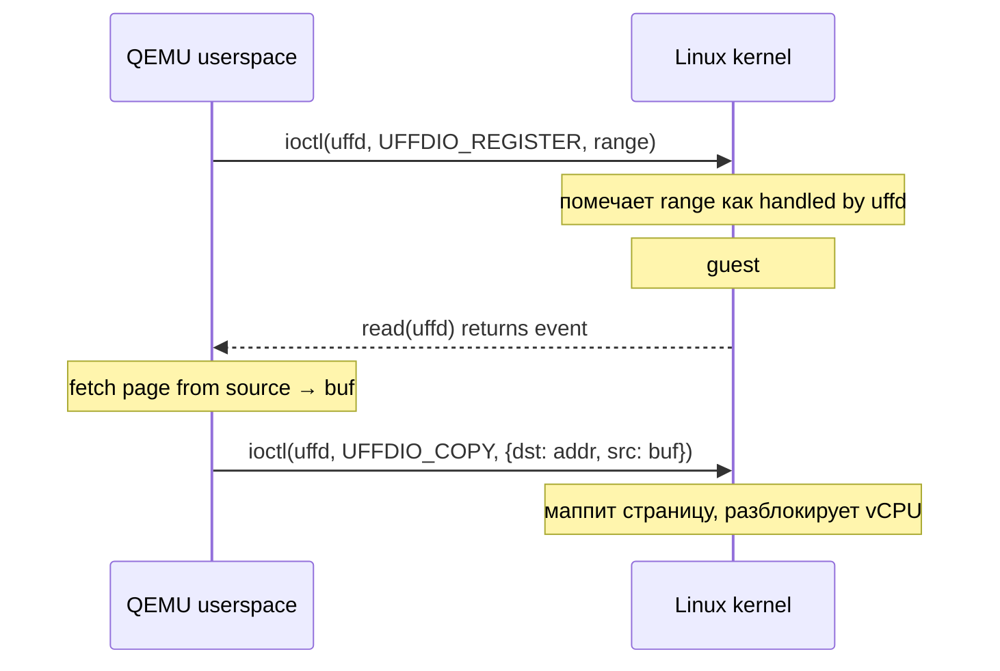
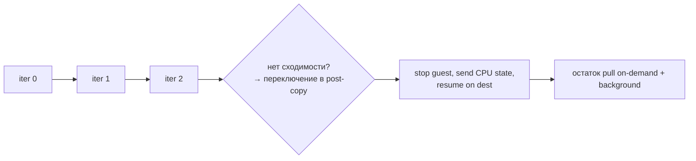
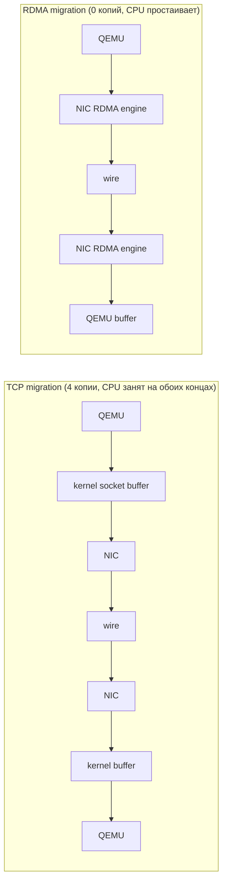
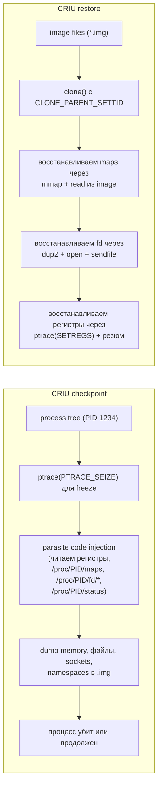

# Live migration виртуальных машин

Live migration — это перенос работающей VM с одного физического хоста на другой без остановки гостевой ОС. Гость
продолжает обрабатывать запросы, отвечать по сети, держать TCP-соединения; в какой-то момент его исполнение прерывается
на десятки миллисекунд и возобновляется уже на другом хосте — с теми же регистрами, той же RAM, теми же открытыми
сокетами. Эта возможность лежит в основе любого современного дата-центра: без неё нельзя обновлять ядра хостов,
балансировать нагрузку или эвакуировать «умирающее» железо незаметно для клиента.

Сложность не в копировании памяти, а в копировании памяти, которая меняется прямо во время копирования. Если просто
сделать `read` всех страниц гостя и переслать на дестинейшн, к моменту окончания передачи половина из них уже устареет.
Решение — итеративное копирование с отслеживанием изменений (dirty page tracking), а в крайних случаях — мгновенная
заморозка с дослыванием по запросу.

## Зачем

| Сценарий         | Что даёт live migration                                                     |
|------------------|-----------------------------------------------------------------------------|
| Maintenance      | Обновить kernel host'а, заменить RAM, перезагрузить hypervisor без downtime |
| Rebalancing      | Перенести «горячие» VM на менее загруженные хосты, освободить gpu/numa node |
| Hardware failure | Эвакуация VM с хоста, у которого деградирует RAM или растёт ECC counter     |
| Consolidation    | Слить VM с трёх полупустых хостов на один, остальные выключить (power save) |
| Cloud SLA        | Гарантировать customer'у uptime, даже когда провайдер чинит infrastructure  |

Без live migration любой из этих сценариев требует согласованного простоя VM, что в multi-tenant cloud попросту не
продаётся: AWS, GCP и Azure обязаны переносить тысячи VM в сутки незаметно для пользователей.

## Pre-copy migration

Pre-copy — стандартный алгоритм, реализованный в QEMU/KVM, VMware vMotion и Xen XenMotion. Идея: пока гость работает,
последовательно копировать RAM на дестинейшн, отслеживать изменённые (dirty) страницы и копировать их повторно, пока
объём «грязной» памяти не станет достаточно малым, чтобы дослать остаток за фиксированный downtime budget.



Алгоритм по шагам:

1. **Iter 0 (полный проход).** Hypervisor включает dirty logging и копирует все страницы гостя на дестинейшн. Гость
   продолжает работать и продолжает писать в RAM — изменённые страницы помечаются в dirty bitmap.
2. **Iter N.** Копируем только те страницы, что были изменены за время предыдущей итерации. С каждым проходом dirty set
   уменьшается, но не до нуля — гость продолжает работать.
3. **Convergence check.** На каждой итерации hypervisor сравнивает `dirty_rate × downtime_limit > remaining_dirty_size`.
   Когда условие выполнено — переходим в stop-the-world.
4. **Stop-the-world.** vCPU гостя ставятся на паузу, последний dirty-set + CPU registers + device state (virtio rings,
   APIC, MSRs) отправляются на дестинейшн.
5. **Resume on dest.** На дестинейшн hypervisor загружает CPU state в vCPU и снимает паузу. Гость продолжает с той же
   инструкции, что была прервана.

Типичный downtime — 100–300 ms для VM 4–16 GB на 10 GbE. При плохой сходимости (high dirty rate, например VM с in-memory
БД под нагрузкой) количество итераций может расти бесконечно — алгоритм не сходится, downtime budget недостижим. В QEMU
есть `migrate_set_parameter downtime-limit 500` (в миллисекундах) и auto-converge: hypervisor сам начинает throttle'ить
vCPU гостя, искусственно замедляя его, чтобы dirty rate упал ниже bandwidth.

```
Сходимость pre-copy:

dirty rate (MB/s)
   ▲
500│  X  X  X  X  X  X     ← не сходится: dirty rate >= bandwidth
   │
400│  ──── auto-converge throttle включается ────
   │
300│  v  v  v  v           ← throttle сработал, гость замедлен на 30%
   │
200│  v  v                 ← dirty rate упал
   │
100│  v                    ← convergence: stop-the-world
   │
   └──────────────────────────▶  iter
```

## Dirty page tracking

Чтобы знать, какие страницы изменились, hypervisor должен отслеживать запись в гостевую RAM. Существует три механизма,
каждый со своим overhead'ом и granularity.

### Write-protect через EPT

Простейший подход: hypervisor проходит по EPT (Extended Page Tables) и снимает write permission со всех гостевых
страниц. Любая запись от гостя вызывает EPT violation → VM-exit → hypervisor помечает страницу в bitmap и
восстанавливает
write permission. На следующей итерации цикл повторяется.



Цена: один VM-exit на каждую страницу, что изменяется впервые после очистки bitmap. На VM с активным workload — десятки
тысяч exit'ов в секунду, заметный overhead.

### EPT A/D bits

Intel начиная с Haswell поддерживает в EPT биты Accessed и Dirty (D-bit) — аналог тех же битов в обычных page tables.
MMU сам устанавливает D-bit при записи в страницу, hypervisor периодически проходит по EPT, читает биты, копирует их в
bitmap и сбрасывает обратно. Никаких VM-exit'ов, но hypervisor должен периодически «обходить дерево» — стоимость растёт
с размером гостевой RAM.

| Размер гостя | Размер EPT (4-level) | Время полного обхода |
|--------------|----------------------|----------------------|
| 4 GB         | ~16 MB               | ~5 ms                |
| 64 GB        | ~256 MB              | ~80 ms               |
| 1 TB         | ~4 GB                | ~1.3 s               |

### PML: Page Modification Logging

С Broadwell/Skylake Intel добавил **PML** — hardware buffer, в который CPU автоматически пишет физический адрес каждой
изменённой страницы. Буфер фиксированного размера (512 записей); при заполнении — VM-exit, hypervisor вычитывает буфер
и сбрасывает индекс.

```
PML buffer (512 × 8 bytes):

   ┌───────────────────────────────────────────────┐
   │ GPA1 │ GPA2 │ GPA3 │ ... │ GPA512             │  ← CPU пишет сюда при записи в RAM
   └───────────────────────────────────────────────┘
          ▲
          │ PML index (VMCS field)
          │
   при заполнении → PML log-full VM-exit
   hypervisor сливает буфер в dirty bitmap, сбрасывает index = 0
```

PML — самый эффективный механизм: один VM-exit на каждые 512 dirty pages вместо одного на страницу. Используется по
умолчанию в KVM на современных CPU (`kvm-intel pml=1`, default Y).

| Механизм          | Overhead на guest write | Hardware   | Granularity |
|-------------------|-------------------------|------------|-------------|
| EPT write-protect | один VM-exit/page       | любой VT-x | 4 KB        |
| EPT D-bit         | ноль (lazy scan)        | Haswell+   | 4 KB / 2 MB |
| PML               | 1 exit / 512 pages      | Broadwell+ | 4 KB        |

## Post-copy migration

Pre-copy плохо сходится на write-heavy workload'ах: гость пишет быстрее, чем hypervisor успевает копировать. Post-copy
переворачивает порядок — сначала переносится исполнение, потом память.



Алгоритм:

1. **Минимальный stop.** Source ставит гость на паузу, отправляет CPU/device state на дестинейшн (~50 ms).
2. **Resume on dest.** Дестинейшн возобновляет vCPU. Гостевая RAM на дестинейшн пустая (все страницы помечены как
   missing в userfaultfd).
3. **Page fault on demand.** Гость обращается к странице — kernel генерирует userfaultfd event, QEMU посылает запрос
   на source, source отправляет страницу, QEMU маппит её через `UFFDIO_COPY` ioctl. Гостевой vCPU всё это время
   заблокирован.
4. **Background pull.** Параллельно QEMU тащит страницы пачками с source в порядке адресов, без ожидания запроса.

Trade-off: общее время migration короче (нет повторного копирования dirty), но downtime «размазан» во времени — каждый
on-demand page fault стоит RTT до source + propagation. Latency variance во время post-copy высокая, особенно для
интерактивных workload'ов.

Главный риск post-copy: если сеть между source и dest упадёт во время фазы pull, VM умирает — на дестинейшн нет
полной памяти, на source CPU state уже устарел. Pre-copy в этой ситуации просто прерывается, гость продолжает на source.

### Userfaultfd

`userfaultfd` — Linux kernel mechanism, через который userspace процесс перехватывает page faults в своём же адресном
пространстве. Изначально создан для post-copy migration в QEMU; сейчас используется также в CRIU, snapshot/restore,
checkpoint в long-running batch jobs.



## Hybrid pre-copy → post-copy

Pre-copy надёжен, но плохо сходится; post-copy быстр, но хрупок. Hybrid mode стартует с pre-copy: если после N итераций
convergence не достигнут — переключается в post-copy для оставшихся страниц.



В QEMU включается так: pre-copy запускается стандартно, после нескольких итераций вызывается `migrate-start-postcopy`,
который инициирует переход. Большинство «холодных» страниц уже на дестинейшн (благодаря pre-copy), оставшиеся «горячие»
дотягиваются on-demand.

## Storage migration

RAM — не единственное, что нужно переносить. Если у VM локальный диск (qcow2/raw файл на host filesystem),
дестинейшн должен иметь идентичную копию диска. Варианты:

- **Shared storage.** Образ диска лежит на NFS, iSCSI, Ceph RBD, GlusterFS — оба хоста монтируют один и тот же раздел.
  Live migration RAM, диск общий, никакого копирования. Стандарт в enterprise (VMware vSAN, Proxmox с Ceph).
- **Block migration.** QEMU копирует блоки диска параллельно с RAM по тому же migration channel. Долго (TB-сайз диск
  через 10 GbE — десятки минут), требует dirty tracking для блочного устройства.
- **NBD mirror.** На дестинейшн поднимается пустой диск, source через QEMU `drive-mirror` зеркалит запись в реальном
  времени; когда mirror догнал — migrate RAM, переключение, source disk выкидывается.

| Подход          | Pro                           | Contra                                        |
|-----------------|-------------------------------|-----------------------------------------------|
| Shared storage  | мгновенно (нечего копировать) | требует SAN/NAS infrastructure                |
| Block migration | работает out-of-the-box       | долго, dirty tracking блоков, downtime растёт |
| NBD mirror      | не блокирует, гибко           | сложнее настроить, нужен mirror window        |

## RDMA-ускоренная migration

Передача гигабайт RAM через TCP/IP создаёт CPU overhead на обоих хостах: copy from kernel buffer, checksum, поток в
NIC. RDMA (Remote Direct Memory Access) позволяет NIC одного хоста читать/писать в память другого хоста минуя kernel и
CPU — zero-copy transfer.



QEMU поддерживает RDMA через RoCE (RDMA over Converged Ethernet) или InfiniBand: `migrate -d rdma:dest_host:8888`.
Bandwidth на 100 GbE достигает 90+ Gbps против 30–40 Gbps по TCP. Используется в HPC и в Azure для миграции crucial VM.

## Контейнеры: CRIU вместо VM migration

Контейнеры — не VM, у них нет vCPU и vRAM. Но идея «заморозить процесс и восстановить на другом хосте» применима и к
ним. CRIU (Checkpoint/Restore In Userspace) делает dump живого процесса в файлы и потом восстанавливает его на любом
другом хосте с тем же kernel.



Использование: live migration контейнеров в Podman/LXC, snapshot долгих batch jobs (если упал — restore с
чекпоинта), zero-downtime restart демонов (например, CRIU integration в OpenVZ и Virtuozzo).

| Параметр      | VM live migration         | CRIU container migration            |
|---------------|---------------------------|-------------------------------------|
| Изоляция      | полная (отдельный kernel) | shared kernel (namespaces)          |
| Размер state  | вся RAM гостя             | только working set процессов        |
| Зависимость   | независим от kernel хоста | требует bit-identical kernel/libc   |
| Сетевой state | virtio NIC переезжает     | сложнее, нужна TCP repair extension |
| Downtime      | 100–300 ms                | 50–500 ms                           |

CRIU дешевле, когда workload — контейнер; VM migration единственный вариант, когда нужна изоляция от kernel CVE или
гость — другая ОС.

## Convergence: working set и bandwidth

Сходимость pre-copy определяется неравенством `dirty_rate < bandwidth`. Чем больше **working set** (страницы, к
которым гость регулярно обращается с записью), тем выше dirty rate.

```
Зоны convergence:

   dirty rate
      ▲
 high │ ░░░░░░░░░░░░░░░░░░░░░░░░░░  не сходится
      │ ░░░░░░░░░░░░░░░░░░░░░░░░░░
      │ ░░░░░░░░░░░░░░░░░░░░░░░░░░  → нужен post-copy или auto-converge
      │ ░░░░░░░░░░░░░░░░░░░░░░░░░░
 med  ├──────────────────────────── bandwidth
      │ ▒▒▒▒▒▒▒▒▒▒▒▒▒▒▒▒▒▒▒▒▒▒▒▒▒▒  сходится, но медленно (десятки iter)
 low  │ ░░░░░░░░░░░░░░░░░░░░░░░░░░  сходится быстро (1-2 iter)
      └──────────────────────────────▶ time
```

Параметры QEMU для tuning:

| Параметр                              | Значение                                | Эффект                      |
|---------------------------------------|-----------------------------------------|-----------------------------|
| `max-bandwidth`                       | байт/сек, 0 = unlimited                 | потолок сетевого throughput |
| `downtime-limit`                      | миллисекунды (default 300)              | целевое stop-the-world окно |
| `cpu-throttle-initial`                | %, CPU throttle для auto-converge       | замедление гостя            |
| `cpu-throttle-increment`              | % шаг увеличения throttle               | агрессивность сходимости    |
| `compress-level` / `compress-threads` | gzip/zstd compression migration stream  | bandwidth ↓, CPU ↑          |
| `multifd-channels`                    | количество параллельных TCP/RDMA канал. | bandwidth ↑ на multi-NIC    |

Сетевой fabric выбирает потолок: 10 GbE = 1.2 GB/s, 40 GbE = 5 GB/s, 100 GbE = 12 GB/s. VM 64 GB на 10 GbE без
сжатия — минимум 53 секунды чистого transfer, плюс iter overhead.

## Cluster orchestration

В одиночку pre-copy/post-copy — лишь механизм. Cluster manager планирует, **куда** мигрировать, **когда** и **сколько
параллельно**.

| Платформа       | Migration backend   | Особенности                                            |
|-----------------|---------------------|--------------------------------------------------------|
| OpenStack Nova  | libvirt + QEMU      | live-migration API, scheduler выбирает target host     |
| oVirt / RHV     | libvirt + QEMU      | high-availability fencing, NUMA-aware migration        |
| Proxmox VE      | QEMU                | встроенный cluster + Ceph/ZFS shared storage           |
| VMware vSphere  | vMotion             | proprietary, vMotion поверх vmkernel, EVC mode для CPU |
| Hyper-V / SCVMM | Hyper-V Live Mig    | SMB3 multichannel для transfer, kerberos auth          |
| Google GCE      | proprietary         | live migration «прозрачна» — пользователь не видит     |
| AWS EC2         | proprietary (Nitro) | только для инфраструктурных нужд, hidden от tenant     |

vSphere vMotion и Hyper-V Live Migration исторически работали через shared SAN, но обе платформы давно поддерживают
shared-nothing migration (block migration on the fly). Google GCE отличается тем, что мигрирует VM в среднем раз в
несколько дней даже без явного запроса пользователя — это часть infrastructure maintenance.

## Связанные темы

- [Виртуализация: основы](foundations.md) — место hypervisor'а в стеке и как vCPU/vRAM устроены изнутри
- [Виртуализация памяти](memory_virtualization.md) — EPT/NPT, на которых построен dirty tracking
- [Внутренности QEMU](qemu_internals.md) — где в QEMU живёт код migration loop и savevm-handlers
- [I/O passthrough](io_passthrough.md) — почему VFIO-устройства мешают live migration

## Источники

- [QEMU Migration documentation](https://www.qemu.org/docs/master/devel/migration.html)
- [KVM Forum talks on post-copy](https://kvmforum2021.sched.com/) — слайды Andrea Arcangeli по userfaultfd
- [Intel SDM, Vol 3C, Chapter 28: VMX support for address translation](https://www.intel.com/sdm) — PML, EPT D-bit
- [CRIU documentation](https://criu.org/Main_Page)
- `man 2 userfaultfd`
