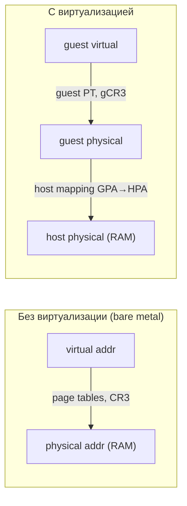
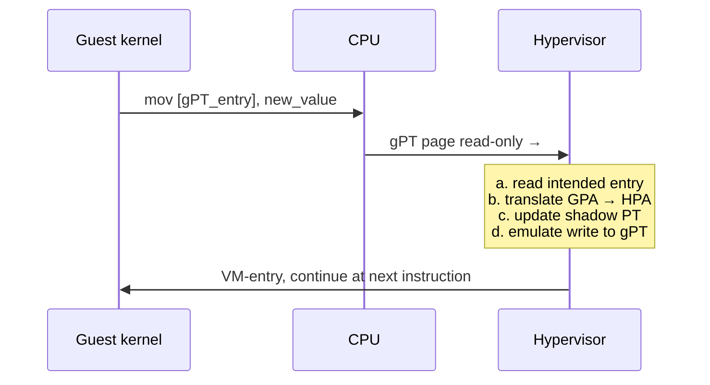

# Виртуализация памяти

Гость в виртуальной машине запускает собственное ядро со своей подсистемой управления памятью: гостевые процессы видят
**guest virtual addresses (GVA)**, гостевое ядро строит page tables, которые транслируют GVA в **guest physical
addresses (GPA)**. Но GPA — это фикция: реальная RAM управляется гипервизором, и каждая GPA должна быть отображена ещё
раз — в **host physical address (HPA)**. Получается двойная трансляция, и именно она составляет центральную задачу
виртуализации памяти.

## Проблема двойной трансляции

На bare-metal трансляция выполняется один раз: процесс выдаёт virtual address, MMU обходит page tables, корень которых
лежит в CR3, и получает физический адрес. В виртуализованной системе таких уровней два:



Гипервизор не имеет права позволить гостю напрямую программировать CR3 на свои собственные таблицы: если бы гость
указывал на реальные HPA, он мог бы прочитать или испортить память других гостей и самого гипервизора. Значит каждая
запись в гостевой PT должна где-то «перехватываться» или «доводиться» до настоящего HPA.

Существует два принципиально разных подхода: **shadow page tables** (программная эмуляция второй трансляции,
использовалась
до 2008 года) и **nested page tables** (аппаратная вторая трансляция, EPT на Intel и NPT на AMD).

## Shadow Page Tables

Идея shadow PT: гипервизор тайно поддерживает собственные «теневые» таблицы, которые отображают GVA сразу в HPA. CR3
указывает не на гостевую таблицу, а на shadow PT, и MMU спокойно обходит её одним 4-уровневым walk'ом.

```
Что видит гость:                  Что реально стоит в CR3:

   gPT (GVA → GPA)                   shadow PT (GVA → HPA)
   ┌──────────────┐                  ┌──────────────────┐
   │ PML4 → PDPT  │                  │ PML4 → PDPT      │
   │  → PD → PT   │                  │  → PD → PT       │
   │  → GPA       │                  │  → HPA           │
   └──────────────┘                  └──────────────────┘
   ▲                                  ▲
   │                                  │
   только в guest RAM,                shadow построена
   гипервизор за ней следит           гипервизором по gPT + GPA→HPA mapping
```

Чтобы shadow была актуальной, гипервизор должен видеть любое изменение гостевой PT. Для этого страницы, содержащие
gPT, помечаются как read-only в shadow. Любая попытка гостя записать туда вызывает page fault, который перехватывается
гипервизором (`VM-exit`):



Shadow PT работает и даёт корректную семантику, но цена огромна:

| Операция                            | Стоимость shadow PT                            |
|-------------------------------------|------------------------------------------------|
| Обычное чтение/запись данных        | как на bare metal (TLB hit / single page walk) |
| Запись в gPT (например, при `mmap`) | `VM-exit` → walk → update shadow → `VM-entry`  |
| Переключение контекста в госте      | смена shadow CR3 → массовый TLB flush          |
| `INVLPG` в госте                    | `VM-exit` → invalidate в shadow                |

В современных гостевых ОС (особенно с PIE-исполняемыми, ASLR и активным fork/exec) page tables меняются десятки тысяч
раз в секунду. Каждое изменение — `VM-exit` стоимостью 1–5 микросекунд. На I/O-нагрузках shadow PT добавляли 20–60%
оверхеда. Кроме того, гипервизор обязан хранить shadow для каждого процесса в каждом госте — заметный расход памяти.

В 2008 году Intel и AMD добавили аппаратную поддержку двух уровней трансляции, и shadow PT остались только в
legacy-режиме
(например, KVM на CPU без EPT/NPT, что встречается лишь на доисторическом железе).

## Nested Page Tables: EPT и NPT

Intel называет механизм **EPT (Extended Page Tables)**, AMD — **NPT (Nested Page Tables)** или **RVI (Rapid
Virtualization Indexing)**. Принцип одинаков: процессор умеет выполнять **two-dimensional page walk** — обход двух
независимых иерархий за один проход MMU.

- Гостевая PT (корень — `guest CR3`) транслирует GVA в GPA.
- EPT/NPT (корень — `EPTP` / `nCR3`, программируется только гипервизором) транслирует GPA в HPA.
- При каждом шаге обхода гостевой PT адрес, прочитанный из памяти, — это GPA, который сам должен быть транслирован через
  EPT прежде, чем по нему можно прочитать следующую запись.

```
Two-dimensional page walk (x86-64, оба уровня 4-level):

guest CR3 ────EPT walk────▶ HPA(gPML4)
                                │
                                ▼  read gPML4[GVA[47:39]]
                            GPA(gPDPT)
                                │
                                ├─EPT walk──▶ HPA(gPDPT)  read gPDPT[GVA[38:30]]
                                │
                                ▼
                            GPA(gPD)
                                │
                                ├─EPT walk──▶ HPA(gPD)    read gPD[GVA[29:21]]
                                │
                                ▼
                            GPA(gPT)
                                │
                                ├─EPT walk──▶ HPA(gPT)    read gPT[GVA[20:12]]
                                │
                                ▼
                              GPA(page)
                                │
                                └─EPT walk──▶ HPA(page)   ← конечная HPA
```

В худшем случае один промах TLB на guest virtual access требует 5 EPT walks по 4 уровня = **до 24 обращений к физической
памяти** (4 уровня гостевой иерархии × (4 уровня EPT для каждой записи + сам data fetch) — в зависимости от размера
страниц гостя и хоста). На bare metal промах стоит 4 обращения. Поэтому виртуализованные нагрузки гораздо чувствительнее
к качеству кеширования трансляций.

### Кэширование трансляций: TLB, VPID, EPT cache

TLB кэширует финальный mapping **GVA → HPA**, поэтому при попадании двойная трансляция не выполняется вовсе. Но
переключения
между гостем и хостом (`VM-exit`/`VM-entry`) исторически вызывали полный flush TLB. Чтобы этого избежать, Intel ввёл два
тега:

- **VPID (Virtual Processor Identifier)** — каждая запись TLB помечается номером vCPU. Записи разных VM/vCPU не
  пересекаются,
  и flush не нужен.
- **EPT context tagging** — кэшированные EPT-трансляции тоже помечаются, чтобы переход в гипервизор не сбрасывал их.

AMD предоставляет аналогичные механизмы — **ASID** и **nested TLB**. Эффект тот же: VM-exit перестаёт быть катастрофой
для TLB.

### Сравнение shadow PT и EPT/NPT

| Характеристика                  | Shadow Page Tables                  | EPT / NPT                       |
|---------------------------------|-------------------------------------|---------------------------------|
| Кто строит вторую трансляцию    | гипервизор программно               | MMU аппаратно                   |
| Worst-case page walk            | 4 обращения                         | до 24 обращений                 |
| Стоимость записи в guest PT     | `VM-exit` (микросекунды)            | бесплатно                       |
| Переключение контекста в госте  | смена shadow CR3, частичный rebuild | смена `guest CR3` без `VM-exit` |
| Память на shadow                | shadow на каждый guest-процесс      | одна EPT на VM                  |
| Чувствительность к качеству TLB | средняя                             | высокая                         |
| Поддерживается современным KVM  | только для CPU без EPT/NPT          | по умолчанию                    |

На практике EPT/NPT выигрывает почти всегда: оверхед на чистых вычислительных нагрузках близок к 1–3%, а на нагрузках с
интенсивным управлением памятью (компиляция, fork-серверы) разница со shadow — порядок величины.

## EPT permission bits и memory types

Каждая запись EPT содержит свой собственный набор флагов, **независимых от гостевых PT**.

```
EPT entry (упрощённо, 64 бита):

  Биты 51–12  HPA физической страницы (page frame number)
  Биты 5–3    EPT memory type (UC, WC, WT, WP, WB)
  Бит  6      Ignore PAT memory type
  Бит  2      X — execute (instructions can be fetched)
  Бит  1      W — write (stores allowed)
  Бит  0      R — read (loads allowed)
```

Поля **R/W/X раздельны**: можно сделать страницу read-only для гостя, даже если гость пометил её как RW в своей PT, или
запретить выполнение, даже если гость считает её исполняемой. Любое нарушение порождает **EPT violation** — особый
`VM-exit` с кодом, описывающим, какое именно право было нарушено. Это открывает несколько важных применений:

- **Copy-on-Write на уровне гипервизора.** Память, разделённая между VM (см. KSM ниже), помечается как `R-X` в EPT.
  Запись из гостя → EPT violation → гипервизор делает копию страницы и подменяет HPA в EPT.
- **Shadow stack / control-flow integrity для гостя.** Гипервизор может защитить определённые страницы от записи,
  обеспечивая дополнительный слой защиты независимо от гостевой ОС.
- **Execute-only memory (anti-ROP).** Страница помечается как `--X` — её можно выполнять, но нельзя читать, что ломает
  ROP-цепочки, опирающиеся на чтение `.text`.
- **Live migration.** На фазе синхронизации EPT снимает `W` со всех страниц → каждая запись → EPT violation → страница
  отмечается как dirty и пересылается на новый хост.
- **VM introspection.** Системы анализа памяти (например, антируткиты) пользуются EPT violation, чтобы наблюдать запись
  в критические структуры ядра без модификации гостя.

### EPT memory type

Поле `EPT memory type` определяет, как HPA кэшируется в L1/L2/L3. По умолчанию используется write-back (WB), что
оптимально для обычной RAM. Но для **PCI passthrough** и **MMIO** регионов это критично:

- MMIO-страницы устройств должны быть **uncacheable (UC)** — иначе записи в регистры устройства будут «зависать» в кеше.
- DMA-буферы устройства часто требуют **write-combining (WC)** для производительной потоковой записи.

Гипервизор задаёт EPT MT для каждой страницы; гостевой PAT (Page Attribute Table) комбинируется с EPT MT по правилам
из Intel SDM. Если устройство пробрасывается в гостя, гипервизор обязан выставить корректный MT, иначе устройство
может работать некорректно или повредить данные.

## KSM: Kernel Same-page Merging

На хосте с десятками VM огромная доля гостевой памяти идентична: zero-страницы, страницы `.text` одной и той же версии
glibc, общий контент Docker-образов внутри гостей. Хранить их по отдельной копии на каждую VM расточительно.

**KSM (Kernel Same-page Merging)** — поток ядра, который периодически сканирует страницы, помеченные приложением как
«мерджабельные», ищет идентичные по контенту и склеивает их в одну физическую страницу с CoW-семантикой.

```
До KSM:                                  После KSM:

VM1 ┌──────────┐ ┌──────────┐            VM1 ┌──────────┐
    │ page A   │ │ page B   │                │ page A   │ ──┐
    └──────────┘ └──────────┘                └──────────┘   │
                                                            ▼
VM2 ┌──────────┐ ┌──────────┐            VM2 ┌──────────┐   ┌──────────────┐
    │ page A'  │ │ page B   │                │ page A'  │ ─▶│ shared page  │
    └──────────┘ └──────────┘                └──────────┘   │ (read-only,  │
                                                            │  KSM page)   │
VM3 ┌──────────┐                         VM3 ┌──────────┐   └──────────────┘
    │ page A   │                             │ page A   │ ──┘
    └──────────┘                             └──────────┘

A, A', A одинаковы по контенту — KSM хранит ОДНУ физическую страницу,
EPT всех трёх VM указывает на неё, флаг W снят
```

### Подключение KSM

```bash
# Активировать KSM
echo 1 | sudo tee /sys/kernel/mm/ksm/run

# Сколько страниц сейчас shared / какова экономия
cat /sys/kernel/mm/ksm/pages_sharing
cat /sys/kernel/mm/ksm/pages_shared
cat /sys/kernel/mm/ksm/pages_unshared

# Скорость сканирования
echo 1000 | sudo tee /sys/kernel/mm/ksm/pages_to_scan
echo 200  | sudo tee /sys/kernel/mm/ksm/sleep_millisecs
```

QEMU помечает гостевую RAM через `madvise(addr, len, MADV_MERGEABLE)`. Без этого вызова KSM страницу не тронет, что
позволяет приложению опираться на стабильные HPA там, где это критично (DPDK, RDMA-буферы).

### Когда выгодно

- Multi-tenant VPS-хостинг с однотипными гостями (десятки Ubuntu 22.04): экономия 20–40% RAM.
- Контейнерные нагрузки одинаковыми образами.
- ML-инференс с одной моделью на множество reader-процессов.

### Цена

- CPU нагрузка фонового потока (`ksmd`). На холостом хосте незаметна, на загруженном — десятые доли процента.
- Запись в общую страницу → EPT violation → копия → разделение разрушено. Постоянно меняющиеся страницы только зря
  тратят циклы `ksmd`.
- **Безопасность.** Атакующий гость может детектировать merge по времени записи (запись в shared страницу занимает
  заметно больше, чем в private) — `Flush+Reload`-подобные cross-VM атаки. Поэтому в публичных облаках KSM
  обычно отключают или ограничивают одной tenant-группой.

## Memory ballooning

Без специальных мер гипервизор не может «отобрать» RAM, уже отданную гостю: гость считает её своей, и любая попытка
хоста просто отозвать страницу приведёт к панике или повреждению данных в госте. Решение — **balloon driver**:
кооперативный механизм, при котором гостевой драйвер сам аллоцирует страницы и сообщает хосту, что они свободны.

```
Состояние 1: balloon пустой, гость использует все 4 GB

   guest ┌────────────────────────────────────────┐
   RAM   │             4 GB used by guest         │
         └────────────────────────────────────────┘
   host  ┌────────────────────────────────────────┐
   HPA   │   4 GB реально занято в RAM хоста      │
         └────────────────────────────────────────┘


Состояние 2: host inflate'ит balloon на 1 GB

   guest ┌───────────────┬────────────────────────┐
   RAM   │ balloon: 1 GB │  3 GB used by guest    │
         │ (driver       │                        │
         │  allocated,   │                        │
         │  unused)      │                        │
         └───────────────┴────────────────────────┘
   host  ┌──── munmap/MADV_DONTNEED ────┬─────────┐
         │ свободно для других VM       │  3 GB   │
         └──────────────────────────────┴─────────┘
```

### Как работает inflate/deflate

1. Гипервизор отправляет команду balloon-драйверу: «занять N MB».
2. Драйвер вызывает гостевой allocator (`alloc_pages`), получает страницы и **не использует их**.
3. Драйвер пересылает GPA полученных страниц хосту через virtio-кольцо.
4. Хост на этих GPA делает `madvise(MADV_DONTNEED)` или `MADV_REMOVE` — физические страницы возвращаются в общий пул.
5. Эти страницы можно отдать другой VM. EPT-запись остаётся валидной; при попытке гостя записать туда (что должно быть
   невозможно, потому что страницы у драйвера) физическая страница будет аллоцирована заново.

При `deflate` гипервизор просит драйвер вернуть память; драйвер вызывает `free_pages`, и страницы снова доступны
гостевым процессам.

### Что это даёт

- **Memory overcommit без reboot.** Можно динамически перераспределить RAM между VM в зависимости от их текущей
  нагрузки.
- **Корректное взаимодействие с гостевым allocator'ом.** Гостевая ОС знает, что эта память «занята», и не будет пытаться
  её использовать или сваповать.
- **Дешевле, чем swap гипервизором.** Хост-уровневый swap гостевой памяти потенциально вытесняет «горячие» страницы;
  balloon же отбирает страницы, которые гостевой allocator явно считает менее ценными.

### Ограничения

- Требует кооперации гостя — без virtio-balloon драйвера (для KVM/QEMU) или vmmemctl (для VMware) механизм не работает.
- При агрессивном inflate гостевая ОС может уйти в OOM или начать активно сваповать собственные процессы.
- Скорость inflate ограничена — гипервизор не может мгновенно освободить большой объём.

## Hot-add и hot-remove памяти

Helper-механизм поверх ACPI: гипервизор объявляет гостю новый memory range через ACPI-событие, гостевой драйвер
вызывает `add_memory()` и подключает диапазон в свой allocator. Hot-add позволяет увеличить guest RAM **на лету**, без
рестарта. Hot-remove работает аналогично, но требует, чтобы гостевой kernel умел evacuate-нуть страницы из удаляемого
диапазона (не все ядра/конфигурации это поддерживают).

```bash
# Внутри гостя — список memory blocks и их состояние
ls /sys/devices/system/memory/
cat /sys/devices/system/memory/memory42/state    # online / offline

# Online нового блока вручную
echo online | sudo tee /sys/devices/system/memory/memory42/state
```

Hot-add чаще всего используется в облачных инсталляциях (auto-scaling по memory pressure) и совместно с balloon —
balloon работает для динамических колебаний, hot-add — для долгосрочного увеличения.

## Hugepages в виртуализованной среде

Hugepages (2 MB и 1 GB на x86-64) сокращают количество уровней page walk и количество TLB-записей, нужных на тот же
объём
данных. В виртуализованной среде эффект двойной: меньше как в гостевой PT, так и в EPT.

| Размер на госте | Размер на хосте | Что происходит                                         |
|-----------------|-----------------|--------------------------------------------------------|
| 4 KB            | 4 KB            | базовый случай, до 24 walks                            |
| 2 MB            | 4 KB            | гостевой walk короче, но EPT walk расщепляется         |
| 2 MB            | 2 MB            | оба walk короче, наилучший случай для типовых нагрузок |
| 1 GB            | 1 GB            | минимум walks, но требует выровненной непрерывной HPA  |

Если хост не имеет hugepages выровненных по гостевым 2 MB-границам, гипервизор **расщепляет** EPT-mapping на 512×4 KB
записей, и выигрыш от гостевых hugepages теряется. Поэтому для производительных VM настраивают **hugepage backing на
хосте**:

```bash
# Зарезервировать 1024 hugepage по 2 MB
echo 1024 | sudo tee /proc/sys/vm/nr_hugepages

# Запустить QEMU с RAM из hugetlbfs
qemu-system-x86_64 \
  -m 4G \
  -mem-path /dev/hugepages \
  -mem-prealloc \
  ...
```

Альтернатива — **THP (Transparent Huge Pages)**: ядро хоста автоматически объединяет смежные 4 KB страницы в 2 MB, если
гость запросил большой кусок. Включается через `/sys/kernel/mm/transparent_hugepage/enabled = always`. THP проще в
эксплуатации, но не даёт гарантий по выравниванию и моменту, когда объединение произойдёт. Для latency-критичных
нагрузок (трейдинг, телеком) используют явный hugetlbfs.

## Memory pinning

Некоторые workloads требуют, чтобы конкретные страницы guest RAM:

- не сваповались на диск хостом;
- не перемещались по HPA (компактация, миграция);
- имели стабильное соответствие GPA ↔ HPA.

Типичные случаи: **DPDK** и **SR-IOV passthrough** (устройство видит HPA напрямую через IOMMU, и любое изменение HPA
разрушит работу DMA), **RDMA** (буферы зарегистрированы у NIC), low-latency-приложения.

Реализация в QEMU/libvirt:

```xml

<memoryBacking>
    <hugepages>
        <page size='2048' unit='KiB'/>
    </hugepages>
    <locked/>          <!-- mlock гостевой RAM -->
    <nosharepages/>    <!-- запретить KSM на этой VM -->
</memoryBacking>
```

`mlockall(MCL_CURRENT | MCL_FUTURE)` внутри QEMU фиксирует все страницы. Это требует `CAP_IPC_LOCK` и достаточного
`RLIMIT_MEMLOCK`. После pinning экономия от KSM/balloon недоступна — pinning ради производительности и предсказуемости,
не ради плотности.

## NUMA-осведомлённость

На хосте с несколькими NUMA-узлами производительность VM критически зависит от того, на каком узле выделена её RAM и на
каких ядрах работают vCPU. Если vCPU крутится на CPU0, а RAM лежит в NUMA1, каждое обращение проходит через
inter-socket interconnect — задержка вырастает в 1.5–2 раза, пропускная способность падает.

Гипервизор должен:

- размещать guest RAM на одном NUMA-узле, если она помещается;
- пиннить vCPU к ядрам того же узла;
- для больших VM пробрасывать гостю топологию через **vNUMA** — гость видит несколько NUMA-узлов и сам оптимизирует
  размещение.

```bash
# Принудительно разместить QEMU и его память на узле 0
numactl --cpunodebind=0 --membind=0 qemu-system-x86_64 ...
```

## Что это даёт целиком

| Механизм             | Цель                                   | Кооперация гостя |
|----------------------|----------------------------------------|------------------|
| EPT / NPT            | дешёвая аппаратная двойная трансляция  | не требуется     |
| Shadow PT            | то же, на CPU без EPT/NPT              | не требуется     |
| KSM                  | дедупликация одинакового контента      | не требуется     |
| Balloon              | динамический возврат RAM хосту         | требуется        |
| Hot-add / hot-remove | изменение размера guest RAM на лету    | требуется        |
| Hugepages backing    | сокращение TLB pressure                | не требуется     |
| Memory pinning       | стабильная HPA для DMA, низкая latency | не требуется     |
| vNUMA + pinning      | locality для больших VM                | частично         |

EPT и NPT решают задачу корректности и базовой производительности; всё остальное — управление **плотностью** (сколько VM
поместится на хост) и **производительностью под нагрузкой** (как близко VM подберётся к bare-metal). Реальный production
почти всегда комбинирует несколько механизмов: hugepages + KSM для основной массы, pinning + dedicated NUMA для
latency-sensitive VM, balloon для over-subscription test/dev окружений.

## Связанные темы

- [Виртуальная память](../memory/virtual_memory.md) — page tables, MMU, TLB, Page Fault на bare metal
- [mmap и маппинг файлов](../memory/mmap_and_file_mapping.md) — `madvise`, `MAP_PRIVATE`/`MAP_SHARED`, основа для KSM
- [Защита памяти](../memory/memory_protection.md) — R/W/X-биты на уровне процесса, EPT расширяет ту же идею на VM
- [KVM API](kvm_api.md) — `KVM_SET_USER_MEMORY_REGION`, как QEMU отдаёт RAM гостю
- [Реализация malloc и free](../memory/malloc_and_free_implementation.md) — гостевой allocator, на который опирается
  balloon driver

## Источники

- Intel® 64 and IA-32 Architectures Software Developer's Manual, Volume 3C — глава «VMX Support for Address Translation»
  (EPT, VPID)
- AMD64 Architecture Programmer's Manual, Volume 2 — глава «Nested Paging»
- [Linux kernel docs: KSM](https://www.kernel.org/doc/html/latest/admin-guide/mm/ksm.html)
- [Linux kernel docs: Memory Hotplug](https://www.kernel.org/doc/html/latest/admin-guide/mm/memory-hotplug.html)
- [Linux kernel docs: Transparent Hugepage Support](https://www.kernel.org/doc/html/latest/admin-guide/mm/transhuge.html)
- [QEMU docs: memory backend, hugepages, ballooning](https://www.qemu.org/docs/master/system/devices/virtio-mem.html)
- Carl Waldspurger, «Memory Resource Management in VMware ESX Server» — классическая работа о ballooning, page sharing,
  memory overcommit
- `man 2 madvise`, `man 2 mlock`, `man 8 numactl`
