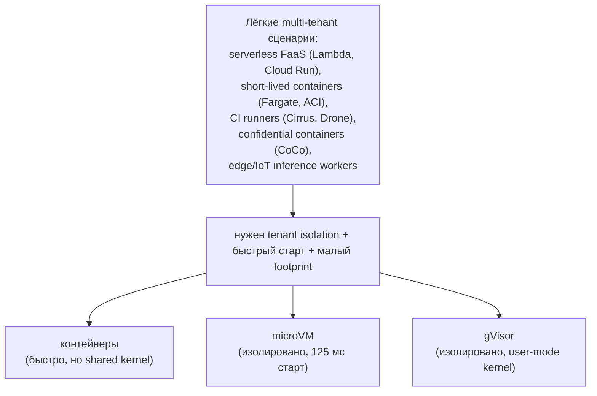
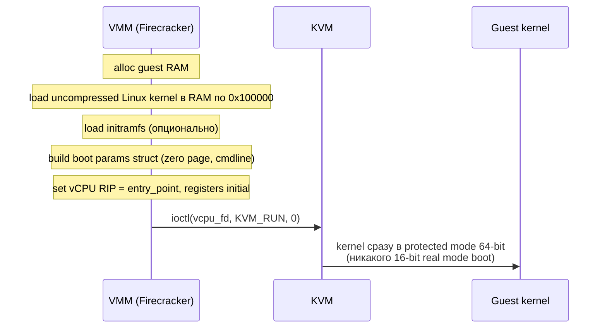
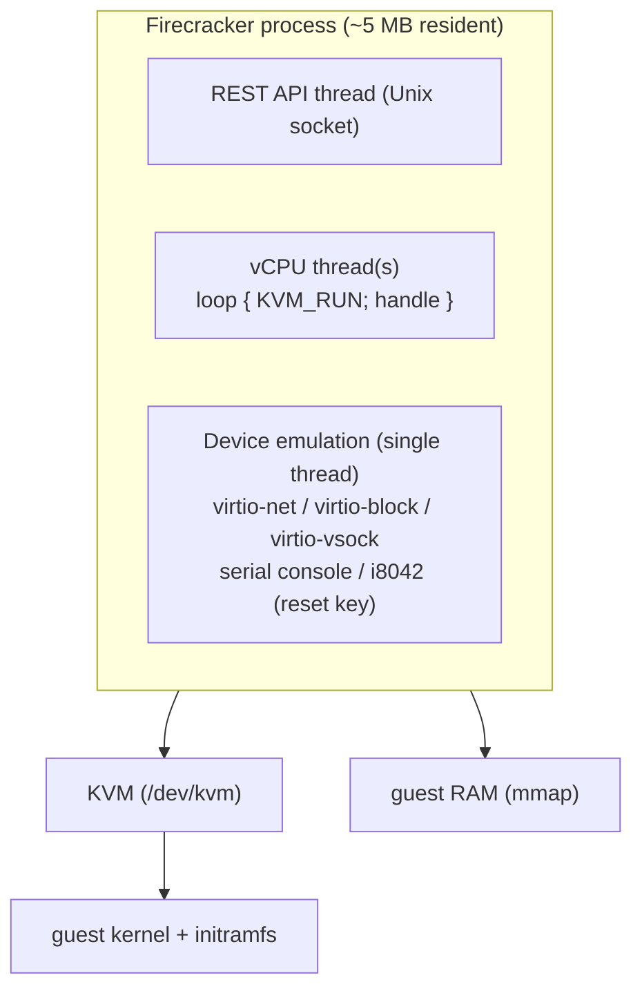
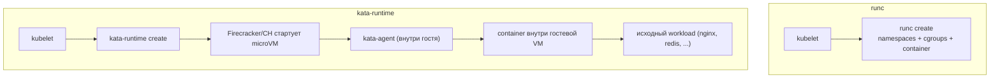
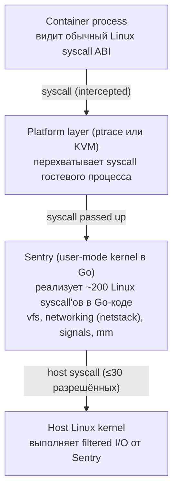
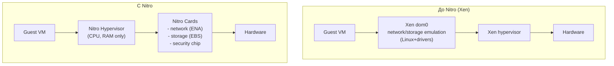

# MicroVMs: Firecracker, Cloud Hypervisor, Kata, gVisor

MicroVM — это виртуальная машина, у которой вырезано всё, что не нужно облачному workload'у: PCI bus, ACPI, BIOS/UEFI,
legacy emulation, hot-plug PCI, video card. Остаётся минимум: vCPU, кусок RAM, набор virtio-устройств для сети и
блочного I/O и прямой путь от `KVM_RUN` до пользовательского кода. Цена этой минимализации — boot time под 125 мс,
memory overhead 5 МБ на VM и attack surface на порядок меньше, чем у обычного QEMU.

Эта категория появилась в 2018 году вместе с Firecracker, который AWS открыл как изначальную основу Lambda и Fargate.
До этого «лёгкий» способ запустить чужой код на multi-tenant платформе означал либо Linux container с известными
проблемами kernel CVE escape, либо полноценную VM с десятками секунд старта. MicroVM закрыл brakch: VM-уровень изоляции
со скоростью контейнера.

## Зачем

Главный заказчик — serverless. AWS Lambda поднимает миллиарды функций в день, каждую с собственным изолированным
окружением. Если функция отрабатывает 50 мс, накладные расходы на старт VM в 200 мс делают платформу бессмысленной.



Дополнительные сценарии:

- **Confidential containers.** Kata-style runtime поверх TDX/SEV-SNP — каждый pod в своей encrypted microVM.
- **Multi-tenant FaaS.** Бесчисленные мелкие функции одной платформы, где tenant'ы не доверяют друг другу.
- **CI sandboxes.** Build per commit в изолированном окружении без риска заразить runner host.

## MicroVM vs обычная VM

| Компонент            | Обычная QEMU VM                   | MicroVM (Firecracker)            |
|----------------------|-----------------------------------|----------------------------------|
| BIOS/UEFI            | SeaBIOS или EDK2 (~500 KB)        | нет, jump прямо в kernel         |
| ACPI                 | полная таблица, AML интерпретатор | нет                              |
| PCI bus              | virtual PCIe root complex         | нет, devices на MMIO/virtio-mmio |
| Devices              | IDE, SATA, USB, sound, VGA, ...   | только virtio-net/block/vsock    |
| Boot path            | POST → BIOS → bootloader → kernel | `KVM_RUN` → kernel в RAM         |
| Memory footprint VMM | 50–200 MB                         | <5 MB                            |
| Boot time            | 2–5 s                             | 50–125 ms                        |
| Codebase             | QEMU ~1.5M LOC C                  | Firecracker ~50K LOC Rust        |
| Attack surface       | широкая (десятки эмуляций)        | узкая (только virtio + KVM)      |



## Firecracker

AWS Firecracker появился в open-source в 2018 году как production-grade VMM для Lambda и Fargate. Написан на Rust,
использует KVM напрямую (без QEMU), и спроектирован вокруг трёх требований: быстрый старт, минимальный memory overhead,
минимальный attack surface.



Особенности:

- **Управление через REST API на Unix socket.** Никаких QMP/HMP, никакой interactive shell. Orchestrator пишет JSON:
  `PUT /machine-config`, `PUT /drives/rootfs`, `PUT /network-interfaces/eth0`,
  `PUT /actions {action_type: InstanceStart}`.
- **Jailer wrapper.** Перед стартом Firecracker запускается под `jailer` — отдельный бинарь, который применяет seccomp
  filter (whitelist ~50 syscall'ов), chroot, setuid в non-root, cgroups, network namespace. Если внутри Firecracker'а
  кто-то найдёт RCE, он окажется в jail без возможности что-либо сделать.
- **Snapshotting.** Можно сохранить state работающей VM (memory + vCPU + virtio rings) в файл за миллисекунды, потом
  restore за 5-10 мс. Lambda использует для warm starts.
- **Что не поддерживается:** PCI passthrough, GPU, vhost-user net, hot-plug в полном объёме, VNC/SPICE, графика.
  Сознательное ограничение: меньше функций → меньше CVE.

Размеры: VMM ~5 МБ резидентной памяти; типичная microVM 128 МБ guest RAM стартует за 100–125 мс до execution
гостевого binary. AWS публикует данные о миллионах microVM на одном bare-metal Nitro host.

## Cloud Hypervisor

Cloud Hypervisor — VMM от Intel (тоже Rust + KVM), стартовал в 2019 году. Изначально форкнулся от Firecracker, но
быстро дивергировал: целевой use case — не serverless, а full-fledged cloud VM, которые хотят быть лёгкими, но не
жертвовать функциональностью.

| Feature                  | Firecracker         | Cloud Hypervisor               |
|--------------------------|---------------------|--------------------------------|
| API                      | REST на Unix socket | REST на Unix socket + CLI      |
| virtio devices           | net, block, vsock   | + vhost-user, RNG, balloon, fs |
| Snapshot/restore         | yes                 | yes                            |
| Live migration           | в работе            | yes                            |
| PCIe (limited)           | no                  | yes (через VFIO)               |
| UEFI boot                | no                  | yes (OVMF)                     |
| Hot-plug CPU/memory      | no                  | yes                            |
| Guest agent              | no                  | yes (через vsock)              |
| Memory footprint         | <5 MB               | ~20-30 MB                      |
| Boot time (kernel ready) | ~50 ms              | ~80-100 ms                     |

Cloud Hypervisor — выбор для случаев, когда нужна изоляция microVM, но workload — это full Linux/Windows guest с
полноценным хранилищем, vhost-user network к DPDK, hot-plug RAM. Используется в Confidential Containers и в KubeVirt
как альтернатива QEMU.

## Kata Containers

Kata — это OCI-compliant container runtime, который под капотом запускает каждый pod не в namespace'ах, а в собственной
лёгкой VM. Снаружи он выглядит как drop-in замена `runc`: kubelet вызывает `kata-runtime create <containerid>`,
получает контейнер с теми же mount'ами и env'ами, что просил, — но изоляция уже не от Linux namespaces, а от отдельного
kernel.



Связка с kubelet идёт через CRI: containerd или CRI-O, у которых настроен `RuntimeClass` с handler'ом `kata`. Между
host'ом и гостем взаимодействие через vsock: host говорит kata-agent'у «запусти процесс с такими-то argv», kata-agent
делает execve внутри VM.

| Параметр            | Container (runc) | Kata Container             |
|---------------------|------------------|----------------------------|
| Kernel sharing      | да (host kernel) | нет (свой kernel в VM)     |
| Startup overhead    | ~50 ms           | ~100-150 ms                |
| Memory overhead     | ~2-5 MB          | ~50-80 MB (kernel + agent) |
| Kernel CVE escape   | возможен         | требует ещё и VM escape    |
| OCI compatibility   | native           | full                       |
| Storage performance | native           | virtio-fs ~85-95% native   |
| Network performance | native           | virtio-net ~90% native     |

Workload видит обычный Linux. Multi-container pod внутри одной microVM (несколько процессов на одном гостевом kernel),
а не одна microVM на container. Backend microVMM выбирается через конфиг: `qemu`, `firecracker`, `cloud-hypervisor`.

## gVisor

gVisor — радикально другой подход от Google (2017). Это user-mode kernel на Go, который реализует Linux ABI в userspace
и подсовывает себя контейнерному процессу через `runsc` (drop-in замена runc).



Ключевая идея: container'у НЕ дают вызывать host kernel напрямую. Любой syscall перехватывается platform layer'ом,
передаётся в Sentry, Sentry эмулирует поведение в своём коде. Только узкая прослойка из ~30 host syscall'ов остаётся
доступной Sentry (через seccomp filter).

| Platform  | Перехват syscall                 | Скорость             | Требования       |
|-----------|----------------------------------|----------------------|------------------|
| `ptrace`  | через `PTRACE_SYSEMU` (default)  | медленно (~5× ovhd)  | работает везде   |
| `kvm`     | гостевой процесс в KVM VM        | быстро (1.5-3× ovhd) | требует /dev/kvm |
| `systrap` | новый, через `SIGSYS` от seccomp | средне               | Linux 5.x+       |

Не VM в традиционном смысле: гостевого Linux kernel нет, есть Sentry — собственная реализация Linux ABI в Go. Большой
плюс: kernel CVE host'а не помогают атакующему, потому что эксплоит ожидает определённую реализацию syscall'а, а Sentry
её не имеет. Большой минус: производительность syscall-heavy workload'ов проседает в 2-5×, поддерживается не весь
Linux ABI (нет `io_uring`, ограниченная поддержка `tracefs`, странности с `/proc`).

Используется в Google App Engine, GKE Sandbox, Cloud Run; для CPU-bound workload'ов overhead приемлем (10-20%), для
file/network-heavy — заметен.

## Сравнительная таблица

```
                     Container    Kata         Firecracker     gVisor
                     (runc)       Container    (standalone)    (runsc, KVM)
                     ─────────    ─────────    ────────────    ─────────────
   Startup           ~50 ms       ~100-150 ms  ~125 ms         ~200-300 ms
   Memory base       ~2-5 MB      ~50-80 MB    ~5 MB           ~10-15 MB
   Kernel sharing    yes (host)   no (guest)   no (guest)      no (Sentry)
   Kernel CVE        vulnerable   protected    protected       protected
    protection
   Syscall perf      100%         ~95%         ~95%            50-80%
   I/O perf          100%         ~85-95%      ~90%            60-80%
   Hardware accel    n/a          KVM          KVM             KVM optional
   Live migration    no (CRIU)    в работе     в работе        no
   OCI native        yes          yes          via Kata        yes (runsc)
```

Выбор сценария:

- **Один tenant, доверенный код** — container (runc). Никаких лишних overhead.
- **Multi-tenant, изоляция важна, нужен Linux ABI** — Kata. Полная изоляция, минимум compat issues.
- **Serverless / FaaS** — Firecracker. Самый быстрый старт, минимальный footprint.
- **Запуск чужого untrusted кода с непредсказуемыми syscall'ами** — gVisor. Защищает host kernel от unknown exploits.
- **VM с PCI passthrough, GPU, hot-plug** — Cloud Hypervisor или обычный QEMU. MicroVMM не подойдёт.

## AWS Nitro как evolution

Nitro — собственная архитектура AWS для гипервизора EC2, начатая в 2017 году. Идея: вынести максимум функциональности
hypervisor'а в hardware (SmartNIC, secure boot chip), оставив на host CPU только тонкий слой управления.



Nitro Cards — отдельные ASIC, через которые проходит весь сетевой трафик и I/O гостя. Hypervisor host'а не видит данные
guest'а: Nitro Card терминирует TLS, шифрует EBS, инициализирует firmware. Это сильно сократило attack surface: даже
если guest вырвался в hypervisor, у hypervisor нет доступа к net/storage других guest'ов — те идут через свои Nitro
Cards.

Firecracker работает именно на Nitro: каждый Lambda invocation — Firecracker microVM на bare-metal Nitro instance, всё
сетевое/блочное I/O — через Nitro Cards. Связка bare metal + Nitro + microVMM даёт цепочку из четырёх уровней
изоляции (firmware → hypervisor → microVMM → guest kernel), что и позволило AWS гарантировать строгое разделение
tenant'ов на одной железке.

## Связанные темы

- [Виртуализация: основы](foundations.md) — Type 1/Type 2, hypervisor stack
- [Virtio](virtio.md) — virtio-net, virtio-block, virtio-vsock, на которых построен microVM I/O
- [Внутренности QEMU](qemu_internals.md) — для сравнения «толстый» VMM
- [KVM API](kvm_api.md) — ioctl'ы, которые Firecracker и Cloud Hypervisor используют напрямую
- [Confidential computing](confidential_computing.md) — microVM как контейнер для TDX/SEV-SNP

## Источники

- [Firecracker repository и whitepaper](https://github.com/firecracker-microvm/firecracker)
- [Firecracker: Lightweight Virtualization for Serverless Applications (NSDI 2020)](https://www.usenix.org/conference/nsdi20/presentation/agache)
- [Cloud Hypervisor documentation](https://www.cloudhypervisor.org/)
- [Kata Containers architecture](https://github.com/kata-containers/kata-containers/blob/main/docs/design/architecture.md)
- [gVisor: The Container Security Platform](https://gvisor.dev/docs/)
- [AWS Nitro System overview](https://aws.amazon.com/ec2/nitro/)
