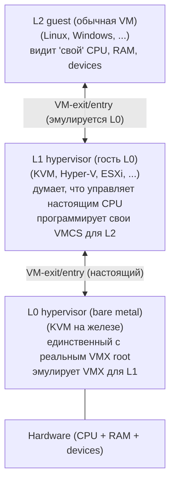
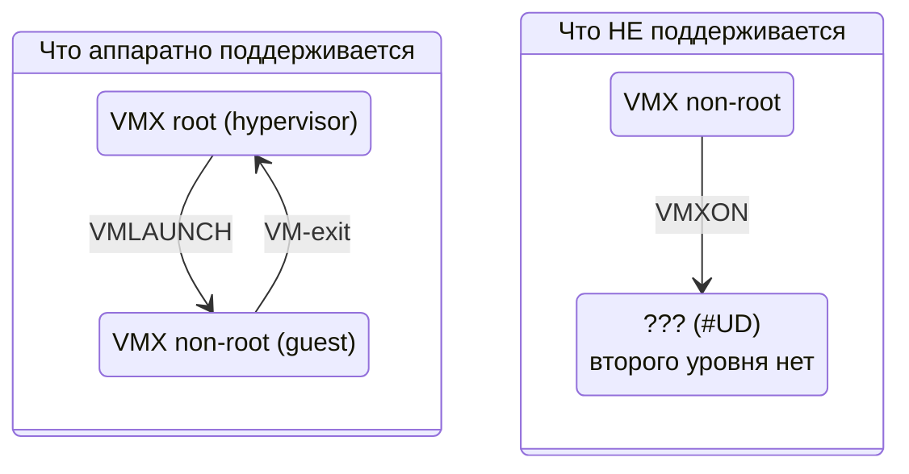
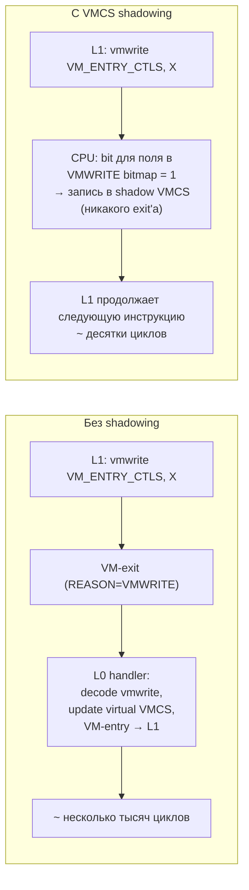
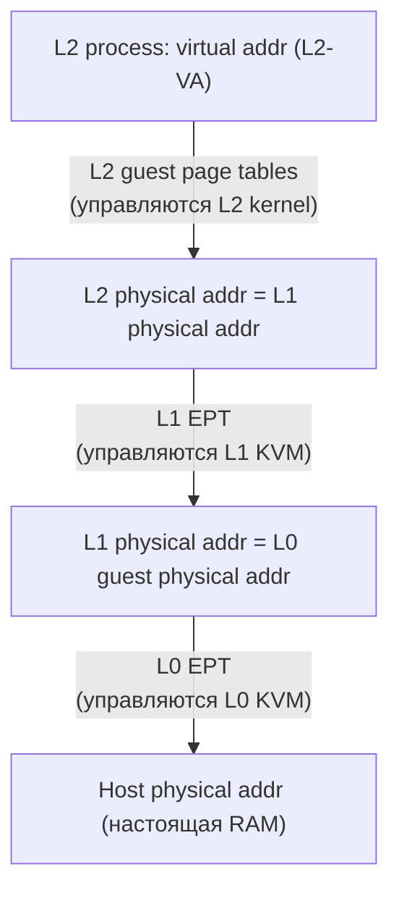
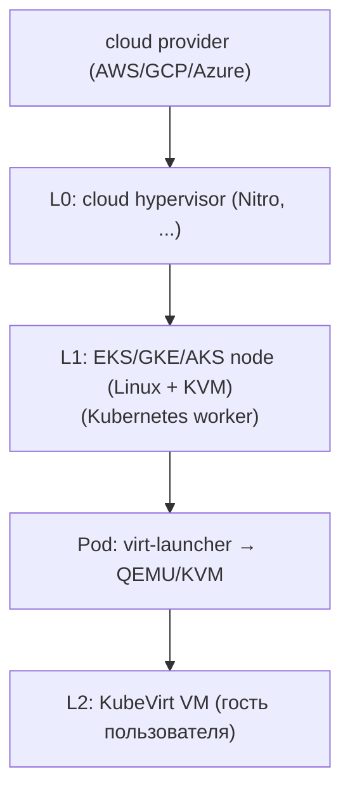

# Nested virtualization: VM внутри VM

Nested virtualization — это запуск hypervisor'а внутри гостевой VM, которая сама исполняется поверх другого
hypervisor'а.
Гость теперь видит CPU с включёнными VMX/SVM, запускает свой KVM/Hyper-V/ESXi и поднимает собственные VM. Идея кажется
рекурсивной, но аппаратно поддерживается ровно на одном уровне «второго порядка»: ни Intel VT-x, ни AMD-V не умеют
исполнять `VMXON` в non-root mode напрямую. Чтобы трюк работал, hypervisor нижнего уровня эмулирует VMX-инструкции
для гостя, превращая гостевые VM-control structures в реальные.

Зачем это нужно? В первую очередь — потому что современный cloud сам построен поверх виртуализации, а внутри cloud
тоже хочется поднимать VM: запускать KubeVirt в кластере, который сам arend'ован в EKS; тестировать релизы hypervisor'а
в CI без отдельной железной фермы; запускать VirtualBox/VMware Workstation внутри cloud VDI. Без nested все эти
сценарии требовали bare metal.

## L0/L1/L2 терминология

Конвенция, прижившаяся в KVM-сообществе и в Intel SDM:



- **L0** — bare-metal hypervisor. Это единственный уровень, у которого CPU реально находится в VMX root mode. L0
  владеет настоящими VMCS, EPT, IOMMU.
- **L1** — гостевая ОС L0, которая сама является hypervisor. С её точки зрения, она в Ring 0 на «настоящем» железе и
  имеет право выполнять `VMXON`, `VMLAUNCH`, программировать VMCS. На самом деле каждая такая инструкция вызывает
  VM-exit в L0, который её эмулирует.
- **L2** — гость L1. Это обычная VM, не знающая, что находится внутри nested-стека. Все её VM-exit'ы аппаратно идут
  в L0, который должен решить: обработать самому или передать L1 (через injection VM-exit'а в L1).

## Почему это сложно

Архитектура VT-x по дизайну однослойная: CPU в любой момент находится либо в VMX root mode (hypervisor), либо в VMX
non-root mode (guest). Инструкция `VMXON` в non-root mode вызывает `#UD` (invalid opcode) — никакой второй вложенной
VMX-сессии в железе нет.



Чтобы L1 поверил, что у него есть VMX, L0 должен:

1. **Декодировать VMX-инструкции L1** на лету. При попытке L1 выполнить `VMLAUNCH` — VM-exit в L0, L0 читает структуру,
   которую L1 хочет запустить, и преобразует её в реальный VMCS, в котором уже L0 запустит L2 напрямую.
2. **Поддерживать «теневые» VMCS** для каждой пары (L1, L2). При читке L1 поля из VMCS — L0 берёт значение из shadow.
   При записи — L0 обновляет shadow и при следующем `VMLAUNCH` переносит изменения в реальный VMCS.
3. **Маршрутизировать VM-exit'ы**: VM-exit от L2 идёт в L0, но семантически часть из них принадлежит L1 (например,
   guest пытался выполнить `RDMSR` — L1 хотел это обработать). L0 решает: handle locally или **inject** VM-exit в L1
   (поставить L1 в режим обработки своего guest exit'а).

Без оптимизаций каждое чтение поля VMCS из L1 — это VM-exit в L0, каждая запись — VM-exit. Hypervisor читает/пишет
десятки полей на VM-entry/exit, и nested стек становится в 10× медленнее single-level.

## VMCS shadowing (Intel)

С Haswell Intel добавил аппаратную поддержку **VMCS shadowing**. Идея: L0 разрешает L1 напрямую читать/писать
определённый набор полей в shadow VMCS, не вызывая VM-exit. CPU сам делает доступ через separate VMCS pointer.



Управление shadowing'ом:

| Структура VMCS field            | Назначение                                     |
|---------------------------------|------------------------------------------------|
| `VMREAD_BITMAP_ADDR`            | bitmap 4 KB, биты — какие поля L1 может читать |
| `VMWRITE_BITMAP_ADDR`           | bitmap 4 KB, биты — какие поля L1 может писать |
| `VMCS_LINK_POINTER`             | указатель на shadow VMCS, доступную L1         |
| Secondary processor ctrl bit 14 | `enable VMCS shadowing` master switch          |

KVM включает shadowing для «горячих» полей (например, `GUEST_RIP`, `GUEST_RSP`, `VM_EXIT_REASON`), а на остальное
оставляет старый exit-based путь. Эффект — nested KVM ускоряется в 2-5× на CPU-intensive нагрузках.

## Nested SVM (AMD)

AMD реализовал nested виртуализацию архитектурно проще, чем Intel. SVM с самого начала закладывал поле `VMCB` (Virtual
Machine Control Block) как struct в обычной памяти гостя, без отдельных `VMREAD/VMWRITE` инструкций — L1 hypervisor
просто пишет в struct, потом делает `VMRUN`. L0 на каждый `VMRUN` от L1 перехватывает, читает гостевой VMCB и
конструирует собственный VMCB, который запускает уже от лица L0.

Преимущество: нет VM-exit на каждую запись поля — L1 пишет в memory без overhead. Недостаток: на каждое реальное
переключение в L2 L0 делает полный «merge» двух VMCB, что само по себе несколько тысяч циклов. На большинстве workload
nested SVM сравним по производительности с Intel VMCS shadowing.

## Nested EPT

Под L2 нужно ещё одно отображение GVA → HPA, но теперь через **три** уровня page tables:



L0 не может просто сказать MMU «делай 3 walk'а» — hardware поддерживает только 2-dimensional walk (guest PT + EPT). L0
вынужден **композировать** EPT L1 и свою EPT в один merged EPT, который и подаётся CPU как «реальный» EPT для исполнения
L2:

```
Composition:

  L1_EPT:  L1-PA  ──▶  L0-guest-PA
  L0_EPT:  L0-guest-PA  ──▶  HPA

  merged:  L1-PA  ──▶  HPA  (для каждой записи в L1_EPT композирует через L0_EPT)
```

L0 поддерживает merged EPT лениво: при первом обращении L2 к странице — EPT violation, L0 строит соответствующую
запись в merged EPT, разрешает доступ. При изменении L1_EPT (L1 вызывает свой `INVEPT`) — L0 инвалидирует
соответствующую часть merged EPT и пересобирает.

Worst case page walk для L2: на каждом из 4 уровней guest PT нужно прочитать запись, чей адрес — L2-PA, который надо
протранслировать через merged EPT. Сам merged EPT — тоже 4 уровня, каждый из которых сам по себе — двухуровневая
композиция. В худшем случае это 4 × 4 × 4 = 64 шага по памяти на один TLB miss. На практике большую часть гасит TLB и
caching merged-EPT, но фундаментально nested page walk дороже non-nested в разы.

## Включение nested

На Linux nested включается через module parameter KVM-модуля.

```bash
# Intel
echo "options kvm-intel nested=1" > /etc/modprobe.d/kvm-nested.conf
modprobe -r kvm-intel && modprobe kvm-intel
cat /sys/module/kvm_intel/parameters/nested      # Y

# AMD
echo "options kvm-amd nested=1" > /etc/modprobe.d/kvm-nested.conf
modprobe -r kvm-amd && modprobe kvm-amd
cat /sys/module/kvm_amd/parameters/nested        # 1
```

В Linux 5.x и новее nested включён по умолчанию для обеих платформ. Чтобы L1 увидел VMX/SVM в своём CPU, QEMU должен
прокинуть соответствующий feature flag:

```bash
qemu-system-x86_64 \
    -enable-kvm \
    -cpu host \             # пробрасывает все capabilities, включая vmx/svm
    -m 8G -smp 4

# Внутри L1:
grep -E 'vmx|svm' /proc/cpuinfo    # должно быть видно
```

Без `-cpu host` (например, `-cpu qemu64`) VMX в L1 не появится — гостевой CPU model его не включает.

## Performance penalties

Каждый уровень nested добавляет overhead. Реальные числа на Skylake-class CPU, типичный workload:

| Уровень | Latency syscall   | Throughput memcpy | I/O latency (virtio-net) |
|---------|-------------------|-------------------|--------------------------|
| L1      | ~1.05× от bare    | ~98% от bare      | ~110% от bare            |
| L2      | ~1.5–2.0× от bare | ~85–95% от bare   | ~150–200% от bare        |

Worst case для L2 — workload с большим количеством VM-exit'ов: heavy syscall, частые IPI между vCPU, активная I/O без
SR-IOV. Best case — CPU-bound вычисления с малым working set: nested практически бесплатен (TLB ловит).

Главные источники overhead'а L2:

- **Nested EPT misses.** Cache miss → walk через два уровня EPT, дороже single-level в 4-8×.
- **Injected VM-exits.** Каждый exit от L2, который L1 хочет обработать, требует двух переключений: L2 → L0 → L1 → L2.
- **Эмуляция VMX-инструкций**, которые не покрыты shadowing (например, `INVVPID` всегда exit).

## Use cases в production

| Платформа          | Поддержка nested                                                   |
|--------------------|--------------------------------------------------------------------|
| Google Cloud (GCE) | enabled для всех instance types, документировано, используется для |
|                    | GKE on-prem testing, Anthos                                        |
| AWS EC2            | disabled на большинстве instance types; включена на bare metal     |
|                    | (`m5.metal`, `c5.metal` и пр.), там же запускают свои hypervisor'ы |
| Azure              | enabled для Dv3/Ev3 и новее (с Skylake), используется для Windows  |
|                    | Hyper-V containers, WSL2 в VM                                      |
| Oracle Cloud OCI   | enabled на bare metal и selected VM shapes                         |
| DigitalOcean       | disabled                                                           |
| Hetzner Cloud      | enabled (CX/CPX/CCX серии)                                         |

AWS долго избегал nested из соображений безопасности (площадь атаки на Nitro hypervisor), и до сих пор для serverless
workload'ов рекомендует bare-metal instance + Firecracker, а не nested KVM.

## KubeVirt и cloud-in-cloud

KubeVirt — Kubernetes-нативный способ запуска VM как обычных pods: pod содержит контейнер `virt-launcher`, который
поднимает QEMU/KVM с гостевой VM. Если сам Kubernetes-кластер исполняется внутри cloud (EKS, GKE, AKS), то QEMU
запускается уже внутри VM cloud-провайдера — это classic nested-сценарий.



Без nested поддержки provider'ом — KubeVirt падает на этапе `KVM_CREATE_VM`: ioctl возвращает ENOTSUP, потому что
гостевой kernel L1 видит CPU без VMX. Именно поэтому KubeVirt на AWS работает только на metal instance types.

## Связанные темы

- [Виртуализация: основы](foundations.md) — VT-x, VMX root/non-root, VMCS
- [Виртуализация памяти](memory_virtualization.md) — EPT и почему её композиция в nested стоит так дорого
- [Виртуализация CPU](cpu_virtualization.md) — VM-exit/entry, VMCS поля
- [KVM API](kvm_api.md) — `KVM_CAP_NESTED_STATE` для миграции nested VM
- [Live migration](live_migration.md) — особенности миграции L1 с активными L2

## Источники

- [Intel SDM, Vol 3C, Chapter 25: Virtual Machine Control Structures](https://www.intel.com/sdm) — VMCS shadowing fields
- [AMD64 Architecture Programmer's Manual, Vol 2, Chapter 15: Secure Virtual Machine](https://www.amd.com/system/files/TechDocs/24593.pdf) —
  Nested SVM
- [The Turtles Project: Design and Implementation of Nested Virtualization](https://www.usenix.org/legacy/event/osdi10/tech/full_papers/Ben-Yehuda.pdf) —
  оригинальная статья IBM Research, 2010
- [KVM Forum: Nested virtualization in KVM](https://www.linux-kvm.org/page/Nested_Guests)
- `modinfo kvm_intel | grep nested`, `modinfo kvm_amd | grep nested`
