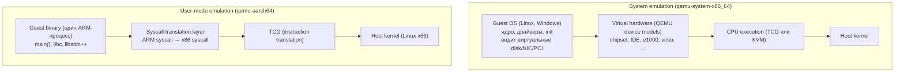
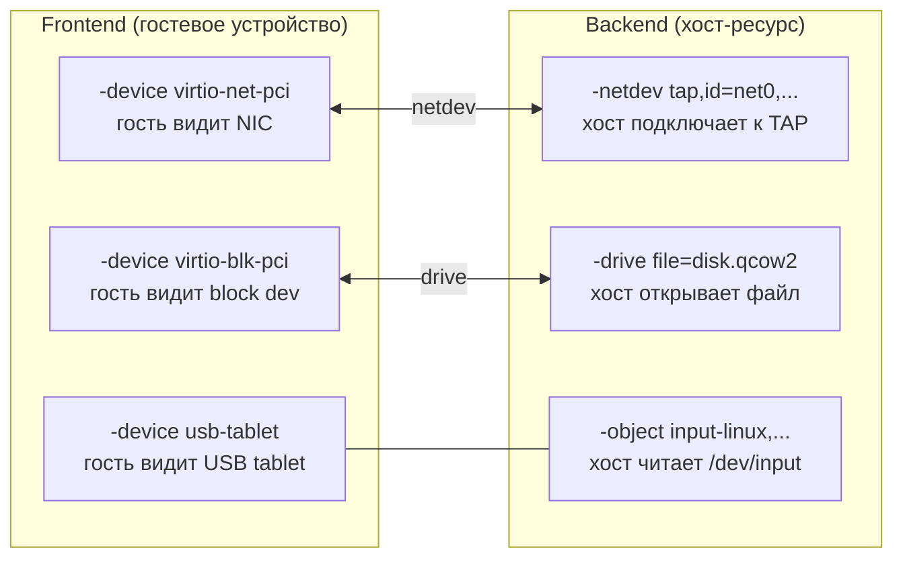
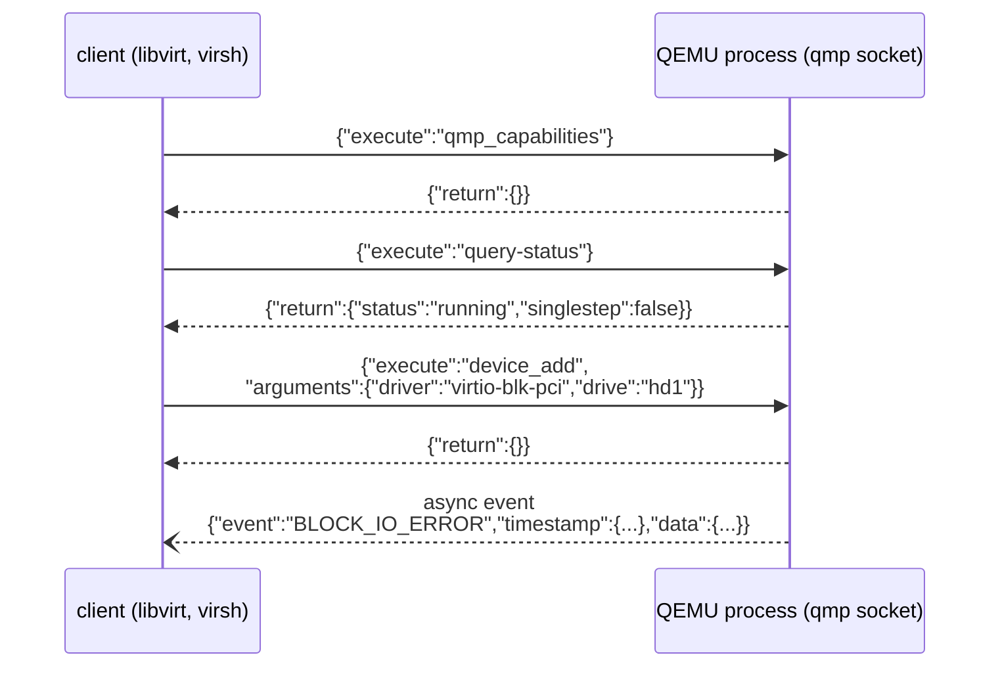
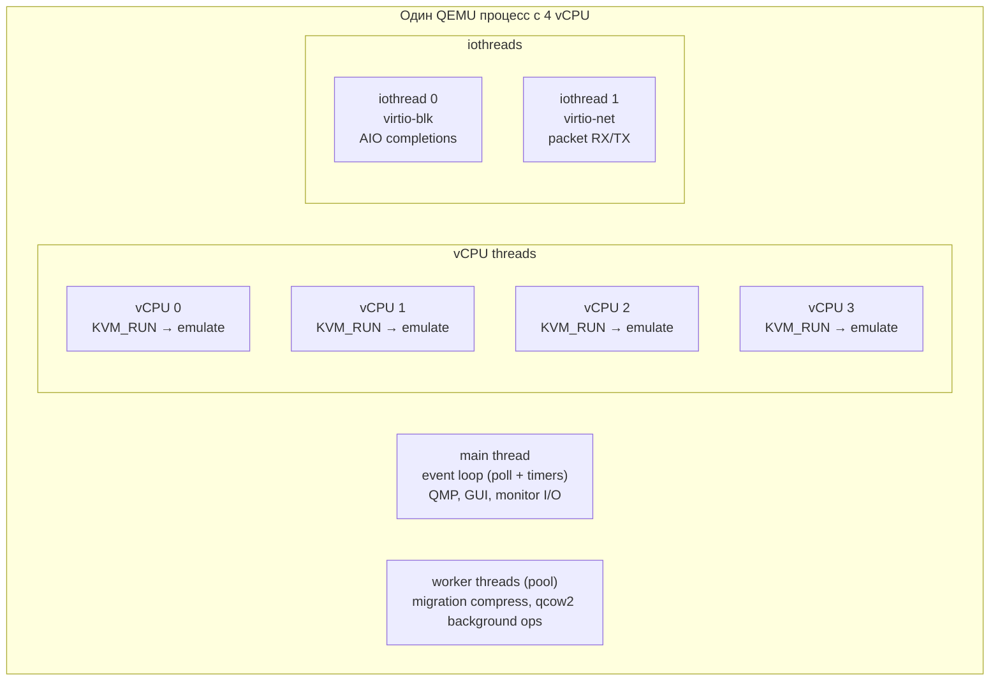
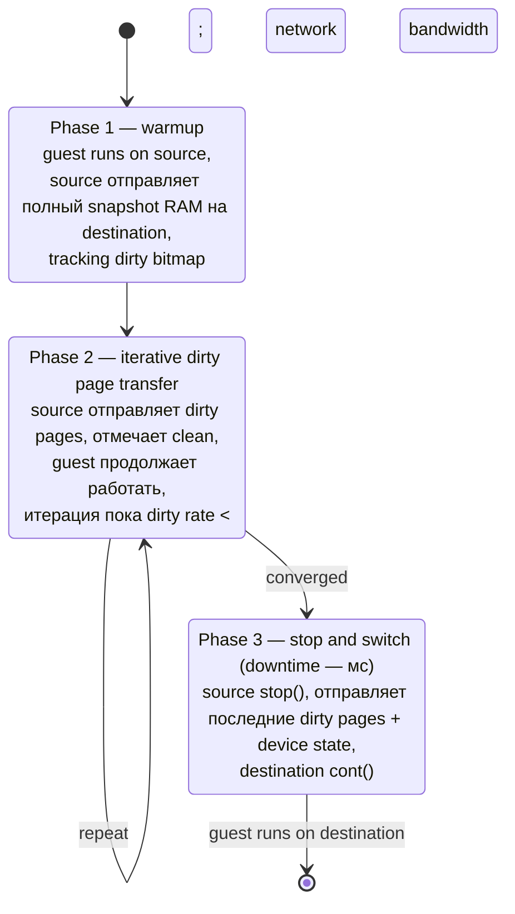
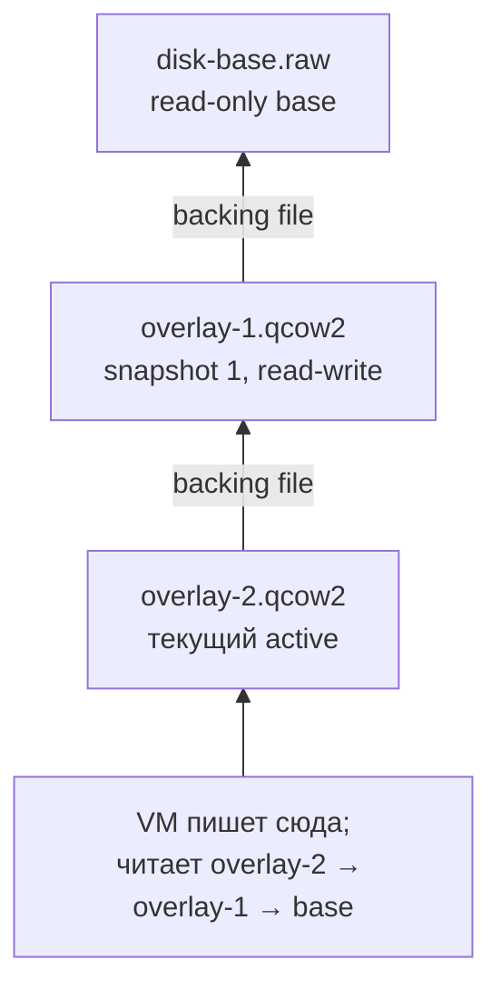

# QEMU изнутри: TCG, device models, QMP

QEMU — это одновременно эмулятор и виртуализатор. Без аппаратной поддержки виртуализации он берёт каждую гостевую
инструкцию и **переводит** её в инструкции хоста. С KVM он отдаёт исполнение CPU в guest mode, а сам остаётся
ответственным только за устройства: контроллеры дисков, сетевые карты, чипсет, шины. Эта двойственность определяет
всю архитектуру: модули могут работать в обоих режимах, потому что устройство не знает, как именно гость крутит код.

Проект начат Fabrice Bellard в 2003 году. Сейчас это де-факто стандартный backend для KVM на Linux, для Xen в
HVM-режиме,
для Hyperkit на macOS и для пользовательской эмуляции в Android Studio, Wine и многих других системах.

## System и user-mode emulation

QEMU собирается двумя независимыми наборами бинарей:

| Режим               | Бинарь                                      | Назначение                                                        |
|---------------------|---------------------------------------------|-------------------------------------------------------------------|
| System emulation    | `qemu-system-x86_64`, `qemu-system-aarch64` | полный виртуальный компьютер: CPU + RAM + устройства              |
| User-mode emulation | `qemu-x86_64`, `qemu-aarch64`, `qemu-arm`   | запуск одного процесса foreign arch через transparent translation |

В system emulation QEMU поднимает целую машину. Внутри неё стартует BIOS/UEFI, грузится ядро, инициализируются
устройства — гость видит обычный PC или ARM board. Это режим, в котором запускаются виртуальные машины: KVM-гости,
тесты ядра, образы для CI.

User-mode emulation работает иначе. QEMU подменяет собой `binfmt_misc` обработчик: когда Linux пытается запустить
ELF-бинарь чужой архитектуры, ядро через `/proc/sys/fs/binfmt_misc/` отдаёт его QEMU, который транслирует инструкции
и пробрасывает syscalls в хостовое ядро через свою таблицу преобразований. Так ARM-бинарь запускается на x86 без
полноценной VM. Этот режим используется в Docker `--platform=linux/arm64` на Intel-машинах, в кросс-сборке через
schroot, в Wine + QEMU для запуска x86-Windows приложений на ARM.



## TCG: Tiny Code Generator

TCG — это JIT, переводящий гостевые инструкции в инструкции хоста через промежуточное представление. Он включается
автоматически, если KVM недоступен (например, гость — ARM на x86-хосте) или если запрошено `-accel tcg` явно.

Преобразование происходит блоками — translation blocks (TB). Блок начинается на инструкции, до которой можно прыгнуть
(после branch, после системного вызова, в точке входа в функцию), и заканчивается на следующей branch-инструкции.
Для каждого блока TCG проходит три фазы:

1. **Frontend** — парсит N гостевых инструкций, конвертирует их в TCG ops (внутренний RISC-like IR из ~150 операций:
   `add_i64`, `ld32u`, `brcond_i32`, `mov_i64` и т.д.). На этом этапе теряются особенности guest ISA — дальше всё
   универсально.
2. **Optimizer** — упрощает IR: dead-code elimination, constant propagation, копирование регистров. Слабее, чем
   у LLVM, но и компилирует за микросекунды.
3. **Backend** — генерирует машинный код хоста из IR. По одному backend на хост-архитектуру: `tcg/i386/`,
   `tcg/aarch64/`, `tcg/riscv/`.

```
Guest x86 code                  TCG ops (IR)                      Host ARM code
                                                                  (выполнится напрямую)
mov rax, [rbx+8]   ─────────▶   ld_i64 tmp0, env, rbx_off    ─▶   ldr x0, [x28, #rbx_off]
add rax, rcx                    ld_i64 tmp1, tmp0, $8             ldr x1, [x0, #8]
                                ld_i64 tmp2, env, rcx_off         ldr x2, [x28, #rcx_off]
                                add_i64 tmp3, tmp1, tmp2          add x3, x1, x2
                                st_i64 tmp3, env, rax_off         str x3, [x28, #rax_off]
```

Результат — машинный код хоста — кладётся в **translation block cache** (по умолчанию 1 GB, настраивается
`-tb-size`). При повторном входе в тот же блок код берётся из кэша. Соседние блоки связываются прямыми переходами
(chaining), чтобы избежать возврата в диспетчер на каждой границе.

```
Translation block cache (RWX-регион в QEMU)
┌─────────────────────────────────────────────────────────────┐
│  TB[guest 0x400520]   xor rax,rax; mov rcx,5; jmp ...       │
│                       скомпилировано в host-код             │
│                       <native host instructions>            │
│                       jump → TB[guest 0x400540]   ─┐        │
├────────────────────────────────────────────────────┼────────┤
│  TB[guest 0x400540]   cmp rcx,0; je 0x400560     ◀─┘        │
│                       <native host instructions>            │
│                       cond jump → TB[0x400560] or [0x400548]│
└─────────────────────────────────────────────────────────────┘
```

Производительность TCG — порядка 10–100× медленнее native, в зависимости от типа нагрузки. Целочисленная арифметика
переводится почти оптимально, но floating-point и SIMD требуют эмуляции через хостовые инструкции с проверками
исключений — тут потери максимальные. KVM-режим даёт практически нативную скорость, потому что гостевой CPU исполняется
прямо на железе с переключением контекста только на VM-exit (когда нужно эмулировать устройство или обработать
привилегированную инструкцию).

Подходы TCG родственны Rosetta 2 от Apple: тот тоже транслирует x86-64 в ARM64, но делает это AOT (заранее, при первой
загрузке бинаря) и кэширует результат на диск. TCG же работает только JIT и кэш живёт пока процесс QEMU не завершится.

## Машинные типы

Machine type определяет «материнскую плату» виртуального компьютера: какой chipset, какие шины, как разложены legacy
устройства, какие версии ACPI-таблиц. От него зависит, что гость увидит при перечислении PCI или при инициализации
прерываний.

| Machine type      | Chipset        | Bus         | Назначение                                         |
|-------------------|----------------|-------------|----------------------------------------------------|
| `pc-i440fx-<ver>` | Intel 440FX    | PCI         | классический PC, совместим со старыми guest OS     |
| `q35`             | Intel Q35      | PCIe        | современный PC, поддержка PCIe, ICH9, IOMMU        |
| `microvm`         | минимальный    | virtio-mmio | container-like VM: без PCI, без ACPI, быстрый boot |
| `virt`            | ARM virt board | PCIe        | стандартная board для ARM64, KVM и TCG             |
| `none`            | без устройств  | —           | bare-metal firmware, кастомные тесты               |

Версии machine type (`pc-i440fx-7.2`, `pc-i440fx-8.0`) фиксируют ABI: одни и те же устройства, те же device IDs,
тот же layout. Это критично для live migration — migration с QEMU 7.2 на 8.0 возможен только если на обеих сторонах
указан один machine type.

`microvm` появился в QEMU 4.0 как ответ на AWS Firecracker. Идея: для контейнеро-подобных VM не нужен PCI, BIOS,
legacy serial — только virtio-mmio для I/O и прямая загрузка ядра. Boot такой машины занимает ~50 мс против ~3 с
у полноценного `q35`.

## Device models

QEMU моделирует устройства как обычные C-объекты с виртуальными методами через QOM (QEMU Object Model). Каждое
устройство наследуется от `DeviceState`, имеет свои `realize` (создание), `reset`, `vmstate` (для миграции),
обработчики MMIO и PIO.

Полный список — сотни устройств. Ключевые семейства:

| Категория | Модели                                                        |
|-----------|---------------------------------------------------------------|
| Chipset   | i440FX, Q35, ICH9, PIIX3/4                                    |
| Сеть      | e1000, e1000e, rtl8139, vmxnet3, virtio-net                   |
| Storage   | IDE, AHCI, NVMe, virtio-blk, virtio-scsi, megasas, lsi53c895a |
| USB       | UHCI, EHCI, XHCI                                              |
| Display   | std VGA, Cirrus, QXL, virtio-gpu                              |
| Audio     | AC97, Intel HDA, sb16, ES1370                                 |
| Serial    | 16550 UART, PL011 (ARM), CMSDK UART                           |
| Interrupt | i8259 (PIC), I/O APIC, LAPIC, GIC (ARM)                       |
| Timer     | i8254 (PIT), HPET, RTC                                        |

Эмуляция, например, `e1000`, реализована в `hw/net/e1000.c`: когда гость пишет в один из BAR-регистров карты, QEMU
ловит это через MMIO handler, обновляет внутреннее состояние модели, при необходимости отправляет пакет в TAP-интерфейс
хоста. Каждый PIO/MMIO access — это VM-exit, обработка в QEMU, возврат в guest. Для e1000 это сотни exit'ов на пакет —
поэтому существует virtio-net (см. отдельную статью).

### Frontend и backend

Конфигурация устройств в QEMU разделена на **frontend** (то, что видит гость) и **backend** (то, что использует хост):



Эта разделимость позволяет переключать backend без изменения guest-конфигурации: один и тот же `virtio-net` гость
может получать пакеты из TAP, из user-mode SLIRP, из vhost-net в ядре или из DPDK через vhost-user. Гостевая ОС
ничего не знает.

CLI-флаги отражают эту структуру:

- `-machine q35,accel=kvm` — выбор machine type и акселератора
- `-cpu host` — какой CPU показать гостю (`host` = passthrough хост-флагов)
- `-smp 4,sockets=1,cores=4,threads=1` — топология
- `-m 4G` — объём RAM
- `-drive file=disk.qcow2,if=none,id=hd0` — backend (файл на хосте)
- `-device virtio-blk-pci,drive=hd0` — frontend (как гость видит диск)
- `-netdev tap,id=n0,ifname=tap0,script=no` — backend сети
- `-device virtio-net-pci,netdev=n0` — frontend сети

## QMP: QEMU Machine Protocol

QMP — JSON-протокол управления уже запущенным QEMU-процессом. Открывается на Unix-сокете флагом
`-qmp unix:/tmp/qmp.sock,server,nowait`. Через него управляют миграцией, снапшотами, hotplug устройств, мониторингом
гостя — всё, что не статика командной строки.



Сессия всегда начинается с `qmp_capabilities` — handshake, активирующий протокол. Дальше клиент шлёт команды,
QEMU отвечает синхронно. Параллельно прилетают асинхронные **events** (`BLOCK_IO_ERROR`, `RESET`,
`MIGRATION`, `NIC_RX_FILTER_CHANGED`) — они не имеют id и могут прийти в любой момент.

Список ключевых команд:

| Команда                     | Назначение                              |
|-----------------------------|-----------------------------------------|
| `query-status`              | состояние гостя (running, paused, ...)  |
| `query-cpus-fast`           | список CPU и их состояние               |
| `query-memory-size-summary` | сводка по RAM                           |
| `stop` / `cont`             | пауза и продолжение исполнения          |
| `system_reset`              | reset гостя (как кнопка)                |
| `device_add` / `device_del` | hotplug PCI/USB устройств               |
| `migrate`                   | начать live migration на указанный URI  |
| `migrate-set-parameters`    | настройки миграции (max-bandwidth, ...) |
| `snapshot-save`             | snapshot всей VM в qcow2                |
| `block_resize`              | расширить диск налету                   |
| `human-monitor-command`     | выполнить HMP-команду через QMP         |

Libvirt — самый известный пользователь QMP. Когда вы делаете `virsh start vm`, libvirtd запускает QEMU с QMP-сокетом
и через него управляет машиной всю её жизнь. UI вроде virt-manager или Cockpit — это всё клиенты libvirt, который,
в свою очередь, — клиент QMP.

### HMP

HMP (Human Monitor Protocol) — текстовый предшественник QMP, рассчитанный на интерактивное использование. Включается
флагом `-monitor stdio` или `-monitor unix:/tmp/hmp.sock,server,nowait`. В HMP-консоли вводятся команды напрямую:

```
(qemu) info status
VM status: running

(qemu) info pci
  Bus  0, device   0, function 0:
    Host bridge: PCI device 8086:29c0
      ...

(qemu) device_add usb-mouse,id=mouse1
(qemu) info usb
  Device 0.2, Port 1, Speed 12 Mb/s, Product QEMU USB Mouse
```

Внутри HMP уже давно реализован поверх QMP: команды парсятся, конвертируются в JSON, отправляются в QMP-обработчик.
HMP остаётся как удобный способ дебага без написания клиента, но программно всегда используется QMP.

## Накопители: форматы образов

QEMU поддерживает десяток форматов дисков. Самые важные:

| Формат  | Особенности                                                                  |
|---------|------------------------------------------------------------------------------|
| `raw`   | сырой блочный образ, размер на диске = размер диска; самый быстрый           |
| `qcow2` | QEMU Copy-on-Write v2: thin provisioning, snapshots, compression, encryption |
| `vhdx`  | Microsoft Hyper-V                                                            |
| `vmdk`  | VMware                                                                       |
| `vdi`   | VirtualBox                                                                   |

`qcow2` — формат по умолчанию для большинства задач. Файл начинается с header'а, дальше идёт двухуровневая таблица
трансляции от логических смещений в гостевом диске к физическим смещениям в файле:

```
qcow2 file layout
┌──────────────────────────────────────────────────────────┐
│ header (magic 'QFI\xfb', version, размеры кластеров)     │
├──────────────────────────────────────────────────────────┤
│ L1 table (массив указателей на L2 tables)                │
├──────────────────────────────────────────────────────────┤
│ L2 table[0]   ──▶  data cluster offsets                  │
│ L2 table[1]                                              │
│ ...                                                      │
├──────────────────────────────────────────────────────────┤
│ refcount table (для snapshots: сколько ссылок на кластер)│
├──────────────────────────────────────────────────────────┤
│ data clusters (по умолчанию 64 KB каждый)                │
│   ┌────────────┬────────────┬────────────┐               │
│   │  cluster 0 │  cluster 1 │  cluster 2 │ ...           │
│   └────────────┴────────────┴────────────┘               │
└──────────────────────────────────────────────────────────┘
```

Гостевой запрос на чтение sector 1000 проходит так: индекс L1 → найти L2 → индекс L2 → найти offset кластера →
прочитать сектор внутри кластера. Если L2-entry пустая, на диске этого кластера нет, гость получает нули
(thin provisioning).

Snapshots в qcow2 устроены на refcount: при snapshot все кластеры получают refcount += 1, при write в кластер с
refcount > 1 копируется новый кластер (copy-on-write на уровне образа), refcount исходного уменьшается. Snapshot
снимается через `qemu-img snapshot -c name disk.qcow2` или через QMP `snapshot-save`. Полный snapshot VM
(memory + devices + disk) делается через QMP `savevm` — состояние RAM пишется внутрь qcow2 как специальный кластер.

```bash
# qemu-img основные команды
qemu-img create -f qcow2 disk.qcow2 20G       # пустой образ 20 GB (thin)
qemu-img convert -O raw disk.qcow2 disk.raw   # конвертация форматов
qemu-img info disk.qcow2                      # информация (snapshots, размер)
qemu-img snapshot -c base disk.qcow2          # снэпшот внутри образа
qemu-img check disk.qcow2                     # проверка целостности
```

## Полный путь от CLI до boot

Запуск типичной VM показывает, как складываются все части:

```bash
qemu-system-x86_64 \
    -machine q35,accel=kvm \                     # Q35 chipset, KVM accelerator
    -cpu host -smp 4 -m 8G \                     # 4 vCPU, 8 GB RAM
    -drive file=disk.qcow2,if=none,id=hd0 \      # backend: qcow2 файл
    -device virtio-blk-pci,drive=hd0 \           # frontend: virtio-blk
    -netdev tap,id=n0,ifname=tap0,script=no \    # backend: TAP-интерфейс
    -device virtio-net-pci,netdev=n0 \           # frontend: virtio-net
    -display gtk \                               # окно GTK для VGA
    -qmp unix:/tmp/qmp.sock,server,nowait \      # QMP сокет для управления
    -monitor stdio                               # HMP в текущем терминале
```

Что происходит при запуске:

1. QEMU парсит CLI, создаёт `MachineState` для `q35`
2. Инициализирует RAM 8 GB, KVM создаёт `KVM_VM` и `KVM_VCPU` через ioctls
3. Загружает SeaBIOS (по умолчанию) в начало адресного пространства
4. Регистрирует все `-device` через QOM (`virtio-blk-pci`, `virtio-net-pci`, ...)
5. Открывает QMP-сокет и HMP-консоль
6. KVM `KVM_RUN` запускает vCPU в guest mode
7. SeaBIOS инициализирует, находит загрузочный диск (virtio-blk), запускает bootloader
8. Стартует guest OS, видит virtio-устройства, грузит драйверы

С момента `KVM_RUN` QEMU большую часть времени спит. Каждый VM-exit возвращает управление в QEMU только для эмуляции
device access, прерываний, MMIO/PIO в эмулируемые регионы. Всё остальное (арифметика, переходы, обычные load/store
в RAM) исполняется на железе с нативной скоростью.

## Threading model

QEMU — многопоточная программа. Когда запускается VM с N vCPU, в процессе QEMU создаётся:

- **Main thread** — обрабатывает QMP, HMP, GTK GUI events, таймеры, async I/O completions
- **vCPU threads** — по одному на каждый vCPU. Цикл: `ioctl(KVM_RUN)` → возврат на VM-exit → обработка → снова `KVM_RUN`
- **iothread** (опционально) — выделенный поток для virtio backend'ов; снимает нагрузку с main thread
- **RCU thread** — для read-copy-update структур
- **Worker pool** — для блокирующих операций (compression при миграции, AIO complete)



vCPU threads и main thread синхронизируются через **BQL** (Big QEMU Lock, исторически qemu_global_mutex). Когда vCPU
выходит из guest mode и хочет обратиться к эмулируемому устройству, он берёт BQL. Многие device handlers не
реентерабельны
— BQL это обеспечивает.

В современном QEMU BQL постепенно убирается из горячих путей. Iothreads с собственными `AioContext` позволяют virtio
backend'ам работать без главного mutex'а.

## KVM API

QEMU общается с KVM через ioctl на `/dev/kvm`. Базовый flow:

```c
int kvm_fd  = open("/dev/kvm", O_RDWR);
int vm_fd   = ioctl(kvm_fd, KVM_CREATE_VM, 0);
int vcpu_fd = ioctl(vm_fd,   KVM_CREATE_VCPU, 0);

// memory region setup
struct kvm_userspace_memory_region mem = {
    .slot            = 0,
    .guest_phys_addr = 0,
    .memory_size     = 8ULL << 30,        // 8 GB
    .userspace_addr  = (uint64_t)guest_mem
};
ioctl(vm_fd, KVM_SET_USER_MEMORY_REGION, &mem);

// run loop
for (;;) {
    ioctl(vcpu_fd, KVM_RUN, 0);
    switch (run->exit_reason) {
        case KVM_EXIT_IO:    emulate_io(run);   break;
        case KVM_EXIT_MMIO:  emulate_mmio(run); break;
        case KVM_EXIT_HLT:   wait_irq();        break;
        case KVM_EXIT_SHUTDOWN: return;
    }
}
```

Сам QEMU делает то же самое — только обмазано QOM, abstraction layers и device models. KVM экспортирует через ioctls
полный набор примитивов: per-CPU регистры (`KVM_GET_REGS`, `KVM_SET_SREGS`), MSRs, FPU, XSAVE state, событиями
прерываний
(`KVM_INTERRUPT`, `KVM_NMI`).

`ioeventfd` и `irqfd` — оптимизация: вместо «vCPU exit → QEMU handler → write на TAP» QEMU привязывает eventfd к адресу
MMIO; запись по этому адресу автоматически сигналит fd без VM-exit'а в QEMU userspace. Используется vhost-net и virtio
для kick notifications.

## Live migration

QEMU умеет переносить запущенную VM с одного хоста на другой без остановки гостя. Алгоритм называется **pre-copy
live migration** и работает в три фазы:



Управление через QMP:

```json
{
  "execute": "migrate",
  "arguments": {
    "uri": "tcp:dest.example.com:4444"
  }
}
{
  "execute": "query-migrate"
}
→ {
"return": {
"status": "active",
"ram": {"transferred": 1234567890, "remaining": 9876543, ...},
"downtime": 0
}
}
```

Параметры миграции (`migrate-set-parameters`):

| Параметр           | Назначение                               |
|--------------------|------------------------------------------|
| `max-bandwidth`    | байт/с, ограничение нагрузки на сеть     |
| `downtime-limit`   | мс, максимальная пауза в phase 3         |
| `multifd-channels` | количество параллельных TCP-соединений   |
| `compress-level`   | xz/zstd compression для медленных линков |
| `tls-creds`        | encryption миграционного трафика         |

**Post-copy** — альтернативный режим: vm сначала переключается на destination (быстро), а страницы подтягиваются по
требованию через page faults в гость. Минимальный downtime, но риск — если линк падает в середине, гость убит.

Для миграции через CPU c разными extensions нужно `-cpu` совместимый: например, source может иметь AVX-512, destination
— нет. QEMU поддерживает `-cpu host,migratable=on` для автоматической фильтрации.

## Snapshots: внешние и внутренние

QEMU различает два типа snapshots:

- **Internal snapshots** — хранятся внутри qcow2-файла. Делаются через `qemu-img snapshot -c name` или QMP
  `snapshot-save`. Включают device state, RAM (для savevm), отдельные кластеры с CoW. Простые, но привязаны к
  qcow2-формату.
- **External snapshots** — создают новый файл-overlay поверх существующего. Через QMP `blockdev-snapshot-sync`:
  ```json
  {"execute": "blockdev-snapshot-sync",
   "arguments": {"device": "hd0", "snapshot-file": "/path/overlay.qcow2"}}
  ```
  Старый файл становится read-only base, новый — writable overlay. Используется в backup-сценариях: после snapshot
  можно копировать base, не останавливая VM.



`qemu-img rebase` и `qemu-img commit` склеивают цепочки back-to-base.

## RAM allocation: hugepages, memory-backend

По умолчанию QEMU выделяет guest RAM через `malloc` + `MAP_ANONYMOUS` — обычные 4K страницы хоста. Для больших VM это
неэффективно: 64 GB RAM = 16 миллионов pte записей в page tables ядра, TLB miss'ы убивают производительность.

Решение — **HugeTLB pages** или **transparent hugepages**. QEMU явно запрашивает hugepages через `memory-backend-memfd`
или `memory-backend-file`:

```bash
qemu-system-x86_64 \
    -m 64G \
    -object memory-backend-memfd,id=mem,size=64G,hugetlb=on,hugetlbsize=2M \
    -machine memory-backend=mem \
    ...
```

Хост должен иметь зарезервированные hugepages (`echo 32768 > /proc/sys/vm/nr_hugepages` для 64 GB по 2M). При allocation
QEMU получает 32K hugepages вместо 16M обычных, TLB-нагрузка падает в 512 раз.

`memory-backend-file` с `share=on` плюс tmpfs/dax-фс позволяют разделять память между несколькими процессами — это
основа vhost-user.

## Связанные темы

- [virtio: paravirtual I/O](virtio.md) — почему e1000-эмуляция дорога, и как vring решает проблему
- [I/O passthrough: VFIO, IOMMU, SR-IOV](io_passthrough.md) — когда device model не нужен, а железо отдаётся гостю
  целиком
- [Внутреннее устройство контейнеров](../isolation/containers_internals.md) — альтернатива VM с другими trade-off'ами

## Источники

- [QEMU Documentation — qemu.org](https://www.qemu.org/docs/master/)
- [QEMU TCG documentation](https://www.qemu.org/docs/master/devel/tcg.html)
- [QEMU Machine Protocol Wiki](https://wiki.qemu.org/Documentation/QMP)
- [QEMU Object Model](https://www.qemu.org/docs/master/devel/qom.html)
- [qcow2 format spec](https://github.com/qemu/qemu/blob/master/docs/interop/qcow2.txt)
- `man qemu-system-x86_64`, `man qemu-img`
