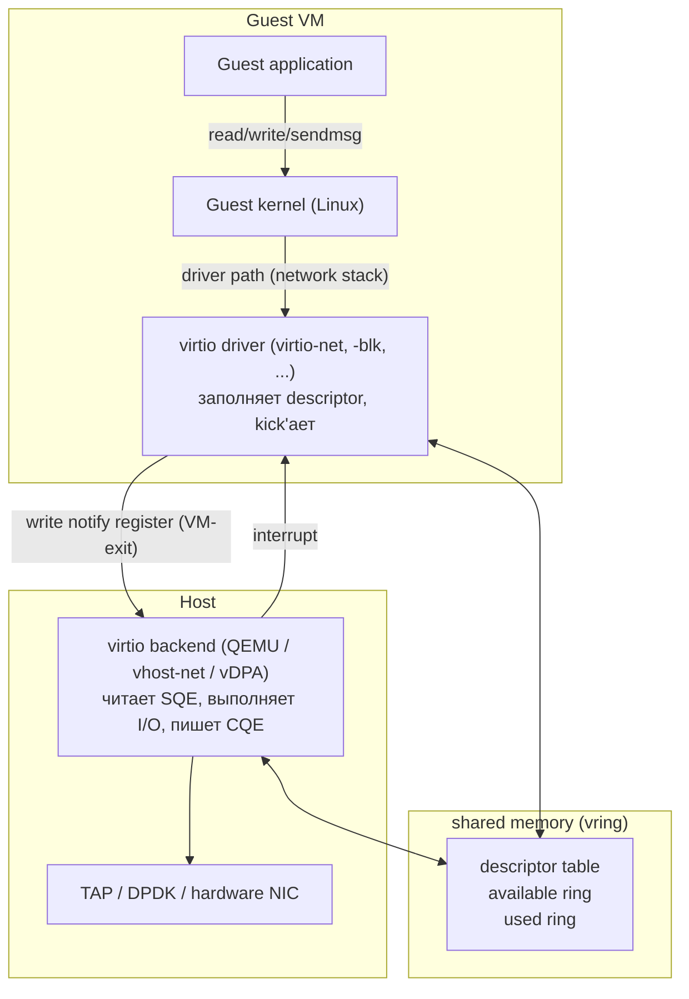
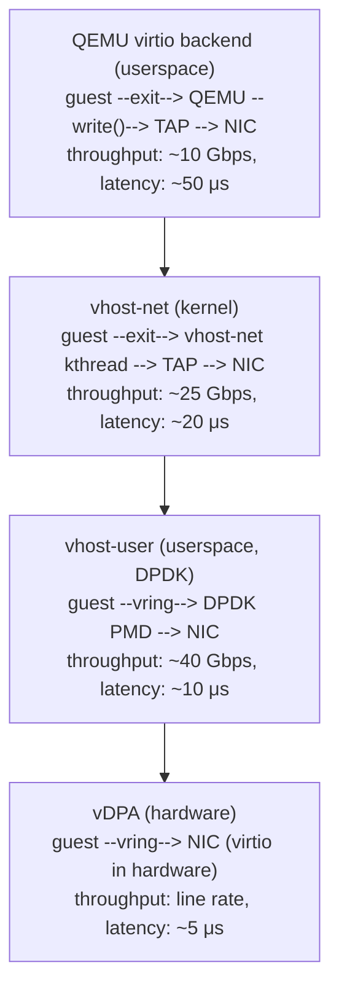
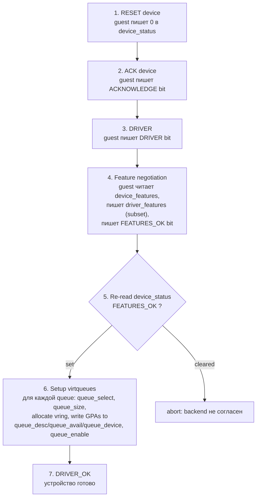

# virtio: paravirtual I/O между гостем и гипервизором

Полная эмуляция железа красива: гость думает, что у него настоящая Intel e1000, использует тот же драйвер, что и на
реальной машине. Но каждый PIO/MMIO access превращается в VM-exit, обработка которого требует сотен наносекунд.
Сетевой пакет в реальной e1000 — это десяток записей в регистры контроллера, и для VM это десяток exit'ов. На скорости
10 Gbps это убивает производительность.

**virtio** — paravirtual альтернатива: гость **знает**, что общается с виртуальной машиной, и использует протокол,
оптимизированный под этот случай. Вместо записи в регистры по байту — общий ring buffer в shared memory. Вместо
прерывания на каждый пакет — батч с одним notify. Драйвер один на всех гипервизоров (KVM, Xen, VMware ESXi, Hyper-V
через virtio-driver-package).

Стандарт создан Rusty Russell в 2008 году, ратифицирован OASIS как virtio 1.0 в 2016, обновлён до 1.1 (packed
virtqueue) в 2019 и до 1.2 в 2022.

## Архитектура

Базовая схема одинакова для любого virtio-устройства:



Три ключевых компонента:

- **Guest driver** — обычный драйвер в гостевом ядре. В Linux это `drivers/virtio/` плюс конкретные модули
  (`virtio_net`, `virtio_blk`, `virtio_scsi`, ...).
- **Vring** — кольцевая структура в памяти гостя, доступная и backend'у. Описывает буферы данных и состояние операций.
- **Backend** — обработчик на стороне хоста. Может быть в userspace (QEMU), в kernel (`vhost-net`), в отдельном
  процессе (`vhost-user` для DPDK), или на железе (vDPA).

Уведомления идут через два минимальных механизма: гость пишет в специальный "kick register" (VM-exit), чтобы сказать
backend'у «есть работа», а backend поднимает прерывание (через ioeventfd/irqfd), чтобы сообщить о завершении. Сами
данные всегда передаются через vring без копий.

## Split virtqueue

В virtio 1.0 каждая virtqueue состоит из трёх отдельных областей. Это **split layout**:

```
Split virtqueue layout
                   ┌──────────────────────────────────────────────────┐
                   │                Descriptor Table                  │
                   │  массив struct vring_desc:                       │
                   │    addr (u64)  ─ guest physical address буфера   │
                   │    len  (u32)  ─ длина буфера                    │
                   │    flags(u16)  ─ WRITE / NEXT / INDIRECT         │
                   │    next (u16)  ─ индекс следующего в цепочке     │
                   │                                                  │
                   │  ┌────┬────┬────┬────┬────┬────┬────┬────┐       │
                   │  │ 0  │ 1  │ 2  │ 3  │ 4  │ 5  │ 6  │ 7  │ ...   │
                   │  └────┴────┴────┴────┴────┴────┴────┴────┘       │
                   └──────────────────────────────────────────────────┘
                              ▲                          ▲
                              │ guest пишет              │ host читает
                              │                          │
                   ┌──────────────────────────┐ ┌──────────────────────────┐
                   │     Available Ring       │ │       Used Ring          │
                   │  guest → host            │ │  host → guest            │
                   │                          │ │                          │
                   │  idx (u16)               │ │  idx (u16)               │
                   │  ring[N] (u16)           │ │  ring[N] {id, len}       │
                   │                          │ │                          │
                   │  «descriptor #X готов»   │ │  «descriptor #X обработан│
                   │                          │ │   и записано N байт»     │
                   └──────────────────────────┘ └──────────────────────────┘
```

Жизненный цикл одного запроса:

1. Гость заполняет один или несколько descriptor'ов в Descriptor Table (например, chain из header'а и payload через
   поле `next`).
2. Гость пишет индекс головы цепочки в Available Ring (`avail.ring[avail.idx % N] = head`) и инкрементирует `avail.idx`.
3. Гость кикает backend (запись в notify register).
4. Backend читает Available Ring, проходит по цепочке descriptor'ов, выполняет операцию.
5. Backend пишет результат в Used Ring (`used.ring[used.idx % N] = {head, written_bytes}`) и инкрементирует `used.idx`.
6. Backend поднимает interrupt в гостя (если interrupts не подавлены через `avail.flags & NO_INTERRUPT`).
7. Гость в обработчике прерывания читает Used Ring, освобождает descriptor'ы.

Поля `idx` обновляются **после** payload-полей с memory barrier (на x86 это smp_wmb, на ARM — dmb). Без барьера
backend мог бы увидеть инкремент `avail.idx` раньше, чем актуальные данные descriptor'а, и обработать мусор.

Между available и used ring есть тонкий момент: они оба индексируются по индексу descriptor head, но это **разные**
кольца с независимыми `idx`. Гость никогда не пишет в Used, backend никогда не пишет в Available — это разрешает
конфликты по cache line (false sharing минимизирован).

## Packed virtqueue

Split layout имеет недостаток: три структуры в разных страницах, плохая cache locality. На каждый запрос — три cache
miss'а. В virtio 1.1 появился **packed virtqueue** (изначально из VMware vmxnet3), где всё сведено в одно кольцо:

```
Packed virtqueue (virtio 1.1+)
                ┌──────────────────────────────────────────────────────┐
                │                  Single Ring                         │
                │  каждый элемент = struct pvirtq_desc:                │
                │    addr (u64)                                        │
                │    len  (u32)                                        │
                │    id   (u16)  ─ buffer id (любой)                   │
                │    flags(u16)  ─ AVAIL/USED биты + WRITE/NEXT        │
                │                                                      │
                │  ┌─────┬─────┬─────┬─────┬─────┬─────┬─────┐         │
                │  │  0  │  1  │  2  │  3  │  4  │  5  │  6  │ ...     │
                │  └─────┴─────┴─────┴─────┴─────┴─────┴─────┘         │
                └──────────────────────────────────────────────────────┘
                      ▲                                ▲
                      │ guest пишет                    │ host пишет
                      │ (AVAIL bit = wrap counter)     │ (USED bit = wrap counter)
                      │                                │
                      │  wrap counter ──┐              │
                      │                 │  flip каждый раз, когда       
                      │                 │  индекс заворачивается        
                      │                 │  в начало кольца              
                      └─────────────────┘                               
```

Вместо двух индексов используется **wrap counter** (1 бит): каждый descriptor содержит бит AVAIL и бит USED. Producer
заполняет descriptor с AVAIL = current_wrap_counter; consumer обрабатывает и ставит USED = current_wrap_counter.
Когда индекс заворачивается через конец кольца, wrap counter инвертируется.

Преимущества:

- Один cache line на descriptor вместо трёх → меньше cache miss
- Лучше для NIC, реализующих virtio в железе (vDPA) — проще DMA-engine
- Меньше memory barrier'ов

Недостаток: сложнее реализация (особенно для multi-producer), не все backend'ы поддерживают (`vhost-net` поддерживает
с Linux 5.0).

## virtio-net

Сетевая карта, самое распространённое virtio-устройство. Минимум две virtqueues:

| Queue                  | Назначение                                                 |
|------------------------|------------------------------------------------------------|
| `rx`                   | гость получает пакеты от хоста                             |
| `tx`                   | гость отправляет пакеты в хост                             |
| `ctrl`                 | control queue: настройки MAC, VLAN, RSS, multiqueue (опц.) |
| `rx[1..N]`, `tx[1..N]` | multi-queue для multi-CPU, по очереди на vCPU              |

Каждый пакет в virtio-net предваряется заголовком `virtio_net_hdr`:

```
struct virtio_net_hdr (10 или 12 байт)
┌──────────────────────────────────────────────────────────┐
│ flags         (u8)   NEEDS_CSUM, DATA_VALID              │
├──────────────────────────────────────────────────────────┤
│ gso_type      (u8)   NONE / TCPv4 / UDP / TCPv6          │
├──────────────────────────────────────────────────────────┤
│ hdr_len       (u16)  длина L2+L3+L4 header'ов            │
├──────────────────────────────────────────────────────────┤
│ gso_size      (u16)  размер MSS для сегментации          │
├──────────────────────────────────────────────────────────┤
│ csum_start    (u16)  offset, где считать checksum        │
├──────────────────────────────────────────────────────────┤
│ csum_offset   (u16)  куда записать checksum              │
├──────────────────────────────────────────────────────────┤
│ num_buffers   (u16)  для mergeable buffers (RX)          │
└──────────────────────────────────────────────────────────┘
```

Заголовок поддерживает **offload'ы**: гость может отдать backend'у TCP-сегментацию (TSO), UDP-фрагментацию, GRO
(generic receive offload). Backend в свою очередь может передать всё это дальше в физическую NIC. Один большой
"superpacket" в 64 KB передаётся одной операцией virtio вместо 45 отдельных MTU-пакетов — это даёт x10 throughput.

**Mergeable buffers** (`VIRTIO_NET_F_MRG_RXBUF`) — приём пакетов: гость выкладывает в RX queue много маленьких
буферов по 2 KB вместо больших по 64 KB. Большой пакет (после GRO на хосте) backend кладёт в N последовательных
буферов, отмечая `num_buffers = N` в первом заголовке. Экономия памяти на гостя.

## virtio-blk и virtio-scsi

**virtio-blk** — самая простая модель блочного устройства. Одна (или несколько для multi-queue) virtqueue. Каждый
request имеет фиксированный формат:

```
virtio-blk request layout (descriptor chain)
┌──────────────────────────┐
│ descriptor 0 (read-only) │  struct virtio_blk_outhdr:
│                          │    type   (u32)  IN / OUT / FLUSH / DISCARD
│                          │    ioprio (u32)
│                          │    sector (u64)  начальный сектор LBA
├──────────────────────────┤
│ descriptor 1..N          │  data buffer:
│ (read или write)         │    для IN: backend пишет данные сюда
│                          │    для OUT: гость кладёт данные
├──────────────────────────┤
│ descriptor last          │  status:
│ (write-only, 1 байт)     │    backend пишет OK/IOERR/UNSUPP
└──────────────────────────┘
```

Сектор всегда 512 байт (legacy compat), даже если backend держит данные на 4K-секторном устройстве — переведутся
внутри backend'а. Размер диска и параметры геометрии гость узнаёт через config space устройства.

**virtio-scsi** — более развитая модель: SCSI-over-virtio. Каждый request — это SCSI command (CDB), что позволяет:

- Hot-plug LUN'ов налету (через control queue)
- SCSI passthrough в физический LUN на хосте — гость видит реальное SCSI-устройство со всеми его особенностями
  (UNMAP, write-same, persistent reservations)
- Один контроллер на много дисков (в virtio-blk каждый диск — отдельное устройство и отдельный PCI-функция)
- Поддержка >256 устройств (PCI лимит)

Большие enterprise-инсталляции используют virtio-scsi; для простоты virtio-blk достаточно.

## virtio-balloon, virtio-fs, virtio-gpu

| Устройство       | Назначение                                                                                              |
|------------------|---------------------------------------------------------------------------------------------------------|
| `virtio-balloon` | динамическое управление RAM гостя: гипервизор «надувает» баллон, гость отдаёт страницы                  |
| `virtio-fs`      | shared filesystem host ↔ guest на базе FUSE-протокола поверх virtio; через DAX данные мапятся без копий |
| `virtio-gpu`     | paravirtual GPU: 2D-операции через простые команды, 3D — через virgl (трансляция OpenGL в host)         |
| `virtio-rng`     | поток случайных байт от хоста (накачка `/dev/random` гостя)                                             |
| `virtio-console` | последовательная консоль через virtqueue (вместо эмуляции 16550 UART)                                   |
| `virtio-input`   | клавиатура, мышь, tablet от хоста                                                                       |
| `virtio-crypto`  | offload crypto-операций в hardware-engine хоста                                                         |
| `virtio-iommu`   | paravirtual IOMMU для nested virtualization                                                             |

`virtio-fs` интересен техникой: метаданные передаются через virtio (FUSE-запросы), а данные файлов мапятся в гостевую
память через DAX и shared memory window — read/write в файл становится обычным memcpy без VM-exit'ов.

## vhost: backend в ядре

Когда backend живёт в QEMU userspace, путь пакета такой:

```
guest network stack → virtio-net driver → vring → VM-exit →
    QEMU userspace → write() в TAP fd → kernel TAP driver →
    bridge → physical NIC
```

Каждый пакет проходит через userspace QEMU с переключением контекста. Под нагрузкой это узкое место.

**vhost-net** (Linux 2.6.34, 2010) выносит обработку virtio в ядро. Когда гость кикает vring, ядро напрямую читает
descriptor'ы и отправляет пакеты в TAP без участия QEMU:

```
guest network stack → virtio-net driver → vring → VM-exit →
    KVM ioeventfd → vhost-net kernel thread → TAP → bridge → NIC
```

QEMU остаётся только для control plane: настройка устройств, миграция. Datapath полностью в ядре. Throughput
повышается в 2–3 раза, latency падает.

### vhost-user: backend в отдельном процессе

Для DPDK и SPDK kernel-режим тоже не подходит — там datapath полностью в userspace с polling-based драйверами.
**vhost-user** (~2014) выносит backend в отдельный userspace-процесс, который общается с QEMU через Unix-сокет и
получает доступ к vring через shared memory:

```
guest → vring (shared с DPDK через mmap) → DPDK app в userspace →
    DPDK NIC driver (PMD) → physical NIC
```

QEMU отдаёт guest memory descriptor через `SET_MEM_TABLE` сообщение, DPDK мапит её к себе и работает напрямую.
Один DPDK-процесс обслуживает десятки VM, опрашивает их vring'и в polling mode без VM-exit'ов вообще
(notification suppression).

### vDPA: virtio как hardware protocol

**vDPA** (vhost Data Path Acceleration, Linux 5.7, 2020) — самая радикальная схема: physical NIC сама реализует
virtio-spec в железе. Гость общается с NIC по virtio-протоколу напрямую, без всякого host backend'а в datapath.
Control plane остаётся в kernel (`vdpa` framework), datapath — это DMA NIC ↔ guest memory через IOMMU.



vDPA даёт производительность SR-IOV, но сохраняет live migration (через standard virtio interface) и не привязывает
гостя к конкретному hardware vendor — это compromise между производительностью passthrough и гибкостью virtio.

## Транспорт: virtio-pci, virtio-mmio, virtio-ccw

virtio определяет только протокол ring buffer и формат данных — не способ их доставки. Реальный транспорт зависит
от платформы:

| Транспорт     | Где используется                                            |
|---------------|-------------------------------------------------------------|
| `virtio-pci`  | x86 и ARM с PCI/PCIe; устройство — обычная PCI-карта        |
| `virtio-mmio` | embedded, microvm, ARM без PCI; регистры в memory-mapped IO |
| `virtio-ccw`  | IBM System Z (s390x); CCW каналы                            |

Конфигурация (capability flags, queue setup, MSI-X) идёт через регистры устройства транспорта. Vring сам по себе живёт
в guest RAM, адрес которой записывается в регистры устройства при инициализации.

## Feature negotiation

Перед началом работы guest и backend договариваются о наборе **features**. Это битовое поле, где каждый бит
обозначает поддержку какой-то фичи: `VIRTIO_NET_F_CSUM` (checksum offload), `VIRTIO_NET_F_MQ` (multi-queue),
`VIRTIO_RING_F_INDIRECT_DESC` (indirect descriptors), и так далее.

Процедура инициализации virtio-устройства (драйвер в гостевой ОС, спецификация v1.0+):



Каждая фича определена в спецификации жёстко: `VIRTIO_NET_F_CSUM` = bit 0, `VIRTIO_NET_F_GUEST_CSUM` = bit 1, и т.д.
Если backend поддерживает feature X, он включает соответствующий бит в `device_features`. Драйвер выбирает подмножество,
которое сам поддерживает, и пишет в `driver_features`. Backend смотрит — если набор разумный (нет несовместимостей вроде
`MRG_RXBUF` без `GUEST_TSO4`), отвечает OK.

Этот протокол даёт обратную совместимость: новый драйвер на старом backend'е просто не использует новые фичи; старый
драйвер на новом backend'е работает с базовым набором.

## virtio-pci config space

Транспорт `virtio-pci` использует PCI BAR'ы и capability list для экспорта virtio-регистров. После virtio 1.0 (modern
interface) layout такой:

```
PCI BAR 4 (MMIO) разбит на несколько capabilities:

┌─────────────────────────────────────────────────────────────┐
│ Common Configuration (struct virtio_pci_common_cfg)         │
│   device_feature_select, device_feature                     │
│   driver_feature_select, driver_feature                     │
│   msix_config                                               │
│   num_queues                                                │
│   device_status, config_generation                          │
│   queue_select, queue_size, queue_msix_vector               │
│   queue_enable, queue_notify_off                            │
│   queue_desc (64-bit GPA)                                   │
│   queue_driver (64-bit GPA, avail ring)                     │
│   queue_device (64-bit GPA, used ring)                      │
├─────────────────────────────────────────────────────────────┤
│ Notification (kick) area                                    │
│   write here — kick backend                                 │
│   per-queue offset = q_notify_off * notify_off_multiplier   │
├─────────────────────────────────────────────────────────────┤
│ ISR Status (legacy interrupt fallback)                      │
├─────────────────────────────────────────────────────────────┤
│ Device-Specific Configuration                               │
│   для virtio-net: MAC, status, MTU, ...                     │
│   для virtio-blk: capacity, blk_size, ...                   │
│   для virtio-gpu: events_read, events_clear, ...            │
└─────────────────────────────────────────────────────────────┘
```

`queue_notify_off` определяет, в какой offset BAR'а писать для kick'а конкретной queue. С `notify_off_multiplier = 4`
и `queue_notify_off = N` для queue N, гость пишет в `BAR4 + notify_area_offset + 4*N`. Аппаратно каждой queue
соответствует отдельный 4-байтный регистр — это позволяет KVM через `ioeventfd` пробрасывать запись прямо в backend
без выхода в QEMU userspace.

## Indirect descriptors

При scatter-gather I/O один логический запрос может требовать десятки descriptor'ов: header + scatter chunks + footer.
Длинные цепочки через `next` занимают много места в основной descriptor table.

**Indirect descriptors** (`VIRTIO_RING_F_INDIRECT_DESC`) решают проблему: один descriptor с флагом `INDIRECT`
указывает на отдельную таблицу descriptor'ов в guest RAM. Backend следует по указателю и обрабатывает таблицу как
если бы это была цепочка.

```
Без INDIRECT (chain):
descriptor[5]  → addr=A, len=64,  flags=NEXT,       next=6
descriptor[6]  → addr=B, len=4096, flags=NEXT,      next=7
descriptor[7]  → addr=C, len=4096, flags=WRITE,     next=0  (end)

Занято 3 слота в основной таблице.

С INDIRECT:
descriptor[5]  → addr=&tbl, len=48, flags=INDIRECT
  ↓ tbl в guest RAM (3 descriptor'а):
  tbl[0] → addr=A, len=64,   flags=NEXT,  next=1
  tbl[1] → addr=B, len=4096, flags=NEXT,  next=2
  tbl[2] → addr=C, len=4096, flags=WRITE, next=0

Занят 1 слот в основной таблице.
```

Главное преимущество — capacity: основное кольцо размером 256 entry'ев может содержать 256 операций (вместо 256/N
при цепочках по N descriptor'ов).

## Event suppression

Каждый kick (guest → backend) и interrupt (backend → guest) — это потенциальный VM-exit или прерывание. Под нагрузкой
их частота критична. Virtio предлагает механизмы подавления:

**`avail.flags & VIRTQ_AVAIL_F_NO_INTERRUPT`** — guest говорит backend'у «не прерывай меня после обработки», когда
guest сам polling'ует used ring. Полезно для high-throughput режимов.

**`used.flags & VIRTQ_USED_F_NO_NOTIFY`** — backend говорит guest'у «не дёргай меня, я и так слежу за avail». Backend
в polling mode (vhost-user-dpdk, vDPA).

**`VIRTIO_F_EVENT_IDX`** — продвинутая схема: вместо boolean-флага используется индекс, отмечающий «notify меня после
конкретной позиции». Это batching: backend не прерывает на каждом пакете, а только когда обработал указанный индекс.

Под Linux в virtio-net эти оптимизации работают вместе с NAPI: первое прерывание включает NAPI poll, в poll-режиме
backend подавляет дальнейшие interrupts, NAPI выкачивает все пакеты в batch, затем re-enable interrupts.

## Связанные темы

- [QEMU изнутри: TCG, device models, QMP](qemu_internals.md) — где живут virtio backend'ы в QEMU
- [I/O passthrough: VFIO, IOMMU, SR-IOV](io_passthrough.md) — альтернатива virtio: отдать железо целиком
- [io_uring](../networking/io_uring.md) — родственная идея shared ring buffer'ов между userspace и kernel

## Источники

- [Virtual I/O Device (VIRTIO) Version 1.2 — OASIS](https://docs.oasis-open.org/virtio/virtio/v1.2/virtio-v1.2.html)
- [Rusty Russell — virtio paper (2008)](https://ozlabs.org/~rusty/virtio-spec/virtio-paper.pdf)
- [virtio packed ring — Jens Freimann](https://lwn.net/Articles/761597/)
- [vhost-net architecture — KVM Forum talks](https://www.linux-kvm.org/page/VhostNet)
- [vDPA documentation — kernel.org](https://docs.kernel.org/userspace-api/vduse.html)
- `Documentation/virt/kvm/`, `Documentation/networking/virtio-net.rst`
